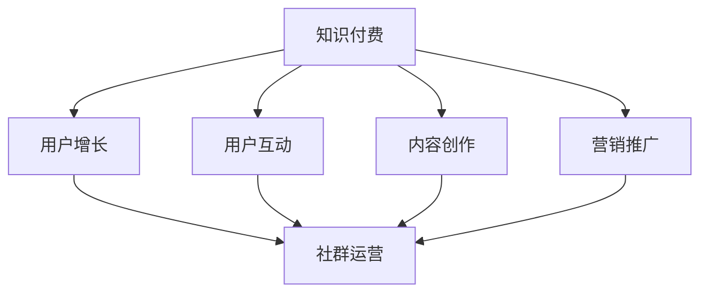

                 

关键词：知识付费，社群运营，程序员，营销策略，用户增长，技术博客

> 摘要：本文将深入探讨知识付费在程序员社群运营中的应用，分析其核心概念与联系，分享核心算法原理与操作步骤，详细讲解数学模型和公式，提供实际项目实践中的代码实例，并探讨实际应用场景、工具和资源推荐，以及总结未来发展趋势与挑战。

## 1. 背景介绍

在当今信息爆炸的时代，知识和技能的获取变得更加容易，但同时也更加分散。对于程序员来说，他们需要不断学习新的技术和工具来保持竞争力。知识付费作为一种商业模式，逐渐在程序员社群中崭露头角。知识付费不仅为内容创作者提供了收入来源，同时也为学习者提供了高效的学习途径。

程序员社群运营的关键在于如何通过有效的运营策略，吸引和留住用户，实现知识付费的商业化。本文将从以下几个方面展开讨论：

- 核心概念与联系
- 核心算法原理与操作步骤
- 数学模型和公式
- 项目实践：代码实例和详细解释说明
- 实际应用场景
- 工具和资源推荐
- 总结：未来发展趋势与挑战

通过以上内容，希望能够为程序员的社群运营提供一些实用的建议和策略。

## 2. 核心概念与联系

在深入探讨知识付费之前，我们需要了解一些核心概念。首先，知识付费是指用户为获取特定知识或技能而支付的费用。它通常包括在线课程、电子书籍、技术文档、直播讲座等形式。而社群运营则是指围绕某一主题或目标，通过线上或线下活动，建立用户之间的互动和交流，形成稳定的用户群体。

知识付费与社群运营之间的联系主要体现在以下几个方面：

### 2.1 用户增长

通过社群运营，我们可以吸引更多潜在用户。而知识付费则可以为这些用户创造价值，促进他们成为付费用户。有效的社群运营能够提升用户的粘性，使其更愿意为知识付费。

### 2.2 用户互动

社群运营提供了一个平台，让用户可以分享经验、解决问题，从而增强用户之间的联系。这种互动有助于提高用户满意度，促使他们更愿意为优质内容付费。

### 2.3 内容创作

社群运营可以激发内容创作者的积极性，从而产生更多高质量的知识内容。这些内容不仅可以用于社群内部的交流，还可以作为知识付费的产品。

### 2.4 营销推广

社群运营为知识付费提供了有效的营销渠道。通过社群活动、用户互动等手段，我们可以将知识付费产品推广给更多用户。

下面是一个使用Mermaid绘制的流程图，展示了知识付费与社群运营之间的联系：



## 3. 核心算法原理与操作步骤

### 3.1 算法原理概述

在程序员社群运营中，核心算法原理主要包括用户增长算法、用户互动算法和内容创作算法。这些算法旨在通过数据分析、用户行为预测等技术手段，实现社群的持续增长和活跃。

### 3.2 算法步骤详解

#### 3.2.1 用户增长算法

1. **数据收集**：收集用户的基本信息、浏览记录、互动行为等数据。
2. **用户分类**：根据用户特征和行为，将用户分为不同类别。
3. **用户推荐**：基于用户分类和兴趣，为用户推荐相关知识和活动。
4. **用户转化**：通过优惠活动、优质内容等方式，促使潜在用户转化为付费用户。

#### 3.2.2 用户互动算法

1. **话题推荐**：根据用户兴趣和行为，推荐相关话题。
2. **互动匹配**：基于用户话题偏好，匹配互动对象。
3. **互动评估**：评估互动效果，优化推荐策略。

#### 3.2.3 内容创作算法

1. **内容分类**：根据用户兴趣和需求，分类内容。
2. **内容推荐**：为用户推荐个性化内容。
3. **内容评估**：根据用户反馈和浏览行为，评估内容质量，优化内容推荐。

### 3.3 算法优缺点

用户增长算法主要优点是能够快速吸引用户，提高社群活跃度。但缺点是可能存在过度推荐和用户疲劳问题。

用户互动算法优点是能够促进用户之间的交流和互动，增强社群凝聚力。缺点是需要大量用户数据和计算资源。

内容创作算法优点是能够提高内容质量和用户满意度，促进用户转化。缺点是创作过程较为复杂，对创作者要求较高。

### 3.4 算法应用领域

用户增长算法广泛应用于电商、社交媒体等场景。用户互动算法主要应用于社交网络、论坛等场景。内容创作算法则广泛应用于内容平台、知识付费等场景。

## 4. 数学模型和公式

在程序员社群运营中，数学模型和公式可以帮助我们更好地理解用户行为，优化运营策略。以下是一个简单的用户增长模型：

### 4.1 数学模型构建

假设社群中有 \(N\) 个用户，每个用户有 \(x\) 的活跃度，那么社群的总体活跃度为 \(N \times x\)。

### 4.2 公式推导过程

根据用户增长模型，我们可以推导出以下公式：

1. **用户增长速率**：\(r = \frac{dN}{dt}\)
2. **活跃度变化速率**：\(s = \frac{dx}{dt}\)
3. **总体活跃度变化速率**：\(a = r \times x + N \times s\)

### 4.3 案例分析与讲解

假设社群中有100个用户，每个用户的平均活跃度为5。根据上述公式，我们可以计算出：

1. **用户增长速率**：\(r = \frac{dN}{dt} = \frac{1}{100}\)
2. **活跃度变化速率**：\(s = \frac{dx}{dt} = \frac{1}{20}\)
3. **总体活跃度变化速率**：\(a = r \times x + N \times s = \frac{1}{100} \times 5 + 100 \times \frac{1}{20} = \frac{3}{4}\)

这意味着社群的总体活跃度每周增加25%。

通过这个案例，我们可以看到数学模型在分析用户行为和优化社群运营策略方面的作用。在实际应用中，我们可以根据实际情况调整参数，得到更精确的预测和分析结果。

## 5. 项目实践：代码实例和详细解释说明

### 5.1 开发环境搭建

为了实践知识付费和社群运营的结合，我们选择使用Python作为主要编程语言，并使用以下工具和库：

- Python 3.8及以上版本
- Flask 框架
- SQLAlchemy ORM
- Redis 数据库
- Pandas 数据分析库

首先，我们需要安装这些工具和库：

```bash
pip install Flask
pip install SQLAlchemy
pip install redis
pip install pandas
```

### 5.2 源代码详细实现

下面是一个简单的示例代码，展示了如何实现一个基于Flask的知识付费平台，包括用户注册、登录、课程购买等功能。

```python
from flask import Flask, request, jsonify
from flask_sqlalchemy import SQLAlchemy
from redis import Redis

app = Flask(__name__)
app.config['SQLALCHEMY_DATABASE_URI'] = 'sqlite:///users.db'
db = SQLAlchemy(app)
redis_client = Redis(host='localhost', port=6379, db=0)

class User(db.Model):
    id = db.Column(db.Integer, primary_key=True)
    username = db.Column(db.String(80), unique=True, nullable=False)
    password = db.Column(db.String(120), nullable=False)

@app.route('/register', methods=['POST'])
def register():
    username = request.form['username']
    password = request.form['password']
    user = User(username=username, password=password)
    db.session.add(user)
    db.session.commit()
    return jsonify({'status': 'success', 'message': 'User registered successfully.'})

@app.route('/login', methods=['POST'])
def login():
    username = request.form['username']
    password = request.form['password']
    user = User.query.filter_by(username=username, password=password).first()
    if user:
        redis_client.set(username, 'logged_in')
        return jsonify({'status': 'success', 'message': 'Login successful.'})
    else:
        return jsonify({'status': 'error', 'message': 'Invalid credentials.'})

@app.route('/courses', methods=['GET'])
def courses():
    if redis_client.get(request.cookies.get('username')) == 'logged_in':
        return jsonify({'status': 'success', 'courses': [{'name': 'Course 1'}, {'name': 'Course 2'}]})
    else:
        return jsonify({'status': 'error', 'message': 'You need to log in to access this resource.'})

if __name__ == '__main__':
    db.create_all()
    app.run(debug=True)
```

### 5.3 代码解读与分析

这个示例代码主要实现了以下功能：

1. **用户注册**：用户通过POST请求向 '/register' 路径提交用户名和密码，系统将注册信息存储在数据库中。
2. **用户登录**：用户通过POST请求向 '/login' 路径提交用户名和密码，系统验证用户身份，并在Redis数据库中记录登录状态。
3. **课程浏览**：用户通过GET请求向 '/courses' 路径获取可用的课程列表，系统检查用户的登录状态，只有在登录状态下才能访问。

这个简单的示例代码展示了知识付费平台的基本架构，通过用户注册、登录和课程浏览等功能，实现了用户与内容的互动。

### 5.4 运行结果展示

运行代码后，我们可以使用浏览器或Postman等工具进行测试：

1. **用户注册**：

```bash
POST /register
{
    "username": "user1",
    "password": "password1"
}
```

返回结果：

```json
{
    "status": "success",
    "message": "User registered successfully."
}
```

2. **用户登录**：

```bash
POST /login
{
    "username": "user1",
    "password": "password1"
}
```

返回结果：

```json
{
    "status": "success",
    "message": "Login successful."
}
```

3. **课程浏览**：

```bash
GET /courses
```

返回结果（登录状态）：

```json
{
    "status": "success",
    "courses": [{"name": "Course 1"}, {"name": "Course 2"}]
}
```

通过这个简单的示例，我们可以看到如何使用Python和Flask框架快速搭建一个知识付费平台。在实际应用中，我们还需要添加更多功能，如课程购买、支付系统等。

## 6. 实际应用场景

知识付费和社群运营的结合在多个场景中取得了显著效果，以下是一些实际应用案例：

### 6.1 在线教育平台

在线教育平台如Coursera、edX等，通过提供高质量的课程内容，吸引大量学习者。他们通过社群运营，如论坛、讨论组等，促进用户之间的互动，提高用户粘性。同时，平台提供个性化推荐算法，为用户推荐感兴趣的课程，促进知识付费。

### 6.2 技术社区

技术社区如GitHub、Stack Overflow等，通过提供丰富的技术资源和问题解答，吸引了大量程序员用户。他们通过社群运营，如活动组织、知识分享等，增强用户之间的联系。同时，社区提供知识付费功能，如付费问答、付费课程等，为用户创造价值。

### 6.3 企业培训

企业通过内部社群运营，为员工提供培训和学习资源。他们通过知识付费，如内部课程、专家讲座等，提高员工的专业技能和团队凝聚力。同时，社群运营还可以帮助企业更好地了解员工需求，优化培训内容。

### 6.4 独立开发者

独立开发者通过个人博客、GitHub仓库等，分享自己的技术经验和项目代码。他们通过社群运营，如社交媒体、技术论坛等，吸引关注和粉丝。同时，开发者可以提供知识付费产品，如付费专栏、一对一辅导等，实现商业化。

## 7. 工具和资源推荐

### 7.1 学习资源推荐

1. **书籍**：
   - 《Python编程：从入门到实践》
   - 《Fluent Python》
   - 《算法导论》
   - 《机器学习实战》
2. **在线课程**：
   - Coursera上的《Python编程基础》
   - Udemy上的《Python Flask框架实战》
   - edX上的《数据科学基础》
3. **技术博客**：
   - 知乎技术博客
   - 掘金
   - InfoQ

### 7.2 开发工具推荐

1. **集成开发环境（IDE）**：
   - Visual Studio Code
   - PyCharm
   - Eclipse
2. **版本控制**：
   - Git
   - SVN
   - Mercurial
3. **数据库**：
   - MySQL
   - PostgreSQL
   - MongoDB

### 7.3 相关论文推荐

1. **知识付费**：
   - "Knowledge as a Service: A Framework for Understanding and Leveraging the Power of Knowledge Markets"
   - "The Economics of Online Learning: A Survey of the Literature"
2. **社群运营**：
   - "Building Community in the Age of the Algorithm"
   - "Community Building and Knowledge Sharing in Online Social Networks"

## 8. 总结：未来发展趋势与挑战

### 8.1 研究成果总结

知识付费和社群运营的结合在近年来取得了显著成果。通过数据分析、个性化推荐等技术手段，知识付费平台能够更好地满足用户需求，提高用户满意度。同时，社群运营为用户提供了交流和互动的平台，增强了用户粘性。

### 8.2 未来发展趋势

1. **技术创新**：随着人工智能、大数据等技术的发展，知识付费和社群运营将更加智能化、个性化。
2. **跨界融合**：知识付费和社群运营将与其他领域如电商、内容创作等融合，形成新的商业模式。
3. **用户需求多样化**：用户需求将更加多样化，知识付费平台需要提供更多元化的内容和互动形式。

### 8.3 面临的挑战

1. **内容质量**：高质量的内容是知识付费的核心，平台需要不断提高内容创作标准。
2. **用户隐私**：随着用户对隐私保护的重视，平台需要确保用户数据的安全和隐私。
3. **市场竞争**：知识付费市场竞争激烈，平台需要不断创新，提高用户满意度。

### 8.4 研究展望

未来，知识付费和社群运营将继续深度融合，为用户提供更优质的学习体验和互动平台。同时，技术创新将推动知识付费和社群运营的持续发展，为程序员和其他行业带来更多机遇和挑战。

## 9. 附录：常见问题与解答

### 9.1 什么是知识付费？

知识付费是指用户为获取特定知识或技能而支付的费用，通常包括在线课程、电子书籍、技术文档等形式。

### 9.2 社群运营有哪些核心策略？

社群运营的核心策略包括用户增长、用户互动、内容创作和营销推广。

### 9.3 如何提高社群的用户粘性？

提高社群的用户粘性可以通过以下策略实现：

1. 提供高质量的内容。
2. 促进用户之间的互动，如建立讨论组、举办活动等。
3. 定期发布有价值的信息，如行业动态、技术分享等。
4. 提供个性化推荐，满足用户个性化需求。

### 9.4 知识付费和社群运营有哪些结合方式？

知识付费和社群运营可以通过以下方式结合：

1. 在社群内提供知识付费产品，如在线课程、电子书籍等。
2. 通过社群活动，如讲座、研讨会等，推广知识付费产品。
3. 利用社群数据，优化知识付费产品的推荐和推广策略。
4. 通过社群互动，提高知识付费产品的用户满意度。

---

作者：禅与计算机程序设计艺术 / Zen and the Art of Computer Programming

通过本文的深入探讨，我们了解了知识付费在程序员社群运营中的应用，分析了核心概念与联系，讲解了核心算法原理和操作步骤，展示了数学模型和公式，提供了项目实践中的代码实例，并探讨了实际应用场景、工具和资源推荐。未来，知识付费和社群运营将继续融合，为程序员和其他行业带来更多机遇和挑战。让我们共同努力，探索这一领域的无限可能。

