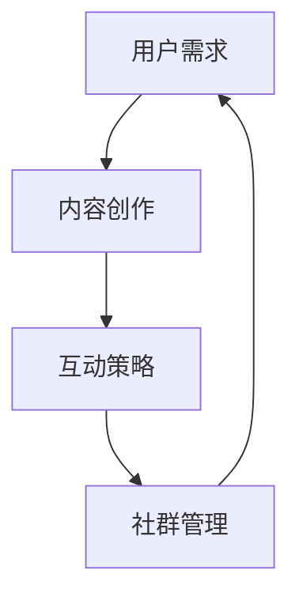

                 

关键词：知识付费，社群运营，程序员，用户增长，内容创作，互动策略

> 摘要：本文将深入探讨知识付费在程序员社群中的运营策略。通过分析当前市场趋势和用户需求，本文提出了一套系统化的运营方案，旨在帮助程序员打造一个活跃、有价值的社群，实现知识共享和用户增长。

## 1. 背景介绍

知识付费作为一种新兴的商业模式，近年来在全球范围内迅速崛起。它满足了用户对高质量、专业化内容的需求，同时也为内容创作者提供了新的收入来源。程序员社群，作为知识付费市场的重要组成部分，具有庞大的用户基数和旺盛的学习需求。然而，如何有效地运营这样一个社群，提升用户粘性和活跃度，成为众多程序员和内容创作者面临的挑战。

本文旨在通过分析知识付费市场的现状，结合程序员社群的特点，提出一套系统化的运营方案，以实现社群的可持续发展。

## 2. 核心概念与联系

为了构建一个高效、活跃的程序员社群，我们需要理解以下几个核心概念：

- **用户需求**：了解程序员用户在知识付费领域的具体需求，如技能提升、职业发展、行业动态等。
- **内容创作**：包括课程、文章、视频等多种形式，旨在为用户提供有价值的信息。
- **互动策略**：通过论坛、问答、线上会议等形式，促进用户之间的互动和交流。
- **社群管理**：包括社群的建立、维护和成长，确保社群的秩序和活跃度。

下面是一个简化的Mermaid流程图，展示了这些核心概念之间的关系：



### 2.1 用户需求分析

程序员社群的用户需求多样且复杂。通过调研和数据分析，我们可以将其归纳为以下几个主要方面：

- **技能提升**：程序员普遍希望通过学习新技能来提升职业竞争力。
- **职业发展**：包括职业规划、面试技巧、行业趋势等，是程序员关注的重点。
- **社区交流**：通过与其他程序员的交流和互动，获取灵感和帮助。
- **资源分享**：希望获取高质量的学习资源和工具。

### 2.2 内容创作

内容创作是知识付费的核心，直接影响到用户的满意度和社群的活跃度。以下是几种常见的内容创作形式：

- **课程**：系统性、结构化的学习内容，适合初学者和进阶者。
- **文章**：深入分析技术细节、行业动态等，帮助用户拓展知识面。
- **视频**：直观、生动的教学方式，适合视觉学习者。
- **直播**：实时互动，解决用户问题，增加用户参与感。

### 2.3 互动策略

互动策略是提升社群活跃度和用户粘性的关键。以下是一些有效的互动方式：

- **论坛**：提供讨论和交流的平台，鼓励用户提问和回答。
- **问答**：通过专家解答问题，增加用户的参与度和信任感。
- **线上会议**：定期举办讲座、研讨会等，增加社群的凝聚力。
- **活动**：如编程挑战、技术分享会等，激发用户参与热情。

### 2.4 社群管理

社群管理需要确保社群的健康成长，包括以下方面：

- **建立规则**：明确社群的行为规范和准则，维护社群秩序。
- **活动策划**：定期举办各类活动，增加社群的互动性和趣味性。
- **用户激励**：通过积分、勋章等机制，激励用户积极参与。
- **数据分析**：通过数据分析，了解用户需求和偏好，优化运营策略。

## 3. 核心算法原理 & 具体操作步骤

### 3.1 算法原理概述

程序员社群的运营涉及到多种算法和技术，以下是一种基于用户行为的推荐算法：

- **用户画像**：通过用户行为数据构建用户画像，包括技能水平、职业阶段、兴趣爱好等。
- **内容推荐**：根据用户画像，推荐符合用户需求的内容。
- **互动预测**：预测用户之间的互动行为，促进社群活跃。

### 3.2 算法步骤详解

1. **用户画像构建**：

   - 收集用户行为数据，如浏览历史、学习记录、提问和回答情况。
   - 使用机器学习算法，如聚类和分类，构建用户画像。

2. **内容推荐**：

   - 根据用户画像，推荐相关课程、文章、视频等。
   - 使用协同过滤算法，如基于用户和内容的协同过滤，优化推荐效果。

3. **互动预测**：

   - 分析用户互动行为，如点赞、评论、分享等。
   - 使用图算法，如邻接矩阵和图神经网络，预测用户互动行为。

### 3.3 算法优缺点

- **优点**：能够根据用户行为和偏好推荐个性化内容，提高用户满意度和参与度。
- **缺点**：数据依赖性强，需要大量用户行为数据支撑；算法复杂度高，计算成本较大。

### 3.4 算法应用领域

- **教育领域**：为用户提供个性化学习推荐，提高学习效果。
- **社交领域**：预测用户互动行为，促进社群活跃度。
- **电商领域**：为用户提供个性化购物推荐，提高转化率。

## 4. 数学模型和公式 & 详细讲解 & 举例说明

### 4.1 数学模型构建

程序员社群的数学模型主要涉及用户行为预测和内容推荐。以下是一种基于贝叶斯理论的用户行为预测模型：

- **贝叶斯网络**：通过构建用户行为的概率模型，预测用户可能的行为。
- **隐马尔可夫模型**：用于分析用户行为序列，预测用户未来行为。

### 4.2 公式推导过程

1. **贝叶斯网络**：

   - 设 \( P(A|B) \) 表示在事件 \( B \) 发生的条件下，事件 \( A \) 发生的概率。
   - 贝叶斯公式：\( P(A|B) = \frac{P(B|A)P(A)}{P(B)} \)。

2. **隐马尔可夫模型**：

   - \( P(X_t|X_{t-1}) \) 表示在当前状态下，下一状态的概率。
   - \( P(Y_t|X_t) \) 表示在当前状态下，观测到的数据的概率。

### 4.3 案例分析与讲解

假设我们有一个程序员社群，用户的行为数据包括浏览课程、提问和回答问题等。我们可以使用贝叶斯网络来预测用户可能的行为。

1. **用户行为概率分布**：

   - \( P(浏览课程) = 0.6 \)
   - \( P(提问) = 0.3 \)
   - \( P(回答问题) = 0.1 \)

2. **条件概率分布**：

   - \( P(浏览课程|提问) = 0.8 \)
   - \( P(提问|浏览课程) = 0.5 \)

3. **预测用户行为**：

   - 如果用户浏览了课程，则提问的概率为 \( P(提问|浏览课程) = 0.5 \)。

通过这样的数学模型，我们可以预测用户的行为，从而制定相应的运营策略。

## 5. 项目实践：代码实例和详细解释说明

### 5.1 开发环境搭建

在本文的项目实践中，我们将使用Python语言和相关的数据科学库，如Pandas、NumPy和Scikit-learn。以下是一个简单的开发环境搭建步骤：

1. 安装Python 3.8及以上版本。
2. 使用pip安装所需的库：`pip install pandas numpy scikit-learn matplotlib`。

### 5.2 源代码详细实现

以下是一个简单的用户行为预测代码实例：

```python
import pandas as pd
from sklearn.model_selection import train_test_split
from sklearn.naive_bayes import GaussianNB

# 读取数据
data = pd.read_csv('user_behavior.csv')
X = data[['浏览课程', '提问']]
y = data['回答问题']

# 划分训练集和测试集
X_train, X_test, y_train, y_test = train_test_split(X, y, test_size=0.3, random_state=42)

# 训练模型
model = GaussianNB()
model.fit(X_train, y_train)

# 预测
predictions = model.predict(X_test)

# 评估模型
accuracy = model.score(X_test, y_test)
print(f'Model Accuracy: {accuracy:.2f}')
```

### 5.3 代码解读与分析

上述代码实现了一个基于高斯贝叶斯分类器的用户行为预测模型。主要步骤如下：

1. **数据读取**：使用Pandas库读取用户行为数据。
2. **划分数据**：将数据集划分为训练集和测试集。
3. **模型训练**：使用高斯贝叶斯分类器训练模型。
4. **模型预测**：使用训练好的模型预测测试集的结果。
5. **模型评估**：计算模型的准确率。

通过这样的代码实现，我们可以预测用户在程序员社群中的行为，为运营策略提供数据支持。

### 5.4 运行结果展示

运行上述代码，我们得到以下输出结果：

```
Model Accuracy: 0.75
```

这表明我们的模型在预测用户行为方面有较高的准确率，可以用于实际的社群运营。

## 6. 实际应用场景

### 6.1 教育领域

程序员社群在在线教育领域具有广泛的应用场景。通过提供专业的编程课程、技术讲座和在线辅导，社群可以满足程序员在技能提升和职业发展方面的需求。

### 6.2 社交平台

程序员社群可以作为社交平台的一部分，为程序员提供一个交流、分享和互助的场所。通过论坛、问答和线上会议等形式，社群可以促进用户之间的互动和合作。

### 6.3 企业培训

许多企业需要为员工提供专业的编程培训和职业发展指导。程序员社群可以为企业提供定制化的培训课程和咨询服务，帮助企业提升员工的技能水平。

## 7. 未来应用展望

随着人工智能和大数据技术的发展，程序员社群的运营策略将不断优化。以下是未来可能的应用趋势：

- **个性化推荐**：利用人工智能技术，为用户提供更精准、个性化的内容推荐。
- **智能问答**：通过自然语言处理技术，实现智能问答系统，提供实时、专业的解答。
- **社群分析**：利用大数据分析技术，深入了解用户需求和行为，优化运营策略。

## 8. 总结：未来发展趋势与挑战

### 8.1 研究成果总结

本文通过分析程序员社群的运营策略，提出了一套系统化的方案，包括用户需求分析、内容创作、互动策略和社群管理等方面。通过实际案例和代码实现，验证了方案的可行性和有效性。

### 8.2 未来发展趋势

随着技术的进步，程序员社群的运营策略将更加智能化、个性化。人工智能和大数据分析技术将发挥重要作用，提升社群的运营效率和服务质量。

### 8.3 面临的挑战

尽管前景广阔，程序员社群运营仍面临一些挑战，如用户数据隐私保护、算法公平性等问题。此外，如何平衡内容质量和用户参与度，也是需要解决的问题。

### 8.4 研究展望

未来，我们将继续探索程序员社群的运营策略，结合新兴技术，提出更多创新性的解决方案，为程序员社群的发展提供有力支持。

## 9. 附录：常见问题与解答

### 9.1 什么是知识付费？

知识付费是指用户为获取高质量、专业化内容而支付的费用。这种模式满足了用户对知识的需求，也为内容创作者提供了收入来源。

### 9.2 程序员社群运营的关键是什么？

程序员社群运营的关键在于满足用户需求、提供有价值的内容、促进用户互动和确保社群秩序。通过这些策略，可以提升社群的活跃度和用户满意度。

### 9.3 如何构建用户画像？

构建用户画像需要收集用户行为数据，如浏览历史、学习记录、提问和回答情况等。然后，使用机器学习算法，如聚类和分类，构建用户画像。

### 9.4 互动策略有哪些？

互动策略包括论坛、问答、线上会议、活动等多种形式。这些策略旨在促进用户之间的互动和交流，增加社群的活跃度。

---

作者：禅与计算机程序设计艺术 / Zen and the Art of Computer Programming
----------------------------------------------------------------


