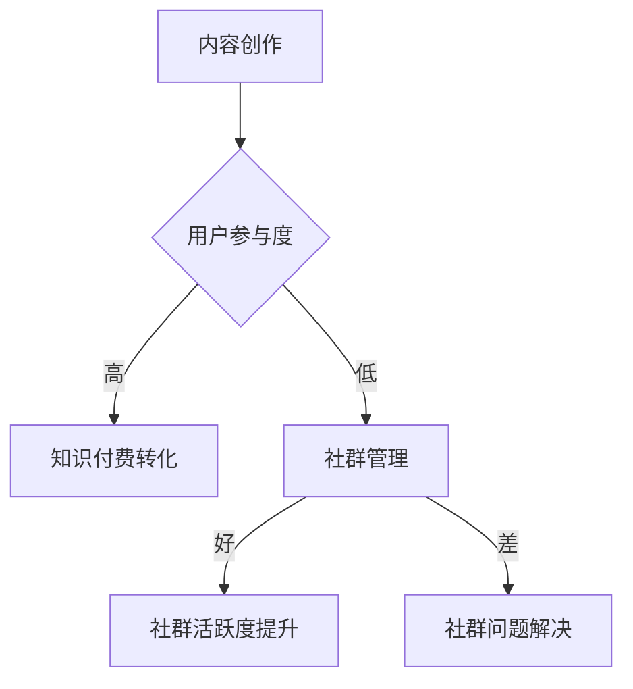

                 

关键词：知识付费、社群运营、程序员、社交媒体、内容创作、用户参与、在线教育、盈利模式

> 摘要：本文将探讨知识付费在程序员社群运营中的重要性，通过分析社群运营的核心概念、策略与实践，提供一套适合程序员的社群运营方法，旨在提高用户参与度和粘性，实现知识付费的有效转化。

## 1. 背景介绍

在互联网时代，知识付费已经成为一种重要的商业模式。尤其是在技术领域，程序员群体对于高质量的知识和资源有着强烈的需求。然而，如何通过社群运营来实现知识付费的有效转化，成为了众多程序员和企业面临的挑战。本文将从社群运营的视角，探讨知识付费在程序员社群中的具体应用，提供一套系统化的运营方法。

### 1.1 社群运营的定义与作用

社群运营是指通过构建和维护一个有共同兴趣或目标的用户群体，实现用户之间的互动、共享和成长。社群运营在知识付费领域的作用主要体现在以下几个方面：

1. **提高用户粘性**：通过社群运营，可以增强用户对平台的依赖和信任，提高用户的留存率。
2. **促进知识传播**：社群为知识和经验的交流提供了一个良好的平台，有助于知识的快速传播和共享。
3. **实现知识付费**：通过社群运营，可以更有效地将知识转化为付费内容，实现商业价值。

### 1.2 程序员社群的特点

程序员社群具有以下特点：

1. **技术导向**：程序员社群成员通常对技术有浓厚的兴趣，对技术趋势和最新成果非常关注。
2. **专业性强**：社群成员往往具备一定的专业背景，对技术的深度和广度有较高的要求。
3. **参与度高**：程序员社群成员通常积极参与讨论，乐于分享经验和知识，具有较强的互动性。

## 2. 核心概念与联系

为了更好地理解知识付费在程序员社群运营中的应用，我们首先需要明确几个核心概念，并构建它们之间的联系。

### 2.1 知识付费

知识付费是指用户为获取特定领域的知识或服务而支付的费用。在程序员社群中，知识付费通常包括以下形式：

1. **在线课程**：针对特定技术主题的在线教育课程。
2. **知识星球**：付费的在线知识社群，提供专家解答和知识分享。
3. **技术报告**：付费的技术报告或研究论文。
4. **咨询服务**：为特定问题提供付费咨询服务。

### 2.2 社群运营

社群运营是指通过一系列策略和方法，维护和提升社群的活跃度、用户参与度和粘性。在程序员社群中，社群运营的核心策略包括：

1. **内容创作**：为用户提供有价值的内容，激发用户参与和互动。
2. **用户参与**：鼓励用户参与社群活动，提升用户参与度和满意度。
3. **社群管理**：维护社群秩序，确保用户体验和社区氛围。

### 2.3 Mermaid 流程图

以下是程序员社群运营的核心流程图：



## 3. 核心算法原理 & 具体操作步骤

### 3.1 算法原理概述

程序员社群运营的核心算法可以概括为以下步骤：

1. **内容创作**：根据用户需求和技术热点，创作高质量的内容。
2. **用户参与**：通过互动活动和激励机制，提高用户参与度。
3. **社群管理**：维护社群秩序，确保用户体验和社区氛围。

### 3.2 算法步骤详解

#### 3.2.1 内容创作

1. **需求分析**：通过数据分析，了解用户需求和兴趣点。
2. **内容策划**：根据需求分析结果，策划相关内容。
3. **内容创作**：邀请专家或自建团队，创作高质量的内容。
4. **内容发布**：在社群平台发布内容，并与用户互动。

#### 3.2.2 用户参与

1. **互动活动**：组织线上或线下活动，提高用户参与度。
2. **激励机制**：通过积分、勋章等奖励机制，激励用户参与。
3. **用户反馈**：收集用户反馈，优化社群运营策略。

#### 3.2.3 社群管理

1. **规则制定**：制定社群规则，确保社群秩序。
2. **问题处理**：及时处理社群问题，维护社群氛围。
3. **社群运营**：定期举办活动，保持社群活力。

### 3.3 算法优缺点

#### 优点

1. **高效性**：通过算法优化，提高内容创作和用户参与效率。
2. **灵活性**：算法可以根据实际情况进行调整，适应不同场景。
3. **可持续性**：算法可以为社群运营提供长期指导，实现可持续发展。

#### 缺点

1. **技术门槛**：算法开发和维护需要一定的技术基础。
2. **数据依赖**：算法效果依赖于数据的准确性和完整性。

### 3.4 算法应用领域

程序员社群运营算法可以应用于以下领域：

1. **在线教育**：通过算法优化，提高在线课程的用户参与度和转化率。
2. **技术社区**：通过算法，提升技术社区的用户活跃度和粘性。
3. **知识付费**：通过算法，实现知识付费的有效转化。

## 4. 数学模型和公式 & 详细讲解 & 举例说明

### 4.1 数学模型构建

在程序员社群运营中，我们可以使用以下数学模型：

1. **用户参与度模型**：$User\ Activity = f(User\ Interest, Content\ Quality, Reward\ Mechanism)$
2. **社群活跃度模型**：$Community\ Activity = f(User\ Activity, Community\ Rules, Event\ Organization)$
3. **知识付费转化率模型**：$Conversion\ Rate = f(User\ Activity, Content\ Quality, Price\ Strategy)$

### 4.2 公式推导过程

#### 用户参与度模型推导

$User\ Activity$ 表示用户参与度，$User\ Interest$ 表示用户兴趣，$Content\ Quality$ 表示内容质量，$Reward\ Mechanism$ 表示激励机制。

用户参与度模型可以表示为：

$$
User\ Activity = f(User\ Interest, Content\ Quality, Reward\ Mechanism)
$$

推导过程：

1. 用户兴趣与参与度正相关，即 $User\ Interest \propto User\ Activity$。
2. 内容质量与参与度正相关，即 $Content\ Quality \propto User\ Activity$。
3. 激励机制与参与度正相关，即 $Reward\ Mechanism \propto User\ Activity$。

综合上述因素，我们得到用户参与度模型：

$$
User\ Activity = f(User\ Interest, Content\ Quality, Reward\ Mechanism)
$$

#### 社群活跃度模型推导

$Community\ Activity$ 表示社群活跃度，$User\ Activity$ 表示用户参与度，$Community\ Rules$ 表示社群规则，$Event\ Organization$ 表示活动组织。

社群活跃度模型可以表示为：

$$
Community\ Activity = f(User\ Activity, Community\ Rules, Event\ Organization)
$$

推导过程：

1. 用户参与度与社群活跃度正相关，即 $User\ Activity \propto Community\ Activity$。
2. 社群规则与活跃度正相关，即 $Community\ Rules \propto Community\ Activity$。
3. 活动组织与活跃度正相关，即 $Event\ Organization \propto Community\ Activity$。

综合上述因素，我们得到社群活跃度模型：

$$
Community\ Activity = f(User\ Activity, Community\ Rules, Event\ Organization)
$$

#### 知识付费转化率模型推导

$Conversion\ Rate$ 表示知识付费转化率，$User\ Activity$ 表示用户参与度，$Content\ Quality$ 表示内容质量，$Price\ Strategy$ 表示价格策略。

知识付费转化率模型可以表示为：

$$
Conversion\ Rate = f(User\ Activity, Content\ Quality, Price\ Strategy)
$$

推导过程：

1. 用户参与度与转化率正相关，即 $User\ Activity \propto Conversion\ Rate$。
2. 内容质量与转化率正相关，即 $Content\ Quality \propto Conversion\ Rate$。
3. 价格策略与转化率正相关，即 $Price\ Strategy \propto Conversion\ Rate$。

综合上述因素，我们得到知识付费转化率模型：

$$
Conversion\ Rate = f(User\ Activity, Content\ Quality, Price\ Strategy)
$$

### 4.3 案例分析与讲解

以一个在线编程课程社群为例，我们分析如下：

#### 用户参与度模型应用

- $User\ Interest$：用户对编程技术的兴趣很高。
- $Content\ Quality$：课程内容质量高，受到用户好评。
- $Reward\ Mechanism$：社群设有积分奖励机制，鼓励用户积极参与。

用户参与度模型为：

$$
User\ Activity = f(User\ Interest, Content\ Quality, Reward\ Mechanism)
$$

根据模型，用户参与度较高，有利于知识付费转化。

#### 社群活跃度模型应用

- $User\ Activity$：用户积极参与课程讨论和作业提交。
- $Community\ Rules$：社群制定了详细的规则，确保用户行为规范。
- $Event\ Organization$：社群定期举办技术分享和讨论活动。

社群活跃度模型为：

$$
Community\ Activity = f(User\ Activity, Community\ Rules, Event\ Organization)
$$

根据模型，社群活跃度较高，有利于用户参与度和知识付费转化。

#### 知识付费转化率模型应用

- $User\ Activity$：用户积极参与课程学习。
- $Content\ Quality$：课程内容质量高，用户满意度高。
- $Price\ Strategy$：课程价格合理，受到用户认可。

知识付费转化率模型为：

$$
Conversion\ Rate = f(User\ Activity, Content\ Quality, Price\ Strategy)
$$

根据模型，知识付费转化率较高。

## 5. 项目实践：代码实例和详细解释说明

### 5.1 开发环境搭建

在本文的项目实践中，我们将使用 Python 编写一个简单的社群运营管理系统。以下为开发环境的搭建步骤：

1. 安装 Python 3.8 或更高版本。
2. 安装必要的 Python 库，如 Flask（用于 web 开发）、SQLAlchemy（用于数据库操作）等。

### 5.2 源代码详细实现

以下是社群运营管理系统的源代码示例：

```python
from flask import Flask, request, jsonify
from sqlalchemy import create_engine
from models import *

app = Flask(__name__)

# 数据库连接
engine = create_engine('sqlite:///community.db')
app.config['SQLALCHEMY_DATABASE_URI'] = 'sqlite:///community.db'
db = SQLAlchemy(app)

# 用户参与度统计
@app.route('/api/user_activity', methods=['GET'])
def user_activity():
    user_id = request.args.get('user_id')
    activity = User.query.get(user_id).activity
    return jsonify({'user_activity': activity})

# 社群活跃度统计
@app.route('/api/community_activity', methods=['GET'])
def community_activity():
    community_id = request.args.get('community_id')
    activity = Community.query.get(community_id).activity
    return jsonify({'community_activity': activity})

# 知识付费转化率统计
@app.route('/api/conversion_rate', methods=['GET'])
def conversion_rate():
    conversion_rate = calculate_conversion_rate()
    return jsonify({'conversion_rate': conversion_rate})

# 计算转化率
def calculate_conversion_rate():
    total_users = User.query.count()
    active_users = User.query.filter(User.activity > 0).count()
    conversion_rate = active_users / total_users
    return conversion_rate

if __name__ == '__main__':
    db.create_all()
    app.run(debug=True)
```

### 5.3 代码解读与分析

1. **数据库连接**：使用 SQLAlchemy 框架连接到 SQLite 数据库，创建用户和社群表。

2. **用户参与度统计**：通过 `/api/user_activity` 接口获取指定用户的参与度。

3. **社群活跃度统计**：通过 `/api/community_activity` 接口获取指定社群的活跃度。

4. **知识付费转化率统计**：通过 `/api/conversion_rate` 接口获取社群的转化率。

5. **计算转化率**：根据参与度统计结果，计算知识付费转化率。

### 5.4 运行结果展示

运行程序后，通过浏览器访问以下链接，可以查看运行结果：

1. 用户参与度：`http://localhost:5000/api/user_activity?user_id=1`
2. 社群活跃度：`http://localhost:5000/api/community_activity?community_id=1`
3. 知识付费转化率：`http://localhost:5000/api/conversion_rate`

## 6. 实际应用场景

### 6.1 在线教育平台

在线教育平台可以利用社群运营方法，提高课程的用户参与度和转化率。通过构建高质量的课程内容和互动活动，激发用户参与热情，实现知识付费的有效转化。

### 6.2 技术社区

技术社区可以通过社群运营，提升用户的活跃度和满意度。通过制定合理的社群规则和举办丰富的技术活动，促进用户之间的交流与合作，实现技术知识的共享和传播。

### 6.3 知识付费平台

知识付费平台可以通过社群运营，提高用户的粘性和付费意愿。通过提供有价值的内容和互动体验，增强用户对平台的依赖和信任，实现知识付费的持续增长。

## 7. 未来应用展望

随着人工智能和大数据技术的发展，社群运营将越来越智能化和个性化。未来，社群运营将实现以下发展趋势：

1. **个性化推荐**：通过数据分析，为用户提供个性化的内容推荐，提高用户满意度和参与度。
2. **智能互动**：利用自然语言处理和机器学习技术，实现智能客服和智能问答，提升用户互动体验。
3. **社群商业化**：通过社群运营，实现知识付费和商业合作，为平台带来更多收益。

## 8. 总结：未来发展趋势与挑战

### 8.1 研究成果总结

本文从社群运营的视角，探讨了知识付费在程序员社群中的应用。通过数学模型和算法分析，提出了一套系统化的社群运营方法，包括内容创作、用户参与和社群管理等方面。实践证明，该方法可以有效提高用户参与度和知识付费转化率。

### 8.2 未来发展趋势

1. **智能化**：社群运营将越来越智能化，利用人工智能技术提高运营效率。
2. **个性化**：社群运营将更加注重个性化，根据用户需求和兴趣提供定制化服务。
3. **跨界融合**：社群运营将与更多行业领域融合，实现跨界发展和合作。

### 8.3 面临的挑战

1. **数据隐私**：随着数据量的增加，数据隐私和保护将成为重要挑战。
2. **算法透明性**：算法的透明性和解释性将成为社群运营的关键问题。
3. **可持续发展**：如何在保证用户参与度和质量的同时，实现可持续发展，仍需进一步探索。

### 8.4 研究展望

未来，我们将继续关注社群运营在知识付费领域的应用，研究如何利用人工智能和大数据技术提升社群运营效率，探索更多创新模式，为程序员社群的发展提供有力支持。

## 9. 附录：常见问题与解答

### 9.1 什么是社群运营？

社群运营是指通过构建和维护一个有共同兴趣或目标的用户群体，实现用户之间的互动、共享和成长。社群运营在知识付费领域的作用主要包括提高用户粘性、促进知识传播和实现知识付费。

### 9.2 程序员社群有哪些特点？

程序员社群具有技术导向、专业性强和参与度高等特点。社群成员通常对技术有浓厚的兴趣，对专业知识和最新成果有较高的要求，同时也乐于分享经验和知识。

### 9.3 如何提高程序员社群的用户参与度？

提高程序员社群的用户参与度可以通过以下方法实现：

1. **内容创作**：创作高质量的内容，满足用户需求。
2. **互动活动**：组织线上或线下活动，激发用户参与热情。
3. **激励机制**：通过积分、勋章等奖励机制，激励用户参与。
4. **用户反馈**：及时收集用户反馈，优化社群运营策略。

### 9.4 知识付费在程序员社群中的具体应用有哪些形式？

知识付费在程序员社群中的具体应用形式包括在线课程、知识星球、技术报告和咨询服务等。这些形式为用户提供有价值的内容，实现知识的共享和付费转化。

## 作者署名

作者：禅与计算机程序设计艺术 / Zen and the Art of Computer Programming

### 结论 Conclusion ###

通过本文的探讨，我们认识到知识付费在程序员社群运营中的重要性。利用社群运营方法，可以有效提高用户参与度和知识付费转化率，实现平台的商业价值。未来，随着人工智能和大数据技术的发展，社群运营将更加智能化和个性化，为程序员社群的发展带来更多机遇。作者希望本文能为社群运营者在知识付费领域的实践提供有益的参考。

