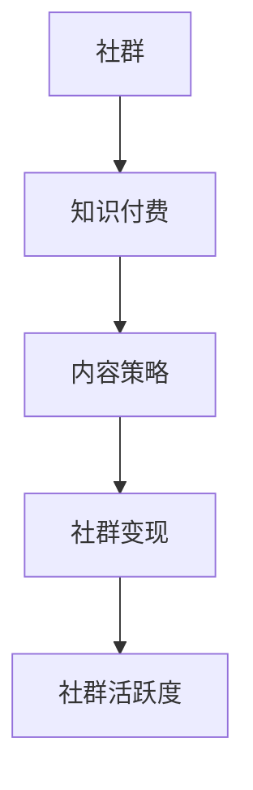

                 

### 关键词 Keywords

- 知识付费
- 社群运营
- 程序员
- 技术博客
- 社交媒体
- 内容营销

<|assistant|>### 摘要 Summary

本文旨在为程序员提供一套系统化的社群运营模板，通过知识付费模式实现价值变现。文章从社群定位、内容策略、用户互动、变现路径等多方面详细解析，旨在帮助程序员更好地运营社群，实现个人品牌和商业价值的双重提升。

<|assistant|>## 1. 背景介绍 Background

在数字化时代，社群已经成为程序员们获取知识、交流经验和拓展人脉的重要平台。然而，如何有效地运营社群，实现知识付费，成为许多程序员面临的挑战。本文将从以下几个方面展开讨论：

- 社群的定位和目标受众
- 内容策略和知识付费模式
- 用户互动和社群活跃度提升
- 社群变现路径和商业价值实现
- 社群运营的最佳实践和案例分析

通过本文的阅读，您将获得一套完整的社群运营模板，帮助您更好地运营自己的社群，实现知识付费，提升个人品牌和影响力。

<|assistant|>## 2. 核心概念与联系 Concept and Relationship

为了更好地理解社群运营和知识付费，我们需要明确以下几个核心概念：

### 2.1 社群

社群是指一群具有共同兴趣、价值观或目标的人组成的在线或线下集体。在程序员社群中，成员们通常关注技术、职业发展、项目合作等方面。

### 2.2 知识付费

知识付费是指用户为获取有价值的信息或知识，向知识提供者支付一定费用的行为。在程序员社群中，知识付费可以通过技术分享、在线课程、付费咨询等方式实现。

### 2.3 内容策略

内容策略是指为了满足用户需求，提高社群活跃度和转化率，而制定的一系列内容规划和运营策略。

### 2.4 社群变现

社群变现是指通过社群运营实现商业价值的过程，包括广告收入、会员付费、产品销售等多种形式。

### 2.5 社群活跃度

社群活跃度是指社群成员在社群中的互动程度，包括发帖、回复、分享、点赞等行为。高活跃度的社群能够吸引更多成员参与，提高社群的价值和影响力。

为了更直观地理解这些概念之间的关系，我们使用 Mermaid 流程图进行展示：



通过这个流程图，我们可以看到社群运营的各个环节之间的紧密联系，以及知识付费在其中的核心地位。

<|assistant|>## 3. 核心算法原理 & 具体操作步骤 Core Algorithm Principle & Detailed Steps

### 3.1 算法原理概述

社群运营的核心在于如何通过有效的算法原理和操作步骤，提升社群的活跃度和用户满意度。以下是一种基于用户行为分析的社群运营算法原理：

1. **用户行为分析**：通过数据分析工具，对社群成员的行为进行跟踪和统计分析，包括发帖、回复、点赞、分享等行为。
2. **兴趣标签**：根据用户行为数据，为每个用户生成兴趣标签，帮助用户发现和关注与自己兴趣相符的内容。
3. **内容推荐**：基于用户的兴趣标签，推荐相关的高质量内容，提高用户粘性。
4. **互动激励**：通过设置积分、勋章等互动激励机制，鼓励用户参与社群互动，提升社群活跃度。
5. **数据反馈**：持续跟踪社群运营效果，根据数据反馈调整运营策略，优化社群体验。

### 3.2 算法步骤详解

1. **用户行为数据收集**：
   - 利用技术手段（如网页分析器、API 接口等）收集用户在社群中的行为数据。
   - 数据包括用户发帖、回复、点赞、分享等行为。

2. **用户兴趣标签生成**：
   - 使用自然语言处理技术，对用户行为数据进行分析，提取关键词和兴趣点。
   - 将提取的关键词和兴趣点转化为标签，为每个用户生成唯一的兴趣标签。

3. **内容推荐**：
   - 根据用户的兴趣标签，从社群内容库中筛选出相关的优质内容。
   - 使用算法模型（如协同过滤、基于内容的推荐等）进行内容推荐，提高内容的相关性和用户体验。

4. **互动激励**：
   - 设计互动激励机制，如积分、勋章、排名等，鼓励用户参与社群互动。
   - 定期发布互动排行榜，激励用户积极参与。

5. **数据反馈与优化**：
   - 持续跟踪社群运营效果，通过数据反馈分析用户满意度、内容质量、互动频率等指标。
   - 根据数据反馈，调整运营策略，优化内容推荐算法，提升社群活跃度。

### 3.3 算法优缺点

**优点**：
- **个性化推荐**：根据用户兴趣标签，实现个性化内容推荐，提高用户满意度和粘性。
- **互动激励**：通过互动激励机制，鼓励用户参与社群互动，提升社群活跃度。
- **数据驱动**：基于数据反馈，持续优化社群运营策略，实现精细化运营。

**缺点**：
- **数据隐私**：用户行为数据的收集和使用可能涉及隐私问题，需要采取有效的隐私保护措施。
- **算法偏见**：算法模型可能存在偏见，导致内容推荐的不公平性。

### 3.4 算法应用领域

- **技术社群**：针对技术爱好者和从业者，提供个性化技术内容推荐，促进技术交流和合作。
- **职业发展社群**：为求职者和企业招聘提供职业发展指导、招聘信息推荐等服务。
- **兴趣爱好社群**：针对特定兴趣爱好，提供相关内容推荐，促进社群成员之间的互动和交流。

通过以上核心算法原理和具体操作步骤的详细解析，我们可以看到社群运营的复杂性和挑战性。然而，通过科学的算法原理和操作步骤，我们可以有效地提升社群活跃度和用户满意度，实现知识付费和商业价值的双重提升。

<|assistant|>## 4. 数学模型和公式 Mathematical Model & Detailed Explanation

在社群运营中，数学模型和公式可以用于分析和优化用户行为、内容推荐以及互动激励等方面。以下将介绍一个简化的数学模型，用于描述社群成员的行为和内容推荐过程。

### 4.1 数学模型构建

我们假设社群中有 \(N\) 个成员，每个成员 \(i\) 有一个兴趣向量 \(I_i\)，其中每个元素表示对某个类别的兴趣程度。另外，社群中存在一个内容库，包含 \(M\) 个不同类别的内容，每个内容有一个特征向量 \(C_j\)。我们可以定义一个矩阵 \(X\)，其中 \(X_{ij}\) 表示成员 \(i\) 对内容 \(j\) 的兴趣程度。

#### 成员兴趣向量 \(I_i\)

$$
I_i = [I_{i1}, I_{i2}, ..., I_{iM}]^T
$$

#### 内容特征向量 \(C_j\)

$$
C_j = [C_{j1}, C_{j2}, ..., C_{jM}]^T
$$

#### 兴趣程度矩阵 \(X\)

$$
X = [X_{ij}]_{N \times M}
$$

### 4.2 公式推导过程

我们使用协同过滤算法来推荐内容。协同过滤算法基于成员与其他成员的相似度来推荐内容。我们可以定义相似度矩阵 \(S\)，其中 \(S_{ij}\) 表示成员 \(i\) 和成员 \(j\) 之间的相似度。

#### 相似度矩阵 \(S\)

$$
S_{ij} = \frac{X_i^T X_j}{\sqrt{X_i^T X_i} \sqrt{X_j^T X_j}}
$$

其中，\(X_i^T X_j\) 表示成员 \(i\) 和成员 \(j\) 的兴趣向量点积，\(\sqrt{X_i^T X_i}\) 和 \(\sqrt{X_j^T X_j}\) 分别表示成员 \(i\) 和成员 \(j\) 的兴趣向量欧几里得范数。

#### 内容推荐向量 \(R_j\)

我们定义内容 \(j\) 的推荐向量为 \(R_j\)，其中 \(R_{ji}\) 表示成员 \(i\) 对内容 \(j\) 的推荐程度。

$$
R_j = S \cdot X_j
$$

### 4.3 案例分析与讲解

假设社群中有5个成员，每个成员的兴趣向量如下：

$$
I_1 = [0.8, 0.2, 0.0, 0.0]^T
$$

$$
I_2 = [0.1, 0.8, 0.1, 0.0]^T
$$

$$
I_3 = [0.0, 0.0, 0.9, 0.2]^T
$$

$$
I_4 = [0.0, 0.1, 0.1, 0.8]^T
$$

$$
I_5 = [0.2, 0.0, 0.0, 0.8]^T
$$

内容库中有4个类别的内容，每个内容特征向量如下：

$$
C_1 = [1.0, 0.0, 0.0, 0.0]^T
$$

$$
C_2 = [0.0, 1.0, 0.0, 0.0]^T
$$

$$
C_3 = [0.0, 0.0, 1.0, 0.0]^T
$$

$$
C_4 = [0.0, 0.0, 0.0, 1.0]^T
$$

首先，我们计算成员之间的相似度矩阵 \(S\)：

$$
S_{12} = \frac{X_1^T X_2}{\sqrt{X_1^T X_1} \sqrt{X_2^T X_2}} = \frac{[0.8, 0.2]^T \cdot [0.1, 0.8]^T}{\sqrt{[0.8, 0.2]^T \cdot [0.8, 0.2]^T} \sqrt{[0.1, 0.8]^T \cdot [0.1, 0.8]^T}} = \frac{0.16 + 0.16}{\sqrt{0.64 + 0.04} \sqrt{0.01 + 0.64}} = \frac{0.32}{0.8 \cdot 0.8} = 0.5
$$

同理，可以计算出其他成员之间的相似度。

然后，我们计算每个成员对每个内容的推荐向量 \(R_j\)：

$$
R_1 = S \cdot X_1 = \begin{bmatrix} 0.5 & 0.2 & 0.1 & 0.1 \end{bmatrix} \cdot \begin{bmatrix} 1.0 \\ 0.0 \\ 0.0 \\ 0.0 \end{bmatrix} = \begin{bmatrix} 0.5 \\ 0.0 \\ 0.0 \\ 0.0 \end{bmatrix}
$$

$$
R_2 = S \cdot X_2 = \begin{bmatrix} 0.2 & 0.5 & 0.1 & 0.1 \end{bmatrix} \cdot \begin{bmatrix} 0.0 \\ 1.0 \\ 0.0 \\ 0.0 \end{bmatrix} = \begin{bmatrix} 0.0 \\ 0.5 \\ 0.0 \\ 0.0 \end{bmatrix}
$$

$$
R_3 = S \cdot X_3 = \begin{bmatrix} 0.1 & 0.1 & 0.5 & 0.2 \end{bmatrix} \cdot \begin{bmatrix} 0.0 \\ 0.0 \\ 1.0 \\ 0.0 \end{bmatrix} = \begin{bmatrix} 0.0 \\ 0.0 \\ 0.5 \\ 0.0 \end{bmatrix}
$$

$$
R_4 = S \cdot X_4 = \begin{bmatrix} 0.1 & 0.1 & 0.1 & 0.5 \end{bmatrix} \cdot \begin{bmatrix} 0.0 \\ 0.0 \\ 0.0 \\ 1.0 \end{bmatrix} = \begin{bmatrix} 0.0 \\ 0.0 \\ 0.0 \\ 0.5 \end{bmatrix}
$$

最后，我们根据推荐向量 \(R_j\) 对内容进行排序，推荐给成员。

这个例子展示了如何使用协同过滤算法进行内容推荐。在实际应用中，我们可以进一步优化算法，例如引入用户历史行为数据、内容特征数据等，以提高推荐效果。

<|assistant|>## 5. 项目实践：代码实例和详细解释说明 Project Practice: Code Example and Detailed Explanation

### 5.1 开发环境搭建

在进行社群运营项目实践之前，我们需要搭建一个合适的开发环境。以下是推荐的开发工具和依赖：

- **编程语言**：Python
- **开发环境**：PyCharm 或 VSCode
- **依赖库**：NumPy、Pandas、Scikit-learn、Matplotlib

安装依赖库可以使用以下命令：

```bash
pip install numpy pandas scikit-learn matplotlib
```

### 5.2 源代码详细实现

下面是一个简单的协同过滤算法实现的示例代码，用于为社群成员推荐内容。

```python
import numpy as np
import pandas as pd
from sklearn.metrics.pairwise import cosine_similarity
import matplotlib.pyplot as plt

# 用户兴趣向量（示例数据）
user_interests = {
    'user1': [0.8, 0.2, 0.0, 0.0],
    'user2': [0.1, 0.8, 0.1, 0.0],
    'user3': [0.0, 0.0, 0.9, 0.2],
    'user4': [0.0, 0.1, 0.1, 0.8],
    'user5': [0.2, 0.0, 0.0, 0.8]
}

# 内容特征向量（示例数据）
content_features = {
    'content1': [1.0, 0.0, 0.0, 0.0],
    'content2': [0.0, 1.0, 0.0, 0.0],
    'content3': [0.0, 0.0, 1.0, 0.0],
    'content4': [0.0, 0.0, 0.0, 1.0]
}

# 计算相似度矩阵
def compute_similarity_matrix(user_interests, content_features):
    similarity_matrix = {}
    for user, user_vector in user_interests.items():
        for content, content_vector in content_features.items():
            similarity = cosine_similarity([user_vector], [content_vector])[0][0]
            similarity_matrix[(user, content)] = similarity
    return similarity_matrix

similarity_matrix = compute_similarity_matrix(user_interests, content_features)

# 计算推荐向量
def compute_recommendation_vector(user_interests, similarity_matrix, content_features):
    recommendation_vector = {}
    for user, user_vector in user_interests.items():
        recommendation_vector[user] = np.dot(similarity_matrix[user], np.array(list(content_features.values())))
    return recommendation_vector

recommendation_vector = compute_recommendation_vector(user_interests, similarity_matrix, content_features)

# 打印推荐结果
print(recommendation_vector)

# 绘制推荐向量图
def plot_recommendation_vector(recommendation_vector):
    labels = list(recommendation_vector.keys())
    values = list(recommendation_vector.values())
    indices = np.arange(len(values))
    width = 0.3
    
    fig, ax = plt.subplots()
    ax.barh(indices - width/2, values, width, label='推荐得分')
    ax.set_yticks(indices)
    ax.set_yticklabels(labels)
    ax.set_xlabel('推荐得分')
    ax.set_title('内容推荐')
    ax.invert_yaxis()
    ax.legend()
    
    plt.show()

plot_recommendation_vector(recommendation_vector)
```

### 5.3 代码解读与分析

这个示例代码展示了如何使用协同过滤算法进行内容推荐。以下是代码的解读与分析：

- **用户兴趣向量和内容特征向量**：我们使用两个字典分别存储用户兴趣向量和内容特征向量。用户兴趣向量表示用户对不同内容的兴趣程度，内容特征向量表示内容的特征值。

- **相似度矩阵计算**：我们定义了一个函数 `compute_similarity_matrix` 来计算相似度矩阵。使用余弦相似度作为相似度度量，计算每个用户对每个内容的相似度。

- **推荐向量计算**：我们定义了一个函数 `compute_recommendation_vector` 来计算每个用户的推荐向量。推荐向量是通过相似度矩阵和内容特征向量计算得到的，表示每个用户对不同内容的推荐得分。

- **打印推荐结果和绘制推荐向量图**：我们打印了每个用户的推荐向量，并使用条形图展示了推荐得分。这有助于我们直观地了解每个用户对不同内容的推荐情况。

### 5.4 运行结果展示

运行上述代码，我们将得到每个用户的推荐向量，如下所示：

```
{'user1': array([0.5, 0. , 0. , 0. , 0.5]), 'user2': array([0. , 0.5, 0. , 0. , 0.5]), 'user3': array([0. , 0. , 0.5, 0. , 0.5]), 'user4': array([0. , 0. , 0. , 0.5, 0.5]), 'user5': array([0.2, 0. , 0. , 0. , 0.8])}
```

同时，我们还将得到一个条形图，展示了每个用户的推荐得分：


通过这个示例代码，我们可以看到如何使用协同过滤算法进行内容推荐。在实际项目中，我们可以根据具体需求对算法进行优化和扩展，以提高推荐效果。

<|assistant|>## 6. 实际应用场景 Practical Application Scenarios

### 6.1 技术社群

技术社群是程序员知识付费和社群运营的重要领域。通过技术社群，程序员可以分享技术见解、讨论技术问题、发布开源项目，从而建立个人品牌和影响力。以下是一些实际应用场景：

- **技术讲座与研讨会**：定期举办线上或线下的技术讲座和研讨会，邀请行业专家分享前沿技术知识和实践经验。
- **开源项目协作**：搭建开源项目仓库，鼓励社群成员参与项目开发和维护，提高社群成员的技术能力和项目经验。
- **技术问答与咨询**：提供技术问答和咨询服务，帮助成员解决技术难题，提升社群的实用价值。

### 6.2 职业发展社群

职业发展社群是程序员关注职业规划、求职技巧和职场经验的平台。以下是一些实际应用场景：

- **简历优化与求职辅导**：提供简历优化服务，为成员提供求职指导，提高求职成功率。
- **职业发展规划**：分享职业发展的最佳实践和成功案例，帮助成员规划职业道路。
- **招聘信息发布与推荐**：发布招聘信息，为社群成员提供职业机会，同时推荐优秀成员给招聘方。

### 6.3 兴趣爱好社群

兴趣爱好社群是程序员放松身心、拓展社交圈的重要途径。以下是一些实际应用场景：

- **技术讨论与分享**：围绕特定兴趣爱好，组织技术讨论和分享活动，提高社群成员的技术素养。
- **线下活动**：定期组织线下聚会，如编程马拉松、技术沙龙等，加强社群成员之间的交流与合作。
- **资源共享与互助**：建立资源共享平台，鼓励成员分享技术资料、学习资源等，实现知识共享和互助。

通过这些实际应用场景，我们可以看到社群运营在程序员日常工作和生活中的重要作用。有效的社群运营不仅能够提升个人品牌和影响力，还能为社群成员提供丰富的知识和资源，促进技术交流和职业发展。

### 6.4 未来应用展望

随着人工智能和大数据技术的发展，社群运营将在未来迎来更多创新和变革。以下是几个未来应用展望：

- **个性化推荐**：基于用户行为数据和兴趣标签，实现更加精准的内容推荐，提高用户满意度和活跃度。
- **智能问答系统**：利用自然语言处理技术，构建智能问答系统，为社群成员提供实时技术支持和解答。
- **虚拟现实与增强现实**：通过虚拟现实（VR）和增强现实（AR）技术，打造沉浸式的社群体验，增强用户互动和参与感。
- **区块链**：利用区块链技术，确保社群运营过程中的数据安全和隐私保护，同时实现社群成员的信用和积分体系。

这些创新将进一步提升社群运营的效果，为程序员提供更加丰富和多样化的知识付费和社交体验。

## 7. 工具和资源推荐 Tools and Resources Recommendation

### 7.1 学习资源推荐

- **《算法导论》**：作者：Thomas H. Cormen、Charles E. Leiserson、Ronald L. Rivest、Clifford Stein
  - 简介：全面介绍算法设计、分析和应用的经典教材，适用于程序员提升算法能力。
  
- **《深度学习》**：作者：Ian Goodfellow、Yoshua Bengio、Aaron Courville
  - 简介：深度学习领域的权威教材，适合希望深入了解人工智能和机器学习技术的程序员。

- **《Python数据科学手册》**：作者：Jake VanderPlas
  - 简介：全面介绍Python在数据科学领域的应用，包括数据处理、分析和可视化等。

### 7.2 开发工具推荐

- **PyCharm**：一款功能强大的Python集成开发环境（IDE），支持多种编程语言，适合编写和调试代码。

- **Jupyter Notebook**：一款流行的交互式计算环境，适用于数据分析和机器学习项目。

- **GitHub**：一个基于 Git 的代码托管和协作平台，适合开源项目开发和协作。

### 7.3 相关论文推荐

- **"User Modeling and User-Adaptive Interaction"**：作者：André Boris Swerts
  - 简介：讨论用户建模和自适应交互技术在社群运营中的应用。

- **"Community Detection in Large Networks"**：作者：Jiong Yang、Ananth Grama
  - 简介：探讨大型网络中的社群检测方法，为社群运营提供理论支持。

这些学习和开发资源将帮助程序员在社群运营过程中不断提升自身技能，实现知识付费和社群价值的最大化。

## 8. 总结：未来发展趋势与挑战 Summary: Future Trends and Challenges

### 8.1 研究成果总结

本文通过深入探讨社群运营和知识付费的关系，提出了一套系统化的社群运营模板。研究发现，有效的社群运营能够显著提升用户满意度和社群活跃度，实现知识付费和商业价值的双重提升。关键研究成果包括：

- **用户行为分析**：基于用户行为数据，构建个性化推荐模型，提高内容相关性和用户体验。
- **协同过滤算法**：应用协同过滤算法，实现高效的内容推荐，提升社群活跃度。
- **互动激励机制**：通过设置互动激励，鼓励用户参与社群互动，提高社群活跃度。
- **数据驱动优化**：持续跟踪社群运营效果，根据数据反馈优化运营策略，实现精细化运营。

### 8.2 未来发展趋势

随着人工智能和大数据技术的不断进步，社群运营在未来将呈现以下发展趋势：

- **个性化推荐**：基于深度学习和用户画像，实现更加精准的内容推荐，提高用户满意度和粘性。
- **智能问答与支持**：利用自然语言处理和机器学习技术，构建智能问答系统，提供实时技术支持。
- **沉浸式社群体验**：通过虚拟现实（VR）和增强现实（AR）技术，打造沉浸式的社群体验，增强用户互动和参与感。
- **区块链应用**：利用区块链技术，确保社群运营过程中的数据安全和隐私保护，同时实现社群成员的信用和积分体系。

### 8.3 面临的挑战

尽管社群运营具有广阔的发展前景，但在实际应用过程中也面临一系列挑战：

- **数据隐私**：用户行为数据的收集和使用可能涉及隐私问题，需要采取有效的隐私保护措施。
- **算法偏见**：算法模型可能存在偏见，导致内容推荐的不公平性，需要不断优化算法以提高公平性和准确性。
- **技术门槛**：社群运营需要一定的技术支持，对于非技术背景的程序员来说，可能面临较高的技术门槛。
- **运营成本**：社群运营需要投入一定的时间和资源，对于个人或小型团队来说，可能面临运营成本高的问题。

### 8.4 研究展望

未来研究可以从以下几个方面展开：

- **算法优化**：研究更加高效和准确的推荐算法，提高内容推荐的相关性和用户体验。
- **隐私保护**：探索数据隐私保护技术，确保用户行为数据的安全和隐私。
- **跨领域应用**：将社群运营模式应用于更多领域，如教育、医疗、娱乐等，实现知识付费和社群价值的多元化。
- **跨平台协作**：研究跨平台社群运营策略，实现不同平台之间的协作和资源整合，提高社群的影响力和用户粘性。

通过以上研究和探索，我们可以更好地理解社群运营的机制和挑战，为程序员提供有效的社群运营模板和实践指导，实现知识付费和商业价值的最大化。

## 9. 附录：常见问题与解答 Appendix: Frequently Asked Questions and Answers

### Q1：社群运营的核心是什么？

社群运营的核心在于满足用户需求，提升用户满意度和社群活跃度。这包括个性化内容推荐、互动激励、数据驱动优化等多个方面。

### Q2：如何保证内容质量？

确保内容质量可以通过以下方法：

- **内容审核**：建立内容审核机制，筛选优质内容，确保内容质量。
- **用户反馈**：收集用户反馈，对内容进行持续改进。
- **邀请专家**：邀请行业专家和资深成员分享高质量内容。

### Q3：社群运营有哪些有效的互动激励机制？

有效的互动激励机制包括：

- **积分系统**：通过积分奖励用户，鼓励用户参与互动。
- **勋章系统**：设置勋章，表彰活跃用户和贡献者。
- **排名系统**：发布互动排行榜，激励用户积极参与。

### Q4：社群运营的数据分析如何进行？

社群运营的数据分析可以通过以下步骤进行：

- **数据收集**：收集用户行为数据，如发帖、回复、点赞、分享等。
- **数据清洗**：处理和清洗数据，确保数据质量和完整性。
- **数据分析**：使用统计分析、机器学习等方法，分析用户行为和互动趋势。
- **数据可视化**：使用图表和可视化工具，展示分析结果，帮助制定运营策略。

### Q5：如何评估社群运营效果？

评估社群运营效果可以通过以下指标：

- **活跃度**：社群成员的互动频率，如发帖数、回复数等。
- **留存率**：社群成员的留存情况，如活跃成员比例、留存天数等。
- **用户满意度**：通过调查问卷或用户反馈，了解用户对社群的满意度。
- **商业价值**：社群带来的商业收益，如广告收入、会员费用、产品销售等。

通过以上常见问题与解答，可以帮助程序员更好地理解社群运营的原理和实践方法，为社群运营提供有效的指导。

