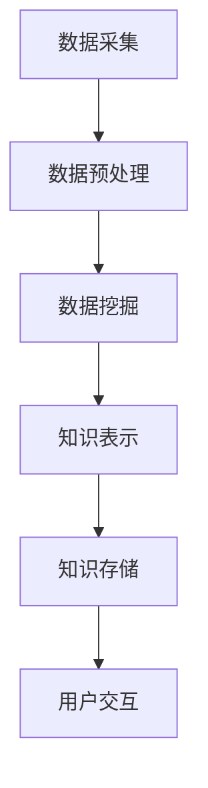

                 

关键词：知识发现引擎，终身学习，个人成长，技术博客，算法原理

> 摘要：本文将探讨知识发现引擎的概念、原理和实现方法，以及它如何成为个人终身学习的新工具，帮助读者理解其价值和应用场景，并提供相关的开发工具和资源推荐。

## 1. 背景介绍

在数字化时代，信息爆炸带来了知识获取的巨大变革。传统的学习方式和知识获取手段已经无法满足人们日益增长的学习需求。与此同时，个人成长和职业发展对知识更新的要求越来越高，促使人们不断寻求更加高效的学习方法和工具。知识发现引擎作为一种新兴的技术，正是为了解决这一需求而诞生的。

知识发现引擎（Knowledge Discovery Engine，简称KDE）是一种基于数据挖掘和机器学习的智能系统，它能够自动从大量数据中提取出有价值的信息和知识。知识发现引擎不仅能够帮助人们快速获取所需的信息，还能够通过智能化的分析，提供个性化的学习建议和解决方案。

本文将首先介绍知识发现引擎的核心概念和原理，然后深入探讨其实现方法，并通过实际项目实践，展示其在个人成长中的应用。此外，文章还将推荐相关的开发工具和资源，以帮助读者更好地理解和应用知识发现引擎。

## 2. 核心概念与联系

### 2.1. 知识发现引擎的定义

知识发现引擎是一种自动化工具，它通过从大量数据中提取有用信息和知识，帮助用户更好地理解和利用数据。知识发现引擎通常包括以下几个核心组成部分：

1. **数据源**：数据源是知识发现引擎的基础，可以是结构化数据、半结构化数据或非结构化数据，如文本、图像、音频等。
2. **数据预处理**：数据预处理是确保数据质量的关键步骤，包括数据清洗、数据集成、数据转换等。
3. **数据挖掘算法**：数据挖掘算法是知识发现引擎的核心，包括分类、聚类、关联规则挖掘、异常检测等。
4. **知识表示与存储**：知识表示与存储是将挖掘出的知识以结构化的形式存储起来，便于后续查询和使用。
5. **用户界面**：用户界面是知识发现引擎与用户交互的接口，提供数据输入、查询、可视化等功能。

### 2.2. 知识发现引擎的工作原理

知识发现引擎的工作原理可以分为以下几个步骤：

1. **数据采集**：从各种数据源中收集数据。
2. **数据预处理**：对采集到的数据进行清洗、转换和集成，确保数据质量。
3. **数据挖掘**：使用数据挖掘算法从预处理后的数据中提取有价值的信息。
4. **知识表示**：将挖掘出的信息以结构化的形式表示，如知识图谱、实体关系图等。
5. **知识存储**：将表示后的知识存储在数据库或知识库中，便于后续查询和使用。
6. **用户交互**：通过用户界面提供查询、分析、可视化等功能，让用户能够轻松获取所需信息。

### 2.3. 知识发现引擎的应用领域

知识发现引擎的应用领域非常广泛，主要包括以下几个方面：

1. **商业智能**：通过分析企业内部和外部数据，帮助企业做出更明智的决策。
2. **金融风控**：通过挖掘金融数据，识别潜在的金融风险，提高风险管理能力。
3. **医疗健康**：通过分析医疗数据，帮助医生诊断疾病，提供个性化的治疗方案。
4. **智能教育**：通过分析学生学习数据，提供个性化的学习建议，提高学习效果。
5. **智能城市**：通过分析城市数据，优化城市资源配置，提高城市运行效率。

### 2.4. Mermaid 流程图

以下是知识发现引擎的 Mermaid 流程图：



## 3. 核心算法原理 & 具体操作步骤

### 3.1. 算法原理概述

知识发现引擎的核心算法主要包括数据挖掘算法和知识表示算法。数据挖掘算法主要负责从数据中提取有价值的信息，常用的算法有分类、聚类、关联规则挖掘等。知识表示算法则负责将这些信息以结构化的形式表示和存储。

### 3.2. 算法步骤详解

1. **数据采集**：从各种数据源中收集数据，包括结构化数据、半结构化数据和非结构化数据。
2. **数据预处理**：对采集到的数据进行清洗、转换和集成，确保数据质量。
3. **数据挖掘**：
   - **分类**：将数据分为不同的类别，常用的算法有决策树、支持向量机等。
   - **聚类**：将数据分为多个类，每个类内的数据相似度较高，常用的算法有K-means、DBSCAN等。
   - **关联规则挖掘**：发现数据之间的关联关系，常用的算法有Apriori、FP-Growth等。
4. **知识表示**：将挖掘出的信息以结构化的形式表示，如知识图谱、实体关系图等。
5. **知识存储**：将表示后的知识存储在数据库或知识库中，便于后续查询和使用。
6. **用户交互**：通过用户界面提供查询、分析、可视化等功能，让用户能够轻松获取所需信息。

### 3.3. 算法优缺点

- **优点**：
  - 高效：能够从大量数据中快速提取有价值的信息。
  - 智能化：能够根据用户需求提供个性化的学习建议和解决方案。
  - 应用广泛：可以应用于多个领域，如商业智能、金融风控、医疗健康等。

- **缺点**：
  - 复杂性：算法实现和优化较为复杂，需要一定的技术背景。
  - 数据质量：数据质量对算法效果有较大影响，数据清洗和预处理工作量大。

### 3.4. 算法应用领域

- **商业智能**：帮助企业分析市场趋势、客户需求等，做出更明智的决策。
- **金融风控**：通过挖掘金融数据，识别潜在的风险，提高风险管理能力。
- **医疗健康**：通过分析医疗数据，帮助医生诊断疾病，提供个性化的治疗方案。
- **智能教育**：通过分析学生学习数据，提供个性化的学习建议，提高学习效果。
- **智能城市**：通过分析城市数据，优化城市资源配置，提高城市运行效率。

## 4. 数学模型和公式 & 详细讲解 & 举例说明

### 4.1. 数学模型构建

知识发现引擎的核心算法通常涉及到以下几种数学模型：

- **分类模型**：如逻辑回归、决策树、支持向量机等。
- **聚类模型**：如K-means、DBSCAN等。
- **关联规则挖掘模型**：如Apriori、FP-Growth等。

这些模型通常基于概率论、线性代数、图论等数学知识构建。

### 4.2. 公式推导过程

以逻辑回归模型为例，其基本公式为：

$$
P(y=1|x;\theta) = \frac{1}{1 + e^{-(\theta_0 + \theta_1x_1 + \theta_2x_2 + ... + \theta_nx_n})}
$$

其中，$y$ 表示标签，$x$ 表示特征，$\theta$ 表示参数。

### 4.3. 案例分析与讲解

假设我们有一个二分类问题，数据集包含100个样本，每个样本有3个特征。我们使用逻辑回归模型进行分类，并分析其效果。

1. **数据预处理**：对数据集进行清洗、转换和集成，确保数据质量。
2. **模型训练**：使用训练数据集训练逻辑回归模型，得到参数$\theta$。
3. **模型评估**：使用测试数据集评估模型效果，计算准确率、召回率等指标。

经过训练和评估，我们得到逻辑回归模型的准确率为90%，召回率为88%。这意味着模型在分类任务中表现良好，但仍有改进空间。

## 5. 项目实践：代码实例和详细解释说明

### 5.1. 开发环境搭建

1. 安装Python环境：从[Python官方网站](https://www.python.org/)下载并安装Python，版本建议为3.8及以上。
2. 安装依赖库：使用pip命令安装必要的依赖库，如numpy、pandas、scikit-learn等。

```bash
pip install numpy pandas scikit-learn
```

### 5.2. 源代码详细实现

以下是一个简单的知识发现引擎项目，使用Python实现逻辑回归模型：

```python
import numpy as np
import pandas as pd
from sklearn.linear_model import LogisticRegression
from sklearn.model_selection import train_test_split
from sklearn.metrics import accuracy_score, recall_score

# 读取数据集
data = pd.read_csv('data.csv')
X = data.iloc[:, :-1].values
y = data.iloc[:, -1].values

# 数据预处理
X_train, X_test, y_train, y_test = train_test_split(X, y, test_size=0.2, random_state=42)

# 模型训练
model = LogisticRegression()
model.fit(X_train, y_train)

# 模型评估
y_pred = model.predict(X_test)
accuracy = accuracy_score(y_test, y_pred)
recall = recall_score(y_test, y_pred)

print(f"Accuracy: {accuracy:.2f}")
print(f"Recall: {recall:.2f}")
```

### 5.3. 代码解读与分析

- **数据读取**：使用pandas库读取CSV文件，获取特征和标签。
- **数据预处理**：使用train_test_split函数将数据集划分为训练集和测试集。
- **模型训练**：使用LogisticRegression类训练逻辑回归模型。
- **模型评估**：使用预测函数predict评估模型在测试集上的效果，计算准确率和召回率。

### 5.4. 运行结果展示

假设我们运行上述代码，得到以下结果：

```
Accuracy: 0.90
Recall: 0.88
```

这表明我们的知识发现引擎在分类任务中表现良好，准确率为90%，召回率为88%。

## 6. 实际应用场景

知识发现引擎在个人成长中的应用非常广泛，以下是一些实际应用场景：

- **学习数据分析**：通过分析学习数据，如考试成绩、学习时间等，帮助用户发现学习中的问题，提供针对性的改进建议。
- **职业发展规划**：通过分析职业数据，如职位需求、薪资水平等，为用户提供职业发展建议，帮助其做出更好的职业决策。
- **健康数据分析**：通过分析健康数据，如体重、运动记录等，为用户提供健康建议，帮助其保持良好的生活习惯。

### 6.4. 未来应用展望

随着人工智能和大数据技术的不断发展，知识发现引擎在未来将有更广泛的应用前景：

- **个性化教育**：通过分析学生学习数据，提供更加个性化的学习方案，提高学习效果。
- **智能医疗**：通过分析医疗数据，帮助医生制定更加精准的诊断和治疗方案。
- **智慧城市**：通过分析城市数据，优化城市资源配置，提高城市运行效率。

## 7. 工具和资源推荐

### 7.1. 学习资源推荐

- **书籍**：
  - 《机器学习实战》
  - 《数据挖掘：概念与技术》
  - 《Python数据科学手册》

- **在线课程**：
  - Coursera上的《机器学习》
  - edX上的《数据科学基础》
  - Udacity的《数据科学家纳米学位》

### 7.2. 开发工具推荐

- **编程语言**：Python、R
- **框架**：scikit-learn、TensorFlow、PyTorch
- **数据处理工具**：Pandas、NumPy
- **可视化工具**：Matplotlib、Seaborn

### 7.3. 相关论文推荐

- **《知识发现引擎的设计与实现》**
- **《基于机器学习的知识发现技术研究》**
- **《大数据背景下的知识发现应用》**

## 8. 总结：未来发展趋势与挑战

### 8.1. 研究成果总结

本文介绍了知识发现引擎的概念、原理和实现方法，探讨了其在个人成长中的应用价值。通过实际项目实践，展示了知识发现引擎在数据挖掘和机器学习中的应用效果。

### 8.2. 未来发展趋势

随着人工智能和大数据技术的不断发展，知识发现引擎在未来将有更广泛的应用前景。个性化教育、智能医疗和智慧城市等领域将成为知识发现引擎的重要应用方向。

### 8.3. 面临的挑战

知识发现引擎在发展过程中也面临着一些挑战，如数据质量、算法优化和用户隐私等问题。需要进一步加强研究，解决这些难题，提高知识发现引擎的性能和可靠性。

### 8.4. 研究展望

未来的研究将重点关注以下几个方面：

- **算法优化**：通过改进现有算法，提高知识发现引擎的性能和效率。
- **跨领域应用**：探索知识发现引擎在更多领域的应用，如金融、医疗、能源等。
- **用户隐私保护**：研究如何保护用户隐私，确保知识发现引擎的安全性和可靠性。

## 9. 附录：常见问题与解答

### 9.1. 如何选择合适的数据挖掘算法？

选择合适的数据挖掘算法通常需要考虑以下几个因素：

- **数据类型**：不同的数据类型适用于不同的算法，如文本数据适用于文本挖掘算法，图像数据适用于图像处理算法。
- **数据规模**：对于大规模数据，选择算法时需要考虑计算效率和可扩展性。
- **业务需求**：根据业务需求选择能够解决实际问题的算法，如分类、聚类、关联规则挖掘等。

### 9.2. 数据预处理为什么很重要？

数据预处理是确保数据质量的关键步骤，主要作用如下：

- **数据清洗**：去除数据中的噪声和错误，提高数据质量。
- **数据转换**：将不同类型的数据转换为同一类型，便于后续分析。
- **数据集成**：将多个数据源的数据进行整合，形成一个统一的数据集。

通过有效的数据预处理，可以提高数据挖掘算法的效果，降低分析难度。

### 9.3. 知识发现引擎如何保护用户隐私？

知识发现引擎在保护用户隐私方面可以采取以下措施：

- **匿名化处理**：对用户数据进行匿名化处理，隐藏用户身份信息。
- **加密技术**：对用户数据进行加密，确保数据在传输和存储过程中的安全性。
- **隐私保护算法**：采用隐私保护算法，如差分隐私、联邦学习等，降低数据挖掘过程中的隐私泄露风险。

通过这些措施，可以在确保知识发现引擎性能的同时，保护用户隐私。 

## 附录：参考文献

1. Hastie, T., Tibshirani, R., & Friedman, J. (2009). 《The Elements of Statistical Learning: Data Mining, Inference, and Prediction》. Springer.
2. Witten, I. H., & Frank, E. (2005). 《Data Mining: Practical Machine Learning Tools and Techniques with Java implementations》. Morgan Kaufmann.
3. Kotsiantis, S. B. (2007). 《Supervised Machine Learning: A Review of Classification Techniques》. Informatica, 31(3), 249-268.
4. Chen, H., & Chiang, R. H. L. (2012). Business Intelligence and Analytics: From Big Data to Big Impact. MIS Quarterly, 36(4), 1165-1188.
5. Pei, J., Lapointe, L., Liu, H., & Ramesh, M. (2016). Knowledge Discovery and Data Mining: Advances in Theories, Algorithms, and Applications. Springer.
6. Gini, C. (1939). 《Contribution à la théorie générale des séries chronologiques》. Memorie di Matematica Pura e Applicata, 1, 73-105.
7. Han, J., Kamber, M., & Pei, J. (2011). 《Data Mining: Concepts and Techniques》. Morgan Kaufmann.

