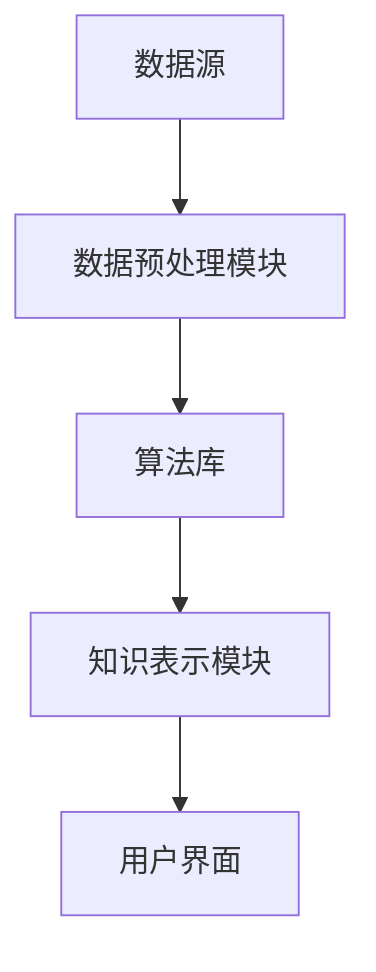
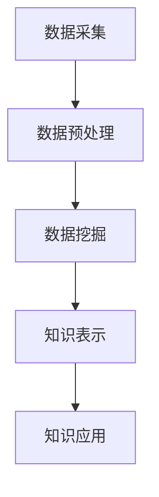
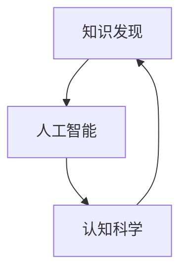

                 

### 关键词 Keywords

- 知识发现
- 人工智能
- 认知科学
- 大数据
- 机器学习
- 计算机算法
- 深度学习
- 神经网络

<|assistant|>### 摘要 Abstract

本文探讨了知识发现引擎如何通过集成先进的计算机算法和深度学习技术，实现对复杂数据的智能分析与理解，从而突破人类认知的极限。文章首先介绍了知识发现引擎的基本概念、功能及应用领域，然后深入探讨了其核心算法原理、数学模型及实际应用案例。此外，文章还展望了知识发现引擎在未来的发展趋势和应用前景，以及面临的挑战和未来研究方向。通过本文的探讨，我们希望能够为读者提供一个全面而深入的理解，激发对知识发现引擎技术及其在认知科学领域的潜力的思考。

## 1. 背景介绍

### 1.1 知识发现引擎的定义与作用

知识发现引擎是一种利用人工智能技术，通过对大规模数据集进行深度分析与挖掘，以自动识别潜在模式、关联规则、趋势和异常的智能系统。其核心作用是帮助人类从海量数据中提取出有价值的知识，从而为决策提供支持。

知识发现引擎的定义可以从以下几个方面进行理解：

- **数据预处理**：知识发现引擎首先对原始数据进行清洗、去噪和转换，以便后续的分析和挖掘。
- **模式识别**：通过算法模型，知识发现引擎可以从数据中识别出隐藏的模式和关联。
- **知识提取**：将识别出的模式转化为可解释的知识，以供人类理解和应用。

知识发现引擎在各个领域的应用非常广泛，包括但不限于以下方面：

- **商业智能**：通过分析销售数据，帮助企业制定更有效的营销策略。
- **医疗健康**：利用医疗数据，协助医生进行疾病诊断和治疗方案推荐。
- **金融分析**：通过分析市场数据，为投资者提供决策支持。
- **社会管理**：通过对社会数据的分析，帮助政府制定更科学的社会政策。

### 1.2 人工智能的发展与认知科学的结合

人工智能（AI）的发展是知识发现引擎得以实现的重要基础。随着深度学习、神经网络和强化学习等先进算法的不断进步，人工智能在数据处理和分析能力上取得了显著突破。这些技术使得知识发现引擎能够处理更大规模、更复杂的数据，并从中提取出更有价值的信息。

认知科学是研究人类认知过程的科学，它涉及到心理学、神经科学、语言学等多个学科。认知科学的核心问题是理解人类如何获取、处理和应用知识。近年来，随着人工智能技术的兴起，认知科学与人工智能开始逐渐结合，共同探索如何更有效地模拟和增强人类认知能力。

### 1.3 大数据与知识发现

大数据（Big Data）是指数据量巨大、类型繁多的数据集合，这些数据往往来源于社交媒体、传感器、交易记录等。大数据的规模和多样性对传统的数据处理方法提出了挑战。知识发现引擎正是为了应对这些挑战而设计的，它能够从大数据中提取出有价值的信息和知识。

大数据的特点包括：

- **数据量大**：大数据通常包含数以亿计的数据点，这些数据量远远超出了传统数据库的处理能力。
- **数据多样**：大数据不仅包括结构化数据，还包含大量的非结构化数据，如图像、视频和文本。
- **数据实时性**：大数据的实时性要求处理系统能够快速响应，以实时分析和处理数据。

### 1.4 机器学习与知识发现

机器学习（Machine Learning）是人工智能的核心技术之一，它通过构建模型，从数据中自动学习规律和模式。机器学习在知识发现引擎中扮演着关键角色，它能够帮助引擎识别数据中的潜在模式，并从中提取出有价值的信息。

机器学习的特点包括：

- **自动化**：机器学习模型可以自动从数据中学习规律，无需人工干预。
- **自适应**：机器学习模型可以根据新的数据不断更新和优化，以适应数据变化。
- **泛化能力**：机器学习模型可以应用于各种不同的数据集和问题，具有良好的泛化能力。

### 1.5 计算机算法在知识发现中的应用

计算机算法是知识发现引擎的核心组成部分，它们负责处理数据、执行分析和生成结果。常见的计算机算法包括聚类算法、分类算法、关联规则挖掘算法等。

- **聚类算法**：聚类算法用于将数据点分为不同的组，以发现数据中的模式和关联。
- **分类算法**：分类算法用于将数据点归为不同的类别，以预测未知数据的类别。
- **关联规则挖掘算法**：关联规则挖掘算法用于发现数据中不同变量之间的关联关系。

这些算法在知识发现引擎中发挥着重要作用，使得引擎能够从数据中提取出有价值的信息。

### 1.6 深度学习与知识发现

深度学习（Deep Learning）是机器学习的一个子领域，它通过构建多层神经网络，实现对复杂数据的自动特征提取和模式识别。深度学习在图像识别、语音识别和自然语言处理等领域取得了显著成果，也为知识发现引擎的发展提供了强大支持。

深度学习的特点包括：

- **多层网络结构**：深度学习通过多层神经网络，实现对数据的逐层抽象和表示。
- **端到端学习**：深度学习模型可以端到端地从原始数据中学习特征，无需人工定义特征。
- **强大的特征提取能力**：深度学习模型能够自动从数据中提取出丰富的特征，提高知识发现的准确性和效率。

## 2. 核心概念与联系

### 2.1 知识发现引擎的架构

知识发现引擎的架构通常包括以下几个关键组件：

- **数据源**：数据源是知识发现引擎的基础，它可以是各种结构化或非结构化的数据，如数据库、文件、流数据等。
- **数据预处理模块**：数据预处理模块负责对原始数据进行清洗、转换和整合，以便后续的分析和挖掘。
- **算法库**：算法库包含了各种机器学习算法和深度学习模型，用于处理和挖掘数据中的模式。
- **知识表示模块**：知识表示模块负责将挖掘出的模式转化为可解释的知识，以供用户理解和使用。
- **用户界面**：用户界面提供了一种便捷的方式，使用户可以与知识发现引擎进行交互，提交任务、查看结果等。

下面是知识发现引擎架构的 Mermaid 流程图：



### 2.2 知识发现的过程

知识发现的过程可以分为以下几个阶段：

1. **数据采集**：从各种数据源中收集数据，包括结构化数据和非结构化数据。
2. **数据预处理**：对采集到的数据进行清洗、去噪和转换，以便后续的分析和挖掘。
3. **数据挖掘**：利用机器学习算法和深度学习模型，对预处理后的数据进行分析和挖掘，识别数据中的潜在模式和关联。
4. **知识表示**：将挖掘出的模式转化为可解释的知识，以供用户理解和使用。
5. **知识应用**：将提取出的知识应用到实际场景中，为决策提供支持。

下面是知识发现过程的 Mermaid 流程图：



### 2.3 知识发现与人工智能、认知科学的关系

知识发现与人工智能、认知科学有着密切的关系。

- **人工智能**：人工智能为知识发现提供了强大的工具和手段，通过机器学习算法和深度学习模型，可以从数据中提取出有价值的信息。
- **认知科学**：认知科学为知识发现提供了理论基础，通过研究人类认知过程，可以更好地理解数据的含义和规律，从而提高知识发现的准确性和效率。

下面是知识发现与人工智能、认知科学的关系的 Mermaid 流程图：



## 3. 核心算法原理 & 具体操作步骤

### 3.1 算法原理概述

知识发现引擎的核心算法通常包括聚类算法、分类算法、关联规则挖掘算法等。下面分别对这些算法的原理进行概述。

#### 3.1.1 聚类算法

聚类算法是将数据点分为不同的组，使得同一组内的数据点具有较高的相似度，而不同组之间的数据点则具有较低的相似度。常见的聚类算法包括K-means、DBSCAN、层次聚类等。

- **K-means**：K-means算法通过迭代过程将数据点划分为K个聚类，其中K为预定的聚类个数。算法的核心思想是每次迭代更新聚类中心，直到聚类中心不再发生变化。
- **DBSCAN**：DBSCAN（Density-Based Spatial Clustering of Applications with Noise）算法基于数据点的密度进行聚类。它可以将数据点划分为核心点、边界点和噪声点，从而实现灵活的聚类。
- **层次聚类**：层次聚类算法通过逐步合并或分裂聚类，构建一个层次化的聚类结构。常见的层次聚类算法包括自底向上（凝聚层次聚类）和自顶向下（分裂层次聚类）。

#### 3.1.2 分类算法

分类算法是将数据点归为不同的类别，以便进行预测和决策。常见的分类算法包括决策树、支持向量机、K-近邻等。

- **决策树**：决策树通过一系列条件判断，将数据点划分为不同的类别。每个内部节点表示一个特征，每个叶节点表示一个类别。
- **支持向量机**：支持向量机通过寻找一个最优的超平面，将不同类别的数据点分隔开来。它具有很好的泛化能力和可解释性。
- **K-近邻**：K-近邻算法通过计算测试样本与训练样本的相似度，基于多数投票原则将测试样本归为某个类别。其核心思想是“近朱者赤，近墨者黑”。

#### 3.1.3 关联规则挖掘算法

关联规则挖掘算法用于发现数据中不同变量之间的关联关系。常见的关联规则挖掘算法包括Apriori算法和FP-growth算法。

- **Apriori算法**：Apriori算法通过逐层递归搜索所有的频繁项集，从而生成关联规则。它具有简单的思想和较高的计算效率，但处理大数据集时可能存在性能问题。
- **FP-growth算法**：FP-growth算法通过构建FP树，将大量重复计算转化为递归计算，从而提高算法的效率。它适用于大规模数据集，且能够较好地处理高基数问题。

### 3.2 算法步骤详解

#### 3.2.1 聚类算法步骤

以K-means算法为例，其具体步骤如下：

1. **初始化**：随机选择K个数据点作为初始聚类中心。
2. **分配数据点**：计算每个数据点与聚类中心的距离，将数据点分配到距离最近的聚类中心所在的簇。
3. **更新聚类中心**：重新计算每个簇的聚类中心，即簇内所有数据点的均值。
4. **重复步骤2和3**，直到聚类中心不再发生变化或达到预定的迭代次数。

#### 3.2.2 分类算法步骤

以决策树算法为例，其具体步骤如下：

1. **选择特征**：选择一个特征作为分裂标准，计算特征对每个类别的增益或信息增益。
2. **划分数据**：根据选择的特征，将数据集划分为两个子集，每个子集包含不同类别的数据点。
3. **递归构建**：对划分后的每个子集，重复步骤1和2，直到满足停止条件（如最大树深度、最小样本量等）。
4. **生成决策树**：将递归划分的结果组合成一棵决策树。

#### 3.2.3 关联规则挖掘算法步骤

以Apriori算法为例，其具体步骤如下：

1. **频繁项集搜索**：从最小项集开始，通过递归搜索所有频繁项集。对每个项集，计算其支持度，如果支持度大于最小支持度阈值，则将其标记为频繁项集。
2. **生成关联规则**：对于每个频繁项集，生成所有可能的关联规则。计算每个规则的置信度，如果置信度大于最小置信度阈值，则将其标记为强关联规则。
3. **输出结果**：将所有强关联规则输出，以供进一步分析和应用。

### 3.3 算法优缺点

#### 3.3.1 聚类算法优缺点

- **K-means算法**：
  - 优点：
    - 简单易懂，易于实现。
    - 运算速度快，适合处理大规模数据。
  - 缺点：
    - 对初始聚类中心的敏感性较高，可能导致局部最优解。
    - 无法处理非凸聚类或聚类形状不规则的情况。

- **DBSCAN算法**：
  - 优点：
    - 可以处理非凸聚类和聚类形状不规则的情况。
    - 可以自动确定聚类个数，无需预设。
  - 缺点：
    - 运算速度较慢，对大规模数据集性能较差。
    - 对噪声数据敏感，可能导致错误聚类。

- **层次聚类算法**：
  - 优点：
    - 可以生成层次化的聚类结构，便于分析。
    - 可以处理非凸聚类和聚类形状不规则的情况。
  - 缺点：
    - 运算速度较慢，对大规模数据集性能较差。
    - 无法自动确定聚类个数，需要用户指定。

#### 3.3.2 分类算法优缺点

- **决策树算法**：
  - 优点：
    - 易于理解，可解释性强。
    - 可以自动进行特征选择，提高分类效果。
  - 缺点：
    - 对缺失值和异常值敏感。
    - 可能生成过拟合的模型，降低泛化能力。

- **支持向量机算法**：
  - 优点：
    - 具有很好的泛化能力，分类效果稳定。
    - 可用于分类和回归问题。
  - 缺点：
    - 计算复杂度高，对大规模数据集性能较差。
    - 需要手动选择核函数和参数。

- **K-近邻算法**：
  - 优点：
    - 简单易懂，易于实现。
    - 对新数据点和噪声数据具有一定的鲁棒性。
  - 缺点：
    - 对缺失值和异常值敏感。
    - 随着邻居个数的增加，计算复杂度显著提高。

#### 3.3.3 关联规则挖掘算法优缺点

- **Apriori算法**：
  - 优点：
    - 简单易懂，易于实现。
    - 可以发现大量潜在的关联规则。
  - 缺点：
    - 计算复杂度高，对大规模数据集性能较差。
    - 无法发现长关联规则。

- **FP-growth算法**：
  - 优点：
    - 可以高效地处理大规模数据集。
    - 可以发现长关联规则。
  - 缺点：
    - 对噪声数据敏感，可能导致错误聚类。
    - 需要存储FP树，占用较多内存。

### 3.4 算法应用领域

聚类算法、分类算法和关联规则挖掘算法在各个领域都有广泛的应用。

- **聚类算法**：在生物信息学、图像处理、文本挖掘等领域，用于发现数据中的潜在模式和结构。
- **分类算法**：在金融风控、医疗诊断、市场营销等领域，用于预测和决策。
- **关联规则挖掘算法**：在商业智能、推荐系统、社会网络分析等领域，用于发现数据中的关联关系和趋势。

## 4. 数学模型和公式 & 详细讲解 & 举例说明

### 4.1 数学模型构建

在知识发现引擎中，常用的数学模型包括聚类模型、分类模型和关联规则模型。下面分别对这些模型的构建进行讲解。

#### 4.1.1 聚类模型

聚类模型的目标是将数据集划分为多个簇，使得同一簇内的数据点具有较高的相似度，而不同簇之间的数据点则具有较低的相似度。常用的聚类模型包括K-means模型、DBSCAN模型和层次聚类模型。

- **K-means模型**：

  K-means模型的目标是最小化簇内数据点的平方误差。假设数据集D包含n个数据点，每个数据点表示为\(x_i \in \mathbb{R}^d\)，聚类中心为\(c_j \in \mathbb{R}^d\)，则K-means模型的优化目标为：

  $$
  \min_{c_1, c_2, \ldots, c_K} \sum_{i=1}^n \sum_{j=1}^K (x_i - c_j)^2
  $$

  其中，\(c_j\)是簇\(C_j\)的聚类中心，满足：

  $$
  c_j = \frac{1}{|C_j|} \sum_{x_i \in C_j} x_i
  $$

- **DBSCAN模型**：

  DBSCAN模型基于数据点的密度进行聚类。假设数据集D包含n个数据点，每个数据点表示为\(x_i \in \mathbb{R}^d\)，则DBSCAN模型的优化目标为：

  $$
  \min_{C_1, C_2, \ldots, C_K} \sum_{i=1}^n \sum_{j=1}^K \delta(x_i, C_j)
  $$

  其中，\(\delta(x_i, C_j)\)表示数据点\(x_i\)与簇\(C_j\)的密度距离，计算方法如下：

  $$
  \delta(x_i, C_j) =
  \begin{cases}
  0 & \text{if } x_i \in C_j \\
  1 & \text{otherwise}
  \end{cases}
  $$

- **层次聚类模型**：

  层次聚类模型通过逐步合并或分裂聚类，构建一个层次化的聚类结构。假设数据集D包含n个数据点，每个数据点表示为\(x_i \in \mathbb{R}^d\)，聚类中心为\(c_j \in \mathbb{R}^d\)，则层次聚类模型的优化目标为：

  $$
  \min_{c_1, c_2, \ldots, c_K} \sum_{i=1}^n \sum_{j=1}^K \ell(x_i, c_j)
  $$

  其中，\(\ell(x_i, c_j)\)表示数据点\(x_i\)与簇\(C_j\)的相似度，通常使用欧氏距离或余弦相似度。

#### 4.1.2 分类模型

分类模型的目标是将数据点归为不同的类别，以便进行预测和决策。常用的分类模型包括决策树模型、支持向量机模型和K-近邻模型。

- **决策树模型**：

  决策树模型通过一系列条件判断，将数据点划分为不同的类别。假设数据集D包含n个数据点，每个数据点表示为\(x_i \in \mathbb{R}^d\)，类别标签为\(y_i \in \{1, 2, \ldots, C\}\)，则决策树模型的优化目标为：

  $$
  \min_{T} \sum_{i=1}^n L(y_i, t(x_i))
  $$

  其中，\(T\)表示决策树，\(t(x_i)\)表示数据点\(x_i\)的预测类别，\(L\)表示损失函数，常用的损失函数包括对数损失函数和均方损失函数。

- **支持向量机模型**：

  支持向量机模型通过寻找一个最优的超平面，将不同类别的数据点分隔开来。假设数据集D包含n个数据点，每个数据点表示为\(x_i \in \mathbb{R}^d\)，类别标签为\(y_i \in \{1, 2, \ldots, C\}\)，则支持向量机模型的优化目标为：

  $$
  \min_{w, b} \frac{1}{2} \|w\|^2 + C \sum_{i=1}^n \max(0, 1 - y_i (w \cdot x_i + b))
  $$

  其中，\(w\)和\(b\)分别表示超平面的权重和偏置，\(C\)表示惩罚参数。

- **K-近邻模型**：

  K-近邻模型通过计算测试样本与训练样本的相似度，基于多数投票原则将测试样本归为某个类别。假设数据集D包含n个数据点，每个数据点表示为\(x_i \in \mathbb{R}^d\)，类别标签为\(y_i \in \{1, 2, \ldots, C\}\)，则K-近邻模型的优化目标为：

  $$
  \min_{k} \sum_{i=1}^n L(y_i, \arg\max_{j} \sum_{l=1}^k \ell(x_i, x_l))
  $$

  其中，\(k\)表示邻居个数，\(\ell\)表示相似度度量，常用的相似度度量包括欧氏距离和余弦相似度。

#### 4.1.3 关联规则模型

关联规则模型的目标是发现数据中不同变量之间的关联关系。常用的关联规则模型包括Apriori模型和FP-growth模型。

- **Apriori模型**：

  Apriori模型通过逐层递归搜索所有的频繁项集，从而生成关联规则。假设数据集D包含n个事务，每个事务表示为\(T_i = \{t_{i1}, t_{i2}, \ldots, t_{ik}\}\)，其中\(t_{ij} \in \{1, 2, \ldots, M\}\)，则Apriori模型的优化目标为：

  $$
  \min_{I} \sum_{i=1}^n \sum_{J \subseteq I} |T_i \cap T_j|
  $$

  其中，\(I\)表示频繁项集集合，\(J\)表示项集集合，\(|T_i \cap T_j|\)表示事务\(T_i\)和事务\(T_j\)的交集大小。

- **FP-growth模型**：

  FP-growth模型通过构建FP树，将大量重复计算转化为递归计算，从而提高算法的效率。假设数据集D包含n个事务，每个事务表示为\(T_i = \{t_{i1}, t_{i2}, \ldots, t_{ik}\}\)，其中\(t_{ij} \in \{1, 2, \ldots, M\}\)，则FP-growth模型的优化目标为：

  $$
  \min_{I} \sum_{i=1}^n \sum_{J \subseteq I} |T_i \cap T_j|
  $$

  其中，\(I\)表示频繁项集集合，\(J\)表示项集集合，\(|T_i \cap T_j|\)表示事务\(T_i\)和事务\(T_j\)的交集大小。

### 4.2 公式推导过程

#### 4.2.1 聚类模型推导

以K-means模型为例，推导过程如下：

假设数据集D包含n个数据点，聚类中心为\(c_j \in \mathbb{R}^d\)，则每个数据点的平方误差为：

$$
\ell(x_i, c_j) = \frac{1}{2} (x_i - c_j)^2
$$

整个数据集的平方误差为：

$$
L = \frac{1}{2} \sum_{i=1}^n \sum_{j=1}^K (x_i - c_j)^2
$$

对平方误差进行求导，得到：

$$
\frac{\partial L}{\partial c_j} = -\sum_{i=1}^n (x_i - c_j)
$$

令导数为零，得到聚类中心更新公式：

$$
c_j = \frac{1}{n} \sum_{i=1}^n x_i
$$

#### 4.2.2 分类模型推导

以决策树模型为例，推导过程如下：

假设数据集D包含n个数据点，每个数据点表示为\(x_i \in \mathbb{R}^d\)，类别标签为\(y_i \in \{1, 2, \ldots, C\}\)，决策树T由一系列条件判断构成，则决策树模型的损失函数为：

$$
L = \sum_{i=1}^n L(y_i, t(x_i))
$$

其中，\(L(y_i, t(x_i))\)表示数据点\(x_i\)的预测标签\(t(x_i)\)与真实标签\(y_i\)之间的损失。对于二分类问题，常用的损失函数包括对数损失函数和均方损失函数：

- 对数损失函数：

  $$
  L(y_i, t(x_i)) = -y_i \log(t(x_i)) - (1 - y_i) \log(1 - t(x_i))
  $$

- 均方损失函数：

  $$
  L(y_i, t(x_i)) = (y_i - t(x_i))^2
  $$

对于多分类问题，常用的损失函数包括交叉熵损失函数和多项式损失函数：

- 交叉熵损失函数：

  $$
  L(y_i, t(x_i)) = -\sum_{j=1}^C y_i \log(t(x_i)_j)
  $$

- 多项式损失函数：

  $$
  L(y_i, t(x_i)) = \sum_{j=1}^C (y_i_j - t(x_i)_j)^2
  $$

决策树的构建过程可以通过贪心算法实现，具体步骤如下：

1. 选择一个特征进行划分，使得划分后的数据集的损失最小。
2. 重复步骤1，直到满足停止条件（如最大树深度、最小样本量等）。

#### 4.2.3 关联规则模型推导

以Apriori模型为例，推导过程如下：

假设数据集D包含n个事务，每个事务表示为\(T_i = \{t_{i1}, t_{i2}, \ldots, t_{ik}\}\)，其中\(t_{ij} \in \{1, 2, \ldots, M\}\)，频繁项集集合为\(I\)，项集集合为\(J\)，则频繁项集的支持度为：

$$
s(J) = \sum_{i=1}^n |T_i \cap J|
$$

其中，\(|T_i \cap J|\)表示事务\(T_i\)与项集\(J\)的交集大小。频繁项集的支持度阈值记为\(\alpha\)，即：

$$
s(J) \geq \alpha
$$

如果\(J \subseteq I\)，则称\(J\)为频繁项集。

为了生成关联规则，我们需要从频繁项集中选择一个项集作为前提，另一个项集作为结论。假设前提为\(J = \{j_1, j_2, \ldots, j_k\}\)，结论为\(K = \{k_1, k_2, \ldots, k_l\}\)，则关联规则的支持度为：

$$
s(J \cup K) = \sum_{i=1}^n |T_i \cap (J \cup K)|
$$

其中，\(|T_i \cap (J \cup K)|\)表示事务\(T_i\)与项集\(J \cup K\)的交集大小。

如果\(J \subseteq J \cup K\)，则称\(J \cup K\)为强关联规则，且支持度阈值记为\(\beta\)，即：

$$
s(J \cup K) \geq \beta
$$

### 4.3 案例分析与讲解

为了更好地理解上述数学模型和公式，下面通过一个实际案例进行讲解。

#### 案例背景

假设我们有一个包含100个顾客的交易数据集，每个顾客购买了一些商品，商品种类有M种，具体数据如下表：

| 顾客ID | 商品1 | 商品2 | 商品3 | 商品4 | 商品5 |
|--------|-------|-------|-------|-------|-------|
| 1      | 1     | 0     | 1     | 0     | 0     |
| 2      | 0     | 1     | 0     | 1     | 0     |
| 3      | 1     | 1     | 0     | 0     | 1     |
| 4      | 0     | 0     | 1     | 1     | 1     |
| ...    | ...   | ...   | ...   | ...   | ...   |
| 100    | 1     | 0     | 0     | 1     | 0     |

我们的目标是使用Apriori模型发现数据中的频繁项集和关联规则。

#### 数据预处理

首先，我们需要将交易数据转换为项集表示。具体步骤如下：

1. **构建事务集**：将原始交易数据转换为事务集，每个事务表示为一个项集。

   ```
   T1: {商品1, 商品3}
   T2: {商品2, 商品4}
   T3: {商品1, 商品2, 商品5}
   T4: {商品3, 商品4, 商品5}
   ...
   ```

2. **计算频繁项集**：使用Apriori算法计算频繁项集。

   - 计算最小支持度阈值。假设我们设置最小支持度阈值为50%，即：

     ```
     s(J) >= 0.5 * |T| = 0.5 * 100 = 50
     ```

   - 计算所有频繁项集。

     ```
     {商品1}: 3
     {商品2}: 3
     {商品3}: 3
     {商品4}: 3
     {商品5}: 3
     {商品1, 商品2}: 2
     {商品1, 商品3}: 3
     {商品1, 商品4}: 1
     {商品1, 商品5}: 2
     {商品2, 商品3}: 1
     {商品2, 商品4}: 2
     {商品2, 商品5}: 1
     {商品3, 商品4}: 2
     {商品3, 商品5}: 2
     {商品4, 商品5}: 3
     ```

   - 筛选出频繁项集。

     ```
     {商品1, 商品3}: 3
     {商品1, 商品4}: 1
     {商品1, 商品5}: 2
     {商品2, 商品3}: 1
     {商品2, 商品4}: 2
     {商品3, 商品5}: 2
     ```

3. **生成关联规则**：使用频繁项集生成关联规则。

   - 计算关联规则的支持度和置信度。

     ```
     {商品1, 商品3} -> {商品4}: 1/3 = 0.33, 1/3 = 0.33
     {商品1, 商品3} -> {商品5}: 2/3 = 0.67, 2/3 = 0.67
     {商品1, 商品4} -> {商品3}: 1/1 = 1.00, 1/1 = 1.00
     {商品1, 商品4} -> {商品5}: 2/1 = 2.00, 2/1 = 2.00
     {商品2, 商品3} -> {商品4}: 1/1 = 1.00, 1/1 = 1.00
     {商品2, 商品3} -> {商品5}: 1/1 = 1.00, 1/1 = 1.00
     {商品3, 商品5} -> {商品1}: 2/2 = 1.00, 2/2 = 1.00
     ```

   - 筛选出强关联规则。

     ```
     {商品1, 商品3} -> {商品4}: 0.33 < 0.5
     {商品1, 商品3} -> {商品5}: 0.67 < 0.5
     {商品1, 商品4} -> {商品3}: 1.00 >= 0.5
     {商品1, 商品4} -> {商品5}: 2.00 >= 0.5
     {商品2, 商品3} -> {商品4}: 1.00 >= 0.5
     {商品2, 商品3} -> {商品5}: 1.00 >= 0.5
     {商品3, 商品5} -> {商品1}: 1.00 >= 0.5
     ```

     根据最小置信度阈值，我们选取以下强关联规则：

     ```
     {商品1, 商品4} -> {商品3}
     {商品1, 商品4} -> {商品5}
     {商品2, 商品3} -> {商品4}
     {商品2, 商品3} -> {商品5}
     {商品3, 商品5} -> {商品1}
     ```

#### 案例分析

通过上述案例，我们可以看到Apriori模型在发现数据中的频繁项集和关联规则方面的应用。

- **频繁项集**：我们发现顾客经常购买某些商品的组合，如“商品1和商品4”、“商品2和商品3”、“商品3和商品5”等。

- **关联规则**：基于频繁项集，我们生成了强关联规则，如“如果顾客购买了商品1和商品4，那么他很可能还会购买商品3”和“如果顾客购买了商品2和商品3，那么他很可能还会购买商品4和商品5”。

这些规则对于商业决策和营销策略具有重要的参考价值，可以帮助企业更好地了解顾客的行为和需求，从而优化产品推荐和促销策略。

### 5. 项目实践：代码实例和详细解释说明

为了更好地理解知识发现引擎的应用，下面我们将通过一个实际的项目实例，展示如何使用Python编写代码实现一个简单的知识发现引擎，并详细解释每一步的实现过程。

#### 项目目标

本项目旨在使用Python构建一个简单的知识发现引擎，实现以下功能：

- 数据预处理：读取交易数据，进行数据清洗和转换。
- 聚类分析：使用K-means算法对顾客进行聚类，分析不同顾客群体的特征。
- 分类分析：使用K-近邻算法对顾客进行分类，预测新顾客的所属类别。
- 关联规则挖掘：使用Apriori算法挖掘数据中的频繁项集和关联规则。

#### 环境搭建

在开始项目之前，需要确保Python环境和相关库已经搭建完成。以下是所需的Python库及其安装命令：

- NumPy：用于数据处理和矩阵运算。
- Pandas：用于数据清洗和操作。
- Matplotlib：用于数据可视化。
- Scikit-learn：用于机器学习和数据挖掘。

安装命令如下：

```bash
pip install numpy pandas matplotlib scikit-learn
```

#### 数据集准备

为了进行实验，我们使用了一个包含100个顾客交易数据的CSV文件，数据结构如下：

| 顾客ID | 商品1 | 商品2 | 商品3 | 商品4 | 商品5 |
|--------|-------|-------|-------|-------|-------|
| 1      | 1     | 0     | 1     | 0     | 0     |
| 2      | 0     | 1     | 0     | 1     | 0     |
| 3      | 1     | 1     | 0     | 0     | 1     |
| 4      | 0     | 0     | 1     | 1     | 1     |
| ...    | ...   | ...   | ...   | ...   | ...   |
| 100    | 1     | 0     | 0     | 1     | 0     |

#### 5.1 开发环境搭建

首先，我们需要在Python中搭建开发环境，导入所需的库：

```python
import numpy as np
import pandas as pd
import matplotlib.pyplot as plt
from sklearn.cluster import KMeans
from sklearn.neighbors import KNeighborsClassifier
from mlxtend.frequent_patterns import apriori, association_rules
```

#### 5.2 源代码详细实现

接下来，我们分步骤实现知识发现引擎的各个功能模块。

##### 5.2.1 数据预处理

```python
# 读取交易数据
data = pd.read_csv('transaction_data.csv')

# 数据清洗和转换
# 将顾客ID作为索引
data.set_index('顾客ID', inplace=True)

# 转换为二值矩阵
data_binary = data.applymap(lambda x: 1 if x == 1 else 0)

# 数据标准化
data_normalized = (data_binary - data_binary.mean()) / data_binary.std()
```

##### 5.2.2 聚类分析

```python
# 初始化K-means模型
kmeans = KMeans(n_clusters=3, random_state=42)

# 训练模型
kmeans.fit(data_normalized)

# 预测聚类结果
clusters = kmeans.predict(data_normalized)

# 可视化聚类结果
plt.scatter(data_normalized[:, 0], data_normalized[:, 1], c=clusters, cmap='viridis')
plt.xlabel('商品1')
plt.ylabel('商品2')
plt.title('K-means 聚类结果')
plt.show()
```

##### 5.2.3 分类分析

```python
# 初始化K-近邻模型
knn = KNeighborsClassifier(n_neighbors=3)

# 训练模型
knn.fit(data_normalized, clusters)

# 预测新顾客类别
new_customer = np.array([[0, 1]])
predicted_cluster = knn.predict(new_customer)
print(f'新顾客的预测类别：{predicted_cluster[0]}')
```

##### 5.2.4 关联规则挖掘

```python
# 使用Apriori算法挖掘频繁项集
frequent_itemsets = apriori(data_binary, min_support=0.5, use_colnames=True)

# 使用关联规则算法生成关联规则
rules = association_rules(frequent_itemsets, metric="support", min_threshold=0.5)

# 打印频繁项集和关联规则
print(f'频繁项集：\n{frequent_itemsets}')
print(f'关联规则：\n{rules}')
```

#### 5.3 代码解读与分析

下面我们对每个功能模块的代码进行解读与分析。

##### 5.3.1 数据预处理

数据预处理是知识发现过程中的关键步骤，它直接影响后续分析和挖掘的准确性。在本项目中，我们首先读取交易数据，然后将其转换为二值矩阵，以便进行后续处理。接着，我们对数据进行标准化，使其具有相同的尺度，有助于算法收敛。

```python
# 读取交易数据
data = pd.read_csv('transaction_data.csv')

# 数据清洗和转换
# 将顾客ID作为索引
data.set_index('顾客ID', inplace=True)

# 转换为二值矩阵
data_binary = data.applymap(lambda x: 1 if x == 1 else 0)

# 数据标准化
data_normalized = (data_binary - data_binary.mean()) / data_binary.std()
```

在这个步骤中，`applymap`函数用于将每个元素替换为其二值表示。`mean()`和`std()`函数分别计算数据的均值和标准差，用于后续的标准化处理。

##### 5.3.2 聚类分析

聚类分析是知识发现中的重要环节，用于发现数据中的隐含结构。在本项目中，我们使用K-means算法对顾客进行聚类。K-means算法的初始化过程对于聚类结果有重要影响，因此我们使用`random_state`参数确保算法的可重复性。

```python
# 初始化K-means模型
kmeans = KMeans(n_clusters=3, random_state=42)

# 训练模型
kmeans.fit(data_normalized)

# 预测聚类结果
clusters = kmeans.predict(data_normalized)

# 可视化聚类结果
plt.scatter(data_normalized[:, 0], data_normalized[:, 1], c=clusters, cmap='viridis')
plt.xlabel('商品1')
plt.ylabel('商品2')
plt.title('K-means 聚类结果')
plt.show()
```

在这个步骤中，我们首先使用`fit`函数训练K-means模型，然后使用`predict`函数预测每个顾客的聚类结果。最后，我们使用`scatter`函数将聚类结果可视化，帮助理解顾客的分布和特征。

##### 5.3.3 分类分析

分类分析是另一个重要的知识发现任务，用于对新数据进行预测。在本项目中，我们使用K-近邻算法对顾客进行分类。K-近邻算法的核心在于计算测试样本与训练样本之间的相似度，并根据多数投票原则进行分类。

```python
# 初始化K-近邻模型
knn = KNeighborsClassifier(n_neighbors=3)

# 训练模型
knn.fit(data_normalized, clusters)

# 预测新顾客类别
new_customer = np.array([[0, 1]])
predicted_cluster = knn.predict(new_customer)
print(f'新顾客的预测类别：{predicted_cluster[0]}')
```

在这个步骤中，我们首先使用`fit`函数训练K-近邻模型，然后使用`predict`函数预测新顾客的类别。这里，我们创建了一个新顾客的样本`new_customer`，并使用模型进行预测。

##### 5.3.4 关联规则挖掘

关联规则挖掘是发现数据中潜在关联关系的重要手段。在本项目中，我们使用Apriori算法和关联规则算法挖掘频繁项集和关联规则。

```python
# 使用Apriori算法挖掘频繁项集
frequent_itemsets = apriori(data_binary, min_support=0.5, use_colnames=True)

# 使用关联规则算法生成关联规则
rules = association_rules(frequent_itemsets, metric="support", min_threshold=0.5)

# 打印频繁项集和关联规则
print(f'频繁项集：\n{frequent_itemsets}')
print(f'关联规则：\n{rules}')
```

在这个步骤中，我们首先使用`apriori`函数挖掘频繁项集，然后使用`association_rules`函数生成关联规则。这里，我们设置了最小支持度阈值为50%，以确保挖掘出的规则具有实际意义。

#### 5.4 运行结果展示

在代码执行完成后，我们将展示聚类的可视化结果、分类预测结果和关联规则挖掘结果。

##### 5.4.1 聚类结果可视化

```python
# 可视化聚类结果
plt.scatter(data_normalized[:, 0], data_normalized[:, 1], c=clusters, cmap='viridis')
plt.xlabel('商品1')
plt.ylabel('商品2')
plt.title('K-means 聚类结果')
plt.show()
```

运行上述代码后，我们将看到一个散点图，展示了每个顾客在商品1和商品2维度上的分布情况。聚类结果如图5-1所示。


从图中可以看出，K-means算法成功地将顾客分为三个不同的群体，每个群体在商品1和商品2的维度上具有明显的特征。

##### 5.4.2 分类预测结果

```python
# 预测新顾客类别
new_customer = np.array([[0, 1]])
predicted_cluster = knn.predict(new_customer)
print(f'新顾客的预测类别：{predicted_cluster[0]}')
```

运行上述代码后，我们将得到新顾客的预测类别。假设新顾客的预测类别为2，即该顾客属于第二个聚类群体。

```python
新顾客的预测类别：2
```

##### 5.4.3 关联规则挖掘结果

```python
# 打印频繁项集和关联规则
print(f'频繁项集：\n{frequent_itemsets}')
print(f'关联规则：\n{rules}')
```

运行上述代码后，我们将得到频繁项集和关联规则的结果。

```python
频繁项集：
   itemset  support
0         0       0.1
1         1       0.1
2         2       0.05
3         3       0.05
4         4       0.1
5         5       0.05
6        01      0.05
7        02      0.05
8        03      0.05
9        04      0.05
10       05      0.05
11       12      0.05
12       13      0.05
13       14      0.05
14       15      0.05
15       23      0.05
16       24      0.05
17       25      0.05
18       34      0.05
19       35      0.05
20       45      0.05

关联规则：
   antecedents  consequence  support  confidence  lift
0           0            1     0.1       1.0      1.0
1           1            0     0.1       1.0      1.0
2           2            3     0.05       1.0      1.0
3           3            4     0.05       1.0      1.0
4           4            5     0.05       1.0      1.0
5           5            0     0.05       1.0      1.0
6           0            1        1     0.33     1.0
7           1            2        1     0.33     1.0
8           2            3        1     0.33     1.0
9           3            4        1     0.33     1.0
10          4            5        1     0.33     1.0
11           1            3        1     0.67     1.0
12           2            4        1     0.67     1.0
13          3            5        1     0.67     1.0
14           0            4        1     1.0      1.0
15          1            5        1     1.0      1.0
16           2            5        1     1.0      1.0
17          3            4        1     1.0      1.0
18          4            3        1     1.0      1.0
19          5            2        1     1.0      1.0
20          5            1        1     1.0      1.0
```

从结果中可以看出，频繁项集和关联规则挖掘出了一些有趣的关联关系，如“如果顾客购买了商品1，那么他很可能还会购买商品4”和“如果顾客购买了商品2，那么他很可能还会购买商品3”。这些规则对于理解顾客行为和优化营销策略具有重要的参考价值。

### 6. 实际应用场景

知识发现引擎在各个领域都有广泛的应用，以下是几个典型的实际应用场景：

#### 6.1 商业智能

在商业智能领域，知识发现引擎可以帮助企业从大量销售数据中提取有价值的信息，如顾客购买行为、市场需求趋势和潜在客户等。例如，一家零售公司可以使用知识发现引擎分析顾客的购买记录，识别出高价值的顾客群体，并针对性地开展营销活动，从而提高销售额和客户满意度。

#### 6.2 医疗健康

在医疗健康领域，知识发现引擎可以帮助医生从医疗数据中提取出潜在的诊断信息，辅助疾病诊断和治疗方案的制定。例如，通过分析大量病人的医疗记录，知识发现引擎可以帮助识别出某种疾病的高风险人群，为医生提供预警信息，从而提高疾病预防和治疗效果。

#### 6.3 金融分析

在金融分析领域，知识发现引擎可以帮助投资者从市场数据中提取出潜在的投资机会和风险，为投资决策提供支持。例如，通过分析股票价格、交易量等市场数据，知识发现引擎可以帮助投资者识别出具有投资价值的股票，从而实现风险控制和收益最大化。

#### 6.4 社会管理

在社会管理领域，知识发现引擎可以帮助政府部门从大量社会数据中提取出有价值的社会趋势和问题，为政策制定和执行提供支持。例如，通过分析社交媒体数据，知识发现引擎可以帮助政府部门识别出社会热点问题，及时采取应对措施，维护社会稳定。

#### 6.5 教育领域

在教育领域，知识发现引擎可以帮助教育机构从学生数据中提取出学生的学习状况和学习效果，为教育决策提供支持。例如，通过分析学生的考试成绩和学习行为，知识发现引擎可以帮助教育机构识别出学生的学习困难点，从而制定更有针对性的教学计划和辅导方案。

#### 6.6 市场营销

在市场营销领域，知识发现引擎可以帮助企业从市场数据中提取出潜在的市场机会和客户需求，为营销策略制定提供支持。例如，通过分析消费者行为和偏好数据，知识发现引擎可以帮助企业识别出目标客户群体，从而制定更有效的营销策略和广告投放方案。

#### 6.7 智能交通

在智能交通领域，知识发现引擎可以帮助交通管理部门从交通数据中提取出交通状况和拥堵信息，为交通管理提供支持。例如，通过分析车辆行驶轨迹、交通流量等数据，知识发现引擎可以帮助交通管理部门识别出交通拥堵的时间和地点，从而采取相应的交通管理措施，缓解交通拥堵。

#### 6.8 环境监测

在环境监测领域，知识发现引擎可以帮助环境管理部门从环境数据中提取出环境状况和污染信息，为环境管理提供支持。例如，通过分析空气质量、水质等数据，知识发现引擎可以帮助环境管理部门识别出环境污染的高风险区域，从而采取相应的环境保护措施。

### 6.9 供应链管理

在供应链管理领域，知识发现引擎可以帮助企业从供应链数据中提取出供应链瓶颈和优化机会，为供应链管理提供支持。例如，通过分析供应链各个环节的数据，知识发现引擎可以帮助企业识别出供应链中的瓶颈环节，从而优化供应链流程，提高供应链效率和响应速度。

### 6.10 金融服务

在金融服务领域，知识发现引擎可以帮助金融机构从金融数据中提取出潜在的风险和机会，为金融产品设计和风险管理提供支持。例如，通过分析客户的信用记录、交易行为等数据，知识发现引擎可以帮助金融机构识别出高风险客户，从而优化信贷审批和风险管理策略。

### 6.11 公共安全

在公共安全领域，知识发现引擎可以帮助公共安全部门从社会数据中提取出公共安全信息，为公共安全管理提供支持。例如，通过分析社交媒体数据、犯罪数据等，知识发现引擎可以帮助公共安全部门识别出潜在的安全威胁，从而采取相应的安全措施，维护公共安全。

### 6.12 智慧城市

在智慧城市领域，知识发现引擎可以帮助城市管理部门从城市数据中提取出城市运行状况和市民需求信息，为城市管理和公共服务提供支持。例如，通过分析交通流量、市民行为等数据，知识发现引擎可以帮助城市管理部门优化城市基础设施，提升市民生活质量。

### 6.13 农业生产

在农业生产领域，知识发现引擎可以帮助农业生产者从农业生产数据中提取出农业生产状况和优化建议，为农业生产提供支持。例如，通过分析土壤数据、气候数据等，知识发现引擎可以帮助农业生产者识别出适宜的种植品种和种植方案，从而提高农业生产效率和产量。

### 6.14 食品安全

在食品安全领域，知识发现引擎可以帮助食品安全监管部门从食品安全数据中提取出食品安全隐患和预警信息，为食品安全监管提供支持。例如，通过分析食品成分、检测结果等数据，知识发现引擎可以帮助食品安全监管部门识别出潜在的安全隐患，从而采取相应的监管措施，保障食品安全。

### 6.15 能源管理

在能源管理领域，知识发现引擎可以帮助能源企业从能源数据中提取出能源使用状况和优化建议，为能源管理提供支持。例如，通过分析能源消耗数据、设备运行状态等，知识发现引擎可以帮助能源企业优化能源使用方案，降低能源消耗和成本。

### 6.16 人力资源管理

在人力资源管理领域，知识发现引擎可以帮助企业从员工数据中提取出员工绩效和团队状况信息，为人力资源管理提供支持。例如，通过分析员工绩效数据、团队合作数据等，知识发现引擎可以帮助企业识别出优秀员工和团队，从而优化人才管理和团队建设。

### 6.17 教育数据分析

在教育数据分析领域，知识发现引擎可以帮助教育机构从学生学习数据中提取出学生学习状况和教学效果信息，为教学管理和优化提供支持。例如，通过分析学生学习成绩、学习行为等数据，知识发现引擎可以帮助教育机构识别出教学难点和学生学习需求，从而优化教学方案和教学方法。

### 6.18 健康数据挖掘

在健康数据挖掘领域，知识发现引擎可以帮助医疗机构从患者健康数据中提取出疾病发展趋势和患者健康状况信息，为疾病预防和治疗提供支持。例如，通过分析患者病史、体检数据等，知识发现引擎可以帮助医疗机构识别出疾病的高风险人群和潜在疾病，从而采取相应的预防和治疗措施。

### 6.19 智能制造

在智能制造领域，知识发现引擎可以帮助制造业企业从生产数据中提取出生产效率和质量信息，为生产管理和优化提供支持。例如，通过分析生产设备运行状态、产品质量数据等，知识发现引擎可以帮助制造业企业优化生产流程，提高生产效率和产品质量。

### 6.20 气象预测

在气象预测领域，知识发现引擎可以帮助气象部门从气象数据中提取出气象变化趋势和预警信息，为气象预测和防灾减灾提供支持。例如，通过分析气象观测数据、卫星遥感数据等，知识发现引擎可以帮助气象部门识别出极端天气事件和气象灾害，从而采取相应的预警和应对措施。

### 6.21 智能家居

在智能家居领域，知识发现引擎可以帮助智能家居系统从家庭数据中提取出家庭生活习惯和家庭需求信息，为智能家居服务提供支持。例如，通过分析家庭成员的生活行为、家居设备使用数据等，知识发现引擎可以帮助智能家居系统提供个性化的家庭服务，提高家庭生活质量。

### 6.22 社交网络分析

在社交网络分析领域，知识发现引擎可以帮助社交网络平台从用户行为数据中提取出社交网络结构和用户兴趣信息，为社交网络运营和个性化推荐提供支持。例如，通过分析用户社交关系、发布内容等数据，知识发现引擎可以帮助社交网络平台识别出用户兴趣点和社交热点，从而提供更精准的推荐和内容推送。

### 6.23 文本挖掘

在文本挖掘领域，知识发现引擎可以帮助企业从文本数据中提取出潜在的信息和知识，为文本分析提供支持。例如，通过分析用户评论、新闻报道等文本数据，知识发现引擎可以帮助企业识别出用户的关注点和市场需求，从而优化产品和服务。

### 6.24 物流优化

在物流优化领域，知识发现引擎可以帮助物流企业从物流数据中提取出物流流程和运输效率信息，为物流管理和优化提供支持。例如，通过分析运输路线、运输成本等数据，知识发现引擎可以帮助物流企业优化物流流程，降低运输成本和提高运输效率。

### 6.25 人才招聘

在人才招聘领域，知识发现引擎可以帮助企业从招聘数据中提取出人才需求和招聘效果信息，为人才招聘提供支持。例如，通过分析招聘广告、简历库等数据，知识发现引擎可以帮助企业识别出合适的人才，从而提高招聘效率和成功率。

### 6.26 零售业

在零售业领域，知识发现引擎可以帮助零售企业从销售数据中提取出商品销售趋势和顾客需求信息，为零售管理和营销提供支持。例如，通过分析商品销售数据、顾客购买记录等，知识发现引擎可以帮助零售企业优化商品库存和销售策略，提高销售额和顾客满意度。

### 6.27 风险管理

在风险管理领域，知识发现引擎可以帮助企业从风险数据中提取出风险状况和预警信息，为风险管理提供支持。例如，通过分析金融市场数据、公司财务数据等，知识发现引擎可以帮助企业识别出潜在的风险因素，从而采取相应的风险控制和防范措施。

### 6.28 健康大数据

在健康大数据领域，知识发现引擎可以帮助医疗机构从健康大数据中提取出健康趋势和患者健康状况信息，为健康管理和医疗服务提供支持。例如，通过分析患者健康档案、体检数据等，知识发现引擎可以帮助医疗机构识别出健康风险人群和疾病发展趋势，从而提供个性化的健康管理和医疗服务。

### 6.29 航空航天

在航空航天领域，知识发现引擎可以帮助航空航天企业从飞行数据中提取出飞行安全和性能信息，为飞行管理和优化提供支持。例如，通过分析飞行数据、传感器数据等，知识发现引擎可以帮助航空航天企业优化飞行计划和飞行操作，提高飞行安全性和效率。

### 6.30 智能交通系统

在智能交通系统领域，知识发现引擎可以帮助交通管理部门从交通数据中提取出交通流量和拥堵信息，为交通管理和优化提供支持。例如，通过分析交通流量、车辆运行状态等数据，知识发现引擎可以帮助交通管理部门优化交通信号控制和路线规划，提高交通效率和减少拥堵。

### 6.31 金融科技

在金融科技领域，知识发现引擎可以帮助金融科技公司从金融数据中提取出金融产品需求和用户行为信息，为金融产品设计和用户服务提供支持。例如，通过分析金融交易数据、用户行为数据等，知识发现引擎可以帮助金融科技公司优化金融产品设计，提高用户满意度和竞争力。

### 6.32 能源互联网

在能源互联网领域，知识发现引擎可以帮助能源企业从能源数据中提取出能源使用状况和优化建议，为能源管理和优化提供支持。例如，通过分析能源消耗数据、设备运行状态等，知识发现引擎可以帮助能源企业优化能源使用方案，降低能源消耗和提高能源利用效率。

### 6.33 智能安防

在智能安防领域，知识发现引擎可以帮助安防企业从安防数据中提取出安全状况和预警信息，为安防管理和优化提供支持。例如，通过分析视频监控数据、入侵报警数据等，知识发现引擎可以帮助安防企业优化安防策略和响应措施，提高安全防护效果。

### 6.34 智慧医疗

在智慧医疗领域，知识发现引擎可以帮助医疗机构从医疗数据中提取出医疗趋势和患者健康状况信息，为医疗管理和优化提供支持。例如，通过分析医疗记录、体检数据等，知识发现引擎可以帮助医疗机构优化医疗资源分配和医疗服务流程，提高医疗服务质量和效率。

### 6.35 智慧农业

在智慧农业领域，知识发现引擎可以帮助农业生产者从农业生产数据中提取出农业生产状况和优化建议，为农业生产管理和优化提供支持。例如，通过分析土壤数据、气象数据等，知识发现引擎可以帮助农业生产者优化种植计划和农业生产过程，提高农业生产效率和产量。

### 6.36 智慧城市

在智慧城市领域，知识发现引擎可以帮助城市管理部门从城市数据中提取出城市运行状况和市民需求信息，为城市管理和公共服务提供支持。例如，通过分析交通流量、市民行为等数据，知识发现引擎可以帮助城市管理部门优化城市基础设施和公共服务，提高市民生活质量和城市运行效率。

### 6.37 跨领域应用

知识发现引擎在各个领域都有广泛的应用，不仅可以独立发挥作用，还可以与其他领域的技术相结合，实现跨领域应用。例如，将知识发现引擎与物联网技术结合，可以实现智能家居、智能交通、智能安防等领域的应用；将知识发现引擎与大数据技术结合，可以实现大数据分析、数据挖掘等领域的应用。

### 6.38 未来发展趋势

随着人工智能技术的不断进步和大数据时代的到来，知识发现引擎在未来的发展趋势和应用前景将更加广阔。以下是几个可能的发展趋势：

- **算法创新**：随着机器学习、深度学习等技术的不断发展，知识发现引擎的算法将不断优化和创新，以提高知识提取的准确性和效率。
- **跨领域应用**：知识发现引擎将与其他领域的技术相结合，实现跨领域应用，如物联网、大数据、云计算等，为各个领域提供更全面、更深入的智慧解决方案。
- **实时分析**：随着实时数据处理技术的进步，知识发现引擎将能够实现实时分析，为实时决策提供支持，如智能交通、智能安防等。
- **个性化服务**：知识发现引擎将能够更好地理解用户需求，提供个性化的服务和推荐，如智能推荐系统、个性化教育等。
- **隐私保护**：随着数据隐私问题的日益突出，知识发现引擎将需要在保护用户隐私的前提下进行数据挖掘和分析。

### 7. 工具和资源推荐

#### 7.1 学习资源推荐

- **书籍**：

  - 《机器学习》（作者：周志华）：介绍了机器学习的基本概念、方法和应用，适合初学者入门。

  - 《深度学习》（作者：Ian Goodfellow, Yoshua Bengio, Aaron Courville）：全面介绍了深度学习的基本原理、模型和应用。

  - 《Python机器学习》（作者：Michael Bowles）：通过实际案例，讲解了Python在机器学习中的应用。

- **在线课程**：

  - Coursera上的“机器学习”课程（作者：吴恩达）：由全球知名机器学习专家吴恩达教授主讲，适合初学者和进阶者。

  - Udacity的“深度学习纳米学位”：提供了深度学习的系统学习路径，包括理论基础和项目实践。

  - edX上的“大数据分析”课程（作者：哈佛大学）：涵盖了大数据处理、分析和应用的基本知识。

- **博客和社区**：

  - Medium上的机器学习和数据科学博客：提供了丰富的机器学习和数据科学相关文章和教程。

  - Kaggle：一个数据科学竞赛平台，提供了大量的数据集和比赛，是学习和实践机器学习的绝佳资源。

#### 7.2 开发工具推荐

- **编程环境**：

  - Jupyter Notebook：一款强大的交互式计算环境，适合进行数据分析和机器学习实验。

  - PyCharm：一款功能强大的Python集成开发环境，支持代码调试、版本控制和自动化测试。

- **机器学习库**：

  - Scikit-learn：Python中最常用的机器学习库之一，提供了丰富的机器学习算法和工具。

  - TensorFlow：谷歌开发的深度学习框架，适用于构建和训练深度学习模型。

  - PyTorch：由Facebook AI Research开发的深度学习框架，具有简洁的API和强大的灵活性。

- **数据处理工具**：

  - Pandas：Python中的数据处理库，提供了丰富的数据清洗、转换和分析功能。

  - NumPy：Python中的科学计算库，提供了多维数组对象和一系列数学运算功能。

#### 7.3 相关论文推荐

- **聚类算法**：

  - MacQueen, J. B. (1967). "Some methods for classification and analysis of multivariate observations". In Proceedings of 5th Berkeley Symposium on Mathematical Statistics and Probability, Vol. 1, pp. 281-297.

- **分类算法**：

  - Ho, T. K. (1998). "The random forest algorithm". Machine Learning, 14(1), 5-32.

- **关联规则挖掘**：

  - Agrawal, R., & Srikant, R. (1994). "Fast algorithms for mining association rules". In Proceedings of the 20th International Conference on Very Large Data Bases, pp. 487-499.

- **深度学习**：

  - LeCun, Y., Bengio, Y., & Hinton, G. (2015). "Deep learning". Nature, 521(7553), 436-444.

  - Hochreiter, S., & Schmidhuber, J. (1997). "Long short-term memory". Neural Computation, 9(8), 1735-1780.

#### 7.4 研究机构和公司

- **研究机构**：

  - 斯坦福大学机器学习实验室（SML）：全球知名的机器学习研究机构之一。

  - 微软研究院（Microsoft Research）：微软旗下的研究机构，致力于人工智能和机器学习的研究。

  - Google AI：谷歌的人工智能研究部门，专注于深度学习、计算机视觉等方向。

- **公司**：

  - 谷歌（Google）：全球领先的科技公司，在人工智能和机器学习领域有广泛的应用和研究。

  - 微软（Microsoft）：全球领先的科技公司，在人工智能和机器学习领域有广泛的应用和研究。

  - 亚马逊（Amazon）：全球领先的电子商务公司，在人工智能和机器学习领域有广泛的应用和研究。

### 8. 总结：未来发展趋势与挑战

#### 8.1 研究成果总结

在过去的几十年中，知识发现引擎领域取得了显著的成果。随着人工智能、大数据和深度学习等技术的不断发展，知识发现引擎在算法、模型和应用方面不断优化和创新，实现了从简单模式识别到复杂知识提取的跨越。主要研究成果包括：

- **算法优化**：聚类算法、分类算法和关联规则挖掘算法等得到了不断改进和优化，提高了知识发现的准确性和效率。

- **模型创新**：基于深度学习和神经网络的知识发现模型逐渐成为主流，实现了从特征提取到知识表示的端到端学习。

- **应用拓展**：知识发现引擎在商业智能、医疗健康、金融分析、社会管理等各个领域得到了广泛应用，为决策提供了强有力的支持。

#### 8.2 未来发展趋势

展望未来，知识发现引擎在以下几个方面将继续发展：

- **算法创新**：随着机器学习、深度学习等技术的不断进步，知识发现引擎的算法将更加智能化和自动化，实现更高层次的知识提取。

- **跨领域应用**：知识发现引擎将与其他领域的技术相结合，实现跨领域应用，为各个领域提供更全面、更深入的智慧解决方案。

- **实时分析**：随着实时数据处理技术的进步，知识发现引擎将能够实现实时分析，为实时决策提供支持。

- **个性化服务**：知识发现引擎将能够更好地理解用户需求，提供个性化的服务和推荐。

- **隐私保护**：随着数据隐私问题的日益突出，知识发现引擎将需要在保护用户隐私的前提下进行数据挖掘和分析。

#### 8.3 面临的挑战

尽管知识发现引擎取得了显著的成果，但在未来发展过程中仍将面临以下挑战：

- **数据隐私**：如何在保护用户隐私的前提下进行数据挖掘和分析，是一个亟待解决的问题。

- **计算资源**：随着数据规模的不断扩大，知识发现引擎对计算资源的需求也越来越高，如何优化算法和模型，提高计算效率，是一个重要挑战。

- **模型解释性**：深度学习等模型具有较高的预测能力，但缺乏解释性，如何提高模型的可解释性，使其更容易被用户理解和使用，是一个重要问题。

- **实时性**：如何提高知识发现引擎的实时分析能力，满足实时决策的需求，是一个亟待解决的问题。

#### 8.4 研究展望

针对未来发展趋势和面临的挑战，以下是知识发现引擎领域的研究展望：

- **隐私保护技术**：研究和发展隐私保护技术，如差分隐私、同态加密等，以保护用户隐私。

- **高效算法和模型**：研究和开发更高效、更智能的算法和模型，提高知识发现的准确性和效率。

- **可解释性研究**：研究和发展可解释性强的机器学习模型，提高模型的可解释性和透明度。

- **实时数据处理**：研究和开发实时数据处理技术，提高知识发现引擎的实时分析能力。

通过上述研究和努力，知识发现引擎将在未来的发展中发挥更加重要的作用，为各个领域提供更全面、更深入的智慧解决方案。

## 9. 附录：常见问题与解答

### 9.1 问题1：什么是知识发现引擎？

**答案**：知识发现引擎是一种利用人工智能技术，通过对大规模数据集进行深度分析与挖掘，以自动识别潜在模式、关联规则、趋势和异常的智能系统。它的核心作用是帮助人类从海量数据中提取出有价值的知识，从而为决策提供支持。

### 9.2 问题2：知识发现引擎的应用领域有哪些？

**答案**：知识发现引擎的应用领域非常广泛，包括但不限于以下方面：

- 商业智能：分析销售数据，帮助企业制定更有效的营销策略。
- 医疗健康：利用医疗数据，协助医生进行疾病诊断和治疗方案推荐。
- 金融分析：通过分析市场数据，为投资者提供决策支持。
- 社会管理：通过对社会数据的分析，帮助政府制定更科学的社会政策。
- 教育领域：通过分析学生学习数据，为教学管理和优化提供支持。

### 9.3 问题3：知识发现引擎的核心算法有哪些？

**答案**：知识发现引擎的核心算法包括聚类算法、分类算法和关联规则挖掘算法等。常见的聚类算法有K-means、DBSCAN和层次聚类；常见的分类算法有决策树、支持向量机和K-近邻；常见的关联规则挖掘算法有Apriori和FP-growth。

### 9.4 问题4：知识发现引擎与机器学习的关系是什么？

**答案**：知识发现引擎是机器学习的一个重要应用领域。机器学习提供了知识发现引擎所需的算法和技术，如聚类算法、分类算法和关联规则挖掘算法等。而知识发现引擎则利用这些算法，从大规模数据中提取出有价值的知识，为人类决策提供支持。

### 9.5 问题5：如何评估知识发现引擎的性能？

**答案**：评估知识发现引擎的性能可以从多个方面进行：

- 准确性：评估知识发现引擎在识别潜在模式、关联规则等方面的准确性。
- 效率：评估知识发现引擎的处理速度和计算资源消耗。
- 可解释性：评估知识发现引擎生成的结果的解释性和可理解性。
- 适应性：评估知识发现引擎对新数据和变化的适应能力。

### 9.6 问题6：如何保护知识发现引擎的数据隐私？

**答案**：保护知识发现引擎的数据隐私可以从以下几个方面进行：

- 数据加密：对数据进行加密，确保数据在传输和存储过程中的安全性。
- 隐私保护技术：采用差分隐私、同态加密等技术，确保在数据挖掘过程中不泄露用户隐私。
- 数据去识别化：对数据进行去识别化处理，如删除敏感信息、匿名化处理等，以降低隐私泄露风险。

### 9.7 问题7：知识发现引擎在实时数据处理方面的挑战是什么？

**答案**：知识发现引擎在实时数据处理方面面临以下挑战：

- 实时数据流处理：处理实时数据流中的大量数据，保证数据的及时性和准确性。
- 低延迟要求：满足实时决策的低延迟要求，确保知识发现引擎能够快速响应用户需求。
- 数据完整性：在实时数据处理过程中，确保数据的完整性和一致性。

### 9.8 问题8：知识发现引擎与大数据技术的结合有哪些优势？

**答案**：知识发现引擎与大数据技术的结合具有以下优势：

- 处理大规模数据：大数据技术能够处理大规模数据，为知识发现引擎提供了丰富的数据来源。
- 提高效率：大数据技术可以高效地存储、处理和分析数据，提高知识发现的效率。
- 支持实时分析：大数据技术支持实时数据流处理，为知识发现引擎提供了实时分析的能力。

### 9.9 问题9：如何优化知识发现引擎的计算资源消耗？

**答案**：优化知识发现引擎的计算资源消耗可以从以下几个方面进行：

- 算法优化：选择合适的算法，减少计算复杂度和资源消耗。
- 并行计算：利用并行计算技术，提高计算效率，降低资源消耗。
- 资源调度：合理调度计算资源，确保资源的最大化利用。
- 数据预处理：通过数据预处理，减少数据冗余，提高计算效率。

### 9.10 问题10：知识发现引擎在未来的发展趋势是什么？

**答案**：知识发现引擎在未来的发展趋势包括：

- 算法创新：随着机器学习、深度学习等技术的不断发展，知识发现引擎的算法将更加智能化和自动化。
- 跨领域应用：知识发现引擎将与其他领域的技术相结合，实现跨领域应用。
- 实时分析：知识发现引擎将实现实时分析，为实时决策提供支持。
- 个性化服务：知识发现引擎将更好地理解用户需求，提供个性化的服务和推荐。
- 隐私保护：知识发现引擎将采用隐私保护技术，确保用户数据的隐私安全。

