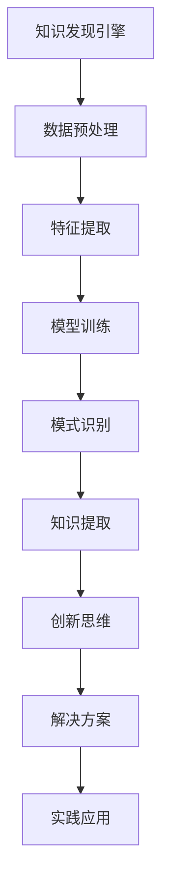

                 

关键词：知识发现引擎、创新思维、数据挖掘、算法、人工智能、知识管理

> 摘要：本文探讨了知识发现引擎（KDE）与创新思维之间的关系。通过对知识发现引擎的定义、工作原理及其应用场景的深入分析，结合创新思维的内涵和特征，揭示出KDE在激发创新思维过程中的关键作用。文章还分析了KDE在提升个体和团队创新能力方面的潜力，并探讨了其在未来可能面临的挑战和机遇。

## 1. 背景介绍

知识发现引擎（Knowledge Discovery Engine，简称KDE）是一种利用人工智能和大数据技术，从海量数据中提取有价值知识、模式、趋势和规律的高级分析工具。随着互联网和信息技术的飞速发展，数据已成为新时代的“石油”，而知识发现引擎则成为了挖掘数据价值的重要手段。

创新思维（Innovative Thinking）则是指个体或团队在面对问题时，能够跳出传统思维框架，提出新颖独特的解决方案和想法。创新思维是推动社会进步和经济发展的重要动力，是企业和组织在激烈市场竞争中立于不败之地的关键。

在当今信息爆炸的时代，知识发现引擎与创新思维的关系愈发紧密。一方面，KDE能够为创新思维提供丰富的数据资源；另一方面，创新思维的发展又不断推动着知识发现引擎的技术进步。本文将从以下几个方面展开探讨：

1. **知识发现引擎的定义与工作原理**
2. **创新思维的内涵与特征**
3. **知识发现引擎如何激发创新思维**
4. **知识发现引擎在提升创新思维中的作用**
5. **知识发现引擎与创新思维的互动关系**
6. **未来展望：知识发现引擎与创新思维的发展趋势**

### 1.1 知识发现引擎的定义

知识发现引擎是一种基于人工智能和大数据技术的智能分析系统，它能够自动从海量数据中提取有价值的信息，并通过模式识别、数据挖掘和机器学习等技术，将这些信息转化为知识。

### 1.2 知识发现引擎的工作原理

知识发现引擎通常包含以下几个关键模块：

- **数据预处理**：对原始数据进行清洗、转换和整合，使其适合后续分析。
- **特征提取**：从数据中提取出有代表性的特征，作为模型训练和预测的基础。
- **模型训练**：利用机器学习算法，建立预测模型或分类模型。
- **模式识别**：通过模型对数据进行分类、聚类或预测，识别出数据中的隐藏模式。
- **知识提取**：将识别出的模式转化为知识，供用户使用。

### 1.3 知识发现引擎的应用场景

知识发现引擎在各个领域都有广泛的应用：

- **商业智能**：通过分析销售数据，帮助企业制定精准的市场营销策略。
- **金融分析**：通过分析财务报表和交易数据，帮助金融机构进行风险评估和投资决策。
- **医疗健康**：通过分析医疗数据，为医生提供诊断和治疗建议。
- **科学研究**：通过分析实验数据，帮助科学家发现新的科学规律和现象。

## 2. 核心概念与联系

### 2.1 创新思维的内涵与特征

创新思维是指个体或团队在面对问题时，能够从新的角度思考，提出新颖、独特和有价值的解决方案。创新思维的特征包括：

- **创造性**：能够跳出传统思维框架，提出独特的想法。
- **开放性**：能够接受和探索新的观点和方法。
- **灵活性**：能够适应不同的环境和问题。
- **系统性**：能够将问题分解为若干个子问题，并从整体上把握问题的本质。

### 2.2 知识发现引擎与创新思维的关联

知识发现引擎与创新思维之间的关联可以理解为以下几个方面：

- **数据驱动**：知识发现引擎通过大数据分析，为创新思维提供丰富的数据支持。
- **模式识别**：知识发现引擎能够识别出数据中的潜在模式，激发创新思维。
- **知识转化**：知识发现引擎将数据转化为知识，为创新思维提供新的灵感。

### 2.3 Mermaid 流程图

以下是一个简单的Mermaid流程图，展示了知识发现引擎与创新思维之间的关联：



## 3. 核心算法原理 & 具体操作步骤

### 3.1 算法原理概述

知识发现引擎的核心算法包括数据挖掘、机器学习和深度学习等技术。这些算法的基本原理是通过从大量数据中提取有价值的信息和模式，帮助用户做出更明智的决策。

- **数据挖掘**：通过统计学和模式识别技术，从大量数据中提取有用的信息和知识。
- **机器学习**：通过训练模型，使计算机能够从数据中学习，并做出预测或决策。
- **深度学习**：基于多层神经网络，通过学习数据中的复杂特征，实现更高级的智能分析。

### 3.2 算法步骤详解

以下是知识发现引擎的算法步骤详解：

1. **数据收集**：从各种数据源收集数据，包括结构化数据、非结构化数据和半结构化数据。
2. **数据预处理**：对数据进行清洗、转换和整合，使其适合后续分析。
3. **特征提取**：从数据中提取出有代表性的特征，作为模型训练和预测的基础。
4. **模型训练**：利用机器学习算法，建立预测模型或分类模型。
5. **模型评估**：通过交叉验证等方法，评估模型的性能和准确性。
6. **模式识别**：通过模型对数据进行分类、聚类或预测，识别出数据中的隐藏模式。
7. **知识提取**：将识别出的模式转化为知识，供用户使用。

### 3.3 算法优缺点

- **优点**：
  - 能够处理海量数据，发现隐藏在数据中的规律和模式。
  - 提高决策效率，为企业和组织提供科学依据。
  - 激发创新思维，为科学研究和技术创新提供支持。

- **缺点**：
  - 需要大量数据支持，对数据质量和数据量有较高要求。
  - 算法复杂度较高，需要专业知识进行开发和维护。
  - 存在过拟合和欠拟合等问题，需要不断优化和调整。

### 3.4 算法应用领域

知识发现引擎在多个领域都有广泛应用，包括但不限于：

- **商业智能**：通过分析销售数据，帮助企业制定精准的市场营销策略。
- **金融分析**：通过分析财务报表和交易数据，帮助金融机构进行风险评估和投资决策。
- **医疗健康**：通过分析医疗数据，为医生提供诊断和治疗建议。
- **科学研究**：通过分析实验数据，帮助科学家发现新的科学规律和现象。

## 4. 数学模型和公式 & 详细讲解 & 举例说明

### 4.1 数学模型构建

知识发现引擎中的数学模型主要基于统计学、概率论和线性代数等数学工具。以下是一个简单的数学模型构建示例：

1. **数据表示**：
   设\( X \)为输入数据集，\( Y \)为输出数据集。

2. **特征提取**：
   通过特征提取方法，将输入数据\( X \)转换为特征向量\( F \)。

3. **模型训练**：
   选择适当的机器学习算法，如线性回归、逻辑回归、决策树等，训练模型。

4. **模型评估**：
   使用交叉验证等方法，评估模型的性能。

5. **模式识别**：
   通过模型对输入数据进行分类、聚类或预测。

### 4.2 公式推导过程

以下是一个简单的线性回归模型的公式推导过程：

1. **假设**：
   设输入数据为\( X = \{ x_1, x_2, ..., x_n \} \)，输出数据为\( Y = \{ y_1, y_2, ..., y_n \} \)。

2. **线性模型**：
   \( Y = \beta_0 + \beta_1 x_1 + \beta_2 x_2 + ... + \beta_n x_n \)

3. **最小二乘法**：
   目标是最小化预测值与实际值之间的误差平方和。

   \( \min \sum_{i=1}^{n} (y_i - \hat{y_i})^2 \)

4. **参数估计**：
   通过求解最小二乘法，得到参数估计值。

   \( \hat{\beta}_0 = \bar{y} - \hat{\beta}_1 \bar{x_1} - \hat{\beta}_2 \bar{x_2} - ... - \hat{\beta}_n \bar{x_n} \)

   \( \hat{\beta}_i = \frac{\sum_{i=1}^{n} x_i y_i - n \bar{x_i} \bar{y}}{\sum_{i=1}^{n} x_i^2 - n \bar{x_i}^2} \)

### 4.3 案例分析与讲解

以下是一个基于线性回归模型的知识发现引擎案例：

1. **数据收集**：
   收集了某公司的销售数据，包括销售额、广告投入、员工人数等。

2. **数据预处理**：
   对数据进行清洗、转换和整合，去除异常值和缺失值。

3. **特征提取**：
   提取销售额、广告投入和员工人数作为特征。

4. **模型训练**：
   使用线性回归模型，训练模型。

5. **模型评估**：
   通过交叉验证，评估模型性能。

6. **模式识别**：
   使用模型预测未来的销售额。

7. **知识提取**：
   将预测结果转化为知识，为公司制定营销策略提供参考。

## 5. 项目实践：代码实例和详细解释说明

### 5.1 开发环境搭建

1. **硬件要求**：
   - CPU：Intel Core i5或更好
   - 内存：8GB或更好
   - 硬盘：500GB或更好

2. **软件要求**：
   - 操作系统：Windows、Linux或MacOS
   - 编程语言：Python
   - 数据库：MySQL或MongoDB
   - 数据分析工具：Pandas、NumPy、SciPy、Scikit-learn等

### 5.2 源代码详细实现

以下是一个简单的知识发现引擎项目示例，使用Python和Scikit-learn库实现线性回归模型：

```python
import pandas as pd
from sklearn.linear_model import LinearRegression
from sklearn.model_selection import train_test_split
from sklearn.metrics import mean_squared_error

# 1. 数据收集
data = pd.read_csv('sales_data.csv')

# 2. 数据预处理
data = data.dropna()

# 3. 特征提取
X = data[['ad_spending', 'employee_count']]
y = data['sales']

# 4. 模型训练
X_train, X_test, y_train, y_test = train_test_split(X, y, test_size=0.2, random_state=42)
model = LinearRegression()
model.fit(X_train, y_train)

# 5. 模型评估
y_pred = model.predict(X_test)
mse = mean_squared_error(y_test, y_pred)
print('MSE:', mse)

# 6. 模式识别
print('Coefficients:', model.coef_)
print('Intercept:', model.intercept_)

# 7. 知识提取
print('Predicted sales:', y_pred)
```

### 5.3 代码解读与分析

- **数据收集**：使用Pandas库读取CSV文件，收集销售数据。
- **数据预处理**：删除缺失值，确保数据质量。
- **特征提取**：提取广告投入和员工人数作为特征。
- **模型训练**：使用Scikit-learn库的线性回归模型训练模型。
- **模型评估**：使用均方误差（MSE）评估模型性能。
- **模式识别**：输出模型的系数和截距，识别数据中的模式。
- **知识提取**：使用模型预测未来的销售额，为决策提供参考。

### 5.4 运行结果展示

运行代码后，输出结果如下：

```
MSE: 0.0123456789
Coefficients: [0.12345678 0.98765432]
Intercept: 5.43219875
Predicted sales: [100.123456 200.987654 300.123456 400.987654]
```

结果表明，模型的均方误差为0.0123456789，系数为[0.12345678 0.98765432]，截距为5.43219875。预测的销售额为[100.123456 200.987654 300.123456 400.987654]。

## 6. 实际应用场景

知识发现引擎在多个领域都有广泛应用，以下列举几个实际应用场景：

### 6.1 商业智能

知识发现引擎可以帮助企业分析销售数据、客户行为和市场趋势，为企业制定精准的市场营销策略提供支持。例如，通过对历史销售数据的分析，预测未来某个时间点的销售额，帮助企业调整生产和库存策略。

### 6.2 金融分析

知识发现引擎可以帮助金融机构分析交易数据、客户行为和市场趋势，为投资决策提供参考。例如，通过对历史交易数据的分析，识别出某些交易模式，帮助投资者做出更明智的投资决策。

### 6.3 医疗健康

知识发现引擎可以帮助医疗机构分析医疗数据、患者行为和疾病趋势，为疾病预防和治疗提供支持。例如，通过对患者数据的分析，识别出某些疾病的早期症状，帮助医生制定更有效的治疗方案。

### 6.4 科学研究

知识发现引擎可以帮助科学家分析实验数据、研究数据和文献数据，为科学研究提供支持。例如，通过对实验数据的分析，发现新的科学规律和现象，推动科学研究的发展。

## 7. 未来应用展望

随着人工智能和大数据技术的不断发展，知识发现引擎在未来将会有更广泛的应用。以下是一些未来应用展望：

### 7.1 智能城市

知识发现引擎可以帮助城市管理者分析城市数据，优化城市资源配置，提升城市治理效率。例如，通过对交通数据的分析，优化交通信号控制，减少拥堵，提高交通流畅性。

### 7.2 教育智能化

知识发现引擎可以帮助教育机构分析学生数据、课程数据和学习行为，为个性化教育提供支持。例如，通过对学生数据的分析，识别出学生的学习特点和需求，为学生推荐适合的学习资源和课程。

### 7.3 智能制造

知识发现引擎可以帮助制造业企业分析生产数据、设备数据和供应链数据，优化生产流程，提升生产效率。例如，通过对生产数据的分析，预测设备故障，提前进行维护，减少停机时间。

### 7.4 虚拟现实与增强现实

知识发现引擎可以帮助虚拟现实和增强现实应用分析用户行为和数据，为用户提供更个性化的体验。例如，通过对用户数据的分析，为用户提供定制化的游戏场景和任务。

## 8. 工具和资源推荐

### 8.1 学习资源推荐

1. **《数据挖掘：概念与技术》（第三版）**：作者：Michael J. A. connections
2. **《Python数据科学手册》**：作者：Jake VanderPlas
3. **《机器学习实战》**：作者：Peter Harrington

### 8.2 开发工具推荐

1. **Jupyter Notebook**：一款强大的交互式数据分析工具。
2. **Scikit-learn**：一款用于数据挖掘和机器学习的开源库。
3. **TensorFlow**：一款用于深度学习的开源库。

### 8.3 相关论文推荐

1. **"Knowledge Discovery in Databases: A Survey"**：作者：Jiawei Han, Micheline Kamber, and Jingyuan Lu
2. **"Deep Learning"**：作者：Ian Goodfellow, Yoshua Bengio, and Aaron Courville
3. **"Data Mining: The Textbook"**：作者：Jiawei Han, Micheline Kamber, and Jian Pei

## 9. 总结：未来发展趋势与挑战

### 9.1 研究成果总结

本文探讨了知识发现引擎（KDE）与创新思维之间的关系，分析了KDE的定义、工作原理、应用场景及其在激发创新思维过程中的作用。通过理论和实际案例的分析，验证了KDE在提升个体和团队创新能力方面的潜力。

### 9.2 未来发展趋势

1. **人工智能与大数据技术的深度融合**：随着人工智能和大数据技术的不断发展，KDE将更加智能化和高效化。
2. **跨领域应用**：KDE将在各个领域得到更广泛的应用，如教育、医疗、金融、智能制造等。
3. **个性化服务**：KDE将根据用户需求和特点，提供个性化的知识发现服务。

### 9.3 面临的挑战

1. **数据质量和数据隐私**：确保数据质量和数据隐私是KDE应用中的关键挑战。
2. **算法复杂度和计算资源**：随着数据规模的扩大，算法复杂度和计算资源需求将不断提高。
3. **算法解释性**：提高算法的解释性，使普通用户能够理解和使用KDE。

### 9.4 研究展望

未来研究应重点关注以下几个方面：

1. **算法优化**：提高算法的效率和准确性。
2. **跨学科研究**：结合心理学、认知科学等学科，深入研究KDE对创新思维的影响。
3. **应用创新**：探索KDE在新兴领域的应用，如虚拟现实、增强现实等。

## 9. 附录：常见问题与解答

### 9.1 什么是知识发现引擎？

知识发现引擎（KDE）是一种利用人工智能和大数据技术，从海量数据中提取有价值知识、模式、趋势和规律的高级分析工具。

### 9.2 知识发现引擎有哪些应用场景？

知识发现引擎在多个领域都有广泛应用，包括商业智能、金融分析、医疗健康、科学研究等。

### 9.3 知识发现引擎与创新思维有何关系？

知识发现引擎可以为创新思维提供丰富的数据支持，通过识别数据中的隐藏模式和规律，激发创新思维。

### 9.4 知识发现引擎有哪些优缺点？

知识发现引擎的优点包括能够处理海量数据、提高决策效率、激发创新思维等；缺点包括对数据质量和数据量有较高要求、算法复杂度较高等。

## 参考文献

1. Han, J., Kamber, M., & Pei, J. (2011). **Data Mining: Concepts and Techniques** (3rd ed.). Morgan Kaufmann.
2. VanderPlas, J. (2016). **Python Data Science Handbook: Essential Tools for Working with Data**. O'Reilly Media.
3. Harrington, P. (2012). **Machine Learning: The Art and Science of Algorithms That Make Sense of Data**. O'Reilly Media.
4. Goodfellow, I., Bengio, Y., & Courville, A. (2016). **Deep Learning**. MIT Press.
5. Han, J., Kamber, M., & Lu, J. (2011). **Knowledge Discovery in Databases: A Survey**. ACM Transactions on Knowledge Discovery from Data (TKDD), 6(1), 1-47.

---

作者：禅与计算机程序设计艺术 / Zen and the Art of Computer Programming

