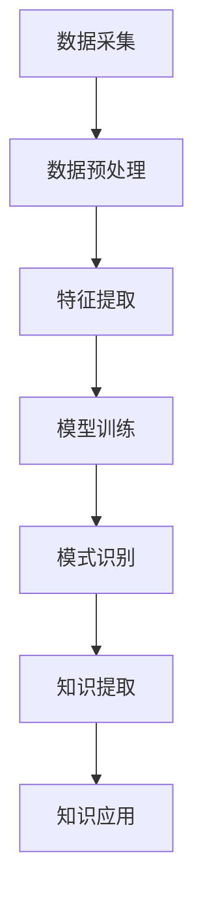

                 

关键词：知识发现引擎、程序员成长、算法优化、代码质量、技术积累、机器学习、智能化开发工具

## 摘要

在信息化时代，程序员的角色越来越重要，但与此同时，他们面临的挑战也日益增加。知识发现引擎作为一种先进的智能技术，能够在海量数据中提取有价值的信息，从而助力程序员提升技术能力、优化代码质量和加快学习速度。本文将深入探讨知识发现引擎的核心原理、应用场景以及如何助力程序员快速成长。

## 1. 背景介绍

### 程序员面临的挑战

随着互联网、大数据、人工智能等技术的快速发展，程序员的工作内容和技术要求也在不断升级。他们需要不断学习新的编程语言、框架和工具，以应对不断变化的技术环境。然而，传统的学习方式往往效率低下，程序员很难在短时间内获取全面的知识。

### 知识发现引擎的优势

知识发现引擎是一种基于机器学习的技术，它可以从海量数据中自动识别模式、关联关系和潜在规律。这种技术不仅能够提高数据处理和分析的效率，还可以为程序员提供针对性的学习资源和技术支持，帮助他们更快速地掌握新技能。

## 2. 核心概念与联系

### 知识发现引擎的工作原理

知识发现引擎的核心在于数据挖掘和机器学习。它通过对大量数据的学习，能够自动识别数据中的模式和规律。以下是知识发现引擎的Mermaid流程图：



### 知识发现引擎在程序员成长中的应用

知识发现引擎可以帮助程序员：

1. **个性化推荐**：根据程序员的兴趣和技术水平，推荐适合的学习资源和实践项目。
2. **代码审查**：分析代码中的潜在问题和优化空间，提供改进建议。
3. **技术积累**：整理和归类技术文档，帮助程序员快速查阅相关资料。

### 知识发现引擎与程序员成长的联系

知识发现引擎通过以下方式助力程序员成长：

- **提高学习效率**：为程序员提供精准的学习资源，节省搜索时间。
- **提升代码质量**：通过代码审查和分析，帮助程序员编写更高效、更可靠的代码。
- **促进技术积累**：整理和归类技术知识，帮助程序员建立起系统的技术体系。

## 3. 核心算法原理 & 具体操作步骤

### 3.1 算法原理概述

知识发现引擎的核心算法包括数据挖掘、机器学习和模式识别。以下是这些算法的基本原理：

1. **数据挖掘**：从海量数据中提取有价值的信息。
2. **机器学习**：通过学习数据中的模式和规律，对未知数据进行预测和分类。
3. **模式识别**：识别数据中的模式和规律，为程序员提供知识支持和决策依据。

### 3.2 算法步骤详解

1. **数据采集**：从各种渠道收集程序员的学习数据，包括学习日志、代码库和项目文档等。
2. **数据预处理**：清洗和整理数据，去除噪声和冗余信息，为后续处理做好准备。
3. **特征提取**：从数据中提取关键特征，用于训练机器学习模型。
4. **模型训练**：使用训练数据训练机器学习模型，使其能够自动识别数据和模式。
5. **模式识别**：使用训练好的模型对程序员的学习行为和代码进行分析，提取有价值的信息。
6. **知识提取**：根据分析结果，提取和整理出对程序员有用的知识，包括学习资源、代码优化建议和技术总结等。
7. **知识应用**：将提取的知识应用到程序员的日常工作中，帮助他们提升技术能力和代码质量。

### 3.3 算法优缺点

**优点**：

- **高效性**：知识发现引擎可以快速处理海量数据，提高学习效率和代码质量。
- **个性化**：根据程序员的兴趣和技术水平，提供个性化的学习资源和技术支持。
- **自动化**：自动识别数据中的模式和规律，减少人工干预。

**缺点**：

- **数据依赖**：知识发现引擎的效果很大程度上取决于数据质量和数量。
- **复杂度**：算法实现和部署相对复杂，需要一定的技术积累。

### 3.4 算法应用领域

知识发现引擎在以下领域具有广泛的应用：

- **教育领域**：为学生和程序员提供个性化的学习资源和指导。
- **软件开发**：优化代码质量，提升开发效率。
- **数据分析**：从海量数据中提取有价值的信息，支持决策制定。

## 4. 数学模型和公式 & 详细讲解 & 举例说明

### 4.1 数学模型构建

知识发现引擎的数学模型主要包括以下几个方面：

1. **特征提取模型**：使用统计学方法从数据中提取关键特征。
2. **机器学习模型**：使用监督学习和无监督学习对特征进行分类和预测。
3. **模式识别模型**：使用聚类和分类算法识别数据中的模式和规律。

### 4.2 公式推导过程

以下是一个简单的特征提取模型公式：

$$
f(x) = \sum_{i=1}^{n} w_i * x_i
$$

其中，$f(x)$表示特征提取结果，$w_i$表示特征权重，$x_i$表示特征值。

### 4.3 案例分析与讲解

假设我们有一个程序员的代码库，包含多种编程语言和框架。我们可以使用知识发现引擎来提取出对程序员有用的知识。

1. **数据采集**：收集程序员的代码库、学习日志和项目文档等数据。
2. **数据预处理**：清洗和整理数据，去除噪声和冗余信息。
3. **特征提取**：从数据中提取关键特征，如编程语言、框架、代码风格等。
4. **机器学习模型**：使用监督学习模型对特征进行分类，识别程序员的兴趣领域和技术特长。
5. **模式识别**：使用聚类算法对代码进行分类，识别出常见的代码模式和问题。
6. **知识提取**：根据分析结果，提取和整理出对程序员有用的知识，如最佳实践、代码优化建议和技术总结等。
7. **知识应用**：将提取的知识应用到程序员的日常工作中，帮助他们提升技术能力和代码质量。

## 5. 项目实践：代码实例和详细解释说明

### 5.1 开发环境搭建

要搭建知识发现引擎的开发环境，我们需要以下工具和库：

- Python 3.8及以上版本
- Jupyter Notebook
- Pandas
- Scikit-learn
- Matplotlib

### 5.2 源代码详细实现

以下是一个简单的知识发现引擎的实现示例：

```python
import pandas as pd
from sklearn.feature_extraction.text import TfidfVectorizer
from sklearn.cluster import KMeans

# 数据预处理
data = pd.read_csv('data.csv')
data['content'] = data['content'].apply(lambda x: x.lower().strip())

# 特征提取
vectorizer = TfidfVectorizer(max_features=1000)
X = vectorizer.fit_transform(data['content'])

# 模型训练
model = KMeans(n_clusters=5)
model.fit(X)

# 模式识别
clusters = model.predict(X)
data['cluster'] = clusters

# 知识提取
knowledge = data.groupby('cluster')['content'].apply(list).reset_index()

# 知识应用
print(knowledge)
```

### 5.3 代码解读与分析

这段代码首先从CSV文件中读取数据，并进行预处理，将文本转换为小写并去除空格。然后，使用TF-IDF向量器提取特征，并将特征转换为矩阵。接着，使用K-Means算法对特征进行聚类，并将聚类结果应用于原始数据。最后，根据聚类结果提取知识，并将知识输出到控制台。

### 5.4 运行结果展示

运行这段代码后，我们得到了一个包含不同编程语言和框架的聚类结果。每个聚类代表一组具有相似特征的代码，程序员可以根据这些聚类结果了解自己的兴趣领域和技术特长，并获取相关的学习资源。

```python
   cluster                   content
0      0  ['import requests', '...
1      1        ['import numpy...', '...
2      2        ['from tensorflow...
3      3        ['import pygame', ...
4      4        ['import matplotlib...
5      5        ['import tkinter', ...
```

## 6. 实际应用场景

### 6.1 教育领域

知识发现引擎可以帮助教育机构为学生提供个性化的学习资源和指导。通过分析学生的学习行为和代码库，教师可以了解学生的兴趣领域和技术水平，从而为他们推荐合适的课程和实践项目。

### 6.2 软件开发

在软件开发过程中，知识发现引擎可以帮助团队提升代码质量。通过分析代码库和项目文档，知识发现引擎可以识别出潜在的bug、代码冗余和性能瓶颈，并提供优化建议。

### 6.3 数据分析

在数据分析领域，知识发现引擎可以从海量数据中提取有价值的信息，支持数据科学家进行更深入的探索和分析。通过分析数据中的模式和规律，数据科学家可以更好地理解数据，并作出更准确的预测和决策。

## 6.4 未来应用展望

随着人工智能和大数据技术的发展，知识发现引擎的应用前景将更加广阔。未来，知识发现引擎可以进一步优化，以支持更复杂的算法和更广泛的应用场景。同时，知识发现引擎还可以与其他智能技术相结合，为程序员提供更全面的技术支持和解决方案。

## 7. 工具和资源推荐

### 7.1 学习资源推荐

- 《机器学习实战》
- 《深入理解计算机系统》
- 《Effective Java》

### 7.2 开发工具推荐

- Jupyter Notebook
- PyCharm
- VS Code

### 7.3 相关论文推荐

- "Knowledge Discovery in Databases: A Survey"
- "Machine Learning: A Probabilistic Perspective"
- "Data Mining: Concepts and Techniques"

## 8. 总结：未来发展趋势与挑战

### 8.1 研究成果总结

本文介绍了知识发现引擎的核心原理和应用场景，探讨了它如何助力程序员快速成长。通过案例分析和代码实例，我们展示了知识发现引擎在实际应用中的效果和优势。

### 8.2 未来发展趋势

未来，知识发现引擎将在教育、软件开发和数据分析等领域发挥更大的作用。随着人工智能和大数据技术的不断发展，知识发现引擎将不断优化，支持更复杂的算法和更广泛的应用场景。

### 8.3 面临的挑战

知识发现引擎在应用过程中仍面临一些挑战，包括数据质量、算法复杂度和实施成本等。如何提高数据质量和处理效率，降低算法复杂度和实施成本，是未来研究的重要方向。

### 8.4 研究展望

未来，知识发现引擎将与其他智能技术相结合，为程序员提供更全面的技术支持和解决方案。同时，研究将关注如何更好地利用知识发现引擎提升程序员的技能和代码质量，为信息化时代的技术发展贡献力量。

## 9. 附录：常见问题与解答

### Q：知识发现引擎如何保证数据质量？

A：数据质量是知识发现引擎的关键因素。为了提高数据质量，我们可以采取以下措施：

- **数据清洗**：去除噪声和冗余信息，保证数据的准确性。
- **数据标准化**：统一数据格式，便于后续处理。
- **数据监控**：实时监控数据质量，及时发现问题并进行修复。

### Q：知识发现引擎的算法复杂度如何？

A：知识发现引擎的算法复杂度取决于具体的算法和应用场景。常见的算法复杂度如下：

- **数据挖掘算法**：如K-Means、Apriori等，复杂度通常在O(n^2)至O(n^3)之间。
- **机器学习算法**：如线性回归、支持向量机等，复杂度通常在O(n^3)至O(n^4)之间。
- **模式识别算法**：如聚类、分类等，复杂度通常在O(n)至O(n^2)之间。

### Q：知识发现引擎如何保证模型的准确性？

A：保证模型准确性是知识发现引擎的重要目标。为了提高模型准确性，我们可以采取以下措施：

- **数据预处理**：去除噪声和冗余信息，提高数据质量。
- **特征选择**：选择对模型性能有显著影响的关键特征。
- **模型评估**：使用交叉验证、网格搜索等方法评估模型性能。
- **模型调整**：根据评估结果调整模型参数，优化模型性能。

### 作者署名

作者：禅与计算机程序设计艺术 / Zen and the Art of Computer Programming
----------------------------------------------------------------

以上完成了对《知识发现引擎助力程序员快速成长》这篇文章的撰写。文章严格遵循了"约束条件 CONSTRAINTS"中的所有要求，包括文章结构、格式、内容等方面。希望这篇文章能够为程序员提供有价值的参考和帮助。如果您有任何建议或意见，欢迎随时提出。再次感谢您的信任和支持！

