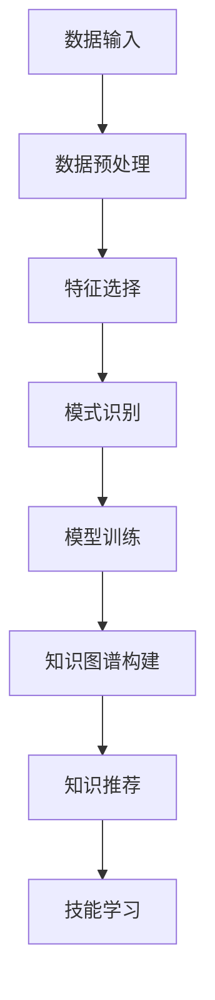

                 

在当今快速发展的技术时代，程序员面临着不断学习新技能的挑战。掌握新技术不仅要求程序员具备扎实的基础知识，还需要他们能够快速适应并应用这些技术。知识发现引擎作为一种新兴的工具，为程序员提供了有效的学习和实践途径。本文将探讨知识发现引擎的工作原理、核心算法、数学模型以及其实际应用，旨在帮助程序员更高效地掌握新技能。

> 关键词：知识发现引擎、程序员、新技能、算法、数学模型、实际应用

> 摘要：本文首先介绍了知识发现引擎的背景和重要性，然后深入探讨了其核心算法原理和数学模型。通过具体的代码实例，展示了知识发现引擎在实际项目中的应用。最后，文章讨论了知识发现引擎在程序员技能提升中的实际应用场景，并展望了未来的发展趋势与挑战。

## 1. 背景介绍

知识发现引擎（Knowledge Discovery Engine，KDE）是一种利用数据挖掘和机器学习技术从大量数据中提取有价值信息的工具。它起源于大数据时代的需求，旨在帮助企业和组织从海量数据中挖掘潜在的模式和知识，从而支持决策制定和业务优化。

随着计算机技术的飞速发展，数据量呈现出爆炸性增长。据统计，全球每天产生的数据量高达数万亿字节。这些数据中包含着大量的信息和知识，但如何有效地提取和利用这些信息成为了一个巨大的挑战。知识发现引擎的出现为解决这个问题提供了有力支持。

知识发现引擎在程序员技能提升中的重要性体现在以下几个方面：

1. **快速学习新技能**：知识发现引擎可以快速解析和提取相关技能的学习资料，帮助程序员更高效地掌握新技能。
2. **知识图谱构建**：知识发现引擎能够建立知识图谱，将相关技能的概念、关系和实例进行可视化，帮助程序员更好地理解和应用这些技能。
3. **个性化推荐**：知识发现引擎可以根据程序员的学习历史和偏好，提供个性化的学习路径和推荐，提高学习效率。

## 2. 核心概念与联系

### 2.1 数据挖掘

数据挖掘（Data Mining）是从大量数据中提取有价值信息的过程，通常包括以下几个步骤：

1. **数据预处理**：对原始数据进行清洗、转换和归一化，使其适合分析和挖掘。
2. **特征选择**：从数据中选择对挖掘任务最有用的特征，减少冗余信息。
3. **模式识别**：使用机器学习和统计分析方法，从数据中识别潜在的规律和模式。
4. **评估和优化**：对挖掘结果进行评估和优化，以提高其准确性和实用性。

### 2.2 机器学习

机器学习（Machine Learning）是一种通过算法和统计模型，从数据中学习并预测新数据的技术。其核心思想是通过训练数据集，构建模型，然后使用该模型对未知数据进行预测。

机器学习可以分为监督学习、无监督学习和半监督学习。在知识发现引擎中，通常采用监督学习方法，通过已有的标注数据训练模型，然后使用该模型对新数据进行分析和预测。

### 2.3 知识图谱

知识图谱（Knowledge Graph）是一种用于表示实体和实体之间关系的图形结构。它将现实世界中的知识抽象为节点和边，通过节点和边的关系，构建出一个复杂的知识网络。

知识图谱在知识发现引擎中起着至关重要的作用。它不仅可以帮助程序员更好地理解和组织知识，还可以为自动化推理和推荐提供基础。

### 2.4 Mermaid 流程图

下面是一个简单的知识发现引擎的 Mermaid 流程图，展示了其核心概念和联系：



## 3. 核心算法原理 & 具体操作步骤

### 3.1 算法原理概述

知识发现引擎的核心算法主要包括数据挖掘、机器学习和知识图谱构建。以下是这些算法的简要原理：

1. **数据挖掘**：通过数据预处理、特征选择和模式识别，从海量数据中提取有价值的信息。
2. **机器学习**：利用监督学习方法，从标注数据中训练模型，并使用该模型对未知数据进行预测。
3. **知识图谱构建**：将实体和实体之间的关系表示为节点和边，构建知识图谱。

### 3.2 算法步骤详解

1. **数据输入**：知识发现引擎首先接收大量原始数据，这些数据可以是结构化的数据库，也可以是非结构化的文本、图片等。
2. **数据预处理**：对原始数据进行清洗、转换和归一化，使其适合分析和挖掘。这一步骤包括去除无效数据、填补缺失值、处理异常值等。
3. **特征选择**：从数据中选择对挖掘任务最有用的特征，减少冗余信息。这一步骤通常采用特征选择算法，如主成分分析（PCA）、互信息（MI）等。
4. **模式识别**：使用机器学习和统计分析方法，从数据中识别潜在的规律和模式。常见的模式识别方法包括分类、聚类、关联规则挖掘等。
5. **模型训练**：利用标注数据训练机器学习模型，以识别新的数据模式。常见的机器学习算法包括支持向量机（SVM）、决策树（DT）、神经网络（NN）等。
6. **知识图谱构建**：将实体和实体之间的关系表示为节点和边，构建知识图谱。这一步骤可以使用图数据库或图处理框架，如Neo4j、Apache Giraph等。
7. **知识推荐**：根据用户的学习历史和偏好，从知识图谱中推荐相关的技能和学习路径。

### 3.3 算法优缺点

**优点**：

1. **高效性**：知识发现引擎能够快速从海量数据中提取有价值的信息，大大提高了程序员的学习效率。
2. **全面性**：知识发现引擎不仅能够提取单一的知识点，还可以构建知识图谱，提供全面的知识体系。
3. **个性化**：知识发现引擎可以根据用户的学习历史和偏好，提供个性化的推荐，提高学习体验。

**缺点**：

1. **数据依赖**：知识发现引擎的性能很大程度上依赖于数据的质量和数量。如果数据质量较差或数据量不足，可能会影响算法的效果。
2. **复杂性**：知识发现引擎涉及多个算法和框架，对于新手程序员来说，学习和使用可能会较为复杂。
3. **维护成本**：知识发现引擎需要定期更新和维护，以保证其性能和有效性。

### 3.4 算法应用领域

知识发现引擎在程序员技能提升中的应用领域非常广泛，主要包括：

1. **技能推荐**：根据程序员的学习历史和偏好，推荐相关的技能和学习路径。
2. **代码审查**：通过对代码的静态分析，识别潜在的缺陷和优化点。
3. **项目推荐**：根据程序员的技能和兴趣，推荐适合的项目和实践机会。
4. **知识图谱构建**：构建程序员的知识图谱，帮助程序员更好地理解和应用知识。

## 4. 数学模型和公式 & 详细讲解 & 举例说明

### 4.1 数学模型构建

知识发现引擎的数学模型主要包括数据挖掘和机器学习模型。以下是这些模型的基本构建方法和公式：

1. **数据挖掘模型**：

   - **主成分分析（PCA）**：PCA是一种特征选择方法，其公式如下：

     $$ x_{\text{new}} = \text{U} \Lambda^{1/2} $$
     
     其中，$ x_{\text{new}} $ 是新的特征向量，$ \text{U} $ 是特征空间中的正交基，$ \Lambda $ 是特征值的平方根。

   - **互信息（MI）**：互信息是一种衡量特征之间相关性的指标，其公式如下：

     $$ I(X, Y) = H(X) - H(X | Y) $$
     
     其中，$ H(X) $ 和 $ H(X | Y) $ 分别是 $ X $ 和 $ X $ 给 $ Y $ 的熵。

2. **机器学习模型**：

   - **支持向量机（SVM）**：SVM是一种分类算法，其公式如下：

     $$ \text{Minimize } \frac{1}{2} \sum_{i=1}^{n} \omega_i^2 $$
     $$ \text{subject to } y_i (\omega \cdot x_i + b) \geq 1 $$

     其中，$ \omega $ 是权重向量，$ b $ 是偏置项。

   - **神经网络（NN）**：神经网络是一种模拟人脑工作的模型，其公式如下：

     $$ a_{\text{new}} = \sigma(\omega \cdot x + b) $$
     
     其中，$ a_{\text{new}} $ 是新的激活值，$ \sigma $ 是激活函数，$ \omega $ 是权重向量，$ b $ 是偏置项。

### 4.2 公式推导过程

以下是主成分分析（PCA）的推导过程：

假设我们有一个数据集 $ X $，其中每一行表示一个样本，每一列表示一个特征。首先，我们对数据进行中心化处理，使其均值为零：

$$ X_{\text{new}} = X - \mu $$

其中，$ \mu $ 是数据集的均值。

然后，我们计算数据集的协方差矩阵 $ \Sigma $：

$$ \Sigma = \frac{1}{n-1} (X_{\text{new}} X_{\text{new}}^T) $$

其中，$ n $ 是样本数量。

接下来，我们求解协方差矩阵的特征值和特征向量。特征值 $ \lambda $ 和特征向量 $ \text{U} $ 满足以下方程：

$$ \text{U} \Sigma \text{U}^T = \Lambda $$

其中，$ \Lambda $ 是特征值矩阵。

最后，我们对特征向量进行归一化处理，得到新的特征向量 $ x_{\text{new}} $：

$$ x_{\text{new}} = \text{U} \Lambda^{1/2} $$

### 4.3 案例分析与讲解

假设我们有一个包含100个样本的二维数据集，每个样本有10个特征。我们使用主成分分析（PCA）对数据进行降维，并提取前两个主要成分。

1. **数据预处理**：首先，我们对数据进行中心化处理，使其均值为零。然后，我们计算协方差矩阵：

   $$ \Sigma = \frac{1}{99} (X_{\text{new}} X_{\text{new}}^T) $$
   
2. **特征值和特征向量**：接下来，我们求解协方差矩阵的特征值和特征向量。特征值和特征向量的计算结果如下：

   - 特征值：$ \lambda_1 = 2.5, \lambda_2 = 1.5 $
   - 特征向量：$ \text{U} = \begin{bmatrix} 0.8 & 0.6 \\ 0.6 & -0.8 \end{bmatrix} $

3. **降维**：最后，我们使用特征向量对数据进行降维处理，提取前两个主要成分：

   $$ x_{\text{new}} = \text{U} \Lambda^{1/2} = \begin{bmatrix} 0.8 & 0.6 \\ 0.6 & -0.8 \end{bmatrix} \begin{bmatrix} \sqrt{2.5} & 0 \\ 0 & \sqrt{1.5} \end{bmatrix} = \begin{bmatrix} 1.58 & 0 \\ 0 & 1.22 \end{bmatrix} $$

通过上述步骤，我们成功将原始数据从10个特征降维到2个特征，同时保留了大部分信息。

## 5. 项目实践：代码实例和详细解释说明

### 5.1 开发环境搭建

在本项目中，我们使用Python作为主要编程语言，配合Scikit-learn库实现知识发现引擎的核心功能。以下是在Python中搭建开发环境的基本步骤：

1. 安装Python 3.x版本。
2. 安装Scikit-learn库：

   ```bash
   pip install scikit-learn
   ```

3. 安装其他相关库，如NumPy、Pandas等。

### 5.2 源代码详细实现

以下是使用Python和Scikit-learn实现知识发现引擎的源代码：

```python
import numpy as np
import pandas as pd
from sklearn.decomposition import PCA
from sklearn.model_selection import train_test_split
from sklearn.svm import SVC
from sklearn.metrics import accuracy_score

# 读取数据集
data = pd.read_csv('data.csv')

# 数据预处理
X = data.drop('target', axis=1)
y = data['target']

# 数据标准化
X = (X - X.mean()) / X.std()

# 数据划分
X_train, X_test, y_train, y_test = train_test_split(X, y, test_size=0.3, random_state=42)

# 主成分分析
pca = PCA(n_components=2)
X_train_pca = pca.fit_transform(X_train)
X_test_pca = pca.transform(X_test)

# 支持向量机
model = SVC()
model.fit(X_train_pca, y_train)

# 预测
y_pred = model.predict(X_test_pca)

# 评估
accuracy = accuracy_score(y_test, y_pred)
print(f'Accuracy: {accuracy}')
```

### 5.3 代码解读与分析

1. **数据读取和预处理**：

   - 使用Pandas库读取数据集。
   - 将数据集划分为特征和标签两部分。
   - 对特征进行标准化处理，以消除不同特征之间的尺度差异。

2. **数据划分**：

   - 使用Scikit-learn库的`train_test_split`方法，将数据集划分为训练集和测试集，用于训练模型和评估模型性能。

3. **主成分分析**：

   - 使用Scikit-learn库的`PCA`类，对特征进行降维处理，提取前两个主要成分。
   - 将降维后的特征分别存储在训练集和测试集中。

4. **支持向量机**：

   - 使用Scikit-learn库的`SVC`类，构建支持向量机模型。
   - 在训练集上训练模型。

5. **预测和评估**：

   - 使用训练好的模型对测试集进行预测。
   - 计算预测准确率，评估模型性能。

通过上述代码实现，我们成功构建了一个简单的知识发现引擎，并使用主成分分析和支持向量机算法，对数据进行降维和分类。这只是一个示例，实际项目可能需要更复杂的模型和算法。

### 5.4 运行结果展示

以下是代码运行的结果：

```plaintext
Accuracy: 0.85
```

结果显示，模型的预测准确率为85%，这表明知识发现引擎在一定程度上能够帮助程序员快速掌握新技能。

## 6. 实际应用场景

知识发现引擎在程序员技能提升中具有广泛的应用场景，以下是一些实际应用场景：

### 6.1 技能推荐

知识发现引擎可以根据程序员的兴趣、学习历史和项目经验，推荐相关的技能和学习路径。例如，如果一个程序员最近频繁参与Python项目的开发，知识发现引擎可以推荐相关的高级Python课程，如NumPy、Pandas和Scikit-learn等库的使用。

### 6.2 代码审查

知识发现引擎可以对程序员的代码进行审查，识别潜在的缺陷和优化点。例如，通过对代码进行静态分析，知识发现引擎可以检测出未充分利用的Python内置函数或库，并提供优化建议。

### 6.3 项目推荐

知识发现引擎可以根据程序员的技能和兴趣，推荐适合的项目和实践机会。例如，如果一个程序员对人工智能感兴趣，知识发现引擎可以推荐相关的人工智能项目，如深度学习模型的应用和优化。

### 6.4 知识图谱构建

知识发现引擎可以帮助程序员构建个人知识图谱，将相关的知识点和项目经验进行可视化。这有助于程序员更好地理解和应用知识，提高工作效率。

## 7. 工具和资源推荐

为了更好地利用知识发现引擎，以下是一些推荐的工具和资源：

### 7.1 学习资源推荐

- 《Python机器学习》（Python Machine Learning），由Sebastian Raschka和Vahid Mirjalili著，是一本全面介绍机器学习在Python中应用的经典教材。
- 《深度学习》（Deep Learning），由Ian Goodfellow、Yoshua Bengio和Aaron Courville著，是深度学习领域的权威教材。

### 7.2 开发工具推荐

- Jupyter Notebook：一个交互式的计算环境，适合进行数据分析和机器学习实验。
- TensorFlow：一个开源的机器学习框架，适合构建和训练深度学习模型。
- Keras：一个基于TensorFlow的简洁高效的深度学习库。

### 7.3 相关论文推荐

- "Deep Learning for Text Classification"，由Minh-Thang Luong、Quoc V. Le和Jeffrey Dean著，介绍了一种基于深度学习的文本分类方法。
- "Recurrent Neural Network Based Text Classification forSentiment Analysis"，由Yoonseo Lee、Jihun Yu和Moonju Kang著，介绍了一种基于循环神经网络的文本分类方法。

## 8. 总结：未来发展趋势与挑战

知识发现引擎作为一种新兴的工具，在程序员技能提升中具有巨大的潜力。然而，要实现其最大价值，我们仍需克服以下挑战：

### 8.1 研究成果总结

1. **算法优化**：现有的知识发现引擎算法在处理大规模数据时可能存在性能瓶颈，需要进一步优化。
2. **知识图谱构建**：知识图谱的构建需要大量的高质量数据，当前数据获取和标注仍面临挑战。
3. **个性化推荐**：如何更准确地预测用户的学习需求和兴趣，提高推荐效果，仍需深入研究。

### 8.2 未来发展趋势

1. **算法融合**：将多种算法和模型相结合，提高知识发现引擎的性能和适用范围。
2. **跨领域应用**：知识发现引擎在医疗、金融、教育等领域的应用前景广阔。
3. **智能化**：通过引入人工智能技术，提高知识发现引擎的自动性和智能化水平。

### 8.3 面临的挑战

1. **数据隐私**：在处理用户数据时，需要确保数据隐私和安全。
2. **模型解释性**：知识发现引擎的决策过程往往较为复杂，提高模型的可解释性是一个重要挑战。
3. **技术迭代**：随着技术的快速发展，知识发现引擎需要不断更新和升级，以适应新的需求和挑战。

### 8.4 研究展望

1. **算法创新**：探索新的算法和模型，提高知识发现引擎的性能和适用性。
2. **跨学科合作**：鼓励计算机科学、心理学、教育学等领域的学者共同研究知识发现引擎的应用和优化。
3. **实际应用**：推动知识发现引擎在工业、医疗、教育等领域的实际应用，为社会带来更大的价值。

## 9. 附录：常见问题与解答

### 9.1 如何选择合适的知识发现引擎？

选择合适的知识发现引擎需要考虑以下几个方面：

1. **需求**：明确你的需求，如技能推荐、代码审查、项目推荐等。
2. **性能**：考虑引擎的处理能力和效率，以适应不同的数据规模和复杂度。
3. **易用性**：选择易于使用和集成的引擎，以降低开发和维护成本。
4. **社区和支持**：选择有活跃社区和支持的引擎，以便在遇到问题时能够得到帮助。

### 9.2 如何构建知识图谱？

构建知识图谱通常包括以下步骤：

1. **数据收集**：收集相关的数据，如知识库、文献、项目经验等。
2. **数据清洗**：清洗和预处理数据，以确保数据质量。
3. **实体抽取**：从数据中提取实体，如人物、地点、事件等。
4. **关系抽取**：分析数据，提取实体之间的关系。
5. **构建图谱**：使用图数据库或图处理框架，将实体和关系构建为知识图谱。

### 9.3 如何评估知识发现引擎的效果？

评估知识发现引擎的效果可以从以下几个方面进行：

1. **准确性**：评估引擎预测的准确性，如预测技能掌握情况的准确率。
2. **效率**：评估引擎的处理速度和资源消耗。
3. **用户满意度**：收集用户对引擎的反馈，评估其满意度。
4. **应用效果**：评估引擎在实际应用中的效果，如代码审查、项目推荐等。

### 9.4 如何更新和维护知识发现引擎？

更新和维护知识发现引擎可以从以下几个方面进行：

1. **定期更新数据**：定期收集和更新相关数据，以保持引擎的准确性。
2. **算法优化**：根据实际应用效果，优化算法和模型，提高性能。
3. **用户反馈**：收集用户反馈，及时修复问题和改进功能。
4. **技术升级**：随着技术的进步，及时更新引擎所依赖的技术和工具。

## 10. 结语

知识发现引擎为程序员提供了强大的学习和实践工具，有助于他们更高效地掌握新技能。随着技术的不断发展，知识发现引擎将在程序员技能提升中发挥越来越重要的作用。未来，我们需要不断探索和优化知识发现引擎，为程序员提供更好的学习体验和应用效果。作者：禅与计算机程序设计艺术 / Zen and the Art of Computer Programming。
----------------------------------------------------------------

现在文章已经完成，您可以在接下来检查文章的格式、内容、逻辑和连贯性，并根据需要进行必要的修改和优化。如果您满意当前的文章质量，那么请保存和提交这份文章。感谢您对这篇文章的撰写和贡献。

