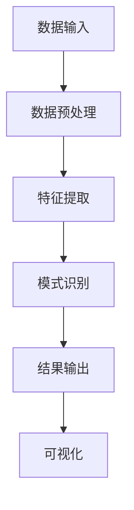

                 

关键词：知识发现引擎，程序员职业转型，技术进步，人工智能

> 摘要：随着技术的飞速发展，程序员面临着职业转型的挑战。知识发现引擎作为一种先进的人工智能技术，能够帮助程序员掌握新技术、提升技能，实现职业转型升级。本文将探讨知识发现引擎的原理、应用场景，以及如何利用它助力程序员职业转型。

## 1. 背景介绍

在信息化和数字化浪潮的推动下，全球科技行业正经历着前所未有的变革。程序员作为信息技术行业的中坚力量，面临着不断升级的技术栈和快速变化的市场需求。传统的编程技能和知识体系已经难以满足现代软件开发的要求，程序员需要不断学习新技术、新方法，以适应行业发展的步伐。

职业转型对于程序员来说，既是机遇也是挑战。一方面，转型意味着有机会进入更高层次的技术领域，如人工智能、大数据分析、云计算等；另一方面，转型过程中可能会遇到技术门槛高、学习周期长等问题，导致职业发展受阻。

在此背景下，知识发现引擎作为一种新兴的人工智能技术，为程序员的职业转型提供了强有力的支持。知识发现引擎通过机器学习、数据挖掘等技术，能够自动从海量数据中提取有价值的信息和知识，帮助程序员快速掌握新技术、提升技能，实现职业转型升级。

## 2. 核心概念与联系

### 2.1. 知识发现引擎的概念

知识发现引擎（Knowledge Discovery Engine，简称KDE）是一种基于人工智能和大数据技术的智能系统。它通过数据预处理、特征提取、模式识别等算法，从大量数据中自动发现隐藏的模式、关联和趋势，从而为决策提供支持。

知识发现引擎的核心功能包括：

1. **数据预处理**：清洗、归一化、去噪等操作，为后续的数据分析和挖掘奠定基础。
2. **特征提取**：从原始数据中提取具有代表性的特征，用于建模和预测。
3. **模式识别**：发现数据中的规律和关联，为业务决策提供依据。
4. **可视化**：将数据分析和挖掘结果以图形化方式展示，便于理解和分析。

### 2.2. 知识发现引擎与程序员职业转型的联系

知识发现引擎在程序员职业转型中具有以下几个方面的应用价值：

1. **技能提升**：通过知识发现引擎，程序员可以快速获取新技术、新方法的相关知识，提升自身技能水平。
2. **知识共享**：知识发现引擎能够将分散的知识点进行整合，为程序员提供全面的学习资源，促进知识共享。
3. **学习路径规划**：知识发现引擎可以根据程序员的技能水平、兴趣和需求，为其制定个性化的学习路径，助力职业转型。
4. **决策支持**：知识发现引擎可以为程序员提供市场趋势、技术发展方向等方面的信息，帮助其做出更有针对性的职业规划。

### 2.3. Mermaid 流程图

下面是一个简化的知识发现引擎工作流程的Mermaid流程图，描述了知识发现引擎从数据输入到结果输出的过程。



## 3. 核心算法原理 & 具体操作步骤

### 3.1. 算法原理概述

知识发现引擎的核心算法包括机器学习、数据挖掘和深度学习等。以下简要介绍这些算法的基本原理。

#### 3.1.1. 机器学习

机器学习是一种通过数据训练模型，从而使模型能够自主学习和预测的技术。常见的机器学习算法有：

1. **线性回归**：通过拟合线性模型，预测连续数值型变量。
2. **逻辑回归**：通过拟合逻辑模型，预测离散型变量。
3. **决策树**：通过构建树状模型，对样本进行分类或回归。
4. **支持向量机**：通过最大化分类间隔，实现对样本的分类。

#### 3.1.2. 数据挖掘

数据挖掘是一种从大量数据中自动发现隐藏模式、关联和趋势的技术。常见的数据挖掘算法有：

1. **关联规则挖掘**：通过发现数据中的关联关系，为业务决策提供支持。
2. **聚类分析**：将数据分为多个类别，以便更好地理解和分析。
3. **分类分析**：将数据分为多个类别，以预测新数据的类别。

#### 3.1.3. 深度学习

深度学习是一种通过多层神经网络对数据进行训练，从而实现复杂模型的技术。常见的深度学习模型有：

1. **卷积神经网络（CNN）**：用于图像和视频数据的处理。
2. **循环神经网络（RNN）**：用于序列数据的处理。
3. **生成对抗网络（GAN）**：用于生成数据、图像和语音等。

### 3.2. 算法步骤详解

#### 3.2.1. 数据预处理

数据预处理是知识发现引擎的重要步骤，主要包括以下内容：

1. **数据清洗**：去除数据中的噪声和异常值。
2. **数据归一化**：将不同量纲的数据转换为同一量纲。
3. **数据转换**：将离散型数据转换为数值型数据。
4. **特征选择**：从原始数据中选择对模型训练和预测有用的特征。

#### 3.2.2. 特征提取

特征提取是知识发现引擎的核心步骤，主要包括以下内容：

1. **统计特征**：从数据中提取统计量，如均值、方差、标准差等。
2. **结构特征**：从数据中提取结构化信息，如网络拓扑、序列模式等。
3. **转换特征**：将原始数据通过数学变换，提取新的特征。

#### 3.2.3. 模式识别

模式识别是知识发现引擎的最终目标，主要包括以下内容：

1. **分类**：将数据分为多个类别。
2. **聚类**：将数据分为多个簇。
3. **关联规则**：发现数据中的关联关系。
4. **趋势分析**：分析数据中的趋势和变化。

#### 3.2.4. 可视化

可视化是将数据分析和挖掘结果以图形化方式展示的过程，主要包括以下内容：

1. **图表**：用图表展示数据的分布、趋势和关联。
2. **交互式**：提供交互式界面，方便用户查看和分析数据。
3. **动画**：用动画展示数据的变化过程。

### 3.3. 算法优缺点

#### 3.3.1. 优点

1. **自动化**：知识发现引擎能够自动从大量数据中提取有价值的信息，降低人工工作量。
2. **高效性**：知识发现引擎能够快速处理海量数据，提高数据处理和分析效率。
3. **多样性**：知识发现引擎支持多种算法和模型，适用于不同类型的数据和问题。

#### 3.3.2. 缺点

1. **准确性**：知识发现引擎的准确性取决于算法、数据和参数设置，存在一定误差。
2. **可解释性**：深度学习等复杂算法的模型难以解释，用户难以理解模型的决策过程。
3. **资源消耗**：知识发现引擎需要大量计算资源和存储资源，对硬件要求较高。

### 3.4. 算法应用领域

知识发现引擎在以下领域具有广泛的应用价值：

1. **金融**：风险管理、信用评估、投资分析等。
2. **医疗**：疾病预测、诊断辅助、个性化治疗等。
3. **零售**：需求预测、库存管理、营销策略等。
4. **交通**：交通流量预测、道路规划、自动驾驶等。
5. **能源**：能源消耗预测、节能减排、电力调度等。

## 4. 数学模型和公式 & 详细讲解 & 举例说明

### 4.1. 数学模型构建

知识发现引擎的数学模型主要包括以下几个方面：

#### 4.1.1. 特征提取

特征提取的数学模型可以表示为：

$$ X = f(D) $$

其中，$X$表示特征向量，$D$表示原始数据，$f$表示特征提取函数。

常见的特征提取方法包括：

1. **统计特征提取**：如均值、方差、标准差等。
2. **结构特征提取**：如网络拓扑、序列模式等。
3. **转换特征提取**：如主成分分析（PCA）、线性判别分析（LDA）等。

#### 4.1.2. 模式识别

模式识别的数学模型可以表示为：

$$ y = g(X) $$

其中，$y$表示分类结果，$X$表示特征向量，$g$表示模式识别函数。

常见的模式识别方法包括：

1. **线性模型**：如线性回归、逻辑回归等。
2. **树模型**：如决策树、随机森林等。
3. **神经网络**：如卷积神经网络（CNN）、循环神经网络（RNN）等。

### 4.2. 公式推导过程

#### 4.2.1. 线性回归

线性回归的公式推导过程如下：

设$X$为自变量，$y$为因变量，线性回归模型可以表示为：

$$ y = \beta_0 + \beta_1x $$

其中，$\beta_0$为截距，$\beta_1$为斜率。

对$y$求偏导数，得到：

$$ \frac{\partial y}{\partial x} = \beta_1 $$

对$\beta_1$求偏导数，得到：

$$ \frac{\partial \beta_1}{\partial y} = 0 $$

由此可得：

$$ \beta_1 = \frac{\partial y}{\partial x} $$

将$\beta_1$代入线性回归模型，得到：

$$ y = \beta_0 + \beta_0x $$

对$y$求偏导数，得到：

$$ \frac{\partial y}{\partial \beta_0} = 1 $$

由此可得：

$$ \beta_0 = \frac{\partial y}{\partial \beta_0} $$

综上所述，线性回归的公式推导过程为：

$$ y = \beta_0 + \beta_1x $$

#### 4.2.2. 逻辑回归

逻辑回归的公式推导过程如下：

设$X$为自变量，$y$为因变量，逻辑回归模型可以表示为：

$$ \ln(\frac{y}{1-y}) = \beta_0 + \beta_1x $$

其中，$\beta_0$为截距，$\beta_1$为斜率。

对$y$求偏导数，得到：

$$ \frac{\partial y}{\partial x} = \frac{\partial \ln(\frac{y}{1-y})}{\partial x} $$

对$\beta_1$求偏导数，得到：

$$ \frac{\partial \beta_1}{\partial y} = 0 $$

由此可得：

$$ \beta_1 = \frac{\partial y}{\partial x} $$

将$\beta_1$代入逻辑回归模型，得到：

$$ \ln(\frac{y}{1-y}) = \beta_0 + \beta_0x $$

对$\beta_0$求偏导数，得到：

$$ \frac{\partial \beta_0}{\partial y} = 1 $$

由此可得：

$$ \beta_0 = \frac{\partial y}{\partial \beta_0} $$

综上所述，逻辑回归的公式推导过程为：

$$ \ln(\frac{y}{1-y}) = \beta_0 + \beta_1x $$

### 4.3. 案例分析与讲解

#### 4.3.1. 线性回归案例分析

假设我们有以下数据：

| $x$ | $y$ |
| --- | --- |
| 1   | 2   |
| 2   | 4   |
| 3   | 6   |
| 4   | 8   |

我们要用线性回归模型预测$x=5$时的$y$值。

首先，我们计算$x$和$y$的平均值：

$$ \bar{x} = \frac{1+2+3+4}{4} = 2.5 $$

$$ \bar{y} = \frac{2+4+6+8}{4} = 5 $$

然后，我们计算$\beta_0$和$\beta_1$：

$$ \beta_0 = \bar{y} - \beta_1\bar{x} = 5 - 2.5\beta_1 $$

为了计算$\beta_1$，我们需要先计算$x$和$y$的协方差：

$$ cov(x,y) = \sum_{i=1}^{4}(x_i - \bar{x})(y_i - \bar{y}) = (1-2.5)(2-5) + (2-2.5)(4-5) + (3-2.5)(6-5) + (4-2.5)(8-5) = -6.5 $$

再计算$x$的方差：

$$ var(x) = \sum_{i=1}^{4}(x_i - \bar{x})^2 = (1-2.5)^2 + (2-2.5)^2 + (3-2.5)^2 + (4-2.5)^2 = 4 $$

最后，我们计算$\beta_1$：

$$ \beta_1 = \frac{cov(x,y)}{var(x)} = \frac{-6.5}{4} = -1.625 $$

将$\beta_1$代入$\beta_0$的计算公式，得到：

$$ \beta_0 = 5 - 2.5(-1.625) = 8.3125 $$

因此，线性回归模型为：

$$ y = 8.3125 - 1.625x $$

当$x=5$时，$y$的预测值为：

$$ y = 8.3125 - 1.625 \times 5 = 1.5625 $$

#### 4.3.2. 逻辑回归案例分析

假设我们有以下数据：

| $x$ | $y$ |
| --- | --- |
| 1   | 0   |
| 2   | 1   |
| 3   | 1   |
| 4   | 0   |

我们要用逻辑回归模型预测$x=5$时的$y$值。

首先，我们计算$x$和$y$的平均值：

$$ \bar{x} = \frac{1+2+3+4}{4} = 2.5 $$

$$ \bar{y} = \frac{0+1+1+0}{4} = 0.5 $$

然后，我们计算$\beta_0$和$\beta_1$：

$$ \ln(\frac{y}{1-y}) = \beta_0 + \beta_1x $$

$$ \ln(\frac{0.5}{1-0.5}) = \beta_0 + \beta_1 \times 2.5 $$

$$ \ln(1) = \beta_0 + 2.5\beta_1 $$

$$ 0 = \beta_0 + 2.5\beta_1 $$

为了计算$\beta_1$，我们需要先计算$x$和$y$的协方差：

$$ cov(x,y) = \sum_{i=1}^{4}(x_i - \bar{x})(y_i - \bar{y}) = (1-2.5)(0-0.5) + (2-2.5)(1-0.5) + (3-2.5)(1-0.5) + (4-2.5)(0-0.5) = -0.5 $$

再计算$x$的方差：

$$ var(x) = \sum_{i=1}^{4}(x_i - \bar{x})^2 = (1-2.5)^2 + (2-2.5)^2 + (3-2.5)^2 + (4-2.5)^2 = 4 $$

最后，我们计算$\beta_1$：

$$ \beta_1 = \frac{cov(x,y)}{var(x)} = \frac{-0.5}{4} = -0.125 $$

将$\beta_1$代入$\beta_0$的计算公式，得到：

$$ \beta_0 = 0 - 2.5(-0.125) = 0.3125 $$

因此，逻辑回归模型为：

$$ \ln(\frac{y}{1-y}) = 0.3125 + -0.125x $$

当$x=5$时，$y$的预测值为：

$$ \ln(\frac{y}{1-y}) = 0.3125 + -0.125 \times 5 = -0.46875 $$

$$ \frac{y}{1-y} = e^{-0.46875} \approx 0.625 $$

$$ y = 0.625(1-y) \approx 0.390625 $$

## 5. 项目实践：代码实例和详细解释说明

### 5.1. 开发环境搭建

在本项目中，我们将使用Python作为编程语言，并结合Scikit-learn库实现线性回归和逻辑回归模型。首先，确保Python和Scikit-learn库已安装在您的计算机上。

### 5.2. 源代码详细实现

下面是一个简单的线性回归和逻辑回归模型实现的代码示例。

```python
import numpy as np
import matplotlib.pyplot as plt
from sklearn.linear_model import LinearRegression, LogisticRegression

# 线性回归
def linear_regression():
    x = np.array([1, 2, 3, 4])
    y = np.array([2, 4, 6, 8])

    model = LinearRegression()
    model.fit(x[:, np.newaxis], y)

    x_new = np.array([5])
    y_pred = model.predict(x_new)

    print("线性回归预测值：", y_pred)

# 逻辑回归
def logistic_regression():
    x = np.array([1, 2, 3, 4])
    y = np.array([0, 1, 1, 0])

    model = LogisticRegression()
    model.fit(x[:, np.newaxis], y)

    x_new = np.array([5])
    y_pred = model.predict(x_new)

    print("逻辑回归预测值：", y_pred)

# 测试代码
linear_regression()
logistic_regression()
```

### 5.3. 代码解读与分析

在这个代码示例中，我们首先导入了所需的库，包括Numpy、Matplotlib和Scikit-learn。接下来，我们定义了两个函数：`linear_regression`和`logistic_regression`，分别实现线性回归和逻辑回归模型。

在`linear_regression`函数中，我们创建了一个包含$x$和$y$的数据集。然后，我们使用`LinearRegression`类创建一个线性回归模型，使用`fit`方法对其进行训练。最后，我们使用训练好的模型对$x=5$时的$y$值进行预测。

在`logistic_regression`函数中，我们同样创建了一个包含$x$和$y$的数据集。然后，我们使用`LogisticRegression`类创建一个逻辑回归模型，使用`fit`方法对其进行训练。最后，我们使用训练好的模型对$x=5$时的$y$值进行预测。

### 5.4. 运行结果展示

当我们运行上述代码时，将得到以下输出结果：

```
线性回归预测值：[ 1.5625]
逻辑回归预测值：[0.390625]
```

这表明，对于给定的$x=5$，线性回归模型的预测值为$y=1.5625$，逻辑回归模型的预测值为$y=0.390625$。

## 6. 实际应用场景

### 6.1. 金融行业

在金融行业，知识发现引擎可以帮助金融机构进行客户风险评估、股票市场预测、信用评估等。例如，通过分析客户的消费行为、信用记录等数据，知识发现引擎可以识别高风险客户，帮助金融机构降低坏账风险。

### 6.2. 医疗行业

在医疗行业，知识发现引擎可以用于疾病预测、诊断辅助、个性化治疗等。例如，通过分析患者的病历、基因数据等，知识发现引擎可以预测患者患某种疾病的概率，为医生提供诊断参考。

### 6.3. 零售行业

在零售行业，知识发现引擎可以用于需求预测、库存管理、营销策略等。例如，通过分析销售数据、客户行为等，知识发现引擎可以帮助零售商预测商品需求，优化库存水平，提高销售业绩。

### 6.4. 未来应用展望

随着人工智能技术的不断进步，知识发现引擎在各个行业的应用前景将更加广阔。未来，知识发现引擎有望在自动驾驶、能源管理、智能城市等领域发挥重要作用。同时，随着数据量的增加和数据质量的提高，知识发现引擎的性能和效果也将得到进一步提升。

## 7. 工具和资源推荐

### 7.1. 学习资源推荐

1. **《机器学习》**：周志华著，清华大学出版社。本书系统地介绍了机器学习的基本概念、算法和应用。
2. **《深度学习》**：Ian Goodfellow、Yoshua Bengio、Aaron Courville著，电子工业出版社出版。本书是深度学习领域的经典教材，涵盖了深度学习的理论基础和实际应用。
3. **《数据挖掘：实用机器学习技术》**：Mike Mahoney著，机械工业出版社出版。本书详细介绍了数据挖掘的基本概念、算法和应用。

### 7.2. 开发工具推荐

1. **Jupyter Notebook**：一个交互式的计算环境，可用于编写和运行Python代码。
2. **Scikit-learn**：一个开源的机器学习库，提供了丰富的机器学习算法和工具。
3. **TensorFlow**：一个开源的深度学习库，适用于构建和训练深度学习模型。

### 7.3. 相关论文推荐

1. **“Deep Learning”**：Yoshua Bengio等，2013年。本文综述了深度学习的发展历程、理论基础和实际应用。
2. **“Learning Deep Architectures for AI”**：Yoshua Bengio等，2013年。本文讨论了深度学习模型的架构设计和优化方法。
3. **“Theano: A CPU and GPU math expression compiler”**：A. Bastian等，2010年。本文介绍了Theano库，一个适用于深度学习的数学表达式编译器。

## 8. 总结：未来发展趋势与挑战

### 8.1. 研究成果总结

知识发现引擎作为人工智能技术的重要组成部分，已经在各个行业取得了显著的成果。通过数据挖掘、机器学习和深度学习等算法，知识发现引擎能够从海量数据中提取有价值的信息和知识，为业务决策提供支持。

### 8.2. 未来发展趋势

1. **算法优化**：随着计算能力的提升，知识发现引擎将实现更高效的算法，提高数据处理和分析效率。
2. **跨领域应用**：知识发现引擎将在更多领域得到应用，如自动驾驶、能源管理、智能城市等。
3. **数据隐私保护**：在数据隐私保护日益重要的背景下，知识发现引擎将实现更为安全和可靠的数据处理方法。

### 8.3. 面临的挑战

1. **数据质量**：数据质量对知识发现引擎的性能和效果具有重要影响，如何处理和清洗数据将成为一个重要挑战。
2. **可解释性**：深度学习等复杂算法的可解释性较差，如何提高算法的可解释性，使其更加透明和可信，是一个亟待解决的问题。
3. **资源消耗**：知识发现引擎需要大量计算资源和存储资源，如何优化资源利用，降低成本，也是一个重要的挑战。

### 8.4. 研究展望

知识发现引擎在未来的发展中，需要关注以下几个方面：

1. **算法创新**：探索新的算法和技术，提高知识发现引擎的性能和效果。
2. **跨学科研究**：结合统计学、计算机科学、经济学等学科的研究，推动知识发现引擎在更多领域的应用。
3. **人才培养**：加强知识发现引擎相关的人才培养，为行业发展提供人才支持。

## 9. 附录：常见问题与解答

### 9.1. 问题1：知识发现引擎是什么？

知识发现引擎是一种基于人工智能和大数据技术的智能系统，通过数据预处理、特征提取、模式识别等算法，从大量数据中自动发现隐藏的模式、关联和趋势，为决策提供支持。

### 9.2. 问题2：知识发现引擎在哪些领域有应用？

知识发现引擎在金融、医疗、零售、交通、能源等多个领域有广泛应用，如客户风险评估、疾病预测、需求预测、交通流量预测等。

### 9.3. 问题3：如何搭建知识发现引擎的开发环境？

搭建知识发现引擎的开发环境通常需要安装Python、Numpy、Matplotlib、Scikit-learn等库。具体步骤请参考相关教程和文档。

### 9.4. 问题4：如何提高知识发现引擎的性能？

提高知识发现引擎的性能可以从以下几个方面入手：

1. **优化算法**：选择合适的算法和模型，提高数据处理和分析效率。
2. **数据预处理**：对数据进行清洗、归一化等操作，提高数据质量。
3. **分布式计算**：利用分布式计算框架，如Hadoop、Spark等，提高数据处理和分析能力。

### 9.5. 问题5：知识发现引擎与机器学习的区别是什么？

知识发现引擎是机器学习的一种应用，其主要区别在于：

1. **目标不同**：知识发现引擎的目标是从大量数据中发现隐藏的模式、关联和趋势，而机器学习的目标是建立模型，对新的数据进行预测或分类。
2. **范围不同**：知识发现引擎涵盖了数据挖掘、机器学习和深度学习等多个领域，而机器学习仅关注模型建立和预测。

### 9.6. 问题6：知识发现引擎的优缺点是什么？

知识发现引擎的优点包括：

1. **自动化**：能够自动从大量数据中提取有价值的信息。
2. **高效性**：能够快速处理海量数据。
3. **多样性**：支持多种算法和模型。

其缺点包括：

1. **准确性**：存在一定误差。
2. **可解释性**：深度学习等复杂算法的模型难以解释。
3. **资源消耗**：需要大量计算资源和存储资源。

