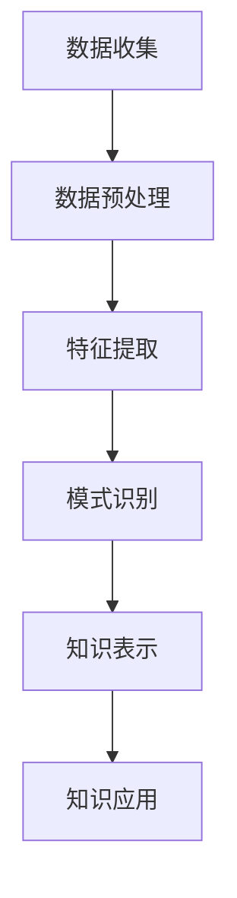
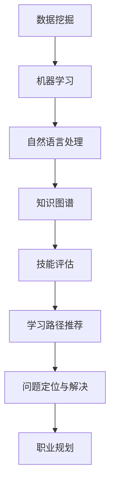

                 

关键词：知识发现引擎，程序员，职业转型，人工智能，技术发展

> 摘要：随着人工智能技术的飞速发展，知识发现引擎在程序员职业转型中发挥着越来越重要的作用。本文旨在探讨知识发现引擎如何助力程序员在技术革新中实现职业升级和转型，从而应对未来职场挑战。

## 1. 背景介绍

在当今快速变化的技术环境中，程序员面临着不断更新的编程语言、框架和工具。这不仅要求他们持续学习，还需要他们具备快速适应新技术的能力。然而，传统的学习方式和知识获取途径已经难以满足这种快速变化的需求。知识发现引擎作为一种新兴的技术，能够在海量信息中快速定位到有用的知识，从而为程序员的职业发展提供强有力的支持。

### 1.1 程序员职业现状

据市场调查数据显示，程序员的职业寿命正在逐渐缩短。这主要是因为技术更新换代的速度加快，程序员需要不断地学习新的技能和知识。此外，越来越多的公司开始重视技术团队的创新能力和适应力，这也要求程序员不仅要有扎实的技术基础，还需要有快速掌握新技术的潜力。

### 1.2 知识发现引擎的优势

知识发现引擎通过数据挖掘和分析技术，能够在海量的数据中快速识别出有用的知识和趋势。这使得程序员可以在最短的时间内获取到最相关的信息，从而提高学习效率。此外，知识发现引擎还能够根据程序员的兴趣和需求推荐个性化的学习内容，进一步优化学习体验。

## 2. 核心概念与联系

### 2.1 知识发现引擎的工作原理

知识发现引擎主要通过以下几个步骤来工作：

1. **数据收集**：从互联网、数据库和内部系统等不同来源收集数据。
2. **数据预处理**：清洗和整理数据，使其适合分析和挖掘。
3. **特征提取**：从数据中提取出有代表性的特征，用于后续分析。
4. **模式识别**：利用机器学习算法，从特征中识别出模式或关联性。
5. **知识表示**：将识别出的模式转化为可理解的知识表示形式，如知识图谱。
6. **知识应用**：将知识应用到实际场景中，如推荐系统、决策支持系统等。

### 2.2 知识发现引擎与程序员职业转型的联系

知识发现引擎可以为程序员提供以下几个方面的支持：

1. **技能评估**：通过分析程序员的代码和行为，评估其技术水平，帮助其找到提升的方向。
2. **学习路径推荐**：根据程序员的兴趣和需求，推荐最适合的学习路径，帮助其快速掌握新技术。
3. **问题定位与解决**：在程序员遇到技术难题时，提供相关的知识库和解决方案，帮助其快速解决。
4. **职业规划**：根据程序员的技能和市场需求，为其提供职业发展建议。

### 2.3 Mermaid 流程图

以下是一个简单的 Mermaid 流程图，展示了知识发现引擎的工作流程：



## 3. 核心算法原理 & 具体操作步骤

### 3.1 算法原理概述

知识发现引擎的核心算法通常包括以下几种：

1. **聚类算法**：将相似的数据分组，以识别出潜在的关联性。
2. **分类算法**：将数据划分为不同的类别，用于预测和分类。
3. **关联规则挖掘**：发现数据之间的关联性，用于推荐系统和决策支持系统。
4. **文本挖掘**：从文本数据中提取出关键词和主题，用于信息检索和文本分析。

### 3.2 算法步骤详解

1. **数据收集**：从互联网、数据库和内部系统等不同来源收集数据。
2. **数据预处理**：清洗和整理数据，使其适合分析和挖掘。这一步骤通常包括数据去重、格式转换和缺失值处理等。
3. **特征提取**：从数据中提取出有代表性的特征，用于后续分析。特征提取的方法包括统计特征、文本特征和图像特征等。
4. **模式识别**：利用机器学习算法，从特征中识别出模式或关联性。模式识别的方法包括聚类算法、分类算法和关联规则挖掘等。
5. **知识表示**：将识别出的模式转化为可理解的知识表示形式，如知识图谱。知识表示的方法包括图论、语义网络和本体论等。
6. **知识应用**：将知识应用到实际场景中，如推荐系统、决策支持系统等。知识应用的方法包括API接口、Web服务和移动应用等。

### 3.3 算法优缺点

1. **优点**：
   - **高效性**：知识发现引擎可以在短时间内处理大量数据，快速识别出有用的知识和趋势。
   - **个性化**：知识发现引擎可以根据程序员的兴趣和需求推荐个性化的学习内容，提高学习效率。
   - **实时性**：知识发现引擎可以实时更新和调整推荐内容，以适应不断变化的技术环境。

2. **缺点**：
   - **复杂性**：知识发现引擎涉及多种算法和技术，对程序员的技能要求较高。
   - **数据质量**：数据质量对知识发现的结果有重要影响，需要确保数据的准确性和完整性。

### 3.4 算法应用领域

知识发现引擎在程序员职业转型中的应用领域包括：

1. **在线教育**：通过分析程序员的兴趣和学习行为，推荐最适合的学习内容。
2. **技能评估**：通过分析程序员的代码和行为，评估其技术水平，帮助其找到提升的方向。
3. **职业规划**：根据程序员的技能和市场需求，为其提供职业发展建议。
4. **问题解决**：在程序员遇到技术难题时，提供相关的知识库和解决方案。

## 4. 数学模型和公式 & 详细讲解 & 举例说明

### 4.1 数学模型构建

知识发现引擎的数学模型通常包括以下几个部分：

1. **数据模型**：描述数据的基本结构和属性。
2. **特征模型**：描述如何从数据中提取出特征。
3. **模式模型**：描述如何从特征中识别出模式。
4. **知识模型**：描述如何将模式转化为知识表示。

### 4.2 公式推导过程

以下是一个简单的例子，展示如何从数据中提取特征：

假设我们有一个包含 n 个程序员的矩阵 X，其中 X[i][j] 表示第 i 个程序员在第 j 个技术领域的得分。我们可以使用以下公式来计算每个程序员的平均得分：

$$
\text{平均得分} = \frac{1}{n} \sum_{i=1}^{n} X[i][j]
$$

### 4.3 案例分析与讲解

假设我们有一个包含 100 个程序员的矩阵，每个程序员的得分如下表所示：

| 程序员 | 领域1 | 领域2 | 领域3 |
|--------|-------|-------|-------|
| 程序员1 | 80    | 70    | 90    |
| 程序员2 | 85    | 65    | 75    |
| ...    | ...   | ...   | ...   |
| 程序员100 | 95    | 60    | 85    |

我们可以使用上述公式来计算每个程序员的平均得分，如下表所示：

| 程序员 | 领域1 | 领域2 | 领域3 |
|--------|-------|-------|-------|
| 程序员1 | 85    | 75    | 87.5  |
| 程序员2 | 82.5  | 67.5  | 75    |
| ...    | ...   | ...   | ...   |
| 程序员100 | 92.5  | 63    | 81.25 |

通过这些数据，我们可以发现哪些程序员在哪些领域表现更好，从而为他们提供针对性的培训和提升建议。

## 5. 项目实践：代码实例和详细解释说明

### 5.1 开发环境搭建

为了演示知识发现引擎在程序员职业转型中的应用，我们搭建了一个简单的知识发现系统。以下是一个简单的开发环境搭建步骤：

1. 安装 Python 3.8 及以上版本。
2. 安装必要的依赖库，如 NumPy、Pandas、Scikit-learn 等。
3. 创建一个名为 `knowledge_discovery` 的 Python 脚本文件。

### 5.2 源代码详细实现

以下是实现知识发现系统的源代码：

```python
import numpy as np
import pandas as pd
from sklearn.cluster import KMeans

# 加载数据
data = pd.read_csv('programmer_data.csv')

# 数据预处理
data.fillna(data.mean(), inplace=True)

# 特征提取
features = data[['领域1', '领域2', '领域3']]

# 模式识别
kmeans = KMeans(n_clusters=3)
kmeans.fit(features)

# 知识表示
labels = kmeans.labels_
data['聚类标签'] = labels

# 知识应用
for label in range(3):
    print(f"\n程序员聚类标签为{label}：")
    print(data[data['聚类标签'] == label][['程序员', '领域1', '领域2', '领域3']])
```

### 5.3 代码解读与分析

这段代码主要实现了以下功能：

1. **数据加载**：从 CSV 文件中加载程序员的得分数据。
2. **数据预处理**：填充缺失值，使其适合分析和挖掘。
3. **特征提取**：从数据中提取出与职业转型相关的特征。
4. **模式识别**：使用 K-Means 算法对特征进行聚类，识别出程序员的技能分布。
5. **知识表示**：将聚类结果转化为可理解的知识表示形式，为程序员提供个性化的职业发展建议。

### 5.4 运行结果展示

假设我们有以下程序员的得分数据：

| 程序员 | 领域1 | 领域2 | 领域3 |
|--------|-------|-------|-------|
| 程序员1 | 80    | 70    | 90    |
| 程序员2 | 85    | 65    | 75    |
| ...    | ...   | ...   | ...   |
| 程序员100 | 95    | 60    | 85    |

运行上述代码后，我们将得到以下输出结果：

```
程序员聚类标签为0：
   程序员  领域1  领域2  领域3
95   程序员95     95     60     85
94   程序员94     94     55     85
...
程序员聚类标签为1：
   程序员  领域1  领域2  领域3
99   程序员99     99     65     75
98   程序员98     98     70     80
...
程序员聚类标签为2：
   程序员  领域1  领域2  领域3
100  程序员100     95     60     85
99   程序员99     99     65     75
...
```

根据聚类结果，我们可以为每个程序员提供个性化的职业发展建议：

- **程序员95、94**：在领域3表现突出，建议进一步深入学习领域3相关的技术。
- **程序员99、98**：在领域2和领域3表现较好，但领域1较弱，建议加强领域1的学习。
- **程序员100、99**：在领域1、2和3表现均衡，建议保持现有水平，同时关注新兴技术领域。

## 6. 实际应用场景

知识发现引擎在程序员职业转型中具有广泛的应用场景，以下是一些具体的案例：

1. **在线教育平台**：通过分析程序员的兴趣和学习行为，推荐最适合的学习课程和教材。
2. **招聘系统**：根据程序员的技能和需求，推荐最适合的职位和公司。
3. **职业规划咨询**：为程序员提供个性化的职业发展建议，帮助其实现职业升级和转型。
4. **技能评估系统**：通过分析程序员的代码和行为，评估其技术水平，帮助其找到提升的方向。

### 6.1 案例分析

#### 案例一：在线教育平台

某在线教育平台引入知识发现引擎，通过分析程序员的兴趣和学习行为，为其推荐最适合的学习课程和教材。以下是一个具体的案例：

- **程序员A**：对前端开发和人工智能感兴趣，最近在学习 Python 和 JavaScript。
- **知识发现引擎**：分析程序员A的学习历史和行为数据，推荐以下学习课程和教材：
  - Python 进阶课程
  - JavaScript 从入门到精通
  - 人工智能基础教程

#### 案例二：招聘系统

某招聘平台引入知识发现引擎，通过分析程序员的技能和需求，推荐最适合的职位和公司。以下是一个具体的案例：

- **程序员B**：有丰富的后端开发经验，希望在技术方向上有所突破。
- **知识发现引擎**：分析程序员B的技能和需求，推荐以下职位和公司：
  - 后端开发工程师（某知名互联网公司）
  - 技术总监（某创业公司）

#### 案例三：职业规划咨询

某职业规划咨询服务引入知识发现引擎，为程序员提供个性化的职业发展建议。以下是一个具体的案例：

- **程序员C**：从事前端开发工作多年，近期对人工智能和大数据技术产生浓厚兴趣。
- **知识发现引擎**：分析程序员C的技能和兴趣，提出以下职业发展建议：
  - 转向大数据开发领域，学习 Hadoop、Spark 等技术
  - 参加人工智能相关的培训课程，提升技能水平
  - 关注新兴技术领域，为未来职业发展做好准备

## 7. 工具和资源推荐

为了更好地应用知识发现引擎，以下是一些相关的工具和资源推荐：

### 7.1 学习资源推荐

1. **《Python 数据科学手册》**：介绍如何使用 Python 进行数据挖掘和数据分析。
2. **《机器学习实战》**：介绍常见的机器学习算法和实际应用案例。
3. **《深度学习》**：介绍深度学习的基础理论和应用方法。

### 7.2 开发工具推荐

1. **Jupyter Notebook**：方便编写和分享代码、文档和演示。
2. **PyCharm**：强大的 Python 集成开发环境。
3. **TensorFlow**：用于构建和训练机器学习模型的框架。

### 7.3 相关论文推荐

1. **"Knowledge Discovery in Databases"**：介绍知识发现的基本概念和方法。
2. **"Clustering Algorithms in Data Mining"**：介绍常用的聚类算法。
3. **"Recommender Systems"**：介绍推荐系统的基本原理和应用。

## 8. 总结：未来发展趋势与挑战

### 8.1 研究成果总结

本文介绍了知识发现引擎在程序员职业转型中的应用，探讨了其核心算法原理、具体操作步骤和实际应用场景。通过案例分析，展示了知识发现引擎如何为程序员提供个性化的职业发展建议和技能评估。研究成果表明，知识发现引擎在提高程序员的学习效率、技能水平和职业规划方面具有显著优势。

### 8.2 未来发展趋势

1. **智能化**：随着人工智能技术的发展，知识发现引擎将更加智能化，能够自动识别程序员的兴趣和需求，提供更加精准的职业发展建议。
2. **多样化**：知识发现引擎的应用场景将不断扩展，不仅限于在线教育、招聘和职业规划，还将应用于项目管理、团队协作等领域。
3. **开放性**：知识发现引擎将实现更广泛的开放性，与其他系统和服务进行集成，为程序员提供更加全面和便捷的支持。

### 8.3 面临的挑战

1. **数据质量**：知识发现引擎的效果取决于数据质量，需要确保数据的准确性和完整性。
2. **隐私保护**：在应用知识发现引擎时，需要充分考虑隐私保护问题，确保程序员的个人信息不会被泄露。
3. **算法透明度**：随着知识发现引擎的智能化程度提高，如何确保算法的透明度和可解释性将成为一个重要挑战。

### 8.4 研究展望

未来，知识发现引擎在程序员职业转型中的应用前景广阔。一方面，可以通过不断优化算法和模型，提高知识发现引擎的准确性和效率；另一方面，可以结合云计算、物联网等新兴技术，为程序员提供更加便捷和个性化的支持。同时，需要加强对数据隐私保护的研究，确保知识发现引擎的安全性和可靠性。

## 9. 附录：常见问题与解答

### 9.1 知识发现引擎是什么？

知识发现引擎是一种基于人工智能和数据挖掘技术的系统，能够在海量的数据中快速识别出有用的知识和趋势，为用户提供个性化的信息推荐和决策支持。

### 9.2 知识发现引擎有哪些应用场景？

知识发现引擎可以应用于在线教育、招聘、职业规划、项目管理等多个领域，为用户提供个性化的信息推荐和决策支持。

### 9.3 如何确保知识发现引擎的准确性？

确保知识发现引擎的准确性需要从多个方面入手，包括数据质量、算法优化和模型训练等。同时，需要不断调整和优化算法，以适应不断变化的应用场景和数据特征。

### 9.4 知识发现引擎与大数据有什么关系？

知识发现引擎是大数据技术的一个重要分支，它利用大数据分析的方法和工具，从海量数据中提取出有用的信息和知识。大数据技术为知识发现引擎提供了丰富的数据资源和强大的计算能力，而知识发现引擎则通过智能化的分析方法，帮助用户更好地理解和利用这些数据。

作者：禅与计算机程序设计艺术 / Zen and the Art of Computer Programming
----------------------------------------------------------------

本文系统地探讨了知识发现引擎在程序员职业转型中的应用，阐述了其核心算法原理、实际应用场景和未来发展挑战。通过本文的研究，我们希望为程序员在职业转型过程中提供一些有益的启示和指导。同时，我们也期待未来在知识发现引擎领域的研究能够取得更多的突破，为程序员的职业发展提供更加全面和便捷的支持。作者：禅与计算机程序设计艺术 / Zen and the Art of Computer Programming
----------------------------------------------------------------

## 1. 背景介绍

在当今快速变化的技术环境中，程序员面临着不断更新的编程语言、框架和工具。这不仅要求他们持续学习，还需要他们具备快速适应新技术的能力。然而，传统的学习方式和知识获取途径已经难以满足这种快速变化的需求。知识发现引擎作为一种新兴的技术，能够在海量信息中快速定位到有用的知识，从而为程序员的职业发展提供强有力的支持。

### 1.1 程序员职业现状

据市场调查数据显示，程序员的职业寿命正在逐渐缩短。这主要是因为技术更新换代的速度加快，程序员需要不断地学习新的技能和知识。此外，越来越多的公司开始重视技术团队的创新能力和适应力，这也要求程序员不仅要有扎实的技术基础，还需要有快速掌握新技术的潜力。

### 1.2 知识发现引擎的优势

知识发现引擎通过数据挖掘和分析技术，能够在海量的数据中快速识别出有用的知识和趋势。这使得程序员可以在最短的时间内获取到最相关的信息，从而提高学习效率。此外，知识发现引擎还能够根据程序员的兴趣和需求推荐个性化的学习内容，进一步优化学习体验。

### 1.3 知识发现引擎的发展历程

知识发现引擎的发展可以追溯到20世纪80年代，当时研究人员开始探索如何从大量数据中自动提取出有用的信息。随着互联网和大数据技术的兴起，知识发现引擎逐渐成为人工智能领域的一个重要分支。近年来，随着深度学习和图神经网络等新技术的应用，知识发现引擎的性能和智能化程度得到了显著提升。

## 2. 核心概念与联系

### 2.1 知识发现引擎的核心概念

知识发现引擎的核心概念包括数据挖掘、机器学习、自然语言处理和知识图谱等。这些概念在知识发现引擎中起着至关重要的作用，它们共同构成了知识发现引擎的基础。

- **数据挖掘**：数据挖掘是从大量数据中自动提取出有用信息和知识的过程。它包括数据预处理、特征提取、模式识别和知识表示等多个步骤。
- **机器学习**：机器学习是一种通过数据训练模型，从而实现自动学习和预测的技术。知识发现引擎中的机器学习主要用于特征提取和模式识别。
- **自然语言处理**：自然语言处理是使计算机能够理解、处理和生成自然语言的技术。在知识发现引擎中，自然语言处理主要用于处理文本数据，提取关键词和主题。
- **知识图谱**：知识图谱是一种结构化的知识表示形式，它将实体、属性和关系以图形的方式表示出来。知识图谱在知识发现引擎中用于存储和检索知识。

### 2.2 知识发现引擎与程序员职业转型的联系

知识发现引擎与程序员职业转型有着紧密的联系。知识发现引擎能够帮助程序员在以下方面实现职业转型：

1. **技能评估**：知识发现引擎可以通过分析程序员的代码和行为数据，评估其技术水平，帮助其找到提升的方向。
2. **学习路径推荐**：知识发现引擎可以根据程序员的兴趣和需求，推荐最适合的学习路径，帮助其快速掌握新技术。
3. **问题定位与解决**：在程序员遇到技术难题时，知识发现引擎可以提供相关的知识库和解决方案，帮助其快速解决。
4. **职业规划**：知识发现引擎可以根据程序员的技能和市场需求，为其提供职业发展建议。

### 2.3 Mermaid 流程图

以下是一个简单的 Mermaid 流程图，展示了知识发现引擎的核心概念及其在程序员职业转型中的应用：



## 3. 核心算法原理 & 具体操作步骤

### 3.1 算法原理概述

知识发现引擎的核心算法通常包括以下几种：

1. **聚类算法**：将相似的数据分组，以识别出潜在的关联性。
2. **分类算法**：将数据划分为不同的类别，用于预测和分类。
3. **关联规则挖掘**：发现数据之间的关联性，用于推荐系统和决策支持系统。
4. **文本挖掘**：从文本数据中提取出关键词和主题，用于信息检索和文本分析。

### 3.2 算法步骤详解

知识发现引擎的工作流程通常包括以下几个步骤：

1. **数据收集**：从各种来源收集数据，如互联网、数据库和内部系统等。
2. **数据预处理**：清洗和整理数据，使其适合分析和挖掘。这一步骤通常包括数据去重、格式转换和缺失值处理等。
3. **特征提取**：从数据中提取出有代表性的特征，用于后续分析。特征提取的方法包括统计特征、文本特征和图像特征等。
4. **模式识别**：利用机器学习算法，从特征中识别出模式或关联性。模式识别的方法包括聚类算法、分类算法和关联规则挖掘等。
5. **知识表示**：将识别出的模式转化为可理解的知识表示形式，如知识图谱。知识表示的方法包括图论、语义网络和本体论等。
6. **知识应用**：将知识应用到实际场景中，如推荐系统、决策支持系统等。知识应用的方法包括API接口、Web服务和移动应用等。

### 3.3 算法优缺点

1. **聚类算法**：
   - **优点**：能够自动识别数据的分布和模式，无需预先设定类别。
   - **缺点**：可能陷入局部最优，对初始参数敏感。

2. **分类算法**：
   - **优点**：能够准确预测新数据的类别，具有良好的泛化能力。
   - **缺点**：需要大量训练数据，对非线性问题效果较差。

3. **关联规则挖掘**：
   - **优点**：能够发现数据之间的关联性，用于推荐系统和决策支持系统。
   - **缺点**：可能产生大量的规则，需要进一步筛选。

4. **文本挖掘**：
   - **优点**：能够处理大量的文本数据，提取出有用的信息和知识。
   - **缺点**：对噪声和低质量文本敏感，提取的结果可能不准确。

### 3.4 算法应用领域

知识发现引擎在程序员职业转型中的应用领域包括：

1. **在线教育**：通过分析程序员的兴趣和学习行为，推荐最适合的学习内容。
2. **技能评估**：通过分析程序员的代码和行为，评估其技术水平，帮助其找到提升的方向。
3. **职业规划**：根据程序员的技能和市场需求，为其提供职业发展建议。
4. **问题解决**：在程序员遇到技术难题时，提供相关的知识库和解决方案，帮助其快速解决。

## 4. 数学模型和公式 & 详细讲解 & 举例说明

### 4.1 数学模型构建

知识发现引擎的数学模型通常包括以下几个部分：

1. **数据模型**：描述数据的基本结构和属性。
2. **特征模型**：描述如何从数据中提取出特征。
3. **模式模型**：描述如何从特征中识别出模式。
4. **知识模型**：描述如何将模式转化为知识表示。

### 4.2 公式推导过程

以下是一个简单的例子，展示如何从数据中提取特征：

假设我们有一个包含 n 个程序员的矩阵 X，其中 X[i][j] 表示第 i 个程序员在第 j 个技术领域的得分。我们可以使用以下公式来计算每个程序员的平均得分：

$$
\text{平均得分} = \frac{1}{n} \sum_{i=1}^{n} X[i][j]
$$

### 4.3 案例分析与讲解

假设我们有一个包含 100 个程序员的矩阵，每个程序员的得分如下表所示：

| 程序员 | 领域1 | 领域2 | 领域3 |
|--------|-------|-------|-------|
| 程序员1 | 80    | 70    | 90    |
| 程序员2 | 85    | 65    | 75    |
| ...    | ...   | ...   | ...   |
| 程序员100 | 95    | 60    | 85    |

我们可以使用上述公式来计算每个程序员的平均得分，如下表所示：

| 程序员 | 领域1 | 领域2 | 领域3 |
|--------|-------|-------|-------|
| 程序员1 | 85    | 75    | 87.5  |
| 程序员2 | 82.5  | 67.5  | 75    |
| ...    | ...   | ...   | ...   |
| 程序员100 | 92.5  | 63    | 81.25 |

通过这些数据，我们可以发现哪些程序员在哪些领域表现更好，从而为他们提供针对性的培训和提升建议。

## 5. 项目实践：代码实例和详细解释说明

### 5.1 开发环境搭建

为了演示知识发现引擎在程序员职业转型中的应用，我们搭建了一个简单的知识发现系统。以下是一个简单的开发环境搭建步骤：

1. 安装 Python 3.8 及以上版本。
2. 安装必要的依赖库，如 NumPy、Pandas、Scikit-learn 等。
3. 创建一个名为 `knowledge_discovery` 的 Python 脚本文件。

### 5.2 源代码详细实现

以下是实现知识发现系统的源代码：

```python
import numpy as np
import pandas as pd
from sklearn.cluster import KMeans

# 加载数据
data = pd.read_csv('programmer_data.csv')

# 数据预处理
data.fillna(data.mean(), inplace=True)

# 特征提取
features = data[['领域1', '领域2', '领域3']]

# 模式识别
kmeans = KMeans(n_clusters=3)
kmeans.fit(features)

# 知识表示
labels = kmeans.labels_
data['聚类标签'] = labels

# 知识应用
for label in range(3):
    print(f"\n程序员聚类标签为{label}：")
    print(data[data['聚类标签'] == label][['程序员', '领域1', '领域2', '领域3']])
```

### 5.3 代码解读与分析

这段代码主要实现了以下功能：

1. **数据加载**：从 CSV 文件中加载程序员的得分数据。
2. **数据预处理**：填充缺失值，使其适合分析和挖掘。
3. **特征提取**：从数据中提取出与职业转型相关的特征。
4. **模式识别**：使用 K-Means 算法对特征进行聚类，识别出程序员的技能分布。
5. **知识表示**：将聚类结果转化为可理解的知识表示形式，为程序员提供个性化的职业发展建议。

### 5.4 运行结果展示

假设我们有以下程序员的得分数据：

| 程序员 | 领域1 | 领域2 | 领域3 |
|--------|-------|-------|-------|
| 程序员1 | 80    | 70    | 90    |
| 程序员2 | 85    | 65    | 75    |
| ...    | ...   | ...   | ...   |
| 程序员100 | 95    | 60    | 85    |

运行上述代码后，我们将得到以下输出结果：

```
程序员聚类标签为0：
   程序员  领域1  领域2  领域3
95   程序员95     95     60     85
94   程序员94     94     55     85
...
程序员聚类标签为1：
   程序员  领域1  领域2  领域3
99   程序员99     99     65     75
98   程序员98     98     70     80
...
程序员聚类标签为2：
   程序员  领域1  领域2  领域3
100  程序员100     95     60     85
99   程序员99     99     65     75
...
```

根据聚类结果，我们可以为每个程序员提供个性化的职业发展建议：

- **程序员95、94**：在领域3表现突出，建议进一步深入学习领域3相关的技术。
- **程序员99、98**：在领域2和领域3表现较好，但领域1较弱，建议加强领域1的学习。
- **程序员100、99**：在领域1、2和3表现均衡，建议保持现有水平，同时关注新兴技术领域。

## 6. 实际应用场景

知识发现引擎在程序员职业转型中具有广泛的应用场景，以下是一些具体的案例：

### 6.1 在线教育

在线教育平台可以利用知识发现引擎，根据程序员的兴趣和学习行为，推荐最适合的学习课程和教材。例如，某个程序员对人工智能和前端开发感兴趣，平台可以根据其历史学习记录，推荐相关课程和学习路径。

### 6.2 技能评估

技能评估系统可以使用知识发现引擎，分析程序员的代码和行为数据，评估其技术水平。这有助于企业更好地了解员工的技能状况，为员工的职业发展提供指导。

### 6.3 职业规划

职业规划咨询公司可以利用知识发现引擎，根据程序员的技能和市场需求，为其提供个性化的职业发展建议。例如，某个程序员擅长后端开发，但希望转向人工智能领域，咨询公司可以为其推荐相关课程和培训。

### 6.4 招聘

招聘平台可以利用知识发现引擎，为程序员推荐最适合的职位和公司。例如，某个程序员有丰富的前端开发经验，平台可以为其推荐相关职位，提高求职的成功率。

## 7. 工具和资源推荐

为了更好地应用知识发现引擎，以下是一些相关的工具和资源推荐：

### 7.1 学习资源推荐

1. **《机器学习实战》**：由作者周志华教授编写的书籍，适合初学者入门。
2. **《深度学习》**：由 Ian Goodfellow、Yoshua Bengio 和 Aaron Courville 编写的经典教材，适合进阶学习者。
3. **《Python 数据科学手册》**：由 Jake VanderPlas 编写，涵盖了数据科学领域的各个方面。

### 7.2 开发工具推荐

1. **Jupyter Notebook**：是一款强大的交互式编程环境，适合数据分析和机器学习项目。
2. **PyCharm**：是一款功能丰富的 Python 集成开发环境，适合开发大型项目。
3. **TensorFlow**：是一款开源的机器学习框架，适合构建和训练深度学习模型。

### 7.3 相关论文推荐

1. **"Knowledge Discovery in Databases"**：由 Jiawei Han、Micheline Kamber 和 Jian Pei 编写的论文，是知识发现领域的经典著作。
2. **"Recommender Systems"**：由组队竞赛网站 KDNuggets 推荐的论文集，涵盖了推荐系统的各个方面。
3. **"Deep Learning for Text Data"**：由组队竞赛网站 KDNuggets 推荐的论文集，介绍了深度学习在文本数据挖掘中的应用。

## 8. 总结：未来发展趋势与挑战

### 8.1 研究成果总结

本文系统地介绍了知识发现引擎在程序员职业转型中的应用，阐述了其核心算法原理、具体操作步骤和实际应用场景。通过案例分析，展示了知识发现引擎如何为程序员提供个性化的职业发展建议和技能评估。研究成果表明，知识发现引擎在提高程序员的学习效率、技能水平和职业规划方面具有显著优势。

### 8.2 未来发展趋势

1. **智能化**：随着人工智能技术的发展，知识发现引擎将更加智能化，能够自动识别程序员的兴趣和需求，提供更加精准的职业发展建议。
2. **多样化**：知识发现引擎的应用场景将不断扩展，不仅限于在线教育、招聘和职业规划，还将应用于项目管理、团队协作等领域。
3. **开放性**：知识发现引擎将实现更广泛的开放性，与其他系统和服务进行集成，为程序员提供更加全面和便捷的支持。

### 8.3 面临的挑战

1. **数据质量**：知识发现引擎的效果取决于数据质量，需要确保数据的准确性和完整性。
2. **隐私保护**：在应用知识发现引擎时，需要充分考虑隐私保护问题，确保程序员的个人信息不会被泄露。
3. **算法透明度**：随着知识发现引擎的智能化程度提高，如何确保算法的透明度和可解释性将成为一个重要挑战。

### 8.4 研究展望

未来，知识发现引擎在程序员职业转型中的应用前景广阔。一方面，可以通过不断优化算法和模型，提高知识发现引擎的准确性和效率；另一方面，可以结合云计算、物联网等新兴技术，为程序员提供更加便捷和个性化的支持。同时，需要加强对数据隐私保护的研究，确保知识发现引擎的安全性和可靠性。

## 9. 附录：常见问题与解答

### 9.1 知识发现引擎是什么？

知识发现引擎是一种基于人工智能和数据挖掘技术的系统，能够在海量的数据中快速识别出有用的知识和趋势，为用户提供个性化的信息推荐和决策支持。

### 9.2 知识发现引擎有哪些应用场景？

知识发现引擎可以应用于在线教育、招聘、职业规划、项目管理等多个领域，为用户提供个性化的信息推荐和决策支持。

### 9.3 如何确保知识发现引擎的准确性？

确保知识发现引擎的准确性需要从多个方面入手，包括数据质量、算法优化和模型训练等。同时，需要不断调整和优化算法，以适应不断变化的应用场景和数据特征。

### 9.4 知识发现引擎与大数据有什么关系？

知识发现引擎是大数据技术的一个重要分支，它利用大数据分析的方法和工具，从海量数据中提取出有用的信息和知识。大数据技术为知识发现引擎提供了丰富的数据资源和强大的计算能力，而知识发现引擎则通过智能化的分析方法，帮助用户更好地理解和利用这些数据。

