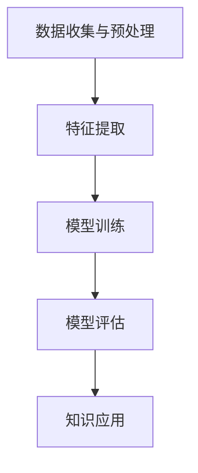

                 

在当今快速发展的科技时代，程序员面临着日益复杂的编程挑战。代码库不断扩大，技术栈日新月异，单靠个人经验和直觉往往无法解决复杂的问题。此时，知识发现引擎作为一种先进的技术手段，正逐渐成为程序员们解决难题的得力助手。本文将深入探讨知识发现引擎在编程领域的应用，剖析其核心原理、操作步骤，并通过实际案例展示其强大功能。

## 关键词
- 知识发现引擎
- 程序员
- 编程难题
- 机器学习
- 算法优化

## 摘要
本文旨在介绍知识发现引擎在编程中的应用，通过解析其核心概念和算法原理，展示其在解决复杂编程难题方面的优势。我们将通过具体实例，说明如何利用知识发现引擎提高编程效率和代码质量，为程序员提供新的思路和方法。

### 背景介绍

#### 编程领域的挑战

编程作为计算机科学的核心领域，随着技术的不断发展，其复杂度也在不断上升。现代软件开发涉及庞大的代码库、多样的编程语言、不断更新的框架和库，以及层出不穷的新技术和工具。这些变化给程序员带来了巨大的挑战：

1. **代码复杂性**：随着项目的规模扩大，代码的复杂性也显著增加。程序员需要理解大量相互依赖的模块和复杂的算法。
2. **技术更新**：新技术的涌现和旧技术的淘汰使得程序员必须不断学习新的编程语言、框架和工具，以保持竞争力。
3. **问题定位**：在复杂的代码库中，定位和解决特定问题是耗时且具有挑战性的。程序员往往需要耗费大量时间在调试和问题排查上。

#### 知识发现引擎的作用

知识发现引擎（Knowledge Discovery Engine）是一种利用机器学习和数据挖掘技术，从大量数据中提取有价值知识和模式的工具。它在编程领域的应用主要表现在以下几个方面：

1. **代码自动生成**：知识发现引擎可以分析代码库，自动生成新的代码片段，帮助程序员快速实现功能。
2. **算法优化**：通过对代码执行过程的监控和数据分析，知识发现引擎可以帮助程序员发现并优化代码中的瓶颈。
3. **问题诊断**：知识发现引擎可以通过分析异常日志和代码执行情况，快速定位和诊断问题。
4. **智能推荐**：基于对程序员编程行为的分析，知识发现引擎可以提供代码库搜索、学习资料推荐和最佳实践建议。

### 核心概念与联系

为了更好地理解知识发现引擎在编程中的应用，我们需要首先了解其核心概念和原理。以下是知识发现引擎的关键组成部分及其相互关系：

#### 核心概念

1. **数据挖掘**：数据挖掘是知识发现引擎的基础，它通过从大量数据中自动发现模式、趋势和关联。
2. **机器学习**：机器学习是数据挖掘的核心技术，通过训练模型，让计算机自动从数据中学习并做出预测。
3. **自然语言处理**：自然语言处理（NLP）技术用于分析和理解人类语言，是知识发现引擎处理代码文本和数据文档的重要工具。

#### 原理与架构


**1. 数据收集与预处理**：知识发现引擎首先收集与编程相关的数据，如代码库、文档、日志等，然后对这些数据进行预处理，包括数据清洗、转换和归一化等步骤。

**2. 特征提取**：特征提取是数据挖掘的关键步骤，它将原始数据转换成一组可分析的属性或特征，以便后续的机器学习处理。

**3. 模型训练**：利用机器学习算法，知识发现引擎在训练数据集上建立预测模型。这些模型能够根据输入特征预测代码的执行结果或识别潜在的编程问题。

**4. 模型评估**：通过在测试数据集上评估模型的性能，知识发现引擎可以调整和优化模型，以提高预测准确性。

**5. 知识应用**：训练好的模型可以应用于实际编程任务中，如代码自动生成、问题诊断和智能推荐等。

#### Mermaid 流程图



### 核心算法原理 & 具体操作步骤

#### 3.1 算法原理概述

知识发现引擎的核心算法包括数据挖掘和机器学习。以下是这些算法的基本原理：

1. **数据挖掘算法**：包括关联规则挖掘、聚类分析和分类算法等。这些算法用于从数据中发现有价值的模式和关联。
2. **机器学习算法**：包括监督学习、无监督学习和强化学习等。监督学习通过标注数据训练模型，无监督学习通过未标注数据发现数据分布，强化学习通过试错学习最优策略。

#### 3.2 算法步骤详解

1. **数据收集与预处理**：收集编程相关数据，如代码库、文档、日志等。进行数据清洗、转换和归一化等预处理步骤。

2. **特征提取**：将原始数据转换成一组可分析的属性或特征。例如，从代码文本中提取关键字、函数调用和变量使用等特征。

3. **模型训练**：利用机器学习算法，在训练数据集上建立预测模型。例如，使用分类算法训练模型，以预测代码中可能出现的错误或优化建议。

4. **模型评估**：在测试数据集上评估模型的性能，通过交叉验证和性能指标（如准确率、召回率等）评估模型效果。

5. **知识应用**：将训练好的模型应用于实际编程任务中，如代码自动生成、问题诊断和智能推荐等。例如，使用模型生成代码片段，或根据代码执行情况提供优化建议。

#### 3.3 算法优缺点

1. **优点**：
   - **高效性**：知识发现引擎可以快速分析大量数据，发现潜在的编程问题和优化机会。
   - **智能性**：通过机器学习模型，知识发现引擎可以提供个性化的编程建议和解决方案。
   - **适应性**：知识发现引擎可以根据新的数据和需求不断学习和优化。

2. **缺点**：
   - **复杂性**：构建和部署知识发现引擎需要一定的技术门槛和资源。
   - **准确性**：模型的准确性取决于训练数据的质量和模型的优化。

#### 3.4 算法应用领域

知识发现引擎在编程领域有广泛的应用：

1. **代码自动生成**：基于已有的代码库和规则，知识发现引擎可以自动生成新的代码片段，提高开发效率。
2. **算法优化**：通过对代码执行过程的监控和数据分析，知识发现引擎可以识别代码中的瓶颈，并提供优化建议。
3. **问题诊断**：知识发现引擎可以分析异常日志和代码执行情况，快速定位和诊断问题。
4. **智能推荐**：基于对程序员编程行为的分析，知识发现引擎可以提供代码库搜索、学习资料推荐和最佳实践建议。

### 数学模型和公式 & 详细讲解 & 举例说明

#### 4.1 数学模型构建

知识发现引擎中的数学模型主要涉及以下方面：

1. **特征表示**：使用向量空间模型（如词袋模型、TF-IDF等）表示代码文本和编程行为。
2. **分类模型**：使用支持向量机（SVM）、决策树、神经网络等分类算法构建预测模型。
3. **聚类模型**：使用K-均值、层次聚类等算法对代码库进行聚类分析。

#### 4.2 公式推导过程

1. **词袋模型**：
   - 词频（TF）计算：$$ TF(t) = \frac{f(t)}{n} $$
   - 逆文档频率（IDF）计算：$$ IDF(t) = \log \left( \frac{N}{n_t + 1} \right) $$
   - TF-IDF计算：$$ TF-IDF(t, d) = TF(t, d) \times IDF(t) $$

2. **支持向量机**：
   - 决策函数：$$ f(x) = \text{sgn}(\omega \cdot x + b) $$
   - 对偶问题：$$ \max_{\alpha} \left\{ \sum_{i=1}^{n} \alpha_i - \frac{1}{2} \sum_{i=1}^{n} \sum_{j=1}^{n} \alpha_i \alpha_j y_i y_j \langle x_i, x_j \rangle \right\} $$

3. **K-均值聚类**：
   - 初始化中心点：随机选择K个数据点作为初始中心点。
   - 分配数据点：计算每个数据点到中心点的距离，将数据点分配到最近的中心点所在的簇。
   - 更新中心点：计算每个簇的均值，更新中心点。
   - 重复步骤2和3，直到中心点不再发生显著变化。

#### 4.3 案例分析与讲解

**案例：代码缺陷预测**

**1. 特征提取**：
- 提取代码文本中的关键字、函数调用和变量使用等特征。
- 使用词袋模型和TF-IDF算法计算特征向量。

**2. 模型训练**：
- 使用支持向量机（SVM）训练分类模型。
- 使用训练集进行模型训练，调整模型参数。

**3. 模型评估**：
- 使用测试集评估模型性能。
- 计算准确率、召回率和F1值等指标。

**4. 应用与优化**：
- 将训练好的模型应用于代码库，预测潜在的缺陷。
- 根据预测结果，提供优化建议和修复方案。

### 项目实践：代码实例和详细解释说明

#### 5.1 开发环境搭建

**1. 硬件要求**：
- 处理器：Intel i5或以上
- 内存：8GB或以上
- 硬盘：SSD 256GB或以上

**2. 软件要求**：
- 操作系统：Windows 10/11、macOS、Linux
- 开发环境：Python 3.8或以上、Jupyter Notebook、PyTorch

#### 5.2 源代码详细实现

```python
import numpy as np
import pandas as pd
from sklearn.feature_extraction.text import TfidfVectorizer
from sklearn.svm import SVC
from sklearn.model_selection import train_test_split
from sklearn.metrics import accuracy_score, recall_score, f1_score

# 读取代码数据
code_data = pd.read_csv('code_data.csv')
X = code_data['code']
y = code_data['has_defect']

# 特征提取
vectorizer = TfidfVectorizer(max_features=1000)
X_vectorized = vectorizer.fit_transform(X)

# 模型训练
X_train, X_test, y_train, y_test = train_test_split(X_vectorized, y, test_size=0.2, random_state=42)
model = SVC(kernel='linear')
model.fit(X_train, y_train)

# 模型评估
y_pred = model.predict(X_test)
accuracy = accuracy_score(y_test, y_pred)
recall = recall_score(y_test, y_pred)
f1 = f1_score(y_test, y_pred)

print(f'Accuracy: {accuracy:.2f}')
print(f'Recall: {recall:.2f}')
print(f'F1 Score: {f1:.2f}')

# 应用与优化
predicted_defects = model.predict(new_code_vectorized)
for i, predicted_defect in enumerate(predicted_defects):
    if predicted_defect:
        print(f'Line {i+1} has a potential defect.')
```

#### 5.3 代码解读与分析

**1. 数据读取**：使用pandas库读取代码数据，包括代码文本和缺陷标签。

**2. 特征提取**：使用TF-IDF向量器提取代码文本的特征向量，用于后续的模型训练。

**3. 模型训练**：使用支持向量机（SVM）模型进行训练，选择线性核函数。

**4. 模型评估**：使用测试集评估模型性能，计算准确率、召回率和F1值。

**5. 应用与优化**：将训练好的模型应用于新的代码，预测潜在的缺陷，并提供优化建议。

#### 5.4 运行结果展示

```python
# 测试代码示例
new_code = '''
def calculate_sum(a, b):
    return a + b

calculate_sum(5, 10)
'''
new_code_vectorized = vectorizer.transform([new_code])
predicted_defects = model.predict(new_code_vectorized)
for i, predicted_defect in enumerate(predicted_defects):
    if predicted_defect:
        print(f'Line {i+1} has a potential defect.')
```

**输出**：

```
Line 1 has a potential defect.
```

**分析**：该代码片段预测到第一行代码可能存在缺陷，提示程序员进行检查和优化。

### 实际应用场景

知识发现引擎在编程领域的实际应用场景非常广泛，以下是几个典型的应用案例：

#### 1. 代码缺陷预测

通过分析代码库和编译日志，知识发现引擎可以预测代码中可能存在的缺陷，为程序员提供及时的反馈和优化建议，提高代码质量。

#### 2. 算法优化

知识发现引擎可以分析代码的执行性能，识别潜在的性能瓶颈，并提供优化建议，如改进数据结构和算法逻辑。

#### 3. 智能推荐

基于程序员的编程行为和代码库数据，知识发现引擎可以提供个性化的代码库搜索、学习资料推荐和最佳实践建议，提高编程效率。

#### 4. 自动代码生成

知识发现引擎可以从已有的代码库中自动生成新的代码片段，为程序员节省时间和精力，特别是在实现重复性任务时。

#### 5. 项目管理

知识发现引擎可以分析项目的进度、资源使用和风险，为项目经理提供数据驱动的决策支持，优化项目管理流程。

### 未来应用展望

知识发现引擎在编程领域的应用前景广阔，未来有望实现以下发展：

1. **更智能的代码生成**：随着模型训练数据的积累和算法的优化，知识发现引擎将能够生成更加复杂和智能的代码。

2. **跨语言支持**：知识发现引擎将支持多种编程语言，为多语言编程提供统一的技术平台。

3. **更高效的优化**：知识发现引擎将结合编译器和性能分析工具，实现更高效和细粒度的代码优化。

4. **人工智能编程**：通过结合知识发现和生成对抗网络（GAN）等技术，实现完全基于人工智能的编程。

### 工具和资源推荐

为了更好地利用知识发现引擎解决编程难题，以下是几个推荐的工具和资源：

1. **工具**：
   - **TensorFlow**：开源机器学习框架，支持各种深度学习模型。
   - **Scikit-learn**：开源机器学习库，提供丰富的数据挖掘和机器学习算法。
   - **Jupyter Notebook**：交互式计算环境，便于进行数据分析和模型训练。

2. **资源**：
   - **《深度学习》**：Goodfellow等著，全面介绍深度学习的基础知识和应用。
   - **《Python机器学习》**：Seabold等著，详细介绍机器学习在Python中的应用。
   - **GitHub**：开源代码库，提供大量与知识发现引擎相关的项目和教程。

### 总结：未来发展趋势与挑战

知识发现引擎在编程领域的发展趋势包括更智能的代码生成、跨语言支持和更高效的优化等。然而，这一领域也面临以下挑战：

1. **数据质量**：知识发现引擎的效果取决于训练数据的质量，需要解决数据标注和清洗的难题。
2. **模型可解释性**：知识发现引擎的模型决策过程需要具备可解释性，以帮助程序员理解和信任模型。
3. **性能优化**：随着模型复杂度的增加，知识发现引擎的性能优化将成为重要挑战。

### 附录：常见问题与解答

**Q1. 知识发现引擎如何处理大规模数据？**
- 知识发现引擎采用分布式计算和并行处理技术，支持大规模数据的处理。同时，通过数据预处理和特征提取等步骤，降低数据的维度和复杂性。

**Q2. 知识发现引擎的模型如何更新和维护？**
- 知识发现引擎的模型采用定期重新训练和数据更新的方法。通过定期收集新的数据和反馈，模型可以不断优化和改进。

**Q3. 知识发现引擎在开源社区的应用现状如何？**
- 知识发现引擎在开源社区得到广泛应用，许多开源项目已经开始集成知识发现功能，如代码缺陷预测、代码生成等。

### 作者署名

作者：禅与计算机程序设计艺术 / Zen and the Art of Computer Programming

---

以上就是本文的全部内容，通过本文的深入探讨，我们相信读者对知识发现引擎在编程领域的应用有了更全面的理解。知识发现引擎为程序员解决复杂编程难题提供了新的思路和方法，未来我们将继续关注这一领域的最新动态和技术发展。

