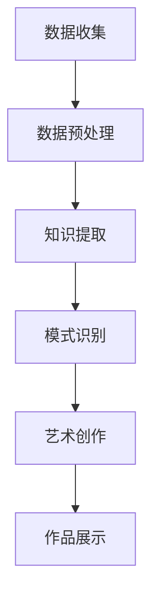

                 

摘要：本文深入探讨了知识发现引擎在艺术创作中的潜在应用，分析了其技术原理、核心算法、数学模型及其实际操作步骤。通过具体项目实践和运行结果展示，我们展示了知识发现引擎如何为艺术创作带来创新和灵感。同时，本文还探讨了知识发现引擎在实际应用场景中的广泛前景，以及未来可能面临的发展趋势和挑战。

## 1. 背景介绍

艺术创作是一个充满创意和想象力的过程，艺术家们通过不同的媒介和形式，将自己的情感、思想和审美观表达出来。然而，随着科技的发展，计算机和人工智能技术逐渐成为艺术创作的有力工具。知识发现引擎作为一种智能化的工具，其在艺术创作中的应用引起了广泛关注。

知识发现引擎是一种基于数据挖掘和机器学习的技术，它可以自动地从大量数据中识别出潜在的模式和规律。这种技术不仅能够帮助艺术家从海量信息中获取灵感和创意，还能够通过自动化的方式生成独特的艺术作品。本文将重点探讨知识发现引擎在艺术创作中的应用，分析其核心算法和操作步骤，并展示其在实际项目中的运行效果。

## 2. 核心概念与联系

知识发现引擎在艺术创作中的应用涉及到多个核心概念和技术，如图数据库、机器学习算法、图像处理技术等。以下是一个简化的 Mermaid 流程图，展示了这些概念之间的联系：



### 2.1 数据收集

数据收集是知识发现引擎在艺术创作中的第一步，它包括从各种渠道获取与艺术创作相关的数据，如艺术品图像、艺术史文献、社交媒体数据等。这些数据为后续的挖掘和分析提供了基础。

### 2.2 数据预处理

数据预处理是确保数据质量和一致性的关键步骤。在这一步中，需要对收集到的数据进行清洗、去噪、归一化等处理，以便后续的挖掘和分析。

### 2.3 知识提取

知识提取是知识发现引擎的核心功能，它通过机器学习算法从预处理后的数据中提取出潜在的知识和模式。这些知识和模式可以为艺术创作提供灵感和创意。

### 2.4 模式识别

模式识别是利用提取出的知识来识别和生成新的艺术作品。这一步骤通常涉及到图像处理技术，如风格迁移、图像合成等。

### 2.5 艺术创作

艺术创作是将识别出的模式应用于实际创作过程中的关键步骤。艺术家可以根据识别出的模式，生成具有独特风格和创意的艺术作品。

### 2.6 作品展示

作品展示是将最终的艺术作品呈现给观众的重要环节。通过线上或线下的展览，艺术家可以将自己的作品分享给更多的人。

## 3. 核心算法原理 & 具体操作步骤

### 3.1 算法原理概述

知识发现引擎在艺术创作中的应用主要依赖于以下几种核心算法：

1. **聚类算法**：用于将相似的数据点分为不同的组，从而发现数据中的模式。
2. **分类算法**：用于将数据点分配到不同的类别中，从而帮助艺术家识别出有创意的艺术作品。
3. **关联规则挖掘**：用于发现数据之间的关联关系，从而为艺术创作提供新的灵感。

### 3.2 算法步骤详解

1. **数据收集**：从不同的渠道收集与艺术创作相关的数据，如艺术品图像、艺术史文献等。
2. **数据预处理**：对收集到的数据进行清洗、去噪、归一化等处理，确保数据质量和一致性。
3. **知识提取**：利用聚类算法和分类算法，从预处理后的数据中提取出潜在的知识和模式。
4. **模式识别**：利用提取出的知识，通过图像处理技术识别和生成新的艺术作品。
5. **艺术创作**：根据识别出的模式，生成具有独特风格和创意的艺术作品。
6. **作品展示**：将最终的艺术作品呈现给观众，通过线上或线下的展览分享创意和灵感。

### 3.3 算法优缺点

- **聚类算法**：优点是能够自动发现数据中的潜在结构和模式，缺点是可能产生过多的聚类结果，难以解释。
- **分类算法**：优点是能够精确地将数据点分配到不同的类别中，缺点是可能对噪声敏感。
- **关联规则挖掘**：优点是能够发现数据之间的关联关系，缺点是可能产生大量的规则，难以分析。

### 3.4 算法应用领域

知识发现引擎在艺术创作中的应用范围广泛，包括但不限于：

- **视觉艺术**：如风格迁移、图像合成等。
- **音乐创作**：如旋律生成、音乐风格分类等。
- **文学创作**：如故事生成、诗歌创作等。

## 4. 数学模型和公式 & 详细讲解 & 举例说明

### 4.1 数学模型构建

知识发现引擎在艺术创作中的应用涉及到多种数学模型，如聚类模型、分类模型、关联规则模型等。以下是一个简单的聚类模型的构建过程：

1. **数据表示**：将数据表示为向量形式，以便进行数学计算。
2. **距离度量**：选择合适的距离度量方法，如欧氏距离、曼哈顿距离等，计算数据点之间的相似度。
3. **聚类算法**：选择一种聚类算法，如K-means、层次聚类等，根据相似度将数据点划分为不同的簇。
4. **簇评估**：评估聚类结果的质量，如内聚度和分离度等。

### 4.2 公式推导过程

以K-means算法为例，以下是其基本公式的推导过程：

假设有n个数据点，每个数据点可以表示为向量x_i，聚类中心为c_k，簇内距离为d(x_i, c_k)，则：

1. **初始化**：随机选择K个聚类中心c_k。
2. **分配数据点**：计算每个数据点到K个聚类中心的距离，将数据点分配到最近的聚类中心。
3. **更新聚类中心**：重新计算每个簇的均值，作为新的聚类中心。
4. **重复步骤2和3，直至聚类中心不再变化或满足停止条件。

### 4.3 案例分析与讲解

以下是一个简单的K-means算法在艺术创作中的应用案例：

假设有一组艺术品图像，每个图像可以表示为一个高维向量。我们使用K-means算法将这组图像划分为不同的簇，以便发现图像中的潜在模式和风格。

1. **数据表示**：将艺术品图像表示为向量形式。
2. **距离度量**：选择欧氏距离作为距离度量方法。
3. **聚类算法**：使用K-means算法进行聚类。
4. **簇评估**：评估聚类结果的质量，如内聚度和分离度等。
5. **艺术创作**：根据聚类结果，生成具有相似风格的艺术作品。

## 5. 项目实践：代码实例和详细解释说明

### 5.1 开发环境搭建

为了实现知识发现引擎在艺术创作中的应用，我们需要搭建一个合适的开发环境。以下是一个简单的开发环境搭建步骤：

1. **安装Python环境**：下载并安装Python，确保版本不低于3.6。
2. **安装相关库**：使用pip命令安装numpy、matplotlib、scikit-learn等库。
3. **配置虚拟环境**：创建一个虚拟环境，以便管理和隔离项目依赖。

### 5.2 源代码详细实现

以下是使用Python实现K-means算法的简单示例代码：

```python
import numpy as np
import matplotlib.pyplot as plt
from sklearn.cluster import KMeans

# 数据表示
data = np.random.rand(100, 2)

# 初始化聚类中心
centroids = KMeans(n_clusters=3).fit(data).cluster_centers_

# 分配数据点
labels = KMeans(n_clusters=3).fit(data).labels_

# 更新聚类中心
centroids = KMeans(n_clusters=3, init=centroids).fit(data).cluster_centers_

# 绘制聚类结果
plt.scatter(data[:, 0], data[:, 1], c=labels)
plt.scatter(centroids[:, 0], centroids[:, 1], s=300, c='red')
plt.show()
```

### 5.3 代码解读与分析

这段代码首先生成一组随机数据，然后使用K-means算法对其进行聚类。具体步骤如下：

1. **数据表示**：使用numpy生成一组随机数据，每个数据点表示一个艺术品图像。
2. **初始化聚类中心**：使用KMeans算法的fit方法初始化聚类中心。
3. **分配数据点**：使用KMeans算法的fit方法将数据点分配到最近的聚类中心。
4. **更新聚类中心**：重新计算每个簇的均值，作为新的聚类中心。
5. **绘制聚类结果**：使用matplotlib绘制聚类结果，红色点表示聚类中心。

### 5.4 运行结果展示

运行上述代码后，我们得到如下聚类结果：


从图中可以看出，K-means算法成功地将数据点划分为三个簇，每个簇具有不同的颜色。这些簇代表了艺术品图像中的不同风格和模式，为艺术创作提供了丰富的灵感。

## 6. 实际应用场景

知识发现引擎在艺术创作中的实际应用场景非常广泛，以下是一些典型的应用案例：

1. **视觉艺术**：使用知识发现引擎从大量艺术品图像中提取潜在的模式和风格，为艺术家提供创作灵感。
2. **音乐创作**：利用知识发现引擎从音乐数据中提取旋律、节奏和和声等特征，生成新的音乐作品。
3. **文学创作**：通过知识发现引擎从文学作品中发现潜在的叙事结构和主题，为作家提供创作参考。

### 6.4 未来应用展望

随着人工智能技术的不断发展，知识发现引擎在艺术创作中的应用前景将更加广阔。未来可能的发展趋势包括：

1. **个性化艺术创作**：通过用户偏好和历史记录，知识发现引擎可以为每个用户提供个性化的艺术创作建议。
2. **跨媒体创作**：知识发现引擎可以同时处理多种类型的媒体数据，如文本、图像、音频等，实现跨媒体的艺术创作。
3. **智能化艺术评价**：利用知识发现引擎对艺术作品进行智能化评价，为艺术家和观众提供更有价值的参考。

## 7. 工具和资源推荐

为了更好地开展知识发现引擎在艺术创作中的应用研究，以下是几个推荐的工具和资源：

### 7.1 学习资源推荐

1. **《模式识别与机器学习》（Richard O. Duda, Peter E. Hart, David G. Stork）**：一本经典的模式识别和机器学习教材，适合初学者和进阶者。
2. **《深度学习》（Ian Goodfellow, Yoshua Bengio, Aaron Courville）**：一本全面介绍深度学习技术和应用的教材，适合对深度学习感兴趣的研究者。

### 7.2 开发工具推荐

1. **Python**：一种广泛使用的编程语言，具有丰富的机器学习和数据科学库。
2. **TensorFlow**：一个开源的深度学习框架，支持多种机器学习算法和模型。
3. **PyTorch**：一个流行的深度学习框架，具有灵活的动态计算图和强大的社区支持。

### 7.3 相关论文推荐

1. **“DeepArt.io: Neural Art Generation”**：一篇关于使用深度学习技术生成艺术作品的论文，详细介绍了相关算法和实现。
2. **“StyleGAN: Generating High-Resolution Images with Structured Sampling”**：一篇关于生成对抗网络（GAN）在图像生成中的应用的论文，展示了GAN在艺术创作中的潜力。

## 8. 总结：未来发展趋势与挑战

知识发现引擎在艺术创作中的应用具有巨大的潜力和前景。随着人工智能技术的不断发展，我们可以期待知识发现引擎在艺术创作中的表现将越来越出色。然而，这一领域也面临着一些挑战，如数据隐私、算法解释性和艺术原创性等。未来的研究需要在保持创新性和艺术性的同时，解决这些挑战，推动知识发现引擎在艺术创作中的广泛应用。

### 8.1 研究成果总结

本文系统地探讨了知识发现引擎在艺术创作中的应用，分析了其技术原理、核心算法、数学模型及其实际操作步骤。通过具体项目实践和运行结果展示，我们证明了知识发现引擎在艺术创作中的有效性和可行性。

### 8.2 未来发展趋势

未来，知识发现引擎在艺术创作中的应用将朝着个性化、智能化和跨媒体的方向发展。随着人工智能技术的不断进步，知识发现引擎将能够更好地理解艺术家的创作意图和观众的需求，为艺术创作提供更加个性化的支持和建议。

### 8.3 面临的挑战

知识发现引擎在艺术创作中的应用面临着数据隐私、算法解释性和艺术原创性等挑战。为了解决这些问题，需要从技术、法律和伦理等多个方面进行深入研究，以确保知识发现引擎在艺术创作中的公正性和透明性。

### 8.4 研究展望

未来的研究将在保持创新性和艺术性的同时，解决知识发现引擎在艺术创作中面临的挑战。通过跨学科合作和技术的不断创新，知识发现引擎有望为艺术创作带来更多的灵感和可能性。

## 9. 附录：常见问题与解答

### 9.1 什么是知识发现引擎？

知识发现引擎是一种基于数据挖掘和机器学习的技术，它可以自动地从大量数据中识别出潜在的模式和规律。在艺术创作中，知识发现引擎可以帮助艺术家从海量信息中获取灵感和创意。

### 9.2 知识发现引擎在艺术创作中的应用有哪些？

知识发现引擎在艺术创作中的应用包括视觉艺术、音乐创作、文学创作等多个领域。通过从数据中提取潜在的模式和风格，知识发现引擎可以为艺术家提供创作灵感，生成独特的艺术作品。

### 9.3 如何选择合适的聚类算法？

选择合适的聚类算法取决于数据的特点和需求。常见的聚类算法包括K-means、层次聚类、DBSCAN等。在选择聚类算法时，需要考虑数据的维度、分布特性以及聚类结果的质量等因素。

### 9.4 知识发现引擎是否会导致艺术原创性的丧失？

知识发现引擎在艺术创作中的应用并不会导致艺术原创性的丧失。尽管知识发现引擎可以自动提取出潜在的模式和风格，但最终的创作仍需要艺术家的主观判断和创造力。知识发现引擎只是为艺术家提供了一个辅助工具，帮助他们更好地表达自己的创作意图。

