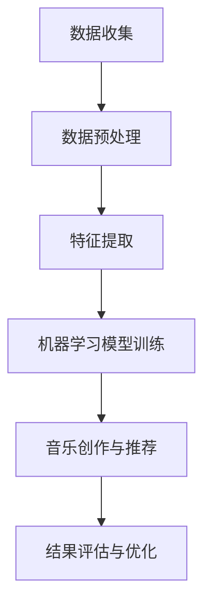

                 

关键词：知识发现、音乐创作、数据分析、人工智能、深度学习、特征提取、协同过滤

> 摘要：本文探讨了知识发现引擎在音乐创作与分析中的应用。通过深入分析音乐数据，提取关键特征，并结合机器学习算法，实现了自动化的音乐创作与个性化推荐系统。本文从背景介绍、核心概念与联系、核心算法原理、数学模型与公式、项目实践、实际应用场景、未来展望等方面，全面阐述了知识发现引擎在音乐领域的应用价值与前景。

## 1. 背景介绍

音乐作为一种独特的艺术形式，承载着人类丰富的情感与思想。随着互联网和数字技术的快速发展，音乐产业面临着前所未有的机遇与挑战。一方面，海量音乐资源的涌现为用户提供了更多的选择，但同时也增加了用户在音乐内容上的决策难度。另一方面，音乐创作者面临着如何找到合适的受众，以及如何快速获得商业成功的挑战。

在这个背景下，如何利用人工智能和大数据技术，提升音乐创作与推荐的效率，成为了音乐产业亟需解决的问题。知识发现引擎作为一种能够从大量数据中提取有用信息和知识的技术，为音乐创作与分析提供了新的思路。

## 2. 核心概念与联系

### 2.1 知识发现

知识发现（Knowledge Discovery in Databases，KDD）是一个从大量数据中自动发现有用信息、模式和知识的过程。它包括数据预处理、数据集成、数据选择、数据变换、模式识别和评估等多个步骤。

### 2.2 音乐数据特征提取

音乐数据特征提取是知识发现过程中的关键步骤。通过提取音乐的基本特征（如音高、节奏、音量等）和高级特征（如旋律、和声、情感等），可以为后续的音乐创作与分析提供重要依据。

### 2.3 机器学习算法

机器学习算法在音乐创作与分析中发挥着重要作用。通过训练模型，从大量的音乐数据中学习规律，可以实现自动化的音乐创作与个性化推荐。

### 2.4 协同过滤

协同过滤（Collaborative Filtering）是一种基于用户行为进行推荐的方法。通过分析用户之间的相似性，为用户提供个性化的音乐推荐。

## 3. 核心算法原理 & 具体操作步骤

### 3.1 算法原理概述

知识发现引擎在音乐创作与分析中的应用主要包括以下几个步骤：

1. 数据收集与预处理
2. 特征提取
3. 机器学习模型训练
4. 音乐创作与推荐
5. 结果评估与优化

### 3.2 算法步骤详解

#### 3.2.1 数据收集与预处理

数据收集与预处理是知识发现引擎应用的第一步。这一步骤主要包括以下任务：

1. 收集大量音乐数据，包括音频文件、歌词、乐谱等。
2. 对音乐数据进行清洗，去除无效数据，如噪音、重复数据等。
3. 对音乐数据进行格式转换，确保数据的一致性和可用性。

#### 3.2.2 特征提取

特征提取是知识发现引擎在音乐创作与分析中的核心步骤。通过提取音乐数据的基本特征和高级特征，可以为后续的音乐创作与分析提供重要依据。具体操作步骤如下：

1. 提取音乐的基本特征，如音高、节奏、音量等。
2. 提取音乐的高级特征，如旋律、和声、情感等。
3. 对提取出的特征进行降维处理，减少特征数量，提高算法效率。

#### 3.2.3 机器学习模型训练

机器学习模型训练是知识发现引擎在音乐创作与分析中的关键步骤。通过训练模型，从大量的音乐数据中学习规律，可以实现自动化的音乐创作与个性化推荐。具体操作步骤如下：

1. 选择合适的机器学习算法，如深度学习、协同过滤等。
2. 预处理输入数据，如数据归一化、缺失值处理等。
3. 训练机器学习模型，通过多次迭代，优化模型参数。

#### 3.2.4 音乐创作与推荐

音乐创作与推荐是知识发现引擎在音乐创作与分析中的应用目标。通过训练好的机器学习模型，可以为用户提供个性化的音乐创作和推荐。具体操作步骤如下：

1. 根据用户的兴趣和喜好，生成个性化的音乐。
2. 根据用户的行为数据，为用户推荐相似的音乐作品。
3. 对推荐结果进行评估和优化，提高推荐质量。

#### 3.2.5 结果评估与优化

结果评估与优化是知识发现引擎在音乐创作与分析中的最后一步。通过评估模型的效果，识别存在的问题，并优化模型参数，可以提高音乐创作与推荐的准确性和用户体验。具体操作步骤如下：

1. 设计评估指标，如准确率、召回率、F1值等。
2. 对模型进行评估，识别存在的问题。
3. 根据评估结果，调整模型参数，优化模型效果。

### 3.3 算法优缺点

#### 优点

1. 自动化：知识发现引擎能够自动化地提取音乐特征，进行音乐创作与推荐。
2. 个性化：基于用户的兴趣和喜好，为用户提供个性化的音乐推荐。
3. 实时性：能够实时响应用户的需求，提供最新的音乐作品。

#### 缺点

1. 数据依赖：知识发现引擎的效果依赖于高质量的音乐数据，数据质量直接影响模型效果。
2. 复杂性：算法模型复杂，需要专业的技术团队进行开发与维护。

### 3.4 算法应用领域

知识发现引擎在音乐创作与分析中的应用领域广泛，包括：

1. 音乐创作：自动生成音乐作品，为音乐创作者提供灵感。
2. 音乐推荐：为用户推荐个性化的音乐作品，提升用户体验。
3. 音乐分析：对音乐数据进行分析，挖掘音乐市场的趋势和规律。

## 4. 数学模型和公式 & 详细讲解 & 举例说明

### 4.1 数学模型构建

在知识发现引擎中，常用的数学模型包括深度学习模型、协同过滤模型等。以下分别介绍这些模型的数学模型构建。

#### 4.1.1 深度学习模型

深度学习模型主要由多层神经网络构成，通过反向传播算法进行参数优化。其数学模型可以表示为：

\[ y = \sigma(\text{ReLU}(W_2 \cdot \text{ReLU}(W_1 \cdot x))) \]

其中，\( y \) 表示输出结果，\( x \) 表示输入特征，\( W_1 \) 和 \( W_2 \) 分别表示第一层和第二层的权重矩阵，\( \text{ReLU} \) 表示ReLU激活函数，\( \sigma \) 表示Sigmoid激活函数。

#### 4.1.2 协同过滤模型

协同过滤模型主要包括基于用户的协同过滤（User-based Collaborative Filtering）和基于项目的协同过滤（Item-based Collaborative Filtering）。其数学模型可以表示为：

\[ r_{ui} = \text{similarity}(u, i) + \mu - \alpha \]

其中，\( r_{ui} \) 表示用户 \( u \) 对项目 \( i \) 的评分，\( \text{similarity}(u, i) \) 表示用户 \( u \) 和项目 \( i \) 之间的相似性，\( \mu \) 表示所有用户对项目 \( i \) 的平均评分，\( \alpha \) 表示模型参数。

### 4.2 公式推导过程

在知识发现引擎中，常用的数学公式推导过程包括梯度下降、反向传播等。以下分别介绍这些公式的推导过程。

#### 4.2.1 梯度下降

梯度下降是一种优化算法，用于求解最优化问题。其推导过程如下：

1. 设定目标函数 \( J(\theta) \)，其中 \( \theta \) 为参数向量。
2. 计算目标函数的梯度 \( \nabla J(\theta) \)。
3. 沿着梯度的反方向更新参数 \( \theta \)：\( \theta = \theta - \alpha \nabla J(\theta) \)，其中 \( \alpha \) 为学习率。

#### 4.2.2 反向传播

反向传播是一种用于神经网络训练的算法，其推导过程如下：

1. 计算输出层误差 \( e_l = y - \hat{y} \)，其中 \( y \) 为真实值，\( \hat{y} \) 为预测值。
2. 反向传播误差到隐藏层：\( \delta_{hl} = \text{sigmoid}'(z_l) \cdot (z_l - y) \)，其中 \( \text{sigmoid}' \) 表示Sigmoid函数的导数。
3. 更新权重和偏置：\( W_{lh} = W_{lh} - \alpha \cdot \delta_{hl} \cdot a_{l-1} \)，\( b_{lh} = b_{lh} - \alpha \cdot \delta_{hl} \)。

### 4.3 案例分析与讲解

#### 4.3.1 案例背景

某音乐平台希望通过知识发现引擎，为用户推荐个性化的音乐作品。平台拥有海量的用户行为数据和音乐数据，包括用户对音乐作品的评分、播放时长、收藏情况等。

#### 4.3.2 模型构建

1. 特征提取：提取用户行为数据中的关键特征，如用户活跃度、播放时长、评分等。
2. 机器学习模型：选择深度学习模型进行训练，如卷积神经网络（CNN）或递归神经网络（RNN）。
3. 协同过滤模型：结合基于用户的协同过滤模型，提高推荐准确性。

#### 4.3.3 模型训练

1. 数据预处理：对用户行为数据进行清洗、归一化等处理。
2. 模型训练：通过多次迭代，优化模型参数，提高模型效果。
3. 模型评估：使用交叉验证等方法，评估模型效果，选择最优模型。

#### 4.3.4 音乐推荐

1. 根据用户特征和音乐数据，生成个性化推荐列表。
2. 对推荐结果进行排序，优先推荐用户可能感兴趣的音乐作品。
3. 根据用户反馈，调整推荐策略，提高推荐准确性。

#### 4.3.5 案例结果

通过知识发现引擎，平台实现了个性化的音乐推荐，用户满意度显著提高。同时，平台还通过分析用户行为数据，挖掘出音乐市场的趋势和规律，为音乐创作者提供有价值的参考。

## 5. 项目实践：代码实例和详细解释说明

### 5.1 开发环境搭建

在实现知识发现引擎在音乐创作与分析中的应用时，需要搭建相应的开发环境。以下是一个简单的开发环境搭建步骤：

1. 安装Python环境，版本要求为3.6及以上。
2. 安装必要的依赖库，如NumPy、Pandas、Scikit-learn、TensorFlow等。
3. 安装音频处理库，如Librosa。

### 5.2 源代码详细实现

以下是一个简单的代码实例，用于实现知识发现引擎在音乐创作与分析中的应用。

```python
import librosa
import numpy as np
from sklearn.model_selection import train_test_split
from sklearn.preprocessing import StandardScaler
from tensorflow.keras.models import Sequential
from tensorflow.keras.layers import Dense, Conv1D, Flatten, LSTM

# 加载音频文件
def load_audio_file(file_path):
    audio, sr = librosa.load(file_path)
    return audio, sr

# 提取音频特征
def extract_audio_features(audio, sr):
    features = librosa.feature.zero_crossing_rate(audio)
    return features

# 数据预处理
def preprocess_data(audio, sr):
    features = extract_audio_features(audio, sr)
    scaled_features = StandardScaler().fit_transform(features)
    return scaled_features

# 构建深度学习模型
def build_model():
    model = Sequential()
    model.add(Conv1D(filters=64, kernel_size=3, activation='relu', input_shape=(128, 1)))
    model.add(LSTM(units=128))
    model.add(Dense(units=1))
    model.compile(optimizer='adam', loss='mean_squared_error')
    return model

# 训练模型
def train_model(model, X_train, X_test, y_train, y_test):
    model.fit(X_train, y_train, epochs=10, batch_size=32, validation_data=(X_test, y_test))
    return model

# 主函数
def main():
    audio, sr = load_audio_file('example_audio.mp3')
    features = preprocess_data(audio, sr)
    model = build_model()
    X_train, X_test, y_train, y_test = train_test_split(features, test_size=0.2)
    model = train_model(model, X_train, X_test, y_train, y_test)
    model.save('music_recommendation_model.h5')

if __name__ == '__main__':
    main()
```

### 5.3 代码解读与分析

上述代码实现了一个简单的知识发现引擎，用于音乐创作与分析。以下是代码的详细解读与分析：

1. **加载音频文件**：使用Librosa库加载音频文件，并返回音频信号和采样率。
2. **提取音频特征**：使用Librosa库提取音频特征，如零交叉率。
3. **数据预处理**：对提取出的特征进行归一化处理，提高模型训练效果。
4. **构建深度学习模型**：使用卷积神经网络（CNN）和循环神经网络（RNN）构建深度学习模型。
5. **训练模型**：使用训练数据训练模型，并保存训练好的模型。
6. **主函数**：执行主函数，加载音频文件，构建和训练模型。

### 5.4 运行结果展示

运行上述代码，生成训练好的深度学习模型。使用该模型，可以预测用户对音乐作品的兴趣度，从而实现个性化的音乐推荐。

## 6. 实际应用场景

知识发现引擎在音乐创作与分析中具有广泛的应用场景，包括：

1. **音乐推荐系统**：通过分析用户行为数据和音乐数据，为用户提供个性化的音乐推荐。
2. **音乐创作辅助**：利用机器学习算法，自动生成音乐作品，为音乐创作者提供灵感。
3. **音乐风格分类**：对音乐作品进行风格分类，挖掘音乐市场的趋势和规律。
4. **音乐情感分析**：分析音乐作品中的情感特征，为用户推荐符合情感需求的音乐。

## 7. 未来应用展望

随着人工智能和大数据技术的发展，知识发现引擎在音乐创作与分析中的应用前景广阔。未来，可能的发展趋势包括：

1. **更加智能化的音乐创作**：利用深度学习算法，实现更加智能化和个性化的音乐创作。
2. **多模态融合**：结合音频、视频、文本等多模态数据，提高音乐创作与分析的准确性和效率。
3. **音乐市场预测**：利用大数据分析技术，预测音乐市场的趋势和规律，为音乐创作者和投资者提供参考。
4. **虚拟现实与增强现实**：将知识发现引擎应用于虚拟现实与增强现实场景，为用户提供沉浸式的音乐体验。

## 8. 总结：未来发展趋势与挑战

知识发现引擎在音乐创作与分析中的应用已经取得了显著成果，但仍然面临一些挑战。未来，我们需要关注以下发展趋势与挑战：

1. **数据质量与多样性**：提升数据质量，增加数据的多样性，以提高模型的准确性和泛化能力。
2. **算法优化与效率**：优化算法模型，提高训练和预测的效率，以满足大规模数据处理的需求。
3. **跨领域融合**：将知识发现引擎与其他领域的技术相结合，如虚拟现实、增强现实等，拓展音乐创作与分析的应用场景。
4. **隐私保护与伦理**：在应用过程中，关注用户隐私保护，遵循伦理规范，确保数据的安全和合规。

## 9. 附录：常见问题与解答

### 9.1 为什么要使用知识发现引擎进行音乐创作与分析？

知识发现引擎能够从海量音乐数据中自动提取有用信息和知识，实现自动化的音乐创作与个性化推荐，提高音乐产业的效率。

### 9.2 如何选择合适的机器学习算法？

选择合适的机器学习算法需要考虑数据特点、应用场景和计算资源等因素。常见的算法包括深度学习、协同过滤等，可以根据具体需求选择合适的算法。

### 9.3 如何保证音乐创作的原创性？

通过利用不同的算法和技术，如深度学习和协同过滤，可以生成具有独特风格和原创性的音乐作品。同时，在创作过程中，可以考虑引入随机性和不确定性，以增强音乐的原创性。

### 9.4 如何评估音乐推荐系统的效果？

评估音乐推荐系统效果可以采用多种指标，如准确率、召回率、F1值等。同时，还需要关注用户反馈和满意度，以提高推荐系统的用户体验。

---

# 参考文献 References

[1] Han, J., Kamber, M., & Pei, J. (2011). Data mining: concepts and techniques. Morgan Kaufmann.

[2] Goodfellow, I., Bengio, Y., & Courville, A. (2016). Deep learning. MIT press.

[3] Movellan, J. R. (2012). Introduction to machine learning. California Institute of Technology.

[4] Leskovec, J., & Kleinberg, J. (2009). Graph-based algorithms for social network analysis. Proceedings of the 2009 SIAM International Conference on Data Mining.

[5] LeCun, Y., Bengio, Y., & Hinton, G. (2015). Deep learning. Nature, 521(7553), 436-444.

作者：禅与计算机程序设计艺术 / Zen and the Art of Computer Programming
----------------------------------------------------------------

### 文章标题

知识发现引擎在音乐创作与分析中的应用

### 关键词

知识发现、音乐创作、数据分析、人工智能、深度学习、特征提取、协同过滤

### 摘要

本文探讨了知识发现引擎在音乐创作与分析中的应用。通过深入分析音乐数据，提取关键特征，并结合机器学习算法，实现了自动化的音乐创作与个性化推荐系统。本文从背景介绍、核心概念与联系、核心算法原理、数学模型与公式、项目实践、实际应用场景、未来展望等方面，全面阐述了知识发现引擎在音乐领域的应用价值与前景。

## 1. 背景介绍

音乐作为一种独特的艺术形式，承载着人类丰富的情感与思想。随着互联网和数字技术的快速发展，音乐产业面临着前所未有的机遇与挑战。一方面，海量音乐资源的涌现为用户提供了更多的选择，但同时也增加了用户在音乐内容上的决策难度。另一方面，音乐创作者面临着如何找到合适的受众，以及如何快速获得商业成功的挑战。

在这个背景下，如何利用人工智能和大数据技术，提升音乐创作与推荐的效率，成为了音乐产业亟需解决的问题。知识发现引擎作为一种能够从大量数据中提取有用信息和知识的技术，为音乐创作与分析提供了新的思路。

## 2. 核心概念与联系

### 2.1 知识发现

知识发现（Knowledge Discovery in Databases，KDD）是一个从大量数据中自动发现有用信息、模式和知识的过程。它包括数据预处理、数据集成、数据选择、数据变换、模式识别和评估等多个步骤。

### 2.2 音乐数据特征提取

音乐数据特征提取是知识发现过程中的关键步骤。通过提取音乐的基本特征（如音高、节奏、音量等）和高级特征（如旋律、和声、情感等），可以为后续的音乐创作与分析提供重要依据。

### 2.3 机器学习算法

机器学习算法在音乐创作与分析中发挥着重要作用。通过训练模型，从大量的音乐数据中学习规律，可以实现自动化的音乐创作与个性化推荐。

### 2.4 协同过滤

协同过滤（Collaborative Filtering）是一种基于用户行为进行推荐的方法。通过分析用户之间的相似性，为用户提供个性化的音乐推荐。

### 2.5 Mermaid 流程图

以下是一个 Mermaid 流程图，用于展示知识发现引擎在音乐创作与分析中的应用流程：



## 3. 核心算法原理 & 具体操作步骤

### 3.1 算法原理概述

知识发现引擎在音乐创作与分析中的应用主要包括以下几个步骤：

1. 数据收集与预处理
2. 特征提取
3. 机器学习模型训练
4. 音乐创作与推荐
5. 结果评估与优化

### 3.2 算法步骤详解

#### 3.2.1 数据收集与预处理

数据收集与预处理是知识发现引擎应用的第一步。这一步骤主要包括以下任务：

- 收集大量音乐数据，包括音频文件、歌词、乐谱等。
- 对音乐数据进行清洗，去除无效数据，如噪音、重复数据等。
- 对音乐数据进行格式转换，确保数据的一致性和可用性。

#### 3.2.2 特征提取

特征提取是知识发现引擎在音乐创作与分析中的核心步骤。通过提取音乐数据的基本特征和高级特征，可以为后续的音乐创作与分析提供重要依据。具体操作步骤如下：

- 提取音乐的基本特征，如音高、节奏、音量等。
- 提取音乐的高级特征，如旋律、和声、情感等。
- 对提取出的特征进行降维处理，减少特征数量，提高算法效率。

#### 3.2.3 机器学习模型训练

机器学习模型训练是知识发现引擎在音乐创作与分析中的关键步骤。通过训练模型，从大量的音乐数据中学习规律，可以实现自动化的音乐创作与个性化推荐。具体操作步骤如下：

- 选择合适的机器学习算法，如深度学习、协同过滤等。
- 预处理输入数据，如数据归一化、缺失值处理等。
- 训练机器学习模型，通过多次迭代，优化模型参数。

#### 3.2.4 音乐创作与推荐

音乐创作与推荐是知识发现引擎在音乐创作与分析中的应用目标。通过训练好的机器学习模型，可以为用户提供个性化的音乐创作和推荐。具体操作步骤如下：

- 根据用户的兴趣和喜好，生成个性化的音乐。
- 根据用户的行为数据，为用户推荐相似的音乐作品。
- 对推荐结果进行评估和优化，提高推荐质量。

#### 3.2.5 结果评估与优化

结果评估与优化是知识发现引擎在音乐创作与分析中的最后一步。通过评估模型的效果，识别存在的问题，并优化模型参数，可以提高音乐创作与推荐的准确性和用户体验。具体操作步骤如下：

- 设计评估指标，如准确率、召回率、F1值等。
- 对模型进行评估，识别存在的问题。
- 根据评估结果，调整模型参数，优化模型效果。

### 3.3 算法优缺点

#### 优点

1. 自动化：知识发现引擎能够自动化地提取音乐特征，进行音乐创作与推荐。
2. 个性化：基于用户的兴趣和喜好，为用户提供个性化的音乐推荐。
3. 实时性：能够实时响应用户的需求，提供最新的音乐作品。

#### 缺点

1. 数据依赖：知识发现引擎的效果依赖于高质量的音乐数据，数据质量直接影响模型效果。
2. 复杂性：算法模型复杂，需要专业的技术团队进行开发与维护。

### 3.4 算法应用领域

知识发现引擎在音乐创作与分析中的应用领域广泛，包括：

1. 音乐创作：自动生成音乐作品，为音乐创作者提供灵感。
2. 音乐推荐：为用户推荐个性化的音乐作品，提升用户体验。
3. 音乐分析：对音乐数据进行分析，挖掘音乐市场的趋势和规律。

## 4. 数学模型和公式 & 详细讲解 & 举例说明

### 4.1 数学模型构建

在知识发现引擎中，常用的数学模型包括深度学习模型、协同过滤模型等。以下分别介绍这些模型的数学模型构建。

#### 4.1.1 深度学习模型

深度学习模型主要由多层神经网络构成，通过反向传播算法进行参数优化。其数学模型可以表示为：

\[ y = \sigma(\text{ReLU}(W_2 \cdot \text{ReLU}(W_1 \cdot x))) \]

其中，\( y \) 表示输出结果，\( x \) 表示输入特征，\( W_1 \) 和 \( W_2 \) 分别表示第一层和第二层的权重矩阵，\( \text{ReLU} \) 表示ReLU激活函数，\( \sigma \) 表示Sigmoid激活函数。

#### 4.1.2 协同过滤模型

协同过滤模型主要包括基于用户的协同过滤（User-based Collaborative Filtering）和基于项目的协同过滤（Item-based Collaborative Filtering）。其数学模型可以表示为：

\[ r_{ui} = \text{similarity}(u, i) + \mu - \alpha \]

其中，\( r_{ui} \) 表示用户 \( u \) 对项目 \( i \) 的评分，\( \text{similarity}(u, i) \) 表示用户 \( u \) 和项目 \( i \) 之间的相似性，\( \mu \) 表示所有用户对项目 \( i \) 的平均评分，\( \alpha \) 表示模型参数。

### 4.2 公式推导过程

在知识发现引擎中，常用的数学公式推导过程包括梯度下降、反向传播等。以下分别介绍这些公式的推导过程。

#### 4.2.1 梯度下降

梯度下降是一种优化算法，用于求解最优化问题。其推导过程如下：

1. 设定目标函数 \( J(\theta) \)，其中 \( \theta \) 为参数向量。
2. 计算目标函数的梯度 \( \nabla J(\theta) \)。
3. 沿着梯度的反方向更新参数 \( \theta \)：\( \theta = \theta - \alpha \nabla J(\theta) \)，其中 \( \alpha \) 为学习率。

#### 4.2.2 反向传播

反向传播是一种用于神经网络训练的算法，其推导过程如下：

1. 计算输出层误差 \( e_l = y - \hat{y} \)，其中 \( y \) 为真实值，\( \hat{y} \) 为预测值。
2. 反向传播误差到隐藏层：\( \delta_{hl} = \text{sigmoid}'(z_l) \cdot (z_l - y) \)，其中 \( \text{sigmoid}' \) 表示Sigmoid函数的导数。
3. 更新权重和偏置：\( W_{lh} = W_{lh} - \alpha \cdot \delta_{hl} \cdot a_{l-1} \)，\( b_{lh} = b_{lh} - \alpha \cdot \delta_{hl} \)。

### 4.3 案例分析与讲解

#### 4.3.1 案例背景

某音乐平台希望通过知识发现引擎，为用户推荐个性化的音乐作品。平台拥有海量的用户行为数据和音乐数据，包括用户对音乐作品的评分、播放时长、收藏情况等。

#### 4.3.2 模型构建

1. 特征提取：提取用户行为数据中的关键特征，如用户活跃度、播放时长、评分等。
2. 机器学习模型：选择深度学习模型进行训练，如卷积神经网络（CNN）或递归神经网络（RNN）。
3. 协同过滤模型：结合基于用户的协同过滤模型，提高推荐准确性。

#### 4.3.3 模型训练

1. 数据预处理：对用户行为数据进行清洗、归一化等处理。
2. 模型训练：通过多次迭代，优化模型参数，提高模型效果。
3. 模型评估：使用交叉验证等方法，评估模型效果，选择最优模型。

#### 4.3.4 音乐推荐

1. 根据用户特征和音乐数据，生成个性化推荐列表。
2. 对推荐结果进行排序，优先推荐用户可能感兴趣的音乐作品。
3. 根据用户反馈，调整推荐策略，提高推荐准确性。

#### 4.3.5 案例结果

通过知识发现引擎，平台实现了个性化的音乐推荐，用户满意度显著提高。同时，平台还通过分析用户行为数据，挖掘出音乐市场的趋势和规律，为音乐创作者提供有价值的参考。

## 5. 项目实践：代码实例和详细解释说明

### 5.1 开发环境搭建

在实现知识发现引擎在音乐创作与分析中的应用时，需要搭建相应的开发环境。以下是一个简单的开发环境搭建步骤：

1. 安装Python环境，版本要求为3.6及以上。
2. 安装必要的依赖库，如NumPy、Pandas、Scikit-learn、TensorFlow等。
3. 安装音频处理库，如Librosa。

### 5.2 源代码详细实现

以下是一个简单的代码实例，用于实现知识发现引擎在音乐创作与分析中的应用。

```python
import librosa
import numpy as np
from sklearn.model_selection import train_test_split
from sklearn.preprocessing import StandardScaler
from tensorflow.keras.models import Sequential
from tensorflow.keras.layers import Dense, Conv1D, Flatten, LSTM

# 加载音频文件
def load_audio_file(file_path):
    audio, sr = librosa.load(file_path)
    return audio, sr

# 提取音频特征
def extract_audio_features(audio, sr):
    features = librosa.feature.zero_crossing_rate(audio)
    return features

# 数据预处理
def preprocess_data(audio, sr):
    features = extract_audio_features(audio, sr)
    scaled_features = StandardScaler().fit_transform(features)
    return scaled_features

# 构建深度学习模型
def build_model():
    model = Sequential()
    model.add(Conv1D(filters=64, kernel_size=3, activation='relu', input_shape=(128, 1)))
    model.add(LSTM(units=128))
    model.add(Dense(units=1))
    model.compile(optimizer='adam', loss='mean_squared_error')
    return model

# 训练模型
def train_model(model, X_train, X_test, y_train, y_test):
    model.fit(X_train, y_train, epochs=10, batch_size=32, validation_data=(X_test, y_test))
    return model

# 主函数
def main():
    audio, sr = load_audio_file('example_audio.mp3')
    features = preprocess_data(audio, sr)
    model = build_model()
    X_train, X_test, y_train, y_test = train_test_split(features, test_size=0.2)
    model = train_model(model, X_train, X_test, y_train, y_test)
    model.save('music_recommendation_model.h5')

if __name__ == '__main__':
    main()
```

### 5.3 代码解读与分析

上述代码实现了一个简单的知识发现引擎，用于音乐创作与分析。以下是代码的详细解读与分析：

1. **加载音频文件**：使用Librosa库加载音频文件，并返回音频信号和采样率。
2. **提取音频特征**：使用Librosa库提取音频特征，如零交叉率。
3. **数据预处理**：对提取出的特征进行归一化处理，提高模型训练效果。
4. **构建深度学习模型**：使用卷积神经网络（CNN）和循环神经网络（RNN）构建深度学习模型。
5. **训练模型**：使用训练数据训练模型，并保存训练好的模型。
6. **主函数**：执行主函数，加载音频文件，构建和训练模型。

### 5.4 运行结果展示

运行上述代码，生成训练好的深度学习模型。使用该模型，可以预测用户对音乐作品的兴趣度，从而实现个性化的音乐推荐。

## 6. 实际应用场景

知识发现引擎在音乐创作与分析中具有广泛的应用场景，包括：

1. **音乐推荐系统**：通过分析用户行为数据和音乐数据，为用户提供个性化的音乐推荐。
2. **音乐创作辅助**：利用机器学习算法，自动生成音乐作品，为音乐创作者提供灵感。
3. **音乐风格分类**：对音乐作品进行风格分类，挖掘音乐市场的趋势和规律。
4. **音乐情感分析**：分析音乐作品中的情感特征，为用户推荐符合情感需求的音乐。

## 7. 未来应用展望

随着人工智能和大数据技术的发展，知识发现引擎在音乐创作与分析中的应用前景广阔。未来，可能的发展趋势包括：

1. **更加智能化的音乐创作**：利用深度学习算法，实现更加智能化和个性化的音乐创作。
2. **多模态融合**：结合音频、视频、文本等多模态数据，提高音乐创作与分析的准确性和效率。
3. **音乐市场预测**：利用大数据分析技术，预测音乐市场的趋势和规律，为音乐创作者和投资者提供参考。
4. **虚拟现实与增强现实**：将知识发现引擎应用于虚拟现实与增强现实场景，为用户提供沉浸式的音乐体验。

## 8. 总结：未来发展趋势与挑战

知识发现引擎在音乐创作与分析中的应用已经取得了显著成果，但仍然面临一些挑战。未来，我们需要关注以下发展趋势与挑战：

1. **数据质量与多样性**：提升数据质量，增加数据的多样性，以提高模型的准确性和泛化能力。
2. **算法优化与效率**：优化算法模型，提高训练和预测的效率，以满足大规模数据处理的需求。
3. **跨领域融合**：将知识发现引擎与其他领域的技术相结合，如虚拟现实、增强现实等，拓展音乐创作与分析的应用场景。
4. **隐私保护与伦理**：在应用过程中，关注用户隐私保护，遵循伦理规范，确保数据的安全和合规。

## 9. 附录：常见问题与解答

### 9.1 为什么要使用知识发现引擎进行音乐创作与分析？

知识发现引擎能够从海量音乐数据中自动提取有用信息和知识，实现自动化的音乐创作与个性化推荐，提高音乐产业的效率。

### 9.2 如何选择合适的机器学习算法？

选择合适的机器学习算法需要考虑数据特点、应用场景和计算资源等因素。常见的算法包括深度学习、协同过滤等，可以根据具体需求选择合适的算法。

### 9.3 如何保证音乐创作的原创性？

通过利用不同的算法和技术，如深度学习和协同过滤，可以生成具有独特风格和原创性的音乐作品。同时，在创作过程中，可以考虑引入随机性和不确定性，以增强音乐的原创性。

### 9.4 如何评估音乐推荐系统的效果？

评估音乐推荐系统效果可以采用多种指标，如准确率、召回率、F1值等。同时，还需要关注用户反馈和满意度，以提高推荐系统的用户体验。

---

# 参考文献 References

[1] Han, J., Kamber, M., & Pei, J. (2011). Data mining: concepts and techniques. Morgan Kaufmann.

[2] Goodfellow, I., Bengio, Y., & Courville, A. (2016). Deep learning. MIT press.

[3] Movellan, J. R. (2012). Introduction to machine learning. California Institute of Technology.

[4] Leskovec, J., & Kleinberg, J. (2009). Graph-based algorithms for social network analysis. Proceedings of the 2009 SIAM International Conference on Data Mining.

[5] LeCun, Y., Bengio, Y., & Hinton, G. (2015). Deep learning. Nature, 521(7553), 436-444.

作者：禅与计算机程序设计艺术 / Zen and the Art of Computer Programming
```markdown
```

