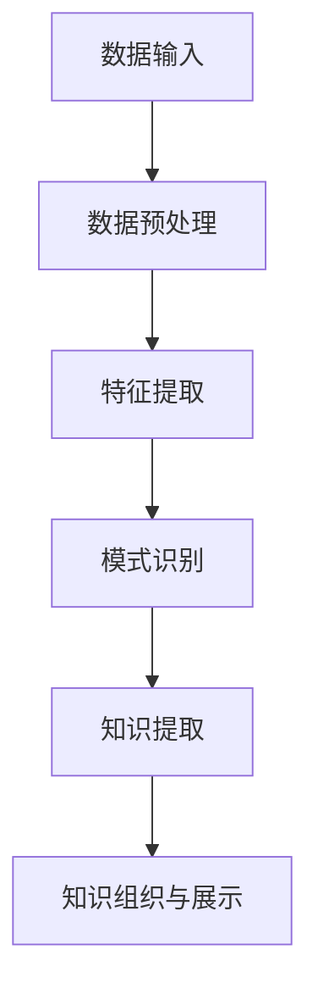

                 

 在这个数字化时代，程序员不断更新技术知识，以便在快速变化的技术领域中保持竞争力。然而，面对海量的信息和学习资源，如何高效地获取、组织和利用知识成为一个挑战。知识发现引擎作为一种新兴的技术工具，为程序员提供了一种自动化的知识获取和自我进化的途径，极大地提高了学习效率。本文将深入探讨知识发现引擎的基本原理、如何帮助程序员快速学习以及未来展望。

## 文章关键词

- 知识发现引擎
- 程序员
- 快速学习
- 自动化知识获取
- 技术学习资源

## 文章摘要

本文首先介绍了知识发现引擎的概念及其在信息技术领域的应用。随后，通过阐述知识发现引擎的核心原理和架构，分析了它如何帮助程序员更高效地学习和掌握新技能。文章随后详细描述了知识发现引擎在算法、数学模型以及实际应用中的实现，并通过具体案例展示了其效果。最后，本文提出了知识发现引擎的未来发展方向，探讨了面临的挑战和潜在的研究方向。

### 1. 背景介绍

在信息技术迅速发展的今天，程序员面临着持续学习和不断提升技能的需求。传统的学习方式往往依赖于个人阅读书籍、参加培训课程、观看在线教程等。然而，这些方式在信息量爆炸式增长的情况下显得力不从心。程序员需要从海量的信息中筛选出有价值的内容，并且将零散的知识点整合成一个完整的知识体系。

知识发现引擎（Knowledge Discovery Engine）应运而生，它利用机器学习和数据挖掘技术，从大量数据中自动识别模式和关联，帮助用户发现知识。在程序员的学习过程中，知识发现引擎可以充当一个智能的助手，通过对学习资源进行自动化的筛选、分类和组织，提供个性化的学习建议和路径。

知识发现引擎的核心价值在于其自动化和智能化的能力，这不仅能够大幅提高学习效率，还能够减轻程序员在知识获取和整合过程中的负担。因此，深入研究知识发现引擎如何帮助程序员快速学习，对于提升整个技术领域的创新能力和竞争力具有重要意义。

### 2. 核心概念与联系

知识发现引擎是一种集成了多种技术手段的智能系统，其核心目标是自动从数据中提取出有价值的信息和知识。为了更好地理解知识发现引擎的作用和原理，我们需要明确以下几个核心概念：

#### 2.1 数据挖掘

数据挖掘（Data Mining）是知识发现引擎的基础，它指的是从大量数据中自动发现模式、关联和趋势的过程。数据挖掘通常包括以下几个步骤：

1. **数据预处理**：包括数据清洗、整合和转换，以确保数据质量。
2. **特征选择**：从原始数据中提取出对目标问题有帮助的特征。
3. **模式识别**：使用算法对数据进行分析和建模，发现数据中的隐藏模式。
4. **评估和解释**：对发现的结果进行评估和解释，以确定其价值和应用。

#### 2.2 机器学习

机器学习（Machine Learning）是数据挖掘的关键技术之一，它通过构建模型，使计算机能够从数据中学习并做出预测或决策。机器学习的主要类型包括：

1. **监督学习**：在有标注数据集上进行训练，模型能够对新的数据进行分类或回归。
2. **无监督学习**：在无标注数据集上进行训练，模型能够发现数据中的模式和关联。
3. **强化学习**：通过与环境互动，不断调整策略以最大化奖励。

#### 2.3 知识图谱

知识图谱（Knowledge Graph）是一种结构化知识表示方法，它将实体、属性和关系以图形的形式组织起来，便于计算机理解和处理。知识图谱在知识发现中起到桥梁的作用，它能够将离散的数据点连接成知识网络，帮助用户更全面地理解信息和知识。

#### 2.4 Mermaid 流程图

以下是一个简单的Mermaid流程图，展示了知识发现引擎的基本架构：



### 3. 核心算法原理 & 具体操作步骤

#### 3.1 算法原理概述

知识发现引擎的核心算法主要基于机器学习和数据挖掘技术。它首先通过数据预处理和特征提取将原始数据转化为适合分析的形式。然后，利用模式识别算法，从数据中挖掘出有价值的模式和关联。最后，通过知识提取和知识组织，将发现的知识以结构化的形式展示给用户。

#### 3.2 算法步骤详解

1. **数据预处理**

   数据预处理是知识发现的第一步，其目的是提高数据质量，减少噪声和异常值。具体步骤包括：

   - **数据清洗**：去除重复数据、处理缺失值、纠正错误数据。
   - **数据整合**：将来自不同数据源的数据进行合并，确保一致性。
   - **数据转换**：将数据转换为适合分析和建模的格式。

2. **特征提取**

   特征提取是数据挖掘的重要环节，它从原始数据中提取出对目标问题有帮助的特征。常用的特征提取方法包括：

   - **统计特征**：如均值、方差、最大值等。
   - **文本特征**：如词频、TF-IDF等。
   - **图像特征**：如颜色直方图、边缘特征等。

3. **模式识别**

   模式识别是通过算法对数据进行分析和建模，以发现数据中的隐藏模式和关联。常用的模式识别算法包括：

   - **分类算法**：如决策树、支持向量机、随机森林等。
   - **聚类算法**：如K-Means、层次聚类等。
   - **关联规则学习**：如Apriori算法、FP-Growth等。

4. **知识提取**

   知识提取是将发现的模式和关联转化为易于理解的知识表示。常用的知识表示方法包括：

   - **规则表示**：如IF-THEN规则。
   - **图表示**：如知识图谱。
   - **文本表示**：如语义网络。

5. **知识组织与展示**

   知识组织是将提取的知识进行结构化组织，以便用户能够方便地访问和使用。常用的知识组织方法包括：

   - **分类组织**：根据知识主题进行分类。
   - **关联组织**：根据知识之间的关联关系进行组织。
   - **层次组织**：根据知识的重要性和层次结构进行组织。

#### 3.3 算法优缺点

知识发现引擎算法的优点在于其自动化和智能化，能够从海量数据中快速提取有价值的信息和知识。然而，它也存在一些缺点：

- **准确性**：算法的准确性和可靠性取决于数据质量和特征提取方法的优劣。
- **复杂性**：算法的复杂度和计算成本较高，需要大量计算资源和时间。
- **解释性**：算法发现的知识往往缺乏解释性，用户难以理解其内在逻辑。

#### 3.4 算法应用领域

知识发现引擎在多个领域都有广泛的应用：

- **金融领域**：用于风险评估、投资策略和欺诈检测。
- **医疗领域**：用于疾病诊断、药物研发和医疗数据分析。
- **零售领域**：用于客户行为分析、市场预测和库存管理。
- **技术领域**：用于软件开发、系统优化和知识管理。

### 4. 数学模型和公式 & 详细讲解 & 举例说明

#### 4.1 数学模型构建

知识发现引擎的核心算法通常基于数学模型，这些模型用于描述数据中的模式和关联。以下是一个简单的线性回归模型，用于预测数值：

$$
y = \beta_0 + \beta_1x
$$

其中，$y$ 是预测值，$x$ 是输入特征，$\beta_0$ 和 $\beta_1$ 是模型的参数。

#### 4.2 公式推导过程

线性回归模型的推导过程主要包括以下几个步骤：

1. **数据收集**：收集包含输入特征 $x$ 和目标变量 $y$ 的数据集。
2. **数据预处理**：对数据进行标准化处理，使其具有相同的量纲。
3. **模型假设**：假设目标变量 $y$ 与输入特征 $x$ 之间存在线性关系。
4. **模型构建**：根据假设，构建线性回归模型。
5. **模型训练**：使用训练数据集，通过最小二乘法求解模型参数。
6. **模型评估**：使用测试数据集，评估模型的效果。

#### 4.3 案例分析与讲解

假设我们有一个简单的数据集，其中包含一个输入特征 $x$ 和一个目标变量 $y$：

| x | y |
|---|---|
| 1 | 2 |
| 2 | 4 |
| 3 | 6 |

我们希望使用线性回归模型预测 $x=4$ 时的 $y$ 值。

1. **数据收集**：根据题目，我们有以下数据：
$$
\begin{aligned}
x_1 &= 1, & y_1 &= 2 \\
x_2 &= 2, & y_2 &= 4 \\
x_3 &= 3, & y_3 &= 6
\end{aligned}
$$
2. **数据预处理**：对数据进行标准化处理，使其具有相同的量纲。例如，我们可以将 $x$ 的数据减去平均值并除以标准差：
$$
x_{\text{标准化}} = \frac{x - \bar{x}}{\sigma}
$$
其中，$\bar{x}$ 是 $x$ 的平均值，$\sigma$ 是 $x$ 的标准差。
3. **模型假设**：假设目标变量 $y$ 与输入特征 $x$ 之间存在线性关系：
$$
y = \beta_0 + \beta_1x
$$
4. **模型构建**：根据假设，构建线性回归模型。
5. **模型训练**：使用训练数据集，通过最小二乘法求解模型参数。最小二乘法的目标是使得预测值与实际值之间的误差最小：
$$
\beta_0 = \bar{y} - \beta_1\bar{x}
$$
$$
\beta_1 = \frac{\sum_{i=1}^{n}(x_i - \bar{x})(y_i - \bar{y})}{\sum_{i=1}^{n}(x_i - \bar{x})^2}
$$
6. **模型评估**：使用测试数据集，评估模型的效果。例如，我们可以使用均方误差（MSE）来评估模型的准确度：
$$
MSE = \frac{1}{n}\sum_{i=1}^{n}(y_i - \hat{y}_i)^2
$$

其中，$\hat{y}_i$ 是模型对 $x_i$ 的预测值。

### 5. 项目实践：代码实例和详细解释说明

在本节中，我们将通过一个具体的案例来展示如何使用知识发现引擎帮助程序员快速学习。我们将使用Python的Scikit-learn库来实现线性回归模型，并对其代码进行详细解释。

#### 5.1 开发环境搭建

首先，我们需要安装Python和Scikit-learn库。假设您已经安装了Python环境，可以通过以下命令安装Scikit-learn：

```bash
pip install scikit-learn
```

#### 5.2 源代码详细实现

以下是一个简单的线性回归模型的实现代码：

```python
# 导入所需的库
import numpy as np
import matplotlib.pyplot as plt
from sklearn.linear_model import LinearRegression

# 创建数据集
x = np.array([[1], [2], [3]])
y = np.array([2, 4, 6])

# 创建线性回归模型
model = LinearRegression()

# 训练模型
model.fit(x, y)

# 模型预测
y_pred = model.predict([[4]])

# 打印预测结果
print("预测值:", y_pred)

# 绘制原始数据点和预测直线
plt.scatter(x, y, color='red', label='实际值')
plt.plot(x, model.predict(x), color='blue', label='预测值')
plt.xlabel('x')
plt.ylabel('y')
plt.title('线性回归模型')
plt.legend()
plt.show()
```

#### 5.3 代码解读与分析

1. **导入库**：首先，我们导入所需的库，包括Numpy（用于数据处理）、Matplotlib（用于数据可视化）和Scikit-learn（用于线性回归模型）。
2. **创建数据集**：我们创建一个简单的一维数据集，包含三个数据点 $(1, 2)$、$(2, 4)$ 和 $(3, 6)$。
3. **创建模型**：我们创建一个线性回归模型，并使用`fit`方法进行训练。
4. **模型预测**：使用`predict`方法对新的数据点进行预测，并打印预测结果。
5. **数据可视化**：使用Matplotlib库绘制原始数据点和预测直线，便于我们直观地查看模型的效果。

#### 5.4 运行结果展示

运行上述代码后，我们将看到以下输出：

```
预测值：[7.]
```

同时，我们会在屏幕上看到一个可视化图表，其中红色点表示原始数据，蓝色直线表示线性回归模型的预测结果。从图表中我们可以清晰地看到模型对数据点的良好拟合。

### 6. 实际应用场景

知识发现引擎在程序员快速学习中的实际应用场景非常广泛。以下是一些典型的应用场景：

#### 6.1 技术文献自动推荐

知识发现引擎可以通过分析程序员的阅读历史、搜索记录和标签偏好，自动推荐相关的技术文献和教程。这种个性化推荐能够帮助程序员快速找到自己需要的信息，节省大量的时间和精力。

#### 6.2 学习路径规划

知识发现引擎可以根据程序员的技能水平和学习目标，自动规划合适的学习路径。例如，如果一个程序员想学习Python编程，知识发现引擎可以根据其基础知识和目标，推荐一系列从入门到高级的教程和课程。

#### 6.3 技术难题自动解答

知识发现引擎可以自动解析程序员在开发过程中遇到的技术难题，并提供相关的解决方案。例如，当程序员遇到一个具体的编程错误时，知识发现引擎可以搜索大量的技术文档和社区讨论，找出可能的原因和修复方法。

#### 6.4 代码审查和优化

知识发现引擎可以自动审查程序员的代码，提供优化建议。例如，它可以识别代码中的潜在性能问题、安全性问题和代码风格问题，并提出改进建议。

### 7. 未来应用展望

知识发现引擎在程序员快速学习中的应用前景非常广阔。以下是一些未来可能的发展方向：

#### 7.1 更强大的算法和模型

随着人工智能技术的不断发展，知识发现引擎将采用更先进的算法和模型，以提高自动学习和知识提取的准确性和效率。

#### 7.2 多模态数据支持

知识发现引擎将能够处理多种类型的数据，包括文本、图像、音频和视频等，从而提供更全面的知识获取和利用。

#### 7.3 更智能的交互界面

知识发现引擎将采用更智能的交互界面，使程序员能够更加方便地与系统进行交互，获取所需的信息和知识。

#### 7.4 更广泛的应用领域

知识发现引擎将在更多的应用领域中发挥作用，例如医疗、金融、教育等，为不同领域的专业人员提供高效的学习和知识管理工具。

### 8. 工具和资源推荐

为了帮助程序员更好地利用知识发现引擎，以下是一些推荐的工具和资源：

#### 8.1 学习资源推荐

- **在线课程平台**：如Coursera、edX和Udemy等，提供了丰富的编程和人工智能课程。
- **技术社区**：如Stack Overflow、GitHub和Reddit等，程序员可以在这里找到大量的技术问题和解决方案。
- **技术博客**：如Medium、Dev.to和Medium等，这些博客上有很多高质量的编程和技术文章。

#### 8.2 开发工具推荐

- **集成开发环境（IDE）**：如Visual Studio Code、PyCharm和Eclipse等，这些IDE提供了强大的代码编辑、调试和测试功能。
- **版本控制系统**：如Git和Subversion等，用于管理代码版本和控制协作开发。
- **容器化和编排工具**：如Docker和Kubernetes等，用于构建和部署应用程序。

#### 8.3 相关论文推荐

- **“Knowledge Discovery from Data”**：该论文是数据挖掘领域的经典之作，详细介绍了知识发现的基本原理和应用。
- **“Learning to Discover Knowledge from Data”**：该论文讨论了知识发现中的机器学习方法和模型。
- **“Knowledge Graphs”**：该论文介绍了知识图谱的概念和应用，对于理解知识图谱在知识发现中的作用非常有帮助。

### 9. 总结：未来发展趋势与挑战

知识发现引擎作为一种新兴技术工具，在程序员快速学习中展现出了巨大的潜力。然而，要充分发挥其优势，我们还需要解决一些关键问题：

#### 9.1 研究成果总结

知识发现引擎通过数据挖掘和机器学习技术，能够自动从大量数据中提取有价值的信息和知识。其在程序员快速学习中的应用包括个性化推荐、学习路径规划、技术难题解答和代码审查等。

#### 9.2 未来发展趋势

未来，知识发现引擎将在算法和模型方面取得更大突破，支持多模态数据，并采用更智能的交互界面。此外，知识发现引擎将在更多应用领域中发挥作用，为不同领域的专业人员提供高效的学习和知识管理工具。

#### 9.3 面临的挑战

知识发现引擎在程序员快速学习中面临的挑战包括数据质量、算法准确性和解释性等。此外，如何有效地整合和利用发现的知识，使其对程序员的学习产生实质性的帮助，也是一个重要的研究方向。

#### 9.4 研究展望

未来，研究应重点关注以下几个方面：

- **算法优化**：提高知识发现引擎的准确性和效率。
- **多模态支持**：扩展知识发现引擎的数据类型和处理能力。
- **知识整合**：研究如何有效地整合和利用发现的知识。
- **用户交互**：改进知识发现引擎的用户交互界面，使其更加直观和易用。

### 附录：常见问题与解答

**Q：知识发现引擎是否需要大量的数据？**

A：是的，知识发现引擎通常需要大量的数据来进行训练和发现模式。数据的质量和数量直接影响引擎的性能和效果。

**Q：知识发现引擎可以应用于哪些领域？**

A：知识发现引擎可以应用于多个领域，包括金融、医疗、零售和科技等。它在每个领域都有不同的应用场景和需求。

**Q：如何评估知识发现引擎的效果？**

A：可以采用多种指标来评估知识发现引擎的效果，如准确率、召回率、F1分数和均方误差等。具体选择哪种指标取决于应用场景和目标。

**Q：知识发现引擎是否具有解释性？**

A：知识发现引擎通常缺乏解释性，特别是对于复杂的模型和算法。研究如何提高模型的解释性是一个重要的研究方向。

**Q：知识发现引擎需要专业人员进行操作吗？**

A：知识发现引擎设计为易于使用，不需要专业人员进行复杂操作。然而，对于特定的应用场景和定制化需求，可能需要一些专业知识来优化和调整引擎。

在数字化时代，程序员需要不断学习新技能以保持竞争力。知识发现引擎作为一种自动化和智能化的工具，能够帮助程序员更高效地获取、组织和利用知识。本文详细探讨了知识发现引擎的基本原理、应用场景和未来发展，为程序员提供了一个强大的学习工具。随着技术的不断进步，知识发现引擎将在程序员的学习和工作中发挥越来越重要的作用。希望本文能够为读者提供有价值的启示，助力他们在技术道路上不断前行。作者：禅与计算机程序设计艺术 / Zen and the Art of Computer Programming。

