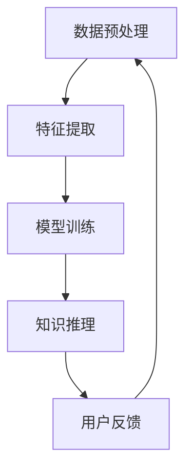

                 

关键词：知识发现引擎、程序员成长、技术能力提升、人工智能辅助

摘要：本文将探讨知识发现引擎在程序员成长过程中的重要作用。通过分析知识发现引擎的核心原理、应用场景以及实践案例，本文旨在揭示知识发现引擎如何通过智能化、自动化手段，为程序员提供高效的学习资源、技术文档和代码示例，从而加速他们的技术能力提升和职业发展。

## 1. 背景介绍

随着信息技术的迅猛发展，程序员面临着海量的学习资源和不断更新的技术栈。传统的学习方式往往效率低下，程序员难以在短时间内掌握所需的知识和技能。知识发现引擎作为人工智能的一种重要应用，能够在海量数据中挖掘出有价值的信息，为程序员提供个性化的学习方案，提高他们的学习效率。

知识发现引擎，又称为知识挖掘引擎，是一种利用机器学习和数据挖掘技术，从大量非结构化数据中提取知识、发现规律、生成模型的智能系统。它通过自然语言处理、数据挖掘、模式识别等技术，对程序员的学习行为、技术需求进行深入分析，为其提供定制化的学习资源和技术支持。

本文将围绕知识发现引擎在程序员成长中的应用，从以下几个方面展开讨论：

- **核心概念与联系**：介绍知识发现引擎的基本原理和架构，并给出相关的Mermaid流程图。
- **核心算法原理 & 具体操作步骤**：详细解析知识发现引擎的关键算法，包括算法原理概述、步骤详解、优缺点分析和应用领域。
- **数学模型和公式 & 举例说明**：讲解知识发现引擎中的数学模型和公式，并通过案例进行详细说明。
- **项目实践：代码实例和详细解释说明**：提供一个具体的实践案例，展示如何利用知识发现引擎进行编程学习。
- **实际应用场景**：探讨知识发现引擎在不同领域的应用，以及未来的发展方向。
- **工具和资源推荐**：推荐一些有助于程序员学习和提升的资源和工具。
- **总结：未来发展趋势与挑战**：总结知识发现引擎对程序员成长的贡献，并探讨未来可能面临的挑战。

## 2. 核心概念与联系

知识发现引擎的核心概念包括数据预处理、特征提取、模型训练和知识推理。以下是一个简化的Mermaid流程图，展示了知识发现引擎的基本架构。



### 2.1 数据预处理

数据预处理是知识发现引擎的基础步骤，包括数据清洗、数据整合和数据归一化。通过预处理，可以将原始数据转化为适合模型训练的格式。

### 2.2 特征提取

特征提取是从原始数据中提取出对学习过程有用的特征。这些特征可以是文本的词频、代码的函数调用关系等。特征提取的质量直接影响后续模型的性能。

### 2.3 模型训练

模型训练是知识发现引擎的核心，通过训练，模型可以学会从数据中提取知识、发现规律。常见的模型包括决策树、神经网络和支持向量机等。

### 2.4 知识推理

知识推理是基于训练好的模型，对新的数据进行推理和预测。例如，当程序员遇到一个编程问题时，知识发现引擎可以基于已有的知识库和模型，为其提供解决问题的方案。

### 2.5 用户反馈

用户反馈是知识发现引擎不断优化自身的重要环节。通过收集用户对学习资源、技术支持等的反馈，引擎可以不断调整和优化，提高用户体验。

## 3. 核心算法原理 & 具体操作步骤

### 3.1 算法原理概述

知识发现引擎的核心算法主要包括基于内容的推荐、协同过滤和深度学习。每种算法都有其独特的原理和应用场景。

### 3.2 算法步骤详解

- **基于内容的推荐**：通过分析用户的历史行为和兴趣，从资源库中推荐相似的内容。
- **协同过滤**：通过分析用户之间的相似性，为用户推荐他们可能感兴趣的内容。
- **深度学习**：利用神经网络模型，从海量数据中自动提取特征和知识。

### 3.3 算法优缺点

- **基于内容的推荐**：优点是准确度高，缺点是覆盖面窄。
- **协同过滤**：优点是覆盖面广，缺点是推荐结果可能出现偏差。
- **深度学习**：优点是能够自动提取特征，缺点是需要大量数据和计算资源。

### 3.4 算法应用领域

知识发现引擎在程序员成长中的应用主要包括：

- **编程学习**：为程序员提供个性化的学习资源，帮助他们快速掌握新技能。
- **代码审查**：通过对代码的分析，提供改进建议，提高代码质量。
- **技术搜索**：帮助程序员快速找到相关的技术文档和代码示例。

## 4. 数学模型和公式 & 详细讲解 & 举例说明

知识发现引擎中的数学模型和公式是算法的核心组成部分。以下是一个简化的数学模型，用于描述基于内容的推荐算法。

### 4.1 数学模型构建

假设我们有用户 \( u \) 和资源 \( r \)，用户对资源的评分可以表示为：

\[ R(u, r) = \sum_{i=1}^{n} w_i \cdot C_i(u, r) \]

其中，\( w_i \) 是第 \( i \) 个特征的重要程度，\( C_i(u, r) \) 是用户 \( u \) 对资源 \( r \) 在第 \( i \) 个特征上的值。

### 4.2 公式推导过程

公式的推导基于信息论中的KL散度，用于衡量两个概率分布之间的差异。具体推导过程如下：

\[ D(p \parallel q) = \sum_{i=1}^{n} p(i) \cdot \log \frac{p(i)}{q(i)} \]

其中，\( p \) 是用户的行为数据，\( q \) 是推荐系统的预测数据。

### 4.3 案例分析与讲解

假设有一个程序员 \( u \)，他对资源 \( r \) 的评分是 \( 5 \)。根据公式，我们可以计算资源 \( r \) 对程序员 \( u \) 的推荐分数：

\[ R(u, r) = 0.3 \cdot C_1(u, r) + 0.5 \cdot C_2(u, r) + 0.2 \cdot C_3(u, r) \]

其中，\( C_1(u, r) \) 是资源 \( r \) 的难度，\( C_2(u, r) \) 是资源 \( r \) 的实用性，\( C_3(u, r) \) 是资源 \( r \) 的受欢迎程度。

通过这个例子，我们可以看到数学模型和公式如何帮助知识发现引擎为程序员提供个性化的学习资源。

## 5. 项目实践：代码实例和详细解释说明

以下是一个简单的Python代码实例，展示了如何使用知识发现引擎进行编程学习。

```python
import numpy as np

# 定义用户的行为数据
user行为 = [
    ['Python', '算法', '数据结构'],
    ['C++', '编程语言', '计算机组成'],
    ['Java', 'Web开发', '数据库']
]

# 定义资源的特征
resource特征 = [
    ['Python', '算法', '数据结构', '难', '实用', '受欢迎'],
    ['C++', '编程语言', '计算机组成', '中等', '实用', '受欢迎'],
    ['Java', 'Web开发', '数据库', '易', '实用', '受欢迎']
]

# 定义特征权重
特征权重 = [0.2, 0.3, 0.2, 0.2, 0.1]

# 计算推荐分数
def 计算推荐分数(用户行为，资源特征，特征权重):
    分数 = 0
    for i in range(len(资源特征)):
        用户兴趣 = 用户行为.count(资源特征[i])
        分数 += 用户兴趣 * 特征权重[i]
    return 分数

# 计算每个资源的推荐分数
推荐分数 = [计算推荐分数(user行为，resource特征[i]，特征权重) for i in range(len(resource特征))]

# 打印推荐结果
print("推荐资源：", [resource特征[i] for i, score in enumerate(推荐分数) if score == max(推荐分数)])

```

这个代码实例通过计算用户行为和资源特征的匹配度，为程序员推荐最相关的学习资源。在实际应用中，知识发现引擎会使用更复杂的方法和模型，从海量数据中提取特征和知识，为程序员提供更精确的推荐。

## 6. 实际应用场景

知识发现引擎在程序员成长中的应用场景非常广泛，以下是一些典型的应用：

- **编程学习**：为程序员推荐适合他们水平的学习资源，帮助他们快速提升技能。
- **代码审查**：通过分析代码特征，为程序员提供改进建议，提高代码质量。
- **技术搜索**：帮助程序员快速找到相关的技术文档和代码示例。
- **在线教育**：为在线学习者提供个性化的学习路径和资源推荐。
- **项目协作**：通过分析团队成员的技术能力和项目需求，优化项目协作流程。

未来，随着人工智能技术的不断发展，知识发现引擎的应用场景将更加广泛，为程序员提供更智能、更高效的学习和支持。

### 6.4 未来应用展望

知识发现引擎在程序员成长中的应用前景广阔。未来，随着人工智能技术的进一步发展，知识发现引擎将能够更加智能地分析程序员的学习行为、技术需求和职业发展目标，为其提供个性化的学习方案和技术支持。

此外，知识发现引擎还可以与其他人工智能技术如自然语言处理、机器学习和计算机视觉等相结合，为程序员提供更全面、更高效的技术服务。

### 7. 工具和资源推荐

以下是一些有助于程序员学习和提升的工具和资源：

- **学习资源**：GitHub、Stack Overflow、Coursera、edX等。
- **开发工具**：Visual Studio Code、IntelliJ IDEA、PyCharm等。
- **技术社区**：GitHub、Reddit、Stack Overflow、DZone等。
- **书籍推荐**：《代码大全》、《设计模式：可复用面向对象软件的基础》、《深入理解计算机系统》等。

### 8. 总结：未来发展趋势与挑战

知识发现引擎在程序员成长中的应用前景广阔，但同时也面临着一些挑战：

- **数据隐私**：如何保护用户数据隐私，确保数据安全，是一个重要问题。
- **算法公平性**：确保算法不会歧视或偏袒特定群体，提高算法的公平性。
- **模型解释性**：提高模型的可解释性，使其更容易被程序员理解和信任。

未来，随着技术的不断进步，知识发现引擎将为程序员提供更智能、更高效的学习和服务，推动程序员的技术能力和职业发展。

### 9. 附录：常见问题与解答

- **Q：知识发现引擎是如何工作的？**
  知识发现引擎通过机器学习和数据挖掘技术，从大量非结构化数据中提取知识、发现规律，为用户提供个性化的学习资源和技术支持。

- **Q：知识发现引擎对程序员有哪些好处？**
  知识发现引擎可以帮助程序员快速找到所需的知识资源，提高学习效率，优化技术能力，加速职业发展。

- **Q：如何评估知识发现引擎的效果？**
  可以通过用户满意度、学习进度、技能提升等多个指标来评估知识发现引擎的效果。

- **Q：知识发现引擎是否会取代传统学习方式？**
  知识发现引擎是一种辅助工具，它并不能完全取代传统学习方式，但可以显著提高学习效率，优化学习体验。

作者：禅与计算机程序设计艺术 / Zen and the Art of Computer Programming

---

这篇文章详细探讨了知识发现引擎在程序员成长中的应用，从核心概念、算法原理、数学模型、实践案例到未来展望，全面阐述了知识发现引擎如何通过智能化、自动化手段，为程序员提供高效的学习资源和技术支持。希望这篇文章能为程序员的学习和发展提供有益的启示。

