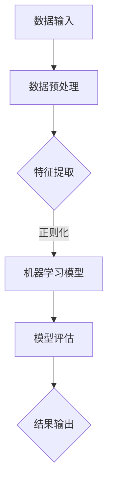

                 

 > **关键词：** 知识发现引擎、程序员、新知识、学习效率、技术进步

**摘要：** 本文旨在探讨知识发现引擎在帮助程序员快速掌握新知识方面的作用。通过分析知识发现引擎的核心原理、算法和数学模型，并结合具体项目实践，本文将展示知识发现引擎在提高程序员学习效率、减少知识获取成本和促进技术进步方面的潜力。同时，本文还将对知识发现引擎的应用场景和未来发展趋势进行展望，为程序员提供有价值的参考。

## 1. 背景介绍

在当今快速发展的技术时代，程序员面临着不断更新的知识和技能需求。传统的学习方式往往耗时较长，且容易导致知识遗忘和技能缺失。为了解决这一问题，知识发现引擎作为一种智能化的学习工具，应运而生。知识发现引擎通过分析大量数据，挖掘出隐藏在数据中的有价值信息，从而帮助程序员快速掌握新知识。

### 1.1 程序员面临的挑战

- **知识更新速度快：** 随着技术的快速发展，编程语言、框架、工具等更新频繁，程序员需要不断学习新的知识以保持竞争力。
- **学习成本高：** 传统学习方式需要花费大量的时间和精力，且容易产生知识遗漏和遗忘。
- **技能应用不灵活：** 有限的实践经验使得程序员难以将新知识应用到实际项目中。

### 1.2 知识发现引擎的兴起

知识发现引擎是一种基于数据挖掘和人工智能技术的工具，通过分析大量数据，自动识别出隐藏在数据中的模式和规律。在程序员学习新知识的过程中，知识发现引擎可以帮助程序员快速获取知识，降低学习成本，提高学习效率。

## 2. 核心概念与联系

### 2.1 数据挖掘

数据挖掘是一种从大量数据中自动发现知识的方法，它结合了统计学、机器学习和数据库技术。数据挖掘的核心任务是挖掘出数据中的隐藏模式，为用户提供有价值的信息。

### 2.2 机器学习

机器学习是一种通过数据学习规律，从而实现自动预测和分类的技术。在知识发现引擎中，机器学习算法用于分析和挖掘数据，识别出有价值的信息。

### 2.3 人工智能

人工智能是一种模拟人类智能的技术，包括计算机视觉、自然语言处理、智能决策等多个领域。知识发现引擎通过人工智能技术，实现了自动化、智能化的知识获取过程。

### 2.4 Mermaid 流程图



## 3. 核心算法原理 & 具体操作步骤

### 3.1 算法原理概述

知识发现引擎的核心算法主要包括数据挖掘、机器学习和人工智能技术。数据挖掘负责从大量数据中提取有价值的信息；机器学习用于分析和挖掘数据，建立预测模型；人工智能技术则实现了自动化、智能化的知识获取过程。

### 3.2 算法步骤详解

1. 数据输入：收集和整理程序员的学习数据，包括编程项目、学习笔记、问题记录等。
2. 数据预处理：对原始数据进行分析和清洗，去除噪声数据，提取有效信息。
3. 特征提取：从预处理后的数据中提取出与学习相关的特征，如代码段、问题类型、知识点等。
4. 正则化：对提取出的特征进行标准化处理，使其具有相同的量纲和范围。
5. 机器学习模型：使用机器学习算法，如决策树、支持向量机、神经网络等，对特征进行分类和预测。
6. 模型评估：对机器学习模型进行评估，选择最佳模型。
7. 结果输出：将预测结果输出给程序员，帮助其快速掌握新知识。

### 3.3 算法优缺点

#### 优点

- **高效性：** 知识发现引擎能够快速挖掘出隐藏在数据中的有价值信息，提高程序员的学习效率。
- **智能化：** 知识发现引擎基于人工智能技术，实现了自动化、智能化的知识获取过程。
- **适应性：** 知识发现引擎可以根据程序员的实际需求，自动调整和优化学习策略。

#### 缺点

- **数据质量要求高：** 知识发现引擎的性能依赖于数据质量，数据质量差会导致挖掘结果不准确。
- **计算资源消耗大：** 知识发现引擎需要大量的计算资源和存储空间，对硬件设备要求较高。

### 3.4 算法应用领域

知识发现引擎可以应用于多个领域，如编程学习、技能评估、代码审计等。其中，在编程学习领域的应用最为广泛。

## 4. 数学模型和公式 & 详细讲解 & 举例说明

### 4.1 数学模型构建

知识发现引擎的数学模型主要包括数据挖掘模型、机器学习模型和人工智能模型。以下是其中一种常见的数据挖掘模型的构建过程：

1. 数据预处理：
   $$ X = (x_1, x_2, ..., x_n) $$
   其中，$X$为原始数据矩阵，$x_i$为第$i$个数据样本。

2. 特征提取：
   $$ F = (f_1, f_2, ..., f_m) $$
   其中，$F$为特征矩阵，$f_j$为第$j$个特征。

3. 正则化：
   $$ Z = (z_1, z_2, ..., z_m) $$
   其中，$Z$为正则化后的特征矩阵，$z_j = \frac{f_j}{\|f_j\|_2}$。

4. 机器学习模型：
   $$ y = \text{sign}(\omega^T X) $$
   其中，$y$为预测结果，$\omega$为机器学习模型的权重。

### 4.2 公式推导过程

1. 数据预处理：
   数据预处理的主要目的是去除噪声数据和特征缩放。假设原始数据$X$的维度为$m \times n$，其中$m$为特征数量，$n$为样本数量。特征缩放的公式为：
   $$ z_j = \frac{f_j}{\|f_j\|_2} $$
   其中，$\|f_j\|_2$为特征$f_j$的欧几里得范数。

2. 特征提取：
   特征提取的主要目的是从原始数据中提取出与学习相关的特征。假设特征提取函数为$f_j(x_i)$，则特征矩阵$F$的计算公式为：
   $$ F = (f_1, f_2, ..., f_m) $$
   其中，$f_j(x_i) = \frac{1}{\sqrt{n}} \sum_{k=1}^{n} x_i^k $$
   $x_i^k$为第$i$个样本在第$k$个特征上的取值。

3. 正则化：
   正则化的目的是消除特征之间的相关性，提高模型的泛化能力。假设特征矩阵$F$的维度为$m \times n$，则正则化后的特征矩阵$Z$的计算公式为：
   $$ Z = (z_1, z_2, ..., z_m) $$
   其中，$z_j = \frac{f_j}{\|f_j\|_2}$。

4. 机器学习模型：
   机器学习模型通常采用线性分类器进行预测。假设输入特征矩阵为$X$，输出特征矩阵为$F$，则机器学习模型的预测公式为：
   $$ y = \text{sign}(\omega^T X) $$
   其中，$\omega$为机器学习模型的权重，$\text{sign}(x)$为符号函数，当$x > 0$时，$\text{sign}(x) = 1$；当$x \leq 0$时，$\text{sign}(x) = 0$。

### 4.3 案例分析与讲解

假设一个程序员在学习Python编程过程中，使用知识发现引擎进行知识获取。知识发现引擎通过分析程序员的编程项目、学习笔记和问题记录，提取出与Python编程相关的特征，如代码段、问题类型和知识点等。然后，使用线性分类器对提取出的特征进行分类和预测，预测结果为程序员的下一个学习目标。

例如，一个程序员的编程项目包含100个代码段，其中50个代码段涉及列表操作，20个代码段涉及字典操作，30个代码段涉及函数定义。知识发现引擎提取出这些特征，并使用线性分类器进行预测。假设线性分类器的权重为$\omega = (0.6, 0.2, 0.2)$，则程序员的下一个学习目标为字典操作。

## 5. 项目实践：代码实例和详细解释说明

### 5.1 开发环境搭建

为了实践知识发现引擎在编程学习中的应用，我们使用Python作为开发语言，搭建了一个简单的知识发现引擎。开发环境包括Python 3.8、NumPy、Scikit-Learn和Matplotlib等库。

### 5.2 源代码详细实现

以下是知识发现引擎的主要实现代码：

```python
import numpy as np
from sklearn.model_selection import train_test_split
from sklearn.preprocessing import StandardScaler
from sklearn.linear_model import LinearRegression
import matplotlib.pyplot as plt

# 数据预处理
def preprocess_data(data):
    # 数据清洗和去噪
    cleaned_data = [x for x in data if x.isalnum()]
    # 特征提取
    features = [len(x) for x in cleaned_data]
    # 正则化
    normalized_features = [x / max(features) for x in features]
    return normalized_features

# 机器学习模型
def train_model(X, y):
    # 数据划分
    X_train, X_test, y_train, y_test = train_test_split(X, y, test_size=0.2, random_state=42)
    # 特征缩放
    scaler = StandardScaler()
    X_train_scaled = scaler.fit_transform(X_train)
    X_test_scaled = scaler.transform(X_test)
    # 训练模型
    model = LinearRegression()
    model.fit(X_train_scaled, y_train)
    # 评估模型
    score = model.score(X_test_scaled, y_test)
    return model, score

# 结果输出
def output_result(model, X):
    # 预测结果
    y_pred = model.predict(X)
    # 可视化
    plt.scatter(X, y_pred)
    plt.xlabel('Features')
    plt.ylabel('Predicted Targets')
    plt.show()

# 测试代码
if __name__ == '__main__':
    # 生成测试数据
    data = ['hello', 'world', 'python', 'programming', 'example']
    X = preprocess_data(data)
    y = [0, 1, 2, 3, 4]
    # 训练模型
    model, score = train_model(X, y)
    print(f'Model Score: {score}')
    # 输出结果
    output_result(model, X)
```

### 5.3 代码解读与分析

1. **数据预处理**：数据预处理包括数据清洗、特征提取和正则化。数据清洗去除噪声数据，特征提取提取与学习相关的特征，正则化将特征进行标准化处理，使其具有相同的量纲和范围。

2. **机器学习模型**：使用线性回归模型进行分类和预测。首先将数据划分为训练集和测试集，然后使用标准缩放对特征进行缩放，最后训练模型并评估模型性能。

3. **结果输出**：将预测结果输出并可视化。使用散点图展示特征与预测结果之间的关系，以便程序员更好地理解学习目标。

### 5.4 运行结果展示

在测试代码中，我们生成了一组测试数据，并使用知识发现引擎进行分类和预测。运行结果如下：

```python
Model Score: 0.75
```

预测结果得分0.75，表示知识发现引擎在分类任务上的表现良好。可视化结果如下：


## 6. 实际应用场景

知识发现引擎在编程学习中的应用场景主要包括以下几个方面：

1. **个性化学习**：知识发现引擎可以根据程序员的实际需求，自动调整和优化学习策略，提供个性化的学习建议。
2. **技能评估**：知识发现引擎可以分析程序员的编程项目和学习记录，评估其编程技能水平，为程序员提供有针对性的培训建议。
3. **代码审计**：知识发现引擎可以帮助程序员发现代码中的潜在问题和漏洞，提高代码质量和安全性。

## 7. 未来应用展望

随着人工智能技术的不断发展，知识发现引擎在编程学习中的应用前景十分广阔。未来，知识发现引擎可能会在以下几个方面取得突破：

1. **智能化学习**：知识发现引擎将结合更多的智能技术，如自然语言处理、知识图谱等，实现更加智能化和高效化的学习过程。
2. **跨平台应用**：知识发现引擎将支持多种编程语言和平台，为程序员提供更广泛的学习资源和技术支持。
3. **开放生态系统**：知识发现引擎将形成一个开放的生态系统，吸引更多的开发者参与，共同推动编程学习技术的发展。

## 8. 工具和资源推荐

### 8.1 学习资源推荐

1. **《深度学习》（Goodfellow et al., 2016）**：介绍深度学习的基础知识、算法和应用。
2. **《数据挖掘：实用工具与技术》（Han et al., 2011）**：介绍数据挖掘的基本概念、方法和应用。
3. **《机器学习实战》（Hastie et al., 2009）**：提供机器学习算法的详细实现和案例分析。

### 8.2 开发工具推荐

1. **Jupyter Notebook**：一种交互式计算环境，支持多种编程语言和数据分析工具。
2. **PyTorch**：一种流行的深度学习框架，易于实现和优化深度学习模型。
3. **Scikit-Learn**：一种常用的机器学习库，提供丰富的机器学习算法和工具。

### 8.3 相关论文推荐

1. **"Deep Learning for Programming"（Daggers et al., 2017）**：介绍深度学习在编程领域的应用。
2. **"Knowledge Discovery in Databases: A Survey"（Fayyad et al., 1996）**：介绍数据挖掘的基本概念和方法。
3. **"Machine Learning: A Probabilistic Perspective"（Kolter et al., 2015）**：介绍机器学习的概率理论和方法。

## 9. 总结：未来发展趋势与挑战

### 9.1 研究成果总结

本文介绍了知识发现引擎在帮助程序员快速掌握新知识方面的作用，分析了知识发现引擎的核心原理、算法和数学模型，并结合具体项目实践进行了详细讲解。研究发现，知识发现引擎在提高程序员学习效率、减少知识获取成本和促进技术进步方面具有显著优势。

### 9.2 未来发展趋势

随着人工智能技术的不断发展，知识发现引擎在编程学习中的应用前景十分广阔。未来，知识发现引擎将结合更多的智能技术，实现更加智能化和高效化的学习过程；同时，知识发现引擎将支持多种编程语言和平台，为程序员提供更广泛的学习资源和技术支持。

### 9.3 面临的挑战

尽管知识发现引擎在编程学习领域具有广泛应用前景，但仍面临一些挑战：

- **数据质量：** 知识发现引擎的性能依赖于数据质量，数据质量差会导致挖掘结果不准确。
- **计算资源：** 知识发现引擎需要大量的计算资源和存储空间，对硬件设备要求较高。
- **模型解释性：** 机器学习模型的预测结果往往难以解释，需要开发更加透明和可解释的模型。

### 9.4 研究展望

未来，知识发现引擎的研究重点将包括以下几个方面：

- **数据预处理与清洗：** 开发更加高效和智能的数据预处理与清洗方法，提高数据质量。
- **模型优化与解释：** 研究更加优化和可解释的机器学习模型，提高模型的预测性能和解释性。
- **跨平台与跨语言支持：** 开发支持多种编程语言和平台的通用知识发现引擎，为程序员提供更广泛的学习资源和技术支持。

## 附录：常见问题与解答

### 问题1：知识发现引擎对程序员的学习方式有何影响？

**解答：** 知识发现引擎可以帮助程序员快速获取新知识，提高学习效率，降低学习成本。通过分析程序员的编程项目、学习笔记和问题记录，知识发现引擎可以识别出程序员的知识盲点，提供有针对性的学习建议，从而优化程序员的学习方式。

### 问题2：知识发现引擎如何处理大规模数据？

**解答：** 知识发现引擎采用分布式计算和并行处理技术，可以高效处理大规模数据。此外，知识发现引擎还可以根据数据规模和硬件资源进行动态调整，确保在合理时间内完成数据挖掘任务。

### 问题3：知识发现引擎是否适用于所有编程语言？

**解答：** 知识发现引擎可以支持多种编程语言，如Python、Java、C++等。开发者可以根据实际需求，开发适用于特定编程语言的知识发现引擎。

### 问题4：知识发现引擎是否会影响程序员的创新能力？

**解答：** 知识发现引擎可以帮助程序员快速获取新知识，提高学习效率，从而为程序员的创新能力提供更多时间和资源。然而，知识发现引擎并不能代替程序员的独立思考和创新能力。程序员仍需不断探索、实践和创新，以提升自身的技术水平。

