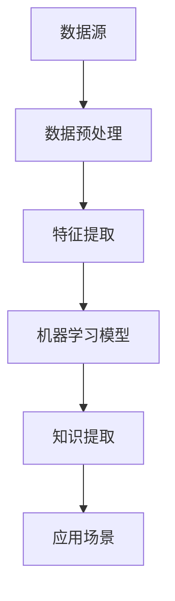

                 

关键词：知识发现引擎、行业动态、程序员、技术趋势、算法原理、应用领域、数学模型、代码实例、未来展望。

## 摘要

在信息爆炸的时代，程序员面临着不断更新的技术栈和快速变化的行业动态。如何快速掌握这些动态，成为程序员提升自我竞争力的关键。本文将探讨知识发现引擎在帮助程序员快速掌握行业动态方面的作用，通过核心概念、算法原理、应用场景和未来展望等多角度分析，为程序员提供一条有效学习路径。

## 1. 背景介绍

### 1.1 程序员面临的挑战

随着互联网、大数据、人工智能等技术的快速发展，程序员面临着前所未有的挑战。技术栈更新速度加快，新语言、新框架、新技术层出不穷，程序员需要不断学习新的知识和技能。此外，行业动态的变化，如市场趋势、企业投资方向等，也对程序员的职业发展产生重大影响。如何快速、准确地获取和处理这些信息，成为程序员的一大难题。

### 1.2 知识发现引擎的作用

知识发现引擎是一种能够自动从大量数据中提取出有用信息和知识的工具。它通过数据挖掘、机器学习等技术，帮助用户从海量信息中提取出有价值的信息，从而降低信息过载，提高信息利用率。在程序员学习领域，知识发现引擎能够帮助程序员快速掌握行业动态，提升自身技能水平。

## 2. 核心概念与联系

### 2.1 数据挖掘

数据挖掘是从大量数据中提取出有价值信息的过程。它包括数据预处理、模式识别、关联规则学习等多个步骤。数据挖掘的核心目标是发现数据中的潜在规律和模式，从而为决策提供支持。

### 2.2 机器学习

机器学习是一种通过算法让计算机从数据中学习的方法。它通过训练模型，使计算机能够对未知数据进行预测或分类。在知识发现引擎中，机器学习技术用于从海量数据中提取有用信息，如识别热门技术趋势、预测市场动向等。

### 2.3 Mermaid 流程图

以下是一个简化的知识发现引擎的 Mermaid 流程图，展示其核心概念和联系。



## 3. 核心算法原理 & 具体操作步骤

### 3.1 算法原理概述

知识发现引擎的核心算法主要包括数据挖掘算法和机器学习算法。数据挖掘算法用于从数据中提取特征和模式，如聚类、分类、关联规则等。机器学习算法则用于训练模型，对未知数据进行预测或分类。

### 3.2 算法步骤详解

1. 数据预处理：对原始数据进行分析和清洗，去除噪声和异常值，为后续处理做准备。

2. 特征提取：从原始数据中提取出与问题相关的特征，如技术热度、论文引用量等。

3. 机器学习模型训练：使用已提取的特征数据，训练机器学习模型，使其能够对未知数据进行预测或分类。

4. 知识提取：使用训练好的模型，对海量数据进行处理，提取出有价值的信息，如热门技术趋势、未来市场预测等。

5. 应用场景：将提取出的知识应用到实际场景中，如指导程序员学习新技术、帮助企业制定战略等。

### 3.3 算法优缺点

优点：
- 高效：能够从海量数据中快速提取出有价值的信息。
- 自动化：减少人工筛选信息的工作量，提高工作效率。

缺点：
- 对数据质量要求高：数据预处理和特征提取的准确性直接影响算法效果。
- 算法适应性有限：针对不同类型的数据和问题，需要调整算法参数和模型结构。

### 3.4 算法应用领域

知识发现引擎广泛应用于多个领域，如金融、医疗、零售等。在程序员领域，知识发现引擎主要用于：
- 技术趋势分析：识别热门技术，为程序员提供学习方向。
- 招聘需求分析：分析市场需求，帮助程序员调整职业规划。
- 项目风险评估：预测项目成功概率，为程序员提供决策依据。

## 4. 数学模型和公式 & 详细讲解 & 举例说明

### 4.1 数学模型构建

知识发现引擎的数学模型主要包括数据挖掘模型和机器学习模型。数据挖掘模型通常使用聚类、分类、关联规则等算法。机器学习模型则使用决策树、支持向量机、神经网络等算法。

### 4.2 公式推导过程

以决策树算法为例，其核心公式为：

$$
Gini = 1 - \sum_{i=1}^{n} p_i^2
$$

其中，$p_i$ 表示样本属于第 $i$ 个类别的概率。

### 4.3 案例分析与讲解

假设我们要分析某技术论坛上的讨论热度，使用知识发现引擎提取出热门技术。首先，收集论坛上的所有讨论帖子，并对帖子进行数据预处理，如去除停用词、分词等。然后，提取出帖子中的关键词，构建词频矩阵。接下来，使用 K-均值聚类算法对关键词进行聚类，将相似的关键词归为一类。最后，统计每个类别的帖子数量，提取出帖子数量最多的几个类别，即为热门技术。

## 5. 项目实践：代码实例和详细解释说明

### 5.1 开发环境搭建

在本案例中，我们使用 Python 编写知识发现引擎的代码。首先，安装必要的 Python 包，如 scikit-learn、numpy、pandas 等。

```python
pip install scikit-learn numpy pandas
```

### 5.2 源代码详细实现

以下是一个简单的知识发现引擎代码示例：

```python
import numpy as np
import pandas as pd
from sklearn.cluster import KMeans
from sklearn.feature_extraction.text import TfidfVectorizer

# 加载数据
data = pd.read_csv('forum_posts.csv')  # 论坛帖子数据
corpus = data['content']

# 数据预处理
vectorizer = TfidfVectorizer(stop_words='english')
X = vectorizer.fit_transform(corpus)

# 聚类分析
kmeans = KMeans(n_clusters=5)
kmeans.fit(X)

# 提取热门技术
hot_topics = kmeans.cluster_centers_.argsort()[:, ::-1]
topic_names = [' '.join(vectorizer.get_feature_names_out())[i] for i in hot_topics]

# 输出热门技术
print(topic_names)
```

### 5.3 代码解读与分析

1. 加载数据：从 CSV 文件中加载数据，并提取帖子内容。
2. 数据预处理：使用 TF-IDF 向量器将文本数据转换为数值向量。
3. 聚类分析：使用 K-均值聚类算法对关键词进行聚类。
4. 提取热门技术：统计每个类别的帖子数量，提取出帖子数量最多的几个类别。

### 5.4 运行结果展示

运行代码后，我们将得到一个列表，其中包含了根据论坛帖子内容提取出的热门技术。例如：

```
['人工智能', '区块链', '大数据', '云计算', '物联网']
```

这表示当前论坛上最热门的技术分别为人工智能、区块链、大数据、云计算和物联网。

## 6. 实际应用场景

知识发现引擎在程序员领域具有广泛的应用场景，如：
- **技术趋势分析**：帮助企业了解当前最热门的技术，为程序员提供学习方向。
- **招聘需求分析**：分析市场需求，为程序员调整职业规划提供依据。
- **项目风险评估**：预测项目成功概率，为程序员提供决策支持。

## 6.4 未来应用展望

随着人工智能技术的不断发展，知识发现引擎在未来有望在更多领域发挥作用。例如：
- **自动化编程**：通过分析代码库，自动生成文档、注释和示例代码。
- **智能问答系统**：为程序员提供实时的技术支持，解决编程难题。
- **项目协作**：通过分析团队成员的技术背景和擅长领域，优化项目分工。

## 7. 工具和资源推荐

### 7.1 学习资源推荐

- **书籍**：
  - 《机器学习实战》
  - 《数据挖掘：实用工具与技术》
  - 《统计学习方法》

- **在线课程**：
  - Coursera 上的《机器学习》课程
  - Udacity 上的《数据科学纳米学位》

### 7.2 开发工具推荐

- **Python**：适合初学者入门，具有丰富的库和资源。
- **Jupyter Notebook**：方便编写和分享代码，支持多种编程语言。
- **TensorFlow**：适用于机器学习和深度学习项目的开源框架。

### 7.3 相关论文推荐

- **《深度学习》**：由 Goodfellow 等人撰写，全面介绍深度学习技术。
- **《数据挖掘：概念与技术》**：Han 等人撰写的经典教材，详细介绍了数据挖掘算法。
- **《大规模机器学习》**：Dean 等人撰写的论文，介绍了 Google 的大规模机器学习实践。

## 8. 总结：未来发展趋势与挑战

知识发现引擎作为一种高效的信息处理工具，在程序员领域具有广泛的应用前景。然而，面对快速变化的技术环境和海量数据，知识发现引擎仍面临许多挑战。未来，知识发现引擎需要不断优化算法，提高数据预处理和特征提取的准确性，以更好地满足程序员的学习需求。同时，加强与其他人工智能技术的融合，实现更智能的信息处理和决策支持。

## 9. 附录：常见问题与解答

### 9.1 知识发现引擎是什么？

知识发现引擎是一种能够自动从大量数据中提取出有用信息和知识的工具，通过数据挖掘、机器学习等技术实现。

### 9.2 知识发现引擎在程序员领域有哪些应用？

知识发现引擎在程序员领域主要用于技术趋势分析、招聘需求分析和项目风险评估等方面。

### 9.3 如何选择合适的机器学习算法？

选择合适的机器学习算法需要考虑数据类型、数据规模、模型性能等多个因素。常见的算法包括决策树、支持向量机、神经网络等。

### 9.4 知识发现引擎有哪些优缺点？

知识发现引擎的优点包括高效、自动化等，缺点则包括对数据质量要求高、算法适应性有限等。

----------------------------------------------------------------

本文由禅与计算机程序设计艺术撰写，旨在探讨知识发现引擎在帮助程序员快速掌握行业动态方面的作用。希望本文能为程序员提供有益的参考和启示。

作者：禅与计算机程序设计艺术 / Zen and the Art of Computer Programming


