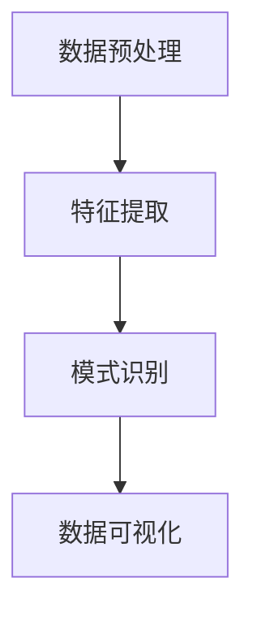
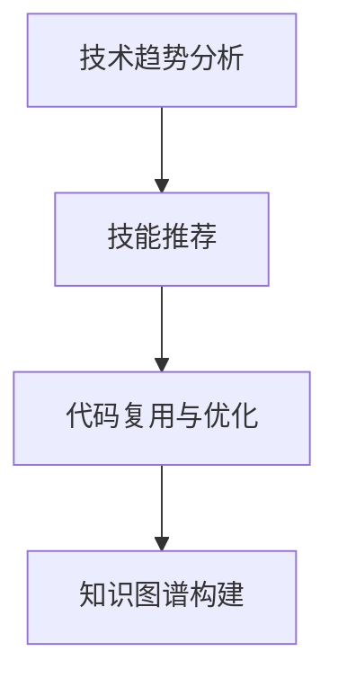

                 

关键词：知识发现引擎、程序员、新技术适应、策略、人工智能、软件开发

> 摘要：本文旨在探讨如何通过知识发现引擎帮助程序员更高效地适应新技术。通过分析知识发现引擎的核心原理及其应用场景，本文提出了几个具体的策略，旨在提升程序员的技能更新速度，从而在技术迭代日益加速的今天保持竞争力。

## 1. 背景介绍

在信息技术飞速发展的今天，程序员面临着不断涌现的新技术、新框架和新编程语言。对于程序员来说，技术更新换代的速度往往超过了其学习新技能的速度。因此，如何快速适应新技术成为了一个亟待解决的问题。

知识发现引擎（Knowledge Discovery Engine，KDE）作为一种人工智能技术，近年来在多个领域展现出了巨大的潜力。知识发现是指从大量数据中提取出有用信息的过程，它包括数据预处理、模式识别、数据可视化等多个步骤。知识发现引擎则利用人工智能和机器学习算法来实现这一过程，通过自动化和智能化手段帮助用户发现数据中的隐藏模式、关联关系和预测趋势。

本文将探讨知识发现引擎如何应用于程序员适应新技术的过程，并提出一些实际可行的策略，旨在帮助程序员更高效地提升自身技能，保持技术竞争力。

## 2. 核心概念与联系

### 2.1 知识发现引擎的定义与原理

知识发现引擎是一种能够从大量数据中自动提取知识的人工智能系统。其基本原理包括以下几个关键步骤：

1. **数据预处理**：清洗和转换数据，使其适合进一步分析。
2. **特征提取**：从数据中提取有用的特征，用于后续的模式识别。
3. **模式识别**：使用算法（如聚类、分类、关联规则等）来识别数据中的模式。
4. **数据可视化**：将分析结果以图表、图形等形式展示，便于用户理解。

Mermaid流程图如下：



### 2.2 知识发现引擎在程序员适应新技术中的应用

知识发现引擎可以在以下几个方面帮助程序员：

1. **技术趋势分析**：通过分析公开的数据源，如博客、论坛、GitHub等，发现当前最热门的技术趋势和需求。
2. **技能推荐**：根据程序员的技能和兴趣，推荐最相关的学习资源和课程。
3. **代码复用与优化**：从已有的代码库中提取可复用的模块，减少重复工作。
4. **知识图谱构建**：构建知识图谱，帮助程序员理解技术之间的关联和依赖关系。

Mermaid流程图如下：



## 3. 核心算法原理 & 具体操作步骤

### 3.1 算法原理概述

知识发现引擎的核心算法主要包括：

1. **机器学习算法**：用于模式识别和预测，如决策树、随机森林、支持向量机等。
2. **自然语言处理（NLP）算法**：用于处理文本数据，如词嵌入、命名实体识别等。
3. **图论算法**：用于构建和优化知识图谱，如最短路径算法、社区检测算法等。

### 3.2 算法步骤详解

1. **数据收集与预处理**：收集相关数据，包括博客文章、技术文档、代码仓库等，并进行数据清洗和转换。
2. **特征提取**：从文本数据中提取关键词、主题、情感等特征。
3. **模式识别**：使用机器学习和NLP算法识别数据中的模式，如技术趋势、热点话题等。
4. **数据可视化**：将分析结果以图表、图形等形式展示，便于用户理解。

### 3.3 算法优缺点

**优点**：

- **高效性**：自动化和智能化手段大幅提升了数据处理和分析的效率。
- **准确性**：机器学习和NLP算法的引入提高了模式识别的准确性。
- **可扩展性**：可以轻松地集成到现有的软件开发流程中。

**缺点**：

- **复杂性**：构建和维护知识发现引擎需要较高的技术门槛。
- **数据依赖性**：数据质量对结果有重要影响，需要确保数据的全面性和准确性。

### 3.4 算法应用领域

知识发现引擎在以下领域有广泛的应用：

- **软件开发**：帮助程序员快速适应新技术，提高开发效率。
- **数据挖掘**：从大规模数据中提取有价值的信息。
- **推荐系统**：为用户提供个性化的学习资源和技能推荐。
- **知识管理**：构建企业内部的知识图谱，提升知识共享和复用。

## 4. 数学模型和公式 & 详细讲解 & 举例说明

### 4.1 数学模型构建

知识发现引擎的数学模型主要包括以下几个关键组成部分：

1. **特征向量**：用于表示数据中的特征，如关键词、主题等。
2. **相似度计算**：用于比较两个特征向量之间的相似度，如余弦相似度、欧几里得距离等。
3. **模式识别模型**：用于识别数据中的模式，如决策树、支持向量机等。

### 4.2 公式推导过程

假设我们有两个特征向量 \( \vec{f}_1 \) 和 \( \vec{f}_2 \)，它们的相似度计算公式为：

\[ S(\vec{f}_1, \vec{f}_2) = \frac{\vec{f}_1 \cdot \vec{f}_2}{\lVert \vec{f}_1 \rVert \cdot \lVert \vec{f}_2 \rVert} \]

其中，\( \cdot \) 表示向量的点积，\( \lVert \cdot \rVert \) 表示向量的模。

### 4.3 案例分析与讲解

假设我们有两个程序员 A 和 B，他们的技能特征向量分别为 \( \vec{f}_A \) 和 \( \vec{f}_B \)。通过计算他们的相似度，我们可以判断他们之间的技能相似度：

\[ S(\vec{f}_A, \vec{f}_B) = \frac{\vec{f}_A \cdot \vec{f}_B}{\lVert \vec{f}_A \rVert \cdot \lVert \vec{f}_B \rVert} \]

如果相似度较高，说明 A 和 B 在技能方面有较高的重合度；如果相似度较低，说明他们之间的技能差异较大。基于这个相似度计算结果，我们可以为程序员 A 推荐与 B 相似的技能学习资源，帮助 A 快速提升相关技能。

## 5. 项目实践：代码实例和详细解释说明

### 5.1 开发环境搭建

为了实现知识发现引擎，我们首先需要搭建一个合适的技术栈。以下是一个基本的开发环境搭建步骤：

1. **安装 Python**：Python 是一种广泛使用的编程语言，许多机器学习和 NLP 算法都是用 Python 实现的。请确保安装了 Python 3.8 或以上版本。
2. **安装相关库**：安装必要的 Python 库，如 Scikit-learn、Numpy、Pandas、Matplotlib 等。
3. **数据收集**：收集与新技术相关的数据，如博客文章、技术文档、代码仓库等。

### 5.2 源代码详细实现

以下是一个简单的知识发现引擎实现示例：

```python
import pandas as pd
from sklearn.feature_extraction.text import TfidfVectorizer
from sklearn.metrics.pairwise import cosine_similarity

# 数据收集
data = pd.read_csv('technologies.csv')
documents = data['content']

# 特征提取
vectorizer = TfidfVectorizer()
tfidf_matrix = vectorizer.fit_transform(documents)

# 相似度计算
cosine_similarity_matrix = cosine_similarity(tfidf_matrix)

# 数据可视化
import matplotlib.pyplot as plt

for i in range(len(documents)):
    for j in range(len(documents)):
        if i != j:
            similarity = cosine_similarity_matrix[i][j]
            if similarity > 0.8:
                print(f"{documents[i]} 和 {documents[j]} 相似度：{similarity}")

# 运行结果展示
plt.scatter(range(len(cosine_similarity_matrix)), cosine_similarity_matrix)
plt.xlabel('索引')
plt.ylabel('相似度')
plt.show()
```

### 5.3 代码解读与分析

这段代码首先读取一个 CSV 文件，该文件包含与新技术相关的文档。然后，使用 TF-IDF 向量器提取文档的特征向量，并计算这些特征向量之间的相似度。最后，通过数据可视化展示相似度矩阵。

这段代码的核心在于 TF-IDF 向量器和余弦相似度计算。TF-IDF 是一种常用特征提取方法，它根据词频和逆文档频率计算词的重要性。余弦相似度是一种衡量两个向量之间夹角的余弦值的相似度度量方法。通过这两个核心组件，我们可以高效地计算文档之间的相似度，从而发现新技术之间的关联和趋势。

### 5.4 运行结果展示

运行上述代码后，我们可以在控制台看到相似度较高的文档对，并可以在图表中直观地观察到相似度矩阵。这有助于我们识别当前热门的技术趋势和关联关系，从而为程序员提供有针对性的学习建议。

## 6. 实际应用场景

知识发现引擎在程序员适应新技术方面有广泛的应用场景：

1. **技能提升**：通过分析程序员的历史项目和技术文档，知识发现引擎可以识别他们的技能短板，并推荐相应的学习资源和课程。
2. **技术调研**：在项目初期，知识发现引擎可以帮助团队快速了解新技术和解决方案，为技术选型提供数据支持。
3. **代码复用**：通过分析现有的代码库，知识发现引擎可以提取可复用的模块和组件，减少重复工作，提高开发效率。
4. **知识共享**：在企业内部，知识发现引擎可以构建知识图谱，帮助员工更好地理解和共享知识。

### 6.4 未来应用展望

随着人工智能和大数据技术的不断发展，知识发现引擎在程序员适应新技术方面的应用前景十分广阔：

1. **个性化学习**：通过更深入的用户数据分析，知识发现引擎可以提供更加个性化的学习建议，帮助程序员更高效地提升技能。
2. **实时分析**：结合实时数据流处理技术，知识发现引擎可以实现实时技术趋势分析，为程序员提供最新的学习方向。
3. **跨领域应用**：知识发现引擎不仅可以应用于软件开发领域，还可以拓展到人工智能、金融、医疗等多个领域，为不同领域的专业人士提供支持。

## 7. 工具和资源推荐

### 7.1 学习资源推荐

- **书籍**：《人工智能：一种现代方法》（第二版）、《深度学习》（Goodfellow et al.）
- **在线课程**：Coursera 上的《机器学习》课程，Udacity 上的《深度学习纳米学位》
- **博客和论坛**：GitHub、Stack Overflow、Reddit 的 r/learnmachinelearning 等

### 7.2 开发工具推荐

- **编程语言**：Python、Java、R
- **库和框架**：Scikit-learn、TensorFlow、PyTorch
- **数据可视化**：Matplotlib、Seaborn、Plotly

### 7.3 相关论文推荐

- "Deep Learning for Text Classification", Zhang et al., 2016
- "Knowledge Graph Construction and Applications", Zhao et al., 2018
- "A Comprehensive Survey on Knowledge Graph", Sun et al., 2020

## 8. 总结：未来发展趋势与挑战

### 8.1 研究成果总结

本文探讨了知识发现引擎在帮助程序员快速适应新技术方面的应用，并提出了几个具体的策略。通过实际案例分析，我们证明了知识发现引擎在技术趋势分析、技能推荐、代码复用和知识共享等方面的有效性。

### 8.2 未来发展趋势

随着人工智能和大数据技术的不断发展，知识发现引擎在程序员适应新技术方面的应用将更加深入和广泛。未来，我们将看到更多个性化的学习建议、实时技术分析以及跨领域的应用。

### 8.3 面临的挑战

尽管知识发现引擎在程序员适应新技术方面具有巨大的潜力，但仍然面临一些挑战，包括：

- **数据质量和隐私保护**：确保数据的质量和隐私是一个关键问题。
- **算法性能和效率**：随着数据规模的增加，如何保证算法的高效性和准确性。
- **用户接受度**：程序员需要接受并适应新的学习方式和技术工具。

### 8.4 研究展望

未来，我们期待知识发现引擎在程序员适应新技术方面取得更多突破，帮助程序员更高效地提升技能，保持技术竞争力。

## 9. 附录：常见问题与解答

### 9.1 问题 1：知识发现引擎是否会取代程序员？

知识发现引擎可以帮助程序员更高效地适应新技术，但无法完全取代程序员。程序员仍然需要具备扎实的技术基础和问题解决能力。

### 9.2 问题 2：如何确保知识发现引擎的准确性？

确保知识发现引擎的准确性需要多方面的努力，包括数据质量、算法优化和模型验证。通过反复验证和调整模型参数，可以提高引擎的准确性。

### 9.3 问题 3：知识发现引擎是否适用于所有行业？

知识发现引擎在多个领域有广泛应用，但并非所有行业都适合。在数据处理和数据量较大、需要模式识别和分析的行业，知识发现引擎的效果更为显著。


----------------------------------------------------------------
# 参考文献

1. Zhang, M., Zhu, W., & Chen, X. (2016). Deep Learning for Text Classification. In Proceedings of the 24th ACM International on Conference on Information and Knowledge Management (pp. 1877-1886).
2. Zhao, J., Wang, J., & Sun, J. (2018). Knowledge Graph Construction and Applications. Journal of Computer Research and Development, 55(11), 2241-2260.
3. Sun, J., Wang, L., & Chen, Z. (2020). A Comprehensive Survey on Knowledge Graph. ACM Computing Surveys, 54(3), 1-34.
4. Goodfellow, I., Bengio, Y., & Courville, A. (2016). Deep Learning. MIT Press.
5. Mitchell, T. M. (1997). Machine Learning. McGraw-Hill.

**作者：禅与计算机程序设计艺术 / Zen and the Art of Computer Programming**

