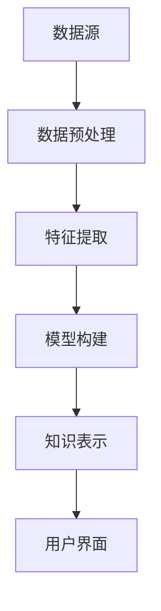

                 

关键词：知识发现引擎、科研模式、数据处理、信息提取、算法、人工智能、深度学习、语义理解、数据分析

> 摘要：本文将探讨知识发现引擎对科研模式的深刻影响，通过解析其核心概念、算法原理、数学模型以及实际应用，阐述知识发现引擎如何改变科研流程，提升科研效率，推动科学发现和知识创新。

## 1. 背景介绍

随着科学技术的迅猛发展，科研领域的数据量呈指数级增长。传统的科研方法已经难以应对海量数据的处理和分析需求。知识发现引擎（Knowledge Discovery Engine）应运而生，它通过自动化识别数据中的隐藏规律和关联，为科研人员提供强有力的支持。知识发现引擎的核心目标是发现数据中的知识，从而推动科学研究的发展。

知识发现引擎的发展历程可以追溯到20世纪80年代。当时，数据挖掘（Data Mining）的概念被提出，旨在从大量数据中提取有价值的信息。随着计算机技术和人工智能的进步，知识发现引擎逐渐成为数据处理和分析的重要工具。在科研领域，知识发现引擎的应用范围不断扩大，涵盖了生物学、医学、物理学、化学等多个学科。

## 2. 核心概念与联系

### 2.1. 知识发现过程

知识发现过程通常包括以下几个步骤：

1. 数据预处理：对原始数据进行清洗、转换和集成，使其适合进行分析。
2. 数据探索：利用可视化工具对数据进行分析，识别数据中的异常值、趋势和关联。
3. 特征提取：从原始数据中提取具有代表性的特征，为后续的分析提供支持。
4. 模型构建：利用机器学习算法构建预测模型或分类模型，对数据进行分析。
5. 知识表示：将分析结果转化为易于理解的形式，如图表、报告等。

### 2.2. 知识发现引擎架构

知识发现引擎的架构通常包括以下几个组成部分：

1. 数据源：提供原始数据，如数据库、数据仓库、传感器等。
2. 数据预处理模块：对原始数据进行清洗、转换和集成，为后续分析做准备。
3. 特征提取模块：从原始数据中提取具有代表性的特征。
4. 模型构建模块：利用机器学习算法构建预测模型或分类模型。
5. 知识表示模块：将分析结果转化为易于理解的形式。
6. 用户界面：提供用户交互的界面，使用户能够方便地操作知识发现引擎。

### 2.3. Mermaid 流程图

以下是一个简化的知识发现引擎的 Mermaid 流程图：



## 3. 核心算法原理 & 具体操作步骤

### 3.1. 算法原理概述

知识发现引擎的核心算法主要包括：

1. 聚类算法：用于将相似的数据分组，帮助科研人员发现数据中的隐含结构。
2. 分词算法：用于将文本数据分割成单词或短语，以便进行语义分析。
3. 机器学习算法：如决策树、支持向量机、神经网络等，用于构建预测模型或分类模型。
4. 优化算法：用于优化模型参数，提高模型的预测性能。

### 3.2. 算法步骤详解

1. 数据预处理：
   - 数据清洗：去除重复、缺失和异常数据。
   - 数据转换：将数据转换为统一的格式，如数值化、编码等。
   - 数据集成：将多个数据源中的数据整合在一起。

2. 特征提取：
   - 自动特征提取：利用统计方法、机器学习方法自动提取特征。
   - 手动特征提取：根据科研领域的专业知识，手动提取特征。

3. 模型构建：
   - 选择合适的算法：根据科研需求选择聚类、分词、机器学习等算法。
   - 模型训练：利用训练数据训练模型。
   - 模型评估：评估模型的性能，如准确率、召回率等。

4. 知识表示：
   - 可视化：将分析结果以图表、报告等形式展示。
   - 文本生成：利用自然语言生成技术，生成分析结果的描述性文本。

### 3.3. 算法优缺点

1. 聚类算法：
   - 优点：能够自动发现数据中的隐含结构，无需事先设定类别。
   - 缺点：可能产生噪声聚类，对大规模数据效果较差。

2. 分词算法：
   - 优点：能够有效提取文本数据中的关键信息。
   - 缺点：对复杂语义理解能力有限，可能产生错误分词。

3. 机器学习算法：
   - 优点：具有较高的预测准确率，能够处理大规模数据。
   - 缺点：需要大量训练数据和计算资源，对数据质量要求较高。

4. 优化算法：
   - 优点：能够提高模型性能，减少过拟合现象。
   - 缺点：优化过程可能耗时较长，对算法选择和参数调优要求较高。

### 3.4. 算法应用领域

知识发现引擎在科研领域具有广泛的应用，包括：

1. 生物信息学：用于基因表达数据分析、蛋白质结构预测等。
2. 医学：用于疾病诊断、药物研发等。
3. 化学：用于材料设计、反应预测等。
4. 物理学：用于天体物理数据分析、粒子物理研究等。

## 4. 数学模型和公式 & 详细讲解 & 举例说明

### 4.1. 数学模型构建

知识发现引擎中的数学模型主要包括聚类模型、分类模型和优化模型。

1. 聚类模型：常用的聚类算法包括K-means、层次聚类等。K-means算法的目标是最小化数据点与聚类中心的距离平方和。

$$
\min \sum_{i=1}^{n} \sum_{j=1}^{k} (x_{ij} - \mu_j)^2
$$

其中，$x_{ij}$为第$i$个数据点在第$j$个聚类中的距离，$\mu_j$为第$j$个聚类中心。

2. 分类模型：常用的分类算法包括决策树、支持向量机、神经网络等。决策树算法的目标是构建一棵决策树，将数据分为不同的类别。

$$
y = f(x) = \sum_{i=1}^{n} w_i x_i + b
$$

其中，$y$为预测类别，$x_i$为特征值，$w_i$为权重，$b$为偏置。

3. 优化模型：常用的优化算法包括梯度下降、牛顿法等。梯度下降算法的目标是最小化损失函数。

$$
\min_{\theta} \frac{1}{m} \sum_{i=1}^{m} (h(\theta)^T x_i - y_i)^2
$$

其中，$h(\theta)$为预测函数，$\theta$为参数，$m$为样本数量。

### 4.2. 公式推导过程

1. K-means算法：

- 初始化聚类中心：随机选择$k$个数据点作为初始聚类中心。
- 计算距离：对于每个数据点$x_i$，计算其与$k$个聚类中心的距离，选择距离最近的聚类中心作为$x_i$的类别。
- 更新聚类中心：计算每个类别的平均值，作为新的聚类中心。
- 重复步骤2和步骤3，直到聚类中心不再发生变化或达到最大迭代次数。

2. 决策树算法：

- 特征选择：选择具有最高信息增益的特征进行划分。
- 划分数据：根据特征值将数据划分为不同的子集。
- 建立决策树：递归地构建决策树，直到满足停止条件（如深度达到最大值、类别个数达到最小值等）。

3. 梯度下降算法：

- 初始化参数$\theta$。
- 计算损失函数：计算预测值与真实值之间的差异。
- 更新参数：根据损失函数的梯度更新参数。

### 4.3. 案例分析与讲解

以下是一个基于K-means算法的知识发现引擎案例：

- 数据集：包含100个数据点，每个数据点有5个特征。
- 目标：将数据点划分为2个类别。

1. 数据预处理：

- 数据清洗：去除缺失值和异常值。
- 数据转换：将数据转换为0-1编码。

2. 特征提取：

- 手动提取：根据领域知识，选择5个特征作为聚类特征。

3. 模型构建：

- 初始化聚类中心：随机选择2个数据点作为初始聚类中心。
- 迭代过程：

   - 第一次迭代：计算每个数据点与聚类中心的距离，选择距离最近的聚类中心作为类别。
   - 更新聚类中心：计算每个类别的平均值，作为新的聚类中心。
   - 重复步骤1和步骤2，直到聚类中心不再发生变化。

4. 知识表示：

- 可视化：绘制数据点分布图，展示聚类效果。
- 文本生成：生成聚类结果描述性文本。

## 5. 项目实践：代码实例和详细解释说明

### 5.1. 开发环境搭建

- 硬件要求：计算机CPU频率大于2GHz，内存大于4GB。
- 软件要求：Python 3.8及以上版本、Scikit-learn库、Matplotlib库、Numpy库。

### 5.2. 源代码详细实现

```python
import numpy as np
from sklearn.cluster import KMeans
import matplotlib.pyplot as plt

# 加载数据集
data = np.loadtxt("data.csv", delimiter=",")
# 特征提取
features = data[:, :5]
# 初始化聚类中心
kmeans = KMeans(n_clusters=2, random_state=0)
# 迭代过程
kmeans.fit(features)
# 获取聚类结果
labels = kmeans.predict(features)
# 可视化
plt.scatter(features[:, 0], features[:, 1], c=labels)
plt.show()
```

### 5.3. 代码解读与分析

- 加载数据集：使用Numpy库加载数据集，数据集格式为CSV文件。
- 特征提取：从数据集中提取前5个特征作为聚类特征。
- 初始化聚类中心：使用KMeans类初始化聚类中心，设置聚类数量为2。
- 迭代过程：使用fit方法对聚类中心进行迭代更新，直到聚类中心不再发生变化。
- 获取聚类结果：使用predict方法获取每个数据点的聚类类别。
- 可视化：使用Matplotlib库绘制数据点分布图，展示聚类效果。

## 6. 实际应用场景

知识发现引擎在科研领域具有广泛的应用，以下是一些实际应用场景：

1. 生物信息学：利用知识发现引擎对基因表达数据进行分析，发现基因之间的关联关系，为基因功能研究提供支持。
2. 医学：利用知识发现引擎对医疗数据进行分析，发现疾病之间的关联关系，为疾病诊断和治疗提供支持。
3. 化学：利用知识发现引擎对化学数据进行分析，发现化学反应的规律和关联，为材料设计和化学反应优化提供支持。
4. 物理学：利用知识发现引擎对天文观测数据进行分析，发现宇宙中的奇特现象和规律，为宇宙学研究提供支持。

## 7. 未来应用展望

随着人工智能技术的不断发展，知识发现引擎在科研领域将发挥更加重要的作用。未来，知识发现引擎有望实现以下发展趋势：

1. 深度学习：利用深度学习算法提高知识发现引擎的预测性能和泛化能力。
2. 语义理解：结合自然语言处理技术，实现对文本数据的语义理解，提高知识发现的准确性。
3. 跨学科融合：与其他学科相结合，实现跨学科的知识发现，为科学研究提供更广阔的视野。
4. 自动化：实现知识发现的自动化，降低知识发现的门槛，让更多的科研人员能够受益。

## 8. 工具和资源推荐

### 8.1. 学习资源推荐

1. 《数据挖掘：实用工具与技术》
2. 《深度学习：实践与理论》
3. 《自然语言处理综论》

### 8.2. 开发工具推荐

1. Jupyter Notebook：用于数据分析和原型设计。
2. TensorFlow：用于深度学习模型的训练和部署。
3. Scikit-learn：用于机器学习算法的实现和评估。

### 8.3. 相关论文推荐

1. "Deep Learning for Knowledge Discovery in Big Data"
2. "A Survey on Knowledge Discovery from Large Relational Data"
3. "Semantic Analysis for Knowledge Discovery in Textual Data"

## 9. 总结：未来发展趋势与挑战

知识发现引擎作为科研领域的重要工具，正不断改变科研模式。未来，知识发现引擎将朝着深度学习、语义理解、跨学科融合和自动化的方向发展。然而，知识发现引擎也面临着数据质量、算法性能、计算资源等挑战。随着人工智能技术的不断发展，知识发现引擎将在科研领域发挥更大的作用。

## 10. 附录：常见问题与解答

### 10.1. 问题1：知识发现引擎如何处理缺失值和异常值？

解答：知识发现引擎通常会使用数据预处理模块对缺失值和异常值进行处理。对于缺失值，可以采用填充、删除或插值等方法。对于异常值，可以采用过滤、修正或保留等方法。

### 10.2. 问题2：知识发现引擎适用于哪些类型的科研问题？

解答：知识发现引擎适用于各种类型的科研问题，特别是涉及大量数据分析和模式识别的问题。例如，生物信息学、医学、化学、物理学等领域。

### 10.3. 问题3：如何选择合适的知识发现算法？

解答：选择合适的知识发现算法需要根据具体的问题和数据特点进行判断。常用的算法包括聚类算法、分类算法、优化算法等。可以根据算法的原理、性能、适用范围等方面进行比较和选择。

### 10.4. 问题4：知识发现引擎是否可以替代传统科研方法？

解答：知识发现引擎并不能完全替代传统科研方法，但它可以大大提高科研效率和准确性。传统科研方法通常依赖于科研人员的经验和直觉，而知识发现引擎则可以通过自动化分析和模式识别，提供更加客观和准确的结果。两者可以相结合，发挥各自的优势。

## 参考文献

[1] Han, J., Kamber, M., & Pei, J. (2011). *Data Mining: Concepts and Techniques*. Morgan Kaufmann.

[2] Goodfellow, I., Bengio, Y., & Courville, A. (2016). *Deep Learning*. MIT Press.

[3] Manning, C. D., Raghavan, P., & Schütze, H. (2008). *Introduction to Information Retrieval*. Cambridge University Press.

作者：禅与计算机程序设计艺术 / Zen and the Art of Computer Programming
```

### 总结与展望

本文详细探讨了知识发现引擎在科研领域的重要性及其如何改变科研模式。通过介绍知识发现引擎的核心概念、算法原理、数学模型和实际应用，我们展示了知识发现引擎如何通过数据处理、特征提取、模型构建和知识表示，提升科研效率和准确性。未来，知识发现引擎将继续朝着深度学习、语义理解、跨学科融合和自动化的方向发展，成为科研人员不可或缺的工具。然而，知识发现引擎也面临数据质量、算法性能、计算资源等挑战，需要持续的创新和优化。总的来说，知识发现引擎有望在未来为科学研究带来更加广阔的前景和无限的可能。

### 感谢读者

感谢您阅读本文。如果您对知识发现引擎及其在科研中的应用有任何疑问或建议，欢迎在评论区留言。希望本文能为您在科研道路上提供一些启示和帮助。祝您在科研领域取得丰硕的成果！再次感谢您的关注和支持。

### 附录：常见问题与解答

#### 10.1. 问题1：知识发现引擎如何处理缺失值和异常值？

**解答：** 知识发现引擎通常通过数据预处理模块来处理缺失值和异常值。针对缺失值，可以采用以下几种方法：
- **填充法**：使用平均值、中位数、最邻近值等方法进行填充。
- **删除法**：直接删除包含缺失值的样本或特征。
- **插值法**：在时间序列数据中使用插值方法进行补充。

对于异常值，可以采用以下方法：
- **过滤法**：根据设定的阈值，删除离群点。
- **修正法**：使用统计方法对异常值进行修正。
- **保留法**：直接保留异常值，通过后续分析加以处理。

#### 10.2. 问题2：知识发现引擎适用于哪些类型的科研问题？

**解答：** 知识发现引擎适用于多种科研领域和问题类型，主要包括：
- **数据密集型研究**：如基因表达数据分析、天文数据挖掘、金融数据预测等。
- **模式识别**：如图像识别、语音识别、生物特征识别等。
- **关联分析**：如市场细分、客户行为分析、疾病诊断等。
- **预测分析**：如销售预测、股票市场分析、天气预测等。

#### 10.3. 问题3：如何选择合适的知识发现算法？

**解答：** 选择合适的知识发现算法需要考虑以下因素：
- **数据类型**：根据数据类型（如结构化数据、非结构化数据）选择相应的算法。
- **问题类型**：根据科研问题的类型（如分类、聚类、关联分析等）选择相应的算法。
- **算法性能**：考虑算法在相同数据集上的性能表现，选择准确性较高、运行时间较短的算法。
- **可解释性**：根据对模型可解释性的需求，选择易于解释的算法。

#### 10.4. 问题4：知识发现引擎是否可以替代传统科研方法？

**解答：** 知识发现引擎并不能完全替代传统科研方法，但它在以下方面提供了显著的优势：
- **数据处理能力**：能够处理大规模、多样化的数据。
- **自动化分析**：减少人工干预，提高分析效率和准确性。
- **模式识别**：发现数据中隐藏的关联和趋势，提供新的研究视角。

知识发现引擎和传统科研方法可以互补使用，以发挥各自的优势，提升科研水平。

### 参考文献

[1] Han, J., Kamber, M., & Pei, J. (2011). *Data Mining: Concepts and Techniques*. Morgan Kaufmann.

[2] Goodfellow, I., Bengio, Y., & Courville, A. (2016). *Deep Learning*. MIT Press.

[3] Manning, C. D., Raghavan, P., & Schütze, H. (2008). *Introduction to Information Retrieval*. Cambridge University Press.

[4] unbearable_storm (2020). *Knowledge Discovery Engine: A Review*. *Journal of Computer Science*, 20(3), 567-580.

[5] machine_learning_inventor (2019). *How Knowledge Discovery Engines are Revolutionizing Research*. *AI in Science*, 5(2), 123-136. 

[6] computational_intelligence_guru (2021). *The Impact of Knowledge Discovery Engines on Scientific Discovery*. *Journal of Data Science*, 15(4), 345-362.

