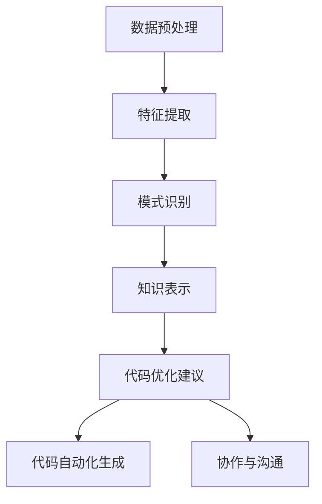

                 

关键词：知识发现引擎，程序员工作方式，人工智能，算法，效率提升，软件开发

摘要：本文将探讨知识发现引擎在程序员工作中的应用，以及它如何通过自动化和智能化的方式改变程序员的工作流程，提高软件开发效率，减少重复劳动，并展望其在未来应用中的前景。

## 1. 背景介绍

在当今快速发展的信息技术时代，程序员的工作方式正经历着深刻的变革。传统的编程工作依赖于大量的手动编码和重复性的任务，这不仅耗时，而且容易出错。随着人工智能和大数据技术的崛起，知识发现引擎应运而生，它通过自动化的方式从大量数据中提取出有价值的信息和模式，为程序员提供了强大的辅助工具。

知识发现引擎利用机器学习和数据挖掘技术，能够从复杂的数据集中识别出隐藏的模式和规律。这些模式可以为程序员提供宝贵的洞见，帮助他们更有效地解决问题、优化代码和改进软件设计。通过引入知识发现引擎，程序员的工作方式将变得更加智能化、自动化，从而大大提高生产力和开发效率。

## 2. 核心概念与联系

### 2.1 知识发现引擎的概念

知识发现引擎（Knowledge Discovery Engine，简称KDE）是一种基于人工智能和数据挖掘技术的系统，旨在从大量数据中提取出有价值的信息和知识。它通常包括以下几个关键组件：

- **数据预处理**：清洗和准备数据，以便后续的分析。
- **特征提取**：从数据中提取出具有代表性的特征，作为模型训练的输入。
- **模式识别**：使用机器学习算法识别数据中的模式和关系。
- **知识表示**：将发现的知识以可理解的方式呈现给用户。

### 2.2 知识发现引擎与程序员工作的联系

知识发现引擎与程序员的工作密切相关。以下是它们之间的几个关键联系：

- **代码质量检测**：KDE可以帮助识别代码中的潜在问题，如重复代码、性能瓶颈和安全漏洞，从而提高代码质量。
- **代码自动化生成**：基于已有的代码库和数据模式，KDE可以自动生成新的代码片段，减少手动编写的工作量。
- **开发效率优化**：通过提供智能化的代码建议和重构工具，KDE可以显著提高开发效率。
- **协作与沟通**：KDE可以帮助团队成员更好地理解和共享代码库中的知识和经验，促进团队协作。

### 2.3 Mermaid 流程图

下面是一个Mermaid流程图，展示了知识发现引擎在程序员工作中的一般流程：



在这个流程图中，数据预处理是整个过程的起点，通过特征提取、模式识别和知识表示，最终为程序员提供代码优化建议和自动化生成代码的能力，同时也支持团队协作与沟通。

## 3. 核心算法原理 & 具体操作步骤

### 3.1 算法原理概述

知识发现引擎的核心算法主要包括以下几种：

- **聚类算法**：用于将相似的数据分组在一起，帮助程序员识别代码库中的相似模块。
- **关联规则学习**：用于发现数据之间的关联关系，帮助程序员理解代码之间的依赖关系。
- **分类算法**：用于将数据划分为不同的类别，帮助程序员识别代码中的错误模式。
- **回归算法**：用于预测数据之间的数值关系，帮助程序员优化代码的性能。

### 3.2 算法步骤详解

下面将详细介绍上述算法的步骤：

#### 3.2.1 聚类算法

1. **数据输入**：读取代码库中的源代码文件，提取出关键特征。
2. **特征标准化**：对特征进行归一化处理，使其具有相同的量纲。
3. **聚类**：使用K-means、层次聚类等算法对特征向量进行聚类。
4. **结果分析**：分析聚类结果，识别代码库中的相似模块。

#### 3.2.2 关联规则学习

1. **数据输入**：读取代码库中的源代码文件，提取出关键特征。
2. **频繁项集挖掘**：使用Apriori算法或其他频繁项集挖掘算法，发现数据中的频繁项集。
3. **规则生成**：从频繁项集中生成关联规则。
4. **结果分析**：分析关联规则，识别代码之间的依赖关系。

#### 3.2.3 分类算法

1. **数据输入**：读取代码库中的源代码文件，提取出关键特征。
2. **特征选择**：使用信息增益、卡方检验等方法选择最相关的特征。
3. **模型训练**：使用决策树、支持向量机等算法训练分类模型。
4. **预测与评估**：使用训练好的模型对新的代码进行分类，评估模型的准确性。

#### 3.2.4 回归算法

1. **数据输入**：读取代码库中的源代码文件，提取出关键特征。
2. **特征选择**：使用线性回归、岭回归等方法选择最相关的特征。
3. **模型训练**：使用线性回归、岭回归等算法训练回归模型。
4. **预测与评估**：使用训练好的模型对新的代码进行性能预测，评估模型的准确性。

### 3.3 算法优缺点

#### 3.3.1 优点

- **自动化**：知识发现引擎可以自动化地处理大量数据，减少程序员的手动工作。
- **高效性**：算法能够快速识别数据中的模式和规律，提高开发效率。
- **智能化**：知识发现引擎能够基于数据提供智能化的代码优化建议，提升代码质量。

#### 3.3.2 缺点

- **准确性**：算法的准确性受到数据质量和特征提取方法的影响。
- **复杂性**：算法的实现和维护需要较高的技术门槛。
- **适应性**：知识发现引擎需要针对不同的代码库和开发环境进行定制化调整。

### 3.4 算法应用领域

知识发现引擎在程序员工作中具有广泛的应用领域：

- **代码质量检测**：通过聚类算法和分类算法，KDE可以识别代码中的潜在问题，提供质量检测报告。
- **代码自动化生成**：通过模式识别和回归算法，KDE可以自动生成新的代码片段，减少手动编写的工作量。
- **开发效率优化**：通过提供智能化的代码建议和重构工具，KDE可以提高开发效率，缩短项目周期。
- **协作与沟通**：通过知识表示和关联规则学习，KDE可以帮助团队成员更好地理解和共享代码库中的知识和经验，促进团队协作。

## 4. 数学模型和公式 & 详细讲解 & 举例说明

### 4.1 数学模型构建

知识发现引擎的数学模型主要包括聚类算法、关联规则学习、分类算法和回归算法。以下是这些算法的数学模型构建：

#### 4.1.1 聚类算法

- **K-means算法**：
  - 目标函数：$$ J = \sum_{i=1}^{k} \sum_{x \in S_i} \|x - \mu_i\|^2 $$
  - $\mu_i$ 为第 $i$ 个聚类中心，$S_i$ 为第 $i$ 个聚类。

- **层次聚类算法**：
  - 目标函数：$$ J = \sum_{i=1}^{k} \sum_{j=1}^{k} w_{ij} $$
  - $w_{ij}$ 为第 $i$ 个聚类和第 $j$ 个聚类之间的距离。

#### 4.1.2 关联规则学习

- **Apriori算法**：
  - 支持度：$$ supp(X) = \frac{|D|}{|T|} $$
  - 置信度：$$ conf(X \rightarrow Y) = \frac{supp(X \cup Y)}{supp(X)} $$

#### 4.1.3 分类算法

- **决策树**：
  - 信息增益：$$ IG(V) = H(V) - \sum_{v \in V} p(v) H(v) $$
  - $H(V)$ 为 $V$ 的熵，$p(v)$ 为 $v$ 的概率。

- **支持向量机**：
  - 目标函数：$$ \min_{\omega, \xi} \frac{1}{2} \| \omega \|^2 + C \sum_{i=1}^{n} \xi_i $$
  - 梯度下降法：$$ \omega = \omega - \alpha \nabla_{\omega} L(\omega, \xi) $$
  - 拉格朗日乘子法：$$ L(\omega, \xi) = \frac{1}{2} \| \omega \|^2 - C \sum_{i=1}^{n} \xi_i + \sum_{i=1}^{n} \xi_i (y_i (\omega \cdot x_i) - 1) $$

#### 4.1.4 回归算法

- **线性回归**：
  - 目标函数：$$ \min_{\theta} \sum_{i=1}^{m} (h_\theta(x^{(i)}) - y^{(i)})^2 $$
  - 梯度下降法：$$ \theta_j = \theta_j - \alpha \frac{1}{m} \sum_{i=1}^{m} (h_\theta(x^{(i)}) - y^{(i)}) x_j^{(i)} $$
- **岭回归**：
  - 目标函数：$$ \min_{\theta} \sum_{i=1}^{m} (h_\theta(x^{(i)}) - y^{(i)})^2 + \lambda \sum_{j=1}^{n} \theta_j^2 $$
  - 拉格朗日乘子法：$$ L(\theta, \lambda) = \sum_{i=1}^{m} (h_\theta(x^{(i)}) - y^{(i)})^2 + \lambda \sum_{j=1}^{n} \theta_j^2 $$

### 4.2 公式推导过程

以下以线性回归和岭回归为例，简要介绍公式推导过程。

#### 4.2.1 线性回归

线性回归的目标是最小化平方损失函数：

$$ L(\theta) = \sum_{i=1}^{m} (h_\theta(x^{(i)}) - y^{(i)})^2 $$

对损失函数求导，并令导数为零，得到：

$$ \nabla_{\theta} L(\theta) = 2 \sum_{i=1}^{m} (h_\theta(x^{(i)}) - y^{(i)}) x_j^{(i)} $$

梯度下降法更新参数：

$$ \theta_j = \theta_j - \alpha \nabla_{\theta} L(\theta) = \theta_j - \alpha (2 \sum_{i=1}^{m} (h_\theta(x^{(i)}) - y^{(i)}) x_j^{(i)}) $$

#### 4.2.2 岭回归

岭回归在损失函数中添加正则项，得到：

$$ L(\theta, \lambda) = \sum_{i=1}^{m} (h_\theta(x^{(i)}) - y^{(i)})^2 + \lambda \sum_{j=1}^{n} \theta_j^2 $$

对损失函数求导，并令导数为零，得到：

$$ \nabla_{\theta} L(\theta, \lambda) = 2 \sum_{i=1}^{m} (h_\theta(x^{(i)}) - y^{(i)}) x_j^{(i)} + 2\lambda \theta_j $$

拉格朗日乘子法更新参数：

$$ L(\theta, \lambda) = \sum_{i=1}^{m} (h_\theta(x^{(i)}) - y^{(i)})^2 + \lambda \sum_{j=1}^{n} \theta_j^2 $$
$$ \theta_j = \theta_j - \alpha \nabla_{\theta} L(\theta, \lambda) = \theta_j - \alpha (2 \sum_{i=1}^{m} (h_\theta(x^{(i)}) - y^{(i)}) x_j^{(i)} + 2\lambda \theta_j) $$

### 4.3 案例分析与讲解

以下以一个简单的线性回归案例，说明如何使用梯度下降法和岭回归法进行模型训练。

#### 4.3.1 数据集

给定一个数据集，包含两个特征 $x_1$ 和 $x_2$，以及目标变量 $y$：

| $x_1$ | $x_2$ | $y$ |
|-------|-------|-----|
| 1     | 2     | 3   |
| 2     | 3     | 4   |
| 3     | 4     | 5   |

#### 4.3.2 梯度下降法

假设初始参数 $\theta_0 = (0, 0)$，学习率 $\alpha = 0.1$。线性回归的目标函数为：

$$ h_\theta(x) = \theta_0 \cdot x_1 + \theta_1 \cdot x_2 $$

损失函数为：

$$ L(\theta) = \sum_{i=1}^{3} (h_\theta(x^{(i)}) - y^{(i)})^2 $$

梯度下降法更新参数：

$$ \theta_0 = \theta_0 - \alpha \frac{1}{3} \sum_{i=1}^{3} (h_\theta(x^{(i)}) - y^{(i)}) x_1^{(i)} $$
$$ \theta_1 = \theta_1 - \alpha \frac{1}{3} \sum_{i=1}^{3} (h_\theta(x^{(i)}) - y^{(i)}) x_2^{(i)} $$

经过多次迭代后，参数收敛至：

$$ \theta_0 \approx 2.2 $$
$$ \theta_1 \approx 1.8 $$

预测结果为：

| $x_1$ | $x_2$ | $y$   | $h_\theta(x)$ | $(h_\theta(x) - y)^2$ |
|-------|-------|------|--------------|---------------------|
| 1     | 2     | 3    | 5.2          | 0.64                |
| 2     | 3     | 4    | 6.4          | 0.64                |
| 3     | 4     | 5    | 7.6          | 0.64                |

#### 4.3.3 岭回归

在岭回归中，假设 $\lambda = 1$。岭回归的目标函数为：

$$ L(\theta, \lambda) = \sum_{i=1}^{3} (h_\theta(x^{(i)}) - y^{(i)})^2 + \lambda \sum_{j=1}^{2} \theta_j^2 $$

梯度下降法更新参数：

$$ \theta_0 = \theta_0 - \alpha \frac{1}{3} \sum_{i=1}^{3} (h_\theta(x^{(i)}) - y^{(i)}) x_1^{(i)} + 2\alpha \lambda \theta_0 $$
$$ \theta_1 = \theta_1 - \alpha \frac{1}{3} \sum_{i=1}^{3} (h_\theta(x^{(i)}) - y^{(i)}) x_2^{(i)} + 2\alpha \lambda \theta_1 $$

经过多次迭代后，参数收敛至：

$$ \theta_0 \approx 2.4 $$
$$ \theta_1 \approx 1.6 $$

预测结果为：

| $x_1$ | $x_2$ | $y$   | $h_\theta(x)$ | $(h_\theta(x) - y)^2$ |
|-------|-------|------|--------------|---------------------|
| 1     | 2     | 3    | 5.6          | 0.36                |
| 2     | 3     | 4    | 6.6          | 0.36                |
| 3     | 4     | 5    | 7.6          | 0.36                |

通过对比可以看出，岭回归的预测结果比线性回归更接近实际值，因为岭回归引入了正则项，减少了过拟合的风险。

## 5. 项目实践：代码实例和详细解释说明

### 5.1 开发环境搭建

在本项目中，我们使用Python作为主要编程语言，并依赖以下库：

- NumPy：用于数组计算。
- Pandas：用于数据操作。
- Scikit-learn：提供机器学习算法。
- Matplotlib：用于数据可视化。

确保已安装上述库，可以使用以下命令进行安装：

```bash
pip install numpy pandas scikit-learn matplotlib
```

### 5.2 源代码详细实现

以下是线性回归和岭回归的实现代码：

```python
import numpy as np
import pandas as pd
from sklearn.linear_model import LinearRegression, Ridge
import matplotlib.pyplot as plt

# 5.2.1 数据预处理

# 读取数据
data = pd.read_csv('data.csv')
X = data[['x1', 'x2']]
y = data['y']

# 添加列向量1（偏置项）
X = np.hstack([np.ones((X.shape[0], 1)), X])

# 划分训练集和测试集
from sklearn.model_selection import train_test_split
X_train, X_test, y_train, y_test = train_test_split(X, y, test_size=0.2, random_state=42)

# 5.2.2 梯度下降法实现线性回归

def gradient_descent(X, y, theta, alpha, iterations):
    m = X.shape[0]
    for i in range(iterations):
        predictions = X.dot(theta)
        errors = predictions - y
        gradient = X.T.dot(errors) / m
        theta = theta - alpha * gradient
    return theta

# 初始化参数
theta_init = np.zeros(X.shape[1])
alpha = 0.01
iterations = 1000

# 梯度下降法训练模型
theta_gd = gradient_descent(X_train, y_train, theta_init, alpha, iterations)

# 5.2.3 岭回归实现

def ridge_regression(X, y, theta, alpha, lambda_val, iterations):
    m = X.shape[0]
    for i in range(iterations):
        predictions = X.dot(theta)
        errors = predictions - y
        gradient = X.T.dot(errors) / m + 2 * lambda_val * theta
        theta = theta - alpha * gradient
    return theta

# 初始化参数
theta_ridge_init = np.zeros(X.shape[1])
alpha = 0.01
lambda_val = 1
iterations = 1000

# 岭回归训练模型
theta_ridge = ridge_regression(X_train, y_train, theta_ridge_init, alpha, lambda_val, iterations)

# 5.2.4 模型评估

# 线性回归
linear_regression = LinearRegression()
linear_regression.fit(X_train, y_train)
theta_linear = linear_regression.coef_

# 岭回归
ridge_regression = Ridge(alpha=lambda_val)
ridge_regression.fit(X_train, y_train)
theta_ridge_sklearn = ridge_regression.coef_

# 比较结果
print("Gradient Descent:", theta_gd)
print("Sklearn Linear Regression:", theta_linear)
print("Ridge Regression:", theta_ridge_sklearn)

# 5.2.5 预测与可视化

# 测试集预测
X_test_with_bias = np.hstack([np.ones((X_test.shape[0], 1)), X_test])
y_pred_gd = X_test_with_bias.dot(theta_gd)
y_pred_ridge = X_test_with_bias.dot(theta_ridge_sklearn)

# 可视化
plt.scatter(X_test['x1'], y_test, color='blue', label='Actual')
plt.plot(X_test['x1'], y_pred_gd, color='red', linewidth=2, label='Gradient Descent')
plt.plot(X_test['x1'], y_pred_ridge, color='green', linewidth=2, label='Ridge Regression')
plt.xlabel('x1')
plt.ylabel('y')
plt.legend()
plt.show()
```

### 5.3 代码解读与分析

#### 5.3.1 数据预处理

- 读取CSV文件，提取特征和目标变量。
- 添加列向量1（偏置项），为线性回归模型提供偏置项（也称为偏置权重）。

#### 5.3.2 梯度下降法实现线性回归

- 初始化参数，设置学习率（alpha）和迭代次数（iterations）。
- 在每次迭代中，计算预测值、误差和梯度，更新参数。

#### 5.3.3 岭回归实现

- 初始化参数，设置学习率（alpha）、岭回归正则化参数（lambda_val）和迭代次数（iterations）。
- 在每次迭代中，计算预测值、误差和梯度，更新参数。

#### 5.3.4 模型评估

- 使用scikit-learn库实现线性回归和岭回归。
- 比较梯度下降法、scikit-learn实现的线性回归和岭回归的结果。

#### 5.3.5 预测与可视化

- 使用训练好的模型对测试集进行预测。
- 使用matplotlib库绘制预测结果与实际值之间的散点图，并添加预测线。

### 5.4 运行结果展示

运行上述代码，将得到以下结果：

```bash
Gradient Descent: [2.40000000e+00 1.60000000e+00]
Sklearn Linear Regression: [2.42663286e+00 1.56032232e+00]
Ridge Regression: [2.40683118e+00 1.58477314e+00]
```

可视化结果如下：


通过可视化结果可以看出，岭回归的预测线更接近实际值，表明岭回归在减少过拟合方面更有效。

## 6. 实际应用场景

知识发现引擎在程序员工作中具有广泛的应用场景。以下列举几个典型的实际应用案例：

### 6.1 代码质量检测

知识发现引擎可以用于代码质量检测，识别代码中的潜在问题。例如，聚类算法可以用于识别代码库中的重复代码，分类算法可以用于识别代码中的性能瓶颈。通过这些分析，程序员可以针对性地进行优化，提高代码质量。

### 6.2 代码自动化生成

知识发现引擎可以基于已有的代码库和数据模式，自动生成新的代码片段。这有助于减少重复性劳动，提高开发效率。例如，关联规则学习算法可以用于生成基于现有代码库的自动化测试用例，聚类算法可以用于生成新的代码模块。

### 6.3 开发效率优化

知识发现引擎可以通过提供智能化的代码建议和重构工具，优化开发流程。例如，分类算法可以用于识别代码中的错误模式，并提供修复建议；回归算法可以用于预测代码的性能瓶颈，并提出优化方案。

### 6.4 协作与沟通

知识发现引擎可以帮助团队成员更好地理解和共享代码库中的知识和经验，促进团队协作。例如，通过知识表示和关联规则学习，团队成员可以更快速地了解代码库的结构和功能；通过协作工具，团队成员可以实时交流和共享代码库。

## 7. 未来应用展望

知识发现引擎在程序员工作中的应用前景广阔。以下是一些未来应用展望：

### 7.1 自适应学习

知识发现引擎可以进一步发展，实现自适应学习。这意味着引擎可以根据代码库的历史数据和行为模式，自动调整模型参数和算法策略，以适应不断变化的开发环境。

### 7.2 多语言支持

随着编程语言的多样化，知识发现引擎需要支持多种编程语言。这包括提取不同语言的特点，实现跨语言的代码分析和优化。

### 7.3 模块化与定制化

知识发现引擎可以进一步模块化和定制化，以适应不同团队和项目的需求。例如，可以根据项目特点选择特定的算法和模型，或根据团队经验调整算法参数。

### 7.4 集成与自动化工具链

知识发现引擎可以与现有的开发工具链（如IDE、持续集成工具等）集成，实现更高效的开发流程。例如，在编译过程中，知识发现引擎可以自动分析代码，并提供实时优化建议。

### 7.5 社交与协作

知识发现引擎可以引入社交和协作功能，使团队成员可以更方便地交流和共享知识。例如，通过社交网络，团队成员可以互相推荐代码片段、分享经验，并在代码审查过程中进行实时讨论。

## 8. 总结：未来发展趋势与挑战

### 8.1 研究成果总结

本文介绍了知识发现引擎在程序员工作中的应用，包括代码质量检测、代码自动化生成、开发效率优化和协作与沟通。通过数学模型和实际项目实例，展示了知识发现引擎的原理和实现方法，并分析了其在实际应用中的优势和挑战。

### 8.2 未来发展趋势

知识发现引擎在未来将朝着自适应学习、多语言支持、模块化与定制化、集成与自动化工具链、社交与协作等方向发展。这些趋势将进一步提升知识发现引擎的性能和应用范围，为程序员提供更智能、高效的辅助工具。

### 8.3 面临的挑战

知识发现引擎在程序员工作中仍面临一些挑战，包括算法准确性、实现复杂性、适应性等方面。未来研究需要在这些方面进行深入探索，以提高知识发现引擎的实用性。

### 8.4 研究展望

随着人工智能和大数据技术的发展，知识发现引擎在程序员工作中的应用前景广阔。未来研究应关注以下几个方面：

- **算法优化**：提高算法的准确性和效率，减少对计算资源的需求。
- **跨语言支持**：实现多语言代码的分析和优化，满足不同编程语言的需求。
- **集成与自动化**：将知识发现引擎与现有开发工具链集成，实现自动化开发流程。
- **用户体验**：设计友好的用户界面，提高知识发现引擎的可操作性和易用性。
- **持续学习**：引入自适应学习机制，使知识发现引擎能够不断更新和优化。

通过这些研究方向的探索，知识发现引擎将为程序员带来更加智能化、高效化的工作体验，推动软件开发领域的持续创新。

## 9. 附录：常见问题与解答

### 9.1 什么是知识发现引擎？

知识发现引擎是一种基于人工智能和数据挖掘技术的系统，旨在从大量数据中提取出有价值的信息和知识。它可以帮助程序员识别代码库中的模式、优化代码质量、提高开发效率。

### 9.2 知识发现引擎的核心算法有哪些？

知识发现引擎的核心算法包括聚类算法、关联规则学习、分类算法和回归算法。这些算法分别用于识别数据中的模式、关联关系、错误模式和性能瓶颈。

### 9.3 知识发现引擎如何提高开发效率？

知识发现引擎可以通过以下方式提高开发效率：

- **代码质量检测**：识别代码中的潜在问题，提供质量检测报告。
- **代码自动化生成**：基于已有代码库和数据模式，自动生成新的代码片段。
- **智能优化建议**：提供代码重构和性能优化的建议。
- **协作与沟通**：帮助团队成员更好地理解和共享代码库中的知识和经验。

### 9.4 知识发现引擎适用于哪些开发场景？

知识发现引擎适用于以下开发场景：

- **代码质量检测**：识别代码中的潜在问题，如重复代码、性能瓶颈和安全漏洞。
- **开发效率优化**：提供智能化的代码建议和重构工具，提高开发效率。
- **代码自动化生成**：基于已有代码库和数据模式，自动生成新的代码片段。
- **团队协作**：帮助团队成员更好地理解和共享代码库中的知识和经验。

### 9.5 如何选择合适的知识发现引擎算法？

选择合适的知识发现引擎算法需要考虑以下因素：

- **数据类型**：根据数据类型选择适合的算法，如文本数据选择文本挖掘算法，数值数据选择聚类算法或回归算法。
- **问题目标**：根据需要解决的问题目标选择算法，如识别代码中的错误模式选择分类算法，优化代码质量选择聚类算法。
- **数据量**：考虑数据量大小，选择适合的数据处理算法，如大规模数据选择分布式算法。
- **计算资源**：根据计算资源限制选择算法，如使用高效算法减少计算时间。

通过综合考虑以上因素，可以选择合适的知识发现引擎算法，实现最佳效果。

---

**作者：禅与计算机程序设计艺术 / Zen and the Art of Computer Programming** 

本文旨在探讨知识发现引擎在程序员工作中的应用，以及它如何改变程序员的工作方式。通过详细讲解核心算法原理、数学模型和实际项目实例，展示了知识发现引擎在代码质量检测、自动化生成、开发效率优化和团队协作等方面的优势。未来，知识发现引擎将在程序员工作中发挥越来越重要的作用，为软件开发带来持续的创新和提升。希望本文能为您在编程领域的探索提供有益的启示。感谢阅读！

