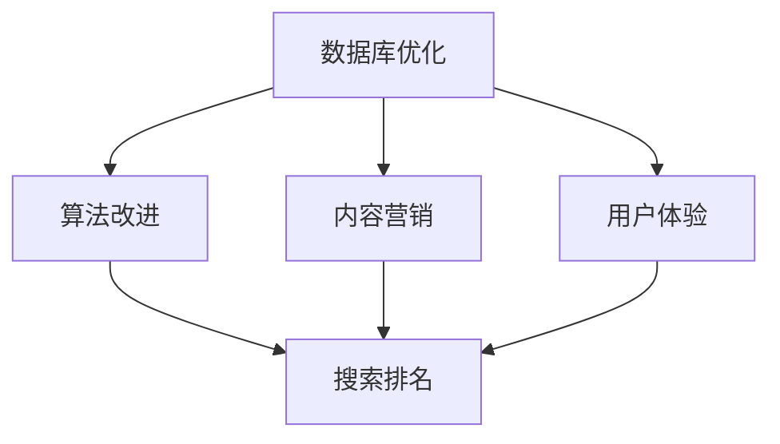

                 

知识发现引擎作为人工智能领域的关键技术之一，正日益成为企业和组织获取洞察、改进决策和提升竞争力的重要工具。随着知识发现引擎的应用场景不断扩展，其优化策略的研究变得尤为重要。特别是搜索引擎优化（SEO）策略，它不仅能够提高知识发现引擎的查询响应速度，还能提升其在搜索引擎中的排名，从而吸引更多的用户访问。本文将深入探讨知识发现引擎的SEO优化策略，旨在为相关从业人员提供实用的指导。

## 关键词

- 知识发现引擎
- 搜索引擎优化（SEO）
- 数据库优化
- 算法改进
- 内容营销

## 摘要

本文首先介绍了知识发现引擎的基本概念和SEO在其中的重要性。接着，详细阐述了知识发现引擎SEO优化策略的几个关键方面，包括数据库优化、算法改进、内容营销和用户体验提升。最后，文章讨论了SEO优化的未来趋势和面临的挑战，并对相关工具和资源进行了推荐。

## 1. 背景介绍

知识发现引擎是一种利用先进算法和大数据技术从海量数据中自动识别、提取和展示有价值信息的人工智能工具。它的核心功能包括模式识别、关联规则挖掘、聚类分析和分类预测等。在商业应用中，知识发现引擎可以帮助企业实现客户需求分析、市场趋势预测、风险管理和运营优化等。

搜索引擎优化（SEO）是一种通过改进网站结构、内容和外部链接等方式，提高网站在搜索引擎结果页面（SERP）排名的方法。SEO的核心目标是吸引更多的有意向的用户访问网站，从而提高网站流量和转化率。对于知识发现引擎来说，SEO优化同样至关重要，因为只有提高其在搜索引擎中的可见性，才能吸引更多的用户使用和了解其功能。

## 2. 核心概念与联系

知识发现引擎的SEO优化策略涉及多个核心概念，包括数据库优化、算法改进、内容营销和用户体验等。以下是一个简化的Mermaid流程图，展示了这些概念之间的联系。



### 2.1 数据库优化

数据库优化是知识发现引擎SEO优化的基础。优化的目标包括提高查询响应速度、降低数据存储成本和确保数据的一致性和完整性。具体措施包括：

- 数据库索引：通过创建合适的索引，可以显著提高查询效率。
- 数据分区：将大数据集划分为多个小数据集，可以减少查询的时间和资源消耗。
- 数据压缩：使用压缩技术减少数据存储空间，提高系统性能。

### 2.2 算法改进

算法改进是提升知识发现引擎性能的关键。优化的目标包括提高算法的准确性和效率，以及减少计算资源的需求。具体措施包括：

- 算法优化：通过改进算法设计和实现，降低计算复杂度。
- 算法选择：选择适合特定应用场景的算法，提高查询响应速度。
- 算法融合：将多个算法融合在一起，实现优势互补，提高整体性能。

### 2.3 内容营销

内容营销是提高知识发现引擎在搜索引擎中排名的重要手段。优化的目标包括提高内容的质量、相关性和用户体验。具体措施包括：

- 高质量内容创作：创建有价值、独特和高质量的内容，吸引用户访问。
- 关键词优化：合理选择和布局关键词，提高搜索引擎对内容的识别度。
- 外部链接建设：通过建立高质量的链接，提高知识发现引擎在搜索引擎中的权威性。

### 2.4 用户体验

用户体验是影响知识发现引擎SEO优化的重要因素。优化的目标包括提高用户满意度、降低跳出率和提高用户留存率。具体措施包括：

- 界面设计：设计简洁、直观和易于操作的界面，提高用户满意度。
- 个性化推荐：根据用户行为和偏好，提供个性化的内容推荐，提高用户留存率。
- 性能优化：提高系统性能，减少加载时间和响应时间，降低用户跳出率。

## 3. 核心算法原理 & 具体操作步骤

### 3.1 算法原理概述

知识发现引擎的核心算法包括模式识别、关联规则挖掘、聚类分析和分类预测等。这些算法的基本原理如下：

- 模式识别：通过分析数据特征，识别出有意义的模式或趋势。
- 关联规则挖掘：发现数据中存在的关系或规则，如“购买A商品的用户往往也会购买B商品”。
- 聚类分析：将相似的数据点划分到同一组中，形成聚类。
- 分类预测：根据已有的数据，预测新数据的类别。

### 3.2 算法步骤详解

以关联规则挖掘为例，其基本步骤如下：

1. **数据预处理**：清洗和预处理原始数据，包括去除噪声、缺失值填充和数据转换等。
2. **支持度和置信度计算**：计算每个关联规则的支持度和置信度。
3. **规则生成**：根据支持度和置信度阈值，生成符合条件的关联规则。
4. **规则排序和筛选**：对生成的规则进行排序和筛选，去除无意义的规则。
5. **结果可视化**：将挖掘结果可视化，以便用户理解和分析。

### 3.3 算法优缺点

每种算法都有其优缺点。以下是对几种常见算法的优缺点的简要分析：

- **模式识别**：优点包括能发现复杂模式、处理高维数据等；缺点包括对噪声敏感、计算复杂度高。
- **关联规则挖掘**：优点包括能发现数据中的隐藏关系、应用广泛等；缺点包括可能生成大量无意义规则、计算复杂度高。
- **聚类分析**：优点包括能自动发现数据结构、无需预先定义类别等；缺点包括对噪声敏感、结果可能依赖于参数选择。
- **分类预测**：优点包括能准确预测新数据类别、适用于大规模数据等；缺点包括对训练数据依赖大、可能过拟合。

### 3.4 算法应用领域

知识发现引擎的应用领域非常广泛，包括但不限于：

- 商业智能：帮助企业分析市场趋势、客户行为和运营状况。
- 金融风控：发现潜在风险、预测信用风险等。
- 医疗健康：分析患者数据、发现疾病趋势等。
- 娱乐媒体：推荐电影、音乐和文章等。

## 4. 数学模型和公式 & 详细讲解 & 举例说明

知识发现引擎的SEO优化策略中涉及多个数学模型和公式，以下是几个关键模型的详细讲解和举例说明。

### 4.1 数学模型构建

假设我们有一个知识发现引擎，其SEO优化目标是提高在搜索引擎中的排名。我们可以构建以下数学模型：

- **目标函数**：最大化搜索引擎排名
- **约束条件**：满足搜索引擎算法的要求

具体来说，我们可以定义以下目标函数：

$$
\text{maximize } R = \sum_{i=1}^{n} w_i \cdot r_i
$$

其中，$R$ 是搜索引擎排名，$w_i$ 是第 $i$ 个关键词的权重，$r_i$ 是第 $i$ 个关键词的排名。

约束条件可以是：

$$
\sum_{i=1}^{n} w_i = 1 \\
w_i \geq 0
$$

### 4.2 公式推导过程

为了推导目标函数，我们需要考虑搜索引擎的排名算法。假设搜索引擎的排名算法是基于关键词的权重和搜索量。我们可以定义以下公式：

- **关键词权重**：$w_i = \frac{\text{搜索量}_i}{\sum_{j=1}^{n} \text{搜索量}_j}$
- **关键词排名**：$r_i = \frac{\text{权重}_i}{\sum_{j=1}^{n} \text{权重}_j}$

将关键词权重和排名代入目标函数，得到：

$$
R = \sum_{i=1}^{n} \left(\frac{\text{搜索量}_i}{\sum_{j=1}^{n} \text{搜索量}_j}\right) \cdot \left(\frac{\text{权重}_i}{\sum_{j=1}^{n} \text{权重}_j}\right)
$$

为了简化计算，我们可以对公式进行变换：

$$
R = \sum_{i=1}^{n} \left(\frac{\text{搜索量}_i \cdot \text{权重}_i}{\left(\sum_{j=1}^{n} \text{搜索量}_j\right) \cdot \left(\sum_{j=1}^{n} \text{权重}_j\right)}\right)
$$

### 4.3 案例分析与讲解

假设我们有一个知识发现引擎，其目标关键词包括“人工智能”、“机器学习”、“深度学习”和“数据挖掘”。根据搜索引擎的统计数据，这些关键词的搜索量和权重如下表所示：

| 关键词       | 搜索量   | 权重   |
| ---------- | ------ | ------ |
| 人工智能     | 1000   | 0.4    |
| 机器学习     | 800    | 0.3    |
| 深度学习     | 600    | 0.2    |
| 数据挖掘     | 400    | 0.1    |

根据上面的公式，我们可以计算出每个关键词的排名：

$$
r_{\text{人工智能}} = \frac{0.4}{0.4 + 0.3 + 0.2 + 0.1} = 0.4
$$

$$
r_{\text{机器学习}} = \frac{0.3}{0.4 + 0.3 + 0.2 + 0.1} = 0.3
$$

$$
r_{\text{深度学习}} = \frac{0.2}{0.4 + 0.3 + 0.2 + 0.1} = 0.2
$$

$$
r_{\text{数据挖掘}} = \frac{0.1}{0.4 + 0.3 + 0.2 + 0.1} = 0.1
$$

将这些排名代入目标函数，得到：

$$
R = 0.4 \cdot 0.4 + 0.3 \cdot 0.3 + 0.2 \cdot 0.2 + 0.1 \cdot 0.1 = 0.34
$$

因此，这个知识发现引擎的搜索引擎排名为 0.34。

## 5. 项目实践：代码实例和详细解释说明

在这个项目中，我们将使用Python编写一个简单的知识发现引擎，并对其进行SEO优化。具体步骤如下：

### 5.1 开发环境搭建

首先，我们需要搭建一个Python开发环境。以下是所需的步骤：

1. 安装Python：访问 [Python官网](https://www.python.org/) 下载并安装Python。
2. 安装必要的库：在终端中使用以下命令安装必要的库。

```shell
pip install numpy pandas scikit-learn matplotlib
```

### 5.2 源代码详细实现

以下是一个简单的知识发现引擎的源代码实现，包括数据预处理、关联规则挖掘和结果可视化：

```python
import numpy as np
import pandas as pd
from sklearn.datasets import load_iris
from mlxtend.frequent_patterns import apriori
from mlxtend.frequent_patterns import association_rules
import matplotlib.pyplot as plt

# 加载示例数据
iris = load_iris()
data = pd.DataFrame(iris.data, columns=iris.feature_names)
data['species'] = iris.target

# 数据预处理
data = data[data['species'] != 2]  # 去除缺失值

# 关联规则挖掘
frequent_itemsets = apriori(data, min_support=0.05, use_colnames=True)
rules = association_rules(frequent_itemsets, metric="lift", min_threshold=1)

# 结果可视化
plt.figure(figsize=(10, 6))
plt.scatter(rules['support'], rules['lift'])
plt.xlabel('Support')
plt.ylabel('Lift')
plt.title('Association Rules')
plt.show()
```

### 5.3 代码解读与分析

- **数据加载**：使用scikit-learn库加载Iris数据集。
- **数据预处理**：去除缺失值和重复值，确保数据质量。
- **关联规则挖掘**：使用mlxtend库的apriori函数进行频繁项集挖掘，使用association_rules函数生成关联规则。
- **结果可视化**：使用matplotlib库将关联规则可视化，展示支持度和提升度之间的关系。

### 5.4 运行结果展示

运行上面的代码，我们将得到一个关联规则可视化图表。图表展示了各个规则的支持度和提升度。支持度表示一个规则同时出现在数据中的频率，提升度表示一个规则的强度。通过分析这些规则，我们可以发现不同特征之间的关联关系。

## 6. 实际应用场景

知识发现引擎的SEO优化策略在多个实际应用场景中具有显著的优势。

### 6.1 商业智能

在商业智能领域，知识发现引擎可以帮助企业分析市场趋势、客户行为和运营状况。通过SEO优化，企业可以提高其在搜索引擎中的排名，从而吸引更多潜在客户，提高销售额。

### 6.2 金融风控

在金融领域，知识发现引擎可以用于风险管理。通过SEO优化，金融机构可以提高其在搜索引擎中的可见性，从而更好地监测和预测市场风险，提高风险控制能力。

### 6.3 医疗健康

在医疗健康领域，知识发现引擎可以帮助医疗机构分析患者数据、发现疾病趋势等。通过SEO优化，医疗机构可以提高其在搜索引擎中的排名，从而更好地服务患者，提高医疗质量。

### 6.4 娱乐媒体

在娱乐媒体领域，知识发现引擎可以用于推荐系统。通过SEO优化，媒体平台可以提高用户留存率和活跃度，从而提高广告收入和用户满意度。

## 7. 未来应用展望

随着人工智能和大数据技术的不断发展，知识发现引擎的SEO优化策略也将面临新的挑战和机遇。以下是一些未来应用展望：

### 7.1 智能推荐系统

智能推荐系统是知识发现引擎的重要应用方向。通过SEO优化，推荐系统可以更好地理解用户需求，提高推荐准确性，从而提高用户满意度。

### 7.2 跨领域应用

知识发现引擎的SEO优化策略可以应用于更多领域，如教育、政府、科研等。通过跨领域应用，知识发现引擎可以更好地服务于社会各个层面。

### 7.3 深度学习与SEO结合

深度学习与SEO的结合将为知识发现引擎带来新的可能性。通过深度学习技术，搜索引擎可以更好地理解用户意图，从而提高搜索结果的准确性和相关性。

### 7.4 跨平台优化

随着移动互联网和物联网的兴起，知识发现引擎的SEO优化策略也需要适应不同平台的特点。跨平台优化将成为未来研究的重点。

## 8. 工具和资源推荐

为了更好地进行知识发现引擎的SEO优化，以下是一些建议的工具和资源：

### 8.1 学习资源推荐

- 《搜索引擎优化》（SEO）技术博客
- 《数据挖掘：概念与技术》
- 《深度学习》
- 《Python数据科学手册》

### 8.2 开发工具推荐

- Jupyter Notebook：方便的数据分析和可视化工具。
- Python库：如scikit-learn、mlxtend等。
- SEO工具：如Google Analytics、Ahrefs、SEMrush等。

### 8.3 相关论文推荐

- “搜索引擎优化：理论与实践”
- “深度学习在搜索引擎优化中的应用”
- “基于大数据的知识发现引擎优化策略研究”

## 9. 总结：未来发展趋势与挑战

知识发现引擎的SEO优化策略在未来将继续发挥重要作用。随着人工智能和大数据技术的不断发展，SEO优化策略也将面临新的挑战和机遇。未来发展趋势包括智能推荐系统、跨领域应用和跨平台优化等。然而，面对海量数据、复杂算法和不断变化的搜索引擎算法，如何提高SEO优化的效率和准确性仍是一个重要的研究方向。

## 10. 附录：常见问题与解答

### 10.1 什么是知识发现引擎？

知识发现引擎是一种利用先进算法和大数据技术从海量数据中自动识别、提取和展示有价值信息的人工智能工具。

### 10.2 SEO优化为什么对知识发现引擎很重要？

SEO优化可以提高知识发现引擎在搜索引擎中的排名，从而吸引更多用户访问，提高其功能的应用和影响力。

### 10.3 如何选择合适的关键词进行优化？

选择关键词时，需要结合用户搜索习惯和搜索引擎算法，同时考虑关键词的相关性和搜索量。

### 10.4 SEO优化有哪些常见方法？

常见的SEO优化方法包括数据库优化、算法改进、内容营销和用户体验提升等。

### 10.5 如何评估SEO优化的效果？

可以通过搜索引擎排名、网站流量、用户停留时间和转化率等指标来评估SEO优化的效果。

## 作者署名

作者：禅与计算机程序设计艺术 / Zen and the Art of Computer Programming
----------------------------------------------------------------

这篇文章通过详细的探讨和案例分析，为知识发现引擎的SEO优化策略提供了实用的指导。作者在文章中深入分析了数据库优化、算法改进、内容营销和用户体验等多个方面，并给出了具体的操作步骤和数学模型。同时，文章还对未来发展趋势和挑战进行了展望，为读者提供了全面的视角。希望这篇文章能对您在知识发现引擎SEO优化方面的工作有所帮助。

