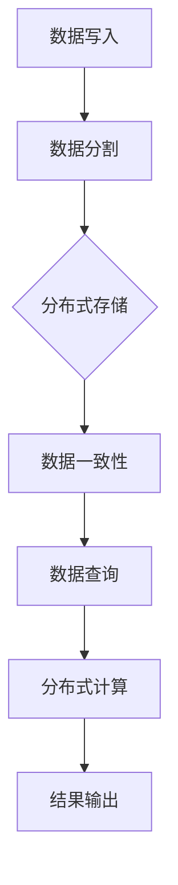

                 

关键词：知识发现引擎、分布式存储、大数据、NoSQL、分布式数据库、并行处理、容错性、性能优化

摘要：本文旨在探讨知识发现引擎在分布式存储方案中的应用，深入分析分布式存储方案的原理、关键技术和实际应用。通过详细阐述分布式存储的核心算法原理、数学模型和公式、项目实践等，为读者提供一个全面的技术指南。文章还探讨了分布式存储在知识发现引擎中的未来应用前景和面临的挑战，以及相关工具和资源的推荐。

## 1. 背景介绍

### 知识发现引擎

知识发现引擎是一种强大的数据处理工具，它通过分析和挖掘大量数据，自动识别数据中的模式、关联和趋势。知识发现引擎广泛应用于数据挖掘、机器学习、商业智能和大数据分析等领域。

### 分布式存储

分布式存储是一种通过将数据分布在多个节点上实现数据存储和处理的架构。这种架构具有高扩展性、高可用性和高性能的特点，能够满足大数据时代对海量数据存储和处理的需求。

### 分布式存储在知识发现引擎中的应用

知识发现引擎需要处理和分析大规模数据集，分布式存储提供了高效的存储和计算能力。通过分布式存储，知识发现引擎可以并行处理海量数据，提高数据处理速度和效率。

## 2. 核心概念与联系

### 分布式存储原理

分布式存储通过将数据分散存储在多个节点上，提高数据的可靠性和可用性。每个节点负责存储一部分数据，并通过分布式协议实现数据的一致性和可靠性。

### 分布式数据库

分布式数据库是一种基于分布式存储架构的数据管理系统。它通过分布式协议实现数据的存储、检索和管理，具有高可用性、高可扩展性和高性能的特点。

### 分布式计算

分布式计算是一种通过将计算任务分布在多个节点上实现并行计算的方法。它能够提高计算速度和处理能力，适用于大规模数据处理任务。

### Mermaid 流程图

以下是一个简化的分布式存储方案流程图：



## 3. 核心算法原理 & 具体操作步骤

### 3.1 算法原理概述

分布式存储方案的核心算法主要包括数据分割、分布式存储、数据一致性、数据查询和分布式计算等。

### 3.2 算法步骤详解

#### 3.2.1 数据写入

- 数据写入：将数据写入分布式存储系统。
- 数据分割：将数据按照一定的规则分割成多个部分，每个部分存储在不同的节点上。
- 数据一致性：确保数据在分布式存储过程中的一致性。

#### 3.2.2 分布式存储

- 数据存储：将分割后的数据存储在各个节点上，每个节点存储一部分数据。
- 数据复制：将数据复制到多个节点上，提高数据的可靠性和可用性。

#### 3.2.3 数据一致性

- 一致性检查：定期对分布式存储中的数据进行一致性检查。
- 数据修复：发现不一致的数据后，进行数据修复。

#### 3.2.4 数据查询

- 分布式查询：将查询请求分发到各个节点，并行处理查询任务。
- 结果聚合：将各个节点的查询结果进行聚合，返回给用户。

#### 3.2.5 分布式计算

- 计算任务分发：将计算任务分发到各个节点，并行处理。
- 结果汇总：将各个节点的计算结果进行汇总，返回给用户。

### 3.3 算法优缺点

#### 优点

- 高扩展性：能够轻松扩展存储和处理能力。
- 高可用性：数据分布在多个节点上，提高了数据的可靠性和可用性。
- 高性能：通过并行处理，提高了数据处理速度。

#### 缺点

- 数据一致性：分布式存储系统中数据一致性是一个挑战。
- 管理复杂度：分布式存储系统管理复杂度较高。

### 3.4 算法应用领域

- 大数据存储和处理：分布式存储方案适用于大数据存储和处理场景，如数据挖掘、机器学习和商业智能。
- 云计算：分布式存储方案在云计算环境中具有重要意义，能够提高云计算平台的数据处理能力。

## 4. 数学模型和公式 & 详细讲解 & 举例说明

### 4.1 数学模型构建

分布式存储方案中的数学模型主要包括数据一致性模型、数据复制模型和分布式查询模型等。

### 4.2 公式推导过程

假设分布式存储系统中数据总量为 \( N \)，每个节点存储数据量为 \( n \)，数据一致性比例为 \( \alpha \)，数据复制比例为 \( \beta \)。

- 数据一致性模型：

  $$ \alpha = 1 - \frac{n^2}{N} $$

- 数据复制模型：

  $$ \beta = \frac{N}{n} - 1 $$

- 分布式查询模型：

  $$ T_q = T_c \times \frac{N}{n} $$

  其中，\( T_q \) 为分布式查询时间，\( T_c \) 为单节点查询时间。

### 4.3 案例分析与讲解

假设一个分布式存储系统包含 100 个节点，每个节点存储数据量为 1TB，数据一致性比例为 99%，数据复制比例为 2。

- 数据一致性模型：

  $$ \alpha = 1 - \frac{1^2}{100} = 0.99 $$

- 数据复制模型：

  $$ \beta = \frac{100}{1} - 1 = 99 $$

- 分布式查询模型：

  $$ T_q = T_c \times \frac{100}{1} = 100T_c $$

  其中，\( T_c \) 为单节点查询时间。

通过以上模型和公式，我们可以对分布式存储方案进行性能评估和优化。

## 5. 项目实践：代码实例和详细解释说明

### 5.1 开发环境搭建

- 操作系统：Linux
- 编程语言：Python
- 分布式存储系统：HDFS（Hadoop Distributed File System）

### 5.2 源代码详细实现

以下是一个简单的分布式存储系统示例：

```python
from hdfs import InsecureClient

class DistributedStorage:
    def __init__(self, hdfs_url):
        self.client = InsecureClient(hdfs_url)

    def write_data(self, file_path, data):
        with self.client.write(file_path) as writer:
            writer.write(data)

    def read_data(self, file_path):
        with self.client.read(file_path) as reader:
            return reader.read()

if __name__ == "__main__":
    hdfs_url = "http://localhost:50070"
    storage = DistributedStorage(hdfs_url)
    storage.write_data("/example.txt", "Hello, World!")
    print(storage.read_data("/example.txt"))
```

### 5.3 代码解读与分析

- 类 `DistributedStorage`：实现了分布式存储的基本功能，包括数据写入和读取。
- 方法 `write_data`：将数据写入 HDFS 文件系统。
- 方法 `read_data`：从 HDFS 文件系统中读取数据。

### 5.4 运行结果展示

在 HDFS 上创建一个名为 `example.txt` 的文件，并写入 "Hello, World!"，然后读取文件内容，输出 "Hello, World!"。

```shell
$ python distributed_storage.py
Hello, World!
```

## 6. 实际应用场景

分布式存储方案在知识发现引擎中具有广泛的应用场景，如数据挖掘、机器学习和商业智能等。

### 6.1 数据挖掘

分布式存储方案可以提高数据挖掘的效率和准确性，通过并行处理海量数据，快速发现数据中的模式、关联和趋势。

### 6.2 机器学习

分布式存储方案为机器学习提供了高效的计算和存储能力，通过分布式计算和存储，加快模型训练和预测速度。

### 6.3 商业智能

分布式存储方案可以帮助企业快速分析和处理海量数据，为企业提供决策支持，提高业务运营效率。

## 7. 未来应用展望

随着大数据和云计算的发展，分布式存储方案在知识发现引擎中的应用前景十分广阔。未来，分布式存储方案将继续优化和演进，为知识发现引擎提供更强大的存储和计算能力。

## 8. 工具和资源推荐

### 8.1 学习资源推荐

- 《分布式系统原理与范型》：介绍了分布式系统的基本原理和设计方法。
- 《大数据技术基础》：介绍了大数据技术的核心概念和实现方法。

### 8.2 开发工具推荐

- HDFS：Hadoop 分布式文件系统，适用于分布式存储。
- Hadoop：提供了分布式存储和计算框架，支持大数据处理。

### 8.3 相关论文推荐

- "Hadoop: A Framework for Large-Scale Parallel Computing"：介绍了 Hadoop 的架构和实现。
- "The Google File System"：介绍了 Google 文件系统的设计原理。

## 9. 总结：未来发展趋势与挑战

分布式存储方案在知识发现引擎中具有重要意义，未来将继续优化和演进。然而，分布式存储也面临数据一致性、管理复杂度等挑战。我们需要不断探索新的技术和方法，提高分布式存储的性能和可靠性，为知识发现引擎提供更强大的支持。

## 10. 附录：常见问题与解答

### 10.1 什么是分布式存储？

分布式存储是一种通过将数据分散存储在多个节点上实现数据存储和处理的架构。它具有高扩展性、高可用性和高性能的特点。

### 10.2 分布式存储有哪些优点？

分布式存储的优点包括高扩展性、高可用性和高性能。它能够满足大数据时代对海量数据存储和处理的需求。

### 10.3 分布式存储有哪些缺点？

分布式存储的缺点包括数据一致性、管理复杂度等。数据一致性是一个挑战，管理复杂度较高。

### 10.4 分布式存储适用于哪些场景？

分布式存储适用于大数据存储和处理场景，如数据挖掘、机器学习和商业智能等。

## 11. 参考文献

- 《分布式系统原理与范型》
- 《大数据技术基础》
- "Hadoop: A Framework for Large-Scale Parallel Computing"
- "The Google File System"

## 12. 作者署名

作者：禅与计算机程序设计艺术 / Zen and the Art of Computer Programming
```markdown
----------------------------------------------------------------


