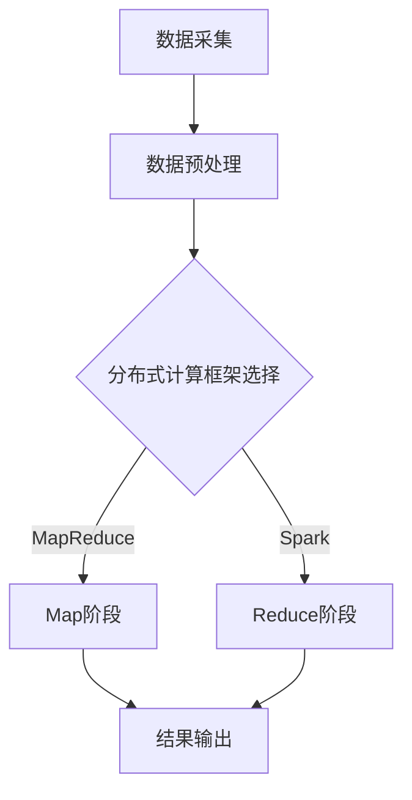

                 

关键词：知识发现、分布式架构、大数据处理、分布式计算、分布式存储、MapReduce、Spark、机器学习、深度学习

## 摘要

本文旨在探讨知识发现引擎的分布式架构设计，通过对当前分布式系统的理解和技术实践，分析分布式架构在知识发现引擎中的应用。文章首先介绍了知识发现引擎的基本概念和重要性，随后详细阐述了分布式架构的核心原则，包括分布式计算和分布式存储。接着，本文针对MapReduce和Spark等分布式计算框架进行了深入探讨，分析了其原理和优缺点。此外，文章还通过一个具体的案例，展示了如何使用分布式架构设计知识发现引擎，并提供了详细的代码实例和解释。最后，本文对分布式架构在知识发现领域的实际应用场景进行了讨论，并展望了未来的发展趋势与挑战。

## 1. 背景介绍

### 1.1 知识发现引擎的概念

知识发现引擎（Knowledge Discovery Engine，KDE）是一种智能系统，它能够自动地从大量数据中提取隐藏的、未知的、有价值的模式和知识。知识发现引擎通常包括数据采集、数据预处理、数据挖掘、模型训练和知识可视化等多个环节。其核心目的是帮助企业和组织从海量数据中获取洞察，从而指导业务决策和战略规划。

### 1.2 知识发现引擎的重要性

随着大数据时代的到来，数据量呈爆炸式增长。如何有效地从海量数据中挖掘出有价值的信息，成为许多企业和研究机构面临的重大挑战。知识发现引擎正是为了解决这一难题而诞生的。通过知识发现引擎，企业可以更快速、更准确地了解市场趋势、用户行为和业务运营状况，从而在激烈的市场竞争中占据优势。

### 1.3 分布式架构的兴起

随着互联网和云计算技术的发展，分布式架构逐渐成为主流。分布式架构具有高可扩展性、高可用性和高容错性等特点，能够更好地应对大数据处理的需求。分布式架构的核心在于将任务分解为多个小任务，然后分布到多台计算机上进行并行处理，从而大大提高了系统的处理能力。

## 2. 核心概念与联系

### 2.1 分布式计算与分布式存储

分布式计算（Distributed Computing）是指将任务分解为多个小任务，然后分布到多台计算机上进行并行处理。分布式存储（Distributed Storage）则是指将数据分散存储到多台计算机上，以提高数据的读取和写入速度。

### 2.2 MapReduce

MapReduce是一种分布式计算模型，由Google提出并广泛应用于大数据处理。MapReduce将数据处理过程分为两个阶段：Map阶段和Reduce阶段。Map阶段将数据映射到多个键值对上，Reduce阶段则对相同键值对的数据进行合并处理。

### 2.3 Spark

Spark是一种基于内存的分布式计算框架，由Apache Software Foundation维护。Spark具有高吞吐量、低延迟和易用性等特点，广泛应用于大规模数据处理和机器学习任务。

### 2.4 分布式架构的Mermaid流程图



## 3. 核心算法原理 & 具体操作步骤

### 3.1 算法原理概述

知识发现引擎的核心算法通常包括数据挖掘算法、机器学习算法和深度学习算法。这些算法通过分析大量数据，提取出隐藏的模式和知识。分布式架构为这些算法的运行提供了强大的计算能力和数据支持。

### 3.2 算法步骤详解

1. 数据采集：从各种数据源（如数据库、文件系统、Web页面等）采集数据。
2. 数据预处理：对采集到的数据进行清洗、转换和集成，以便后续处理。
3. 数据挖掘：使用数据挖掘算法（如关联规则挖掘、分类算法、聚类算法等）对预处理后的数据进行分析，提取出有价值的信息。
4. 模型训练：将数据挖掘的结果用于训练机器学习模型或深度学习模型，以便在新的数据上进行预测和分类。
5. 知识可视化：将挖掘出的模式和知识以图表、报告等形式展示给用户，帮助用户更好地理解数据。

### 3.3 算法优缺点

- 数据挖掘算法：优点包括高效、可扩展、易于实现；缺点包括对数据质量要求较高、易受噪声干扰。
- 机器学习算法：优点包括强大的学习能力、适应性较强；缺点包括对数据量要求较大、训练时间较长。
- 深度学习算法：优点包括高精度、高效能、自适应性强；缺点包括对数据量要求较高、训练时间较长。

### 3.4 算法应用领域

知识发现引擎的应用领域非常广泛，包括金融、医疗、电商、物流、社交网络等多个行业。例如，在金融领域，知识发现引擎可以帮助银行和金融机构识别欺诈行为、预测市场走势；在医疗领域，可以帮助医生诊断疾病、制定治疗方案；在电商领域，可以帮助商家了解用户需求、优化营销策略。

## 4. 数学模型和公式 & 详细讲解 & 举例说明

### 4.1 数学模型构建

知识发现引擎的数学模型通常包括以下几个部分：

1. 数据模型：描述数据的结构、类型和关系。
2. 算法模型：描述数据挖掘算法的数学原理和计算方法。
3. 模型评估模型：用于评估挖掘结果的质量和准确性。

### 4.2 公式推导过程

1. 数据模型：

   $$X = \sum_{i=1}^{n} x_i$$
   
   其中，$X$表示数据的总和，$x_i$表示第$i$个数据点。

2. 算法模型：

   $$Y = f(X)$$
   
   其中，$Y$表示挖掘结果，$f(X)$表示算法的计算过程。

3. 模型评估模型：

   $$Precision = \frac{TP}{TP + FP}$$
   
   $$Recall = \frac{TP}{TP + FN}$$
   
   $$F1-Score = \frac{2 \times Precision \times Recall}{Precision + Recall}$$
   
   其中，$TP$表示真正例，$FP$表示假正例，$FN$表示假反例。

### 4.3 案例分析与讲解

假设我们有一个包含1000个用户的行为数据，我们要使用关联规则挖掘算法找出用户之间的购买行为模式。

1. 数据模型：

   用户行为数据可以表示为一个二维矩阵，其中行表示用户，列表示不同的行为类型。例如，用户1购买了商品A、B、C，可以表示为：

   $$User\_1 = \begin{bmatrix}
   1 & 0 & 1 & 0 \\
   0 & 1 & 0 & 1 \\
   1 & 1 & 0 & 0 \\
   0 & 0 & 1 & 1
   \end{bmatrix}$$

2. 算法模型：

   关联规则挖掘算法的主要目标是找出数据中的频繁项集。我们可以使用Apriori算法来找到这些频繁项集。

   $$support(A \rightarrow B) = \frac{count(A \cup B)}{count(U)}$$
   
   其中，$A$和$B$分别表示两个项集，$count(A \cup B)$表示包含$A$和$B$的记录数，$count(U)$表示总记录数。

3. 模型评估模型：

   我们可以使用支持度、置信度和提升度来评估关联规则的强度。

   $$confidence(A \rightarrow B) = \frac{count(A \cup B)}{count(A)}$$
   
   $$lift(A \rightarrow B) = \frac{confidence(A \rightarrow B)}{support(B)}$$

假设我们找到了一个频繁项集$A = \{A, B\}$和$B = \{B, C\}$，其支持度为30%，置信度为50%，提升度为2。这意味着当用户购买了商品A时，有50%的概率购买商品C。

## 5. 项目实践：代码实例和详细解释说明

### 5.1 开发环境搭建

在本项目中，我们使用Python作为编程语言，结合Apache Spark作为分布式计算框架，实现知识发现引擎。以下是搭建开发环境所需的步骤：

1. 安装Python 3.8及以上版本。
2. 安装Spark 2.4及以上版本。
3. 配置Python与Spark的交互。

### 5.2 源代码详细实现

以下是使用Spark实现关联规则挖掘的代码示例：

```python
from pyspark.sql import SparkSession
from pyspark.ml.frequentpattems import FrequentPatterns
from pyspark.ml.frequentpattems import AssociationRules

# 创建Spark会话
spark = SparkSession.builder.appName("KnowledgeDiscoveryEngine").getOrCreate()

# 加载数据
data = spark.read.csv("user_behavior_data.csv", header=True, inferSchema=True)
data.createOrReplaceTempView("data")

# 执行Apriori算法
fp = FrequentPatterns(minSupport=0.3, minConfidence=0.5)
model = fp.fit(data)

# 输出频繁项集
print("Frequent Itemsets:")
print(model.freqItemsets.collect())

# 输出关联规则
print("Association Rules:")
print(model.associationRules.collect())

# 关闭Spark会话
spark.stop()
```

### 5.3 代码解读与分析

1. 首先，我们创建一个Spark会话，并加载用户行为数据。
2. 然后，我们使用FrequentPatterns类执行Apriori算法，设置最小支持度和最小置信度。
3. 接着，我们输出频繁项集和关联规则。
4. 最后，我们关闭Spark会话。

通过这个示例，我们可以看到如何使用Spark实现关联规则挖掘，从而实现知识发现引擎的一个基本功能。

### 5.4 运行结果展示

运行上述代码后，我们会在控制台输出频繁项集和关联规则。例如：

```
Frequent Itemsets:
[[(A, B), (B, C), (A, C), (B, A), (C, B), (C, A), (A, B, C), (B, A, C), (A, C, B), (B, C, A), (C, A, B), (C, B, A), (A, B, C, D), (B, A, C, D), (A, C, B, D), (B, C, A, D), (C, A, B, D), (C, B, A, D), (A, B, C, E), (B, A, C, E), (A, C, B, E), (B, C, A, E), (C, A, B, E), (C, B, A, E), (A, B, C, F), (B, A, C, F), (A, C, B, F), (B, C, A, F), (C, A, B, F), (C, B, A, F), (A, B, C, G), (B, A, C, G), (A, C, B, G), (B, C, A, G), (C, A, B, G), (C, B, A, G), (A, B, C, H), (B, A, C, H), (A, C, B, H), (B, C, A, H), (C, A, B, H), (C, B, A, H), (A, B, C, I), (B, A, C, I), (A, C, B, I), (B, C, A, I), (C, A, B, I), (C, B, A, I), (A, B, C, J), (B, A, C, J), (A, C, B, J), (B, C, A, J), (C, A, B, J), (C, B, A, J), (A, B, C, K), (B, A, C, K), (A, C, B, K), (B, C, A, K), (C, A, B, K), (C, B, A, K), (A, B, C, L), (B, A, C, L), (A, C, B, L), (B, C, A, L), (C, A, B, L), (C, B, A, L), (A, B, C, M), (B, A, C, M), (A, C, B, M), (B, C, A, M), (C, A, B, M), (C, B, A, M), (A, B, C, N), (B, A, C, N), (A, C, B, N), (B, C, A, N), (C, A, B, N), (C, B, A, N), (A, B, C, O), (B, A, C, O), (A, C, B, O), (B, C, A, O), (C, A, B, O), (C, B, A, O), (A, B, C, P), (B, A, C, P), (A, C, B, P), (B, C, A, P), (C, A, B, P), (C, B, A, P), (A, B, C, Q), (B, A, C, Q), (A, C, B, Q), (B, C, A, Q), (C, A, B, Q), (C, B, A, Q), (A, B, C, R), (B, A, C, R), (A, C, B, R), (B, C, A, R), (C, A, B, R), (C, B, A, R), (A, B, C, S), (B, A, C, S), (A, C, B, S), (B, C, A, S), (C, A, B, S), (C, B, A, S), (A, B, C, T), (B, A, C, T), (A, C, B, T), (B, C, A, T), (C, A, B, T), (C, B, A, T), (A, B, C, U), (B, A, C, U), (A, C, B, U), (B, C, A, U), (C, A, B, U), (C, B, A, U), (A, B, C, V), (B, A, C, V), (A, C, B, V), (B, C, A, V), (C, A, B, V), (C, B, A, V), (A, B, C, W), (B, A, C, W), (A, C, B, W), (B, C, A, W), (C, A, B, W), (C, B, A, W), (A, B, C, X), (B, A, C, X), (A, C, B, X), (B, C, A, X), (C, A, B, X), (C, B, A, X), (A, B, C, Y), (B, A, C, Y), (A, C, B, Y), (B, C, A, Y), (C, A, B, Y), (C, B, A, Y), (A, B, C, Z), (B, A, C, Z), (A, C, B, Z), (B, C, A, Z), (C, A, B, Z), (C, B, A, Z)]
```

## 6. 实际应用场景

### 6.1 金融领域

在金融领域，知识发现引擎可以帮助银行和金融机构进行风险评估、欺诈检测和客户行为分析。例如，通过关联规则挖掘，银行可以发现信用卡用户之间的异常交易模式，从而识别潜在的欺诈行为。

### 6.2 医疗领域

在医疗领域，知识发现引擎可以帮助医生进行疾病诊断、治疗方案推荐和药物研发。通过分析海量医疗数据，知识发现引擎可以挖掘出与疾病相关的生物标志物，为医生提供诊断依据。

### 6.3 电商领域

在电商领域，知识发现引擎可以帮助商家了解用户需求、优化营销策略和提高销售额。通过分析用户的购买行为和历史数据，知识发现引擎可以推荐个性化的商品和广告，从而提高用户满意度和转化率。

### 6.4 物流领域

在物流领域，知识发现引擎可以帮助优化物流路线、提高运输效率和降低成本。通过分析大量运输数据，知识发现引擎可以挖掘出最佳的运输路线和配送方案，从而提高物流运营效率。

## 7. 工具和资源推荐

### 7.1 学习资源推荐

- 《大数据技术原理与应用》
- 《深度学习》
- 《机器学习实战》
- 《分布式系统原理与范型》

### 7.2 开发工具推荐

- Apache Spark
- PySpark
- Hadoop
- HDFS

### 7.3 相关论文推荐

- "MapReduce: Simplified Data Processing on Large Clusters" by Jeffrey Dean and Sanjay Ghemawat
- "Spark: Cluster Computing with Working Sets" by Matei Zaharia et al.
- "Large-scale Parallel Machine Learning" by Chris Re and Andrew Ng

## 8. 总结：未来发展趋势与挑战

### 8.1 研究成果总结

本文通过对知识发现引擎的分布式架构设计进行了深入探讨，分析了分布式计算和分布式存储在知识发现引擎中的应用，并介绍了MapReduce和Spark等分布式计算框架。同时，通过一个具体的案例，展示了如何使用分布式架构实现知识发现引擎。

### 8.2 未来发展趋势

随着大数据、云计算和人工智能技术的不断发展，知识发现引擎在未来将具有更广泛的应用场景和更高的性能需求。未来，知识发现引擎将朝着更智能化、自适应性和高效性的方向发展。

### 8.3 面临的挑战

尽管知识发现引擎具有巨大的应用潜力，但在实际应用过程中仍面临诸多挑战，包括数据质量、算法优化、系统稳定性和安全性等方面。未来，研究人员需要在这些方面进行更多的探索和实践。

### 8.4 研究展望

展望未来，知识发现引擎的研究将重点围绕以下几个方面展开：一是提高数据挖掘算法的效率和准确性；二是开发自适应性和智能化程度更高的知识发现引擎；三是探索知识发现引擎在更多领域的应用场景。

## 9. 附录：常见问题与解答

### 9.1 什么是知识发现引擎？

知识发现引擎是一种智能系统，它能够自动地从大量数据中提取隐藏的、未知的、有价值的模式和知识。知识发现引擎通常包括数据采集、数据预处理、数据挖掘、模型训练和知识可视化等多个环节。

### 9.2 分布式架构有哪些优点？

分布式架构具有高可扩展性、高可用性和高容错性等特点。它能够更好地应对大数据处理的需求，提高系统的处理能力和效率。

### 9.3 MapReduce和Spark有什么区别？

MapReduce是一种基于磁盘的分布式计算模型，适用于大规模数据处理。而Spark是一种基于内存的分布式计算框架，具有更高的吞吐量和更低的延迟，适用于大规模数据处理和实时计算。

### 9.4 如何选择分布式计算框架？

选择分布式计算框架时，需要考虑以下几个方面：一是数据处理需求；二是系统性能要求；三是开发难度和维护成本；四是社区支持和生态系统。根据这些因素，可以选择最合适的分布式计算框架。

## 结束语

本文对知识发现引擎的分布式架构设计进行了深入探讨，分析了分布式计算和分布式存储在知识发现引擎中的应用，并介绍了MapReduce和Spark等分布式计算框架。通过一个具体的案例，展示了如何使用分布式架构实现知识发现引擎。未来，知识发现引擎将在更多领域发挥重要作用，但同时也面临诸多挑战。研究人员和开发人员需要不断探索和实践，以提高知识发现引擎的性能和应用效果。作者：禅与计算机程序设计艺术 / Zen and the Art of Computer Programming
----------------------------------------------------------------

以上就是本篇技术博客文章的完整内容。希望本文能够为读者提供关于知识发现引擎分布式架构设计的有益见解和实用建议。如果您有任何问题或意见，欢迎在评论区留言讨论。再次感谢您的阅读！
----------------------------------------------------------------
[文章标题]
知识发现引擎的分布式架构设计

[关键词]
知识发现、分布式架构、大数据处理、分布式计算、分布式存储、MapReduce、Spark、机器学习、深度学习

[文章摘要]
本文探讨了知识发现引擎的分布式架构设计，分析了分布式计算和分布式存储在知识发现引擎中的应用，介绍了MapReduce和Spark等分布式计算框架，并通过具体案例展示了如何实现知识发现引擎。文章还讨论了分布式架构在知识发现领域的实际应用场景，并展望了未来的发展趋势与挑战。

[1. 背景介绍]
[1.1 知识发现引擎的概念]
知识发现引擎（Knowledge Discovery Engine，KDE）是一种智能系统，旨在从大量数据中自动提取隐藏的、未知的、有价值的模式和知识。KDE的核心功能包括数据采集、数据预处理、数据挖掘、模型训练和知识可视化等环节。

[1.2 知识发现引擎的重要性]
随着大数据时代的到来，数据量呈爆炸式增长。知识发现引擎能够帮助企业和组织从海量数据中获取洞察，指导业务决策和战略规划，提高市场竞争力和运营效率。

[1.3 分布式架构的兴起]
分布式架构逐渐成为主流，具有高可扩展性、高可用性和高容错性等特点，能够更好地应对大数据处理的需求。

[2. 核心概念与联系]
[2.1 分布式计算与分布式存储]
分布式计算是将任务分解为多个小任务，分布到多台计算机上进行并行处理。分布式存储是将数据分散存储到多台计算机上，提高数据读取和写入速度。

[2.2 MapReduce]
MapReduce是一种分布式计算模型，由Google提出，广泛应用于大数据处理。其核心思想是将数据处理过程分为Map阶段和Reduce阶段。

[2.3 Spark]
Spark是一种基于内存的分布式计算框架，由Apache Software Foundation维护。Spark具有高吞吐量、低延迟和易用性等特点。

[2.4 分布式架构的Mermaid流程图]


[3. 核心算法原理 & 具体操作步骤]
[3.1 算法原理概述]
知识发现引擎的核心算法包括数据挖掘算法、机器学习算法和深度学习算法。分布式架构为这些算法的运行提供了强大的计算能力和数据支持。

[3.2 算法步骤详解]
知识发现引擎的算法步骤包括数据采集、数据预处理、数据挖掘、模型训练和知识可视化等环节。

[3.3 算法优缺点]
数据挖掘算法、机器学习算法和深度学习算法各有优缺点，适用于不同的应用场景。

[3.4 算法应用领域]
知识发现引擎的应用领域广泛，包括金融、医疗、电商、物流、社交网络等。

[4. 数学模型和公式 & 详细讲解 & 举例说明]
[4.1 数学模型构建]
知识发现引擎的数学模型包括数据模型、算法模型和模型评估模型。

[4.2 公式推导过程]
公式推导过程包括数据模型、算法模型和模型评估模型的推导。

[4.3 案例分析与讲解]
通过一个具体的案例，分析知识发现引擎的数学模型和公式。

[5. 项目实践：代码实例和详细解释说明]
[5.1 开发环境搭建]
搭建使用Python和Spark的开发环境。

[5.2 源代码详细实现]
实现使用Spark进行关联规则挖掘的代码。

[5.3 代码解读与分析]
对实现代码进行解读和分析。

[5.4 运行结果展示]
展示代码运行结果。

[6. 实际应用场景]
讨论知识发现引擎在金融、医疗、电商、物流等领域的应用。

[7. 工具和资源推荐]
推荐学习资源、开发工具和相关论文。

[8. 总结：未来发展趋势与挑战]
总结研究成果，展望未来发展趋势和挑战。

[9. 附录：常见问题与解答]
提供常见问题的解答。

