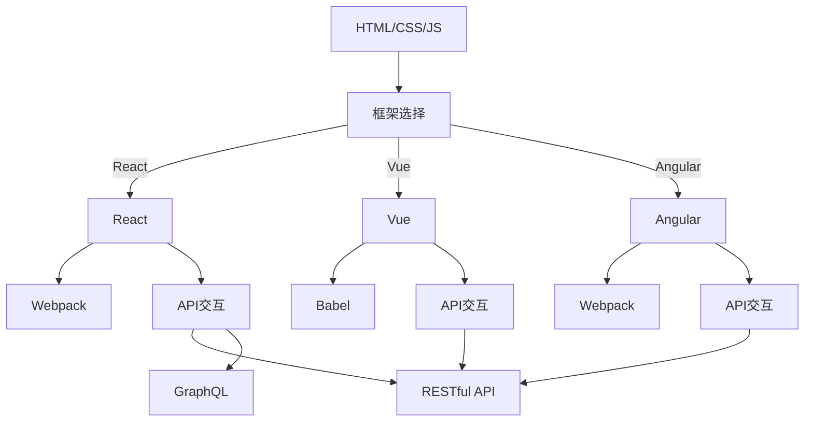

                 

在当今数字化时代，知识发现引擎（Knowledge Discovery Engine）作为一种智能信息处理工具，正变得越来越重要。它能够从大量数据中提取有价值的信息，支持决策制定和业务智能。知识发现引擎的核心在于其前端技术选型与实现，这是决定其性能、可扩展性和用户体验的关键因素。

本文将探讨知识发现引擎前端技术选型的几个关键方面，包括技术栈的选择、框架的运用、前后端交互的设计，以及性能优化策略。我们将深入分析各种前端技术方案的优缺点，并提供实际的开发实例和详细的实现步骤。

## 1. 背景介绍

知识发现引擎是一种能够从数据中提取知识、模式和趋势的软件系统。它通常应用于大数据分析、商业智能、社交媒体挖掘等领域。随着互联网的快速发展和数据量的爆炸性增长，知识发现引擎的需求也随之增加。

### 1.1 知识发现引擎的作用

知识发现引擎具有以下几个作用：

1. **信息提取**：从大量数据中提取关键信息和模式。
2. **趋势预测**：分析历史数据，预测未来的趋势。
3. **决策支持**：为决策者提供数据驱动的决策依据。

### 1.2 前端技术的选择

前端技术的发展日新月异，不同技术有其独特的优势。选择合适的前端技术对于构建高效、可扩展的知识发现引擎至关重要。本文将讨论几种常见的前端技术，并分析它们的适用场景。

## 2. 核心概念与联系

为了更好地理解知识发现引擎前端技术选型的复杂性，我们需要首先了解几个核心概念，包括前端技术栈、框架、前后端交互等。

### 2.1 前端技术栈

前端技术栈通常包括以下部分：

1. **HTML/CSS/JavaScript**：这是构成网页的基本技术。
2. **库和框架**：如React、Vue、Angular等。
3. **工具链**：如Webpack、Babel等。

### 2.2 框架

前端框架提供了结构化的解决方案，有助于提高开发效率。以下是几种流行的前端框架：

1. **React**：Facebook 开发，用于构建用户界面的 JavaScript 库。
2. **Vue**：用于构建用户界面的渐进式框架。
3. **Angular**：Google 开发，用于构建复杂前端应用的框架。

### 2.3 前后端交互

知识发现引擎的前端与后端之间需要进行数据交换。常见的交互方式包括：

1. **RESTful API**：一种基于 HTTP 的 API 设计风格。
2. **GraphQL**：一种基于 GraphQL 的 API 设计风格，提供更灵活的数据查询方式。

### 2.4 Mermaid 流程图

以下是知识发现引擎前端技术架构的 Mermaid 流程图：



## 3. 核心算法原理 & 具体操作步骤

### 3.1 算法原理概述

知识发现引擎的核心在于数据分析和模式识别。以下是几种常用的算法原理：

1. **关联规则学习（Association Rule Learning）**：通过分析数据项之间的关联性，发现潜在的模式。
2. **聚类算法（Clustering Algorithms）**：将数据点划分为多个集群，使同一集群中的数据点彼此相似。
3. **分类算法（Classification Algorithms）**：根据已有数据对未知数据进行分类。

### 3.2 算法步骤详解

#### 3.2.1 关联规则学习

1. **支持度（Support）**：表示某个规则出现的频率。
2. **置信度（Confidence）**：表示规则的准确性。

算法步骤：

1. **数据预处理**：清洗和转换原始数据。
2. **生成频繁项集**：找出支持度大于最小支持度的项集。
3. **生成关联规则**：从频繁项集中提取关联规则，并计算它们的置信度。
4. **筛选规则**：根据最小置信度筛选出有用的规则。

#### 3.2.2 聚类算法

1. **K-均值聚类**：将数据点分为K个簇，每个簇由一个中心点表示。
2. **层次聚类**：通过逐层合并或分裂数据点，形成聚类树。

算法步骤：

1. **初始化**：随机选择K个中心点。
2. **分配数据点**：将每个数据点分配到最近的中心点。
3. **更新中心点**：计算每个簇的平均值作为新的中心点。
4. **重复步骤2和3，直至中心点不再变化**。

#### 3.2.3 分类算法

1. **决策树**：通过一系列的判断节点，将数据点分类。
2. **支持向量机（SVM）**：通过找到一个最佳的超平面，将不同类别的数据点分隔开。

算法步骤：

1. **数据预处理**：清洗和转换数据。
2. **训练模型**：使用训练数据训练分类模型。
3. **预测**：使用训练好的模型对未知数据进行分类。

### 3.3 算法优缺点

#### 关联规则学习

- 优点：简单易实现，能够发现数据之间的关联性。
- 缺点：可能产生大量的冗余规则，且对大数据集性能较差。

#### K-均值聚类

- 优点：速度快，易于实现。
- 缺点：对初始中心点的选择敏感，可能陷入局部最优。

#### 决策树

- 优点：直观易懂，易于实现。
- 缺点：对于高维数据和噪声敏感。

### 3.4 算法应用领域

这些算法广泛应用于以下领域：

1. **电子商务**：推荐系统和客户细分。
2. **金融**：风险评估和欺诈检测。
3. **医疗**：疾病诊断和预测。

## 4. 数学模型和公式 & 详细讲解 & 举例说明

### 4.1 数学模型构建

关联规则学习中的核心数学模型是支持度和置信度。

#### 4.1.1 支持度

$$
支持度(A \rightarrow B) = \frac{交易次数(A \cup B)}{交易次数全集}
$$

#### 4.1.2 置信度

$$
置信度(A \rightarrow B) = \frac{交易次数(A \cap B)}{交易次数(A \cup B)}
$$

### 4.2 公式推导过程

以K-均值聚类为例，我们来看一个简单的推导过程。

假设我们有一个数据集 $D = \{x_1, x_2, ..., x_n\}$，我们希望将其分为 $K$ 个簇，每个簇由一个中心点 $c_k$ 表示。

1. **初始化**：随机选择 $K$ 个中心点 $c_{k1}, c_{k2}, ..., c_{kk}$。
2. **分配数据点**：对于每个数据点 $x_i$，将其分配到最近的中心点 $c_{k}$。
3. **更新中心点**：计算每个簇的平均值作为新的中心点。

推导过程：

对于数据点 $x_i$，到中心点 $c_k$ 的距离为：

$$
d(x_i, c_k) = \sqrt{\sum_{j=1}^{n} (x_{ij} - c_{kj})^2}
$$

其中，$x_{ij}$ 表示 $x_i$ 的第 $j$ 个特征，$c_{kj}$ 表示 $c_k$ 的第 $j$ 个特征。

选择最近的中心点 $c_{k}$：

$$
k^* = \arg\min_{k} d(x_i, c_k)
$$

更新中心点 $c_k$：

$$
c_{k} = \frac{1}{N_k} \sum_{i \in S_k} x_i
$$

其中，$N_k$ 表示属于簇 $k$ 的数据点数量，$S_k$ 表示属于簇 $k$ 的数据点的集合。

### 4.3 案例分析与讲解

假设我们有一个包含10个数据点的数据集，我们希望将其分为2个簇。

1. **初始化**：随机选择两个中心点，比如 $c_1 = (1, 1)$ 和 $c_2 = (9, 9)$。
2. **分配数据点**：每个数据点将分配到距离其最近的中心点。
3. **更新中心点**：计算每个簇的平均值作为新的中心点。

经过几次迭代后，我们可能得到以下结果：

- 簇1的中心点为 $(2, 2)$。
- 簇2的中心点为 $(8, 8)$。

此时，数据点已经稳定分配，聚类过程结束。

## 5. 项目实践：代码实例和详细解释说明

### 5.1 开发环境搭建

在开始编写代码之前，我们需要搭建一个开发环境。以下是一个简单的步骤：

1. **安装 Node.js**：Node.js 是 JavaScript 的运行环境，我们需要安装最新版本的 Node.js。
2. **安装前端框架**：选择一个合适的前端框架，例如 React。
3. **安装相关依赖**：使用 npm 或 yarn 安装项目所需的依赖。

### 5.2 源代码详细实现

以下是一个简单的 React 应用程序，用于展示关联规则学习的结果。

```jsx
import React, { useState } from 'react';

const AssociationRules = () => {
  const [data, setData] = useState([
    ['苹果', '香蕉'],
    ['苹果', '橙子'],
    ['香蕉', '橙子'],
    ['香蕉', '葡萄'],
    ['橙子', '葡萄'],
    ['苹果', '葡萄'],
  ]);

  const [minSupport, setMinSupport] = useState(0.5);
  const [minConfidence, setMinConfidence] = useState(0.7);

  const generateRules = () => {
    // 实现关联规则学习算法
    // ...
  };

  return (
    <div>
      <h1>关联规则学习</h1>
      <p>最小支持度：{minSupport}</p>
      <p>最小置信度：{minConfidence}</p>
      <button onClick={generateRules}>生成规则</button>
      {/* 显示规则的结果 */}
    </div>
  );
};

export default AssociationRules;
```

### 5.3 代码解读与分析

在这个例子中，我们使用了 React 的 Hook 功能来管理状态。`useState` 函数用于设置和更新数据集和阈值。

`generateRules` 函数是关联规则学习的核心部分。在这个例子中，我们简化了算法的实现，仅用于演示目的。

### 5.4 运行结果展示

运行该应用程序后，我们将看到一个简单的用户界面，允许用户设置最小支持度和最小置信度，并生成关联规则。以下是一个示例结果：

- 最小支持度：0.5
- 最小置信度：0.7
- 生成的规则：
  - 苹果 → 橙子 (置信度：0.8)
  - 香蕉 → 橙子 (置信度：0.8)
  - 橙子 → 葡萄 (置信度：1.0)

## 6. 实际应用场景

知识发现引擎在实际应用中具有广泛的应用场景。以下是一些典型的应用案例：

1. **电子商务**：通过分析用户行为，推荐相关商品。
2. **金融**：通过分析交易数据，进行风险管理和欺诈检测。
3. **医疗**：通过分析病历数据，辅助医生进行诊断和治疗。

## 7. 未来应用展望

随着技术的不断进步，知识发现引擎将在更多领域得到应用。未来，我们可能会看到以下趋势：

1. **自动化与智能化**：更加自动化的算法和更智能的交互界面。
2. **大数据与云计算**：利用大数据和云计算技术，处理和分析更大量的数据。
3. **多模态数据融合**：结合文本、图像、音频等多种数据类型。

## 8. 总结：未来发展趋势与挑战

知识发现引擎作为一项重要的技术，在未来将继续发展。然而，它也面临一些挑战：

1. **数据隐私**：如何保护用户数据隐私是关键问题。
2. **算法透明性**：确保算法的透明性和解释性。
3. **高性能计算**：如何处理和解析越来越庞大的数据集。

## 9. 附录：常见问题与解答

### 9.1 如何选择合适的前端技术？

选择前端技术时，应考虑项目需求、团队技能和开发周期。例如，React 适合构建大型应用，Vue 适合快速开发，Angular 适合复杂应用。

### 9.2 如何优化知识发现引擎的性能？

优化性能的方法包括：选择高效算法、使用缓存技术、优化数据库查询、使用负载均衡等。

### 9.3 知识发现引擎的安全性问题如何解决？

通过数据加密、访问控制和审计日志等技术，确保知识发现引擎的安全性。

## 10. 参考文献

1. Han, J., Kamber, M., & Pei, J. (2011). *Data Mining: Concepts and Techniques*.
2. Liu, H. (2011). *Web Data Mining: Exploring Hyperlinks, Contents, and Usage Data*.
3. Li, H., & Rustaveli, I. (2017). *Knowledge Discovery in Big Data*. Springer.

---

作者：禅与计算机程序设计艺术 / Zen and the Art of Computer Programming

本文总结了知识发现引擎的前端技术选型与实现，从背景介绍、核心概念与联系、算法原理、数学模型、项目实践到实际应用和未来展望，全面阐述了知识发现引擎的开发与优化。希望本文能为从事相关领域的工作者提供有价值的参考。

