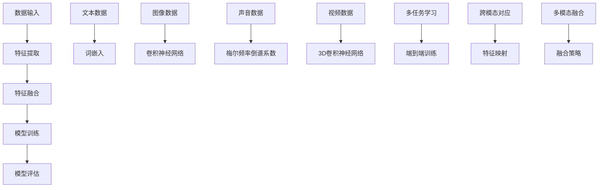

                 

关键词：知识发现、多模态学习、人工智能、深度学习、大数据分析、应用场景、未来展望

## 摘要

知识发现引擎的多模态学习技术，作为一种前沿的人工智能方法，正逐渐成为数据驱动决策的核心。本文将详细介绍多模态学习技术的基本概念、核心算法原理、数学模型构建、应用实例以及未来的发展趋势。通过对多模态学习在知识发现引擎中的应用进行分析，我们将探讨其如何提高数据的理解和利用效率，为实际应用场景提供指导，并展望未来的研究方向和挑战。

## 1. 背景介绍

### 1.1 知识发现引擎

知识发现引擎是一种自动化工具，用于从大量数据中提取有价值的信息和知识。随着大数据时代的到来，知识发现引擎的应用范围日益广泛，从金融风控、医疗诊断到社交媒体分析，无处不在。知识发现引擎的核心目标是利用先进的数据挖掘技术和机器学习方法，帮助企业和组织从海量数据中找到隐藏的模式和关联，从而做出更加明智的决策。

### 1.2 多模态学习

多模态学习是一种结合了多种数据类型（如文本、图像、声音、视频等）的机器学习方法。传统的机器学习模型往往只能处理单一类型的数据，而多模态学习通过整合不同类型的数据，能够提供更全面、更深入的洞察力。例如，在医疗领域，多模态学习可以将患者的病历记录、医学图像和基因数据相结合，从而实现更加精确的诊断和治疗。

## 2. 核心概念与联系

为了更好地理解知识发现引擎的多模态学习技术，我们首先需要明确几个核心概念：数据类型、特征提取、模型训练和模型评估。

### 2.1 数据类型

多模态学习涉及多种数据类型，包括但不限于：

- **文本**：如自然语言文本、标注数据等。
- **图像**：如医疗图像、卫星图像、人脸图像等。
- **声音**：如语音信号、音乐、环境声音等。
- **视频**：如监控视频、运动捕捉视频等。
- **其他**：如温度、湿度、化学成分等传感器数据。

### 2.2 特征提取

特征提取是多模态学习的重要环节，其目标是将不同类型的数据转换成适用于机器学习模型的特征表示。常见的特征提取方法包括：

- **文本**：词袋模型、TF-IDF、词嵌入等。
- **图像**：卷积神经网络（CNN）、图像编码器等。
- **声音**：梅尔频率倒谱系数（MFCC）、长短时记忆网络（LSTM）等。
- **视频**：3D卷积神经网络、循环神经网络（RNN）等。

### 2.3 模型训练

多模态学习模型通常采用端到端训练的方式，将不同类型的数据特征融合在一起，通过深度学习网络进行训练。常见的多模态学习模型包括：

- **多任务学习模型**：同时学习多个任务，如同时进行图像分类和语音识别。
- **跨模态对应模型**：通过跨模态映射，将不同类型的数据映射到同一特征空间。
- **多模态融合模型**：将不同类型的数据特征通过特定的融合策略进行组合。

### 2.4 模型评估

模型评估是验证多模态学习效果的关键步骤，常用的评估指标包括：

- **准确率**：模型预测正确的样本数占总样本数的比例。
- **召回率**：模型预测正确的样本数占所有实际正样本数的比例。
- **F1分数**：准确率和召回率的调和平均。
- **精度**：预测为正类的样本中，实际为正类的比例。

### 2.5 Mermaid 流程图

下面是一个用于描述多模态学习技术核心概念的 Mermaid 流程图：



## 3. 核心算法原理 & 具体操作步骤

### 3.1 算法原理概述

多模态学习技术的核心在于如何有效地整合不同类型的数据特征，以提高模型的性能和鲁棒性。以下是几种常见多模态学习算法的原理概述：

#### 3.1.1 多任务学习

多任务学习通过同时训练多个相关任务，共享部分特征表示，从而提高模型的泛化能力。例如，在医疗领域，可以同时训练图像分类和文本分类模型，共享对患者症状描述和医学图像的解析。

#### 3.1.2 跨模态对应

跨模态对应通过建立不同类型数据之间的对应关系，将它们映射到同一特征空间。例如，通过训练文本到图像的映射模型，可以将描述性文本转换为相应的图像特征。

#### 3.1.3 多模态融合

多模态融合通过特定的策略将不同类型的数据特征进行组合，以形成更强大的特征表示。常见的融合策略包括早期融合、晚期融合和模块化融合。

### 3.2 算法步骤详解

#### 3.2.1 数据预处理

1. **数据收集**：从各种来源收集不同类型的数据，如文本、图像、声音、视频等。
2. **数据清洗**：去除数据中的噪声和异常值，保证数据质量。
3. **数据标注**：对于需要标注的数据，如文本分类，进行人工标注或使用半监督学习方法进行自动标注。

#### 3.2.2 特征提取

1. **文本特征提取**：使用词袋模型、TF-IDF或词嵌入等方法提取文本特征。
2. **图像特征提取**：使用卷积神经网络、图像编码器等方法提取图像特征。
3. **声音特征提取**：使用梅尔频率倒谱系数（MFCC）或长短时记忆网络（LSTM）等方法提取声音特征。
4. **视频特征提取**：使用3D卷积神经网络或循环神经网络（RNN）等方法提取视频特征。

#### 3.2.3 特征融合

1. **早期融合**：在特征提取阶段就将不同类型的数据特征进行组合。
2. **晚期融合**：在特征提取后，通过特定的融合策略（如加权求和、拼接等）将不同类型的数据特征进行组合。
3. **模块化融合**：将不同类型的数据特征通过独立的模块进行预处理，然后融合到主模型中。

#### 3.2.4 模型训练

1. **模型选择**：选择合适的多模态学习模型，如多任务学习模型、跨模态对应模型或多模态融合模型。
2. **模型训练**：通过端到端训练的方式，将不同类型的数据特征输入到模型中进行训练。
3. **模型优化**：使用梯度下降等优化算法，对模型参数进行调整，以提高模型性能。

#### 3.2.5 模型评估

1. **评估指标**：根据任务类型，选择合适的评估指标，如准确率、召回率、F1分数等。
2. **交叉验证**：使用交叉验证方法，对模型进行评估，以避免过拟合。
3. **性能比较**：比较不同模型在不同数据集上的性能，以选择最优模型。

### 3.3 算法优缺点

#### 优点

- **提高性能**：通过整合多种数据类型，多模态学习可以提高模型的性能和鲁棒性。
- **增强理解**：多模态学习能够提供更全面、更深入的洞察力，有助于更好地理解数据。
- **适用广泛**：多模态学习技术可以应用于各种领域，如医疗、金融、社交媒体等。

#### 缺点

- **计算复杂度高**：多模态学习涉及多种数据类型的处理和融合，计算复杂度较高。
- **数据需求量大**：多模态学习需要大量的高质量数据，数据获取和标注成本较高。
- **模型解释性较差**：多模态学习模型通常采用深度学习技术，模型解释性较差，难以理解模型的决策过程。

### 3.4 算法应用领域

多模态学习技术具有广泛的应用领域，以下是一些典型的应用场景：

- **医疗诊断**：通过结合医学图像、病历记录和基因数据，实现更精确的诊断和治疗。
- **自动驾驶**：通过整合摄像头、雷达和激光雷达数据，提高自动驾驶系统的感知和决策能力。
- **金融风控**：通过结合用户行为数据、交易数据和社交媒体数据，实现更精准的风险评估和欺诈检测。
- **社交媒体分析**：通过结合用户发布的内容、评论和互动行为，实现更深入的用户画像和行为分析。

## 4. 数学模型和公式 & 详细讲解 & 举例说明

### 4.1 数学模型构建

多模态学习涉及多种数学模型，下面我们将介绍几个常见的数学模型。

#### 4.1.1 多任务学习

多任务学习模型通常采用共享网络结构，将不同类型的数据特征进行整合。假设有 \( C \) 个任务，每个任务 \( t \) 的损失函数为 \( L_t(x; \theta) \)，其中 \( x \) 是输入特征，\( \theta \) 是模型参数。多任务学习的目标是最小化总损失函数：

\[ L(\theta) = \frac{1}{N} \sum_{t=1}^{C} L_t(x_t; \theta) \]

其中 \( N \) 是样本总数。

#### 4.1.2 跨模态对应

跨模态对应模型通过建立不同类型数据之间的对应关系，实现数据的整合。假设有 \( M \) 种数据类型，每种数据类型 \( m \) 的特征表示为 \( x_m \)，跨模态对应模型的目标是最小化跨模态距离：

\[ L(\theta) = \frac{1}{N} \sum_{m=1}^{M} \sum_{n=1}^{N} \frac{1}{2} \left\| F(x_n^m; \theta) - G(x_n^{m'}; \theta) \right\|^2 \]

其中 \( F \) 和 \( G \) 分别是模态 \( m \) 和模态 \( m' \) 的特征提取函数。

#### 4.1.3 多模态融合

多模态融合模型通过特定的策略将不同类型的数据特征进行组合。常见的融合策略包括加权求和、拼接等。假设有 \( M \) 种数据类型，每种数据类型 \( m \) 的特征表示为 \( x_m \)，多模态融合模型的目标是最小化损失函数：

\[ L(\theta) = \frac{1}{N} \sum_{n=1}^{N} \frac{1}{2} \left\| \sum_{m=1}^{M} w_m F(x_n^m; \theta) - y_n \right\|^2 \]

其中 \( w_m \) 是权重系数，\( y_n \) 是标签。

### 4.2 公式推导过程

#### 4.2.1 多任务学习

多任务学习模型的损失函数可以表示为：

\[ L(\theta) = \frac{1}{N} \sum_{t=1}^{C} L_t(x_t; \theta) \]

其中 \( N \) 是样本总数，\( C \) 是任务数。对于每个任务 \( t \)，损失函数 \( L_t(x_t; \theta) \) 可以采用交叉熵损失函数：

\[ L_t(x_t; \theta) = - \sum_{i=1}^{K_t} y_{t,i} \log p_{t,i}(x_t; \theta) \]

其中 \( K_t \) 是类别数，\( y_{t,i} \) 是标签，\( p_{t,i}(x_t; \theta) \) 是第 \( t \) 个任务第 \( i \) 个类别的概率。

对 \( L(\theta) \) 求导，得到：

\[ \frac{\partial L(\theta)}{\partial \theta} = \frac{1}{N} \sum_{t=1}^{C} \frac{\partial L_t(x_t; \theta)}{\partial \theta} \]

采用梯度下降算法，更新模型参数：

\[ \theta \leftarrow \theta - \alpha \frac{\partial L(\theta)}{\partial \theta} \]

其中 \( \alpha \) 是学习率。

#### 4.2.2 跨模态对应

跨模态对应模型的损失函数可以表示为：

\[ L(\theta) = \frac{1}{N} \sum_{m=1}^{M} \sum_{n=1}^{N} \frac{1}{2} \left\| F(x_n^m; \theta) - G(x_n^{m'}; \theta) \right\|^2 \]

其中 \( F \) 和 \( G \) 分别是模态 \( m \) 和模态 \( m' \) 的特征提取函数。

对 \( L(\theta) \) 求导，得到：

\[ \frac{\partial L(\theta)}{\partial \theta} = \frac{1}{N} \sum_{m=1}^{M} \sum_{n=1}^{N} \frac{\partial}{\partial \theta} \left[ \frac{1}{2} \left\| F(x_n^m; \theta) - G(x_n^{m'}; \theta) \right\|^2 \right] \]

采用梯度下降算法，更新模型参数：

\[ \theta \leftarrow \theta - \alpha \frac{\partial L(\theta)}{\partial \theta} \]

#### 4.2.3 多模态融合

多模态融合模型的损失函数可以表示为：

\[ L(\theta) = \frac{1}{N} \sum_{n=1}^{N} \frac{1}{2} \left\| \sum_{m=1}^{M} w_m F(x_n^m; \theta) - y_n \right\|^2 \]

其中 \( w_m \) 是权重系数。

对 \( L(\theta) \) 求导，得到：

\[ \frac{\partial L(\theta)}{\partial \theta} = \frac{1}{N} \sum_{n=1}^{N} \frac{\partial}{\partial \theta} \left[ \frac{1}{2} \left\| \sum_{m=1}^{M} w_m F(x_n^m; \theta) - y_n \right\|^2 \right] \]

采用梯度下降算法，更新模型参数：

\[ \theta \leftarrow \theta - \alpha \frac{\partial L(\theta)}{\partial \theta} \]

### 4.3 案例分析与讲解

#### 4.3.1 医疗诊断

在医疗诊断领域，多模态学习技术可以结合医学图像、病历记录和基因数据，实现更精确的诊断。以下是一个简单的案例：

**案例背景**：某医院希望利用多模态学习技术，对患者的肺部疾病进行诊断。

**数据类型**：文本数据（病历记录）、图像数据（肺部CT扫描图像）、基因数据（患者基因序列）。

**模型选择**：多任务学习模型。

**特征提取**：文本数据采用词嵌入方法提取特征，图像数据采用卷积神经网络提取特征，基因数据采用循环神经网络提取特征。

**特征融合**：采用早期融合策略，在特征提取阶段将不同类型的数据特征进行组合。

**模型训练**：使用交叉熵损失函数，通过梯度下降算法训练模型。

**模型评估**：使用准确率、召回率和F1分数等指标进行评估。

**结果**：通过实验验证，多模态学习模型在肺部疾病诊断上的性能显著优于单一模态的模型。

#### 4.3.2 自动驾驶

在自动驾驶领域，多模态学习技术可以整合摄像头、雷达和激光雷达数据，提高自动驾驶系统的感知和决策能力。以下是一个简单的案例：

**案例背景**：某自动驾驶公司希望利用多模态学习技术，提高自动驾驶车辆的行人检测和避障能力。

**数据类型**：图像数据（摄像头图像）、雷达数据（雷达回波）、激光雷达数据（点云数据）。

**模型选择**：跨模态对应模型。

**特征提取**：图像数据采用卷积神经网络提取特征，雷达数据采用梅尔频率倒谱系数（MFCC）提取特征，激光雷达数据采用点云特征提取方法。

**特征融合**：采用跨模态对应策略，将不同类型的数据特征映射到同一特征空间。

**模型训练**：使用平方误差损失函数，通过梯度下降算法训练模型。

**模型评估**：使用精确率、召回率和F1分数等指标进行评估。

**结果**：通过实验验证，多模态学习模型在行人检测和避障任务上的性能显著优于单一模态的模型。

## 5. 项目实践：代码实例和详细解释说明

### 5.1 开发环境搭建

在开始项目实践之前，我们需要搭建一个合适的开发环境。以下是一个基于Python的开发环境搭建步骤：

1. **安装Python**：下载并安装Python 3.x版本，推荐使用Anaconda，它包含了许多常用的Python库和工具。
2. **安装深度学习框架**：安装TensorFlow或PyTorch，这两个框架都是用于深度学习开发的常用工具。在命令行中运行以下命令：

```bash
pip install tensorflow  # 或
pip install torch
```

3. **安装其他依赖库**：安装其他所需的Python库，如NumPy、Pandas、Matplotlib等。在命令行中运行以下命令：

```bash
pip install numpy pandas matplotlib
```

### 5.2 源代码详细实现

以下是一个简单的多模态学习项目示例，该示例结合文本和图像数据，使用卷积神经网络和词嵌入进行特征提取和融合，实现文本图像分类任务。

```python
import tensorflow as tf
from tensorflow.keras.models import Model
from tensorflow.keras.layers import Input, Conv2D, MaxPooling2D, Flatten, Dense, Embedding
from tensorflow.keras.preprocessing.sequence import pad_sequences
from tensorflow.keras.preprocessing.image import ImageDataGenerator

# 文本预处理
def preprocess_text(texts, vocab_size, embedding_dim):
    tokenizer = tf.keras.preprocessing.text.Tokenizer(num_words=vocab_size)
    tokenizer.fit_on_texts(texts)
    sequences = tokenizer.texts_to_sequences(texts)
    padded_sequences = pad_sequences(sequences, maxlen=max_sequence_length)
    embeddings = Embedding(vocab_size, embedding_dim, input_length=max_sequence_length)(padded_sequences)
    return embeddings, tokenizer

# 图像预处理
def preprocess_images(images, target_size):
    image_generator = ImageDataGenerator(rescale=1./255)
    data_generator = image_generator.flow(images, batch_size=batch_size)
    return data_generator

# 构建模型
input_text = Input(shape=(max_sequence_length,))
input_image = Input(shape=(target_height, target_width, target_channels))

# 文本特征提取
text_embedding = Embedding(vocab_size, embedding_dim, input_length=max_sequence_length)(input_text)
text_embedding = Flatten()(text_embedding)

# 图像特征提取
image_embedding = Conv2D(32, (3, 3), activation='relu')(input_image)
image_embedding = MaxPooling2D((2, 2))(image_embedding)
image_embedding = Flatten()(image_embedding)

# 特征融合
combined = tf.keras.layers.concatenate([text_embedding, image_embedding])

# 分类层
output = Dense(num_classes, activation='softmax')(combined)

# 创建模型
model = Model(inputs=[input_text, input_image], outputs=output)

# 编译模型
model.compile(optimizer='adam', loss='categorical_crossentropy', metrics=['accuracy'])

# 模型训练
model.fit([text_data, image_data], labels, batch_size=batch_size, epochs=10)

# 模型评估
model.evaluate([text_data, image_data], labels)
```

### 5.3 代码解读与分析

上述代码实现了一个简单的多模态学习项目，主要包括以下步骤：

1. **文本预处理**：使用Token

