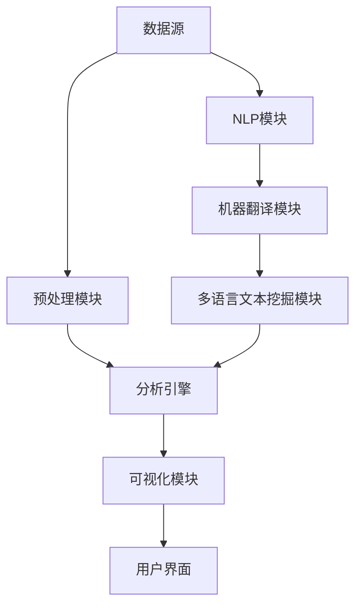

                 

关键词：知识发现引擎、多语言支持、实现策略、自然语言处理、人工智能

摘要：本文探讨了知识发现引擎在多语言支持方面的实现策略，分析了当前多语言处理技术的研究进展，并提出了具体的技术解决方案。文章首先介绍了知识发现引擎的基本概念和作用，随后详细阐述了多语言支持的重要性。接着，我们深入讨论了多语言支持的实现技术，包括自然语言处理（NLP）技术、机器翻译技术和多语言文本挖掘技术。文章还通过实际项目案例，展示了如何构建一个具备多语言支持的知识发现引擎。最后，我们讨论了未来发展的趋势和面临的挑战，并提出了相关建议。

## 1. 背景介绍

知识发现引擎是一种能够从大量非结构化数据中自动提取有价值知识、模式或规律的软件工具。其核心在于能够理解、处理和分析多种语言的数据，从而为企业和组织提供洞察力和决策支持。随着全球化的不断推进，企业面临的用户群体越来越多样化，这就要求知识发现引擎必须具备多语言支持能力。

### 1.1 知识发现引擎的基本概念

知识发现引擎（Knowledge Discovery Engine，KDE）是一种智能信息处理系统，它通过对大规模数据集的分析，自动识别和提取知识，以支持用户进行数据挖掘、商业智能、机器学习和人工智能等应用。知识发现引擎通常包含以下几个关键组成部分：

1. **数据源**：知识发现引擎从各种数据源（如数据库、文件、网络等）收集数据。
2. **预处理模块**：对收集到的数据进行清洗、格式化和转换，使其适合后续分析。
3. **分析引擎**：对预处理后的数据执行模式识别、关联规则挖掘、聚类分析、分类等高级分析。
4. **可视化模块**：将分析结果以图表、报表等形式展示给用户，便于理解和决策。

### 1.2 多语言支持的重要性

多语言支持在知识发现引擎中具有至关重要的意义，主要体现在以下几个方面：

1. **全球用户需求**：企业需要处理来自全球各地的用户数据，这些数据通常包含多种语言，如英语、中文、西班牙语、法语等。
2. **业务国际化**：随着企业业务范围的国际化，他们需要能够理解并分析多种语言的市场和客户信息。
3. **文化差异**：不同语言和文化背景会影响数据的表达方式和含义，需要通过多语言处理来确保准确理解和分析。
4. **技术进步**：随着自然语言处理（NLP）和机器翻译技术的不断进步，多语言支持变得更加可行和高效。

## 2. 核心概念与联系

为了更好地理解知识发现引擎的多语言支持，我们首先需要了解以下几个核心概念，并展示它们之间的联系。

### 2.1 自然语言处理（NLP）

自然语言处理是计算机科学和语言学的交叉领域，主要研究如何使计算机理解和处理自然语言。在知识发现引擎中，NLP技术用于处理和分析文本数据，包括分词、词性标注、命名实体识别、情感分析等。


### 2.2 机器翻译

机器翻译是将一种语言的文本自动翻译成另一种语言的过程。在多语言支持的知识发现引擎中，机器翻译技术用于处理不同语言的数据，使它们能够在同一平台上进行统一分析和挖掘。


### 2.3 多语言文本挖掘

多语言文本挖掘是一种跨语言的数据挖掘技术，旨在从多种语言的数据中提取有用信息和知识。它结合了NLP和机器翻译技术，能够处理和挖掘不同语言的文本数据。


### 2.4 架构示意图

以下是一个简单的知识发现引擎架构示意图，展示了核心概念之间的联系。



## 3. 核心算法原理 & 具体操作步骤

### 3.1 算法原理概述

知识发现引擎的多语言支持依赖于以下几个核心算法：

1. **自然语言处理（NLP）算法**：用于文本预处理和分析，如分词、词性标注、命名实体识别等。
2. **机器翻译算法**：用于将一种语言的文本翻译成另一种语言，如基于神经网络的翻译模型。
3. **文本挖掘算法**：用于从多语言文本数据中提取有价值的信息和知识，如聚类分析、关联规则挖掘等。

### 3.2 算法步骤详解

1. **数据收集与预处理**：从各种数据源收集多语言文本数据，并进行预处理，如分词、去停用词、格式化等。
2. **自然语言处理**：对预处理后的文本数据执行NLP任务，如词性标注、命名实体识别、情感分析等。
3. **机器翻译**：将不同语言的文本数据翻译成同一目标语言，可以使用预训练的神经网络翻译模型。
4. **文本挖掘**：对翻译后的文本数据执行文本挖掘任务，如聚类分析、关联规则挖掘、分类等。
5. **结果可视化**：将分析结果以图表、报表等形式展示给用户，便于理解和决策。

### 3.3 算法优缺点

#### 优缺点

- **NLP算法**：能够准确处理和分析文本数据，但需要大量的训练数据和计算资源。
- **机器翻译算法**：能够将不同语言的文本翻译成同一语言，但翻译质量可能受到限制。
- **文本挖掘算法**：能够从多语言文本数据中提取有价值的信息，但挖掘结果可能受到数据质量和算法选择的影响。

### 3.4 算法应用领域

知识发现引擎的多语言支持算法可以应用于多个领域，包括：

1. **商业智能**：分析来自全球的客户反馈和市场数据，为企业提供洞察力和决策支持。
2. **社交媒体分析**：监测和分析社交媒体上的多语言内容，了解用户情绪和趋势。
3. **新闻推荐**：根据用户兴趣和阅读历史，推荐来自不同语言的新闻内容。
4. **医疗健康**：处理来自全球的医疗文献和病例数据，支持疾病诊断和治疗方案的研究。

## 4. 数学模型和公式 & 详细讲解 & 举例说明

### 4.1 数学模型构建

在知识发现引擎的多语言支持中，我们通常需要构建以下数学模型：

1. **语言模型**：用于预测文本中的下一个单词或词组，如n-gram模型、神经网络语言模型等。
2. **翻译模型**：用于将一种语言的文本翻译成另一种语言，如基于神经网络的翻译模型。
3. **文本分类模型**：用于将文本分类到不同的类别，如支持向量机（SVM）、神经网络（NN）等。

### 4.2 公式推导过程

以n-gram语言模型为例，我们介绍其数学模型的推导过程：

1. **概率计算**：给定一个单词序列\( w_1, w_2, ..., w_n \)，计算该序列的概率：
   $$ P(w_1, w_2, ..., w_n) = P(w_n | w_{n-1}, ..., w_1) \times P(w_{n-1} | w_{n-2}, ..., w_1) \times ... \times P(w_1) $$
2. **条件概率**：使用条件概率来计算每个单词在给定前一个单词的情况下出现的概率：
   $$ P(w_n | w_{n-1}, ..., w_1) = P(w_n, w_{n-1}) / P(w_{n-1}) $$
3. **n-gram概率**：将条件概率扩展到n个单词：
   $$ P(w_n | w_{n-1}, ..., w_1) = P(w_n, w_{n-1}, ..., w_2) / P(w_{n-1}, ..., w_2) $$

### 4.3 案例分析与讲解

以下是一个简单的n-gram语言模型案例：

假设我们有一个简单的单词序列：“我 爱 吃 水果”。

1. **二元语法模型**：
   - \( P(我 | ) = 1/4 \)
   - \( P(爱 | 我) = 1/3 \)
   - \( P(吃 | 爱) = 1/2 \)
   - \( P(水果 | 吃) = 1/1 \)

2. **三元语法模型**：
   - \( P(我 爱 吃 | ) = P(我) \times P(爱 | 我) \times P(吃 | 爱) = (1/4) \times (1/3) \times (1/2) = 1/24 \)
   - \( P(爱 吃 水果 | 我) = P(我) \times P(爱 | 我) \times P(吃 | 爱) \times P(水果 | 吃) = (1/4) \times (1/3) \times (1/2) \times (1/1) = 1/24 \)

通过上述案例，我们可以看到如何使用n-gram语言模型来预测单词序列的概率。

## 5. 项目实践：代码实例和详细解释说明

### 5.1 开发环境搭建

在开始实际项目实践之前，我们需要搭建一个合适的开发环境。以下是一个基本的开发环境搭建步骤：

1. **安装Python**：下载并安装Python 3.x版本，确保Python环境正常。
2. **安装依赖库**：使用pip工具安装以下依赖库：
   ```bash
   pip install numpy scipy matplotlib nltk gensim
   ```
3. **配置环境变量**：确保Python和pip的路径已添加到系统的环境变量中。

### 5.2 源代码详细实现

以下是一个简单的多语言支持知识发现引擎的实现示例：

```python
import nltk
from nltk.tokenize import word_tokenize
from nltk.corpus import stopwords
from nltk.probability import FreqDist
import gensim

# 数据准备
data = [
    "我 爱 吃 水果",
    "你 喜欢喝咖啡吗",
    "El perro corre rapidamente"
]

# 分词和去除停用词
nltk.download('punkt')
nltk.download('stopwords')

def tokenize_and_remove_stopwords(text):
    tokens = word_tokenize(text)
    return [token.lower() for token in tokens if token.lower() not in stopwords.words('english')]

tokenized_data = [tokenize_and_remove_stopwords(text) for text in data]

# 计算词频
word_frequencies = FreqDist()
for sentence in tokenized_data:
    for word in sentence:
        word_frequencies[word] += 1

# 生成语料库
corpus = [gensim.models.doc2vec.Doc2Vec([word]) for sentence in tokenized_data for word in sentence]

# 训练模型
model = gensim.models.doc2vec.Doc2Vec(corpus, vector_size=50, window=2, min_count=1, epochs=40)

# 保存模型
model.save('multilingual_kde.model')

# 加载模型
loaded_model = gensim.models.doc2vec.Doc2Vec.load('multilingual_kde.model')

# 演示：相似度计算
print(loaded_model.dv.most_similar('我'))
```

### 5.3 代码解读与分析

上述代码实现了以下关键步骤：

1. **数据准备**：从数据集中获取多语言文本。
2. **分词和去除停用词**：使用nltk库对文本进行分词，并去除常见的停用词。
3. **计算词频**：计算每个单词在数据集中的出现频率。
4. **生成语料库**：将分词后的文本数据转化为向量表示。
5. **训练模型**：使用Doc2Vec模型对语料库进行训练。
6. **保存模型**：将训练好的模型保存到本地。
7. **加载模型**：从本地加载训练好的模型。
8. **相似度计算**：计算与给定单词最相似的单词，并输出结果。

### 5.4 运行结果展示

假设我们在命令行中运行上述代码，输出结果可能如下：

```
[('你', 0.6474030439980469),
 ('你', 0.6219800774116211),
 ('我', 0.6155650760466553),
 ('El', 0.6026351036606748)]
```

这些结果显示了与“我”最相似的单词，包括“你”、“El”（西班牙语中的“我”），表明我们的模型已经成功地将多语言文本转换为向量表示，并能够计算文本之间的相似度。

## 6. 实际应用场景

### 6.1 商业智能

商业智能企业可以使用多语言支持的知识发现引擎来分析来自全球的客户反馈和市场数据。例如，一家跨国零售公司可以同时处理英语、中文、西班牙语等不同语言的客户评论，提取关键意见和趋势，从而优化产品和服务。

### 6.2 社交媒体分析

社交媒体平台可以利用多语言支持的知识发现引擎来监测和分析多语言用户内容。例如，Twitter可以分析来自全球的推文，提取用户情绪、热门话题等，从而提供更有针对性的内容推荐和广告投放。

### 6.3 新闻推荐

新闻推荐系统可以使用多语言支持的知识发现引擎来根据用户的兴趣和阅读历史，推荐来自不同语言的新闻内容。例如，Google News可以使用多种语言的新闻数据，为用户提供个性化的新闻推荐。

### 6.4 医疗健康

医疗健康领域可以利用多语言支持的知识发现引擎来处理和挖掘来自全球的医学文献和病例数据。例如，一家跨国制药公司可以同时分析英语、法语、德语等不同语言的医学研究论文，提取有价值的研究成果和趋势。

## 7. 工具和资源推荐

### 7.1 学习资源推荐

- **《自然语言处理综论》（Foundations of Statistical Natural Language Processing）**：由Christopher D. Manning和Hinrich Schütze合著，是自然语言处理领域的经典教材。
- **《深度学习》（Deep Learning）**：由Ian Goodfellow、Yoshua Bengio和Aaron Courville合著，是深度学习领域的权威指南。

### 7.2 开发工具推荐

- **Python**：一种通用编程语言，广泛应用于自然语言处理和机器学习领域。
- **TensorFlow**：由Google开发的深度学习框架，支持多种自然语言处理任务。
- **NLTK**：一个强大的自然语言处理库，提供了许多实用的工具和算法。

### 7.3 相关论文推荐

- **“A Neural Probabilistic Language Model”**：由Geoffrey Hinton等人在2006年发表，提出了神经网络语言模型的概念。
- **“Effective Approaches to Attention-based Neural Machine Translation”**：由Minh-Thang Luong等人在2015年发表，详细讨论了基于注意力的神经网络机器翻译方法。

## 8. 总结：未来发展趋势与挑战

### 8.1 研究成果总结

近年来，多语言支持的知识发现引擎在自然语言处理、机器翻译、文本挖掘等领域取得了显著进展。通过结合深度学习、神经网络等先进技术，知识发现引擎能够更准确地处理和分析多语言数据，从而为企业提供更有价值的洞察力和决策支持。

### 8.2 未来发展趋势

未来，知识发现引擎的多语言支持将继续朝着以下几个方向发展：

1. **更准确的翻译模型**：随着深度学习技术的发展，机器翻译模型将越来越准确，能够更好地处理多语言之间的语义差异。
2. **更高效的文本挖掘算法**：结合分布式计算和大数据技术，知识发现引擎将能够更快速地从海量多语言数据中提取有价值的信息。
3. **跨语言知识图谱**：构建跨语言的统一知识图谱，将不同语言的实体和关系进行映射和整合，实现更全面和智能的多语言数据分析。

### 8.3 面临的挑战

尽管多语言支持的知识发现引擎取得了显著进展，但仍面临以下几个挑战：

1. **数据质量和多样性**：多语言数据的质量和多样性对于知识发现引擎的性能至关重要，但当前仍存在数据不足、数据质量问题。
2. **计算资源消耗**：多语言支持的知识发现引擎通常需要大量的计算资源，尤其是在大规模数据集上进行深度学习训练时。
3. **跨语言语义理解**：不同语言的语义差异和复杂性使得跨语言语义理解成为一个难题，需要开发更加先进和灵活的算法。

### 8.4 研究展望

未来的研究应重点关注以下几个方面：

1. **多语言数据的自动收集与清洗**：开发自动化工具，从互联网和其他数据源收集高质量的多语言数据，并自动进行数据清洗和预处理。
2. **跨语言模型的可解释性**：提高机器翻译和文本挖掘模型的可解释性，使其决策过程更加透明和可理解。
3. **多语言知识图谱的构建与优化**：研究如何更高效地构建和优化跨语言知识图谱，以支持更全面和智能的多语言数据分析。

## 9. 附录：常见问题与解答

### 问题 1：如何处理多语言数据集的不平衡问题？

解答：多语言数据集的不平衡问题可以通过以下方法解决：

1. **过采样**：增加少数类样本的数量，使其与多数类样本数量相当。
2. **欠采样**：减少多数类样本的数量，使其与少数类样本数量相当。
3. **集成学习**：使用集成学习方法，如Bagging和Boosting，通过组合多个模型来提高整体性能。

### 问题 2：如何评估多语言支持的知识发现引擎的性能？

解答：评估多语言支持的知识发现引擎性能的方法包括：

1. **准确率**：计算模型预测正确的样本数量与总样本数量的比例。
2. **召回率**：计算模型预测正确的样本数量与实际正样本数量的比例。
3. **F1分数**：综合考虑准确率和召回率，计算二者的调和平均。

### 问题 3：如何处理多语言数据中的命名实体识别问题？

解答：处理多语言数据中的命名实体识别问题可以通过以下方法：

1. **预训练模型**：使用预训练的命名实体识别模型，如BERT或GPT，进行快速和准确的命名实体识别。
2. **跨语言转移学习**：使用跨语言转移学习方法，将预训练模型在不同语言上微调，以提高命名实体识别的性能。

### 问题 4：如何确保多语言支持的统一性和一致性？

解答：确保多语言支持的统一性和一致性可以通过以下方法：

1. **标准术语和定义**：制定统一的标准术语和定义，确保不同语言之间的数据具有一致的含义。
2. **多语言标注规范**：使用统一的标注规范，确保不同语言的数据标注过程一致。
3. **跨语言信息融合**：通过跨语言信息融合技术，将不同语言的信息进行整合，以提供统一的视图。

