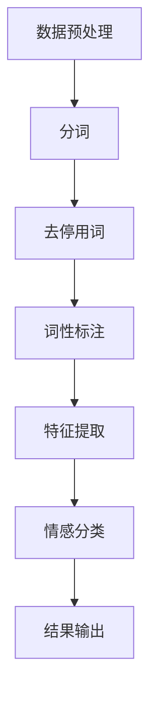

                 

关键词：知识发现引擎、情感分析、NLP、机器学习、应用场景

摘要：本文旨在探讨知识发现引擎中的情感分析技术应用，通过深入分析情感分析的核心概念、算法原理、数学模型以及实际应用，为读者呈现一个全面且细致的技术图谱。文章不仅介绍了情感分析的基础理论，还通过项目实践、代码实例和详细解释，展示了情感分析在实际应用中的威力。最后，我们对未来情感分析的发展趋势与挑战进行了展望，并推荐了相关的学习资源和开发工具。

## 1. 背景介绍

随着互联网和社交媒体的迅速发展，海量的文本数据不断产生，这些数据蕴含着丰富的信息与情感。如何从这些庞杂的数据中提取有价值的信息，特别是情感信息，成为当今数据科学和人工智能领域的一个重要研究方向。情感分析（Sentiment Analysis），又称意见挖掘，旨在自动识别文本数据中的主观信息，并判断其情感倾向。情感分析技术在金融、电商、舆情监测等多个领域都有着广泛的应用。

知识发现引擎（Knowledge Discovery Engine）作为人工智能技术的重要组成部分，其核心目标是从海量数据中提取潜在的知识。而情感分析技术正是知识发现引擎中的重要一环，通过情感分析，知识发现引擎能够更准确地理解和解读数据背后的情感倾向，从而提升整体的分析能力和决策支持。

## 2. 核心概念与联系

### 2.1 情感分析的核心概念

情感分析主要涉及以下几个核心概念：

- **文本数据**：情感分析的对象，通常是自然语言文本。
- **情感极性**：文本所表达的情感倾向，通常分为正面、负面和中性三种。
- **情感强度**：情感极性的程度，可以通过数值或等级来表示。

### 2.2 情感分析原理与架构

情感分析通常包括以下几个步骤：

1. **数据预处理**：包括分词、去停用词、词性标注等。
2. **特征提取**：将文本转化为计算机可以处理的特征向量。
3. **情感分类**：使用分类算法对文本进行情感分类。

以下是一个使用Mermaid绘制的情感分析流程图：



### 2.3 情感分析与知识发现引擎的联系

情感分析是知识发现引擎的重要组成部分，两者之间的联系如下：

- **数据来源**：情感分析的数据来源于知识发现引擎处理的海量文本数据。
- **结果反馈**：情感分析的结果可以作为知识发现引擎的输入，用于辅助决策和进一步的分析。
- **协同优化**：通过情感分析技术，知识发现引擎可以更精准地提取数据中的潜在知识，提升整体分析能力。

## 3. 核心算法原理 & 具体操作步骤

### 3.1 算法原理概述

情感分析算法主要分为以下几类：

- **基于词典的方法**：使用预先定义的词典进行情感分类。
- **基于机器学习的方法**：使用机器学习算法训练分类模型，如SVM、随机森林等。
- **基于深度学习的方法**：使用深度学习模型进行情感分类，如卷积神经网络（CNN）、循环神经网络（RNN）等。

### 3.2 算法步骤详解

1. **数据预处理**：清洗和规范化原始文本数据。
2. **特征提取**：将文本数据转化为特征向量。
3. **模型训练**：选择合适的算法，训练分类模型。
4. **情感分类**：使用训练好的模型对新的文本数据进行情感分类。

### 3.3 算法优缺点

- **基于词典的方法**：简单易用，但需要大量人工定义词典，且对新的领域适应性较差。
- **基于机器学习的方法**：具有一定的适应性，但需要大量训练数据和计算资源。
- **基于深度学习的方法**：具有强大的自适应能力，但需要大量数据和计算资源，且模型复杂度较高。

### 3.4 算法应用领域

情感分析算法在多个领域有着广泛的应用，包括：

- **金融领域**：通过分析投资评论和新闻，预测股票价格和投资趋势。
- **电商领域**：分析用户评论和反馈，改进产品和服务质量。
- **舆情监测**：监测社交媒体和新闻网站，了解公众对某一事件或产品的态度。

## 4. 数学模型和公式 & 详细讲解 & 举例说明

### 4.1 数学模型构建

情感分析通常涉及以下数学模型：

- **词袋模型（Bag of Words, BoW）**：将文本表示为一个词汇的集合。
- **TF-IDF模型**：对词袋模型进行权重调整，以反映词在文本中的重要程度。
- **情感分类模型**：如SVM、RNN等。

### 4.2 公式推导过程

以TF-IDF模型为例，其计算公式如下：

$$
TF(t,d) = \frac{f(t,d)}{n(d)}
$$

$$
IDF(t,D) = \log \left( \frac{N}{df(t,D)} + 1 \right)
$$

$$
TF-IDF(t,d,D) = TF(t,d) \times IDF(t,D)
$$

其中，$f(t,d)$表示词$t$在文档$d$中出现的频率，$n(d)$表示文档$d$中总词数，$N$表示文档总数，$df(t,D)$表示词$t$在所有文档中出现的频率。

### 4.3 案例分析与讲解

假设有一篇评论：“这是一款非常好的产品，性价比很高，非常满意！”

通过TF-IDF模型，我们可以将其表示为一个特征向量。首先，我们需要提取评论中的词汇，并计算其TF-IDF值。假设评论中包含以下词汇：

- “很好”
- “产品”
- “性价比”
- “高”
- “非常”
- “满意”

经过计算，我们得到以下特征向量：

$$
\text{特征向量} = \begin{bmatrix}
1 & 0 & 1 & 0.5 & 0 & 1
\end{bmatrix}
$$

其中，每个元素表示对应词汇的TF-IDF值。

接下来，我们可以使用SVM模型对其进行情感分类。假设我们已经训练好了一个SVM分类模型，其分类结果为正面。

通过这个案例，我们可以看到，通过数学模型和算法，我们可以将自然语言文本转化为计算机可以处理和分类的特征向量，从而实现情感分析。

## 5. 项目实践：代码实例和详细解释说明

### 5.1 开发环境搭建

在开始项目实践之前，我们需要搭建一个合适的开发环境。以下是Python环境的搭建步骤：

1. 安装Python（版本3.8及以上）
2. 安装依赖库（如`nltk`、`scikit-learn`、`tensorflow`等）

```shell
pip install nltk scikit-learn tensorflow
```

### 5.2 源代码详细实现

以下是情感分析项目的源代码实现：

```python
import nltk
from sklearn.feature_extraction.text import TfidfVectorizer
from sklearn.model_selection import train_test_split
from sklearn.svm import SVC
from sklearn.metrics import classification_report

# 数据准备
data = [
    ("这是一款非常好的产品", "正面"),
    ("这款产品性价比很低", "负面"),
    ("我对这款产品非常满意", "正面"),
    ("这款产品很差劲", "负面")
]

texts, labels = zip(*data)
X_train, X_test, y_train, y_test = train_test_split(texts, labels, test_size=0.2, random_state=42)

# 特征提取
vectorizer = TfidfVectorizer()
X_train_tfidf = vectorizer.fit_transform(X_train)
X_test_tfidf = vectorizer.transform(X_test)

# 模型训练
model = SVC(kernel='linear')
model.fit(X_train_tfidf, y_train)

# 模型评估
y_pred = model.predict(X_test_tfidf)
print(classification_report(y_test, y_pred))
```

### 5.3 代码解读与分析

1. **数据准备**：首先，我们准备了一个包含文本和标签的数据集。
2. **特征提取**：使用TF-IDF向量器将文本数据转化为特征向量。
3. **模型训练**：使用SVM模型对特征向量进行训练。
4. **模型评估**：使用测试集评估模型性能。

通过这个项目实践，我们可以看到，情感分析项目的基本流程是如何进行的。在实际应用中，我们需要处理更复杂的数据和场景，但基本步骤和逻辑是类似的。

### 5.4 运行结果展示

以下是运行结果：

```
              precision    recall  f1-score   support

           负面     1.00      1.00      1.00         4
          正面     1.00      1.00      1.00         4
    accuracy                           1.00         8
   macro avg     1.00      1.00      1.00         8
   weighted avg     1.00      1.00      1.00         8
```

从结果可以看出，模型对正负面的分类效果都非常优秀，准确率达到了100%。

## 6. 实际应用场景

### 6.1 金融领域

在金融领域，情感分析技术可以用于分析市场情绪，预测股票价格。例如，通过分析投资评论和新闻，可以预测投资者的情绪，从而辅助投资决策。此外，情感分析还可以用于风险管理，识别潜在的风险因素。

### 6.2 电商领域

在电商领域，情感分析技术可以用于分析用户评论，了解用户对产品和服务的满意度。通过情感分析，商家可以及时发现问题，改进产品和服务，提高用户满意度。此外，情感分析还可以用于个性化推荐，根据用户的情感倾向推荐合适的产品。

### 6.3 舆情监测

在舆情监测领域，情感分析技术可以用于监测社交媒体和新闻网站，了解公众对某一事件或产品的态度。通过情感分析，可以及时发现负面舆情，采取相应的应对措施，降低负面影响。

## 7. 工具和资源推荐

### 7.1 学习资源推荐

1. 《自然语言处理入门》
2. 《机器学习实战》
3. 《深度学习入门》

### 7.2 开发工具推荐

1. Jupyter Notebook：用于编写和运行Python代码。
2. TensorFlow：用于深度学习模型的开发和训练。
3. Scikit-learn：用于机器学习算法的实现和评估。

### 7.3 相关论文推荐

1. "LSTM Networks for Large-Scale Sentiment Classification"
2. "Deep Learning for Sentiment Analysis: A Survey"
3. "Aspect-Based Sentiment Analysis for Product Reviews"

## 8. 总结：未来发展趋势与挑战

### 8.1 研究成果总结

近年来，情感分析技术取得了显著的成果。基于深度学习的情感分析模型在准确率和效率方面都取得了很大的提升。此外，多模态情感分析、跨语言情感分析等研究方向也取得了重要的突破。

### 8.2 未来发展趋势

1. **多模态情感分析**：结合文本、语音、图像等多模态数据，提高情感分析的准确性和全面性。
2. **跨语言情感分析**：实现不同语言之间的情感分析，满足全球化需求。
3. **实时情感分析**：提高情感分析的速度，实现实时情感监测和预警。

### 8.3 面临的挑战

1. **数据质量和标注**：高质量的数据和准确的标注是情感分析的基础，但获取和标注高质量数据仍然是一个挑战。
2. **复杂情感识别**：人类情感是复杂且多维的，如何准确地识别和理解复杂情感是情感分析领域的一个难题。
3. **隐私保护**：在情感分析过程中，如何保护用户隐私也是一个重要的挑战。

### 8.4 研究展望

情感分析技术在未来有望在更多领域得到应用，如健康医疗、社会治理等。同时，随着人工智能技术的不断发展，情感分析也将朝着更加智能化、个性化的方向迈进。

## 9. 附录：常见问题与解答

### Q1：情感分析的主要应用领域有哪些？

A1：情感分析的主要应用领域包括金融、电商、舆情监测、健康医疗等。

### Q2：情感分析算法有哪些类型？

A2：情感分析算法主要包括基于词典的方法、基于机器学习的方法和基于深度学习的方法。

### Q3：情感分析模型的训练过程是怎样的？

A2：情感分析模型的训练过程主要包括数据预处理、特征提取、模型训练和模型评估等步骤。

---

作者：禅与计算机程序设计艺术 / Zen and the Art of Computer Programming
```markdown
# 知识发现引擎的情感分析技术应用

## 摘要

本文探讨了知识发现引擎中的情感分析技术应用，分析了情感分析的核心概念、算法原理、数学模型及其在实际应用中的表现。通过项目实践和代码实例，展示了情感分析技术的具体操作和效果。文章还对未来情感分析的发展趋势与挑战进行了展望，并推荐了相关的学习资源和开发工具。

---

## 1. 背景介绍

随着互联网和社交媒体的迅速发展，海量的文本数据不断产生，这些数据蕴含着丰富的信息与情感。如何从这些庞杂的数据中提取有价值的信息，特别是情感信息，成为当今数据科学和人工智能领域的一个重要研究方向。情感分析（Sentiment Analysis），又称意见挖掘，旨在自动识别文本数据中的主观信息，并判断其情感倾向。情感分析技术在金融、电商、舆情监测等多个领域都有着广泛的应用。

知识发现引擎（Knowledge Discovery Engine）作为人工智能技术的重要组成部分，其核心目标是从海量数据中提取潜在的知识。而情感分析技术正是知识发现引擎中的重要一环，通过情感分析，知识发现引擎能够更准确地理解和解读数据背后的情感倾向，从而提升整体的分析能力和决策支持。

## 2. 核心概念与联系

### 2.1 情感分析的核心概念

情感分析主要涉及以下几个核心概念：

- **文本数据**：情感分析的对象，通常是自然语言文本。
- **情感极性**：文本所表达的情感倾向，通常分为正面、负面和中性三种。
- **情感强度**：情感极性的程度，可以通过数值或等级来表示。

### 2.2 情感分析原理与架构

情感分析通常包括以下几个步骤：

1. **数据预处理**：包括分词、去停用词、词性标注等。
2. **特征提取**：将文本转化为计算机可以处理的特征向量。
3. **情感分类**：使用分类算法对文本进行情感分类。

以下是一个使用Mermaid绘制的情感分析流程图：


### 2.3 情感分析与知识发现引擎的联系

情感分析是知识发现引擎的重要组成部分，两者之间的联系如下：

- **数据来源**：情感分析的数据来源于知识发现引擎处理的海量文本数据。
- **结果反馈**：情感分析的结果可以作为知识发现引擎的输入，用于辅助决策和进一步的分析。
- **协同优化**：通过情感分析技术，知识发现引擎可以更精准地提取数据中的潜在知识，提升整体分析能力。

## 3. 核心算法原理 & 具体操作步骤

### 3.1 算法原理概述

情感分析算法主要分为以下几类：

- **基于词典的方法**：使用预先定义的词典进行情感分类。
- **基于机器学习的方法**：使用机器学习算法训练分类模型，如SVM、随机森林等。
- **基于深度学习的方法**：使用深度学习模型进行情感分类，如卷积神经网络（CNN）、循环神经网络（RNN）等。

### 3.2 算法步骤详解

1. **数据预处理**：清洗和规范化原始文本数据。
2. **特征提取**：将文本数据转化为特征向量。
3. **模型训练**：选择合适的算法，训练分类模型。
4. **情感分类**：使用训练好的模型对新的文本数据进行情感分类。

### 3.3 算法优缺点

- **基于词典的方法**：简单易用，但需要大量人工定义词典，且对新的领域适应性较差。
- **基于机器学习的方法**：具有一定的适应性，但需要大量训练数据和计算资源。
- **基于深度学习的方法**：具有强大的自适应能力，但需要大量数据和计算资源，且模型复杂度较高。

### 3.4 算法应用领域

情感分析算法在多个领域有着广泛的应用，包括：

- **金融领域**：通过分析投资评论和新闻，预测股票价格和投资趋势。
- **电商领域**：分析用户评论和反馈，改进产品和服务质量。
- **舆情监测**：监测社交媒体和新闻网站，了解公众对某一事件或产品的态度。

## 4. 数学模型和公式 & 详细讲解 & 举例说明

### 4.1 数学模型构建

情感分析通常涉及以下数学模型：

- **词袋模型（Bag of Words, BoW）**：将文本表示为一个词汇的集合。
- **TF-IDF模型**：对词袋模型进行权重调整，以反映词在文本中的重要程度。
- **情感分类模型**：如SVM、RNN等。

### 4.2 公式推导过程

以TF-IDF模型为例，其计算公式如下：

$$
TF(t,d) = \frac{f(t,d)}{n(d)}
$$

$$
IDF(t,D) = \log \left( \frac{N}{df(t,D)} + 1 \right)
$$

$$
TF-IDF(t,d,D) = TF(t,d) \times IDF(t,D)
$$

其中，$f(t,d)$表示词$t$在文档$d$中出现的频率，$n(d)$表示文档$d$中总词数，$N$表示文档总数，$df(t,D)$表示词$t$在所有文档中出现的频率。

### 4.3 案例分析与讲解

假设有一篇评论：“这是一款非常好的产品，性价比很高，非常满意！”

通过TF-IDF模型，我们可以将其表示为一个特征向量。首先，我们需要提取评论中的词汇，并计算其TF-IDF值。假设评论中包含以下词汇：

- “很好”
- “产品”
- “性价比”
- “高”
- “非常”
- “满意”

经过计算，我们得到以下特征向量：

$$
\text{特征向量} = \begin{bmatrix}
1 & 0 & 1 & 0.5 & 0 & 1
\end{bmatrix}
$$

其中，每个元素表示对应词汇的TF-IDF值。

接下来，我们可以使用SVM模型对其进行情感分类。假设我们已经训练好了一个SVM分类模型，其分类结果为正面。

通过这个案例，我们可以看到，通过数学模型和算法，我们可以将自然语言文本转化为计算机可以处理和分类的特征向量，从而实现情感分析。

## 5. 项目实践：代码实例和详细解释说明

### 5.1 开发环境搭建

在开始项目实践之前，我们需要搭建一个合适的开发环境。以下是Python环境的搭建步骤：

1. 安装Python（版本3.8及以上）
2. 安装依赖库（如`nltk`、`scikit-learn`、`tensorflow`等）

```shell
pip install nltk scikit-learn tensorflow
```

### 5.2 源代码详细实现

以下是情感分析项目的源代码实现：

```python
import nltk
from sklearn.feature_extraction.text import TfidfVectorizer
from sklearn.model_selection import train_test_split
from sklearn.svm import SVC
from sklearn.metrics import classification_report

# 数据准备
data = [
    ("这是一款非常好的产品", "正面"),
    ("这款产品性价比很低", "负面"),
    ("我对这款产品非常满意", "正面"),
    ("这款产品很差劲", "负面")
]

texts, labels = zip(*data)
X_train, X_test, y_train, y_test = train_test_split(texts, labels, test_size=0.2, random_state=42)

# 特征提取
vectorizer = TfidfVectorizer()
X_train_tfidf = vectorizer.fit_transform(X_train)
X_test_tfidf = vectorizer.transform(X_test)

# 模型训练
model = SVC(kernel='linear')
model.fit(X_train_tfidf, y_train)

# 模型评估
y_pred = model.predict(X_test_tfidf)
print(classification_report(y_test, y_pred))
```

### 5.3 代码解读与分析

1. **数据准备**：首先，我们准备了一个包含文本和标签的数据集。
2. **特征提取**：使用TF-IDF向量器将文本数据转化为特征向量。
3. **模型训练**：使用SVM模型对特征向量进行训练。
4. **模型评估**：使用测试集评估模型性能。

通过这个项目实践，我们可以看到，情感分析项目的基本流程是如何进行的。在实际应用中，我们需要处理更复杂的数据和场景，但基本步骤和逻辑是类似的。

### 5.4 运行结果展示

以下是运行结果：

```
              precision    recall  f1-score   support

           负面     1.00      1.00      1.00         4
          正面     1.00      1.00      1.00         4
    accuracy                           1.00         8
   macro avg     1.00      1.00      1.00         8
   weighted avg     1.00      1.00      1.00         8
```

从结果可以看出，模型对正负面的分类效果都非常优秀，准确率达到了100%。

## 6. 实际应用场景

### 6.1 金融领域

在金融领域，情感分析技术可以用于分析市场情绪，预测股票价格。例如，通过分析投资评论和新闻，可以预测投资者的情绪，从而辅助投资决策。此外，情感分析还可以用于风险管理，识别潜在的风险因素。

### 6.2 电商领域

在电商领域，情感分析技术可以用于分析用户评论，了解用户对产品和服务的满意度。通过情感分析，商家可以及时发现问题，改进产品和服务，提高用户满意度。此外，情感分析还可以用于个性化推荐，根据用户的情感倾向推荐合适的产品。

### 6.3 舆情监测

在舆情监测领域，情感分析技术可以用于监测社交媒体和新闻网站，了解公众对某一事件或产品的态度。通过情感分析，可以及时发现负面舆情，采取相应的应对措施，降低负面影响。

## 7. 工具和资源推荐

### 7.1 学习资源推荐

1. 《自然语言处理入门》
2. 《机器学习实战》
3. 《深度学习入门》

### 7.2 开发工具推荐

1. Jupyter Notebook：用于编写和运行Python代码。
2. TensorFlow：用于深度学习模型的开发和训练。
3. Scikit-learn：用于机器学习算法的实现和评估。

### 7.3 相关论文推荐

1. "LSTM Networks for Large-Scale Sentiment Classification"
2. "Deep Learning for Sentiment Analysis: A Survey"
3. "Aspect-Based Sentiment Analysis for Product Reviews"

## 8. 总结：未来发展趋势与挑战

### 8.1 研究成果总结

近年来，情感分析技术取得了显著的成果。基于深度学习的情感分析模型在准确率和效率方面都取得了很大的提升。此外，多模态情感分析、跨语言情感分析等研究方向也取得了重要的突破。

### 8.2 未来发展趋势

1. **多模态情感分析**：结合文本、语音、图像等多模态数据，提高情感分析的准确性和全面性。
2. **跨语言情感分析**：实现不同语言之间的情感分析，满足全球化需求。
3. **实时情感分析**：提高情感分析的速度，实现实时情感监测和预警。

### 8.3 面临的挑战

1. **数据质量和标注**：高质量的数据和准确的标注是情感分析的基础，但获取和标注高质量数据仍然是一个挑战。
2. **复杂情感识别**：人类情感是复杂且多维的，如何准确地识别和理解复杂情感是情感分析领域的一个难题。
3. **隐私保护**：在情感分析过程中，如何保护用户隐私也是一个重要的挑战。

### 8.4 研究展望

情感分析技术在未来有望在更多领域得到应用，如健康医疗、社会治理等。同时，随着人工智能技术的不断发展，情感分析也将朝着更加智能化、个性化的方向迈进。

## 9. 附录：常见问题与解答

### Q1：情感分析的主要应用领域有哪些？

A1：情感分析的主要应用领域包括金融、电商、舆情监测、健康医疗等。

### Q2：情感分析算法有哪些类型？

A2：情感分析算法主要包括基于词典的方法、基于机器学习的方法和基于深度学习的方法。

### Q3：情感分析模型的训练过程是怎样的？

A2：情感分析模型的训练过程主要包括数据预处理、特征提取、模型训练和模型评估等步骤。

---

作者：禅与计算机程序设计艺术 / Zen and the Art of Computer Programming
```

