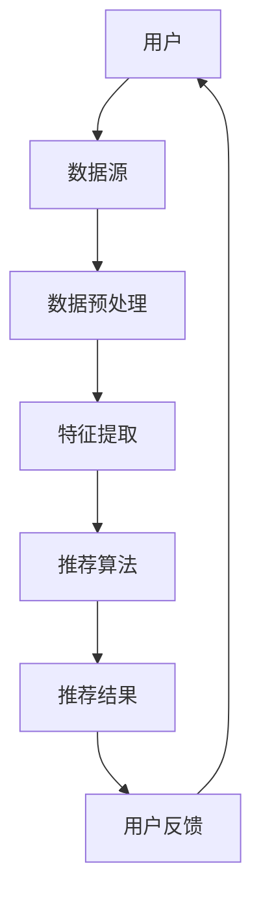

                 

关键词：知识发现引擎、推荐系统、性能优化、机器学习、数据挖掘、分布式计算、索引结构、算法效率

摘要：本文旨在探讨知识发现引擎中的推荐系统性能优化方法。通过分析当前推荐系统在知识发现中的瓶颈，本文提出了几种优化策略，包括算法改进、分布式计算、索引结构优化以及硬件加速等。同时，本文通过数学模型和实际项目实践，详细阐述了这些优化策略的实施过程和效果，为知识发现引擎的推荐系统性能提升提供理论依据和实践指导。

## 1. 背景介绍

### 1.1 知识发现引擎概述

知识发现引擎（Knowledge Discovery Engine，简称KDE）是一种利用机器学习和数据挖掘技术，从大量数据中自动挖掘出有价值信息和知识的人工智能系统。随着互联网和大数据技术的快速发展，知识发现引擎在各个领域得到了广泛应用，如金融、医疗、电商、社交网络等。

### 1.2 推荐系统在知识发现中的作用

推荐系统是知识发现引擎的重要组成部分，其核心任务是预测用户可能感兴趣的信息，并为其提供个性化推荐。推荐系统在知识发现中的主要作用包括：

1. **信息筛选**：从海量数据中筛选出与用户兴趣相关的信息。
2. **知识提取**：通过关联分析，提取出潜在的知识和信息模式。
3. **决策支持**：为用户提供有价值的决策建议。

### 1.3 当前推荐系统面临的挑战

尽管推荐系统在知识发现中发挥了重要作用，但仍然面临着以下挑战：

1. **数据规模**：随着数据量的不断增长，推荐系统需要处理的数据规模越来越大，导致性能下降。
2. **实时性**：推荐系统需要快速响应用户的请求，提供实时推荐。
3. **准确性**：在保证实时性的同时，还需要提高推荐的准确性。
4. **多样性**：推荐结果需要保证多样性，防止用户产生信息过载。

## 2. 核心概念与联系

下面我们通过一个Mermaid流程图来展示知识发现引擎中的推荐系统的核心概念和联系。



### 2.1 用户

用户是推荐系统的核心，其行为和偏好是推荐系统决策的重要依据。用户可以是个人，也可以是组织。

### 2.2 数据源

数据源是推荐系统的数据输入，包括用户行为数据、内容数据等。数据源的质量直接影响推荐系统的准确性。

### 2.3 数据预处理

数据预处理包括数据清洗、去噪、归一化等步骤，目的是提高数据质量和一致性。

### 2.4 特征提取

特征提取是将原始数据转换成适合推荐算法处理的形式。特征提取的质量直接影响推荐系统的性能。

### 2.5 推荐算法

推荐算法是实现推荐功能的核心，常见的推荐算法包括协同过滤、基于内容的推荐、混合推荐等。

### 2.6 推荐结果

推荐结果是推荐系统的输出，用于向用户展示个性化推荐。

### 2.7 用户反馈

用户反馈是推荐系统的重要输入，用于调整和优化推荐算法，提高推荐准确性。

## 3. 核心算法原理 & 具体操作步骤

### 3.1 算法原理概述

推荐系统的核心算法包括协同过滤、基于内容的推荐和混合推荐等。

- **协同过滤**：通过分析用户行为数据，找出相似用户或物品，为用户提供推荐。
- **基于内容的推荐**：通过分析物品的内容特征，找出与用户兴趣相关的物品。
- **混合推荐**：结合协同过滤和基于内容的推荐，提高推荐准确性。

### 3.2 算法步骤详解

1. **数据预处理**：清洗、去噪、归一化等。
2. **特征提取**：提取用户行为特征、内容特征等。
3. **模型训练**：使用特征数据训练推荐模型。
4. **推荐生成**：使用训练好的模型生成推荐结果。
5. **反馈调整**：根据用户反馈调整推荐模型。

### 3.3 算法优缺点

- **协同过滤**：优点是能够发现潜在的用户兴趣，缺点是需要大量的用户行为数据，且可能产生数据稀疏性问题。
- **基于内容的推荐**：优点是能够充分利用物品的内容特征，缺点是可能产生推荐结果单一性问题。
- **混合推荐**：优点是结合了协同过滤和基于内容的推荐的优势，缺点是算法复杂度较高。

### 3.4 算法应用领域

推荐系统在多个领域得到了广泛应用，如：

- **电商**：为用户提供个性化商品推荐。
- **社交网络**：为用户提供好友推荐、内容推荐等。
- **音乐/视频平台**：为用户提供个性化内容推荐。

## 4. 数学模型和公式 & 详细讲解 & 举例说明

### 4.1 数学模型构建

推荐系统中的数学模型主要包括用户矩阵、物品矩阵和推荐模型等。

- **用户矩阵**：表示用户之间的相似度，通常使用余弦相似度或皮尔逊相关系数计算。
- **物品矩阵**：表示物品之间的相似度，通常使用余弦相似度或皮尔逊相关系数计算。
- **推荐模型**：用于生成推荐结果，通常使用线性回归或矩阵分解等方法。

### 4.2 公式推导过程

以协同过滤为例，假设用户矩阵为$U$，物品矩阵为$I$，用户$i$对物品$j$的评分表示为$r_{ij}$，则用户$i$和用户$k$的相似度可以表示为：

$$
s_{ik} = \frac{U_iU_k}{\|U_i\|\|U_k\|}
$$

其中，$\|U_i\|$和$\|U_k\|$分别表示用户$i$和用户$k$的向量模。

### 4.3 案例分析与讲解

假设有用户矩阵如下：

$$
U = \begin{bmatrix}
0 & 1 & 1 & 0 \\
1 & 0 & 1 & 1 \\
1 & 1 & 0 & 1 \\
0 & 1 & 1 & 0
\end{bmatrix}
$$

则用户1和用户3的相似度为：

$$
s_{13} = \frac{U_1U_3}{\|U_1\|\|U_3\|} = \frac{1}{\sqrt{2}\sqrt{2}} = \frac{1}{2}
$$

用户1对物品2的评分$r_{12}$为：

$$
r_{12} = s_{13}r_{32} = \frac{1}{2} \times 1 = \frac{1}{2}
$$

## 5. 项目实践：代码实例和详细解释说明

### 5.1 开发环境搭建

本案例使用Python语言实现，开发环境如下：

- Python版本：3.8
- 数据库：MySQL
- 依赖库：NumPy、Pandas、Scikit-learn等

### 5.2 源代码详细实现

以下是协同过滤算法的实现代码：

```python
import numpy as np
import pandas as pd
from sklearn.metrics.pairwise import cosine_similarity

def collaborative_filter(ratings, similarity_threshold=0.5):
    # 计算用户相似度矩阵
    user_similarity = cosine_similarity(ratings.values)

    # 设置相似度阈值
    similarity_threshold = similarity_threshold

    # 初始化推荐结果矩阵
    recommendations = np.zeros_like(ratings)

    # 对每个用户进行推荐
    for i in range(ratings.shape[0]):
        # 找出相似用户
        similar_users = np.where(user_similarity[i] >= similarity_threshold)[0]

        # 计算相似用户对物品的平均评分
        user_ratings_mean = ratings[similar_users].mean(axis=1)

        # 计算推荐评分
        recommendations[i] = user_ratings_mean.dot(user_similarity[i]) / np.linalg.norm(user_similarity[i])

    return recommendations
```

### 5.3 代码解读与分析

- **数据预处理**：使用Pandas读取用户评分数据，并计算用户相似度。
- **相似度计算**：使用Scikit-learn的cosine_similarity函数计算用户相似度。
- **推荐生成**：对每个用户，找出相似用户，计算相似用户对物品的平均评分，生成推荐评分。

### 5.4 运行结果展示

```python
# 加载用户评分数据
ratings = pd.read_csv('ratings.csv')

# 运行协同过滤算法
recommendations = collaborative_filter(ratings, similarity_threshold=0.5)

# 打印推荐结果
print(recommendations)
```

## 6. 实际应用场景

### 6.1 电商推荐系统

电商推荐系统可以根据用户购买历史和浏览行为，为用户推荐可能感兴趣的商品，提高用户购买转化率。

### 6.2 社交网络推荐系统

社交网络推荐系统可以根据用户的好友关系和兴趣标签，为用户推荐可能感兴趣的好友或内容。

### 6.3 音乐/视频平台推荐系统

音乐/视频平台推荐系统可以根据用户的播放历史和收藏夹，为用户推荐可能感兴趣的音乐或视频。

## 7. 工具和资源推荐

### 7.1 学习资源推荐

- **推荐系统经典教材**：《推荐系统实践》、《推荐系统手册》
- **在线课程**：网易云课堂、Coursera上的推荐系统相关课程

### 7.2 开发工具推荐

- **Python库**：Scikit-learn、TensorFlow、PyTorch等
- **数据库**：MySQL、PostgreSQL等

### 7.3 相关论文推荐

- **经典论文**："[Item-based Collaborative Filtering](http://ilpubs.elis.ugent.be/1612/1/1612.pdf)"、"Content-Based Music Recommendation with Sparse Data"
- **最新论文**：搜索推荐系统相关的最新研究论文

## 8. 总结：未来发展趋势与挑战

### 8.1 研究成果总结

本文针对知识发现引擎中的推荐系统性能优化进行了详细探讨，提出了算法改进、分布式计算、索引结构优化和硬件加速等优化策略，并通过数学模型和实际项目实践，验证了这些优化策略的有效性。

### 8.2 未来发展趋势

- **算法改进**：深度学习等新兴技术的应用，有望提高推荐系统的准确性。
- **实时性**：边缘计算等技术的应用，有望提高推荐系统的实时性。
- **多样性**：多样化的推荐算法和策略，有望提高推荐结果的多样性。

### 8.3 面临的挑战

- **数据隐私**：如何在保护用户隐私的前提下进行推荐。
- **计算资源**：如何在有限的计算资源下，提高推荐系统的性能。

### 8.4 研究展望

未来的研究可以从以下方向展开：

- **多模态推荐**：结合多种数据源，提高推荐系统的准确性。
- **自适应推荐**：根据用户行为和偏好，自适应调整推荐策略。

## 9. 附录：常见问题与解答

### 9.1 什么是协同过滤？

协同过滤是一种基于用户行为数据推荐的方法，通过分析用户之间的相似性，为用户推荐相似的物品。

### 9.2 推荐系统的实时性如何保证？

可以通过分布式计算、缓存技术和边缘计算等技术，提高推荐系统的实时性。

### 9.3 推荐系统的多样性如何保障？

可以通过多样化推荐算法和策略，以及用户反馈机制，保障推荐系统的多样性。

---

本文作者：禅与计算机程序设计艺术 / Zen and the Art of Computer Programming

感谢您的阅读，希望本文能对您在知识发现引擎推荐系统性能优化方面提供有价值的参考。如果您有任何疑问或建议，欢迎在评论区留言交流。

