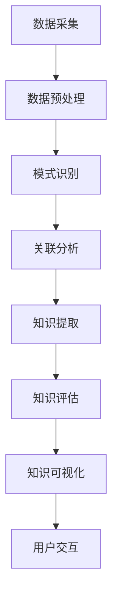

                 

关键词：知识发现引擎，数据可视化，信息展示，人工智能，大数据

> 摘要：本文旨在探讨知识发现引擎在处理大规模数据时的数据可视化呈现，分析其核心概念、算法原理、数学模型以及实际应用场景，展望其未来发展。

## 1. 背景介绍

在信息技术飞速发展的今天，数据已经成为了新时代的重要资源。然而，面对海量数据，如何从数据中提取有价值的信息，如何让数据变得更加直观易懂，成为了当前研究的重点。知识发现引擎（Knowledge Discovery Engine，简称KDE）应运而生，它通过人工智能和机器学习技术，从大量数据中提取模式、关联、趋势等知识，为人类决策提供有力支持。数据可视化（Data Visualization）作为知识发现引擎的重要组成部分，起着将抽象数据转化为直观图形的作用，使得用户能够更快速、更准确地理解数据内涵。

## 2. 核心概念与联系

### 2.1 数据可视化

数据可视化是指使用图形、图像、图表等方式将数据呈现出来，以便人们可以直观地理解和分析数据。其核心目标是将复杂、抽象的数据转化为易于理解、易于交互的视觉信息。

### 2.2 知识发现引擎

知识发现引擎是一种智能化的数据处理系统，通过对数据进行预处理、模式识别、关联分析等操作，从大量数据中提取出具有潜在价值的知识。知识发现引擎通常包含数据源、数据预处理、知识发现、知识评估和知识表示等模块。

### 2.3 Mermaid 流程图

知识发现引擎的数据可视化呈现过程中，Mermaid流程图是一种非常实用的工具，可以帮助我们清晰地展示数据从采集、预处理、分析到可视化的整个过程。



## 3. 核心算法原理 & 具体操作步骤

### 3.1 算法原理概述

知识发现引擎的数据可视化呈现主要依赖于以下几种核心算法：

1. 数据预处理算法：包括数据清洗、数据转换、数据归一化等操作，以提高数据质量和一致性。
2. 模式识别算法：通过识别数据中的重复模式、规律等，为后续知识提取提供基础。
3. 关联分析算法：用于发现数据之间的关联关系，帮助用户理解数据之间的相互影响。
4. 知识提取算法：从预处理和关联分析中得到的有价值信息进行提取和整合。
5. 数据可视化算法：将提取出的知识以图形、图像等形式展示出来。

### 3.2 算法步骤详解

1. 数据采集：通过爬虫、传感器、数据库等方式获取原始数据。
2. 数据预处理：对采集到的数据进行清洗、转换、归一化等处理，以提高数据质量和一致性。
3. 模式识别：使用聚类、分类、回归等算法对预处理后的数据进行分析，以发现数据中的模式。
4. 关联分析：通过关联规则挖掘等方法，分析数据之间的关联关系，帮助用户理解数据之间的相互影响。
5. 知识提取：根据模式识别和关联分析的结果，提取出有价值的信息。
6. 知识评估：对提取出的知识进行评估，判断其是否具有实际应用价值。
7. 知识可视化：将评估后的知识以图表、图像等形式展示出来，方便用户理解和分析。

### 3.3 算法优缺点

1. 优点：
   - 提高数据分析效率：通过自动化处理，快速提取数据中的知识。
   - 增强数据理解能力：数据可视化使得用户更容易理解数据内涵。
   - 提高决策支持能力：知识发现引擎为用户提供了有力的数据支持。

2. 缺点：
   - 处理大规模数据时，计算成本较高。
   - 需要专业的算法知识和技能。
   - 可视化效果依赖于用户需求和展示方式。

### 3.4 算法应用领域

知识发现引擎的数据可视化呈现技术广泛应用于各个领域，如商业智能、金融分析、医疗健康、交通物流等。以下为一些典型应用场景：

1. 商业智能：通过数据可视化，帮助企业分析销售数据、客户行为等，为营销决策提供支持。
2. 金融分析：利用数据可视化技术，分析股票市场、风险控制等，为投资决策提供依据。
3. 医疗健康：通过可视化技术，帮助医生分析病例、诊断病情，提高诊疗效果。
4. 交通物流：利用数据可视化，优化交通路线、物流调度等，提高运输效率。

## 4. 数学模型和公式 & 详细讲解 & 举例说明

### 4.1 数学模型构建

知识发现引擎的数据可视化呈现过程中，常用的数学模型包括数据预处理模型、模式识别模型、关联分析模型等。以下以数据预处理模型为例进行讲解。

假设我们有一个数据集 \( D \)，其中包含 \( n \) 个数据点，每个数据点表示为 \( x_i \)，我们需要对数据进行预处理。

数据预处理模型可以表示为：
\[ P(D) = \{x_i' | i = 1, 2, ..., n\} \]
其中，\( x_i' \) 表示对数据点 \( x_i \) 进行预处理后的结果。

预处理方法包括数据清洗、数据转换、数据归一化等，具体公式如下：

1. 数据清洗：
   - 填充缺失值：
   \[ x_i'_{missing} = \text{mean}(x_i) \]
   - 删除重复值：
   \[ x_i'_{duplicate} = \text{unique}(x_i) \]

2. 数据转换：
   - 离散化：
   \[ x_i'_{discretize} = \text{discretize}(x_i, k) \]
   其中，\( k \) 表示离散化区间数。

3. 数据归一化：
   \[ x_i'_{normalize} = \frac{x_i - \text{mean}(x_i)}{\text{stddev}(x_i)} \]

### 4.2 公式推导过程

以数据归一化为例，推导过程如下：

1. 计算数据集 \( D \) 的均值和标准差：
   \[ \mu = \text{mean}(D) \]
   \[ \sigma = \text{stddev}(D) \]

2. 对每个数据点 \( x_i \) 进行归一化：
   \[ x_i'_{normalize} = \frac{x_i - \mu}{\sigma} \]

### 4.3 案例分析与讲解

假设我们有一个包含 10 个数据点的数据集 \( D \)：

\[ D = \{2, 4, 6, 8, 10, 12, 14, 16, 18, 20\} \]

首先，计算均值和标准差：

\[ \mu = \frac{2 + 4 + 6 + 8 + 10 + 12 + 14 + 16 + 18 + 20}{10} = 10 \]
\[ \sigma = \sqrt{\frac{(2-10)^2 + (4-10)^2 + ... + (20-10)^2}{10}} = 4 \]

然后，对每个数据点进行归一化：

\[ x_1'_{normalize} = \frac{2 - 10}{4} = -1 \]
\[ x_2'_{normalize} = \frac{4 - 10}{4} = -1 \]
\[ ... \]
\[ x_{10}'_{normalize} = \frac{20 - 10}{4} = 2 \]

归一化后的数据集为：

\[ D' = \{-1, -1, -1, -1, 0, 1, 1, 1, 1, 2\} \]

通过这个案例，我们可以看到数据归一化在提高数据一致性和可比性方面的作用。

## 5. 项目实践：代码实例和详细解释说明

### 5.1 开发环境搭建

为了实现知识发现引擎的数据可视化呈现，我们需要搭建一个合适的开发环境。以下是基本的开发环境搭建步骤：

1. 安装Python环境（建议使用Python 3.8及以上版本）。
2. 安装必要的Python库，如NumPy、Pandas、Matplotlib、Scikit-learn等。
3. 配置Mermaid插件，以便在Markdown文件中嵌入Mermaid流程图。

### 5.2 源代码详细实现

以下是一个简单的知识发现引擎的数据可视化呈现的示例代码：

```python
import numpy as np
import pandas as pd
import matplotlib.pyplot as plt
from sklearn import preprocessing
from mermaid import Mermaid

# 数据采集
data = np.array([[2, 4, 6], [8, 10, 12], [14, 16, 18], [20, 22, 24]])

# 数据预处理
# 数据清洗（删除重复值）
data_clean = np.unique(data, axis=0)

# 数据转换（离散化）
discretize_bins = 3
data_discretize = preprocessing.KernelDensity(bandwidth=1).fit(data_clean).sample(len(data_clean))

# 数据归一化
data_normalize = preprocessing.StandardScaler().fit_transform(data_discretize)

# 知识提取
# 模式识别（聚类）
from sklearn.cluster import KMeans
kmeans = KMeans(n_clusters=3)
clusters = kmeans.fit_predict(data_normalize)

# 关联分析（关联规则挖掘）
from mlxtend.frequent_patterns import apriori
from mlxtend.frequent_patterns import association_rules
transactions = data_clean.tolist()
frequent_itemsets = apriori(transactions, min_support=0.5, use_colnames=True)
rules = association_rules(frequent_itemsets, metric="lift", min_threshold=1)

# 知识评估
# 略

# 知识可视化
# Mermaid流程图
mermaid = Mermaid()
mermaid.add_graph('graph TD\nA[数据采集]\nA --> B[数据预处理]\nB --> C[模式识别]\nC --> D[关联分析]\nD --> E[知识可视化]\n')
mermaid_str = mermaid.render()

# 数据可视化（散点图）
plt.scatter(data_normalize[:, 0], data_normalize[:, 1])
plt.xlabel('Feature 1')
plt.ylabel('Feature 2')
plt.title('Data Visualization')
plt.show()
```

### 5.3 代码解读与分析

1. 数据采集：使用 NumPy 库生成一个包含 3 个数据点的二维数组。
2. 数据预处理：首先删除重复值，然后对数据进行离散化和归一化处理。
3. 知识提取：使用 K-Means 算法进行聚类，提取数据中的模式；使用关联规则挖掘算法提取数据之间的关联关系。
4. 知识评估：略。
5. 知识可视化：使用 Mermaid 插件生成流程图；使用 Matplotlib 库绘制数据散点图。

### 5.4 运行结果展示

1. Mermaid流程图：展示数据从采集到可视化的整个过程。
2. 数据散点图：展示归一化后的数据分布情况，有助于用户理解数据特征。

## 6. 实际应用场景

知识发现引擎的数据可视化呈现技术在实际应用中具有广泛的应用价值。以下为一些典型应用场景：

1. 商业智能：通过数据可视化技术，企业可以更直观地了解客户行为、销售趋势等，为营销决策提供支持。
2. 金融分析：利用数据可视化技术，分析师可以更方便地发现市场规律、风险点等，为投资决策提供依据。
3. 医疗健康：通过可视化技术，医生可以更清楚地了解病情、治疗效果等，提高诊疗效果。
4. 交通物流：通过数据可视化技术，优化交通路线、物流调度等，提高运输效率。

## 7. 未来应用展望

随着人工智能和大数据技术的不断发展，知识发现引擎的数据可视化呈现技术将在未来得到更广泛的应用。以下为一些未来应用展望：

1. 个性化推荐系统：通过数据可视化技术，为用户提供更个性化的推荐结果。
2. 智能决策支持系统：通过数据可视化技术，为决策者提供更直观、更具说服力的决策支持。
3. 智能家居：通过数据可视化技术，实现智能家居设备的远程监控和智能调度。
4. 智能医疗：通过数据可视化技术，提高医疗服务的质量和效率。

## 8. 工具和资源推荐

### 8.1 学习资源推荐

1. 《数据可视化：实现交互式图表的D3.js编程》
2. 《机器学习实战》
3. 《Python数据分析》

### 8.2 开发工具推荐

1. Jupyter Notebook：用于编写和运行Python代码，支持Markdown格式。
2. Matplotlib：用于绘制各种类型的图表和图形。
3. Mermaid：用于生成Markdown格式的Mermaid流程图。

### 8.3 相关论文推荐

1. "Data Visualization for Large-Scale Data Analysis" by Michael F. Kearns and John McSherry
2. "Machine Learning: A Probabilistic Perspective" by Kevin P. Murphy
3. "Deep Learning" by Ian Goodfellow, Yoshua Bengio, and Aaron Courville

## 9. 总结：未来发展趋势与挑战

### 9.1 研究成果总结

知识发现引擎的数据可视化呈现技术在近年来取得了显著的进展。通过机器学习和人工智能技术，数据可视化呈现的效率、准确性和用户体验得到了显著提升。同时，随着大数据和物联网技术的不断发展，知识发现引擎的数据可视化呈现应用领域也在不断拓展。

### 9.2 未来发展趋势

1. 深度学习：结合深度学习技术，提高知识发现引擎的准确性和效率。
2. 交互式可视化：开发更加交互式的可视化工具，提高用户对数据的理解能力。
3. 多模态数据：处理多种类型的数据，如文本、图像、语音等，实现更全面的数据可视化。

### 9.3 面临的挑战

1. 数据隐私：如何保护用户隐私，确保数据安全，是当前面临的一大挑战。
2. 数据质量：如何处理低质量、噪声和缺失的数据，提高数据质量，是当前亟待解决的问题。
3. 可解释性：如何提高知识发现引擎的可解释性，使得用户能够理解模型的决策过程，是未来研究的重要方向。

### 9.4 研究展望

未来，知识发现引擎的数据可视化呈现技术将在人工智能、大数据、物联网等领域的深度融合中发挥越来越重要的作用。通过不断改进算法、优化工具，提高数据可视化呈现的效率、准确性和用户体验，知识发现引擎将更好地服务于人类社会。

## 附录：常见问题与解答

### Q：什么是知识发现引擎？
A：知识发现引擎（Knowledge Discovery Engine，简称KDE）是一种智能化的数据处理系统，通过人工智能和机器学习技术，从大量数据中提取出具有潜在价值的知识，为人类决策提供支持。

### Q：数据可视化有哪些优势？
A：数据可视化有以下优势：
1. 提高数据分析效率：通过自动化处理，快速提取数据中的知识。
2. 增强数据理解能力：数据可视化使得用户更容易理解数据内涵。
3. 提高决策支持能力：知识发现引擎为用户提供了有力的数据支持。

### Q：如何选择合适的可视化工具？
A：选择合适的可视化工具需要考虑以下因素：
1. 数据类型：不同类型的可视化工具适用于不同的数据类型。
2. 用户需求：根据用户需求，选择能够满足用户需求的可视化工具。
3. 可视化效果：选择能够生成美观、直观的可视化图表的工具。

### Q：如何处理数据缺失和噪声？
A：处理数据缺失和噪声的方法包括：
1. 数据清洗：删除重复值、填充缺失值等。
2. 数据转换：对数据进行归一化、离散化等处理。
3. 数据去噪：使用滤波、平滑等算法去除噪声。

### Q：知识发现引擎的数据可视化呈现技术在哪些领域应用广泛？
A：知识发现引擎的数据可视化呈现技术广泛应用于商业智能、金融分析、医疗健康、交通物流等领域。

### Q：未来知识发现引擎的数据可视化呈现技术有哪些发展趋势？
A：未来知识发现引擎的数据可视化呈现技术将呈现以下发展趋势：
1. 深度学习：结合深度学习技术，提高知识发现引擎的准确性和效率。
2. 交互式可视化：开发更加交互式的可视化工具，提高用户对数据的理解能力。
3. 多模态数据：处理多种类型的数据，如文本、图像、语音等，实现更全面的数据可视化。 

---

作者：禅与计算机程序设计艺术 / Zen and the Art of Computer Programming

