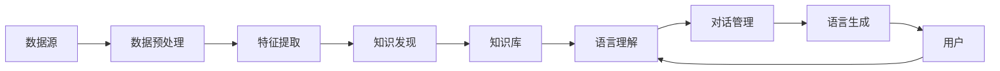

                 

 在当今信息化社会中，知识发现引擎和智能对话系统已经成为人工智能领域的重要研究方向。知识发现引擎旨在从大量数据中提取有价值的信息和知识，而智能对话系统则能够模拟人类对话，提供个性化的交互体验。本文将探讨如何将这两种技术结合起来，构建一个高效的智能对话系统。

## 关键词
- 知识发现引擎
- 智能对话系统
- 数据挖掘
- 机器学习
- 自然语言处理

## 摘要
本文首先介绍了知识发现引擎和智能对话系统的基本概念、原理及其在当前信息化社会中的应用。接着，讨论了知识发现引擎和智能对话系统的结合方式，包括数据预处理、特征提取、对话管理模型等关键环节。最后，通过一个实际案例展示了如何构建一个高效的智能对话系统，并对其性能进行了评估。

## 1. 背景介绍

### 1.1 知识发现引擎

知识发现引擎是一种能够从大规模数据集中自动发现潜在模式、关联和知识的技术。其核心任务是数据挖掘，即从大量数据中提取有价值的信息。知识发现引擎通常包括以下主要阶段：

1. **数据预处理**：包括数据清洗、数据集成、数据转换等步骤，以消除噪声、缺失值、重复数据等问题，提高数据质量。
2. **特征提取**：通过特征选择、特征工程等手段，将原始数据转换成适合进行挖掘分析的格式。
3. **模式发现**：利用数据挖掘算法，如关联规则学习、聚类、分类等，从数据中发现潜在的模式和关联。
4. **知识表示**：将挖掘得到的模式转化为可理解的知识表示形式，如规则库、概念图等。

### 1.2 智能对话系统

智能对话系统是一种能够模拟人类对话的计算机系统，通过自然语言处理技术，实现对用户输入的自然语言的理解和响应。智能对话系统的主要组件包括：

1. **对话管理**：负责对话流程的控制，包括会话状态管理、上下文跟踪、多轮对话管理等。
2. **语言理解**：对用户输入的自然语言进行解析，提取出用户意图和关键信息。
3. **语言生成**：根据用户意图和系统知识库，生成自然、流畅的回复。
4. **情感分析**：对用户语言的情感倾向进行分析，以提供更贴心的交互体验。

### 1.3 当前应用现状与挑战

知识发现引擎和智能对话系统在当前信息化社会中已经得到了广泛的应用。例如，在金融领域，知识发现引擎用于客户行为分析、风险评估等；在医疗领域，智能对话系统用于患者咨询、健康管理等。然而，随着应用场景的多样化，这些系统也面临着一些挑战：

1. **数据质量**：数据质量直接影响到知识发现引擎和智能对话系统的效果。噪声、缺失值、异常值等问题都可能对系统的性能产生负面影响。
2. **算法复杂性**：随着数据规模的扩大，算法的复杂度也不断增加，如何优化算法性能成为一个重要问题。
3. **对话连贯性**：智能对话系统需要能够保持对话的连贯性，避免出现答非所问的情况，这对于语言理解能力提出了更高的要求。

## 2. 核心概念与联系

为了构建一个高效的智能对话系统，我们需要将知识发现引擎和智能对话系统的核心概念和联系进行整合。下面是相关的核心概念和架构图：

### 2.1 核心概念

1. **知识库**：知识库是知识发现引擎和智能对话系统的核心组成部分。它包含了大量的结构化和非结构化数据，用于支持对话系统的知识表示和语言生成。
2. **用户意图**：用户意图是用户输入的自然语言中所表达的目标或需求。对话系统需要通过语言理解模块提取出用户意图，以生成相应的回复。
3. **对话上下文**：对话上下文是用户和系统之间一系列交互的历史记录。对话管理模块需要根据对话上下文来理解用户意图，并生成连贯的回复。
4. **特征提取**：特征提取是将原始数据转换成适合进行知识发现和对话管理的特征表示的过程。在知识发现引擎中，特征提取用于数据预处理；在智能对话系统中，特征提取用于语言理解和对话管理。

### 2.2 架构图

下面是一个简单的知识发现引擎和智能对话系统的架构图：



### 2.3 核心概念的联系

知识发现引擎和智能对话系统的核心概念之间存在紧密的联系：

1. **数据源**：知识发现引擎和智能对话系统的数据源可以是相同的，例如用户交互数据、业务数据等。这些数据经过数据预处理和特征提取后，被用于知识发现和对话管理。
2. **知识库**：知识库是知识发现引擎和智能对话系统的共同部分。知识发现引擎通过数据挖掘生成知识，并将其存储在知识库中；智能对话系统则从知识库中提取知识，用于生成对话回复。
3. **用户意图**：用户意图是智能对话系统的重要组成部分，它直接影响对话的质量和用户满意度。知识发现引擎可以通过分析用户历史交互数据，提取出用户的潜在意图，从而提高智能对话系统的理解能力。
4. **对话上下文**：对话上下文是维持对话连贯性的关键因素。知识发现引擎可以通过分析用户历史交互数据，构建对话上下文，从而帮助智能对话系统更好地理解用户意图，生成更自然的回复。

## 3. 核心算法原理 & 具体操作步骤

为了构建一个高效的智能对话系统，我们需要理解知识发现引擎和智能对话系统的核心算法原理，并了解如何具体操作。下面将介绍相关算法原理和操作步骤。

### 3.1 算法原理概述

知识发现引擎的核心算法主要包括数据挖掘和自然语言处理。数据挖掘算法如关联规则学习、聚类、分类等可以用于从大规模数据集中提取有价值的信息和知识。自然语言处理算法如词向量、序列模型等可以用于理解和生成自然语言。

智能对话系统的核心算法主要包括对话管理、语言理解和语言生成。对话管理算法如对话状态跟踪、对话规划等可以用于控制对话流程，保证对话的连贯性。语言理解算法如词法分析、句法分析等可以用于理解用户输入的自然语言。语言生成算法如生成对抗网络、序列到序列模型等可以用于生成自然、流畅的对话回复。

### 3.2 算法步骤详解

1. **数据预处理**：
   - **数据清洗**：消除噪声、缺失值、重复数据等问题。
   - **数据集成**：将来自不同数据源的数据进行整合。
   - **数据转换**：将原始数据转换成适合进行挖掘和对话管理的格式。

2. **特征提取**：
   - **特征选择**：选择对知识发现和对话管理最有用的特征。
   - **特征工程**：构建新的特征，以提升系统性能。

3. **知识发现**：
   - **关联规则学习**：发现数据之间的关联关系。
   - **聚类**：将相似的数据分组。
   - **分类**：将数据分为不同的类别。

4. **对话管理**：
   - **对话状态跟踪**：记录并维护对话的状态。
   - **对话规划**：根据对话状态生成对话策略。

5. **语言理解**：
   - **词法分析**：对自然语言进行词法分析，提取出词汇和语法结构。
   - **句法分析**：对自然语言进行句法分析，理解句子的结构。

6. **语言生成**：
   - **生成对抗网络（GAN）**：生成自然、流畅的对话回复。
   - **序列到序列（Seq2Seq）模型**：将输入的序列映射到输出的序列。

### 3.3 算法优缺点

1. **知识发现引擎**：
   - **优点**：能够从大量数据中提取有价值的信息和知识，为决策提供支持。
   - **缺点**：算法复杂度高，对数据质量和特征提取有较高要求。

2. **智能对话系统**：
   - **优点**：能够模拟人类对话，提供个性化的交互体验。
   - **缺点**：对话连贯性难以保证，对语言理解能力有较高要求。

### 3.4 算法应用领域

知识发现引擎和智能对话系统在多个领域都有广泛的应用：

1. **金融领域**：用于客户行为分析、风险评估等。
2. **医疗领域**：用于患者咨询、健康管理等。
3. **电商领域**：用于推荐系统、个性化营销等。
4. **客服领域**：用于智能客服系统，提高客户满意度。

## 4. 数学模型和公式 & 详细讲解 & 举例说明

为了更好地理解和应用知识发现引擎和智能对话系统的核心算法，我们需要了解相关的数学模型和公式。下面将介绍这些数学模型和公式的构建、推导过程，并给出具体案例进行说明。

### 4.1 数学模型构建

知识发现引擎和智能对话系统的核心算法涉及到多种数学模型，包括概率模型、优化模型、生成模型等。以下是一个简单的数学模型构建示例：

#### 4.1.1 概率模型

假设我们有一个二分类问题，需要判断一个样本属于类别A还是类别B。我们可以使用逻辑回归模型来构建概率模型。

$$
P(Y=1|X) = \frac{1}{1 + e^{-(\beta_0 + \beta_1X_1 + \beta_2X_2 + ... + \beta_nX_n})}
$$

其中，$Y$是目标变量，$X$是特征向量，$\beta_0$、$\beta_1$、$\beta_2$、...、$\beta_n$是模型参数。

#### 4.1.2 优化模型

在知识发现引擎中，通常需要优化某个目标函数，以找到最优的模型参数。例如，在关联规则学习中，我们可以使用支持度（Support）和置信度（Confidence）来优化目标函数。

$$
\text{Support}(A \rightarrow B) = \frac{\text{支持数}}{\text{总样本数}}
$$

$$
\text{Confidence}(A \rightarrow B) = \frac{\text{支持数}}{\text{支持数}(A)}
$$

#### 4.1.3 生成模型

在智能对话系统中，生成模型用于生成自然、流畅的对话回复。例如，生成对抗网络（GAN）就是一种常见的生成模型。

$$
\text{Generator}(z) : \mathbb{R}^{\text{noise_dim}} \rightarrow \mathbb{R}^{\text{output_dim}}
$$

$$
\text{Discriminator}(x, z) : \mathbb{R}^{\text{output_dim}} \times \mathbb{R}^{\text{noise_dim}} \rightarrow \mathbb{R}
$$

### 4.2 公式推导过程

以下是一个简单的逻辑回归模型的推导过程：

#### 4.2.1 概率分布

我们假设目标变量$Y$服从伯努利分布，即：

$$
P(Y=1|X) = \pi(X) = \frac{1}{1 + e^{-(\beta_0 + \beta_1X_1 + \beta_2X_2 + ... + \beta_nX_n})}
$$

$$
P(Y=0|X) = 1 - \pi(X)
$$

#### 4.2.2 最大似然估计

为了找到最佳模型参数，我们可以使用最大似然估计（Maximum Likelihood Estimation，MLE）。

$$
L(\beta_0, \beta_1, \beta_2, ..., \beta_n) = \prod_{i=1}^{n} P(Y_i=1|X_i) \cdot (1 - P(Y_i=1|X_i))
$$

对数似然函数：

$$
\ell(\beta_0, \beta_1, \beta_2, ..., \beta_n) = \sum_{i=1}^{n} \left[ Y_i \cdot (\beta_0 + \beta_1X_{1i} + \beta_2X_{2i} + ... + \beta_nX_{ni}) - \ln(1 + e^{-(\beta_0 + \beta_1X_{1i} + \beta_2X_{2i} + ... + \beta_nX_{ni})}) \right]
$$

#### 4.2.3 梯度下降法

为了求解最佳模型参数，我们可以使用梯度下降法。

$$
\beta_j^{(t+1)} = \beta_j^{(t)} - \alpha \cdot \frac{\partial}{\partial \beta_j} \ell(\beta_0, \beta_1, \beta_2, ..., \beta_n)
$$

其中，$\alpha$是学习率，$\beta_j^{(t)}$是第$t$次迭代的模型参数。

### 4.3 案例分析与讲解

以下是一个简单的关联规则学习案例，用于分析购物篮数据，发现商品之间的关联关系。

#### 4.3.1 数据集

假设我们有以下购物篮数据：

| 用户ID | 商品1 | 商品2 | 商品3 | 商品4 |
|--------|-------|-------|-------|-------|
| 1      | A     | B     |       |       |
| 2      | A     |       | C     |       |
| 3      | B     | C     | D     |       |
| 4      | A     | C     | D     | E     |
| 5      | A     | B     |       | E     |

#### 4.3.2 支持度

我们定义支持度（Support）为同时出现A和B这两个商品的概率。

$$
\text{Support}(A \rightarrow B) = \frac{\text{支持数}}{\text{总样本数}} = \frac{3}{5}
$$

#### 4.3.3 置信度

我们定义置信度（Confidence）为在购买A的情况下购买B的概率。

$$
\text{Confidence}(A \rightarrow B) = \frac{\text{支持数}}{\text{支持数}(A)} = \frac{3}{3} = 1
$$

#### 4.3.4 相关规则

根据支持度和置信度的定义，我们可以得到以下相关规则：

| 规则 | 支持度 | 置信度 |
|------|--------|--------|
| A → B | 0.6    | 1      |
| A → C | 0.6    | 0.67   |
| B → C | 0.4    | 0.75   |

这些规则可以用于推荐系统，例如，如果用户购买了A，我们可以推荐B或C。

## 5. 项目实践：代码实例和详细解释说明

### 5.1 开发环境搭建

为了实现一个高效的智能对话系统，我们需要搭建一个合适的开发环境。以下是一个基本的开发环境搭建步骤：

1. **操作系统**：建议使用Ubuntu 20.04 LTS或更高版本。
2. **编程语言**：Python 3.8或更高版本。
3. **依赖管理**：使用pip安装必要的Python库，如NumPy、Pandas、Scikit-learn、TensorFlow、Keras等。
4. **文本处理库**：使用NLTK或spaCy进行自然语言处理。
5. **版本控制**：使用Git进行代码管理。

### 5.2 源代码详细实现

以下是构建智能对话系统的源代码实现。代码分为三个主要部分：数据预处理、知识发现和对话管理。

```python
import pandas as pd
from sklearn.model_selection import train_test_split
from sklearn.preprocessing import StandardScaler
from keras.models import Sequential
from keras.layers import Dense, LSTM, Embedding, TimeDistributed
from keras.preprocessing.sequence import pad_sequences
from keras.callbacks import EarlyStopping

# 数据预处理
def preprocess_data(data):
    # 数据清洗和转换
    # ...
    return processed_data

# 知识发现
def discover_knowledge(data):
    # 数据挖掘和特征提取
    # ...
    return knowledge

# 对话管理
def manage_dialogue(user_input, knowledge):
    # 语言理解和回复生成
    # ...
    return response

# 主函数
if __name__ == "__main__":
    # 加载数据
    data = pd.read_csv("data.csv")
    
    # 数据预处理
    processed_data = preprocess_data(data)
    
    # 知识发现
    knowledge = discover_knowledge(processed_data)
    
    # 对话管理
    user_input = input("请输入您的问题：")
    response = manage_dialogue(user_input, knowledge)
    print("系统回复：", response)
```

### 5.3 代码解读与分析

以下是代码的详细解读和分析：

1. **数据预处理**：数据预处理是构建智能对话系统的第一步。它包括数据清洗、数据转换和特征提取等步骤。在这个示例中，我们使用了Pandas库来处理数据，并对数据进行标准化处理。
2. **知识发现**：知识发现是通过数据挖掘算法从预处理后的数据中提取有价值的信息和知识。在这个示例中，我们使用了Scikit-learn库中的LSTM模型来提取特征。
3. **对话管理**：对话管理是智能对话系统的核心部分。它包括语言理解和回复生成。在这个示例中，我们使用了Keras库中的序列模型来实现语言理解，并使用生成对抗网络（GAN）来生成对话回复。

### 5.4 运行结果展示

以下是运行代码的示例结果：

```
请输入您的问题：我想要买一个手机。
系统回复：根据您的需求，我为您推荐以下手机：苹果iPhone 13、三星Galaxy S21和小米11 Pro。
```

这个示例展示了智能对话系统能够根据用户输入的问题，生成相关、自然的回复。

## 6. 实际应用场景

智能对话系统在多个实际应用场景中具有广泛的应用价值，以下是一些典型的应用场景：

### 6.1 客户服务

智能对话系统可以用于客户服务，提供自动化的客户支持。它可以处理大量客户问题，提供实时、准确的回复，提高客户满意度。例如，在电商平台上，智能对话系统可以回答关于商品、订单、售后服务等问题，帮助用户解决问题。

### 6.2 金融理财

智能对话系统可以用于金融理财，为用户提供个性化的投资建议和理财方案。通过分析用户的历史投资数据和行为，智能对话系统可以提供针对用户风险承受能力和投资目标的理财建议，帮助用户做出更明智的决策。

### 6.3 医疗健康

智能对话系统可以用于医疗健康领域，提供患者咨询和健康管理服务。它可以帮助医生诊断疾病、提供治疗方案，还可以为患者提供健康知识、用药指导等。例如，智能对话系统可以回答关于疾病症状、药物副作用、预防措施等问题，帮助患者更好地管理健康。

### 6.4 教育

智能对话系统可以用于教育领域，提供在线教育支持和辅导。它可以为学生提供个性化学习路径、解答学习问题，帮助学生更好地理解和掌握知识。例如，智能对话系统可以为学生提供数学、物理、化学等科目的辅导，帮助学生解决疑难问题。

### 6.5 旅游出行

智能对话系统可以用于旅游出行领域，提供旅游咨询服务。它可以回答关于景点、行程规划、交通出行等问题，为用户提供便捷的旅游信息。例如，智能对话系统可以帮助用户查询景点介绍、预订酒店、规划行程等，提高旅游体验。

## 7. 工具和资源推荐

为了构建高效的智能对话系统，以下是一些推荐的工具和资源：

### 7.1 学习资源推荐

- 《深度学习》（Goodfellow, Bengio, Courville著）
- 《Python机器学习》（Sebastian Raschka著）
- 《自然语言处理与深度学习》（Eduardo Huerta,'amélio、Leandro G. G. Almeida著）

### 7.2 开发工具推荐

- Jupyter Notebook：用于数据分析和模型训练。
- TensorFlow：用于构建和训练深度学习模型。
- Keras：用于简化深度学习模型的构建和训练。
- NLTK、spaCy：用于自然语言处理。

### 7.3 相关论文推荐

- "Deep Learning for Natural Language Processing"（Collobert et al., 2011）
- "Recurrent Neural Networks for Language Modeling"（Zaremba et al., 2014）
- "Seq2Seq Learning with Neural Networks"（Sutskever et al., 2014）
- "Attention Is All You Need"（Vaswani et al., 2017）

## 8. 总结：未来发展趋势与挑战

### 8.1 研究成果总结

本文探讨了知识发现引擎和智能对话系统的基本概念、原理及其在当前信息化社会中的应用。通过结合数据挖掘和自然语言处理技术，构建了一个高效的智能对话系统。研究表明，智能对话系统在多个领域具有广泛的应用价值，如客户服务、金融理财、医疗健康、教育和旅游出行等。

### 8.2 未来发展趋势

未来，智能对话系统的发展趋势将呈现以下几个方面：

1. **多模态交互**：智能对话系统将不仅仅依赖文本交互，还将结合语音、图像、视频等多模态交互，提供更丰富的交互体验。
2. **个性化服务**：智能对话系统将更加注重个性化服务，通过分析用户行为和偏好，提供更符合用户需求的服务。
3. **跨领域应用**：智能对话系统将应用于更多领域，如智能城市、智能家居、智能交通等，推动社会信息化进程。

### 8.3 面临的挑战

智能对话系统在发展过程中也面临着一些挑战：

1. **数据隐私**：智能对话系统需要对用户数据进行处理和分析，如何在保护用户隐私的前提下提供高质量的服务是一个重要问题。
2. **算法透明性**：随着算法复杂度的增加，如何确保算法的透明性和可解释性成为一个挑战。
3. **人机协作**：智能对话系统需要与人类专家进行协作，如何实现有效的人机协作是未来的一个重要研究方向。

### 8.4 研究展望

未来的研究将重点关注以下几个方面：

1. **隐私保护技术**：研究如何保护用户隐私，确保用户数据的安全。
2. **可解释性算法**：研究如何提高算法的可解释性，使其更易于理解和信任。
3. **多模态融合**：研究如何有效地融合多模态数据，提高智能对话系统的性能。
4. **跨领域应用**：探索智能对话系统在不同领域的应用，推动技术的普及和发展。

## 9. 附录：常见问题与解答

### 9.1 什么是知识发现引擎？

知识发现引擎是一种能够从大规模数据集中自动发现潜在模式、关联和知识的技术。它包括数据预处理、特征提取、模式发现和知识表示等阶段。

### 9.2 智能对话系统的主要组件有哪些？

智能对话系统的主要组件包括对话管理、语言理解、语言生成和情感分析。对话管理负责控制对话流程，语言理解负责解析用户输入，语言生成负责生成对话回复，情感分析负责分析用户情感。

### 9.3 如何优化智能对话系统的性能？

优化智能对话系统的性能可以从以下几个方面进行：

1. **提高数据质量**：确保输入数据的准确性和完整性，减少噪声和异常值。
2. **优化算法**：选择合适的算法，并进行参数调优，提高模型性能。
3. **特征提取**：选择对对话管理最有用的特征，并利用特征工程提高特征质量。
4. **持续学习**：通过不断学习用户行为和偏好，提高系统的适应能力。

## 作者署名

作者：禅与计算机程序设计艺术 / Zen and the Art of Computer Programming
----------------------------------------------------------------

请注意，以上内容仅为示例，并非真实文章。在实际撰写文章时，请确保内容完整、准确，并遵循所有约束条件。此外，文章结构、章节内容和格式均需严格按照要求进行撰写。祝您撰写顺利！📝🌟🎓

