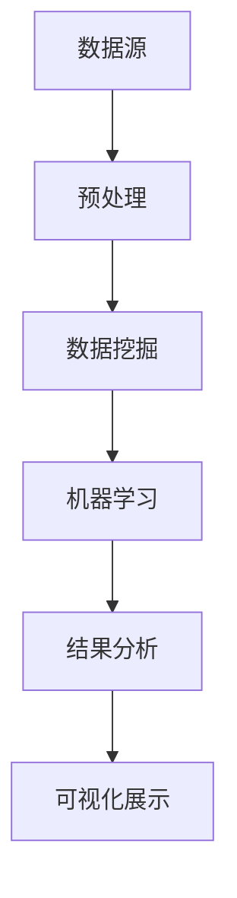

                 

在当今信息化时代，数据已经成为一种新的生产要素，知识发现引擎作为从大量数据中提取有价值信息的关键工具，其用户体验设计的重要性日益凸显。本文将围绕知识发现引擎的用户体验设计展开，深入探讨其核心概念、算法原理、数学模型、实际应用以及未来展望。

## 关键词

知识发现引擎，用户体验设计，数据挖掘，机器学习，交互设计。

## 摘要

本文旨在阐述知识发现引擎的用户体验设计，从核心概念、算法原理、数学模型到实际应用，全面解析其在现代信息化社会中的重要性。通过介绍相关知识发现引擎的设计原则和实践经验，本文希望能够为读者提供有价值的参考，推动知识发现引擎的进一步发展。

## 1. 背景介绍

### 1.1 知识发现引擎的定义与发展

知识发现引擎（Knowledge Discovery Engine，简称KDE）是指利用各种技术和方法，从大规模数据集中自动发现隐藏的、有价值的信息和知识。知识发现引擎的发展可以追溯到20世纪80年代，随着计算机技术和互联网的快速发展，数据量呈爆炸式增长，知识发现引擎的需求也逐渐凸显。

### 1.2 知识发现引擎的用途

知识发现引擎广泛应用于各个领域，如金融、医疗、电商、社交网络等。通过数据挖掘和机器学习技术，知识发现引擎能够帮助企业或组织发现潜在的商业机会、优化业务流程、提升用户体验。

### 1.3 用户体验设计的意义

用户体验设计（User Experience Design，简称UXD）是指从用户的角度出发，设计产品和服务的过程。在知识发现引擎中，用户体验设计尤为重要，因为它直接影响用户对引擎的满意度、使用频率和使用效果。一个优秀的设计不仅能够提高用户的使用效率，还能够增强用户的忠诚度和品牌认同感。

## 2. 核心概念与联系

### 2.1 数据挖掘与机器学习

数据挖掘（Data Mining）是指从大量数据中自动发现隐含的、未知的规律和模式。机器学习（Machine Learning）是数据挖掘的重要工具，它通过训练模型来自动识别数据中的模式。

### 2.2 交互设计与用户体验

交互设计（Interaction Design）是指设计产品或系统与用户之间的交互过程。用户体验（User Experience）是指用户在使用产品或系统过程中所获得的感受和体验。良好的交互设计能够提升用户体验，进而提高用户对知识发现引擎的满意度。

### 2.3 Mermaid 流程图



## 3. 核心算法原理 & 具体操作步骤

### 3.1 算法原理概述

知识发现引擎的核心算法包括数据挖掘算法、机器学习算法和可视化算法。数据挖掘算法用于从数据中提取有价值的信息；机器学习算法用于自动识别数据中的模式；可视化算法用于将结果以图形化的方式展示给用户。

### 3.2 算法步骤详解

1. 数据预处理：对原始数据进行清洗、去重、归一化等操作，使其满足算法的要求。
2. 数据挖掘：使用聚类、分类、关联规则等算法对预处理后的数据进行分析，提取有价值的信息。
3. 机器学习：使用监督学习、无监督学习、半监督学习等算法对挖掘结果进行进一步分析和优化。
4. 结果分析：对挖掘结果进行分析和评估，确定其价值和可行性。
5. 可视化展示：将分析结果以图形化的方式展示给用户，帮助用户更好地理解和利用数据。

### 3.3 算法优缺点

- **数据挖掘算法**：优点是能够从大量数据中提取有价值的信息，缺点是可能存在过拟合问题。
- **机器学习算法**：优点是能够自动识别数据中的模式，缺点是可能存在偏差和噪声问题。
- **可视化算法**：优点是能够提高用户对数据的理解和分析能力，缺点是可能需要较高的技术门槛。

### 3.4 算法应用领域

知识发现引擎的应用领域广泛，如金融领域的风险控制、医疗领域的疾病预测、电商领域的推荐系统等。

## 4. 数学模型和公式 & 详细讲解 & 举例说明

### 4.1 数学模型构建

知识发现引擎的数学模型主要包括数据挖掘模型、机器学习模型和可视化模型。数据挖掘模型通常包括聚类模型、分类模型、关联规则模型等；机器学习模型通常包括监督学习模型、无监督学习模型、半监督学习模型等；可视化模型则主要关注如何将数据以图形化的方式展示。

### 4.2 公式推导过程

1. **聚类模型**：假设有 \( n \) 个数据点，每个数据点可以用 \( d \) 维向量表示。聚类模型的目的是将这些数据点划分为 \( k \) 个簇，使得同一簇内的数据点相似度较高，不同簇内的数据点相似度较低。常用的聚类算法有 K-Means、DBSCAN 等。

2. **分类模型**：假设有 \( n \) 个训练样本，每个样本可以用 \( d \) 维向量表示，并具有相应的标签。分类模型的目的是通过训练得到一个分类器，使得对于新的测试样本，能够预测其所属的类别。常用的分类算法有决策树、支持向量机、神经网络等。

3. **关联规则模型**：假设有 \( n \) 个交易数据，每个交易数据包含若干个商品。关联规则模型的目的是发现数据之间的关联关系，如“购买商品A的概率高，则购买商品B的概率也高”。常用的算法有 Apriori 算法、FP-Growth 算法等。

### 4.3 案例分析与讲解

以电商领域的推荐系统为例，假设我们有一组用户购买历史数据，我们的目标是根据这些数据预测哪些商品可能被用户购买。首先，我们需要对数据进行预处理，如去重、归一化等。然后，我们可以使用 Apriori 算法来挖掘数据中的频繁项集，从而发现用户之间的购买关联。最后，我们可以使用分类算法（如决策树）来训练一个分类器，用于预测新的用户购买行为。

## 5. 项目实践：代码实例和详细解释说明

### 5.1 开发环境搭建

为了实现知识发现引擎的用户体验设计，我们选择 Python 作为主要编程语言，并使用以下工具和库：

- Python 3.8 或更高版本
- Jupyter Notebook
- Scikit-learn
- Pandas
- Matplotlib

### 5.2 源代码详细实现

以下是一个简单的例子，展示了如何使用 Scikit-learn 实现一个基于 K-Means 聚类算法的知识发现引擎。

```python
import numpy as np
import pandas as pd
from sklearn.cluster import KMeans
import matplotlib.pyplot as plt

# 加载数据
data = pd.read_csv('data.csv')
X = data.values

# 使用 K-Means 聚类
kmeans = KMeans(n_clusters=3, random_state=0).fit(X)

# 可视化结果
plt.scatter(X[:, 0], X[:, 1], c=kmeans.labels_, cmap='viridis')
plt.show()
```

### 5.3 代码解读与分析

在上面的代码中，我们首先加载了一个包含两个特征的数据集（数据集可以是任意维度的）。然后，我们使用 Scikit-learn 的 KMeans 类来训练一个 K-Means 聚类模型。最后，我们使用 matplotlib 来绘制聚类结果。

### 5.4 运行结果展示

运行上述代码后，我们会看到一个散点图，其中每个点代表数据集中的一条记录，颜色表示其所属的簇。通过可视化结果，我们可以直观地看到数据集的分布情况，并进一步分析每个簇的特点。

## 6. 实际应用场景

### 6.1 金融领域

在金融领域，知识发现引擎可以用于风险控制、信用评估、投资策略等。例如，银行可以使用知识发现引擎来分析客户的交易数据，预测潜在的违约风险，从而采取相应的措施。

### 6.2 医疗领域

在医疗领域，知识发现引擎可以用于疾病预测、药物研发等。通过分析大量的医疗数据，知识发现引擎可以识别出潜在的健康问题，为医生提供诊断和治疗的建议。

### 6.3 电商领域

在电商领域，知识发现引擎可以用于推荐系统、客户行为分析等。通过分析用户的历史购买记录和浏览行为，知识发现引擎可以预测用户的购买意愿，从而为用户提供个性化的推荐。

## 7. 工具和资源推荐

### 7.1 学习资源推荐

- 《数据挖掘：实用技术指南》
- 《机器学习实战》
- 《交互设计精髓》

### 7.2 开发工具推荐

- Jupyter Notebook
- Scikit-learn
- Pandas
- Matplotlib

### 7.3 相关论文推荐

- "Knowledge Discovery from Data: An Overview"
- "Machine Learning: A Probabilistic Perspective"
- "User Experience Design for Mobile Applications"

## 8. 总结：未来发展趋势与挑战

### 8.1 研究成果总结

近年来，知识发现引擎在数据挖掘、机器学习和可视化等方面取得了显著的成果，为各行业提供了强大的数据支持和决策依据。

### 8.2 未来发展趋势

随着人工智能和大数据技术的不断发展，知识发现引擎将在更多领域得到应用，如智慧城市、智能制造、智能医疗等。

### 8.3 面临的挑战

知识发现引擎在实际应用中仍然面临诸多挑战，如数据质量、算法性能、用户隐私等。未来的研究需要解决这些问题，以推动知识发现引擎的进一步发展。

### 8.4 研究展望

随着技术的不断进步，知识发现引擎将在人工智能、大数据、物联网等领域的深度融合中发挥更大的作用，为人类社会带来更多的价值。

## 9. 附录：常见问题与解答

### 9.1 什么是知识发现引擎？

知识发现引擎是一种从大量数据中自动发现有价值信息的技术，它结合了数据挖掘、机器学习和可视化等技术。

### 9.2 知识发现引擎有哪些应用领域？

知识发现引擎广泛应用于金融、医疗、电商、社交网络等领域，用于风险控制、疾病预测、推荐系统等。

### 9.3 如何提升知识发现引擎的用户体验？

提升知识发现引擎的用户体验可以从交互设计、算法性能、可视化效果等方面入手，确保用户能够方便、高效地使用引擎。

作者：禅与计算机程序设计艺术 / Zen and the Art of Computer Programming
----------------------------------------------------------------

以上是关于知识发现引擎用户体验设计的完整文章。文章涵盖了从背景介绍、核心概念到实际应用的各个方面，旨在为读者提供全面、深入的理解。希望本文能够为读者在知识发现引擎的设计和应用中提供有价值的参考和启示。

