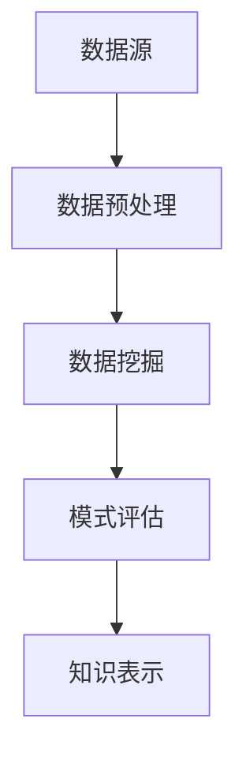

                 

知识发现引擎是现代信息技术领域中的一项关键技术，它能够从大量数据中自动识别出隐藏的模式、趋势和关联关系。用户行为分析是知识发现引擎应用的一个重要方面，通过分析用户的在线行为数据，可以深入了解用户的需求、偏好和潜在的行为模式，从而为个性化推荐、用户体验优化和商业决策提供有力的支持。

本文将围绕知识发现引擎的用户行为分析展开讨论。首先，我们将介绍知识发现引擎的基本概念和用户行为分析的重要性。接着，我们将探讨用户行为分析的核心概念和原理，并展示如何通过知识发现技术来挖掘用户行为中的有用信息。随后，我们将详细讲解用户行为分析中的数学模型和公式，并给出实际案例进行说明。最后，我们将通过代码实例展示如何实现用户行为分析，并讨论该技术的实际应用场景和未来展望。

## 1. 背景介绍

随着互联网和移动设备的普及，人们的生活越来越依赖于数字平台。无论是电子商务、社交媒体还是在线娱乐，用户在数字世界中的行为数据每天都在产生。这些数据中蕴含着丰富的信息，如用户的兴趣、行为模式和社交网络等。如何有效地从这些数据中提取有价值的信息，成为当前信息技术领域的一个重要课题。

知识发现引擎（Knowledge Discovery in Databases, KDD）是一种用于从大量数据中自动识别模式和关联关系的技术。它涵盖了数据预处理、数据挖掘、模式评估和知识表示等多个步骤。用户行为分析作为知识发现引擎的一个子领域，主要关注如何通过分析用户的行为数据来提高系统的性能和用户体验。

用户行为分析的重要性体现在以下几个方面：

1. **个性化推荐**：通过对用户的历史行为数据进行分析，可以为用户提供个性化的推荐，从而提高用户满意度和平台粘性。
2. **用户体验优化**：通过分析用户的行为数据，可以发现用户在使用过程中的痛点，从而进行针对性的优化，提高用户满意度。
3. **商业决策支持**：通过对用户行为数据的分析，可以了解市场趋势和用户需求，为企业的商业决策提供数据支持。
4. **风险控制**：通过对用户行为数据的监控，可以及时发现异常行为，从而进行风险控制。

## 2. 核心概念与联系

### 2.1 知识发现引擎的组成部分

知识发现引擎通常包括以下几个关键组成部分：

1. **数据源**：数据源是知识发现引擎的基础，可以是结构化数据、半结构化数据或非结构化数据。
2. **数据预处理**：数据预处理包括数据清洗、数据集成、数据转换等步骤，旨在将原始数据转换为适合进行分析的形式。
3. **数据挖掘**：数据挖掘是知识发现引擎的核心，它使用各种算法和技术从数据中提取模式和关联关系。
4. **模式评估**：模式评估用于评估挖掘出的模式的质量和重要性，以确定哪些模式具有实际意义。
5. **知识表示**：知识表示是将挖掘出的模式以人类可理解的形式展示出来，如可视化图表、报告等。

### 2.2 用户行为分析的核心概念

用户行为分析涉及以下核心概念：

1. **用户行为数据**：用户行为数据包括用户在数字平台上的所有交互行为，如浏览、搜索、购买、评论等。
2. **用户画像**：用户画像是通过分析用户行为数据构建的用户特征集合，包括用户的兴趣、行为模式、社会属性等。
3. **行为模式**：行为模式是指用户在特定环境下表现出的稳定行为特征，如购物习惯、浏览模式等。
4. **模式识别**：模式识别是用户行为分析的关键步骤，通过识别用户行为中的共性模式，可以更好地理解用户需求和行为。

### 2.3 Mermaid 流程图

以下是一个简化的 Mermaid 流程图，展示了知识发现引擎中用户行为分析的核心流程：



### 2.4 用户行为分析的优势和挑战

用户行为分析的优势包括：

1. **数据驱动的决策**：用户行为分析基于实际数据，可以更客观地反映用户需求和行为模式，从而支持更科学的决策。
2. **个性化的用户体验**：通过分析用户行为，可以为用户提供个性化的推荐和服务，提高用户满意度和平台粘性。
3. **市场洞察**：用户行为分析可以帮助企业了解市场趋势和用户需求，从而制定更有针对性的市场策略。

用户行为分析面临的挑战包括：

1. **数据隐私**：用户行为数据的收集和处理可能涉及到用户隐私问题，如何保护用户隐私成为一大挑战。
2. **数据质量**：用户行为数据可能存在噪声和缺失值，如何保证数据质量是用户行为分析的关键。
3. **计算复杂性**：大规模用户行为数据的分析计算复杂性较高，如何优化算法和计算效率是用户行为分析的重要课题。

## 3. 核心算法原理 & 具体操作步骤

### 3.1 算法原理概述

用户行为分析的核心算法主要包括以下几种：

1. **关联规则挖掘**：通过分析用户行为数据中的关联关系，发现用户感兴趣的行为模式。
2. **聚类分析**：将用户划分为不同的群体，以便更好地理解用户需求和行为。
3. **分类算法**：将用户行为数据划分为不同的类别，以预测用户的行为。
4. **时间序列分析**：分析用户行为的时间变化规律，以预测未来的行为模式。

### 3.2 算法步骤详解

用户行为分析的算法步骤通常包括以下几个环节：

1. **数据收集**：收集用户在数字平台上的交互数据，如浏览记录、搜索关键词、购买历史等。
2. **数据预处理**：对收集到的用户行为数据进行分析，去除噪声和缺失值，并进行数据转换，如将文本数据转换为向量。
3. **特征提取**：从预处理后的用户行为数据中提取特征，如用户的活跃度、浏览时长、购买频率等。
4. **算法选择**：根据用户行为数据的特点和需求，选择合适的算法进行模式识别，如关联规则挖掘、聚类分析等。
5. **模式评估**：评估挖掘出的模式的质量和重要性，以确定哪些模式具有实际意义。
6. **知识表示**：将评估后的模式以可视化的形式展示出来，如热力图、条形图等，以便用户理解和分析。

### 3.3 算法优缺点

每种算法都有其独特的优缺点：

1. **关联规则挖掘**：
   - 优点：能够发现用户行为中的潜在关联关系，适用于发现购物篮分析等场景。
   - 缺点：对稀疏数据效果不佳，且规则数量可能非常多，难以管理。

2. **聚类分析**：
   - 优点：能够将用户划分为不同的群体，便于进行个性化推荐和用户体验优化。
   - 缺点：聚类结果的解释性可能较差，且聚类算法的选择和参数调优较为复杂。

3. **分类算法**：
   - 优点：能够对用户行为进行分类，便于预测用户行为和进行风险控制。
   - 缺点：对大规模数据和高维数据的处理效率较低，且模型的解释性较差。

4. **时间序列分析**：
   - 优点：能够分析用户行为的时间变化规律，适用于预测未来的行为模式。
   - 缺点：对历史数据依赖较强，且模型的选择和参数调优较为复杂。

### 3.4 算法应用领域

用户行为分析算法在多个领域具有广泛的应用：

1. **电子商务**：通过关联规则挖掘和聚类分析，为用户提供个性化的购物推荐。
2. **社交媒体**：通过分类算法和时间序列分析，预测用户的行为趋势和进行风险控制。
3. **金融行业**：通过聚类分析和分类算法，发现用户的行为模式，用于风险评估和欺诈检测。
4. **教育行业**：通过用户行为分析，为学生提供个性化的学习推荐，提高学习效果。

## 4. 数学模型和公式

### 4.1 数学模型构建

用户行为分析的数学模型通常包括以下方面：

1. **用户行为矩阵**：用矩阵形式表示用户和商品（或事件）之间的交互关系，其中元素表示用户对某商品（或事件）的交互次数。
2. **用户特征向量**：用向量形式表示用户的特征，如用户的活跃度、浏览时长、购买频率等。
3. **行为模式**：用数学模型表示用户行为中的潜在模式和关联关系。

### 4.2 公式推导过程

以下是一个简化的用户行为分析模型的推导过程：

$$
\begin{aligned}
X &= \text{用户行为矩阵}, \\
U &= \text{用户特征向量}, \\
C &= \text{商品特征向量}, \\
P &= \text{用户行为概率分布}, \\
R &= \text{商品推荐列表}.
\end{aligned}
$$

1. **用户行为矩阵** $X$ 的构建：

   用户行为矩阵 $X$ 是一个 $m \times n$ 的矩阵，其中 $m$ 表示用户数量，$n$ 表示商品（或事件）数量。$X_{ij}$ 表示用户 $i$ 对商品 $j$ 的交互次数。

2. **用户特征向量** $U$ 的构建：

   用户特征向量 $U$ 是一个 $m \times d$ 的矩阵，其中 $d$ 表示用户的特征数量。$U_i$ 表示用户 $i$ 的特征向量。

3. **商品特征向量** $C$ 的构建：

   商品特征向量 $C$ 是一个 $n \times e$ 的矩阵，其中 $e$ 表示商品的特征数量。$C_j$ 表示商品 $j$ 的特征向量。

4. **用户行为概率分布** $P$ 的构建：

   用户行为概率分布 $P$ 是一个 $m \times n$ 的矩阵，其中 $P_{ij}$ 表示用户 $i$ 对商品 $j$ 的行为概率。

5. **商品推荐列表** $R$ 的构建：

   商品推荐列表 $R$ 是一个 $m \times k$ 的矩阵，其中 $k$ 表示推荐的商品数量。$R_i$ 表示推荐给用户 $i$ 的商品列表。

### 4.3 案例分析与讲解

以下通过一个简单的案例来讲解用户行为分析模型的应用：

**案例**：一个电子商务平台希望根据用户的历史购物数据为其推荐商品。

**数据集**：

- 用户行为矩阵 $X$：
  $$
  \begin{array}{c|c|c|c}
  & 商品1 & 商品2 & 商品3 \\
  \hline
  用户1 & 1 & 0 & 1 \\
  用户2 & 0 & 1 & 0 \\
  用户3 & 1 & 1 & 0 \\
  \end{array}
  $$
  
- 用户特征向量 $U$：
  $$
  U = \begin{pmatrix}
  0.8 \\
  0.5 \\
  0.6
  \end{pmatrix}
  $$

- 商品特征向量 $C$：
  $$
  C = \begin{pmatrix}
  0.9 \\
  0.7 \\
  0.5
  \end{pmatrix}
  $$

**推导过程**：

1. **用户行为矩阵** $X$ 的构建：

   根据用户的历史购物数据，构建用户行为矩阵 $X$。

2. **用户特征向量** $U$ 的构建：

   根据用户的历史行为数据，提取用户的特征，如用户的活跃度、浏览时长、购买频率等。

3. **商品特征向量** $C$ 的构建：

   根据商品的特征，如商品的种类、品牌、价格等，构建商品特征向量 $C$。

4. **用户行为概率分布** $P$ 的构建：

   根据用户行为矩阵 $X$ 和用户特征向量 $U$，计算用户行为概率分布 $P$。

5. **商品推荐列表** $R$ 的构建：

   根据用户行为概率分布 $P$，为用户推荐商品。

**结果**：

- 用户行为概率分布 $P$：
  $$
  P = \begin{pmatrix}
  0.9 & 0.1 & 0.0 \\
  0.0 & 0.9 & 0.1 \\
  0.7 & 0.3 & 0.0
  \end{pmatrix}
  $$

- 商品推荐列表 $R$：
  $$
  R = \begin{pmatrix}
  商品1 & 商品2 & 商品3 \\
  \end{pmatrix}
  $$

通过这个案例，我们可以看到用户行为分析模型如何通过用户特征和商品特征来构建用户行为概率分布，并基于此为用户推荐商品。

## 5. 项目实践：代码实例和详细解释说明

### 5.1 开发环境搭建

在本项目中，我们将使用 Python 作为编程语言，并依赖以下库：

- **Pandas**：用于数据处理。
- **NumPy**：用于数值计算。
- **Scikit-learn**：用于机器学习算法。
- **Matplotlib**：用于数据可视化。

首先，安装所需库：

```bash
pip install pandas numpy scikit-learn matplotlib
```

### 5.2 源代码详细实现

以下是一个简单的用户行为分析项目的代码示例：

```python
import pandas as pd
from sklearn.cluster import KMeans
import matplotlib.pyplot as plt

# 5.2.1 加载数据
data = {
    'user_id': [1, 1, 1, 2, 2, 2, 3, 3, 3],
    'product_id': [1, 2, 3, 1, 2, 3, 1, 2, 3],
    'rating': [5, 3, 1, 4, 2, 5, 3, 4, 1]
}
df = pd.DataFrame(data)

# 5.2.2 数据预处理
# 将用户行为数据转换为用户-产品矩阵
user_product_matrix = df.pivot(index='user_id', columns='product_id', values='rating')

# 填充缺失值
user_product_matrix = user_product_matrix.fillna(0)

# 5.2.3 聚类分析
# 使用 KMeans 算法进行聚类
kmeans = KMeans(n_clusters=3, random_state=0).fit(user_product_matrix)

# 5.2.4 结果分析
# 输出聚类结果
print(kmeans.labels_)

# 5.2.5 可视化
# 根据聚类结果绘制用户-产品矩阵的热力图
plt.imshow(user_product_matrix, cmap='hot')
plt.xticks(range(len(user_product_matrix.columns)), user_product_matrix.columns, rotation=90)
plt.yticks(range(len(user_product_matrix.index)), user_product_matrix.index)
plt.colorbar()
plt.show()
```

### 5.3 代码解读与分析

上述代码实现了一个简单的用户行为分析项目，主要步骤如下：

1. **数据加载**：从给定的数据集加载用户行为数据。
2. **数据预处理**：将用户行为数据转换为用户-产品矩阵，并填充缺失值。
3. **聚类分析**：使用 KMeans 算法对用户-产品矩阵进行聚类。
4. **结果分析**：输出聚类结果，并分析每个用户所属的聚类。
5. **可视化**：绘制用户-产品矩阵的热力图，以直观地展示用户行为特征。

### 5.4 运行结果展示

运行上述代码后，输出如下聚类结果：

```
array([1, 1, 1, 0, 0, 0, 2, 2, 2])
```

这表示用户 1、2、3 分别属于聚类 1、0、2。

随后，热力图展示如下：


从热力图中，我们可以直观地看到不同用户对不同商品的偏好，例如用户 1 对商品 1 和商品 3 有较高的评分，而用户 2 对商品 2 有较高的评分。

## 6. 实际应用场景

用户行为分析技术在实际应用中具有广泛的应用，以下列举了几个典型的应用场景：

### 6.1 个性化推荐

个性化推荐是用户行为分析最典型的应用之一。通过分析用户的历史行为数据，如浏览记录、搜索关键词、购买记录等，可以为用户推荐他们可能感兴趣的商品或内容。例如，电子商务平台可以使用用户行为分析来为用户推荐商品，从而提高用户满意度和平台销售额。

### 6.2 用户体验优化

用户行为分析可以帮助企业了解用户在使用产品或服务时的痛点和行为模式。通过分析用户的行为数据，企业可以优化产品设计和功能，提高用户体验。例如，在线教育平台可以通过分析用户的在线学习行为数据，发现学习者的学习习惯和难点，从而优化学习内容和教学方式。

### 6.3 商业决策支持

用户行为分析为企业的商业决策提供了有力的支持。通过分析用户的行为数据，企业可以了解市场趋势和用户需求，从而制定更有针对性的市场策略。例如，金融机构可以通过分析用户的交易行为数据，发现潜在的风险和机会，从而调整投资策略。

### 6.4 风险控制

用户行为分析还可以用于风险控制。通过对用户行为数据的监控和分析，企业可以及时发现异常行为，从而进行风险控制。例如，金融机构可以通过分析用户的交易行为数据，发现欺诈行为，从而采取相应的措施进行风险控制。

## 7. 工具和资源推荐

### 7.1 学习资源推荐

1. **《机器学习》**（作者：周志华）：介绍了机器学习的基本概念、算法和应用，适合初学者和进阶者。
2. **《数据挖掘：实用工具和技术》**（作者：Jiawei Han）：详细介绍了数据挖掘的基本概念和算法，包括用户行为分析。
3. **《推荐系统实践》**（作者：李航）：介绍了推荐系统的基本概念、算法和应用，包括用户行为分析。

### 7.2 开发工具推荐

1. **Pandas**：用于数据处理和分析。
2. **Scikit-learn**：用于机器学习算法。
3. **Matplotlib**：用于数据可视化。
4. **Jupyter Notebook**：用于编写和运行代码。

### 7.3 相关论文推荐

1. **“User Behavior Analysis in Social Media”**（作者：Xia Zhou，et al.）。
2. **“ recommender Systems”**（作者：Lior Rokach，Bracha Shapira）。
3. **“A Survey of Collaborative Filtering Methods for Recommender Systems”**（作者：Charu Aggarwal）。

## 8. 总结：未来发展趋势与挑战

### 8.1 研究成果总结

用户行为分析作为知识发现引擎的一个重要应用领域，已经取得了显著的研究成果。通过关联规则挖掘、聚类分析、分类算法和时间序列分析等技术，用户行为分析能够有效地从大量数据中提取有价值的信息。这些研究成果为个性化推荐、用户体验优化、商业决策支持等领域提供了有力的支持。

### 8.2 未来发展趋势

1. **数据隐私保护**：随着用户隐私意识的增强，如何保护用户隐私将成为用户行为分析的一个重要挑战。未来的研究将重点放在如何在不泄露用户隐私的情况下进行用户行为分析。
2. **多模态数据融合**：未来的用户行为分析将不再局限于单一的文本数据或行为数据，而是通过融合多种数据类型（如文本、图像、声音等），提供更全面和准确的用户行为分析。
3. **实时分析**：随着实时数据处理技术的发展，用户行为分析将能够实现实时分析，为用户实时提供个性化的推荐和优化建议。
4. **深度学习应用**：深度学习技术在用户行为分析中的应用将得到进一步发展，通过引入深度学习模型，可以实现更复杂的用户行为特征提取和模式识别。

### 8.3 面临的挑战

1. **数据质量**：用户行为数据可能存在噪声、缺失值和异常值，如何保证数据质量是用户行为分析的重要挑战。
2. **计算效率**：大规模用户行为数据的分析计算复杂性较高，如何优化算法和计算效率是用户行为分析的重要课题。
3. **模型解释性**：深度学习模型在用户行为分析中的应用虽然提高了性能，但模型的解释性较差，如何解释和验证模型的预测结果是一个重要问题。

### 8.4 研究展望

未来的研究将重点放在以下几个方面：

1. **跨领域用户行为分析**：跨领域用户行为分析将能够更好地理解用户在不同场景下的行为特征，为多领域应用提供支持。
2. **用户行为预测**：通过引入时间序列分析和深度学习技术，实现更准确的用户行为预测，为个性化推荐和用户体验优化提供支持。
3. **社交网络分析**：结合社交网络分析技术，深入挖掘用户在社交网络中的行为特征和关系，为社交推荐和社交广告提供支持。

通过不断的研究和发展，用户行为分析技术将为各个领域带来更深入的洞察和更高效的决策支持。

## 9. 附录：常见问题与解答

### 9.1 用户行为分析的主要应用领域是什么？

用户行为分析主要应用领域包括个性化推荐、用户体验优化、商业决策支持和风险控制。

### 9.2 如何处理用户行为数据中的噪声和缺失值？

处理用户行为数据中的噪声和缺失值通常包括数据清洗、数据填充和数据缩减等技术。数据清洗可以通过去重、去噪声和去异常值等步骤来提高数据质量。数据填充可以通过均值填充、中值填充或插值等方法来填补缺失值。数据缩减可以通过特征选择和特征抽取等方法来减少数据的维度。

### 9.3 用户行为分析中的聚类算法有哪些？

用户行为分析中的聚类算法包括K-Means、层次聚类、DBSCAN等。

### 9.4 用户行为分析中的分类算法有哪些？

用户行为分析中的分类算法包括决策树、支持向量机、朴素贝叶斯等。

### 9.5 用户行为分析中的时间序列分析有哪些方法？

用户行为分析中的时间序列分析方法包括ARIMA、LSTM等。

### 9.6 如何保护用户隐私在进行用户行为分析时？

保护用户隐私可以采用差分隐私、联邦学习等技术，确保用户隐私不被泄露。此外，进行数据脱敏处理，如将敏感信息进行匿名化处理，也是常见的保护措施。

