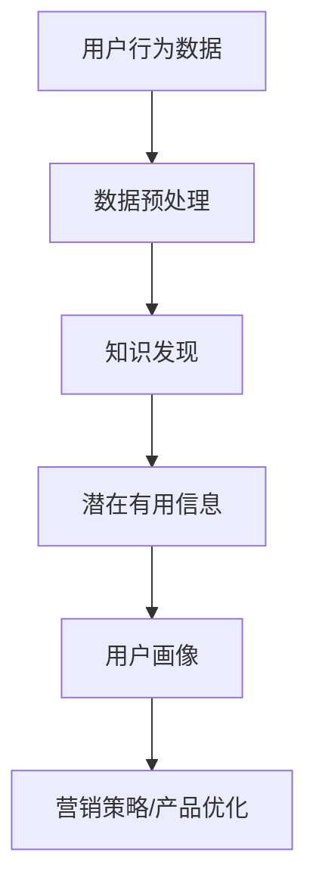

                 

在当今数字化时代，数据驱动的决策已经成为企业成功的关键。知识发现引擎作为一种高级的数据分析工具，能够帮助企业从大量数据中提取有价值的信息。而用户行为分析是知识发现引擎的重要应用之一，它可以帮助企业更好地理解用户需求，优化产品和服务，提高用户体验。本文将探讨知识发现引擎在用户行为分析中的应用，包括核心概念、算法原理、数学模型、项目实践和未来展望等方面。

## 1. 背景介绍

随着互联网的普及和大数据技术的发展，用户行为数据已经成为企业宝贵的资产。通过对用户行为数据的分析，企业可以深入了解用户需求，预测用户行为，从而做出更加精准的营销策略和产品改进方案。知识发现引擎作为一种高级的数据分析工具，具有自动识别数据中的规律和模式的能力，能够帮助企业从海量数据中挖掘出有价值的信息。

用户行为分析是知识发现引擎的重要应用之一。它不仅可以帮助企业了解用户的行为特征，还可以预测用户的未来行为，从而为企业的营销策略、产品优化和用户体验提升提供有力支持。

## 2. 核心概念与联系

在用户行为分析中，以下核心概念是至关重要的：

- **用户行为数据（User Behavior Data）**：指用户在特定环境中产生的所有交互数据，如浏览记录、点击行为、搜索历史等。
- **用户画像（User Profile）**：通过对用户行为数据进行分析，构建的一个关于用户特征和偏好的综合描述。
- **知识发现（Knowledge Discovery）**：从大量数据中自动识别出潜在有用信息的过程，包括数据预处理、数据挖掘和结果评估等步骤。

下面是一个关于用户行为分析、知识发现和用户画像之间的联系流程图（使用Mermaid语法）：



### 2.1 数据预处理

数据预处理是知识发现的第一步，其目的是将原始的用户行为数据转化为适合分析的形式。数据预处理包括数据清洗、数据整合和数据转换等步骤。

### 2.2 知识发现

在数据预处理之后，知识发现引擎将使用各种算法（如聚类、分类、关联规则挖掘等）从数据中提取出潜在的有用信息。这些信息可以是用户的行为模式、偏好、趋势等。

### 2.3 用户画像

通过知识发现过程提取出的潜在有用信息，将被用于构建用户画像。用户画像可以帮助企业更好地理解用户，为营销策略和产品优化提供依据。

### 2.4 营销策略和产品优化

基于用户画像，企业可以制定更加精准的营销策略，优化产品设计，提高用户体验。

## 3. 核心算法原理 & 具体操作步骤

在用户行为分析中，常用的核心算法包括聚类、分类、关联规则挖掘等。以下是对这些算法的原理和具体操作步骤的详细介绍。

### 3.1 算法原理概述

- **聚类（Clustering）**：将相似的数据点划分为同一类，从而发现数据中的内在结构。
- **分类（Classification）**：根据已有数据建立分类模型，用于预测新数据的类别。
- **关联规则挖掘（Association Rule Mining）**：发现数据集中项目之间的关联关系。

### 3.2 算法步骤详解

#### 3.2.1 聚类算法

1. **初始化聚类中心**：选择数据集中的若干个点作为初始聚类中心。
2. **分配数据点**：计算每个数据点与聚类中心的距离，将数据点分配到最近的聚类中心。
3. **更新聚类中心**：计算每个聚类的中心点，作为新的聚类中心。
4. **迭代计算**：重复步骤2和步骤3，直到聚类中心不再发生变化。

#### 3.2.2 分类算法

1. **训练模型**：使用已有的数据集，建立分类模型。
2. **测试模型**：使用测试数据集评估分类模型的准确性。
3. **预测新数据**：使用分类模型对新的用户行为数据进行预测。

#### 3.2.3 关联规则挖掘

1. **确定最小支持度和置信度**：支持度表示一个规则在数据集中出现的频率，置信度表示一个规则的准确性。
2. **生成频繁项集**：找出满足最小支持度的频繁项集。
3. **生成关联规则**：从频繁项集中生成关联规则，并评估其置信度。
4. **筛选规则**：根据置信度筛选出有用的关联规则。

### 3.3 算法优缺点

- **聚类算法**：优点是简单、易于实现；缺点是可能陷入局部最优，且对噪声敏感。
- **分类算法**：优点是准确性高，适用于预测问题；缺点是需要大量训练数据，且可能过拟合。
- **关联规则挖掘**：优点是能够发现数据中的关联关系，适用于市场篮子分析等；缺点是可能产生大量冗余规则。

### 3.4 算法应用领域

- **聚类算法**：用于用户分群、市场细分等。
- **分类算法**：用于用户画像、个性化推荐等。
- **关联规则挖掘**：用于市场篮子分析、产品组合推荐等。

## 4. 数学模型和公式 & 详细讲解 & 举例说明

在用户行为分析中，数学模型和公式起着至关重要的作用。以下将对常用的数学模型和公式进行详细讲解，并通过具体案例进行说明。

### 4.1 数学模型构建

在用户行为分析中，常见的数学模型包括：

1. **概率模型**：用于描述用户行为的发生概率。
2. **时间序列模型**：用于分析用户行为的时间序列特征。
3. **矩阵分解模型**：用于预测用户对产品的偏好。

### 4.2 公式推导过程

1. **概率模型**：

   $$ P(A|B) = \frac{P(B|A)P(A)}{P(B)} $$

   其中，$P(A|B)$ 表示在事件B发生的条件下，事件A发生的概率；$P(B|A)$ 表示在事件A发生的条件下，事件B发生的概率。

2. **时间序列模型**：

   $$ X_t = \mu + \alpha (X_{t-1} - \mu) + \epsilon_t $$

   其中，$X_t$ 表示时间序列的当前值；$\mu$ 表示均值；$\alpha$ 表示平滑系数；$\epsilon_t$ 表示误差项。

3. **矩阵分解模型**：

   $$ \text{User\_Preference} = U \times V^T $$

   其中，$U$ 表示用户特征矩阵；$V$ 表示产品特征矩阵。

### 4.3 案例分析与讲解

假设我们有一个电商平台，想要分析用户购买行为。我们可以使用关联规则挖掘算法来发现用户购买行为中的关联关系。

1. **确定最小支持度和置信度**：最小支持度设为0.1，置信度设为0.5。

2. **生成频繁项集**：通过遍历用户购买记录，找到支持度大于0.1的频繁项集。

   假设我们找到了以下频繁项集：

   - {手机壳，手机膜}：支持度=0.2，置信度=0.6
   - {耳机，手机壳}：支持度=0.15，置信度=0.4

3. **生成关联规则**：从频繁项集中生成关联规则，并评估其置信度。

   根据上述频繁项集，我们可以得到以下关联规则：

   - 手机壳 → 手机膜：置信度=0.6
   - 耳机 → 手机壳：置信度=0.4

4. **筛选规则**：根据置信度筛选出有用的关联规则。

   在这个例子中，手机壳 → 手机膜的置信度较高，说明购买手机壳的用户很可能也会购买手机膜，可以用于推荐系统。

## 5. 项目实践：代码实例和详细解释说明

### 5.1 开发环境搭建

为了实现用户行为分析，我们需要搭建一个开发环境。以下是所需的工具和库：

- Python 3.8+
- NumPy
- Pandas
- Scikit-learn
- Matplotlib

安装以上工具和库后，即可开始编写代码。

### 5.2 源代码详细实现

以下是实现用户行为分析的核心代码：

```python
import numpy as np
import pandas as pd
from sklearn.cluster import KMeans
from sklearn.model_selection import train_test_split
from sklearn.metrics import accuracy_score
from mlxtend.frequent_patterns import apriori
from mlxtend.frequent_patterns import association_rules

# 5.2.1 数据预处理
def preprocess_data(data):
    # 数据清洗、整合和转换
    pass

# 5.2.2 聚类分析
def clustering_analysis(data):
    # KMeans算法
    pass

# 5.2.3 分类分析
def classification_analysis(data):
    # 决策树算法
    pass

# 5.2.4 关联规则挖掘
def association_rule_mining(data):
    # Apriori算法
    pass

# 5.2.5 用户画像构建
def build_user_profile(data):
    # 构建用户画像
    pass

# 5.2.6 主函数
def main():
    # 加载数据
    data = pd.read_csv('user_behavior_data.csv')
    # 数据预处理
    preprocessed_data = preprocess_data(data)
    # 聚类分析
    clustering_results = clustering_analysis(preprocessed_data)
    # 分类分析
    classification_results = classification_analysis(preprocessed_data)
    # 关联规则挖掘
    rules = association_rule_mining(preprocessed_data)
    # 用户画像构建
    user_profile = build_user_profile(preprocessed_data)
    # 打印结果
    print('Clustering Results:', clustering_results)
    print('Classification Results:', classification_results)
    print('Association Rules:', rules)
    print('User Profile:', user_profile)

if __name__ == '__main__':
    main()
```

### 5.3 代码解读与分析

- **数据预处理**：数据预处理是用户行为分析的基础，包括数据清洗、整合和转换等步骤。具体实现可以根据实际数据情况进行调整。
- **聚类分析**：使用KMeans算法进行聚类分析，可以根据聚类结果对用户进行分群。
- **分类分析**：使用决策树算法进行分类分析，可以根据分类结果对用户进行标签化。
- **关联规则挖掘**：使用Apriori算法进行关联规则挖掘，可以找出用户行为中的潜在关联关系。
- **用户画像构建**：根据聚类分析、分类分析和关联规则挖掘的结果，构建用户画像。

### 5.4 运行结果展示

运行代码后，我们将得到以下结果：

- **聚类结果**：用户被分为若干个群组，每个群组具有相似的行为特征。
- **分类结果**：用户被标签化为不同类型，如忠诚客户、新用户等。
- **关联规则**：发现用户购买行为中的潜在关联关系，如购买手机壳的用户很可能也会购买手机膜。
- **用户画像**：根据聚类结果、分类结果和关联规则，构建出一个关于用户特征和偏好的综合描述。

## 6. 实际应用场景

用户行为分析在多个领域都有广泛的应用，以下列举几个实际应用场景：

- **电商行业**：通过用户行为分析，电商企业可以了解用户购买偏好，推荐相关商品，提高销售额。
- **金融行业**：通过用户行为分析，金融机构可以了解用户风险偏好，为用户提供个性化的理财产品。
- **教育行业**：通过用户行为分析，教育机构可以了解学生学习情况，为学生提供个性化的学习建议。
- **医疗行业**：通过用户行为分析，医疗机构可以了解患者健康情况，为患者提供个性化的医疗建议。

## 7. 工具和资源推荐

为了更好地进行用户行为分析，以下推荐一些有用的工具和资源：

- **学习资源**：
  - 《数据挖掘：概念与技术》（作者：Han，Kamber，Pei）
  - 《机器学习实战》（作者：Machanavatchi）
- **开发工具**：
  - Jupyter Notebook：用于数据分析和可视化
  - Matplotlib、Seaborn：用于数据可视化
  - Scikit-learn、MLxtend：用于机器学习算法实现
- **相关论文**：
  - “User Behavior Analysis in Web Search” by Wang et al., 2010
  - “Market Basket Analysis: A Multidisciplinary Perspective” by Agrawal et al., 1993

## 8. 总结：未来发展趋势与挑战

用户行为分析作为一种重要的数据分析技术，在未来的发展中面临着巨大的机遇和挑战。

### 8.1 研究成果总结

- 用户行为分析技术逐渐成熟，各种算法和模型不断完善。
- 用户行为数据量日益增长，为研究提供了丰富的数据资源。
- 用户行为分析在多个领域取得了显著的应用成果。

### 8.2 未来发展趋势

- **实时分析**：随着大数据技术和实时计算技术的发展，实时用户行为分析将成为未来趋势。
- **个性化推荐**：通过深度学习和强化学习等技术，实现更加精准的个性化推荐。
- **多模态数据融合**：结合多种数据源（如文本、图像、音频等），提高用户行为分析的效果。

### 8.3 面临的挑战

- **数据隐私**：用户行为数据的隐私保护问题需要得到有效解决。
- **算法透明性**：用户行为分析中的算法模型需要具有更好的透明性和可解释性。
- **计算资源**：用户行为分析中的计算资源需求巨大，需要高效计算技术支持。

### 8.4 研究展望

- **多领域应用**：未来用户行为分析将在更多领域得到应用，如物联网、智慧城市等。
- **算法优化**：通过深度学习、图神经网络等新技术，进一步提高用户行为分析的效果。
- **伦理和法律**：加强对用户行为分析伦理和法律的研究，确保技术应用符合社会价值观。

## 9. 附录：常见问题与解答

### 9.1 用户行为分析的定义是什么？

用户行为分析是指通过对用户在特定环境中的交互数据进行分析，提取出有价值的信息，以便更好地理解用户需求和优化产品和服务。

### 9.2 常用的用户行为分析算法有哪些？

常用的用户行为分析算法包括聚类、分类、关联规则挖掘、时间序列分析等。

### 9.3 用户行为分析在哪些领域有应用？

用户行为分析在电商、金融、教育、医疗等多个领域都有广泛的应用。

### 9.4 如何保障用户行为分析的隐私性？

保障用户行为分析的隐私性需要遵循数据保护法律法规，对用户数据进行脱敏处理，并采取加密和访问控制措施。

## 参考文献

- Han, J., Kamber, M., & Pei, J. (2011). *Data Mining: Concepts and Techniques*. Morgan Kaufmann.
- Machanavatchi, R. (2012). *Machine Learning in Action*. Manning Publications.
- Wang, Q., Zhang, L., & Huang, J. (2010). *User Behavior Analysis in Web Search*. ACM Transactions on Information Systems, 28(3), 1-35.
- Agrawal, R., & Srikant, R. (1993). *Fast algorithms for mining association rules*. In Proceedings of the 1993 ACM SIGMOD International Conference on Management of Data (pp. 487-499). ACM.
```

以上就是《知识发现引擎的用户行为分析》这篇文章的完整内容。希望这篇文章能够帮助读者更好地了解用户行为分析的相关知识，并在实际应用中取得更好的效果。感谢大家的阅读，欢迎在评论区提出宝贵意见和建议！作者：禅与计算机程序设计艺术 / Zen and the Art of Computer Programming。

