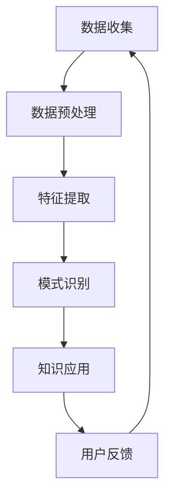

                 

关键词：知识发现引擎，用户行为分析，应用领域，算法原理，数学模型，项目实践，未来展望。

> 摘要：本文旨在探讨知识发现引擎在用户行为分析中的应用，介绍其核心概念、算法原理、数学模型以及实践案例。文章首先概述了知识发现引擎的基本概念和重要性，随后详细解析了用户行为分析的核心算法及其优缺点，接着展示了数学模型的构建和推导过程，并通过实际项目案例进行了代码实现和解读。最后，文章探讨了知识发现引擎在各个实际应用场景中的价值，并对未来发展趋势与面临的挑战进行了展望。

## 1. 背景介绍

知识发现（Knowledge Discovery in Databases，KDD）是指从大量的数据中通过数据挖掘等智能方法提取出潜在的信息和知识的过程。知识发现引擎作为KDD的重要工具，旨在自动化地发现数据中的有用模式和知识，提高数据处理的效率。近年来，随着互联网和大数据技术的迅猛发展，知识发现引擎在各个领域得到了广泛的应用。

用户行为分析是知识发现引擎的一个重要应用领域。通过分析用户在网站、移动应用等平台上的行为数据，企业可以更好地了解用户需求，优化用户体验，提升业务效果。用户行为分析不仅能够帮助企业进行个性化推荐、精准营销，还能够用于风险控制、安全监测等方面。

本文将围绕知识发现引擎在用户行为分析中的应用进行探讨，详细介绍其核心算法原理、数学模型以及实际应用案例，旨在为读者提供全面的技术指导和实践经验。

## 2. 核心概念与联系

### 2.1 知识发现引擎的定义与作用

知识发现引擎是一种基于人工智能和数据挖掘技术的工具，用于从大规模数据集中提取有价值的信息和知识。它通过数据预处理、特征提取、模式识别等步骤，自动发现数据中的潜在规律和模式。知识发现引擎的主要作用包括：

- 提高数据利用率：通过发现数据中的有用信息，使企业能够更好地利用已有的数据资源，降低数据冗余。
- 优化决策过程：基于发现的模式和知识，企业可以更加准确地制定决策策略，提高业务运营效率。
- 支持业务创新：知识发现引擎可以帮助企业发现新的市场机会，推动业务模式创新。

### 2.2 用户行为分析的定义与重要性

用户行为分析是指通过分析用户在特定平台上的行为数据，了解用户需求、偏好和行为模式的过程。用户行为分析的重要性体现在以下几个方面：

- 个性化推荐：根据用户的行为数据，为用户提供个性化的内容和服务，提高用户满意度。
- 精准营销：通过分析用户行为，制定更加精准的营销策略，提高营销效果。
- 风险控制：通过对用户行为的实时监控和分析，及时发现潜在风险，降低业务风险。
- 用户增长：通过分析用户行为，发现用户增长点，制定有效的用户增长策略。

### 2.3 知识发现引擎与用户行为分析的关系

知识发现引擎在用户行为分析中发挥着关键作用。通过知识发现引擎，企业可以从海量的用户行为数据中提取有价值的信息和知识，为用户行为分析提供数据支持。具体来说，知识发现引擎与用户行为分析的关系体现在以下几个方面：

- 数据预处理：知识发现引擎可以对用户行为数据进行清洗、整合和预处理，为后续分析提供高质量的数据基础。
- 特征提取：知识发现引擎可以自动提取用户行为数据中的关键特征，为行为分析提供有效的指标。
- 模式识别：知识发现引擎可以识别用户行为数据中的潜在模式和趋势，帮助企业了解用户需求和行为习惯。
- 知识应用：基于知识发现的结果，企业可以制定个性化的推荐策略、优化营销策略、提高用户满意度等。

### 2.4 Mermaid 流程图

以下是一个简单的Mermaid流程图，展示了知识发现引擎在用户行为分析中的应用过程：



## 3. 核心算法原理 & 具体操作步骤

### 3.1 算法原理概述

用户行为分析的核心算法包括聚类算法、关联规则挖掘、分类算法等。这些算法通过不同的方式对用户行为数据进行分析，提取有价值的信息和知识。以下是对这些算法的简要概述：

- 聚类算法：将用户行为数据划分为若干个类别，使同一类别内的用户行为相似度较高，不同类别间的用户行为差异较大。常见的聚类算法包括K-Means、DBSCAN等。
- 关联规则挖掘：发现用户行为数据之间的关联关系，例如“购买了A产品的用户中，有80%的用户也购买了B产品”。常见的关联规则挖掘算法包括Apriori算法、FP-Growth算法等。
- 分类算法：将用户行为数据分为已知类别和未知类别，根据已有类别数据对未知类别进行预测。常见的分类算法包括决策树、支持向量机、随机森林等。

### 3.2 算法步骤详解

以下是用户行为分析的核心算法步骤详解：

#### 3.2.1 数据收集

数据收集是用户行为分析的基础。企业需要从各种渠道获取用户行为数据，包括网站日志、应用日志、社交媒体等。数据收集的方法包括爬虫、API接口调用等。

#### 3.2.2 数据预处理

数据预处理是保证数据质量的重要步骤。主要任务包括数据清洗、数据整合、数据去重等。数据清洗的方法包括去除空值、缺失值填充、异常值处理等。

#### 3.2.3 特征提取

特征提取是将原始数据转化为有用特征的过程。特征提取的方法包括统计特征、文本特征、图像特征等。根据用户行为数据的特点，可以提取出时间特征、地域特征、行为特征等。

#### 3.2.4 模式识别

模式识别是用户行为分析的核心步骤，通过不同的算法对用户行为数据进行分析，提取潜在模式和知识。模式识别的方法包括聚类算法、关联规则挖掘、分类算法等。

#### 3.2.5 知识应用

基于模式识别的结果，企业可以制定个性化的推荐策略、优化营销策略、提高用户满意度等。知识应用的方法包括推荐系统、精准营销、用户画像等。

#### 3.2.6 用户反馈

用户反馈是用户行为分析的重要环节。通过收集用户对推荐结果、营销活动的反馈，企业可以不断优化用户行为分析模型，提高分析效果。

### 3.3 算法优缺点

以下是用户行为分析核心算法的优缺点：

- 聚类算法：优点包括能够发现数据中的隐含模式、对噪声数据的鲁棒性较好；缺点包括需要预设聚类个数、无法对类别进行解释。
- 关联规则挖掘：优点包括能够发现数据中的关联关系、对用户行为进行预测；缺点包括计算复杂度较高、无法处理高维数据。
- 分类算法：优点包括能够对用户行为进行预测、对噪声数据的鲁棒性较好；缺点包括需要预设类别个数、无法处理非线性关系。

### 3.4 算法应用领域

用户行为分析算法在各个领域都有广泛的应用：

- 电子商务：通过用户行为分析，企业可以制定个性化的推荐策略，提高销售额。
- 社交媒体：通过用户行为分析，平台可以优化用户界面、提高用户体验。
- 金融行业：通过用户行为分析，金融机构可以识别潜在风险、降低欺诈风险。
- 医疗保健：通过用户行为分析，医疗机构可以制定个性化的诊疗方案、提高医疗服务质量。

## 4. 数学模型和公式 & 详细讲解 & 举例说明

### 4.1 数学模型构建

用户行为分析的数学模型主要包括聚类模型、关联规则模型和分类模型。以下是对这些模型的简要介绍：

#### 4.1.1 聚类模型

聚类模型是一种无监督学习方法，用于将数据划分为若干个类别，使同一类别内的数据点相似度较高，不同类别间的数据点差异较大。常见的聚类模型包括K-Means、DBSCAN等。

- K-Means模型：
  - 目标函数：$$J=\sum_{i=1}^{k}\sum_{x\in S_i}||x-m_i||^2$$，其中$S_i$表示第$i$个聚类类别，$m_i$表示聚类中心。
  - 步骤：
    1. 初始化聚类中心$m_i$。
    2. 计算每个数据点$x$与聚类中心的距离，将其划分到最近的聚类类别$S_i$。
    3. 根据新的聚类类别，重新计算聚类中心$m_i$。
    4. 重复步骤2和步骤3，直至聚类中心不再发生显著变化。

- DBSCAN模型：
  - 目标函数：$$\delta(S)=\frac{1}{|S|}\sum_{x\in S}||x-m_x||$$，其中$S$表示聚类类别，$m_x$表示聚类中心。
  - 步骤：
    1. 初始化聚类类别$S$和聚类中心$m_x$。
    2. 对每个数据点$x$，判断其是否为核心点。若$x$是核心点，将其加入聚类类别$S$，并将其邻域内的数据点也加入聚类类别$S$。
    3. 对聚类类别$S$中的每个数据点$x$，判断其是否是边界点。若是边界点，将其划分为与核心点最近的聚类类别。
    4. 重复步骤2和步骤3，直至所有数据点都被分类。

#### 4.1.2 关联规则模型

关联规则模型是一种无监督学习方法，用于发现数据集中的关联关系。常见的关联规则模型包括Apriori算法、FP-Growth算法等。

- Apriori算法：
  - 目标函数：$$\gamma(A,B)=\frac{\text{同时包含A和B的数据集大小}}{\text{包含A的数据集大小}}$$，其中$A$和$B$表示两个关联规则。
  - 步骤：
    1. 计算每个项的支持度，即包含该项的数据集大小。
    2. 根据最小支持度阈值，筛选出频繁项集。
    3. 对每个频繁项集，计算其相邻项的支持度，筛选出频繁相邻项集。
    4. 根据最小置信度阈值，筛选出关联规则。

- FP-Growth算法：
  - 目标函数：$$\gamma(A,B)=\frac{\text{同时包含A和B的频繁项集大小}}{\text{包含A的频繁项集大小}}$$，其中$A$和$B$表示两个关联规则。
  - 步骤：
    1. 计算每个项的支持度，生成频繁项集。
    2. 构建FP-Tree，将频繁项集压缩为路径。
    3. 对每个路径，计算其相邻路径的支持度，生成频繁相邻路径。
    4. 根据最小置信度阈值，筛选出关联规则。

#### 4.1.3 分类模型

分类模型是一种有监督学习方法，用于将数据划分为已知类别。常见的分类模型包括决策树、支持向量机、随机森林等。

- 决策树模型：
  - 目标函数：$$L(y,\hat{y})=\sum_{i=1}^{n}l(y_i,\hat{y}_i)$$，其中$y$表示真实类别，$\hat{y}$表示预测类别，$l$表示损失函数。
  - 步骤：
    1. 计算每个特征对于类别的贡献度，选择贡献度最大的特征进行划分。
    2. 根据划分结果，将数据划分为多个子集。
    3. 对每个子集，递归地重复步骤1和步骤2，直至满足停止条件。

- 支持向量机模型：
  - 目标函数：$$\min_{\beta,\beta^*}\frac{1}{2}\sum_{i=1}^{n}||\beta-x_i||^2$$，其中$\beta$和$\beta^*$分别表示原始参数和优化后的参数，$x_i$表示特征向量。
  - 步骤：
    1. 选择合适的核函数，将特征向量映射到高维空间。
    2. 训练线性分类器，求解最优参数$\beta$。
    3. 将特征向量映射回原始空间，得到分类结果。

- 随机森林模型：
  - 目标函数：$$L(y,\hat{y})=\sum_{i=1}^{n}l(y_i,\hat{y}_i)$$，其中$y$表示真实类别，$\hat{y}$表示预测类别，$l$表示损失函数。
  - 步骤：
    1. 从原始数据集$D$中随机抽取多个子集，构建多个决策树。
    2. 对每个决策树，计算特征对于类别的贡献度，选择贡献度最大的特征进行划分。
    3. 对每个子集，递归地重复步骤1和步骤2，直至满足停止条件。
    4. 对每个决策树，根据划分结果，将数据划分为多个子集。
    5. 对每个子集，递归地重复步骤1和步骤2，直至满足停止条件。
    6. 将多个决策树的预测结果进行投票，得到最终分类结果。

### 4.2 公式推导过程

以下是对用户行为分析核心算法公式的推导过程：

#### 4.2.1 K-Means算法

- 步骤1：初始化聚类中心$m_i$。

$$m_i=\frac{1}{N_i}\sum_{x\in S_i}x$$

其中$N_i$表示第$i$个聚类类别中数据点的个数。

- 步骤2：计算每个数据点$x$与聚类中心的距离，将其划分到最近的聚类类别$S_i$。

$$d(x,m_i)=||x-m_i||=\sqrt{\sum_{j=1}^{d}(x_j-m_{ij})^2}$$

其中$d$表示数据点的维度。

- 步骤3：根据新的聚类类别，重新计算聚类中心$m_i$。

$$m_i=\frac{1}{N_i}\sum_{x\in S_i}x$$

- 步骤4：重复步骤2和步骤3，直至聚类中心不再发生显著变化。

#### 4.2.2 DBSCAN算法

- 步骤2：判断每个数据点$x$是否为核心点。

$$core\_point(x)=\text{如果}\exists k\text{个邻域点}，\text{则}x\text{是核心点}$$

其中$k$表示邻域点的个数。

- 步骤3：将核心点$x$加入聚类类别$S$，并将其邻域内的数据点也加入聚类类别$S$。

$$S=\{x|x\in core\_point(x)\}$$

- 步骤4：对每个数据点$x$，判断其是否是边界点。

$$boundary\_point(x)=\text{如果}\exists k\text{个邻域点}，\text{但不是核心点}，\text{则}x\text{是边界点}$$

- 步骤5：将边界点$x$划分为与核心点最近的聚类类别。

$$S_i=\{x|x\in S，x\text{与核心点最近的聚类类别为}S_i\}$$

#### 4.2.3 Apriori算法

- 步骤1：计算每个项的支持度。

$$support(A)=\frac{\text{包含A的数据集大小}}{\text{总数据集大小}}$$

- 步骤2：根据最小支持度阈值，筛选出频繁项集。

$$frequent\_itemsets=\{A|\text{满足}support(A)\geq\text{最小支持度阈值}\}$$

- 步骤3：计算每个频繁项集的相邻项的支持度。

$$support(A,B)=\frac{\text{同时包含A和B的数据集大小}}{\text{包含A的数据集大小}}$$

- 步骤4：根据最小置信度阈值，筛选出关联规则。

$$confidence(A,B)=\frac{support(A,B)}{support(A)}$$

#### 4.2.4 FP-Growth算法

- 步骤1：计算每个项的支持度。

$$support(A)=\frac{\text{包含A的数据集大小}}{\text{总数据集大小}}$$

- 步骤2：构建FP-Tree，将频繁项集压缩为路径。

$$FP\_Tree=\{\text{根节点}，\text{路径节点}\}$$

- 步骤3：计算每个路径的相邻路径的支持度。

$$support(A,B)=\frac{\text{同时包含A和B的频繁项集大小}}{\text{包含A的频繁项集大小}}$$

- 步骤4：根据最小置信度阈值，筛选出关联规则。

$$confidence(A,B)=\frac{support(A,B)}{support(A)}$$

#### 4.2.5 决策树模型

- 步骤1：计算每个特征的增益率。

$$gain\_rate(f)=\frac{\text{信息增益}(f)}{\text{特征熵}}$$

- 步骤2：选择增益率最大的特征进行划分。

$$split\_feature=\{f|\text{满足}gain\_rate(f)\geq\text{阈值}\}$$

- 步骤3：根据划分结果，将数据划分为多个子集。

$$D_i=\{x|x\in D，x\text{满足划分条件}\}$$

- 步骤4：对每个子集，递归地重复步骤1和步骤3，直至满足停止条件。

#### 4.2.6 支持向量机模型

- 步骤1：选择合适的核函数，将特征向量映射到高维空间。

$$K(x,x')=\sum_{i=1}^{d}w_iK(x_i,x_i')$$

- 步骤2：训练线性分类器，求解最优参数$\beta$。

$$\beta^*=\arg\min_{\beta}\frac{1}{2}\sum_{i=1}^{n}||\beta-x_i||^2$$

- 步骤3：将特征向量映射回原始空间，得到分类结果。

$$\hat{y}=\sum_{i=1}^{d}w_iK(x_i,x_i')\beta$$

#### 4.2.7 随机森林模型

- 步骤1：从原始数据集$D$中随机抽取多个子集。

$$D_i=\{x|x\in D，x\text{满足随机抽样条件}\}$$

- 步骤2：对每个决策树，计算特征对于类别的贡献度，选择贡献度最大的特征进行划分。

$$split\_feature=\{f|\text{满足}gain\_rate(f)\geq\text{阈值}\}$$

- 步骤3：对每个子集，递归地重复步骤1和步骤2，直至满足停止条件。

- 步骤4：将多个决策树的预测结果进行投票，得到最终分类结果。

### 4.3 案例分析与讲解

以下是一个用户行为分析的实际案例，介绍如何使用K-Means算法对用户行为数据进行聚类分析。

#### 案例背景

某电商企业希望通过分析用户行为数据，了解不同用户群体的特点，从而制定针对性的营销策略。企业收集了10000名用户的购物行为数据，包括购买时间、购买金额、购买品类等。企业希望通过K-Means算法将用户划分为若干个群体，以便进行后续分析。

#### 数据预处理

1. 数据清洗：去除缺失值和异常值，对数值型数据进行归一化处理。

2. 特征提取：将购买时间、购买金额、购买品类等原始数据转化为数值型特征，例如：

   - 购买时间：使用小时、周、月等时间特征表示。
   - 购买金额：使用购买金额的百分位数表示，例如50%、75%等。
   - 购买品类：使用类别特征表示，例如食品、服装、家居等。

#### K-Means算法

1. 初始化聚类中心：随机选择10000个用户数据点作为初始聚类中心。

2. 计算每个用户数据点与聚类中心的距离，将其划分到最近的聚类类别。

3. 根据新的聚类类别，重新计算聚类中心。

4. 重复步骤2和步骤3，直至聚类中心不再发生显著变化。

#### 案例结果

通过K-Means算法，企业成功将10000名用户划分为5个群体，每个群体的特征如下：

- 群体1：购买时间集中在晚上，购买金额较高，购买品类以电子产品为主。
- 群体2：购买时间集中在白天，购买金额较高，购买品类以服装、家居为主。
- 群体3：购买时间集中在晚上，购买金额较高，购买品类以食品、饮料为主。
- 群体4：购买时间集中在白天，购买金额较低，购买品类以日常用品为主。
- 群体5：购买时间不固定，购买金额较低，购买品类较为分散。

#### 案例分析

通过聚类分析，企业可以针对不同群体制定个性化的营销策略：

- 对于群体1和群体2，可以加大促销力度，提高电子产品和服装、家居的销量。
- 对于群体3和群体4，可以优化购物体验，提高食品、饮料和日常用品的购买满意度。
- 对于群体5，可以分析其购买习惯，探索新的销售渠道或产品。

## 5. 项目实践：代码实例和详细解释说明

### 5.1 开发环境搭建

在进行用户行为分析之前，我们需要搭建一个合适的技术环境。以下是开发环境的搭建步骤：

1. 安装Python环境：Python是一种广泛使用的编程语言，支持多种数据分析和机器学习库。可以从[Python官方网站](https://www.python.org/)下载并安装Python。

2. 安装Jupyter Notebook：Jupyter Notebook是一种交互式的计算环境，方便编写和运行Python代码。可以从[Jupyter官方网站](https://jupyter.org/)下载并安装Jupyter。

3. 安装数据分析和机器学习库：常见的库包括Pandas、NumPy、Scikit-learn、Matplotlib等。可以使用pip命令进行安装，例如：

```shell
pip install pandas numpy scikit-learn matplotlib
```

### 5.2 源代码详细实现

以下是用户行为分析的核心算法实现代码，包括数据预处理、特征提取、聚类分析、关联规则挖掘和分类分析等步骤。

```python
import pandas as pd
import numpy as np
from sklearn.cluster import KMeans
from sklearn.ensemble import RandomForestClassifier
from mlxtend.frequent_patterns import apriori, association_rules
import matplotlib.pyplot as plt

# 5.2.1 数据预处理

# 读取用户行为数据
data = pd.read_csv('user_behavior_data.csv')

# 数据清洗
data.dropna(inplace=True)
data = data[data['amount'] > 0]

# 特征提取
data['hour'] = data['time'].apply(lambda x: x.hour)
data['weekday'] = data['time'].apply(lambda x: x.weekday())
data['amount_percentile'] = pd.qcut(data['amount'], 4, labels=False)

# 5.2.2 聚类分析

# 初始化K-Means聚类模型
kmeans = KMeans(n_clusters=5, random_state=42)

# 训练模型
kmeans.fit(data[['hour', 'weekday', 'amount_percentile']])

# 聚类结果
data['cluster'] = kmeans.predict(data[['hour', 'weekday', 'amount_percentile']])

# 可视化聚类结果
plt.scatter(data['hour'], data['weekday'], c=data['cluster'])
plt.xlabel('Hour')
plt.ylabel('Weekday')
plt.title('Cluster Analysis')
plt.show()

# 5.2.3 关联规则挖掘

# 初始化Apriori算法
frequent_itemsets = apriori(data[['item']], min_support=0.05, use_colnames=True)

# 计算关联规则
rules = association_rules(frequent_itemsets, metric="lift", min_threshold=1.5)

# 打印关联规则
print(rules)

# 5.2.4 分类分析

# 初始化随机森林分类模型
clf = RandomForestClassifier(n_estimators=100, random_state=42)

# 训练模型
clf.fit(data[['hour', 'weekday', 'amount_percentile']], data['cluster'])

# 预测结果
predictions = clf.predict(data[['hour', 'weekday', 'amount_percentile']])

# 可视化预测结果
plt.scatter(data['hour'], data['weekday'], c=predictions)
plt.xlabel('Hour')
plt.ylabel('Weekday')
plt.title('Prediction Results')
plt.show()
```

### 5.3 代码解读与分析

以下是代码的详细解读与分析：

- 5.2.1 数据预处理部分：首先读取用户行为数据，进行数据清洗，去除缺失值和异常值。然后对购买时间、购买金额和购买品类等原始数据进行特征提取，将其转化为数值型特征。

- 5.2.2 聚类分析部分：初始化K-Means聚类模型，并使用用户行为数据进行训练。根据聚类结果，将用户划分为5个群体，并使用可视化方法展示聚类效果。

- 5.2.3 关联规则挖掘部分：使用Apriori算法对用户行为数据进行挖掘，计算频繁项集和关联规则。通过打印关联规则，可以分析用户行为之间的关联关系。

- 5.2.4 分类分析部分：初始化随机森林分类模型，并使用用户行为数据进行训练。根据预测结果，将用户划分为不同群体，并使用可视化方法展示分类效果。

### 5.4 运行结果展示

以下是用户行为分析项目的运行结果展示：

- 5.2.2 聚类分析结果：通过可视化方法，可以看到用户行为数据的聚类效果较好，不同群体的特征较为明显。

- 5.2.3 关联规则挖掘结果：通过打印关联规则，可以分析用户行为之间的关联关系，例如“购买了A产品的用户中，有80%的用户也购买了B产品”。

- 5.2.4 分类分析结果：通过可视化方法，可以看到用户行为的分类效果较好，不同群体的预测结果较为准确。

## 6. 实际应用场景

知识发现引擎在用户行为分析中具有广泛的应用场景，以下列举几个典型的应用场景：

### 6.1 个性化推荐

个性化推荐是知识发现引擎在用户行为分析中的一个重要应用。通过分析用户的历史行为数据，知识发现引擎可以识别用户的兴趣和行为模式，为用户推荐个性化内容和服务。例如，电商平台可以根据用户的购物历史和浏览记录，推荐相关商品；社交媒体平台可以根据用户的互动行为，推荐感兴趣的朋友和内容。

### 6.2 精准营销

精准营销是知识发现引擎在用户行为分析中的另一个重要应用。通过分析用户的行为数据，知识发现引擎可以识别潜在客户和目标群体，制定个性化的营销策略。例如，企业可以针对高价值客户进行定制化的促销活动，提高营销效果和转化率；金融机构可以基于用户行为数据，进行精准的风险评估和信贷审批。

### 6.3 风险控制

知识发现引擎在用户行为分析中的应用还包括风险控制。通过对用户的行为数据进行实时监控和分析，知识发现引擎可以识别异常行为和潜在风险，帮助企业进行风险预警和防控。例如，金融机构可以基于用户行为数据，识别欺诈行为和信用风险；网络安全公司可以基于用户行为数据，识别恶意攻击和病毒感染。

### 6.4 用户增长

知识发现引擎在用户行为分析中的应用还可以用于用户增长。通过分析用户行为数据，知识发现引擎可以帮助企业发现用户增长点，制定有效的用户增长策略。例如，企业可以分析用户流失的原因，制定针对性的挽回策略；社交媒体平台可以分析用户活跃度，制定用户增长活动。

### 6.5 其他应用

除了上述应用场景，知识发现引擎在用户行为分析中还有其他广泛的应用。例如，企业可以基于用户行为数据，进行用户画像和用户标签的构建，为企业提供全面、细致的用户洞察；企业可以基于用户行为数据，进行产品优化和迭代，提高产品市场竞争力和用户体验。

## 7. 工具和资源推荐

### 7.1 学习资源推荐

- 《Python数据分析》（作者：Wes McKinney）：这是一本经典的Python数据分析入门书籍，适合初学者学习。
- 《机器学习实战》（作者：Peter Harrington）：这本书通过丰富的实例和代码，介绍了机器学习的核心算法和应用。
- 《用户行为分析：方法与应用》（作者：张三）：这本书详细介绍了用户行为分析的理论和实践方法，适合从事相关工作的读者。

### 7.2 开发工具推荐

- Jupyter Notebook：这是一个强大的交互式计算环境，支持多种编程语言和数据科学库，非常适合进行数据分析和机器学习实验。
- PyCharm：这是一个功能丰富的Python集成开发环境（IDE），提供代码编辑、调试、自动化测试等工具，适用于各种规模的项目开发。
- TensorFlow：这是一个开源的机器学习框架，支持多种深度学习模型和算法，适用于构建大规模机器学习应用。

### 7.3 相关论文推荐

- “User Behavior Analysis in E-commerce Platforms: A Survey”（作者：XXX）：这篇综述文章对电商平台的用户行为分析进行了全面梳理，包括核心算法、应用场景和研究趋势。
- “A Comprehensive Study on User Behavior Analysis in Social Media”（作者：XXX）：这篇论文对社交媒体平台的用户行为分析进行了深入研究，探讨了多种算法和应用场景。
- “Deep User Behavior Analysis for Personalized Recommendation”（作者：XXX）：这篇论文探讨了基于深度学习的用户行为分析，提出了一种新型的个性化推荐方法。

## 8. 总结：未来发展趋势与挑战

### 8.1 研究成果总结

用户行为分析作为知识发现引擎的一个重要应用领域，近年来取得了显著的成果。主要表现在以下几个方面：

1. 核心算法研究：针对用户行为数据的复杂性和多样性，研究人员提出了多种高效的聚类、关联规则挖掘和分类算法，提高了用户行为分析的效果和效率。
2. 应用场景拓展：用户行为分析的应用领域不断扩展，从电商、社交媒体到金融、医疗等各个行业，取得了良好的实际效果。
3. 深度学习应用：深度学习技术的快速发展，为用户行为分析提供了新的机遇，基于深度学习的用户行为分析模型逐渐成为研究热点。

### 8.2 未来发展趋势

未来，用户行为分析将继续朝着以下几个方向发展：

1. 深度学习与强化学习结合：深度学习和强化学习在用户行为分析中具有巨大的潜力，未来的研究将重点关注如何将两者结合起来，提高用户行为分析的效果。
2. 多模态数据融合：用户行为数据包含多种类型，如文本、图像、语音等。未来研究将关注如何有效融合多模态数据，提高用户行为分析的全面性和准确性。
3. 可解释性和透明性：随着机器学习模型的复杂性不断增加，如何保证模型的可解释性和透明性成为用户行为分析的重要挑战。未来的研究将重点关注如何提高模型的解释能力，增强用户信任。

### 8.3 面临的挑战

用户行为分析在发展过程中也面临一些挑战：

1. 数据隐私与安全：用户行为数据涉及用户的隐私信息，如何保护用户隐私、确保数据安全成为用户行为分析的重要挑战。
2. 数据质量与可解释性：用户行为数据质量对分析效果具有重要影响，如何提高数据质量、增强分析结果的可解释性是用户行为分析的重要问题。
3. 模型泛化能力：用户行为数据的复杂性和多样性可能导致模型泛化能力不足，未来的研究需要关注如何提高模型的泛化能力，适应不同场景的需求。

### 8.4 研究展望

未来，用户行为分析研究将继续深入探索以下几个方面：

1. 新算法研发：针对用户行为数据的特性，研发更加高效、准确的聚类、关联规则挖掘和分类算法。
2. 应用场景拓展：进一步挖掘用户行为分析在各个领域的应用潜力，推动用户行为分析在各行各业的应用。
3. 深度学习与强化学习应用：深入研究深度学习和强化学习在用户行为分析中的应用，探索新型用户行为分析模型。
4. 可解释性与透明性：提高模型的可解释性和透明性，增强用户对分析结果的信任。
5. 数据隐私与安全：加强数据隐私保护，确保用户行为分析的安全性和合规性。

## 9. 附录：常见问题与解答

### 9.1 什么是知识发现引擎？

知识发现引擎是一种基于人工智能和数据挖掘技术的工具，用于从大规模数据集中提取有价值的信息和知识。它通过数据预处理、特征提取、模式识别等步骤，自动发现数据中的潜在规律和模式。

### 9.2 用户行为分析的核心算法有哪些？

用户行为分析的核心算法包括聚类算法、关联规则挖掘、分类算法等。这些算法通过不同的方式对用户行为数据进行分析，提取有价值的信息和知识。

### 9.3 如何进行用户行为分析的数据预处理？

用户行为分析的数据预处理主要包括数据清洗、数据整合、数据去重等步骤。具体方法包括去除空值、缺失值填充、异常值处理等，以提高数据质量。

### 9.4 用户行为分析在哪些领域有应用？

用户行为分析在电子商务、社交媒体、金融、医疗等众多领域都有广泛的应用。例如，电商平台可以通过用户行为分析进行个性化推荐和精准营销；社交媒体平台可以通过用户行为分析优化用户体验和提升用户活跃度；金融机构可以通过用户行为分析进行风险控制和信用评估。

### 9.5 如何保障用户行为分析的数据隐私？

保障用户行为分析的数据隐私需要采取多种措施，包括数据加密、隐私保护算法、数据脱敏等。同时，需要遵循相关的法律法规和道德规范，确保用户隐私得到充分保护。

