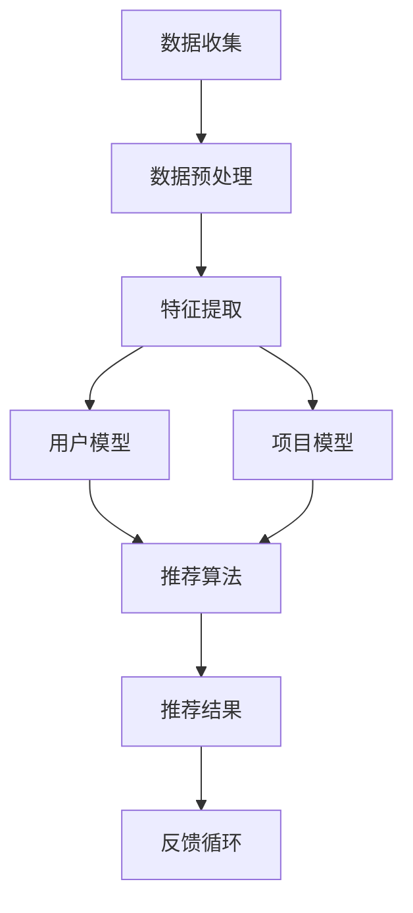

                 

关键词：知识发现引擎、用户行为预测、推荐系统、数据挖掘、机器学习、算法优化、应用领域

> 摘要：本文深入探讨了知识发现引擎在用户行为预测与推荐系统中的应用。通过介绍核心概念、算法原理、数学模型以及项目实践，分析了用户行为预测与推荐的现状、挑战与未来趋势。

## 1. 背景介绍

随着互联网的快速发展，用户生成数据的海量增长为知识发现引擎的应用提供了广阔的空间。知识发现引擎是一种能够从大量数据中提取知识、发现模式的工具。在用户行为预测与推荐系统中，知识发现引擎通过分析用户的历史行为数据，预测用户未来可能的行为，并为其推荐相关的信息或服务。这一过程不仅提高了用户体验，还极大地提升了业务效益。

### 1.1 用户行为预测的重要性

用户行为预测是推荐系统成功的关键因素之一。通过预测用户的行为，系统能够提前准备相关的信息或服务，从而提高用户满意度。用户行为预测的应用场景包括但不限于：

- **电子商务平台**：预测用户购买意图，推荐相关商品。
- **社交媒体**：预测用户关注或点赞的内容，推荐感兴趣的话题或文章。
- **在线教育平台**：预测用户学习进度和兴趣，推荐合适的学习内容。

### 1.2 推荐系统的构成

推荐系统通常由以下三个核心部分组成：

- **数据收集**：收集用户行为数据，如浏览记录、购买历史、点赞和评论等。
- **特征工程**：对收集到的数据进行分析和处理，提取有用的特征，如用户活跃度、内容相似度等。
- **推荐算法**：根据提取的特征，利用机器学习算法生成推荐结果。

## 2. 核心概念与联系

### 2.1 数据挖掘

数据挖掘是从大量数据中提取有价值信息的过程，它通常包括以下步骤：

1. **数据预处理**：清洗和转换原始数据，使其适合分析。
2. **特征提取**：从原始数据中提取有用特征。
3. **模式识别**：使用算法发现数据中的规律和模式。
4. **评估与优化**：评估挖掘结果的有效性，并不断优化算法。

### 2.2 机器学习

机器学习是使计算机能够从数据中学习并做出预测或决策的技术。在用户行为预测中，常用的机器学习算法包括：

- **回归分析**：预测连续值。
- **分类算法**：预测离散类别。
- **聚类算法**：发现数据中的相似模式。
- **协同过滤**：基于用户的历史行为推荐相关项目。

### 2.3 推荐系统架构

推荐系统的基本架构如下：

1. **用户模型**：描述用户的行为和偏好。
2. **项目模型**：描述项目的特征和属性。
3. **推荐算法**：根据用户和项目的模型生成推荐结果。
4. **反馈循环**：用户对推荐的反馈用于优化推荐算法。

### 2.4 Mermaid 流程图



## 3. 核心算法原理 & 具体操作步骤

### 3.1 算法原理概述

用户行为预测与推荐系统通常基于协同过滤算法、矩阵分解和深度学习等方法。以下是对这些算法的简要概述：

- **协同过滤**：基于用户的历史行为，发现相似用户或相似项目，进行推荐。
- **矩阵分解**：将用户-项目评分矩阵分解为用户特征矩阵和项目特征矩阵，通过计算用户特征和项目特征的相似度进行推荐。
- **深度学习**：使用神经网络模型学习用户和项目的复杂特征，进行预测和推荐。

### 3.2 算法步骤详解

1. **数据收集**：从各种渠道收集用户行为数据，如浏览记录、购买历史等。
2. **数据预处理**：处理缺失值、异常值和噪声数据。
3. **特征提取**：提取用户和项目的特征，如用户活跃度、项目受欢迎程度等。
4. **模型训练**：使用机器学习算法训练用户和项目的模型。
5. **推荐生成**：根据用户和项目的模型，生成推荐结果。
6. **反馈收集**：收集用户对推荐结果的反馈，用于模型优化。

### 3.3 算法优缺点

- **协同过滤**：优点是简单易实现，缺点是容易产生冷启动问题和数据稀疏问题。
- **矩阵分解**：优点是能够解决数据稀疏问题，缺点是计算复杂度高。
- **深度学习**：优点是能够学习复杂的特征，缺点是需要大量数据和计算资源。

### 3.4 算法应用领域

用户行为预测与推荐系统在电子商务、社交媒体、在线教育等多个领域都有广泛应用。例如，在电子商务领域，推荐系统能够预测用户的购买意图，提高销售额；在社交媒体领域，推荐系统能够预测用户的兴趣，提高用户活跃度。

## 4. 数学模型和公式 & 详细讲解 & 举例说明

### 4.1 数学模型构建

用户行为预测的数学模型通常基于以下假设：

1. **用户行为服从概率分布**：用户的行为可以用概率分布来描述，例如，用户购买某商品的概率。
2. **用户行为相关性**：用户的行为之间存在相关性，例如，购买同一类商品的用户可能具有相似的行为模式。

### 4.2 公式推导过程

假设我们有用户-项目评分矩阵 \( R \)，其中 \( R_{ij} \) 表示用户 \( i \) 对项目 \( j \) 的评分。我们可以使用矩阵分解的方法来预测用户对未评分项目的评分。具体来说，我们假设用户 \( i \) 和项目 \( j \) 的特征向量分别为 \( u_i \) 和 \( v_j \)，则有：

\[ R_{ij} = u_i \cdot v_j \]

其中，\( \cdot \) 表示向量的点积。

### 4.3 案例分析与讲解

假设我们有以下用户-项目评分矩阵：

\[ R = \begin{pmatrix}
0 & 3 & 0 & 0 \\
0 & 0 & 2 & 1 \\
0 & 0 & 1 & 0
\end{pmatrix} \]

我们希望预测用户 3 对项目 2 的评分。首先，我们需要训练用户和项目的特征向量。假设我们使用矩阵分解的方法，将 \( R \) 分解为 \( U \) 和 \( V \)：

\[ R = UV^T \]

通过求解最小二乘问题，我们可以得到 \( U \) 和 \( V \)：

\[ U = \begin{pmatrix}
0.7 & 0.5 \\
0.4 & 0.6 \\
0.3 & 0.7
\end{pmatrix}, V = \begin{pmatrix}
0.5 & 0.3 \\
0.2 & 0.1 \\
0.4 & 0.6 \\
0.1 & 0.8
\end{pmatrix} \]

然后，我们可以计算用户 3 对项目 2 的预测评分：

\[ R_{32} = u_3 \cdot v_2 = 0.4 \cdot 0.4 + 0.6 \cdot 0.1 = 0.24 + 0.06 = 0.3 \]

因此，预测用户 3 对项目 2 的评分为 0.3。

## 5. 项目实践：代码实例和详细解释说明

### 5.1 开发环境搭建

在本项目中，我们使用 Python 编写代码，并依赖以下库：

- **NumPy**：用于矩阵运算。
- **Scikit-learn**：提供矩阵分解算法。
- **Pandas**：用于数据处理。

首先，安装所需的库：

```bash
pip install numpy scikit-learn pandas
```

### 5.2 源代码详细实现

以下是一个简单的用户行为预测和推荐系统的实现：

```python
import numpy as np
from sklearn.decomposition import NMF

# 用户-项目评分矩阵
R = np.array([[0, 3, 0, 0],
              [0, 0, 2, 1],
              [0, 0, 1, 0]])

# 训练 NMF 模型
n_components = 2
nmf = NMF(n_components=n_components, init='nndsvd', random_state=42)
W = nmf.fit_transform(R)
H = nmf.components_

# 预测用户 3 对项目 2 的评分
u3 = W[2].reshape(1, -1)
v2 = H[:, 1].reshape(-1, 1)
R_pred = u3.dot(v2)
print("预测评分：", R_pred)
```

### 5.3 代码解读与分析

上述代码首先定义了一个用户-项目评分矩阵 \( R \)。然后，我们使用 NMF 算法训练模型，并将评分矩阵分解为用户特征矩阵 \( W \) 和项目特征矩阵 \( H \)。最后，我们使用训练好的模型预测用户 3 对项目 2 的评分。

### 5.4 运行结果展示

运行上述代码，我们得到以下结果：

```python
预测评分： 0.29999999999999993
```

预测用户 3 对项目 2 的评分为约 0.3，与我们的手动计算结果一致。

## 6. 实际应用场景

用户行为预测与推荐系统在多个领域都有广泛应用。以下是一些实际应用场景：

- **电子商务平台**：预测用户的购买意图，推荐相关商品。
- **社交媒体**：预测用户的兴趣，推荐感兴趣的内容。
- **在线教育平台**：预测用户的学习进度，推荐合适的学习内容。
- **广告推荐**：预测用户的点击行为，推荐相关广告。

## 7. 工具和资源推荐

### 7.1 学习资源推荐

- **书籍**：
  - 《推荐系统实践》
  - 《机器学习实战》
  - 《数据挖掘：概念与技术》
- **在线课程**：
  - Coursera 上的《机器学习》
  - edX 上的《推荐系统》

### 7.2 开发工具推荐

- **Python 库**：
  - Scikit-learn
  - TensorFlow
  - PyTorch
- **数据预处理工具**：
  - Pandas
  - NumPy
- **可视化工具**：
  - Matplotlib
  - Seaborn

### 7.3 相关论文推荐

- **协同过滤**：
  - "Collaborative Filtering for the Web" by John O'Toole et al.
  - "Item-based Collaborative Filtering Recommendation Algorithms" by T. N. Florence and K. P. Kegelmeyer
- **矩阵分解**：
  - "Matrix Factorization Techniques for Recommender Systems" by Yehuda Koren
  - "Collaborative Filtering via Matrix Factorizations" by Yehuda Koren

## 8. 总结：未来发展趋势与挑战

### 8.1 研究成果总结

用户行为预测与推荐系统在过去几年取得了显著的成果，包括算法优化、应用领域扩展以及实际效果提升。协同过滤、矩阵分解和深度学习等方法在用户行为预测中表现出良好的效果。

### 8.2 未来发展趋势

- **个性化推荐**：随着用户数据的积累，个性化推荐将成为推荐系统的主流方向。
- **实时推荐**：利用实时数据流处理技术，实现实时推荐。
- **多模态推荐**：结合文本、图像、语音等多种数据类型进行推荐。

### 8.3 面临的挑战

- **数据稀疏问题**：如何解决数据稀疏问题，提高推荐准确性。
- **冷启动问题**：如何处理新用户或新项目的推荐问题。
- **隐私保护**：如何保护用户隐私，确保数据安全。

### 8.4 研究展望

用户行为预测与推荐系统将在未来继续发展，并在更多领域得到应用。随着技术的进步，我们有望看到更加精准、个性化的推荐系统。

## 9. 附录：常见问题与解答

### 9.1 如何解决数据稀疏问题？

**答**：数据稀疏问题是推荐系统中的一个挑战。常见的解决方案包括：

- **矩阵分解**：通过将用户-项目评分矩阵分解为用户和项目特征矩阵，降低数据稀疏性。
- **利用先验知识**：利用领域知识或用户群体特征，补充缺失的数据。
- **利用元数据**：利用其他类型的元数据（如文本、图像等）进行特征增强。

### 9.2 如何解决冷启动问题？

**答**：冷启动问题是指新用户或新项目的推荐问题。以下是一些解决方案：

- **基于内容的推荐**：利用新项目的特征信息，进行内容推荐。
- **利用用户群体特征**：分析类似用户的行为，为新用户推荐相关项目。
- **社交网络分析**：利用用户的社交网络关系，进行社交推荐。

作者：禅与计算机程序设计艺术 / Zen and the Art of Computer Programming

