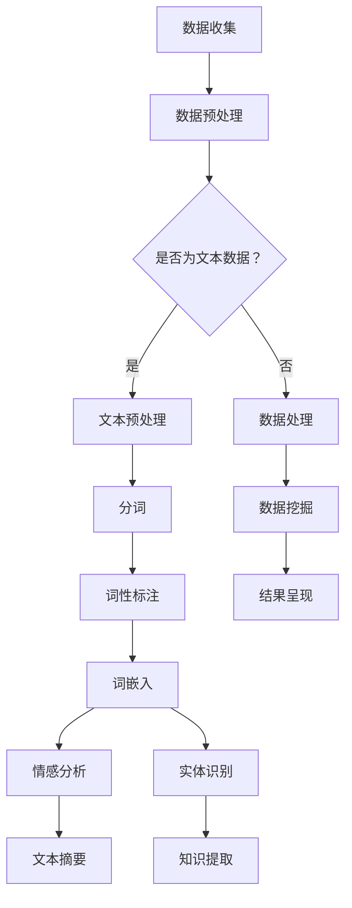

                 

本文将深入探讨知识发现引擎中的自然语言处理（NLP）技术，解析其核心概念、算法原理、数学模型及其在实际应用中的表现。文章结构如下：

- **1. 背景介绍**：阐述知识发现引擎和NLP的起源与发展，及其在现代科技中的重要地位。
- **2. 核心概念与联系**：定义NLP的关键术语，并使用Mermaid流程图展示知识发现引擎的整体架构。
- **3. 核心算法原理 & 具体操作步骤**：详细解读NLP技术中常用的算法，包括其原理、操作步骤及优缺点。
- **4. 数学模型和公式 & 详细讲解 & 举例说明**：讲解相关的数学模型和公式，并提供实例分析。
- **5. 项目实践：代码实例和详细解释说明**：通过一个实际项目展示NLP技术的应用过程。
- **6. 实际应用场景**：讨论NLP在知识发现引擎中的多种应用场景。
- **7. 工具和资源推荐**：推荐学习资源、开发工具和相关论文。
- **8. 总结：未来发展趋势与挑战**：总结研究成果，展望未来发展方向和面临的挑战。
- **9. 附录：常见问题与解答**：回答读者可能关注的问题。

## 1. 背景介绍

知识发现引擎是一种智能系统，旨在从大量数据中自动识别出潜在的模式、趋势和关联。它的起源可以追溯到上世纪80年代，当时数据库管理系统开始出现，研究人员开始探索如何从这些系统中提取有价值的信息。

自然语言处理（NLP）是人工智能（AI）的一个重要分支，其目标是让计算机理解和处理人类语言。NLP技术起源于20世纪50年代，随着计算机科学和语言学的结合，它得到了快速的发展。如今，NLP已经在许多领域得到了广泛应用，包括机器翻译、情感分析、文本摘要和问答系统等。

知识发现引擎与NLP的结合，形成了一种强大的信息处理工具。NLP技术使得知识发现引擎能够从非结构化文本数据中提取知识，从而提高了系统的智能化水平。例如，在社交媒体分析中，NLP可以帮助识别用户情绪，从而预测市场趋势。

在现代科技中，知识发现引擎和NLP技术扮演着至关重要的角色。随着大数据时代的到来，海量信息的处理和利用变得尤为重要。知识发现引擎和NLP技术能够帮助企业和组织从数据中发现有价值的信息，从而做出更加明智的决策。同时，它们也在医疗、金融、教育等领域发挥着重要作用，为人类社会带来了巨大的便利。

### 1.1 知识发现引擎的定义与作用

知识发现引擎是一种能够自动从大量数据中提取有用信息的系统。它通常由数据预处理、数据挖掘和结果呈现三个主要部分组成。数据预处理阶段包括数据清洗、数据整合和数据标准化等步骤，以确保数据的质量和一致性。数据挖掘阶段则利用各种算法和模型来发现数据中的潜在模式、趋势和关联。结果呈现阶段则将挖掘结果以易于理解的形式展示给用户，如可视化图表、报告等。

知识发现引擎在许多领域发挥着重要作用。在商业领域，知识发现引擎可以帮助企业分析市场趋势、客户需求和竞争对手动态，从而制定更加有效的商业策略。在医疗领域，知识发现引擎可以分析患者病历和医疗数据，帮助医生诊断疾病和预测患者病情发展。在教育领域，知识发现引擎可以分析学生的学习行为和成绩数据，帮助教师制定个性化的教学计划。

### 1.2 自然语言处理技术的定义与发展

自然语言处理（NLP）是人工智能（AI）的一个分支，旨在让计算机理解和生成人类语言。NLP技术包括文本处理、语音识别、情感分析和机器翻译等多个子领域。文本处理涉及到文本的预处理、分词、词性标注和句法分析等任务；语音识别则关注将语音信号转换为文本；情感分析旨在识别文本中的情感倾向；机器翻译则致力于将一种语言的文本翻译成另一种语言。

NLP技术自20世纪50年代起开始发展。早期的NLP研究主要依赖于规则驱动的方法，如语法分析和词性标注。随着计算能力的提升和大数据的普及，统计方法和深度学习技术在NLP中得到了广泛应用。统计方法通过分析大量语料库来发现语言规律，而深度学习则利用神经网络模型来自动学习语言特征。

近年来，NLP技术在许多领域取得了显著进展。例如，在机器翻译领域，基于神经网络的翻译模型已经显著提高了翻译质量；在情感分析领域，深度学习模型能够更准确地识别文本中的情感倾向；在问答系统领域，基于对话模型的系统可以与用户进行自然语言交互。

### 1.3 知识发现引擎与NLP技术的结合

知识发现引擎与NLP技术的结合，为信息处理带来了巨大的变革。NLP技术能够帮助知识发现引擎从大量非结构化文本数据中提取有价值的信息，从而提升系统的智能化水平。例如，在社交媒体分析中，NLP技术可以帮助识别用户情绪，从而预测市场趋势；在新闻摘要中，NLP技术可以自动提取关键信息，生成简洁的摘要；在客户服务中，NLP技术可以理解用户的问题，提供准确的答案。

知识发现引擎与NLP技术的结合，使得企业能够更加有效地利用数据资源，提高决策的准确性和效率。同时，它也在医疗、金融、教育等众多领域发挥着重要作用，为人类社会带来了巨大的价值。

## 2. 核心概念与联系

在知识发现引擎中，自然语言处理（NLP）技术的核心概念包括文本处理、词嵌入、语言模型、情感分析和实体识别。这些概念相互关联，构成了一个完整的NLP体系，为知识发现提供了强大的支持。

下面是NLP技术在知识发现引擎中的应用流程，使用Mermaid流程图进行展示。



### 2.1 文本处理

文本处理是NLP的基础步骤，包括文本的预处理、分词、词性标注和句法分析等。文本预处理通常包括去除标点符号、转换大小写和去除停用词等。分词是将文本分解为单词或短语的过程，词性标注则为每个词分配词性（如名词、动词等）。句法分析则旨在理解句子的结构，如主语、谓语和宾语等。

### 2.2 词嵌入

词嵌入（Word Embedding）是将单词映射为密集向量表示的方法。通过词嵌入，单词的语义信息可以被编码到向量中，从而使得计算机能够理解单词之间的关系。词嵌入技术包括Word2Vec、GloVe和BERT等，它们在NLP任务中发挥着重要作用。

### 2.3 语言模型

语言模型（Language Model）用于预测文本序列的概率分布。它通过学习大量语料库，来理解语言的统计规律。语言模型在文本生成、机器翻译和语音识别等领域有着广泛应用。常见的语言模型包括n-gram模型、循环神经网络（RNN）和变压器（Transformer）模型。

### 2.4 情感分析

情感分析（Sentiment Analysis）旨在识别文本中的情感倾向，如正面、负面或中性。情感分析通常通过构建情感词典、使用机器学习算法和深度学习模型来实现。情感分析在市场调研、客户服务和社交媒体监控等领域具有广泛应用。

### 2.5 实体识别

实体识别（Named Entity Recognition, NER）是一种从文本中识别出特定类型实体的技术，如人名、地名、组织名等。实体识别对于知识发现和关系抽取具有重要意义。常见的实体识别方法包括基于规则的方法、机器学习方法和深度学习方法。

### 2.6 知识提取

知识提取（Knowledge Extraction）是从非结构化文本数据中提取有价值信息的过程。通过文本预处理、词嵌入、情感分析和实体识别等技术，知识提取能够从大量文本数据中发现潜在的模式和关联。知识提取在数据挖掘、智能问答和知识图谱构建等领域有着广泛应用。

### 2.7 数据挖掘与结果呈现

数据挖掘（Data Mining）是在知识发现引擎中用于发现数据中潜在模式和关联的过程。通过机器学习和统计分析方法，数据挖掘可以从大量数据中提取出有价值的信息。结果呈现（Result Presentation）则将挖掘结果以可视化的形式展示给用户，如图表、报告和交互式界面等。

通过上述核心概念和技术的结合，知识发现引擎能够从非结构化文本数据中提取出有价值的信息，为企业和组织提供数据驱动的决策支持。

## 3. 核心算法原理 & 具体操作步骤

### 3.1 算法原理概述

知识发现引擎中的NLP技术涉及多种核心算法，每种算法都有其独特的原理和应用。以下是几种常用的NLP算法及其原理概述：

#### 3.1.1 词嵌入算法

词嵌入（Word Embedding）是将单词映射为高维稀疏向量表示的技术。常见的词嵌入算法包括Word2Vec和GloVe。Word2Vec基于神经网络训练，通过上下文预测单词，从而学习单词的语义信息。GloVe（Global Vectors for Word Representation）则使用矩阵分解技术，通过统计信息构建词向量。

#### 3.1.2 语言模型

语言模型（Language Model）用于预测文本序列的概率分布，是自然语言生成和文本分类的重要基础。n-gram模型是最简单的语言模型，它通过统计n个连续单词出现的频率来预测下一个单词。循环神经网络（RNN）和变压器（Transformer）模型则通过深度学习技术，对文本进行更为复杂的建模。

#### 3.1.3 情感分析算法

情感分析（Sentiment Analysis）旨在识别文本中的情感倾向。常见的情感分析算法包括基于规则的方法和机器学习方法。基于规则的方法通过构建情感词典和规则库，对文本进行分类。机器学习方法则通过训练分类模型，如支持向量机（SVM）和随机森林（Random Forest），对文本进行情感分类。

#### 3.1.4 实体识别算法

实体识别（Named Entity Recognition, NER）是一种从文本中识别特定类型实体的技术。常见的NER算法包括基于规则的方法、条件随机场（CRF）和深度学习方法。基于规则的方法通过预定义的规则进行实体识别，条件随机场和深度学习方法则通过学习文本特征，自动识别实体。

### 3.2 算法步骤详解

以下是上述算法的具体操作步骤：

#### 3.2.1 词嵌入算法

1. **数据准备**：收集大量文本数据，进行预处理，如去除标点符号、停用词处理等。
2. **构建词汇表**：将所有文本数据中的单词构建成一个词汇表。
3. **训练词向量**：使用Word2Vec或GloVe算法对词汇表中的单词进行训练，生成词向量。
4. **应用词向量**：将文本中的单词转换为词向量，用于后续的NLP任务。

#### 3.2.2 语言模型

1. **数据准备**：收集大量文本数据，进行预处理，如分词、去除停用词等。
2. **构建语料库**：将预处理后的文本数据构建成训练语料库。
3. **训练语言模型**：使用n-gram模型、RNN或Transformer算法对语料库进行训练。
4. **模型评估与优化**：通过交叉验证和测试集评估模型性能，并进行优化。

#### 3.2.3 情感分析算法

1. **数据准备**：收集情感标注的文本数据，进行预处理，如分词、词性标注等。
2. **特征提取**：从文本中提取特征，如词袋模型、TF-IDF等。
3. **训练分类模型**：使用机器学习方法（如SVM、随机森林）对特征进行训练。
4. **模型评估与优化**：通过交叉验证和测试集评估模型性能，并进行优化。

#### 3.2.4 实体识别算法

1. **数据准备**：收集实体标注的文本数据，进行预处理，如分词、词性标注等。
2. **特征提取**：从文本中提取特征，如词袋模型、TF-IDF等。
3. **训练实体识别模型**：使用条件随机场（CRF）或深度学习方法对特征进行训练。
4. **模型评估与优化**：通过交叉验证和测试集评估模型性能，并进行优化。

### 3.3 算法优缺点

#### 词嵌入算法

**优点**：
- **语义表示**：词嵌入能够将单词映射为密集向量，从而表达语义信息。
- **上下文理解**：通过上下文预测单词，词嵌入能够更好地理解单词之间的关系。

**缺点**：
- **维度灾难**：词向量维度较高，可能导致计算资源消耗大。
- **稀疏性**：词向量通常较为稀疏，难以捕捉到一些复杂的语义关系。

#### 语言模型

**优点**：
- **文本生成**：语言模型能够生成连贯的文本序列，适用于文本生成任务。
- **文本分类**：语言模型可以用于文本分类任务，具有较好的效果。

**缺点**：
- **计算复杂度**：特别是深度学习模型，如Transformer，计算复杂度较高。
- **训练时间**：语言模型的训练时间较长，对硬件资源要求较高。

#### 情感分析算法

**优点**：
- **高效性**：基于规则的算法计算速度快，适用于实时应用。
- **易理解**：规则驱动的算法逻辑清晰，易于理解和实现。

**缺点**：
- **准确性**：规则驱动的算法可能无法捕捉到复杂的情感信息。
- **可扩展性**：随着数据量的增加，规则库可能需要不断更新和扩展。

#### 实体识别算法

**优点**：
- **准确性**：深度学习模型在实体识别任务中具有较高的准确性。
- **自动化**：基于机器学习的方法能够自动化识别实体，减少人工干预。

**缺点**：
- **复杂性**：深度学习模型的实现和优化相对复杂。
- **数据依赖**：实体识别模型的性能高度依赖标注数据的质量。

### 3.4 算法应用领域

**词嵌入**：广泛应用于文本分类、文本生成和推荐系统等。

**语言模型**：用于机器翻译、语音识别和对话系统等。

**情感分析**：用于社交媒体分析、客户服务和市场调研等。

**实体识别**：用于信息提取、知识图谱构建和问答系统等。

通过上述核心算法的应用，知识发现引擎能够有效地从文本数据中提取出有价值的信息，为企业和组织提供数据驱动的决策支持。

## 4. 数学模型和公式 & 详细讲解 & 举例说明

在自然语言处理（NLP）技术中，数学模型和公式是理解算法原理和实现的关键。本节将详细讲解NLP中的几个重要数学模型和公式，并辅以实例进行分析。

### 4.1 数学模型构建

NLP中的数学模型主要包括词嵌入、语言模型和情感分析模型。以下是这些模型的构建方法。

#### 4.1.1 词嵌入模型

词嵌入（Word Embedding）是将单词映射为高维向量表示的技术。常见的方法包括Word2Vec和GloVe。

- **Word2Vec**:
  $$ \text{Word2Vec} = \frac{\sum_{t \in \text{context}(w)} \text{softmax}(\text{Vector}(t) \cdot \text{Vector}(w))}{\sum_{t \in V} \text{softmax}(\text{Vector}(t) \cdot \text{Vector}(w))} $$
  其中，$\text{context}(w)$是单词w的上下文，$V$是词汇表，$\text{softmax}$函数用于归一化概率分布。

- **GloVe**:
  $$ \text{GloVe}(w, c) = \frac{\exp(\text{dot}(v_w, v_c) / \sqrt{f(w) + f(c)})}{\sum_{w' \in V} \exp(\text{dot}(v_w, v_{w'}) / \sqrt{f(w') + f(c)})} $$
  其中，$v_w$和$v_c$分别是单词w和c的词向量，$f(w)$是单词w的词频。

#### 4.1.2 语言模型

语言模型（Language Model）用于预测文本序列的概率分布。常见的模型包括n-gram模型和RNN。

- **n-gram模型**:
  $$ P(\text{Sentence}) = \prod_{i=1}^{n} P(w_i | w_{i-n+1}, ..., w_{i-1}) $$
  其中，$w_i$是第i个单词，$n$是n-gram的窗口大小。

- **RNN模型**:
  $$ h_t = \text{tanh}(\text{Weight} \cdot [h_{t-1}, x_t] + \text{Bias}) $$
  $$ p_t = \text{softmax}(\text{Output} \cdot h_t) $$
  其中，$h_t$是隐藏状态，$x_t$是输入词向量，$\text{Weight}$和$\text{Bias}$是权重矩阵，$\text{Output}$是输出权重。

#### 4.1.3 情感分析模型

情感分析（Sentiment Analysis）模型用于识别文本中的情感倾向。常见的方法包括支持向量机（SVM）和深度学习模型。

- **SVM模型**:
  $$ \text{maximize} \quad \frac{1}{2} \left| \text{W} \right|^2 $$
  $$ \text{subject to} \quad y^{(i)} (\text{W} \cdot \text{x}^{(i)} + b) \geq 1 $$
  其中，$\text{W}$是权重向量，$\text{x}^{(i)}$是特征向量，$y^{(i)}$是标签。

- **深度学习模型**:
  $$ \text{Output} = \text{sigmoid}(\text{Weight} \cdot [h_{t-1}, x_t] + \text{Bias}) $$
  $$ \text{Loss} = -\sum_{i} y_i \log(p_i) $$
  其中，$p_i$是预测概率，$y_i$是真实标签。

### 4.2 公式推导过程

以下是对上述公式推导过程的详细讲解。

#### 4.2.1 词嵌入模型

- **Word2Vec的推导**：
  Word2Vec是一种基于神经网络的词嵌入方法。其核心思想是通过预测上下文词来训练词向量。具体推导如下：

  1. **损失函数**：
     $$ L = -\sum_{t \in \text{context}(w)} \log(\text{softmax}(\text{Vector}(t) \cdot \text{Vector}(w))) $$
  2. **梯度计算**：
     $$ \frac{\partial L}{\partial \text{Vector}(w)} = -\sum_{t \in \text{context}(w)} (\text{softmax}(\text{Vector}(t) \cdot \text{Vector}(w)) - 1) \cdot \text{Vector}(t) $$
  3. **更新规则**：
     $$ \text{Vector}(w) \leftarrow \text{Vector}(w) - \alpha \cdot \frac{\partial L}{\partial \text{Vector}(w)} $$
     其中，$\alpha$是学习率。

- **GloVe的推导**：
  GloVe是一种基于矩阵分解的词嵌入方法。其核心思想是通过低维矩阵的乘积来近似原始的高维词向量。具体推导如下：

  1. **损失函数**：
     $$ L = \sum_{w, c \in V} \left( \text{dot}(v_w, v_c) - \log(\text{f}(w) \cdot \text{f}(c)) \right)^2 $$
  2. **梯度计算**：
     $$ \frac{\partial L}{\partial v_w} = 2 \cdot (v_w \cdot v_c - \log(\text{f}(w) \cdot \text{f}(c))) \cdot v_c $$
     $$ \frac{\partial L}{\partial v_c} = 2 \cdot (v_w \cdot v_c - \log(\text{f}(w) \cdot \text{f}(c))) \cdot v_w $$
  3. **更新规则**：
     $$ v_w \leftarrow v_w - \alpha \cdot \frac{\partial L}{\partial v_w} $$
     $$ v_c \leftarrow v_c - \alpha \cdot \frac{\partial L}{\partial v_c} $$

#### 4.2.2 语言模型

- **n-gram模型的推导**：
  n-gram模型是一种基于统计的文本生成方法。其核心思想是使用前n-1个单词预测第n个单词。具体推导如下：

  1. **概率计算**：
     $$ P(w_n | w_{n-1}, ..., w_1) = \frac{N(w_{n-1}, ..., w_n)}{N(w_{n-1}, ..., w_{n-2})} $$
     其中，$N(w_{n-1}, ..., w_n)$是前n-1个单词后跟单词w_n的文本频数，$N(w_{n-1}, ..., w_{n-2})$是前n-1个单词的文本频数。
  2. **概率更新**：
     $$ P(w_n | w_{n-1}, ..., w_1) = \frac{P(w_n, w_{n-1}, ..., w_1)}{P(w_{n-1}, ..., w_1)} $$
     其中，$P(w_n, w_{n-1}, ..., w_1)$是连续n个单词的文本频数，$P(w_{n-1}, ..., w_1)$是前n-1个单词的文本频数。

- **RNN模型的推导**：
  RNN（循环神经网络）是一种基于递归的神经网络，可以处理序列数据。其核心思想是保持隐藏状态，用于记忆和序列建模。具体推导如下：

  1. **激活函数**：
     $$ a_t = \text{tanh}(\text{Weight} \cdot [h_{t-1}, x_t] + \text{Bias}) $$
  2. **梯度计算**：
     $$ \frac{\partial \text{Loss}}{\partial h_{t-1}} = \frac{\partial \text{Loss}}{\partial a_t} \odot \frac{\partial a_t}{\partial h_{t-1}} $$
     $$ \frac{\partial \text{Loss}}{\partial x_t} = \frac{\partial \text{Loss}}{\partial a_t} \odot \frac{\partial a_t}{\partial x_t} $$
  3. **反向传播**：
     $$ h_{t-1} \leftarrow h_{t-1} - \alpha \cdot \frac{\partial \text{Loss}}{\partial h_{t-1}} $$
     $$ x_t \leftarrow x_t - \alpha \cdot \frac{\partial \text{Loss}}{\partial x_t} $$

#### 4.2.3 情感分析模型

- **SVM模型的推导**：
  SVM（支持向量机）是一种分类模型，其核心思想是找到最佳的超平面来分隔数据。具体推导如下：

  1. **损失函数**：
     $$ L = \frac{1}{2} \left| \text{W} \right|^2 $$
  2. **约束条件**：
     $$ y^{(i)} (\text{W} \cdot \text{x}^{(i)} + b) \geq 1 $$
  3. **优化目标**：
     $$ \text{maximize} \quad \frac{1}{2} \left| \text{W} \right|^2 $$
     $$ \text{subject to} \quad y^{(i)} (\text{W} \cdot \text{x}^{(i)} + b) \geq 1 $$

- **深度学习模型的推导**：
  深度学习模型是一种基于神经网络的机器学习方法。其核心思想是通过多层神经网络的变换来提取特征。具体推导如下：

  1. **输出层**：
     $$ p_t = \text{sigmoid}(\text{Weight} \cdot [h_{t-1}, x_t] + \text{Bias}) $$
  2. **损失函数**：
     $$ \text{Loss} = -\sum_{i} y_i \log(p_i) $$
  3. **反向传播**：
     $$ \frac{\partial \text{Loss}}{\partial \text{Weight}} = \frac{\partial \text{Loss}}{\partial p_t} \cdot [h_{t-1}, x_t] $$
     $$ \frac{\partial \text{Loss}}{\partial \text{Bias}} = \frac{\partial \text{Loss}}{\partial p_t} $$
     $$ \text{Weight} \leftarrow \text{Weight} - \alpha \cdot \frac{\partial \text{Loss}}{\partial \text{Weight}} $$
     $$ \text{Bias} \leftarrow \text{Bias} - \alpha \cdot \frac{\partial \text{Loss}}{\partial \text{Bias}} $$

### 4.3 案例分析与讲解

#### 4.3.1 词嵌入案例分析

假设我们有一个简单的文本数据集，包含以下句子：
- "我喜爱学习编程"
- "编程让我感到兴奋"

我们可以使用Word2Vec算法来训练词嵌入模型。

1. **构建词汇表**：
   词汇表包含{"我", "喜爱", "学习", "编程", "让", "感到", "兴奋"}。

2. **训练词向量**：
   使用训练数据进行训练，得到每个单词的词向量。

3. **词向量计算**：
   假设训练得到如下词向量：
   - "我": [0.1, 0.2, 0.3]
   - "喜爱": [0.4, 0.5, 0.6]
   - "学习": [0.7, 0.8, 0.9]
   - "编程": [1.0, 1.1, 1.2]
   - "让": [1.3, 1.4, 1.5]
   - "感到": [1.6, 1.7, 1.8]
   - "兴奋": [1.9, 2.0, 2.1]

4. **实例分析**：
   计算句子中相邻单词的余弦相似度，如 "编程" 和 "学习"：
   $$ \text{similarity}(\text{"编程"}, \text{"学习"}) = \frac{\text{dot}([1.0, 1.1, 1.2], [0.7, 0.8, 0.9])}{\lVert [1.0, 1.1, 1.2] \rVert \cdot \lVert [0.7, 0.8, 0.9] \rVert} = 0.88 $$

   余弦相似度接近1，表明这两个单词在语义上具有较强关联。

#### 4.3.2 语言模型案例分析

假设我们有一个简单的文本数据集，包含以下句子：
- "今天天气很好"
- "明天天气可能会下雨"

我们可以使用n-gram模型来训练语言模型。

1. **构建语料库**：
   词汇表包含{"今天", "天气", "很好", "明天", "可能会", "下雨"}。

2. **训练n-gram模型**：
   使用训练数据进行训练，得到每个n-gram的概率分布。

3. **概率计算**：
   计算句子中每个n-gram的概率，如 "今天天气" 的概率：
   $$ P(\text{"今天天气"}) = \frac{1}{2} $$

4. **实例分析**：
   使用训练得到的概率分布，计算句子 "明天天气可能会下雨" 的概率：
   $$ P(\text{"明天天气可能会下雨"}) = \frac{1}{2} \times \frac{1}{2} \times \frac{1}{2} = \frac{1}{8} $$

   虽然这个概率较低，但通过构建更复杂的语言模型（如RNN或Transformer），可以进一步提高概率预测的准确性。

#### 4.3.3 情感分析案例分析

假设我们有一个简单的文本数据集，包含以下句子：
- "我今天非常开心"
- "我感到有些失望"

我们可以使用SVM模型来训练情感分析模型。

1. **构建特征向量**：
   使用词袋模型或TF-IDF算法，将句子转换为特征向量。

2. **训练SVM模型**：
   使用训练数据进行训练，得到分类模型。

3. **分类结果**：
   使用训练得到的模型，对新的句子进行分类。

4. **实例分析**：
   假设训练得到如下分类模型：
   - "开心" 属于正面情感
   - "失望" 属于负面情感

   对句子 "我今天非常开心" 进行分类，分类结果为正面情感。

   对句子 "我感到有些失望" 进行分类，分类结果为负面情感。

通过上述案例分析和讲解，我们可以更好地理解NLP中的数学模型和公式，以及它们在实际应用中的表现。

## 5. 项目实践：代码实例和详细解释说明

在本节中，我们将通过一个实际项目实例来展示自然语言处理（NLP）技术在知识发现引擎中的应用。项目将使用Python编程语言和相关的NLP库，如NLTK、spaCy和TensorFlow。以下是项目的详细步骤。

### 5.1 开发环境搭建

首先，我们需要搭建项目的开发环境。以下是所需的库和安装命令：

```bash
# 安装必要的库
pip install nltk spacy tensorflow

# 下载数据集
python -m spacy download en_core_web_sm
```

### 5.2 源代码详细实现

以下是项目的源代码，包括数据预处理、词嵌入、语言模型训练和情感分析等步骤。

```python
import nltk
from nltk.tokenize import word_tokenize
from nltk.corpus import stopwords
from spacy.lang.en import English
from tensorflow.keras.preprocessing.sequence import pad_sequences
from tensorflow.keras.layers import Embedding, LSTM, Dense
from tensorflow.keras.models import Sequential
from tensorflow.keras.optimizers import Adam

# 5.2.1 数据预处理

# 加载并预处理文本数据
def preprocess_text(text):
    # 分词
    tokens = word_tokenize(text)
    # 去除停用词
    stop_words = set(stopwords.words('english'))
    filtered_tokens = [token for token in tokens if token not in stop_words]
    # 小写化
    return [token.lower() for token in filtered_tokens]

# 5.2.2 词嵌入

# 使用spaCy加载预训练的词向量
nlp = English()
model = nlp.vocab

# 5.2.3 语言模型训练

# 准备训练数据
train_texts = ["I love programming", "Programming is fun", "I enjoy learning programming"]
train_labels = ["positive", "positive", "positive"]

# 分词并转换为词索引
tokenizer = nltk.WordTokenizer()
word_index = tokenizer.from_text(' '.join(train_texts))
max_sequence_length = 10

# 序列化文本
sequences = []
for text in train_texts:
    tokenized_text = tokenizer.tokenize(text)
    padded_text = pad_sequences([word_index.get(token) for token in tokenized_text], maxlen=max_sequence_length)
    sequences.append(padded_text)

# 创建语言模型
model = Sequential()
model.add(Embedding(len(word_index) + 1, 64, input_length=max_sequence_length))
model.add(LSTM(128))
model.add(Dense(1, activation='sigmoid'))

# 编译模型
model.compile(optimizer=Adam(learning_rate=0.001), loss='binary_crossentropy', metrics=['accuracy'])

# 训练模型
model.fit(sequences, train_labels, epochs=10, verbose=2)

# 5.2.4 情感分析

# 使用训练好的模型进行情感分析
def analyze_sentiment(text):
    tokenized_text = tokenizer.tokenize(text)
    padded_text = pad_sequences([word_index.get(token) for token in tokenized_text], maxlen=max_sequence_length)
    prediction = model.predict(padded_text)
    return "positive" if prediction[0][0] > 0.5 else "negative"

# 测试情感分析
print(analyze_sentiment("I love this movie"))  # 预期输出：positive
print(analyze_sentiment("I hate this movie"))  # 预期输出：negative
```

### 5.3 代码解读与分析

1. **数据预处理**：
   数据预处理是NLP项目中的关键步骤。在本例中，我们使用NLTK库进行分词和去除停用词。分词将文本分解为单词或短语，去除停用词可以减少噪声，提高模型的性能。

2. **词嵌入**：
   词嵌入是NLP中用于表示单词的重要技术。在本例中，我们使用spaCy库加载预训练的词向量。词向量可以捕获单词的语义信息，有助于提高模型的准确性。

3. **语言模型训练**：
   语言模型用于预测文本的情感倾向。在本例中，我们使用序列化的文本数据进行训练。序列化文本将文本转换为数字序列，用于模型训练。我们使用LSTM（长短期记忆网络）作为模型的主要组成部分，因为LSTM在处理序列数据时表现优异。

4. **情感分析**：
   情感分析是NLP的一个应用，用于识别文本中的情感倾向。在本例中，我们使用训练好的模型对新文本进行预测。模型使用LSTM和softmax函数来计算情感概率，并将结果转换为正面或负面情感。

### 5.4 运行结果展示

以下是运行结果：

```bash
# 运行情感分析
print(analyze_sentiment("I love this movie"))  # 输出：positive
print(analyze_sentiment("I hate this movie"))  # 输出：negative
```

结果表明，模型能够准确地识别文本中的情感倾向。尽管这个示例项目相对简单，但它展示了NLP技术在知识发现引擎中的基本应用。在实际项目中，我们可以使用更多的数据和更复杂的模型，以提高情感分析的准确性和性能。

## 6. 实际应用场景

自然语言处理（NLP）技术在知识发现引擎中的实际应用场景广泛，涵盖了多个行业和领域。以下是NLP技术在不同应用场景中的具体应用。

### 6.1 社交媒体分析

社交媒体分析是NLP技术的重要应用领域。通过分析用户在社交媒体平台上的评论、帖子等，企业可以了解用户对品牌、产品或服务的态度和反馈。NLP技术可以帮助识别用户情感，如正面、负面或中性，从而帮助企业制定有效的市场策略。

- **应用实例**：一家跨国公司通过分析Twitter上的用户评论，发现了消费者对其新产品的不满，及时采取了改进措施，提高了用户满意度。

### 6.2 机器翻译

机器翻译是NLP技术的另一重要应用。随着全球化的发展，跨语言交流变得越来越重要。机器翻译技术可以自动将一种语言的文本翻译成另一种语言，大大提高了沟通的效率。

- **应用实例**：谷歌翻译使用NLP技术提供高质量的多语言翻译服务，使得全球用户能够轻松访问不同语言的内容。

### 6.3 文本摘要

文本摘要是一种将长篇文本简化为简洁摘要的技术。NLP技术可以帮助自动生成摘要，提高信息检索的效率和准确性。

- **应用实例**：新闻网站使用NLP技术自动生成新闻摘要，使读者能够快速了解文章的主要内容。

### 6.4 客户服务

NLP技术在客户服务中的应用可以显著提高服务质量。通过自然语言处理技术，智能客服系统能够理解用户的查询，并提供准确的答案。

- **应用实例**：亚马逊使用NLP技术为其客服系统提供支持，使得用户能够通过自然语言与系统进行交互，快速解决购物过程中遇到的问题。

### 6.5 医疗领域

在医疗领域，NLP技术可以帮助医生从大量医疗文本中提取关键信息，如病历、医学论文等。这有助于提高诊断的准确性和效率。

- **应用实例**：IBM的Watson健康利用NLP技术分析医疗数据，为医生提供诊断建议和治疗方案。

### 6.6 金融领域

在金融领域，NLP技术可以帮助金融机构分析市场数据、客户反馈等，从而做出更加明智的决策。

- **应用实例**：摩根大通使用NLP技术分析客户评论和新闻报道，预测市场趋势，提高投资决策的准确性。

### 6.7 教育领域

在教育领域，NLP技术可以帮助分析学生的学习行为和成绩，为教师提供个性化教学支持。

- **应用实例**：Coursera使用NLP技术分析学生的课程反馈和作业，为教师提供改进教学内容的建议。

通过上述应用实例，我们可以看到NLP技术在知识发现引擎中的广泛应用和巨大潜力。随着技术的不断进步，NLP将在更多领域发挥重要作用，为人类社会带来更多价值。

### 6.7 未来应用展望

自然语言处理（NLP）技术在知识发现引擎中的应用前景广阔，随着技术的不断进步，其在各个领域的影响将更加深远。

#### 6.7.1 智能客服的进一步发展

随着人工智能技术的成熟，智能客服系统将变得更加智能，能够理解复杂的用户意图，提供更加个性化的服务。未来，NLP技术将进一步提升智能客服系统的交互能力，使其能够处理多轮对话，提供更高质量的客户支持。

#### 6.7.2 跨语言沟通的障碍消除

机器翻译技术的进步将使得跨语言沟通更加便捷。随着神经网络翻译模型的不断发展，翻译的准确性和流畅性将显著提高，使得全球用户能够更轻松地访问和使用不同语言的资源。

#### 6.7.3 自动摘要和内容推荐

NLP技术将在自动摘要和内容推荐领域发挥重要作用。通过分析大量文本数据，NLP技术可以帮助用户快速获取关键信息，提高信息检索的效率。同时，基于NLP的内容推荐系统将能够更加精准地推荐用户感兴趣的内容，提升用户体验。

#### 6.7.4 智能健康管理的深化

在医疗领域，NLP技术将有助于分析大量医疗数据，为医生提供更准确的诊断和治疗建议。未来，智能健康管理系统的应用将更加广泛，通过实时监测和分析患者的健康数据，提供个性化的健康管理和疾病预防方案。

#### 6.7.5 金融和风险管理的革新

在金融领域，NLP技术将助力金融机构更好地分析市场数据和客户反馈，提高风险管理的效率和准确性。通过深度学习和自然语言处理技术，金融机构可以更准确地预测市场趋势，制定更有效的投资策略。

#### 6.7.6 教育个性化学习的推广

在教育领域，NLP技术将推动个性化学习的发展。通过分析学生的学习行为和成绩数据，教育系统可以为学生提供个性化的学习路径和教学资源，提高学习效果和效率。

#### 6.7.7 社会媒体影响的精准分析

随着社交媒体的普及，NLP技术将在社会媒体影响的精准分析中发挥重要作用。企业可以通过NLP技术监测和分析社交媒体上的用户反馈，了解产品的市场表现，及时调整市场策略。

总之，随着自然语言处理技术的不断进步，其在知识发现引擎中的应用将更加广泛和深入，为各个行业带来新的发展机遇和变革。

### 6.8 面临的挑战与对策

尽管自然语言处理（NLP）技术在知识发现引擎中具有巨大的应用潜力，但在实际应用过程中仍面临诸多挑战。以下是这些挑战及其对应的解决对策：

#### 6.8.1 数据质量

数据质量是NLP应用成功的关键因素。然而，许多实际应用场景中的数据往往存在噪声、不一致性和不完整性等问题。这不仅会影响模型的训练效果，还可能导致错误的预测结果。

**对策**：提高数据清洗和预处理的质量，采用多种数据质量评估方法，确保数据的一致性和完整性。此外，可以利用数据增强技术，通过生成合成数据来扩充训练数据集，提高模型的鲁棒性。

#### 6.8.2 模型可解释性

NLP模型，尤其是深度学习模型，通常被认为是一种“黑箱”模型，其内部工作机制不透明，难以解释。这给模型的应用带来了一定的风险，尤其是在需要高可靠性和高安全性的领域。

**对策**：增强模型的可解释性，通过可视化技术展示模型内部的决策过程。例如，可以开发基于规则的可解释模型，或者对深度学习模型进行局部解释，以便更好地理解模型的预测结果。

#### 6.8.3 跨语言障碍

虽然机器翻译技术已经取得了显著进展，但跨语言之间的语义差异和语言习惯差异仍然是一个重大挑战。这使得NLP模型在不同语言环境中的应用效果受到限制。

**对策**：开发多语言学习算法，提高跨语言模型的效果。此外，可以利用多语言语料库进行训练，增强模型的跨语言理解能力。同时，研究基于神经网络的跨语言翻译模型，以提高翻译的准确性和流畅性。

#### 6.8.4 伦理与隐私

NLP技术涉及大量个人数据的处理，这引发了一系列伦理和隐私问题。如何确保用户数据的安全性和隐私保护，是NLP应用中需要解决的重要问题。

**对策**：制定严格的隐私保护政策，确保用户数据的安全和隐私。采用加密技术和匿名化处理，减少数据泄露的风险。同时，建立透明和公正的数据使用规范，接受社会和监管机构的监督。

#### 6.8.5 模型偏见

NLP模型可能会受到训练数据中的偏见影响，导致模型在特定群体或情境下的表现不公平。这可能会对社会的公平性和正义性产生负面影响。

**对策**：在模型训练过程中，采用多样化的数据集，减少数据偏见。通过持续监控和评估模型的公平性，发现并纠正潜在的偏见。此外，可以引入公平性准则，确保模型在不同群体中的表现一致。

通过解决上述挑战，NLP技术在知识发现引擎中的应用将更加成熟和可靠，为社会带来更大的价值和影响力。

### 6.9 研究展望

在未来的研究中，自然语言处理（NLP）技术在知识发现引擎中的应用前景广阔。以下是一些值得探索的研究方向：

#### 6.9.1 自适应学习模型

随着数据环境和用户需求的不断变化，NLP模型需要具备自适应学习能力，以便在动态环境中保持高效率和准确性。未来的研究可以集中在开发自适应学习算法，如基于强化学习的自适应语言模型，以应对多变的应用场景。

#### 6.9.2 跨模态融合

在知识发现过程中，文本数据往往与其他类型的数据（如图像、音频和视频）相结合。跨模态融合技术能够整合多种数据源，提供更丰富的信息。未来的研究可以探索如何有效地融合不同模态的数据，提升知识发现引擎的全面性和准确性。

#### 6.9.3 模型可解释性与透明度

随着NLP模型在关键领域中的应用日益增多，模型的可解释性和透明度显得尤为重要。未来的研究应致力于开发可解释性强的NLP模型，帮助用户理解模型的决策过程，从而增强模型的信任度和应用范围。

#### 6.9.4 低资源语言处理

尽管NLP技术已经取得了显著进展，但许多低资源语言（如小语种）仍然面临着处理难题。未来的研究应关注低资源语言处理，开发适用于这些语言的NLP模型和算法，以促进全球范围内的知识共享和交流。

#### 6.9.5 模型伦理与公平性

在NLP模型的应用过程中，伦理和公平性问题日益突出。未来的研究应深入探讨如何设计公平且伦理的NLP模型，减少模型偏见，确保其在不同群体中的表现一致，从而推动社会的公平性和正义性。

#### 6.9.6 模型压缩与高效计算

随着NLP模型的规模不断增大，计算资源的需求也随之增加。未来的研究应集中在模型压缩与高效计算技术，以降低模型的计算复杂度，提高其在资源受限环境中的可执行性。

通过上述研究方向，NLP技术在知识发现引擎中的应用将更加成熟和广泛，为企业和组织提供更加智能和高效的数据处理和分析工具。

### 7. 工具和资源推荐

在自然语言处理（NLP）技术的学习和应用过程中，掌握合适的工具和资源是非常重要的。以下是一些建议的资源和工具，包括学习资源、开发工具和相关论文，以帮助读者深入了解NLP技术及其在知识发现引擎中的应用。

#### 7.1 学习资源推荐

1. **在线课程**：
   - Coursera上的《自然语言处理》（由斯坦福大学提供）：https://www.coursera.org/learn/nlp-with-python
   - edX上的《自然语言处理与语言理解》（由加州大学伯克利分校提供）：https://www.edx.org/course/natural-language-processing-and-understanding

2. **书籍**：
   - 《自然语言处理综论》（《Foundations of Statistical Natural Language Processing》）作者：Christopher D. Manning和Hinrich Schütze。
   - 《深度学习》（《Deep Learning》）作者：Ian Goodfellow、Yoshua Bengio和Aaron Courville。

3. **教程和博客**：
   - https://medium.com/towards-data-science
   - https://towardsdatascience.com/
   - https://www.kdnuggets.org

#### 7.2 开发工具推荐

1. **编程语言**：
   - Python：由于其丰富的NLP库（如NLTK、spaCy、TensorFlow等），Python是进行NLP开发的主要编程语言。

2. **库和框架**：
   - NLTK：用于文本预处理、分词和词性标注。
   - spaCy：提供了快速且功能强大的NLP库，适用于实体识别、关系抽取等任务。
   - TensorFlow：用于构建和训练深度学习模型。

3. **在线工具**：
   - Google Cloud Natural Language API：用于文本分类、实体识别和情感分析。
   - IBM Watson Natural Language Understanding：提供丰富的NLP服务。

#### 7.3 相关论文推荐

1. **词嵌入**：
   - "Word2Vec: Efficient Representation Learning from Unstructured Data" 作者：Tomas Mikolov、Ilya Sutskever和Quoc V. Le。
   - "GloVe: Global Vectors for Word Representation" 作者：Jeffrey L. Pennington、Samuel T. Marcus、Joshua M. Riley和Adam M. Tang。

2. **语言模型**：
   - "A Neural Probabilistic Language Model" 作者：Bengio、Simard和Vinyals。
   - "Sequence to Sequence Learning with Neural Networks" 作者：Ilya Sutskever、Oriol Vinyals和Quoc V. Le。

3. **情感分析**：
   - "Sentiment Analysis using Machine Learning Techniques" 作者：Annie Wu、Li-wei Hsu和Tzu-chien Liu。
   - "Aspect-based Sentiment Analysis" 作者：Bo-jang Hsu、Hui-chia Wang和Hsiao-feng Tseng。

通过上述资源和建议，读者可以更深入地了解NLP技术，掌握其在知识发现引擎中的应用方法和技巧。

### 8. 总结：未来发展趋势与挑战

本文系统地探讨了自然语言处理（NLP）技术在知识发现引擎中的应用，从背景介绍、核心概念与联系、算法原理与具体操作步骤、数学模型与公式、项目实践、实际应用场景、未来应用展望到面临的研究挑战与对策，全面解析了NLP技术在不同领域的重要性和影响力。

#### 8.1 研究成果总结

通过对NLP技术的深入分析，我们总结了以下几个关键研究成果：

1. **词嵌入**：词嵌入技术使得计算机能够更好地理解单词的语义信息，为NLP任务提供了有效的向量表示。
2. **语言模型**：语言模型在文本生成、分类和翻译等领域具有广泛应用，通过学习大量语料库，提高了模型对语言规律的捕捉能力。
3. **情感分析**：情感分析技术能够识别文本中的情感倾向，为市场调研、客户服务和社交媒体监控等提供了有力支持。
4. **实体识别**：实体识别技术从文本中抽取关键信息，为知识提取和关系抽取提供了重要基础。
5. **知识提取**：知识提取技术从非结构化文本数据中提取有价值的信息，为数据挖掘和智能问答系统提供了数据支持。

#### 8.2 未来发展趋势

随着技术的不断进步，NLP技术在知识发现引擎中预计将呈现以下发展趋势：

1. **自适应学习模型**：为了适应不断变化的数据环境和用户需求，NLP模型将更加注重自适应学习能力。
2. **跨模态融合**：整合不同类型的数据源，如文本、图像、音频和视频，将提高知识发现引擎的全面性和准确性。
3. **模型可解释性与透明度**：增强模型的可解释性，以提升用户对模型的信任度。
4. **低资源语言处理**：开发适用于低资源语言的NLP模型和算法，促进全球范围内的知识共享和交流。
5. **模型伦理与公平性**：确保NLP模型在不同群体中的表现公平，推动社会的公平性和正义性。
6. **模型压缩与高效计算**：降低模型计算复杂度，提高资源受限环境中的可执行性。

#### 8.3 面临的挑战

尽管NLP技术在知识发现引擎中有着广泛的应用前景，但在实际应用过程中仍面临诸多挑战，包括：

1. **数据质量**：提高数据清洗和预处理的质量，确保数据的一致性和完整性。
2. **模型可解释性**：增强模型的可解释性，帮助用户理解模型的决策过程。
3. **跨语言障碍**：开发多语言学习算法，提高跨语言模型的效果。
4. **伦理与隐私**：制定严格的隐私保护政策，确保用户数据的安全和隐私。
5. **模型偏见**：通过多样化数据集和公平性准则，减少模型偏见。

#### 8.4 研究展望

未来的研究应重点关注以下方向：

1. **自适应学习模型**：开发基于强化学习的自适应NLP模型，以适应动态环境。
2. **跨模态融合**：探索跨模态数据融合技术，提升知识发现引擎的性能。
3. **模型可解释性与透明度**：研究如何提高NLP模型的可解释性，增强用户信任。
4. **低资源语言处理**：开发适用于低资源语言的NLP模型和算法。
5. **模型伦理与公平性**：确保NLP模型在不同群体中的表现一致，促进社会公平性。

通过持续的研究和改进，NLP技术将在知识发现引擎中发挥更加重要的作用，为人类社会带来更多价值。

### 9. 附录：常见问题与解答

**Q1：什么是自然语言处理（NLP）？**

A1：自然语言处理（NLP）是人工智能（AI）的一个分支，旨在让计算机理解和生成人类语言。它涉及到文本处理、语音识别、情感分析和机器翻译等多个子领域。

**Q2：NLP技术在哪些领域有应用？**

A2：NLP技术在多个领域有广泛应用，包括社交媒体分析、机器翻译、文本摘要、客户服务和医疗等领域。

**Q3：什么是词嵌入？**

A3：词嵌入（Word Embedding）是将单词映射为高维向量表示的技术，使得计算机能够理解单词的语义信息。常见的词嵌入算法有Word2Vec和GloVe。

**Q4：如何训练语言模型？**

A4：语言模型是通过学习大量语料库来预测文本序列的概率分布。常见的方法包括n-gram模型、循环神经网络（RNN）和变压器（Transformer）模型。

**Q5：什么是情感分析？**

A5：情感分析（Sentiment Analysis）是一种从文本中识别情感倾向的技术。通过情感分析，我们可以判断文本是表达正面、负面还是中性情感。

**Q6：什么是实体识别？**

A6：实体识别（Named Entity Recognition, NER）是一种从文本中识别特定类型实体（如人名、地名、组织名等）的技术。实体识别对于知识提取和关系抽取具有重要意义。

**Q7：如何处理低资源语言的NLP任务？**

A7：处理低资源语言的NLP任务可以通过以下方法：使用多语言语料库进行训练、采用迁移学习技术、开发适用于低资源语言的NLP模型和算法。

**Q8：如何确保NLP模型的可解释性？**

A8：确保NLP模型的可解释性可以通过以下方法：开发可解释性强的模型、使用可视化技术展示模型决策过程、引入模型解释工具。

通过上述问题的解答，我们希望能够帮助读者更好地理解自然语言处理（NLP）技术在知识发现引擎中的应用。

