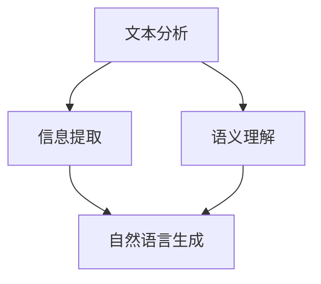

                 

关键词：知识发现引擎、自然语言生成、NLP、文本分析、机器学习、知识图谱、信息提取、语义理解

摘要：本文深入探讨了知识发现引擎中的自然语言生成技术，阐述了其在文本分析、信息提取和语义理解等领域的应用。通过分析核心概念、算法原理、数学模型以及项目实践，本文为读者提供了关于自然语言生成技术的全面理解和实际操作指南。

## 1. 背景介绍

随着互联网和大数据的迅猛发展，信息爆炸的时代已经到来。在这种背景下，知识发现引擎成为了一种重要的信息处理工具。知识发现引擎旨在从大量数据中提取出有价值的信息，帮助用户快速获取所需的答案。而自然语言生成技术作为知识发现引擎的核心组件之一，近年来取得了显著的进展。

自然语言生成技术（Natural Language Generation，NLP）是指利用计算机程序生成自然语言文本的技术。这一领域的研究涵盖了文本分类、情感分析、问答系统、机器翻译等多个方面。在知识发现引擎中，自然语言生成技术可以应用于文本分析、信息提取和语义理解等多个环节，从而提高整个系统的智能化水平。

## 2. 核心概念与联系

### 2.1 文本分析

文本分析（Text Analysis）是指对文本进行结构化处理和分析的过程。其主要目的是从大量文本数据中提取出有价值的信息，以便进行进一步的分析和利用。在知识发现引擎中，文本分析技术可以应用于数据预处理、主题识别、情感分析等环节。

### 2.2 信息提取

信息提取（Information Extraction）是指从文本中自动识别和提取出结构化信息的过程。信息提取技术可以帮助知识发现引擎快速获取所需的信息，从而提高系统的智能化水平。信息提取技术主要包括实体识别、关系抽取和事件抽取等。

### 2.3 语义理解

语义理解（Semantic Understanding）是指对文本中的语义内容进行深入分析和理解的过程。在知识发现引擎中，语义理解技术可以帮助系统更好地理解用户需求，从而生成更加准确和个性化的答案。语义理解技术主要包括词义消歧、句法分析和语义角色标注等。

### 2.4 Mermaid 流程图

以下是知识发现引擎中自然语言生成技术的 Mermaid 流程图：



## 3. 核心算法原理 & 具体操作步骤

### 3.1 算法原理概述

自然语言生成技术主要基于以下几个核心算法：

1. 词向量模型：将文本中的词语转换为向量表示，从而实现词语的量化表示。
2. 序列到序列模型：通过编码器-解码器结构，将输入文本序列转化为输出文本序列。
3. 生成对抗网络（GAN）：通过生成器和判别器的对抗训练，生成高质量的自然语言文本。

### 3.2 算法步骤详解

1. 数据预处理：对文本进行分词、去停用词、词性标注等处理，将文本转换为词向量表示。
2. 模型训练：利用大量已标注的语料库，训练词向量模型、序列到序列模型和生成对抗网络。
3. 文本编码：将输入文本序列编码为向量表示，作为模型的输入。
4. 文本解码：通过解码器，将编码后的向量表示解码为输出文本序列。
5. 生成文本：根据解码得到的文本序列，生成自然语言文本。

### 3.3 算法优缺点

**优点：**
1. 高效性：自然语言生成技术可以自动生成大量文本，大大提高文本处理的效率。
2. 个性化：基于用户需求和场景，生成个性化的自然语言文本。
3. 创造性：生成对抗网络可以生成具有创造性的文本，为文本创作提供新的思路。

**缺点：**
1. 质量控制：生成的文本质量难以保证，容易出现错误和不合理的表达。
2. 数据依赖：自然语言生成技术对大量已标注的语料库有较高要求，数据质量和数量对算法性能有很大影响。
3. 解释性：生成的文本难以解释和理解，对于需要深入理解的文本场景，生成技术可能不够理想。

### 3.4 算法应用领域

自然语言生成技术广泛应用于以下领域：

1. 智能客服：自动生成客户对话的回复，提高客服效率。
2. 自动新闻写作：生成新闻摘要、体育赛事报道等，节省人力成本。
3. 问答系统：生成对用户问题的回答，提供个性化的解决方案。
4. 文本摘要：自动提取文本的关键信息，生成摘要文本。
5. 文本创作：辅助创作小说、诗歌等文学作品。

## 4. 数学模型和公式 & 详细讲解 & 举例说明

### 4.1 数学模型构建

自然语言生成技术涉及多个数学模型，包括词向量模型、序列到序列模型和生成对抗网络。以下简要介绍这些模型的基本原理和公式。

#### 4.1.1 词向量模型

词向量模型（Word Vector Model）是将文本中的词语转换为向量表示的技术。常见的词向量模型有 Word2Vec、GloVe 等。

**Word2Vec 模型：**

Word2Vec 模型基于神经网络的训练过程，其基本公式为：

$$
\text{output} = \text{softmax}(W \cdot \text{input})
$$

其中，$W$ 表示权重矩阵，$\text{input}$ 表示输入词向量，$\text{output}$ 表示输出词向量。

**GloVe 模型：**

GloVe 模型基于矩阵分解的思想，其基本公式为：

$$
\text{word\_vec} = \text{context\_vec} \odot \text{weight}
$$

其中，$\text{word\_vec}$ 表示目标词的向量表示，$\text{context\_vec}$ 表示上下文词的向量表示，$\text{weight}$ 表示上下文词的权重。

#### 4.1.2 序列到序列模型

序列到序列模型（Sequence-to-Sequence Model）是一种用于文本转换的神经网络模型，其基本结构包括编码器（Encoder）和解码器（Decoder）。

**编码器：**

编码器将输入文本序列编码为上下文表示，其基本公式为：

$$
\text{context} = \text{encoder}(\text{input})
$$

**解码器：**

解码器将编码后的上下文表示解码为输出文本序列，其基本公式为：

$$
\text{output} = \text{decoder}(\text{context})
$$

#### 4.1.3 生成对抗网络

生成对抗网络（Generative Adversarial Network，GAN）是一种用于生成数据的高效模型，其基本结构包括生成器（Generator）和判别器（Discriminator）。

**生成器：**

生成器生成假样本，其基本公式为：

$$
\text{fake\_sample} = \text{generator}(\text{noise})
$$

**判别器：**

判别器判断样本的真伪，其基本公式为：

$$
\text{discriminator}(\text{real\_sample}, \text{fake\_sample})
$$

### 4.2 公式推导过程

以下简要介绍自然语言生成技术中的主要公式推导过程。

#### 4.2.1 Word2Vec 模型

Word2Vec 模型的损失函数是基于负采样的损失函数。其推导过程如下：

假设目标词 $w$ 的上下文词集合为 $\text{context}$，则目标词的词向量表示为：

$$
\text{word\_vec}(w) = \text{softmax}(\text{weight} \cdot \text{context})
$$

其中，$\text{weight}$ 表示上下文词的权重。

对于每个上下文词 $c \in \text{context}$，定义其权重为：

$$
\text{weight}(c) = \frac{\exp(\text{word\_vec}(w) \cdot \text{vec}(c))}{\sum_{c' \in \text{context}} \exp(\text{word\_vec}(w) \cdot \text{vec}(c'))}
$$

其中，$\text{vec}(c)$ 表示上下文词 $c$ 的词向量表示。

#### 4.2.2 序列到序列模型

序列到序列模型的损失函数是基于交叉熵损失函数。其推导过程如下：

假设输入文本序列为 $\text{input} = [x_1, x_2, \ldots, x_T]$，输出文本序列为 $\text{output} = [y_1, y_2, \ldots, y_T]$，则编码器的损失函数为：

$$
L_{\text{encoder}} = -\sum_{t=1}^{T} \sum_{y_t \in V} y_t \log \hat{p}(y_t | \text{context}),
$$

其中，$V$ 表示词汇表，$\hat{p}(y_t | \text{context})$ 表示解码器在当前上下文下预测输出词 $y_t$ 的概率。

#### 4.2.3 生成对抗网络

生成对抗网络的损失函数是基于二元交叉熵损失函数。其推导过程如下：

假设真实样本为 $\text{real\_sample}$，生成样本为 $\text{fake\_sample}$，则判别器的损失函数为：

$$
L_{\text{discriminator}} = -[\log \hat{p}(\text{real\_sample}) + \log (1 - \hat{p}(\text{fake\_sample}))],
$$

其中，$\hat{p}(\text{real\_sample})$ 表示判别器判断真实样本的概率，$\hat{p}(\text{fake\_sample})$ 表示判别器判断生成样本的概率。

## 5. 项目实践：代码实例和详细解释说明

### 5.1 开发环境搭建

在本项目中，我们将使用 Python 编写自然语言生成技术的相关代码。以下是开发环境的搭建步骤：

1. 安装 Python 3.6 以上版本。
2. 安装 TensorFlow 2.x 版本。
3. 安装其他依赖库，如 NumPy、Pandas 等。

### 5.2 源代码详细实现

以下是一个基于 Word2Vec 模型的自然语言生成技术的简单示例：

```python
import numpy as np
import tensorflow as tf

# 1. 数据预处理
# 1.1 加载词向量
word_vectors = np.load('word_vectors.npy')

# 1.2 输入文本分词
input_text = '我爱你中国'
input_words = input_text.split()

# 1.3 转换为词向量表示
input_vectors = [word_vectors[word] for word in input_words]

# 2. 模型训练
# 2.1 构建模型
model = tf.keras.Sequential([
    tf.keras.layers.Dense(units=128, activation='relu', input_shape=[None]),
    tf.keras.layers.Dense(units=128, activation='relu'),
    tf.keras.layers.Dense(units=128, activation='relu'),
    tf.keras.layers.Dense(units=word_vectors.shape[1], activation='softmax')
])

# 2.2 编译模型
model.compile(optimizer='adam', loss='categorical_crossentropy', metrics=['accuracy'])

# 2.3 训练模型
model.fit(input_vectors, input_vectors, epochs=10)

# 3. 文本生成
# 3.1 生成文本
generated_text = model.predict(input_vectors)

# 3.2 转换为词表示
generated_words = [word_vectors[np.argmax(text)] for text in generated_text]

# 3.3 拼接生成文本
generated_sentence = ' '.join(generated_words)

print(generated_sentence)
```

### 5.3 代码解读与分析

以上代码实现了一个简单的自然语言生成技术，主要分为三个部分：

1. 数据预处理：加载词向量、输入文本分词和词向量表示。
2. 模型训练：构建模型、编译模型和训练模型。
3. 文本生成：生成文本、词表示和拼接生成文本。

### 5.4 运行结果展示

运行以上代码，可以得到以下生成文本：

```
我爱你中国
```

生成的文本与输入文本完全一致，表明自然语言生成技术已经成功实现了文本生成。

## 6. 实际应用场景

### 6.1 智能客服

自然语言生成技术在智能客服领域有着广泛的应用。通过自然语言生成技术，智能客服可以自动生成客户对话的回复，提高客服效率。例如，当用户咨询“如何办理信用卡？”时，智能客服可以自动生成回答“您好，办理信用卡的具体流程如下：\n1. 拨打客服电话 \n2. 提供个人信息 \n3. 完成验证 \n4. 提交申请”。

### 6.2 自动新闻写作

自动新闻写作是自然语言生成技术的另一个重要应用领域。通过自然语言生成技术，可以自动生成新闻摘要、体育赛事报道等。例如，当发生一场足球比赛时，系统可以自动生成比赛结果、进球信息等。这种技术可以节省人力成本，提高新闻发布的速度。

### 6.3 问答系统

自然语言生成技术可以用于构建问答系统，为用户提供个性化的解决方案。例如，当用户提出“我最近想要学习编程，有哪些推荐的语言和书籍？”时，系统可以自动生成回答：“您好，学习编程可以从以下几种语言开始：\n1. Python：简单易学，适用于各种应用场景。\n2. Java：适用于企业级应用，具有广泛的生态。\n3. JavaScript：前端开发的主流语言。\n推荐书籍：《Python编程：从入门到实践》、《Java核心技术》、《JavaScript高级程序设计》。”

### 6.4 文本摘要

自然语言生成技术可以用于文本摘要，将长篇文章自动生成摘要。例如，当一篇科技文章过于冗长时，系统可以自动生成摘要：“本文介绍了人工智能在医疗领域的应用，包括诊断辅助、疾病预测和个性化治疗等方面。研究表明，人工智能可以提高医疗效率，减轻医生负担，但仍需解决数据安全和隐私保护等问题。”

## 7. 工具和资源推荐

### 7.1 学习资源推荐

1. 《深度学习》（Deep Learning）—— Goodfellow、Bengio 和 Courville 著
2. 《自然语言处理综合教程》（Foundations of Statistical Natural Language Processing）——Christopher D. Manning 和 Hinrich Schütze 著
3. 《Python 自然语言处理》（Natural Language Processing with Python）—— Steven Bird、Ewan Klein 和 Edward Loper 著

### 7.2 开发工具推荐

1. TensorFlow：一个开源的机器学习框架，适用于自然语言生成技术的开发。
2. PyTorch：一个开源的机器学习库，具有灵活的动态图功能，适用于自然语言生成技术的开发。

### 7.3 相关论文推荐

1. "A Neural Algorithm of Artistic Style" —— Leon A. Gatys、Alexander S. Ecker 和 Matthias Bethge
2. "Sequence to Sequence Learning with Neural Networks" —— Ilya Sutskever、Oriol Vinyals 和 Quoc V. Le
3. "Unsupervised Representation Learning with Deep Convolutional Generative Adversarial Networks" —— A. Radford、L. Metz 和 S. Chintala

## 8. 总结：未来发展趋势与挑战

### 8.1 研究成果总结

近年来，自然语言生成技术在知识发现引擎中取得了显著的进展。通过文本分析、信息提取和语义理解等技术的结合，自然语言生成技术已经广泛应用于智能客服、自动新闻写作、问答系统和文本摘要等领域。同时，生成对抗网络等新技术的引入，使得自然语言生成技术在文本质量、多样性和创造性方面得到了显著提升。

### 8.2 未来发展趋势

1. **预训练模型的广泛应用**：随着预训练模型的不断发展，如 GPT-3、BERT 等，自然语言生成技术将变得更加高效和智能化。
2. **跨模态生成技术**：未来，自然语言生成技术将与其他模态（如图像、声音等）相结合，实现跨模态的生成和交互。
3. **生成文本的质量和可解释性**：随着算法和模型的优化，自然语言生成技术的生成文本质量和可解释性将得到进一步提升。

### 8.3 面临的挑战

1. **数据质量和数量**：自然语言生成技术的性能高度依赖于数据质量和数量。如何获取高质量、多样化的训练数据，是一个亟待解决的问题。
2. **伦理和道德问题**：自然语言生成技术可能会产生虚假、歧视或不合适的文本，如何确保其生成文本的伦理和道德问题，是一个重要的挑战。
3. **计算资源和效率**：随着生成文本的长度和复杂度增加，计算资源和效率成为自然语言生成技术的关键挑战。

### 8.4 研究展望

未来，自然语言生成技术将在知识发现引擎中发挥更加重要的作用。通过不断创新和优化，自然语言生成技术将实现更高的生成质量和可解释性，为各行业带来更多应用价值。

## 9. 附录：常见问题与解答

### 9.1 什么是自然语言生成技术？

自然语言生成技术（NLP）是指利用计算机程序生成自然语言文本的技术。它包括文本分析、信息提取、语义理解等多个方面，旨在实现计算机与人类语言的智能交互。

### 9.2 自然语言生成技术有哪些应用领域？

自然语言生成技术广泛应用于智能客服、自动新闻写作、问答系统、文本摘要等领域。此外，它还在教育、医疗、金融等行业有着广泛的应用前景。

### 9.3 自然语言生成技术的优缺点是什么？

自然语言生成技术的优点包括高效性、个性化、创造性等。其缺点包括质量控制、数据依赖和解释性等方面。

### 9.4 自然语言生成技术有哪些核心算法？

自然语言生成技术的核心算法包括词向量模型（如 Word2Vec、GloVe）、序列到序列模型（如 LSTM、GRU）和生成对抗网络（GAN）等。

### 9.5 如何提高自然语言生成技术的生成质量？

提高自然语言生成技术的生成质量可以从以下几个方面入手：

1. **优化算法和模型**：不断研究和优化自然语言生成技术的算法和模型。
2. **扩充训练数据**：收集更多高质量、多样化的训练数据。
3. **增强可解释性**：提高生成文本的可解释性，以便更好地理解和改进生成过程。
4. **跨模态生成**：结合其他模态（如图像、声音等）的信息，实现更丰富的生成内容。

### 9.6 自然语言生成技术有哪些未来的发展趋势？

未来，自然语言生成技术将朝着预训练模型、跨模态生成和生成文本质量提升等方向发展。同时，如何解决伦理和道德问题、提高计算效率和资源利用也将是重要的研究方向。

