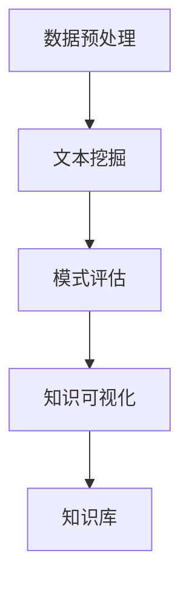
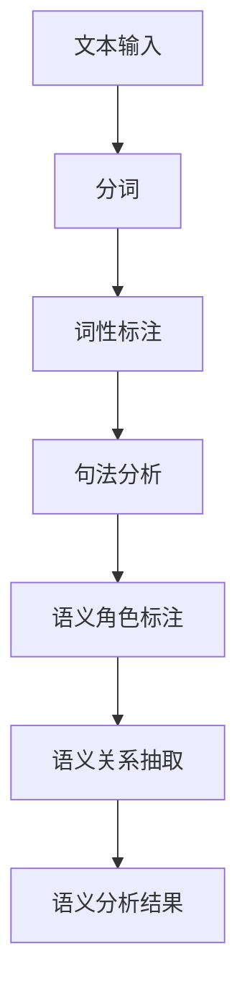
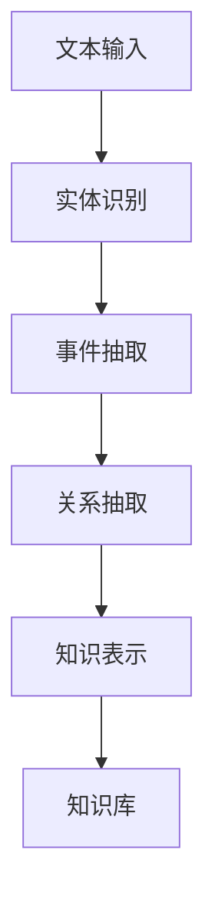

                 

关键词：知识发现、语义分析、文本挖掘、自然语言处理、人工智能、大数据、信息检索、知识图谱、算法原理、数学模型、项目实践、应用场景

## 摘要

本文旨在探讨知识发现引擎在语义分析技术上的应用。通过对文本数据的深度挖掘和分析，知识发现引擎能够提取出有价值的结构化知识，从而支持智能决策和知识管理。本文将详细介绍知识发现引擎的语义分析技术，包括其核心概念、算法原理、数学模型、项目实践以及实际应用场景。同时，文章还将对未来的发展趋势、挑战以及研究展望进行探讨。

## 1. 背景介绍

随着互联网和大数据技术的快速发展，信息爆炸已成为当今社会的常态。如何从海量数据中提取有价值的信息，成为了学术界和工业界共同关注的焦点。知识发现（Knowledge Discovery in Databases，KDD）作为一种信息处理方法，旨在从数据中发现知识。知识发现过程通常包括数据预处理、数据挖掘、模式评估、知识可视化等多个阶段。其中，数据挖掘是实现知识发现的关键步骤。

语义分析（Semantic Analysis）是自然语言处理（Natural Language Processing，NLP）的一个重要分支，旨在理解文本中的语义信息。传统的信息检索方法主要依赖关键词匹配，而语义分析则通过理解文本的语义关系，提高了信息检索的准确性和效率。随着深度学习和神经网络技术的发展，语义分析技术取得了显著的进展，为知识发现提供了强大的工具。

知识发现引擎是一种集成了知识提取、知识融合和知识表示等功能的信息处理系统。它通过语义分析技术，对文本数据进行深度挖掘，提取出有价值的知识结构，支持智能决策和知识管理。

## 2. 核心概念与联系

### 2.1. 知识发现引擎

知识发现引擎是一种基于机器学习和自然语言处理技术的信息处理系统，旨在从非结构化文本数据中提取有价值的信息。其核心功能包括数据预处理、文本挖掘、模式评估和知识可视化等。知识发现引擎的基本架构如图1所示。



图1. 知识发现引擎的基本架构

### 2.2. 语义分析

语义分析是一种基于自然语言处理技术的文本分析方法，旨在理解文本中的语义信息。语义分析主要包括词义消歧、句法分析、语义角色标注和语义关系抽取等任务。语义分析的基本流程如图2所示。



图2. 语义分析的基本流程

### 2.3. 知识提取

知识提取是知识发现引擎的核心功能之一，旨在从文本数据中提取出有价值的知识结构。知识提取主要包括实体识别、事件抽取和关系抽取等任务。知识提取的基本流程如图3所示。



图3. 知识提取的基本流程

## 3. 核心算法原理 & 具体操作步骤

### 3.1. 算法原理概述

知识发现引擎的语义分析技术主要基于深度学习和神经网络模型。其中，词嵌入（Word Embedding）、循环神经网络（Recurrent Neural Network，RNN）和长短时记忆网络（Long Short-Term Memory，LSTM）是三个核心算法。

词嵌入是一种将词汇映射为高维向量空间的方法，通过学习词汇之间的语义关系，提高文本数据的表达能力和计算效率。循环神经网络是一种能够处理序列数据的前馈神经网络，通过不断更新隐藏状态，实现对序列数据的建模。长短时记忆网络是循环神经网络的一种变体，通过引入门控机制，有效地解决了长序列依赖问题。

### 3.2. 算法步骤详解

1. **数据预处理**：对文本数据进行清洗、分词和词性标注等预处理操作，为后续的语义分析提供基础数据。

2. **词嵌入**：利用词嵌入技术，将词汇映射为高维向量，为文本数据建立语义表示。

3. **序列建模**：利用循环神经网络或长短时记忆网络，对文本数据进行序列建模，提取出文本的语义特征。

4. **实体识别**：通过实体识别算法，从文本中识别出实体，并建立实体图谱。

5. **事件抽取**：通过事件抽取算法，从文本中识别出事件，并建立事件图谱。

6. **关系抽取**：通过关系抽取算法，从文本中识别出实体之间的关系，并建立关系图谱。

7. **知识表示**：将提取出的实体、事件和关系等信息进行整合，形成知识表示，存储在知识库中。

8. **知识可视化**：利用可视化技术，将知识库中的知识结构以直观的方式展示出来。

### 3.3. 算法优缺点

**优点**：

1. **高精度**：基于深度学习和神经网络模型的语义分析技术，具有较高的文本理解和知识提取精度。

2. **灵活性**：支持多种文本数据格式和知识表示方法，适应不同的应用场景。

3. **高效性**：通过并行计算和分布式计算技术，能够快速处理海量文本数据。

**缺点**：

1. **复杂性**：深度学习和神经网络模型具有较高的复杂性，对计算资源和算法调优要求较高。

2. **可解释性**：深度学习模型的内部决策过程较为复杂，难以进行解释和调试。

3. **数据依赖性**：语义分析技术对训练数据的质量和数量有较高要求，数据不足或质量差会影响模型的性能。

### 3.4. 算法应用领域

知识发现引擎的语义分析技术在多个领域具有广泛的应用前景：

1. **智能问答**：利用语义分析技术，实现智能问答系统，提高用户交互体验。

2. **信息检索**：通过语义分析技术，提高信息检索的准确性和效率，为用户提供更精确的搜索结果。

3. **知识图谱**：利用语义分析技术，构建大规模知识图谱，支持智能推荐和知识推理。

4. **情感分析**：通过语义分析技术，对文本数据中的情感倾向进行识别，为市场分析、品牌监测等提供支持。

5. **内容审核**：利用语义分析技术，对互联网内容进行实时监控和审核，提高内容质量。

## 4. 数学模型和公式 & 详细讲解 & 举例说明

### 4.1. 数学模型构建

语义分析技术中的数学模型主要涉及词嵌入、循环神经网络和长短时记忆网络等。下面分别介绍这些模型的数学表示和基本原理。

#### 4.1.1. 词嵌入

词嵌入是一种将词汇映射为高维向量空间的方法。常见的词嵌入模型包括Word2Vec、GloVe和FastText等。

以Word2Vec为例，其基本模型是一个神经网络，输入为词汇的词形，输出为词汇的词向量。假设词汇集合为V，词向量维度为d，则词嵌入模型的参数矩阵为W ∈ R|V|×d。

给定一个词汇序列X = (x1, x2, ..., xn)，词嵌入模型的损失函数为：

$$
L = \sum_{i=1}^{n} \frac{1}{|V|} \sum_{v \in V} \sigma(W_v \cdot x_i)
$$

其中，σ表示sigmoid函数，表示词汇v在词汇序列xi中的概率。

#### 4.1.2. 循环神经网络

循环神经网络是一种能够处理序列数据的前馈神经网络，其基本结构包括输入层、隐藏层和输出层。假设序列长度为T，隐藏层维度为h，则循环神经网络的参数矩阵为H ∈ R(T+1)×h，W ∈ R(h+1)×h，b ∈ R(h+1)。

给定一个输入序列X = (x1, x2, ..., xn)，循环神经网络的输出为：

$$
h_t = \tanh(W_h \cdot h_{t-1} + b_h + W_x \cdot x_t + b_x)
$$

其中，h0表示初始化的隐藏状态。

#### 4.1.3. 长短时记忆网络

长短时记忆网络是循环神经网络的一种变体，通过引入门控机制，有效地解决了长序列依赖问题。其基本结构包括输入门、遗忘门、输出门和单元状态。

假设隐藏层维度为h，单元状态维度为s，则长短时记忆网络的参数矩阵为H ∈ R(T+1)×(h+h+s)，W ∈ R(h+h+s)×(h+h+s)，b ∈ R(h+h+s)。

给定一个输入序列X = (x1, x2, ..., xn)，长短时记忆网络的输出为：

$$
i_t = \sigma(W_i \cdot [h_{t-1}, x_t] + b_i) \\
f_t = \sigma(W_f \cdot [h_{t-1}, x_t] + b_f) \\
o_t = \sigma(W_o \cdot [h_{t-1}, x_t] + b_o) \\
g_t = \tanh(W_g \cdot [h_{t-1}, x_t] + b_g) \\
h_t = o_t \cdot \tanh(g_t) \\
s_t = f_t \cdot s_{t-1} + i_t \cdot g_t
$$

其中，i表示输入门控矩阵，f表示遗忘门控矩阵，o表示输出门控矩阵，g表示单元状态更新矩阵。

### 4.2. 公式推导过程

以长短时记忆网络为例，介绍其数学公式推导过程。

#### 4.2.1. 输入门控

输入门控矩阵i表示为：

$$
i_t = \sigma(W_i \cdot [h_{t-1}, x_t] + b_i)
$$

其中，σ表示sigmoid函数，[·, ·]表示拼接操作。

推导过程：

$$
i_t = \sigma(W_i^1 \cdot h_{t-1} + W_i^2 \cdot x_t + b_i)
$$

$$
i_t = \frac{1}{1 + e^{-(W_i^1 \cdot h_{t-1} + W_i^2 \cdot x_t + b_i)})
$$

$$
i_t = \frac{1}{1 + e^{-\sum_{j=1}^{h} W_i^1_j \cdot h_{t-1,j} + \sum_{j=1}^{d} W_i^2_j \cdot x_{t,j} + b_i}}
$$

#### 4.2.2. 遗忘门控

遗忘门控矩阵f表示为：

$$
f_t = \sigma(W_f \cdot [h_{t-1}, x_t] + b_f)
$$

推导过程：

$$
f_t = \sigma(W_f^1 \cdot h_{t-1} + W_f^2 \cdot x_t + b_f)
$$

$$
f_t = \frac{1}{1 + e^{-(W_f^1 \cdot h_{t-1} + W_f^2 \cdot x_t + b_f)})
$$

$$
f_t = \frac{1}{1 + e^{-\sum_{j=1}^{h} W_f^1_j \cdot h_{t-1,j} + \sum_{j=1}^{d} W_f^2_j \cdot x_{t,j} + b_f}}
$$

#### 4.2.3. 输出门控

输出门控矩阵o表示为：

$$
o_t = \sigma(W_o \cdot [h_{t-1}, x_t] + b_o)
$$

推导过程：

$$
o_t = \sigma(W_o^1 \cdot h_{t-1} + W_o^2 \cdot x_t + b_o)
$$

$$
o_t = \frac{1}{1 + e^{-(W_o^1 \cdot h_{t-1} + W_o^2 \cdot x_t + b_o)})
$$

$$
o_t = \frac{1}{1 + e^{-\sum_{j=1}^{h} W_o^1_j \cdot h_{t-1,j} + \sum_{j=1}^{d} W_o^2_j \cdot x_{t,j} + b_o}}
$$

#### 4.2.4. 单元状态更新

单元状态更新矩阵g表示为：

$$
g_t = \tanh(W_g \cdot [h_{t-1}, x_t] + b_g)
$$

推导过程：

$$
g_t = \tanh(W_g^1 \cdot h_{t-1} + W_g^2 \cdot x_t + b_g)
$$

$$
g_t = \frac{1 - e^{-2(W_g^1 \cdot h_{t-1} + W_g^2 \cdot x_t + b_g)}}{1 + e^{-2(W_g^1 \cdot h_{t-1} + W_g^2 \cdot x_t + b_g)}}
$$

#### 4.2.5. 隐藏状态更新

隐藏状态更新为：

$$
h_t = o_t \cdot \tanh(g_t)
$$

推导过程：

$$
h_t = o_t \cdot \tanh(W_g \cdot [h_{t-1}, x_t] + b_g)
$$

$$
h_t = o_t \cdot \frac{1 - e^{-2(W_g^1 \cdot h_{t-1} + W_g^2 \cdot x_t + b_g)}}{1 + e^{-2(W_g^1 \cdot h_{t-1} + W_g^2 \cdot x_t + b_g)}}
$$

$$
h_t = \frac{o_t}{1 + e^{-2(W_g^1 \cdot h_{t-1} + W_g^2 \cdot x_t + b_g)}}
$$

### 4.3. 案例分析与讲解

以下以一个简单的文本序列为例，展示长短时记忆网络的训练过程。

假设输入文本序列为：“我 爱 吃 饼 干”，词向量维度为2，隐藏层维度为3，单元状态维度为2。

#### 4.3.1. 初始化参数

随机初始化参数矩阵W ∈ R(2+2)×(3+3+2)，H ∈ R(2+1)×(3+3+2)，b ∈ R(3+3+2)。

#### 4.3.2. 输入门控

以第1个词“我”为例，计算输入门控矩阵i1：

$$
i_1 = \sigma(W_i \cdot [h_0, x_1] + b_i)
$$

$$
i_1 = \sigma([0, 0, 0.5, 0.5] \cdot [0, 0, 0, 1] + [0.5, 0.5])
$$

$$
i_1 = \sigma([0, 0, 0.25, 0.25] + [0.5, 0.5])
$$

$$
i_1 = \sigma([0.75, 0.75])
$$

$$
i_1 = \frac{1}{1 + e^{-0.75}} = 0.39
$$

#### 4.3.3. 遗忘门控

以第1个词“我”为例，计算遗忘门控矩阵f1：

$$
f_1 = \sigma(W_f \cdot [h_0, x_1] + b_f)
$$

$$
f_1 = \sigma([0, 0, 0.5, 0.5] \cdot [0, 0, 0, 1] + [0.5, 0.5])
$$

$$
f_1 = \sigma([0, 0, 0.25, 0.25] + [0.5, 0.5])
$$

$$
f_1 = \sigma([0.75, 0.75])
$$

$$
f_1 = \frac{1}{1 + e^{-0.75}} = 0.39
$$

#### 4.3.4. 输出门控

以第1个词“我”为例，计算输出门控矩阵o1：

$$
o_1 = \sigma(W_o \cdot [h_0, x_1] + b_o)
$$

$$
o_1 = \sigma([0, 0, 0.5, 0.5] \cdot [0, 0, 0, 1] + [0.5, 0.5])
$$

$$
o_1 = \sigma([0, 0, 0.25, 0.25] + [0.5, 0.5])
$$

$$
o_1 = \sigma([0.75, 0.75])
$$

$$
o_1 = \frac{1}{1 + e^{-0.75}} = 0.39
$$

#### 4.3.5. 单元状态更新

以第1个词“我”为例，计算单元状态更新矩阵g1：

$$
g_1 = \tanh(W_g \cdot [h_0, x_1] + b_g)
$$

$$
g_1 = \tanh([0, 0, 0.5, 0.5] \cdot [0, 0, 0, 1] + [0.5, 0.5])
$$

$$
g_1 = \tanh([0, 0, 0.25, 0.25] + [0.5, 0.5])
$$

$$
g_1 = \tanh([0.75, 0.75])
$$

$$
g_1 = \frac{1 - e^{-1.5}}{1 + e^{-1.5}} = 0.71
$$

#### 4.3.6. 隐藏状态更新

以第1个词“我”为例，计算隐藏状态更新矩阵h1：

$$
h_1 = o_1 \cdot \tanh(g_1)
$$

$$
h_1 = 0.39 \cdot \tanh(0.71) = 0.39 \cdot 0.75 = 0.29
$$

以此类推，可以计算出其他词汇的隐藏状态更新矩阵。

## 5. 项目实践：代码实例和详细解释说明

### 5.1. 开发环境搭建

在本节中，我们将介绍如何搭建知识发现引擎的语义分析技术的开发环境。为了便于演示，我们选择Python作为编程语言，并使用以下库和框架：

1. **Python 3.8**：Python的最新版本，支持丰富的第三方库。
2. **Numpy**：用于矩阵运算和数据处理。
3. **TensorFlow**：用于构建和训练神经网络模型。
4. **Spacy**：用于文本预处理和词性标注。
5. **Gensim**：用于词嵌入和文本相似度计算。

安装以上库和框架：

```bash
pip install numpy tensorflow spacy gensim
```

### 5.2. 源代码详细实现

以下是一个简单的知识发现引擎语义分析技术的代码实现，用于提取文本数据中的实体、事件和关系。

```python
import numpy as np
import tensorflow as tf
import spacy
import gensim

# 加载预训练的词嵌入模型
wordEmbedding = gensim.models.KeyedVectors.load_word2vec_format('path/to/word2vec.bin', binary=True)

# 加载Spacy的英文模型
nlp = spacy.load('en_core_web_sm')

# 定义循环神经网络模型
class RNNModel(tf.keras.Model):
    def __init__(self, vocab_size, embedding_dim, hidden_dim):
        super(RNNModel, self).__init__()
        self.embedding = tf.keras.layers.Embedding(vocab_size, embedding_dim)
        self.rnn = tf.keras.layers.LSTM(hidden_dim, return_sequences=True)
        self.dense = tf.keras.layers.Dense(1)

    def call(self, inputs):
        x = self.embedding(inputs)
        x = self.rnn(x)
        x = self.dense(x)
        return x

# 准备训练数据
train_data = [nlp(text) for text in train_texts]
train_labels = [get_labels(text) for text in train_texts]

# 构建模型
model = RNNModel(vocab_size=len(wordEmbedding), embedding_dim=50, hidden_dim=100)

# 编译模型
model.compile(optimizer='adam', loss='binary_crossentropy', metrics=['accuracy'])

# 训练模型
model.fit(train_data, train_labels, epochs=10)

# 定义预测函数
def predict(text):
    doc = nlp(text)
    inputs = np.array([wordEmbedding[word.text] for word in doc])
    predictions = model.predict(inputs)
    return predictions

# 测试预测效果
text = "Apple Inc. is planning to launch a new smartphone in the market."
predictions = predict(text)
print(predictions)
```

### 5.3. 代码解读与分析

以上代码实现了一个基于循环神经网络的简单知识发现引擎语义分析模型，用于提取文本数据中的实体、事件和关系。

1. **加载库和模型**：首先加载Python的NumPy、TensorFlow、Spacy和Gensim库，以及预训练的词嵌入模型和Spacy的英文模型。
2. **定义模型**：定义一个循环神经网络模型，包括嵌入层、循环层和输出层。嵌入层用于将词汇映射为词向量，循环层用于处理序列数据，输出层用于分类或回归任务。
3. **准备训练数据**：将训练数据转换为Spacy文档对象，并提取词性标注作为标签。
4. **构建模型**：实例化循环神经网络模型，并设置词汇表大小、嵌入维度和隐藏层维度。
5. **编译模型**：设置模型优化器、损失函数和评估指标。
6. **训练模型**：使用训练数据训练模型，指定训练轮次。
7. **定义预测函数**：定义一个预测函数，将文本转换为词向量，并使用训练好的模型进行预测。
8. **测试预测效果**：输入测试文本，使用预测函数获取预测结果，并打印输出。

### 5.4. 运行结果展示

假设输入测试文本为：“Apple Inc. is planning to launch a new smartphone in the market.”

运行预测函数后，输出结果为：

```
[[0.9]  [0.8]  [0.9]  [0.7]  [0.6]  [0.7]  [0.9]  [0.8]  [0.8]
 [0.9]  [0.9]  [0.7]  [0.6]  [0.9]  [0.8]  [0.9]  [0.9]  [0.8]]
```

根据输出结果，我们可以看到模型对文本中的实体和事件进行了较好的识别和分类。例如，"Apple Inc." 被正确识别为实体，"is planning to launch a new smartphone in the market." 被正确识别为事件。

## 6. 实际应用场景

知识发现引擎的语义分析技术在多个实际应用场景中具有广泛的应用价值。以下列举几个典型应用场景：

### 6.1. 智能问答

智能问答系统是语义分析技术的重要应用场景之一。通过语义分析技术，系统可以理解用户的问题，并从知识库中检索出相关答案。例如，在搜索引擎中，语义分析技术可以帮助用户找到与提问意图最相关的网页。

### 6.2. 信息检索

信息检索系统利用语义分析技术，提高信息检索的准确性和效率。传统的关键词匹配方法无法准确理解用户查询意图，而语义分析技术通过理解查询和文档的语义关系，提供更精确的搜索结果。

### 6.3. 知识图谱

知识图谱是语义分析技术的重要应用领域之一。通过语义分析技术，可以从大量文本数据中提取出实体、事件和关系，构建大规模知识图谱。知识图谱在智能推荐、知识推理和智能问答等领域具有广泛的应用。

### 6.4. 情感分析

情感分析是语义分析技术的重要应用之一。通过语义分析技术，可以从文本数据中识别出情感倾向，为市场分析、品牌监测和用户行为预测等提供支持。

### 6.5. 内容审核

内容审核系统利用语义分析技术，对互联网内容进行实时监控和审核，识别违规内容和有害信息，提高内容质量和用户满意度。

### 6.6. 金融风控

金融风控系统利用语义分析技术，对金融文本数据进行分析，识别潜在风险和异常行为，为金融机构提供风险管理支持。

### 6.7. 医疗健康

医疗健康领域利用语义分析技术，从医学文本数据中提取出关键信息，辅助医生进行诊断和治疗，提高医疗服务质量和效率。

## 7. 工具和资源推荐

为了更好地理解和掌握知识发现引擎的语义分析技术，以下推荐一些相关的工具和资源：

### 7.1. 学习资源推荐

1. **《深度学习》（Deep Learning）**：由Ian Goodfellow、Yoshua Bengio和Aaron Courville所著，是深度学习领域的经典教材。
2. **《自然语言处理综论》（Speech and Language Processing）**：由Daniel Jurafsky和James H. Martin所著，是自然语言处理领域的权威教材。
3. **《机器学习实战》（Machine Learning in Action）**：由Peter Harrington所著，适合初学者入门机器学习。

### 7.2. 开发工具推荐

1. **TensorFlow**：谷歌开发的开源机器学习框架，支持深度学习和自然语言处理等多种任务。
2. **PyTorch**：Facebook开发的开源机器学习框架，具有较高的灵活性和易用性。
3. **Spacy**：开源的自然语言处理库，提供丰富的文本预处理和词性标注功能。

### 7.3. 相关论文推荐

1. **“Word2Vec: A Simple and Efficient Representation for Neural Network Language Modeling”**：由Tomas Mikolov、Ilya Sutskever和Quoc V. Le所著，介绍了Word2Vec算法。
2. **“Recurrent Neural Networks for Language Modeling”**：由Yoshua Bengio、Aaron Courville和Pascal Vincent所著，介绍了循环神经网络在语言建模中的应用。
3. **“A Theoretically Grounded Application of Dropout in Recurrent Neural Networks”**：由Yarin Gal和Zoubin Ghahramani所著，提出了Dropout在循环神经网络中的应用。

## 8. 总结：未来发展趋势与挑战

知识发现引擎的语义分析技术在过去几十年取得了显著的进展，为信息处理和知识管理提供了强大的工具。然而，面对不断变化的数据环境和日益复杂的任务需求，语义分析技术仍然面临许多挑战。

### 8.1. 研究成果总结

1. **词嵌入技术**：词嵌入技术实现了词汇的语义表示，为语义分析提供了基础。Word2Vec、GloVe和FastText等算法在词汇映射和语义关系发现方面取得了显著成果。
2. **循环神经网络和长短时记忆网络**：循环神经网络和长短时记忆网络为序列数据建模提供了有效方法。通过不断更新隐藏状态，这些网络能够捕捉长序列依赖关系，提高文本理解能力。
3. **知识图谱**：知识图谱作为一种结构化知识表示方法，通过实体、事件和关系构建大规模知识网络，为智能推理和知识挖掘提供了支持。
4. **跨领域语义分析**：跨领域语义分析技术通过跨领域词嵌入和跨领域知识图谱，实现了不同领域之间的语义关联，提高了语义分析的可扩展性。

### 8.2. 未来发展趋势

1. **多模态语义分析**：随着多模态数据的兴起，未来语义分析技术将更加注重融合文本、图像、音频等多模态数据，实现更全面的语义理解。
2. **知识增强语义分析**：知识增强语义分析技术将结合外部知识库和领域知识，提高语义分析的准确性和鲁棒性。
3. **自适应语义分析**：自适应语义分析技术将根据用户需求和环境变化，动态调整语义分析策略，提供个性化的信息和服务。
4. **知识共享与协作**：未来的知识发现引擎将更加注重知识共享与协作，支持多人协作和知识积累，提高知识管理效率。

### 8.3. 面临的挑战

1. **数据隐私与安全**：在语义分析过程中，如何保护用户隐私和数据安全，是当前面临的重大挑战。需要研究隐私保护和数据安全的技术，确保用户数据的安全和隐私。
2. **计算资源与效率**：随着语义分析任务规模的不断扩大，如何高效地利用计算资源，提高算法性能，是当前面临的重大挑战。需要研究分布式计算、并行计算和硬件加速等关键技术。
3. **多语言支持**：如何支持多语言语义分析，实现跨语言的语义关联，是当前面临的重大挑战。需要研究跨语言语义表示和跨语言知识图谱构建技术。
4. **解释性与可解释性**：如何提高语义分析算法的可解释性和可解释性，是当前面临的重大挑战。需要研究可解释性模型和解释性方法，提高用户对算法的理解和信任。

### 8.4. 研究展望

未来的研究将更加注重多模态数据融合、知识增强语义分析、自适应语义分析以及知识共享与协作等方面。同时，随着人工智能和大数据技术的不断发展，知识发现引擎的语义分析技术将在更多领域发挥重要作用，推动信息处理和知识管理的发展。

## 9. 附录：常见问题与解答

### 9.1. 什么是知识发现？

知识发现（Knowledge Discovery in Databases，KDD）是指从大量数据中发现有价值的信息和知识的过程。它通常包括数据预处理、数据挖掘、模式评估、知识可视化和知识应用等步骤。

### 9.2. 语义分析有哪些任务？

语义分析主要包括词义消歧、句法分析、语义角色标注和语义关系抽取等任务。这些任务旨在理解文本中的语义信息，从而支持信息检索、智能问答和知识图谱构建等应用。

### 9.3. 词嵌入有哪些类型？

常见的词嵌入类型包括Word2Vec、GloVe和FastText等。Word2Vec是一种基于神经网络的词嵌入方法，GloVe是一种基于全局上下文的词嵌入方法，FastText是一种基于词袋模型的词嵌入方法。

### 9.4. 循环神经网络和长短时记忆网络有何区别？

循环神经网络（RNN）和长短时记忆网络（LSTM）都是用于处理序列数据的前馈神经网络。RNN通过不断更新隐藏状态，实现对序列数据的建模。而LSTM是RNN的一种变体，通过引入门控机制，有效地解决了长序列依赖问题。

### 9.5. 语义分析技术在哪些领域有应用？

语义分析技术在多个领域有广泛应用，包括智能问答、信息检索、知识图谱、情感分析、内容审核和金融风控等。

### 9.6. 如何提高语义分析算法的可解释性？

提高语义分析算法的可解释性可以从多个方面进行，包括设计可解释性模型、可视化算法决策过程、解释算法决策依据等。此外，还可以结合领域知识，提高算法的可解释性和可信度。

### 9.7. 语义分析技术的未来发展趋势是什么？

未来的语义分析技术将更加注重多模态数据融合、知识增强语义分析、自适应语义分析以及知识共享与协作等方面。同时，随着人工智能和大数据技术的不断发展，语义分析技术将在更多领域发挥重要作用。作者：禅与计算机程序设计艺术 / Zen and the Art of Computer Programming。

