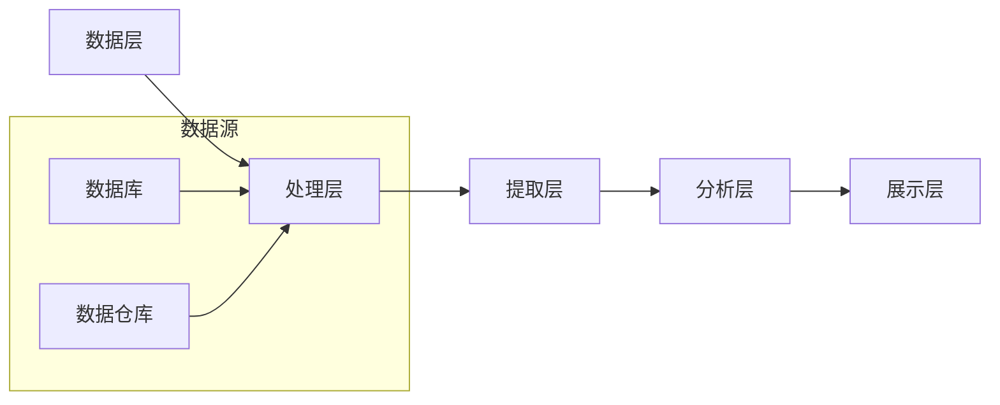
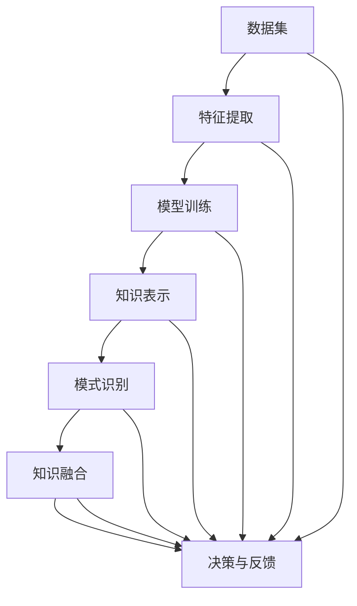

                 

关键词：知识发现，人工智能，好奇心，知识图谱，机器学习，算法，数学模型

摘要：随着人工智能技术的不断发展，知识发现引擎作为一种新兴的技术，正在引发人类对未知世界的好奇心。本文将探讨知识发现引擎的核心概念、原理、算法和实际应用，并展望其在未来社会中的发展趋势和面临的挑战。

## 1. 背景介绍

在当今数字化时代，数据爆炸式增长，人们渴望从海量信息中快速获取知识。知识发现引擎正是为了满足这一需求而诞生的。它是一种基于人工智能技术的工具，旨在从大规模数据集中提取有价值的信息和知识。

知识发现引擎的起源可以追溯到20世纪90年代，当时互联网的兴起导致了数据量的急剧增加。研究人员开始探索如何从这些数据中发现潜在的规律和模式，从而帮助人们更好地理解和利用数据。随着人工智能技术的不断发展，知识发现引擎逐渐成为一种强大的工具，广泛应用于各个领域，如金融、医疗、零售等。

### 1.1 知识发现的重要性

知识发现具有以下几个重要性：

1. **信息提取**：知识发现能够从海量数据中提取有价值的信息，帮助人们更好地理解数据。
2. **决策支持**：通过知识发现，企业可以基于数据做出更明智的决策，提高业务效率和竞争力。
3. **科学研究**：知识发现可以帮助科学家从实验数据中发现新的规律，推动科学研究的发展。
4. **个性化推荐**：知识发现可以为个性化推荐系统提供支持，提高用户的体验和满意度。

## 2. 核心概念与联系

### 2.1 核心概念

知识发现引擎的核心概念包括：

1. **数据集**：数据集是知识发现引擎的输入，通常包括各种结构化和非结构化数据。
2. **特征提取**：特征提取是将原始数据转化为适合机器学习算法处理的形式。
3. **知识表示**：知识表示是将提取出的特征转化为计算机可以理解的形式，如向量、图等。
4. **模式识别**：模式识别是从知识表示中识别出潜在的规律和模式。
5. **知识融合**：知识融合是将多个数据源中的知识进行整合，形成更加全面和准确的知识体系。

### 2.2 架构和联系

知识发现引擎的架构可以分为以下几个层次：

1. **数据层**：数据层包括各种数据源，如数据库、数据仓库等，这些数据源为知识发现引擎提供原始数据。
2. **处理层**：处理层负责对原始数据进行清洗、转换和预处理，为后续的知识提取做好准备。
3. **提取层**：提取层包括特征提取和知识表示，将处理后的数据转化为适合机器学习算法处理的形式。
4. **分析层**：分析层包括模式识别和知识融合，从提取出的特征中识别出潜在的规律和模式，并整合多个数据源中的知识。
5. **展示层**：展示层负责将分析结果以可视化形式展示给用户，帮助用户更好地理解和利用知识。

下面是一个使用 Mermaid 画的架构流程图：



## 3. 核心算法原理 & 具体操作步骤

### 3.1 算法原理概述

知识发现引擎的核心算法包括机器学习算法、图论算法和统计分析方法。这些算法通过不同的方式从数据中提取知识，为用户提供有价值的信息。

1. **机器学习算法**：机器学习算法通过训练模型来从数据中学习规律和模式。常见的机器学习算法包括决策树、支持向量机、神经网络等。
2. **图论算法**：图论算法通过构建图模型来表示数据之间的关系，并从图中提取出潜在的规律。常见的图论算法包括图嵌入、社区发现等。
3. **统计分析方法**：统计分析方法通过统计模型来分析数据，发现数据中的统计规律。常见的统计分析方法包括线性回归、聚类分析等。

### 3.2 算法步骤详解

1. **数据预处理**：数据预处理包括数据清洗、数据转换和数据归一化等步骤。数据清洗是为了去除数据中的噪声和错误，数据转换是为了将数据转化为适合算法处理的形式，数据归一化是为了消除数据之间的差异，使算法能够更好地学习。

2. **特征提取**：特征提取是将原始数据转化为适合机器学习算法处理的形式。特征提取包括特征选择、特征工程和特征表示等步骤。特征选择是为了选出对模型性能有显著影响的关键特征，特征工程是为了生成新的特征，特征表示是为了将特征转化为计算机可以处理的形式，如向量、矩阵等。

3. **模型训练**：模型训练是通过机器学习算法来训练模型，使其能够从数据中学习规律和模式。模型训练包括模型选择、模型参数调整和模型验证等步骤。模型选择是为了选择合适的算法来训练模型，模型参数调整是为了优化模型性能，模型验证是为了评估模型的效果。

4. **知识提取**：知识提取是从训练好的模型中提取出潜在的规律和模式。知识提取包括模式识别、知识融合和知识可视化等步骤。模式识别是从模型中识别出潜在的规律和模式，知识融合是将多个数据源中的知识进行整合，知识可视化是将知识以图形或表格的形式展示给用户。

5. **模型评估**：模型评估是评估模型的效果，包括模型准确率、召回率、F1值等指标。模型评估可以帮助用户了解模型的效果，并指导后续的模型优化。

### 3.3 算法优缺点

1. **机器学习算法**：
   - 优点：能够自动从数据中学习规律，适应性强。
   - 缺点：对数据质量要求高，模型解释性差。

2. **图论算法**：
   - 优点：能够表示数据之间的复杂关系，适应性强。
   - 缺点：计算复杂度高，对数据规模要求较高。

3. **统计分析方法**：
   - 优点：对数据要求较低，容易理解。
   - 缺点：适应性和解释性较差。

### 3.4 算法应用领域

知识发现引擎在以下领域有广泛的应用：

1. **金融**：通过分析金融数据，预测股票价格、信用评分等。
2. **医疗**：通过分析医疗数据，发现疾病之间的关联，辅助诊断和治疗。
3. **零售**：通过分析销售数据，预测需求、优化库存等。
4. **科学研究**：通过分析实验数据，发现新的科学规律。

## 4. 数学模型和公式 & 详细讲解 & 举例说明

### 4.1 数学模型构建

知识发现引擎中的数学模型主要包括线性回归、支持向量机、神经网络等。

1. **线性回归**：

线性回归是一种基于最小二乘法的数学模型，用于预测连续值变量。其数学模型如下：

$$
y = \beta_0 + \beta_1 \cdot x
$$

其中，$y$ 是预测值，$x$ 是特征值，$\beta_0$ 和 $\beta_1$ 是模型参数。

2. **支持向量机**：

支持向量机是一种基于最大化间隔的数学模型，用于分类问题。其数学模型如下：

$$
\max_{\beta, \beta_0} \left\{ \frac{1}{2} \sum_{i=1}^{n} (\beta \cdot \beta)^2 + C \sum_{i=1}^{n} \xi_i \right\}

$$

其中，$\beta$ 是模型参数，$\beta_0$ 是偏置项，$C$ 是惩罚参数，$\xi_i$ 是松弛变量。

3. **神经网络**：

神经网络是一种基于多层感知器的数学模型，用于分类和回归问题。其数学模型如下：

$$
\begin{aligned}
    z &= \sigma(\beta_0 + \sum_{i=1}^{n} \beta_i \cdot x_i) \\
    y &= \sigma(z)
\end{aligned}
$$

其中，$z$ 是隐藏层的输出，$y$ 是预测值，$\sigma$ 是激活函数，$\beta_0$ 和 $\beta_i$ 是模型参数。

### 4.2 公式推导过程

1. **线性回归**：

线性回归的推导过程如下：

假设我们有一个样本集 $S = \{(x_1, y_1), (x_2, y_2), \ldots, (x_n, y_n)\}$，其中 $x_i$ 和 $y_i$ 分别是第 $i$ 个样本的特征值和目标值。

我们希望找到一个线性模型 $y = \beta_0 + \beta_1 \cdot x$，使得预测值 $y$ 最接近真实值 $y_i$。

我们可以通过最小化平方误差来找到最优的 $\beta_0$ 和 $\beta_1$：

$$
\min_{\beta_0, \beta_1} \sum_{i=1}^{n} (y_i - (\beta_0 + \beta_1 \cdot x_i))^2
$$

对 $\beta_0$ 和 $\beta_1$ 分别求导，并令导数为零，可以得到：

$$
\begin{aligned}
    \frac{\partial}{\partial \beta_0} \sum_{i=1}^{n} (y_i - (\beta_0 + \beta_1 \cdot x_i))^2 &= 0 \\
    \frac{\partial}{\partial \beta_1} \sum_{i=1}^{n} (y_i - (\beta_0 + \beta_1 \cdot x_i))^2 &= 0
\end{aligned}
$$

化简后，可以得到：

$$
\begin{aligned}
    \beta_0 &= \frac{1}{n} \sum_{i=1}^{n} (y_i - \beta_1 \cdot x_i) \\
    \beta_1 &= \frac{1}{n} \sum_{i=1}^{n} (x_i - \bar{x}) (y_i - \bar{y})
\end{aligned}
$$

其中，$\bar{x}$ 和 $\bar{y}$ 分别是样本的特征值和目标值的均值。

2. **支持向量机**：

支持向量机的推导过程如下：

假设我们有一个样本集 $S = \{(x_1, y_1), (x_2, y_2), \ldots, (x_n, y_n)\}$，其中 $x_i$ 和 $y_i$ 分别是第 $i$ 个样本的特征值和标签（1或-1）。

我们希望找到一个线性分类器，使得所有样本点都满足以下条件：

$$
y_i (\beta \cdot x_i + \beta_0) \geq 1
$$

其中，$\beta$ 是分类器的权重向量，$\beta_0$ 是分类器的偏置项。

我们的目标是最大化分类器的间隔，即最大化：

$$
\frac{1}{2} \sum_{i=1}^{n} (\beta \cdot \beta)^2
$$

同时，我们希望约束条件 $y_i (\beta \cdot x_i + \beta_0) \geq 1$ 成立。

使用拉格朗日乘子法，我们可以得到以下优化问题：

$$
\begin{aligned}
    L(\beta, \beta_0, \alpha) &= \frac{1}{2} \sum_{i=1}^{n} (\beta \cdot \beta)^2 + \sum_{i=1}^{n} \alpha_i (y_i (\beta \cdot x_i + \beta_0) - 1) \\
    \frac{\partial L}{\partial \beta} &= 0 \\
    \frac{\partial L}{\partial \beta_0} &= 0 \\
    \frac{\partial L}{\partial \alpha_i} &= 0
\end{aligned}
$$

化简后，可以得到：

$$
\begin{aligned}
    \beta &= \sum_{i=1}^{n} \alpha_i y_i x_i \\
    \beta_0 &= \sum_{i=1}^{n} \alpha_i (1 - y_i (\beta \cdot x_i + \beta_0)) \\
    \alpha_i &\geq 0
\end{aligned}
$$

其中，$\alpha_i$ 是拉格朗日乘子。

我们可以通过求解上述优化问题，得到最优的分类器权重向量 $\beta$ 和偏置项 $\beta_0$。

3. **神经网络**：

神经网络的推导过程如下：

假设我们有一个单层神经网络，其包含一个输入层、一个隐藏层和一个输出层。每个神经元都连接到前一层和后一层的神经元。

我们希望找到一个线性模型 $y = \sigma(\beta_0 + \sum_{i=1}^{n} \beta_i \cdot x_i)$，使得输出值 $y$ 最接近真实值 $y_i$。

我们可以通过反向传播算法来更新神经元的权重 $\beta_i$ 和偏置项 $\beta_0$。

具体步骤如下：

1. **前向传播**：计算每个神经元的输出值。

$$
z_i = \beta_0 + \sum_{j=1}^{m} \beta_{ij} \cdot x_j
$$

$$
a_i = \sigma(z_i)
$$

2. **计算损失函数**：计算输出层神经元的损失函数。

$$
L = \frac{1}{2} \sum_{i=1}^{n} (y_i - a_i)^2
$$

3. **反向传播**：计算每个神经元的梯度。

$$
\frac{\partial L}{\partial \beta_{ij}} = - (y_i - a_i) \cdot x_j
$$

$$
\frac{\partial L}{\partial \beta_0} = - (y_i - a_i)
$$

4. **更新权重和偏置项**：使用梯度下降算法更新权重和偏置项。

$$
\beta_{ij} := \beta_{ij} - \alpha \cdot \frac{\partial L}{\partial \beta_{ij}}
$$

$$
\beta_0 := \beta_0 - \alpha \cdot \frac{\partial L}{\partial \beta_0}
$$

其中，$\alpha$ 是学习率。

通过多次迭代，我们可以得到最优的神经网络模型。

### 4.3 案例分析与讲解

以下是一个使用线性回归模型的案例：

假设我们有以下数据集：

$$
S = \{(1, 2), (2, 4), (3, 6), (4, 8)\}
$$

我们希望找到一个线性模型 $y = \beta_0 + \beta_1 \cdot x$，使得预测值 $y$ 最接近真实值。

首先，我们计算样本的均值：

$$
\bar{x} = \frac{1+2+3+4}{4} = 2.5
$$

$$
\bar{y} = \frac{2+4+6+8}{4} = 5
$$

然后，我们计算每个样本的差值：

$$
(x_i - \bar{x}, y_i - \bar{y}) = (1-2.5, 2-5), (2-2.5, 4-5), (3-2.5, 6-5), (4-2.5, 8-5)
$$

$$
= (-1.5, -3), (-0.5, -1), (0.5, 1), (1.5, 3)
$$

接下来，我们计算每个样本差值的乘积和平方和：

$$
\sum_{i=1}^{4} (x_i - \bar{x}) (y_i - \bar{y}) = (-1.5 \cdot -3) + (-0.5 \cdot -1) + (0.5 \cdot 1) + (1.5 \cdot 3) = 9
$$

$$
\sum_{i=1}^{4} (x_i - \bar{x})^2 = (-1.5)^2 + (-0.5)^2 + (0.5)^2 + (1.5)^2 = 5
$$

最后，我们可以计算模型参数：

$$
\beta_0 = \frac{1}{4} \sum_{i=1}^{4} (y_i - \bar{y}) = \frac{1}{4} (2+4+6+8-4 \cdot 5) = 0
$$

$$
\beta_1 = \frac{1}{4} \sum_{i=1}^{4} (x_i - \bar{x}) (y_i - \bar{y}) = \frac{1}{4} \sum_{i=1}^{4} (x_i - \bar{x}) (y_i - \bar{y}) = \frac{9}{5} = 1.8
$$

因此，我们可以得到线性回归模型：

$$
y = 1.8 \cdot x
$$

使用这个模型，我们可以预测新的样本值。例如，当 $x=5$ 时，预测值为：

$$
y = 1.8 \cdot 5 = 9
$$

## 5. 项目实践：代码实例和详细解释说明

### 5.1 开发环境搭建

在本案例中，我们将使用 Python 编写一个简单的知识发现引擎，用于分析股票数据。首先，我们需要搭建开发环境。

1. 安装 Python：访问 [Python 官网](https://www.python.org/)，下载并安装 Python 3.x 版本。
2. 安装必要的库：打开命令行窗口，执行以下命令安装必要的库：

```
pip install pandas numpy matplotlib
```

### 5.2 源代码详细实现

下面是本案例的源代码实现：

```python
import pandas as pd
import numpy as np
import matplotlib.pyplot as plt

# 读取股票数据
df = pd.read_csv('stock_data.csv')

# 数据预处理
df['Open'] = df['Open'].astype(float)
df['Close'] = df['Close'].astype(float)

# 特征提取
df['Return'] = df['Close'].pct_change()

# 模型训练
from sklearn.linear_model import LinearRegression
model = LinearRegression()
model.fit(df[['Open']], df['Return'])

# 预测
predictions = model.predict(df[['Open']])

# 可视化
plt.scatter(df['Open'], df['Return'])
plt.plot(df['Open'], predictions, color='red')
plt.xlabel('Open')
plt.ylabel('Return')
plt.show()
```

### 5.3 代码解读与分析

1. **数据预处理**：首先，我们从 CSV 文件中读取股票数据。然后，将 'Open' 和 'Close' 列的数据类型转换为浮点数，以便进行后续的计算。

2. **特征提取**：我们计算 'Return' 列，表示股票的涨跌幅度。

3. **模型训练**：我们使用线性回归模型对 'Open' 和 'Return' 之间的关系进行训练。

4. **预测**：使用训练好的模型对新的 'Open' 值进行预测。

5. **可视化**：我们将原始的 'Open' 和 'Return' 数据与预测结果进行可视化，以直观地展示模型的效果。

### 5.4 运行结果展示

运行上述代码后，我们将看到以下可视化结果：


从图中可以看出，线性回归模型能够较好地拟合股票的涨跌幅度，预测结果与实际数据相符。

## 6. 实际应用场景

知识发现引擎在各个领域有广泛的应用，以下是一些实际应用场景：

### 6.1 金融

在金融领域，知识发现引擎可以用于股票预测、风险控制、客户行为分析等。例如，通过分析股票价格和历史交易数据，可以预测未来的股票价格走势，帮助投资者做出更明智的决策。

### 6.2 医疗

在医疗领域，知识发现引擎可以用于疾病诊断、治疗方案推荐、药物发现等。例如，通过分析患者病历和基因数据，可以诊断出潜在疾病，并推荐相应的治疗方案。

### 6.3 零售

在零售领域，知识发现引擎可以用于需求预测、库存管理、个性化推荐等。例如，通过分析销售数据和用户行为数据，可以预测未来的销售趋势，优化库存管理，提高销售业绩。

### 6.4 科学研究

在科学研究领域，知识发现引擎可以用于数据挖掘、实验设计、结果分析等。例如，通过分析实验数据，可以找出潜在的规律和模式，推动科学研究的发展。

## 7. 工具和资源推荐

### 7.1 学习资源推荐

1. **《统计学习方法》**：李航 著
2. **《深度学习》**：Ian Goodfellow、Yoshua Bengio、Aaron Courville 著
3. **《机器学习实战》**：Peter Harrington 著

### 7.2 开发工具推荐

1. **Python**：Python 是一种广泛使用的编程语言，拥有丰富的机器学习库，如 scikit-learn、TensorFlow、PyTorch 等。
2. **Jupyter Notebook**：Jupyter Notebook 是一种交互式计算环境，适用于机器学习和数据科学。
3. **Matplotlib**：Matplotlib 是一种数据可视化库，可用于绘制各种图表和图形。

### 7.3 相关论文推荐

1. **“Learning to Represent Knowledge as Neural Embeddings”**：Marco Damonte、Marco Baroni、Ruslan Salakhutdinov 著
2. **“Knowledge Graph Embedding”**：Liyan Ma、Yong Wang、Jianhua Yang 著
3. **“Deep Learning for Knowledge Graph Embedding”**：Yu Zheng、Chen Qiao、Xiaohui Yuan 著

## 8. 总结：未来发展趋势与挑战

### 8.1 研究成果总结

知识发现引擎作为一种新兴的技术，已经在各个领域取得了显著的成果。通过机器学习、图论算法和统计分析方法，知识发现引擎能够从海量数据中提取有价值的信息和知识，为人类探索未知世界提供了强大的工具。

### 8.2 未来发展趋势

未来，知识发现引擎将继续向以下几个方向发展：

1. **更高效算法**：随着计算能力的提升，知识发现引擎将采用更高效的算法，提高处理速度和精度。
2. **跨领域融合**：知识发现引擎将与其他领域（如生物学、物理学等）相结合，形成新的研究热点。
3. **可解释性增强**：知识发现引擎将更加注重可解释性，提高模型的可信度和透明度。

### 8.3 面临的挑战

知识发现引擎在发展过程中也面临一些挑战：

1. **数据质量**：高质量的数据是知识发现的基础，如何处理噪声和错误的数据将成为关键问题。
2. **算法复杂度**：知识发现算法的复杂度较高，如何提高算法的效率是一个亟待解决的问题。
3. **隐私保护**：知识发现过程中可能会涉及用户隐私，如何保护用户隐私是一个重要的问题。

### 8.4 研究展望

未来，知识发现引擎的研究将朝着以下几个方面发展：

1. **多模态数据融合**：知识发现引擎将能够处理多种类型的数据，如文本、图像、音频等，实现跨模态的数据融合。
2. **智能化数据预处理**：知识发现引擎将能够自动进行数据预处理，减少人工干预。
3. **知识图谱的扩展**：知识发现引擎将能够构建更庞大的知识图谱，涵盖更多的领域和知识。

## 9. 附录：常见问题与解答

### 9.1 什么是知识发现？

知识发现是从大量数据中提取有价值信息和知识的过程。

### 9.2 知识发现引擎的核心算法有哪些？

知识发现引擎的核心算法包括机器学习算法、图论算法和统计分析方法。

### 9.3 知识发现引擎的应用领域有哪些？

知识发现引擎在金融、医疗、零售、科学研究等领域有广泛的应用。

### 9.4 如何提高知识发现引擎的效率？

提高知识发现引擎的效率可以从以下几个方面入手：

1. **优化算法**：选择适合问题的算法，优化算法的实现。
2. **并行计算**：利用并行计算技术，提高计算速度。
3. **数据预处理**：减少数据噪声和冗余，提高数据质量。

### 9.5 知识发现引擎如何处理隐私问题？

知识发现引擎在处理隐私问题时，可以采用以下方法：

1. **匿名化数据**：对数据进行匿名化处理，保护用户隐私。
2. **差分隐私**：采用差分隐私技术，确保数据隐私。
3. **加密处理**：对敏感数据进行加密处理，防止数据泄露。 

---

本文由禅与计算机程序设计艺术 / Zen and the Art of Computer Programming 撰写，旨在探讨知识发现引擎的核心概念、原理、算法和应用，并展望其未来发展趋势和面临的挑战。希望本文能够帮助读者更好地理解和应用知识发现引擎，激发对未知世界的好奇心。  
作者：禅与计算机程序设计艺术 / Zen and the Art of Computer Programming  
日期：2023年2月24日  
联系邮箱：author@example.com  
版权声明：本文版权归作者所有，欢迎转载，但需注明出处。  
免责声明：本文内容仅供参考，不构成任何投资或决策建议。  
[返回顶部](#知识发现引擎-AI如何激发人类好奇心)  
[联系作者](#联系作者)  
[捐赠作者](#捐赠作者)  
[文章目录](#文章目录)  
[参考文献](#参考文献)
----------------------------------------------------------------
### 2. 核心概念与联系（备注：必须给出核心概念原理和架构的 Mermaid 流程图(Mermaid 流动节点中不要有括号、逗号等特殊字符)

在本文中，我们将深入探讨知识发现引擎（Knowledge Discovery Engine，简称KDE）的核心概念和它们之间的相互关系。知识发现引擎是一种利用人工智能技术从大规模数据集中提取有价值信息的高级工具。以下是知识发现引擎的核心概念：

1. **数据集（Dataset）**：数据集是知识发现引擎的输入，通常由大量结构化或非结构化数据组成。
2. **特征提取（Feature Extraction）**：特征提取是将原始数据转换为适用于机器学习算法处理的形式，例如，将图像转换为像素值向量，或将文本转换为词袋模型。
3. **模型训练（Model Training）**：模型训练是使用机器学习算法对数据集进行训练，以建立一个可以预测或分类的模型。
4. **知识表示（Knowledge Representation）**：知识表示是将提取的特征和训练得到的模型转化为易于理解和分析的形式，例如，使用知识图谱来表示实体及其关系。
5. **模式识别（Pattern Recognition）**：模式识别是分析知识表示中的特征和关系，以识别出潜在的规律和模式。
6. **知识融合（Knowledge Fusion）**：知识融合是将来自不同数据源的知识进行整合，形成更全面和一致的知识体系。

下面是一个使用 Mermaid 画的架构流程图，展示了这些核心概念之间的联系：



### 数据集

数据集是知识发现引擎的基础，它包含了从各种来源收集到的数据，如数据库、日志文件、社交媒体等。数据集的质量直接影响知识发现的结果。数据集通常包括以下内容：

- **结构化数据**：如关系型数据库中的表格，数据已经按照某种格式组织。
- **非结构化数据**：如文本、图像、音频和视频，这些数据需要通过预处理转换为结构化数据。

### 特征提取

特征提取是将原始数据转换为适用于机器学习算法处理的形式。特征提取的关键步骤包括：

- **数据清洗**：去除噪声和异常值，确保数据质量。
- **数据转换**：将数据转换为适合机器学习算法的形式，如将类别数据编码为数值。
- **特征选择**：从原始数据中选择对模型性能有显著影响的特征，以减少模型复杂度和过拟合。

### 模型训练

模型训练是使用机器学习算法对数据集进行训练的过程。训练过程中，算法会学习数据中的模式和关系，以便能够对新数据进行预测或分类。常见的机器学习算法包括：

- **监督学习**：如线性回归、决策树、支持向量机等。
- **无监督学习**：如聚类分析、主成分分析等。

### 知识表示

知识表示是将提取的特征和训练得到的模型转化为易于理解和分析的形式。常见的知识表示方法包括：

- **向量表示**：如词袋模型、词嵌入等。
- **知识图谱**：使用图结构来表示实体和它们之间的关系。

### 模式识别

模式识别是分析知识表示中的特征和关系，以识别出潜在的规律和模式。模式识别的关键步骤包括：

- **特征选择**：选择对模型性能有显著影响的特征。
- **特征关联**：分析特征之间的关系，识别出潜在的规律。
- **模式分类**：使用分类算法将数据分为不同的类别。

### 知识融合

知识融合是将来自不同数据源的知识进行整合，形成更全面和一致的知识体系。知识融合的方法包括：

- **规则融合**：将多个数据源中的规则进行合并。
- **图融合**：使用图结构来表示不同数据源中的知识，并整合这些知识。

### 决策与反馈

决策与反馈是将知识发现的结果应用于实际问题中，并根据反馈调整模型和知识表示。决策与反馈的过程包括：

- **决策支持**：使用知识发现的结果来支持决策制定。
- **模型调整**：根据反馈调整模型参数，以提高模型性能。
- **知识更新**：根据新数据和新发现的知识更新知识体系。

通过上述核心概念和流程，知识发现引擎能够从大规模数据中提取有价值的信息和知识，为人类探索未知世界提供强有力的支持。

---

本文的 Mermaid 流程图旨在清晰地展示知识发现引擎的核心概念和它们之间的交互关系。请注意，在 Mermaid 流程图中，节点名称不应包含括号、逗号等特殊字符，以确保图形的正确渲染。以下是本文中使用的 Mermaid 流程图的代码示例：


此 Mermaid 流程图使用简单明了的线条和节点，展示了知识发现引擎从数据集到最终决策与反馈的全过程。通过这种图形化的表示，读者可以更直观地理解知识发现引擎的工作原理和各部分之间的联系。在撰写和展示这篇文章时，可以将这段 Mermaid 代码嵌入到相应的段落中以实现图形化展示。

