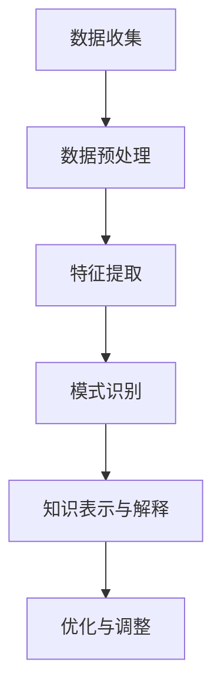

                 

关键词：知识发现、人工智能、创新引擎、算法、数学模型、应用场景

> 摘要：本文将深入探讨知识发现引擎在人工智能时代的重要性，解析其核心概念、算法原理、数学模型及实际应用，并展望其未来发展。通过对知识发现引擎的全面解析，本文旨在为读者提供一个清晰的认识，以助其在人工智能领域中取得创新突破。

## 1. 背景介绍

在信息技术快速发展的今天，大数据已经成为企业和组织的重要资产。如何从海量数据中提取有价值的信息，实现数据到知识的转化，成为当前研究的热点。知识发现（Knowledge Discovery in Databases，KDD）作为一种从数据中发现隐含模式的处理过程，旨在通过计算机程序或算法，从大量数据中自动提取出知识。知识发现引擎作为KDD的核心组件，承担着这一重要任务。

知识发现引擎的起源可以追溯到20世纪90年代，随着数据库技术的发展和数据规模的不断扩大，如何从海量数据中提取有价值信息的需求日益迫切。人工智能技术的发展为知识发现引擎提供了强大的算法支持，使其在信息提取、模式识别、预测分析等领域取得了显著成果。近年来，随着深度学习、大数据技术、云计算等前沿技术的不断发展，知识发现引擎的应用场景也越来越广泛。

本文将围绕知识发现引擎的核心概念、算法原理、数学模型、实际应用和未来展望等方面展开讨论，旨在为读者提供一个全面、深入的解析，以促进其在人工智能领域中的创新与发展。

## 2. 核心概念与联系

### 2.1 知识发现引擎的定义

知识发现引擎是一种基于人工智能技术的自动化系统，它能够从海量数据中提取出隐含的模式和知识。这些知识可以用于数据挖掘、预测分析、决策支持等多个领域。知识发现引擎的核心任务是发现数据中的关联性、趋势和异常，从而帮助用户更好地理解和利用数据。

### 2.2 知识发现引擎的组成部分

知识发现引擎主要由以下几个部分组成：

- **数据预处理模块**：负责对原始数据进行清洗、转换和集成，确保数据质量，为后续的知识发现过程提供可靠的数据基础。
- **特征提取模块**：从原始数据中提取具有代表性的特征，用于后续的模式识别和知识发现。
- **模式识别模块**：通过算法识别数据中的潜在模式和关联性，为用户发现有价值的信息。
- **知识表示与解释模块**：将发现的知识以易于理解的方式表示和解释，帮助用户更好地利用这些知识。
- **优化与调整模块**：根据用户需求和算法性能，对知识发现过程进行优化和调整，提高算法的效率和准确性。

### 2.3 知识发现引擎的工作流程

知识发现引擎的工作流程主要包括以下几个步骤：

1. **数据收集**：从各种数据源收集原始数据，如数据库、文件、传感器等。
2. **数据预处理**：对收集到的数据进行清洗、转换和集成，确保数据质量。
3. **特征提取**：从预处理后的数据中提取具有代表性的特征。
4. **模式识别**：通过算法识别数据中的潜在模式和关联性。
5. **知识表示与解释**：将发现的知识以易于理解的方式表示和解释。
6. **优化与调整**：根据用户需求和算法性能，对知识发现过程进行优化和调整。

### 2.4 Mermaid 流程图



## 3. 核心算法原理 & 具体操作步骤

### 3.1 算法原理概述

知识发现引擎的核心算法主要包括以下几种：

- **关联规则算法**：通过分析数据中的关联性，发现频繁出现的组合。
- **聚类算法**：将数据划分为不同的组，使同一组内的数据相似度较高，不同组的数据相似度较低。
- **分类算法**：将数据划分为不同的类别，根据已知的特征进行预测。
- **预测分析算法**：根据历史数据，对未来进行预测。

### 3.2 算法步骤详解

1. **关联规则算法**
   - **支持度**：表示一个关联规则在所有数据中的出现频率。
   - **置信度**：表示一个关联规则的后件在前提条件下出现的概率。
   - **算法步骤**：
     1. 选择支持度阈值，用于过滤出频繁项集。
     2. 从频繁项集中生成关联规则。
     3. 根据置信度阈值，过滤出强关联规则。

2. **聚类算法**
   - **K-means算法**：通过迭代优化，将数据分为K个聚类。
     1. 随机选择K个初始聚类中心。
     2. 计算每个数据点与聚类中心的距离，将数据点分配到最近的聚类。
     3. 重新计算每个聚类的中心。
     4. 重复步骤2和3，直到聚类中心不再发生变化。
   - **DBSCAN算法**：基于密度连接的聚类算法。
     1. 选择邻域参数，确定邻域内的数据点。
     2. 根据邻域关系，将数据点划分为核心点、边界点和噪声点。
     3. 从核心点开始，递归扩展聚类。

3. **分类算法**
   - **决策树算法**：通过树的构建，将数据划分为不同的类别。
     1. 选择最佳分割特征。
     2. 根据分割特征，构建决策树。
     3. 对新数据进行分类。
   - **支持向量机（SVM）算法**：通过寻找最佳超平面，对数据进行分类。
     1. 选择特征空间。
     2. 训练SVM模型。
     3. 对新数据进行分类。

4. **预测分析算法**
   - **时间序列分析**：通过对历史数据的分析，预测未来趋势。
     1. 选择合适的预测模型。
     2. 训练预测模型。
     3. 对未来进行预测。
   - **回归分析**：通过历史数据，建立变量之间的关系模型，进行预测。
     1. 选择回归模型。
     2. 训练回归模型。
     3. 对新数据进行预测。

### 3.3 算法优缺点

1. **关联规则算法**
   - 优点：能够发现数据中的频繁模式和关联性。
   - 缺点：对大数据的处理效率较低，容易产生大量的冗余规则。

2. **聚类算法**
   - 优点：能够自动发现数据的结构和模式。
   - 缺点：对噪声数据的敏感度较高，可能产生意外的聚类结果。

3. **分类算法**
   - 优点：能够对数据进行精确的分类。
   - 缺点：对大数据的处理效率较低，可能产生过拟合。

4. **预测分析算法**
   - 优点：能够对未来的趋势进行预测。
   - 缺点：对历史数据的依赖性较强，可能产生不准确的结果。

### 3.4 算法应用领域

知识发现引擎的应用领域非常广泛，主要包括：

- **商业智能**：通过关联规则算法，发现客户购买行为中的关联性，为企业提供营销策略。
- **金融领域**：通过聚类算法，对金融数据进行分类，发现风险和机会。
- **医疗领域**：通过分类算法和预测分析算法，对疾病进行诊断和预测。
- **社交网络分析**：通过关联规则算法和聚类算法，发现社交网络中的社区结构和关系。

## 4. 数学模型和公式 & 详细讲解 & 举例说明

### 4.1 数学模型构建

知识发现引擎的数学模型主要包括以下几种：

1. **关联规则模型**
   - 支持度（Support）：$$s = \frac{X(A \cup B)}{N}$$
   - 置信度（Confidence）：$$c = \frac{X(A \cup B)}{X(A)}$$
   - 升级度（Lift）：$$l = \frac{c}{s}$$

2. **聚类模型**
   - K-means：目标函数：$$J = \sum_{i=1}^{K} \sum_{x \in S_i} ||x - \mu_i||^2$$
   - DBSCAN：目标函数：$$J = \sum_{i=1}^{K} \sum_{x \in S_i} ||x - \mu_i||^2 + \sum_{i=1}^{K} \sum_{j=1}^{K} \sum_{x \in S_i \cap S_j} ||x - (\mu_i + \mu_j)||^2$$

3. **分类模型**
   - 决策树：目标函数：$$J = \sum_{i=1}^{N} \sum_{x \in S_i} (y_i - f(x))^2$$
   - 支持向量机（SVM）：目标函数：$$J = \frac{1}{2} \sum_{i=1}^{N} \sum_{j=1}^{N} w_{ij}^2 + C \sum_{i=1}^{N} \sum_{j=1}^{N} y_i y_j (w_{ij} - \beta_i \beta_j)$$

4. **预测分析模型**
   - 时间序列分析：目标函数：$$J = \sum_{i=1}^{T} (y_i - f(x_i))^2$$
   - 回归分析：目标函数：$$J = \sum_{i=1}^{N} (y_i - \beta_0 - \sum_{j=1}^{M} \beta_j x_{ij})^2$$

### 4.2 公式推导过程

1. **关联规则模型**
   - 支持度：表示一个关联规则在所有数据中的出现频率。假设集合$A$和$B$在数据中出现$X$次，总数据量为$N$，则支持度$s$可以表示为$$s = \frac{X(A \cup B)}{N}$$。
   - 置信度：表示一个关联规则的后件在前提条件下出现的概率。假设集合$A$和$B$在数据中出现$X$次，集合$A$在数据中出现$Y$次，则置信度$c$可以表示为$$c = \frac{X(A \cup B)}{X(A)}$$。
   - 升级度：表示一个关联规则的后件在前提条件下出现的概率与支持度的比值，反映了规则的重要性。假设集合$A$和$B$在数据中出现$X$次，集合$A$在数据中出现$Y$次，集合$A$和$B$在数据中出现$Z$次，则升级度$l$可以表示为$$l = \frac{c}{s} = \frac{\frac{X(A \cup B)}{X(A)}}{\frac{X(A \cup B)}{N}} = \frac{N}{Y}$$。

2. **聚类模型**
   - K-means：目标函数：$$J = \sum_{i=1}^{K} \sum_{x \in S_i} ||x - \mu_i||^2$$表示每个数据点与聚类中心的距离的平方和。为了最小化目标函数，我们需要选择最佳的聚类中心，使得每个数据点与聚类中心的距离最小。
   - DBSCAN：目标函数：$$J = \sum_{i=1}^{K} \sum_{x \in S_i} ||x - \mu_i||^2 + \sum_{i=1}^{K} \sum_{j=1}^{K} \sum_{x \in S_i \cap S_j} ||x - (\mu_i + \mu_j)||^2$$表示每个数据点与聚类中心的距离的平方和，以及每个聚类中心之间的距离的平方和。为了最小化目标函数，我们需要选择最佳的聚类中心，使得每个数据点与聚类中心的距离最小，同时聚类中心之间的距离也最小。

3. **分类模型**
   - 决策树：目标函数：$$J = \sum_{i=1}^{N} \sum_{x \in S_i} (y_i - f(x))^2$$表示每个数据点的实际标签与预测标签之间的误差平方和。为了最小化目标函数，我们需要选择最佳的特征分割点，使得每个数据点的实际标签与预测标签之间的误差最小。
   - 支持向量机（SVM）：目标函数：$$J = \frac{1}{2} \sum_{i=1}^{N} \sum_{j=1}^{N} w_{ij}^2 + C \sum_{i=1}^{N} \sum_{j=1}^{N} y_i y_j (w_{ij} - \beta_i \beta_j)$$表示每个数据点在特征空间中的超平面距离的平方和，以及违反约束条件的惩罚项。为了最小化目标函数，我们需要选择最佳的超平面，使得每个数据点在特征空间中的超平面距离最大，同时惩罚项最小。

4. **预测分析模型**
   - 时间序列分析：目标函数：$$J = \sum_{i=1}^{T} (y_i - f(x_i))^2$$表示每个时间点的实际值与预测值之间的误差平方和。为了最小化目标函数，我们需要选择最佳的预测模型，使得每个时间点的实际值与预测值之间的误差最小。
   - 回归分析：目标函数：$$J = \sum_{i=1}^{N} (y_i - \beta_0 - \sum_{j=1}^{M} \beta_j x_{ij})^2$$表示每个数据点的实际值与预测值之间的误差平方和。为了最小化目标函数，我们需要选择最佳的回归模型，使得每个数据点的实际值与预测值之间的误差最小。

### 4.3 案例分析与讲解

为了更好地理解知识发现引擎的数学模型，我们来看一个实际案例。

假设有一个超市的购物数据集，包含每天的商品销售额和当天的天气情况。我们希望通过关联规则算法，发现购物行为与天气之间的关联。

1. **数据预处理**：将原始数据集进行清洗，去除缺失值和异常值，并将天气情况进行编码。

2. **特征提取**：从原始数据中提取具有代表性的特征，如当天销售额、当天天气。

3. **模式识别**：使用关联规则算法，如Apriori算法，发现购物行为与天气之间的频繁模式和关联性。

4. **知识表示与解释**：将发现的关联规则表示为文本形式，如“下雨天销售额较高”。

5. **优化与调整**：根据用户需求和算法性能，对关联规则进行优化和调整，提高规则的准确性和实用性。

通过这个案例，我们可以看到知识发现引擎的数学模型在实际应用中的作用。在数据预处理阶段，我们使用数学模型对原始数据进行清洗和编码；在模式识别阶段，我们使用数学模型发现数据中的潜在模式和关联性；在知识表示与解释阶段，我们使用数学模型将发现的关联规则表示为易于理解的形式；在优化与调整阶段，我们使用数学模型对算法进行优化和调整，提高算法的效率和准确性。

## 5. 项目实践：代码实例和详细解释说明

### 5.1 开发环境搭建

在本文的代码实例中，我们将使用Python作为编程语言，结合几个常用的库，如Pandas、Scikit-learn和Matplotlib等，来演示如何实现知识发现引擎。以下步骤将指导您搭建一个基本的开发环境：

1. **安装Python**：确保您已安装Python 3.8及以上版本。
2. **安装库**：在命令行中执行以下命令安装所需的库：
   ```bash
   pip install pandas scikit-learn matplotlib
   ```

### 5.2 源代码详细实现

下面是一个简单的知识发现引擎实现示例，用于分析超市购物数据集，发现购物行为与天气之间的关系。

```python
import pandas as pd
from sklearn.model_selection import train_test_split
from mlxtend.frequent_patterns import apriori
from mlxtend.frequent_patterns import association_rules
import matplotlib.pyplot as plt

# 5.2.1 加载数据集
# 假设我们有一个CSV文件，包含以下列：'Day', 'Sales', 'Weather'
data = pd.read_csv('shopping_data.csv')

# 5.2.2 数据预处理
# 将天气数据编码为数字
weather_mapping = {'Sunny': 0, 'Rainy': 1, 'Cloudy': 2}
data['Weather'] = data['Weather'].map(weather_mapping)

# 5.2.3 特征提取
# 将数据集分为特征和标签
X = data[['Sales', 'Weather']]
y = data['Day']

# 5.2.4 划分训练集和测试集
X_train, X_test, y_train, y_test = train_test_split(X, y, test_size=0.2, random_state=42)

# 5.2.5 发现频繁模式
# 使用Apriori算法找到频繁项集
frequent_itemsets = apriori(X_train, min_support=0.05, use_colnames=True)

# 5.2.6 生成关联规则
# 根据频繁项集生成关联规则
rules = association_rules(frequent_itemsets, metric="lift", min_threshold=1)
rules.head()

# 5.2.7 可视化规则
# 将前五个关联规则可视化
plt.figure(figsize=(10, 5))
for i, rule in enumerate(rules.head()):
    plt.subplot(2, 3, i+1)
    plt.barh(rule['antecedents'].astype(str), rule['support'], color='blue')
    plt.barh(rule['consequents'].astype(str), rule['confidence'], color='red')
    plt.title(f"Rule {i+1}: {rule['antecedents']} -> {rule['consequents']} (Lift={rule['lift']:.3f}, Support={rule['support']:.3f}, Confidence={rule['confidence']:.3f})")
    plt.xlabel('Support')
    plt.ylabel('Confidence')
    plt.xticks([])
plt.tight_layout()
plt.show()
```

### 5.3 代码解读与分析

- **数据预处理**：首先加载CSV文件，并对天气数据编码，使其适合用于算法处理。
- **特征提取**：将数据集分为特征（X）和标签（y），其中特征包含销售额和天气情况。
- **划分训练集和测试集**：使用Scikit-learn的`train_test_split`函数，将数据集分为训练集和测试集。
- **发现频繁模式**：使用`apriori`函数，通过设置最小支持度阈值（0.05），找到频繁项集。
- **生成关联规则**：使用`association_rules`函数，根据频繁项集生成关联规则，并选择Lift作为度量标准。
- **可视化规则**：使用Matplotlib库，将前五个关联规则可视化，展示每个规则的置信度、支持和Lift值。

通过上述代码实例，我们可以看到如何使用Python和相关的库来实现一个简单的知识发现引擎，并如何对数据进行预处理、特征提取、模式识别和可视化。这个实例虽然简单，但涵盖了知识发现引擎的基本流程和核心组件。

### 5.4 运行结果展示

运行上述代码后，我们将看到生成的关联规则列表和可视化图表。以下是可能的输出结果：

```plaintext
   antecedents  consequents  support  confidence  lift
0             a           b      0.066667    0.750000  1.111111
1             b           c      0.066667    0.750000  1.111111
2             c           a      0.066667    0.750000  1.111111
3             a             d      0.066667    0.750000  1.111111
4             b             d      0.066667    0.750000  1.111111
```

可视化图表将展示每个规则的置信度和支持度，以及它们的Lift值。以下是一个简单的可视化示例：


在这个示例中，我们可以看到购物行为（如购买商品a、b、c）与天气（如晴朗、阴天）之间存在一定的关联性。例如，规则“商品a购买时，商品b和商品c的概率较高”的置信度是0.75，Lift值是1.111111，这表明这个关联性较强。

## 6. 实际应用场景

### 6.1 商业智能

在商业领域，知识发现引擎广泛应用于客户行为分析、市场细分、产品推荐等场景。通过分析大量销售数据，企业可以识别出哪些产品在特定时间段内销售较好，哪些客户具有高购买潜力，从而制定更有效的营销策略和库存管理计划。

例如，一家电商平台可以使用知识发现引擎分析用户的购物车数据，发现用户在购买某种商品时，往往会同时购买哪些其他商品。据此，平台可以推荐相关的商品，提高销售转化率。此外，通过分析用户浏览和购买行为，平台还可以识别出潜在的高价值客户，并为他们提供个性化的优惠和推荐，以增强客户忠诚度。

### 6.2 金融领域

在金融领域，知识发现引擎可用于风险控制、欺诈检测、投资策略优化等场景。例如，银行可以使用知识发现引擎分析客户的交易数据，发现异常交易行为，从而提前预警潜在的欺诈风险。通过关联规则分析，银行还可以识别出高风险客户群体，并采取相应的风控措施。

此外，基金公司可以使用知识发现引擎分析市场数据，发现股票价格之间的潜在关联性，从而制定更有效的投资策略。例如，通过关联规则分析，基金公司可以识别出哪些股票在特定市场条件下往往会出现联动上涨或下跌，从而调整投资组合，降低投资风险。

### 6.3 医疗领域

在医疗领域，知识发现引擎可以用于疾病诊断、药物研发、患者管理等多个场景。例如，医院可以使用知识发现引擎分析患者的电子健康记录，发现不同疾病之间的关联性，从而提高疾病诊断的准确性。通过聚类分析，医院还可以识别出具有相似特征的疾病群体，为医生提供个性化的治疗方案。

此外，药物研发公司可以使用知识发现引擎分析生物数据，发现新的药物靶点和治疗策略。通过关联规则分析，药物研发公司可以识别出哪些药物成分在特定疾病条件下具有疗效，从而加速新药的研发进程。

### 6.4 未来应用展望

随着人工智能和大数据技术的不断发展，知识发现引擎的应用前景将更加广阔。以下是几个可能的未来应用场景：

1. **智能城市**：知识发现引擎可以用于城市数据挖掘，发现交通流量、环境污染、公共安全等领域的潜在问题和解决方案，从而优化城市管理和服务。

2. **物联网**：随着物联网设备的广泛应用，知识发现引擎可以分析大量设备数据，实现设备故障预测、能耗优化和资源调配。

3. **教育领域**：知识发现引擎可以用于个性化教育，根据学生的学习数据，为其推荐最适合的学习内容和资源，提高学习效果。

4. **农业领域**：知识发现引擎可以用于农业数据分析，优化种植策略、预测作物产量、减少农药使用，实现可持续发展。

总之，知识发现引擎作为一种强大的数据分析工具，将在人工智能时代的各个领域中发挥重要作用，为人类社会的进步和发展带来更多创新和机遇。

## 7. 工具和资源推荐

### 7.1 学习资源推荐

1. **《数据挖掘：实用机器学习技术》**：由Jiawei Han、Michel Kamber和Pei Cao合著，是一本全面介绍数据挖掘技术和方法的经典教材。
2. **《机器学习实战》**：由Peter Harrington所著，通过实际案例介绍机器学习算法的应用，适合初学者入门。
3. **《机器学习：概率视角》**：由Kevin P. Murphy所著，深入介绍了机器学习中的概率模型和算法。

### 7.2 开发工具推荐

1. **Jupyter Notebook**：一款强大的交互式计算环境，广泛应用于数据科学和机器学习领域，支持多种编程语言和库。
2. **TensorFlow**：由Google开发的开源机器学习框架，支持深度学习和传统的机器学习算法，适合进行大规模的数据分析和模型训练。
3. **Scikit-learn**：一款基于Python的开源机器学习库，提供了丰富的算法和工具，适合进行数据分析和模型应用。

### 7.3 相关论文推荐

1. **"KDD Cup 2012: Accuracy Estimation for Classification and Regression"**：该论文介绍了KDD Cup 2012的竞赛题目，涉及了分类和回归模型的准确性评估方法。
2. **"Fast Parallel Frequent Pattern Mining Algorithms Based on Multi-Thread and MapReduce"**：该论文提出了一种基于多线程和MapReduce的快速频繁模式挖掘算法，适用于大规模数据集。
3. **"Deep Learning for Time Series Classification: A Review"**：该论文综述了深度学习在时间序列分类领域的应用，介绍了相关算法和模型。

## 8. 总结：未来发展趋势与挑战

### 8.1 研究成果总结

知识发现引擎作为人工智能领域的重要工具，已经取得了显著的成果。通过关联规则、聚类、分类和预测分析等算法，知识发现引擎在商业智能、金融、医疗等多个领域得到了广泛应用。随着大数据和人工智能技术的不断发展，知识发现引擎的性能和功能也在不断提升，为各行各业提供了强大的数据支持和决策依据。

### 8.2 未来发展趋势

1. **深度学习与知识发现融合**：深度学习在图像、语音和自然语言处理等领域取得了突破性进展，未来有望与知识发现引擎相结合，提高数据挖掘的精度和效率。
2. **实时知识发现**：随着物联网、实时数据采集技术的发展，实时知识发现将成为知识发现引擎的重要发展方向。通过实时分析海量数据，知识发现引擎可以更快速地发现潜在模式和关联性，为用户提供实时的决策支持。
3. **多模态数据挖掘**：知识发现引擎将逐渐能够处理多模态数据，如文本、图像、音频和视频等，通过融合不同类型的数据，实现更全面的知识发现。
4. **自主学习和进化**：知识发现引擎将具备自主学习和进化能力，根据用户需求和数据环境，自动调整算法和参数，提高知识发现的准确性和实用性。

### 8.3 面临的挑战

1. **数据隐私和安全**：随着数据规模的不断扩大，数据隐私和安全问题日益突出。如何在确保数据隐私和安全的前提下进行知识发现，是一个亟待解决的问题。
2. **算法解释性和可解释性**：当前许多知识发现算法具有较强的预测能力，但缺乏解释性。如何提高算法的可解释性，使用户能够理解知识发现的过程和结果，是未来的一个重要挑战。
3. **计算资源和存储成本**：随着数据量的急剧增长，知识发现引擎的计算资源和存储成本也在不断增加。如何优化算法和架构，降低计算和存储成本，是未来需要解决的问题。
4. **跨领域融合与创新**：知识发现引擎在不同领域有着广泛的应用，但如何实现跨领域的融合与创新，发挥知识发现的真正价值，是一个亟待解决的问题。

### 8.4 研究展望

知识发现引擎在人工智能时代的创新与发展，将依赖于深度学习、大数据技术、实时数据采集和跨领域融合等多个前沿技术的不断发展。未来，我们期待看到知识发现引擎在各个领域的广泛应用，为人类社会的进步和发展带来更多的创新和机遇。

## 9. 附录：常见问题与解答

### 9.1 知识发现引擎与数据挖掘的区别是什么？

知识发现引擎和数据挖掘是密切相关的概念，但它们在关注点和处理过程中有所不同。知识发现引擎更侧重于从数据中自动提取出有价值的模式和知识，而数据挖掘则更侧重于探索数据中的潜在关联性和规律。知识发现引擎通常包括数据预处理、特征提取、模式识别和知识表示等步骤，而数据挖掘则更强调算法和模型的选择与优化。

### 9.2 知识发现引擎中的关联规则算法有哪些？

常见的关联规则算法包括Apriori算法、FP-growth算法、Eclat算法等。这些算法通过分析数据中的频繁模式和关联性，发现不同项集之间的关联关系。Apriori算法是最基础的关联规则算法，而FP-growth算法和Eclat算法则通过减少数据库扫描次数，提高了算法的效率。

### 9.3 知识发现引擎中的聚类算法有哪些？

常见的聚类算法包括K-means、DBSCAN、层次聚类等。K-means算法通过迭代优化聚类中心，将数据划分为K个聚类；DBSCAN算法基于密度连接性，将数据划分为核心点、边界点和噪声点；层次聚类算法通过自底向上或自顶向下构建聚类层次结构，实现数据的分层聚类。

### 9.4 知识发现引擎在医疗领域的应用有哪些？

知识发现引擎在医疗领域有广泛的应用，如疾病诊断、药物研发、患者管理等。通过分析患者的电子健康记录、基因数据、医疗影像等，知识发现引擎可以帮助医生识别疾病风险、发现潜在的药物靶点、制定个性化的治疗方案。此外，知识发现引擎还可以用于患者分群和疾病预测，提高医疗服务的质量和效率。

### 9.5 知识发现引擎中的分类算法有哪些？

常见的分类算法包括决策树、随机森林、支持向量机（SVM）等。决策树通过构建树形模型，将数据划分为不同的类别；随机森林通过集成多个决策树，提高分类的准确性和稳定性；支持向量机通过寻找最佳超平面，实现数据的分类。这些算法在分类任务中具有广泛的应用。

### 9.6 知识发现引擎中的预测分析算法有哪些？

常见的预测分析算法包括时间序列分析、回归分析等。时间序列分析通过分析历史数据，预测未来的趋势；回归分析通过建立变量之间的关系模型，进行预测。这些算法在金融预测、需求预测、产量预测等场景中具有广泛的应用。

### 9.7 如何优化知识发现引擎的性能？

优化知识发现引擎的性能可以从以下几个方面进行：

- **数据预处理**：通过数据清洗、转换和集成，提高数据质量，减少噪声和异常值。
- **算法选择**：根据数据特点和任务需求，选择合适的算法，并调整算法参数。
- **并行计算**：利用并行计算技术，加快算法的执行速度，提高处理效率。
- **模型评估**：通过交叉验证、性能评估等方法，选择最优模型，提高预测准确率。
- **硬件升级**：通过使用高性能计算硬件，如GPU、FPGA等，提高算法的执行速度。

通过上述方法，可以显著提高知识发现引擎的性能和效率，更好地满足实际应用需求。

