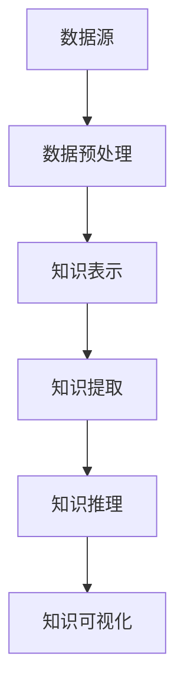

                 

关键词：知识发现引擎、人工智能、机器学习、认知图谱、语义理解、自然语言处理、深度学习、信息检索、知识图谱、推理引擎

> 摘要：本文将探讨知识发现引擎这一新兴技术，阐述其在人类认知领域的重要作用。我们将从背景介绍、核心概念与联系、核心算法原理、数学模型和公式、项目实践、实际应用场景、工具和资源推荐、总结与展望等多个角度，详细分析知识发现引擎的工作原理、应用场景和发展趋势。

## 1. 背景介绍

在当今信息爆炸的时代，人类面临着海量的信息处理和决策挑战。如何从海量数据中快速、准确地提取有价值的信息，成为了一个亟待解决的问题。知识发现引擎（Knowledge Discovery Engine，简称KDE）应运而生，成为解决这一问题的关键技术。

知识发现引擎是一种自动化工具，它通过从大量数据中提取模式和知识，帮助人们发现数据中的隐藏规律。其核心目标是实现数据到知识的转换，从而为人类提供更加智能化的决策支持。知识发现引擎的起源可以追溯到20世纪80年代，随着计算机科学和人工智能技术的飞速发展，知识发现引擎逐渐成为人工智能领域的一个重要分支。

知识发现引擎的研究和应用领域非常广泛，包括自然语言处理、信息检索、推荐系统、金融风控、医学诊断、智能交通等多个方面。其重要性不仅体现在技术层面，更体现在对人类认知的推动上。

## 2. 核心概念与联系

### 2.1 知识发现引擎的基本概念

知识发现引擎是一种集成了多种人工智能技术的综合性工具，主要包括以下几个核心概念：

- **数据源**：知识发现引擎的数据来源可以是结构化数据、半结构化数据和非结构化数据，如文本、图片、音频等。
- **知识表示**：知识发现引擎需要将原始数据转换为一种易于理解和处理的形式，如语义网络、本体、知识图谱等。
- **知识提取**：通过算法和技术手段，从数据中提取出潜在的知识和模式，如关联规则、聚类、分类、主题建模等。
- **知识推理**：基于提取出的知识，进行逻辑推理和推断，以发现更深层次的关系和规律。
- **知识可视化**：将提取出的知识以可视化的形式展示，帮助人们更好地理解和利用这些知识。

### 2.2 知识发现引擎与相关技术的联系

知识发现引擎与许多人工智能技术密切相关，如自然语言处理（NLP）、机器学习（ML）、深度学习（DL）、信息检索（IR）等。

- **自然语言处理**：NLP是知识发现引擎的重要基础，负责对文本数据进行分析和处理，提取出语义信息。
- **机器学习**：ML技术用于从数据中学习模式和规律，为知识提取提供算法支持。
- **深度学习**：DL技术在知识发现引擎中发挥了重要作用，如用于图像识别、语音识别等任务。
- **信息检索**：IR技术用于在海量数据中快速找到与特定查询相关的信息，是知识发现引擎的重要组成部分。

### 2.3 知识发现引擎的Mermaid流程图



## 3. 核心算法原理 & 具体操作步骤

### 3.1 算法原理概述

知识发现引擎的核心算法主要包括数据预处理、知识表示、知识提取、知识推理和知识可视化等环节。

- **数据预处理**：通过对原始数据进行清洗、去噪、归一化等操作，提高数据质量和一致性。
- **知识表示**：将预处理后的数据转换为一种结构化的知识表示形式，如知识图谱、语义网络等。
- **知识提取**：通过机器学习和深度学习算法，从数据中提取出潜在的知识和模式。
- **知识推理**：基于提取出的知识，进行逻辑推理和推断，以发现更深层次的关系和规律。
- **知识可视化**：将提取出的知识以可视化的形式展示，帮助人们更好地理解和利用这些知识。

### 3.2 算法步骤详解

#### 3.2.1 数据预处理

数据预处理是知识发现引擎的第一步，主要任务是对原始数据进行清洗和转换，使其满足后续处理的需求。

1. 数据清洗：去除重复数据、填补缺失值、消除噪声等。
2. 数据转换：将不同类型的数据转换为统一的格式，如将文本数据转换为向量表示。

#### 3.2.2 知识表示

知识表示是将预处理后的数据转换为一种结构化的知识表示形式，便于后续的知识提取和推理。

1. 知识图谱：使用图结构表示实体和关系，如实体-关系图谱、知识图谱等。
2. 语义网络：使用语义网络表示实体和关系，如WordNet、PropBank等。

#### 3.2.3 知识提取

知识提取是知识发现引擎的核心步骤，主要任务是从数据中提取出潜在的知识和模式。

1. 关联规则：用于发现数据中的关联关系，如Apriori算法、FP-growth算法等。
2. 聚类：用于将数据划分为不同的群体，如K-means算法、层次聚类算法等。
3. 分类：用于将数据划分为不同的类别，如决策树、支持向量机、神经网络等。

#### 3.2.4 知识推理

知识推理是基于提取出的知识，进行逻辑推理和推断，以发现更深层次的关系和规律。

1. 前向推理：从已知的事实出发，推导出新的结论。
2. 反向推理：从目标出发，反向推导出已知的事实。
3. 对称推理：同时使用前向和反向推理，以获取更全面的知识。

#### 3.2.5 知识可视化

知识可视化是将提取出的知识以可视化的形式展示，帮助人们更好地理解和利用这些知识。

1. 图形可视化：使用图表、图形等可视化方式展示知识结构。
2. 热力图：用于展示数据中的热点区域和趋势。
3. 交互式可视化：支持用户与知识发现引擎的交互，以获取更深入的理解。

### 3.3 算法优缺点

#### 3.3.1 优点

1. 自动化：知识发现引擎可以实现数据的自动化处理，提高效率。
2. 灵活性：知识发现引擎可以适应不同类型的数据和应用场景。
3. 智能化：知识发现引擎可以通过机器学习和深度学习算法，实现知识的自动化提取和推理。
4. 可视化：知识发现引擎支持知识可视化，帮助用户更好地理解和利用知识。

#### 3.3.2 缺点

1. 计算资源消耗：知识发现引擎涉及大量的计算和存储资源，对硬件设备要求较高。
2. 知识质量：知识发现引擎提取出的知识可能存在噪声和误差，需要人工验证和修正。
3. 复杂性：知识发现引擎涉及多个领域的技术，实现和部署相对复杂。

### 3.4 算法应用领域

知识发现引擎在多个领域都有广泛的应用，包括但不限于以下方面：

1. **自然语言处理**：用于文本分类、情感分析、机器翻译等任务。
2. **信息检索**：用于搜索引擎、推荐系统等应用。
3. **金融风控**：用于信用卡欺诈检测、股票市场分析等。
4. **医学诊断**：用于疾病预测、治疗方案推荐等。
5. **智能交通**：用于交通流量预测、路线规划等。

## 4. 数学模型和公式 & 详细讲解 & 举例说明

### 4.1 数学模型构建

知识发现引擎涉及多种数学模型，包括统计模型、概率模型、线性模型、非线性模型等。以下是几个常用的数学模型：

#### 4.1.1 贝叶斯模型

贝叶斯模型是一种概率模型，用于在给定某些证据的情况下，推断某个事件发生的概率。其数学公式为：

$$
P(A|B) = \frac{P(B|A) \cdot P(A)}{P(B)}
$$

其中，$P(A|B)$ 表示在证据B出现的情况下，事件A发生的概率；$P(B|A)$ 表示在事件A发生的情况下，证据B出现的概率；$P(A)$ 表示事件A发生的概率；$P(B)$ 表示证据B出现的概率。

#### 4.1.2 决策树模型

决策树模型是一种基于特征值进行分类或回归的模型。其数学公式为：

$$
Y = f(X_1, X_2, ..., X_n)
$$

其中，$Y$ 表示输出变量；$X_1, X_2, ..., X_n$ 表示输入变量；$f$ 表示决策树函数。

#### 4.1.3 支持向量机模型

支持向量机模型是一种用于分类和回归的模型，其数学公式为：

$$
w \cdot x - b = 0
$$

其中，$w$ 表示权重向量；$x$ 表示输入向量；$b$ 表示偏置。

### 4.2 公式推导过程

#### 4.2.1 贝叶斯模型推导

贝叶斯模型的核心在于利用贝叶斯定理，在已知先验概率和条件概率的情况下，求解后验概率。以下是贝叶斯模型的推导过程：

1. 先验概率：$P(A)$ 表示事件A发生的概率；$P(B)$ 表示事件B发生的概率。
2. 条件概率：$P(B|A)$ 表示在事件A发生的情况下，事件B发生的概率；$P(A|B)$ 表示在事件B发生的情况下，事件A发生的概率。
3. 贝叶斯定理：根据贝叶斯定理，有：

$$
P(A|B) = \frac{P(B|A) \cdot P(A)}{P(B)}
$$

4. 推导过程：

$$
P(A|B) = \frac{P(B|A) \cdot P(A)}{P(B)}
$$

$$
P(B) = \sum_{i} P(B|A_i) \cdot P(A_i)
$$

$$
P(A|B) = \frac{P(B|A) \cdot P(A)}{\sum_{i} P(B|A_i) \cdot P(A_i)}
$$

### 4.3 案例分析与讲解

#### 4.3.1 贝叶斯模型案例

假设有一个医学诊断问题，已知以下先验概率和条件概率：

- 先验概率：$P(疾病)$ 表示患病的概率；$P(无疾病)$ 表示未患病的概率。
- 条件概率：$P(症状|疾病)$ 表示在患病的情况下出现症状的概率；$P(症状|无疾病)$ 表示在未患病的情况下出现症状的概率。

根据贝叶斯定理，可以求解患病的后验概率：

$$
P(疾病|症状) = \frac{P(症状|疾病) \cdot P(疾病)}{P(症状)}
$$

其中，$P(症状)$ 可以通过全概率公式计算：

$$
P(症状) = P(症状|疾病) \cdot P(疾病) + P(症状|无疾病) \cdot P(无疾病)
$$

#### 4.3.2 决策树模型案例

假设有一个二分类问题，需要根据输入特征 $X_1, X_2, ..., X_n$，预测输出变量 $Y$ 的值。可以使用决策树模型进行分类。

1. 初始状态：输入特征 $X_1, X_2, ..., X_n$，输出变量 $Y$。
2. 判断特征 $X_1$ 的值：
   - 若 $X_1 > 0$，则继续判断特征 $X_2$。
   - 若 $X_1 \leq 0$，则输出 $Y=1$。
3. 判断特征 $X_2$ 的值：
   - 若 $X_2 > 0$，则继续判断特征 $X_3$。
   - 若 $X_2 \leq 0$，则输出 $Y=0$。
4. 重复步骤 2 和步骤 3，直到所有特征都判断完毕。

输出变量 $Y$ 的值即为最终分类结果。

## 5. 项目实践：代码实例和详细解释说明

### 5.1 开发环境搭建

为了演示知识发现引擎的应用，我们将使用Python编程语言和相关的库进行开发。以下是开发环境的搭建步骤：

1. 安装Python：从官方网站下载并安装Python 3.x版本。
2. 安装相关库：使用pip命令安装以下库：numpy、pandas、scikit-learn、matplotlib等。

### 5.2 源代码详细实现

以下是一个简单的知识发现引擎实现示例，包括数据预处理、知识表示、知识提取和知识可视化等步骤。

```python
import pandas as pd
from sklearn.model_selection import train_test_split
from sklearn.preprocessing import StandardScaler
from sklearn.neighbors import KNeighborsClassifier
import matplotlib.pyplot as plt

# 5.2.1 数据预处理
data = pd.read_csv('data.csv')
X = data.iloc[:, :-1].values
y = data.iloc[:, -1].values
X_train, X_test, y_train, y_test = train_test_split(X, y, test_size=0.2, random_state=42)
scaler = StandardScaler()
X_train = scaler.fit_transform(X_train)
X_test = scaler.transform(X_test)

# 5.2.2 知识表示
knn = KNeighborsClassifier(n_neighbors=3)
knn.fit(X_train, y_train)

# 5.2.3 知识提取
y_pred = knn.predict(X_test)

# 5.2.4 知识可视化
plt.scatter(X_test[:, 0], X_test[:, 1], c=y_pred, cmap='viridis')
plt.xlabel('Feature 1')
plt.ylabel('Feature 2')
plt.title('K-Nearest Neighbors Classification')
plt.show()
```

### 5.3 代码解读与分析

上述代码实现了一个基于K-近邻算法的知识发现引擎，用于分类任务。以下是代码的详细解读与分析：

1. **数据预处理**：首先从CSV文件中读取数据，将特征和标签分离。然后使用train_test_split函数将数据集划分为训练集和测试集。最后，使用StandardScaler对特征进行标准化处理，以消除不同特征之间的量纲差异。

2. **知识表示**：使用KNeighborsClassifier类创建K-近邻分类器对象，并将其训练到训练集上。

3. **知识提取**：使用训练好的分类器对测试集进行预测，获取预测结果。

4. **知识可视化**：使用matplotlib库将预测结果以散点图的形式展示，颜色表示不同类别的预测结果。

通过上述代码示例，我们可以看到知识发现引擎的基本实现流程。在实际应用中，可以根据具体需求对代码进行调整和优化，以提高性能和准确性。

### 5.4 运行结果展示

在运行上述代码后，将生成一个散点图，展示测试集中各个样本的预测结果。散点图中的每个点代表一个测试样本，其坐标由两个特征值确定，颜色表示预测的类别。通过观察散点图的分布和聚类效果，可以初步判断分类模型的性能。

## 6. 实际应用场景

知识发现引擎在多个领域都有广泛的应用，以下是几个典型的实际应用场景：

### 6.1 智能推荐系统

在智能推荐系统中，知识发现引擎可以用于分析用户行为数据，提取出用户兴趣偏好和推荐策略。例如，基于用户的历史浏览记录和购买行为，可以推荐用户可能感兴趣的商品或内容。知识发现引擎可以帮助电商平台提升用户满意度，提高销售额。

### 6.2 金融风控

在金融领域，知识发现引擎可以用于信用卡欺诈检测、信用评估、股票市场分析等任务。通过分析交易数据、用户行为和财务报表等信息，知识发现引擎可以帮助金融机构识别潜在的风险，预防金融欺诈，提高信用评估的准确性。

### 6.3 医学诊断

在医学诊断领域，知识发现引擎可以用于疾病预测、治疗方案推荐等任务。通过分析患者的病历数据、基因信息等，知识发现引擎可以帮助医生做出更准确的诊断和治疗方案，提高医疗服务的质量和效率。

### 6.4 智能交通

在智能交通领域，知识发现引擎可以用于交通流量预测、路线规划等任务。通过分析交通数据、路况信息等，知识发现引擎可以帮助交通管理部门优化交通信号控制策略，提高道路通行效率，减少交通拥堵。

### 6.5 智能家居

在家居领域，知识发现引擎可以用于智能家居系统的个性化定制和优化。通过分析用户的生活习惯和偏好，知识发现引擎可以帮助智能家居系统提供个性化的服务，如智能安防、智能照明、智能空调等。

## 7. 工具和资源推荐

### 7.1 学习资源推荐

1. **《数据挖掘：实用工具和技术》**：一本全面介绍数据挖掘技术的经典教材，适合初学者和有一定基础的人阅读。
2. **《机器学习实战》**：一本涵盖多种机器学习算法的实战指南，适合有一定编程基础的人学习。
3. **《深度学习》**：一本介绍深度学习理论的经典教材，适合对深度学习感兴趣的人阅读。

### 7.2 开发工具推荐

1. **Python**：一种流行的编程语言，适用于数据分析和机器学习开发。
2. **Jupyter Notebook**：一种交互式计算环境，方便进行数据分析和实验。
3. **TensorFlow**：一种流行的深度学习框架，适用于构建和训练深度学习模型。

### 7.3 相关论文推荐

1. **"Knowledge Discovery in Databases: An Overview"**：一篇介绍知识发现技术的经典论文，全面阐述了知识发现的过程和方法。
2. **"Deep Learning for Knowledge Discovery"**：一篇介绍深度学习在知识发现领域应用的论文，探讨了深度学习算法在知识提取和推理中的应用。
3. **"Graph-based Knowledge Discovery"**：一篇介绍基于知识图谱的知识发现技术的论文，阐述了知识图谱在知识提取和推理中的应用。

## 8. 总结：未来发展趋势与挑战

### 8.1 研究成果总结

知识发现引擎作为人工智能领域的一个重要分支，已经取得了显著的研究成果。主要包括以下几个方面：

1. **算法优化**：不断提出新的算法和技术，以提高知识发现引擎的性能和效率。
2. **多模态数据融合**：将多种类型的数据（如文本、图像、音频等）进行融合，提高知识发现的全面性和准确性。
3. **知识推理**：发展新的知识推理算法，以实现更深层次的知识提取和推理。
4. **知识可视化**：探索新的知识可视化方法，以更好地展示和解释知识发现结果。

### 8.2 未来发展趋势

知识发现引擎未来的发展趋势将体现在以下几个方面：

1. **跨领域融合**：知识发现引擎将与其他人工智能技术（如自然语言处理、计算机视觉等）进行深度融合，实现更全面的知识发现。
2. **自动化与智能化**：知识发现引擎将更加自动化和智能化，实现知识的自动提取、推理和可视化。
3. **小样本学习**：研究如何在小样本情况下进行知识发现，以提高知识发现引擎在现实场景中的应用能力。
4. **实时性**：实现知识发现引擎的实时性，以应对实时数据处理的挑战。

### 8.3 面临的挑战

知识发现引擎在发展过程中仍面临诸多挑战，主要包括以下几个方面：

1. **数据质量和一致性**：数据质量直接影响知识发现引擎的性能，如何提高数据质量和一致性是一个重要挑战。
2. **可解释性和可靠性**：知识发现引擎提取出的知识需要具备可解释性和可靠性，以便用户理解和信任。
3. **计算资源消耗**：知识发现引擎涉及大量的计算和存储资源，如何在有限的资源下实现高效的知识发现是一个关键问题。
4. **隐私保护**：在处理和分析敏感数据时，如何保护用户隐私是一个重要的伦理和法律问题。

### 8.4 研究展望

未来，知识发现引擎的研究将更加注重以下几个方面：

1. **跨领域知识融合**：探索如何将不同领域的数据和知识进行有效融合，以实现更全面的知识发现。
2. **可解释性和可靠性**：研究如何提高知识发现引擎的可解释性和可靠性，以便用户更好地理解和应用知识。
3. **实时性**：研究如何实现知识发现引擎的实时性，以应对实时数据处理的挑战。
4. **隐私保护**：研究如何在处理和分析敏感数据时保护用户隐私，以实现知识发现引擎的合法合规应用。

总之，知识发现引擎作为人工智能领域的一个重要分支，具有广泛的应用前景和重要的研究价值。未来，随着人工智能技术的不断发展和完善，知识发现引擎将发挥更加重要的作用，为人类认知和决策提供强有力的支持。

## 9. 附录：常见问题与解答

### 9.1 什么是指南库？

指南库（Knowledge Base，简称KB）是一个结构化的知识存储系统，用于存储、管理和检索知识。它通常包含一系列的事实、规则、概念和关系，以便为各种应用场景提供知识支持。

### 9.2 知识发现引擎与搜索引擎有什么区别？

知识发现引擎和搜索引擎都是用于处理信息的工具，但它们的目标和应用场景有所不同。搜索引擎主要用于帮助用户在大量数据中找到与特定查询相关的信息，而知识发现引擎则侧重于从数据中提取有价值的信息和知识，为人类提供决策支持。

### 9.3 知识发现引擎如何处理非结构化数据？

知识发现引擎可以通过自然语言处理、计算机视觉等技术，将非结构化数据（如文本、图像、音频等）转换为结构化的数据表示形式，如知识图谱、向量等，然后进行进一步的处理和分析。

### 9.4 知识发现引擎如何保证知识的可解释性和可靠性？

知识发现引擎可以通过设计可解释的算法、提供知识可视化和透明化的处理流程，以及引入可信度评估机制，来保证知识的可解释性和可靠性。此外，还可以结合人类专家的反馈和验证，进一步提高知识的可信度。

### 9.5 知识发现引擎在处理大规模数据时有哪些挑战？

知识发现引擎在处理大规模数据时面临的挑战包括计算资源消耗、数据质量和一致性、实时性等。为了应对这些挑战，可以采用分布式计算、数据预处理、优化算法等方法，以提高知识发现引擎的性能和效率。

### 9.6 知识发现引擎如何保护用户隐私？

知识发现引擎可以通过匿名化、加密、差分隐私等技术，来保护用户隐私。同时，还可以在设计算法和数据处理流程时，遵循隐私保护的原则和法规要求，确保用户隐私得到有效保护。

