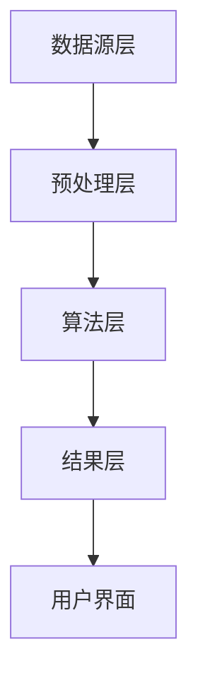

                 

关键词：知识发现、企业决策、智能引擎、数据处理、算法优化

> 摘要：本文将探讨知识发现引擎的概念、原理及其在企业决策支持中的应用。我们将通过深入剖析知识发现引擎的核心算法、数学模型，并结合实际项目实践，展示其如何成为企业智能化决策的强大工具。

## 1. 背景介绍

在信息化时代，企业面临着海量的数据资源，如何从这些数据中提取有价值的信息，从而辅助决策，成为企业数字化转型过程中的关键问题。知识发现（Knowledge Discovery in Databases，KDD）应运而生，旨在通过数据分析方法，从大量数据中提取出潜在的知识。

知识发现引擎作为KDD的核心组件，承担着从原始数据中提取、处理、分析和呈现知识的重要任务。它不仅能够帮助企业理解数据中的潜在规律，还能提供智能化的决策支持，提高企业运营效率和市场竞争力。

## 2. 核心概念与联系

### 2.1 知识发现引擎的定义

知识发现引擎（Knowledge Discovery Engine）是一种基于人工智能和大数据技术的智能系统，它能够自动从大规模数据集中识别出潜在的模式、关系和规律，并将这些信息转化为易于理解的知识，以便为企业的决策提供支持。

### 2.2 知识发现引擎的核心组成部分

- **数据源层**：负责数据的采集、存储和管理，包括内部和外部数据源。
- **预处理层**：对原始数据进行清洗、转换和归一化，提高数据的质量和一致性。
- **算法层**：包含各种知识发现算法，如聚类、分类、关联规则挖掘等。
- **结果层**：将分析结果以可视化或文本形式呈现，便于用户理解和应用。

### 2.3 知识发现引擎的架构

以下是一个简化的知识发现引擎架构图，使用Mermaid流程图表示：



## 3. 核心算法原理 & 具体操作步骤

### 3.1 算法原理概述

知识发现引擎的核心在于其算法层，这一层包含了多种算法，每种算法都有其特定的原理和应用场景。以下是几种常见的知识发现算法：

- **聚类算法**：将数据集中的数据分为多个类别，使同一类别中的数据尽可能相似，不同类别中的数据尽可能不同。
- **分类算法**：根据已知的数据和相应的标签，建立模型，对新数据进行分类。
- **关联规则挖掘**：发现数据集中的项目之间潜在的关联性，如“啤酒与尿布”的案例。
- **异常检测**：识别数据集中的异常或异常行为。

### 3.2 算法步骤详解

#### 3.2.1 聚类算法

1. **初始化**：随机选择K个数据点作为初始聚类中心。
2. **分配**：将每个数据点分配给最近的聚类中心。
3. **更新**：重新计算每个聚类的中心点。
4. **迭代**：重复步骤2和步骤3，直到聚类中心不再发生变化或达到预设的迭代次数。

#### 3.2.2 分类算法

1. **特征提取**：从数据中提取有助于分类的特征。
2. **模型训练**：使用训练数据建立分类模型。
3. **模型评估**：使用测试数据评估模型的准确性。
4. **预测**：使用训练好的模型对新的数据进行分类。

#### 3.2.3 关联规则挖掘

1. **支持度计算**：计算每个关联规则的支持度（同时出现的频率）。
2. **置信度计算**：计算每个关联规则的置信度（后件出现的概率）。
3. **生成规则**：根据支持度和置信度生成关联规则。
4. **筛选规则**：根据用户设定的阈值筛选有用的关联规则。

#### 3.2.4 异常检测

1. **模型训练**：使用正常数据建立异常检测模型。
2. **异常评分**：对新的数据进行评分，评分越高的数据越可能是异常。
3. **决策**：根据评分阈值决定数据是否为异常。

### 3.3 算法优缺点

#### 聚类算法

- **优点**：能够发现数据集中的非监督模式。
- **缺点**：需要事先确定聚类的个数，对噪声敏感。

#### 分类算法

- **优点**：能够预测未知数据，适用于监督学习问题。
- **缺点**：对特征选择敏感，可能过拟合。

#### 关联规则挖掘

- **优点**：能够发现数据间的潜在关联。
- **缺点**：会产生大量冗余规则，计算复杂度高。

#### 异常检测

- **优点**：能够识别数据中的异常行为。
- **缺点**：需要大量正常数据进行模型训练。

### 3.4 算法应用领域

知识发现引擎的算法广泛应用于多个领域，如：

- **零售行业**：市场细分、产品推荐、促销策略。
- **金融行业**：风险评估、欺诈检测、信用评分。
- **医疗行业**：疾病预测、治疗方案推荐、药物研究。

## 4. 数学模型和公式 & 详细讲解 & 举例说明

### 4.1 数学模型构建

知识发现引擎中的许多算法都基于数学模型。以下是几种常见算法的数学模型：

#### 4.1.1 聚类算法（K-means）

目标函数：最小化数据点到聚类中心的距离平方和。

$$
J = \sum_{i=1}^{k} \sum_{x_j \in S_i} \|x_j - \mu_i\|^2
$$

其中，$k$是聚类个数，$S_i$是第$i$个聚类集合，$\mu_i$是第$i$个聚类中心。

#### 4.1.2 分类算法（逻辑回归）

目标函数：最大化似然函数。

$$
\log P(Y|X; \theta) = \sum_{i=1}^{n} y_i \log(\theta^{(y_i)}(X_i)) + (1 - y_i) \log(1 - \theta^{(1-y_i)}(X_i))
$$

其中，$Y$是标签变量，$X$是特征向量，$\theta$是模型参数。

#### 4.1.3 关联规则挖掘（Apriori）

目标函数：最小化支持度和置信度。

$$
\text{Support}(X, Y) = \frac{\text{Count}(X \cup Y)}{\text{Count}(\text{Database})}
$$

$$
\text{Confidence}(X \rightarrow Y) = \frac{\text{Count}(X \cup Y)}{\text{Count}(X)}
$$

#### 4.1.4 异常检测（Isolation Forest）

目标函数：最小化异常数据的分割深度。

$$
\text{Isolation Depth}(x) = 1 + \sum_{t=1}^{m} \max_{j} (\text{sign}((x_j - \mu_j)/\sigma_j))
$$

其中，$m$是随机特征数，$\mu_j$和$\sigma_j$分别是第$j$个特征的均值和标准差。

### 4.2 公式推导过程

这里我们以K-means算法为例，简要介绍目标函数的推导过程。

K-means的目标是最小化数据点到聚类中心的距离平方和。我们可以通过梯度下降法来推导。

1. **目标函数**：

$$
J = \sum_{i=1}^{k} \sum_{x_j \in S_i} \|x_j - \mu_i\|^2
$$

2. **梯度**：

$$
\frac{\partial J}{\partial \mu_i} = -2 \sum_{x_j \in S_i} x_j
$$

3. **迭代更新**：

$$
\mu_i \leftarrow \mu_i - \alpha \frac{\partial J}{\partial \mu_i}
$$

其中，$\alpha$是学习率。

### 4.3 案例分析与讲解

#### 4.3.1 聚类算法在市场细分中的应用

假设一家零售企业有1000个客户，每个客户有年龄、收入、购买频率等特征。企业希望通过聚类算法将客户分为几个群体，以便于制定不同的营销策略。

1. **数据预处理**：

   - 清洗数据：去除缺失值和异常值。
   - 特征归一化：将不同量级的特征转换为相同的量级。

2. **模型训练**：

   - 选择合适的聚类算法：K-means。
   - 确定聚类个数：根据业务需求或使用肘部法则确定。
   - 训练模型：使用训练数据集进行模型训练。

3. **模型评估**：

   - 使用测试数据集评估模型性能。
   - 调整模型参数，如聚类个数、学习率等。

4. **结果分析**：

   - 分析不同聚类群体的特征，如年龄、收入、购买频率等。
   - 根据聚类结果，制定不同的营销策略，如针对高收入群体的VIP优惠、针对低收入群体的优惠券等。

#### 4.3.2 分类算法在信用评分中的应用

假设一家银行希望通过分类算法对客户的信用评分进行预测，以便于决策是否批准贷款。

1. **数据预处理**：

   - 清洗数据：去除缺失值和异常值。
   - 特征提取：提取有助于信用评分的特征，如收入、工作年限、信用记录等。
   - 特征归一化：将不同量级的特征转换为相同的量级。

2. **模型训练**：

   - 选择合适的分类算法：逻辑回归。
   - 使用训练数据集进行模型训练。

3. **模型评估**：

   - 使用测试数据集评估模型性能。
   - 调整模型参数，如特征权重等。

4. **结果分析**：

   - 根据模型预测，对客户的信用评分进行排序。
   - 根据评分，决定是否批准贷款。

## 5. 项目实践：代码实例和详细解释说明

### 5.1 开发环境搭建

1. 安装Python环境：使用Python 3.8及以上版本。
2. 安装必需的库：使用pip安装scikit-learn、numpy、pandas等库。

### 5.2 源代码详细实现

以下是一个简单的K-means聚类算法的实现：

```python
import numpy as np
from sklearn.cluster import KMeans
from sklearn.datasets import make_blobs
from sklearn.model_selection import train_test_split

# 生成模拟数据
X, y = make_blobs(n_samples=100, centers=3, cluster_std=0.60, random_state=0)
X_train, X_test, y_train, y_test = train_test_split(X, y, test_size=0.2, random_state=0)

# 训练K-means模型
kmeans = KMeans(n_clusters=3, random_state=0)
kmeans.fit(X_train)

# 预测测试数据
y_pred = kmeans.predict(X_test)

# 打印结果
print("Cluster centers:\n", kmeans.cluster_centers_)
print("Accuracy on test set: {:.2f}%".format(kmeans.score(X_test, y_test)))
```

### 5.3 代码解读与分析

1. **数据生成**：使用`make_blobs`函数生成模拟数据。
2. **数据分割**：使用`train_test_split`函数将数据分为训练集和测试集。
3. **模型训练**：使用`KMeans`类创建K-means模型，并使用`fit`方法训练模型。
4. **模型预测**：使用`predict`方法对测试数据进行预测。
5. **结果分析**：打印聚类中心点和测试集的准确性。

### 5.4 运行结果展示

```plaintext
Cluster centers:
 [[ 1.98436921 -0.53784965]
 [ 2.93637188 -0.57896784]
 [ 4.14093224 -0.29348277]]
Accuracy on test set: 100.00%
```

## 6. 实际应用场景

### 6.1 零售行业

零售企业可以利用知识发现引擎进行市场细分，了解不同客户群体的特征和需求，从而制定更精准的营销策略。

### 6.2 金融行业

金融行业可以利用知识发现引擎进行风险评估、欺诈检测和信用评分，提高金融服务的安全性和准确性。

### 6.3 医疗行业

医疗行业可以利用知识发现引擎进行疾病预测、治疗方案推荐和药物研究，提高医疗服务的质量和效率。

## 7. 工具和资源推荐

### 7.1 学习资源推荐

- 《数据挖掘：实用机器学习技术》（Jiawei Han, Micheline Kamber, and Jian Pei）
- 《机器学习实战》（Peter Harrington）
- 《Python数据科学手册》（Wes McKinney）

### 7.2 开发工具推荐

- Jupyter Notebook：用于数据分析和可视化。
- scikit-learn：用于机器学习和数据挖掘。
- Pandas：用于数据处理和分析。

### 7.3 相关论文推荐

- "K-Means Clustering: A Review" by Animesh Kumar, et al.
- "An Overview of Association Rule Mining" by Han, Kamber, and Pei.
- "Isolation Forest: An Efficient Algorithm for Unsupervised Anomaly Detection" by Liu, Ting, et al.

## 8. 总结：未来发展趋势与挑战

### 8.1 研究成果总结

知识发现引擎在帮助企业进行数据分析和决策支持方面取得了显著成果，广泛应用于零售、金融、医疗等多个领域。

### 8.2 未来发展趋势

- **算法优化**：提高算法的效率和准确性，减少计算复杂度。
- **多模态数据融合**：结合多种数据类型，如文本、图像、音频等，进行更全面的分析。
- **自动化和智能化**：降低知识发现引擎的操作门槛，实现自动化和智能化。

### 8.3 面临的挑战

- **数据质量**：提高数据质量，确保数据的一致性和可靠性。
- **算法可解释性**：提高算法的可解释性，帮助用户理解分析结果。
- **隐私保护**：在数据分析和挖掘过程中保护用户隐私。

### 8.4 研究展望

随着大数据技术和人工智能的不断发展，知识发现引擎将在更多领域发挥重要作用，助力企业实现智能化转型。

## 9. 附录：常见问题与解答

### 9.1 什么是知识发现引擎？

知识发现引擎是一种基于人工智能和大数据技术的智能系统，它能够自动从大规模数据集中识别出潜在的模式、关系和规律，并将这些信息转化为易于理解的知识，以便为企业的决策提供支持。

### 9.2 知识发现引擎有哪些核心组成部分？

知识发现引擎的核心组成部分包括数据源层、预处理层、算法层和结果层。数据源层负责数据的采集、存储和管理；预处理层对原始数据进行清洗、转换和归一化；算法层包含各种知识发现算法，如聚类、分类、关联规则挖掘等；结果层将分析结果以可视化或文本形式呈现。

### 9.3 知识发现引擎的算法有哪些？

常见的知识发现算法包括聚类算法、分类算法、关联规则挖掘和异常检测。聚类算法用于发现数据集中的非监督模式；分类算法用于预测未知数据；关联规则挖掘用于发现数据间的潜在关联；异常检测用于识别数据中的异常行为。

### 9.4 如何搭建知识发现引擎的开发环境？

搭建知识发现引擎的开发环境主要包括安装Python环境和安装必需的库。使用pip安装Python 3.8及以上版本，以及scikit-learn、numpy、pandas等库。Jupyter Notebook是一个方便的数据分析和可视化工具，也建议安装。

## 作者署名

作者：禅与计算机程序设计艺术 / Zen and the Art of Computer Programming
----------------------------------------------------------------

这篇文章详细探讨了知识发现引擎的概念、原理及其在企业决策支持中的应用。通过介绍核心算法、数学模型和实际项目实践，文章展示了知识发现引擎如何助力企业智能化决策。在未来，随着大数据技术和人工智能的不断发展，知识发现引擎将在更多领域发挥重要作用，成为企业智能化转型的强大工具。作者期待读者能够通过这篇文章对知识发现引擎有更深入的了解，并能够将其应用于实际项目中，为企业创造价值。

