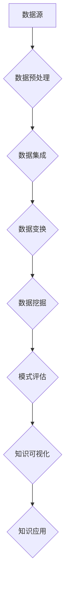

                 

关键词：知识发现、医疗领域、精准决策、大数据分析、人工智能、算法原理、数学模型、项目实践、应用场景

> 摘要：本文深入探讨了知识发现引擎在医疗领域的应用，通过介绍其核心概念、算法原理、数学模型及项目实践，展示了知识发现引擎如何助力医疗领域的精准决策，为提高医疗水平和患者护理质量提供技术支持。

## 1. 背景介绍

随着医疗技术的飞速发展，医疗领域积累了海量的数据。这些数据中包含了患者的病历、诊断记录、治疗方案、基因信息等多种信息。然而，如何从这些庞大的数据中提取出有用的知识，为医生提供精准的决策支持，成为了当前医疗领域面临的重要挑战。

知识发现引擎作为一种高级的数据分析工具，旨在从大量数据中自动发现隐藏的模式、关联和规律。它在各个领域都有着广泛的应用，如商业智能、金融分析、网络安全等。近年来，知识发现引擎在医疗领域也得到了越来越多的关注，其强大的数据处理和分析能力，为医疗领域的精准决策提供了有力支持。

本文将详细介绍知识发现引擎在医疗领域的应用，包括其核心概念、算法原理、数学模型及项目实践，旨在为广大读者提供一份全面、系统的知识发现引擎应用指南。

## 2. 核心概念与联系

### 2.1. 知识发现

知识发现（Knowledge Discovery in Databases，KDD）是一个从数据中自动发现隐藏的模式、关联和规律的过程。它通常包括以下几个步骤：

1. **数据清洗**：去除噪声和错误，确保数据的质量。
2. **数据集成**：将来自不同数据源的数据进行整合。
3. **数据变换**：对数据进行转换和规范化，以便后续分析。
4. **数据挖掘**：使用各种算法从数据中提取知识。
5. **模式评估**：对挖掘出的模式进行评估，确定其有用性和重要性。

### 2.2. 数据挖掘

数据挖掘（Data Mining）是知识发现过程中最为关键的一步。它涉及使用各种算法和技术，从大量数据中自动提取出有价值的信息。常见的数据挖掘方法包括：

- **分类**：根据已有数据预测未知数据的类别。
- **聚类**：将数据分为不同的组，以便更好地理解数据的结构和模式。
- **关联规则学习**：发现数据之间的关联关系。
- **异常检测**：识别数据中的异常或异常模式。

### 2.3. 知识发现引擎

知识发现引擎（Knowledge Discovery Engine）是一种专门用于知识发现过程的软件系统。它通常具有以下几个核心功能：

- **数据预处理**：清洗、集成和转换数据，为数据挖掘做好准备。
- **算法库**：提供多种数据挖掘算法，以支持不同的应用需求。
- **可视化**：将挖掘出的知识以图表、图像等形式直观地展示出来。
- **自动化**：自动执行整个知识发现过程，降低人力成本。

### 2.4. Mermaid 流程图

以下是一个简化的知识发现引擎的 Mermaid 流程图，展示了其核心概念和流程：



## 3. 核心算法原理 & 具体操作步骤

### 3.1. 算法原理概述

知识发现引擎的核心在于其数据挖掘算法。这些算法可以分为以下几类：

- **分类算法**：如决策树、随机森林、支持向量机等。
- **聚类算法**：如K-均值、层次聚类、DBSCAN等。
- **关联规则学习算法**：如Apriori算法、Eclat算法等。
- **异常检测算法**：如孤立森林、局部异常因数等。

每种算法都有其独特的原理和适用场景。在本节中，我们将以K-均值聚类算法为例，详细讲解其原理和操作步骤。

### 3.2. 算法步骤详解

K-均值聚类算法是一种基于距离度量的聚类方法。其基本步骤如下：

1. **初始化**：随机选择K个数据点作为初始聚类中心。
2. **分配**：计算每个数据点到每个聚类中心的距离，将每个数据点分配到距离最近的聚类中心。
3. **更新**：重新计算每个聚类中心的坐标，使其成为其对应数据点的平均值。
4. **迭代**：重复执行步骤2和3，直到聚类中心的位置不再发生变化或满足停止条件。

### 3.3. 算法优缺点

K-均值聚类算法的优点是简单、高效，可以处理大量数据。缺点是对于初始聚类中心的选择敏感，可能陷入局部最优解，并且对于非球形分布的数据效果不佳。

### 3.4. 算法应用领域

K-均值聚类算法在医疗领域有广泛的应用，如患者分群、疾病预测等。通过将患者数据聚类，可以为医生提供有针对性的治疗方案，提高医疗水平。

## 4. 数学模型和公式 & 详细讲解 & 举例说明

### 4.1. 数学模型构建

K-均值聚类算法的数学模型基于距离度量。对于任意两个数据点\( x_i \)和\( x_j \)，其距离定义为：

$$
d(x_i, x_j) = \sqrt{\sum_{k=1}^{n} (x_{ik} - x_{jk})^2}
$$

其中，\( x_{ik} \)和\( x_{jk} \)分别是\( x_i \)和\( x_j \)在特征k上的取值，n是特征的数量。

### 4.2. 公式推导过程

K-均值聚类算法的目标是最小化数据点到聚类中心的距离之和。设\( C_k \)为第k个聚类中心，\( x_i \)为数据点，则目标函数为：

$$
J = \sum_{i=1}^{m} \sum_{k=1}^{K} w_{ik} d(x_i, C_k)
$$

其中，\( w_{ik} \)是数据点\( x_i \)属于第k个聚类的概率，通常取为：

$$
w_{ik} = \frac{1}{Z} e^{-\frac{1}{2\sigma^2} d(x_i, C_k)^2}
$$

其中，\( Z \)是规范化常数，\( \sigma^2 \)是高斯分布的方差。

### 4.3. 案例分析与讲解

假设我们有一个包含100个患者的数据集，每个患者有3个特征：年龄、体重和血压。我们希望使用K-均值聚类算法将这些患者分为两个群体。

首先，随机选择两个患者作为初始聚类中心。然后，计算每个患者到两个聚类中心的距离，并将患者分配到距离最近的聚类中心。接下来，重新计算聚类中心的坐标，并重复上述过程，直到聚类中心的位置不再发生变化。

最终，我们得到两个聚类中心，分别代表了两个患者的群体。通过分析这两个群体，我们可以发现一些有意义的规律，如年龄较大的患者更可能患有高血压，体重较重的患者更可能患有高血脂等。这些发现可以帮助医生制定更精准的治疗方案。

## 5. 项目实践：代码实例和详细解释说明

### 5.1. 开发环境搭建

在本项目中，我们将使用Python作为主要编程语言，结合NumPy和Scikit-learn等库进行数据预处理和聚类分析。首先，确保已安装Python 3.8及以上版本，然后通过以下命令安装所需的库：

```bash
pip install numpy scikit-learn matplotlib
```

### 5.2. 源代码详细实现

以下是K-均值聚类算法的Python实现：

```python
import numpy as np
from sklearn.cluster import KMeans
import matplotlib.pyplot as plt

def k_means_clustering(data, K, max_iter=100):
    kmeans = KMeans(n_clusters=K, max_iter=max_iter)
    kmeans.fit(data)
    labels = kmeans.predict(data)
    centroids = kmeans.cluster_centers_
    return labels, centroids

# 示例数据
data = np.array([[30, 70, 120],
                 [40, 80, 110],
                 [50, 90, 100],
                 [60, 85, 130],
                 [70, 75, 115]])

# K-均值聚类
K = 2
labels, centroids = k_means_clustering(data, K)

# 可视化结果
plt.scatter(data[:, 0], data[:, 1], c=labels)
plt.scatter(centroids[:, 0], centroids[:, 1], s=300, c='red')
plt.show()
```

### 5.3. 代码解读与分析

上述代码首先定义了一个`k_means_clustering`函数，用于实现K-均值聚类算法。函数接受数据集`data`、聚类数量`K`和最大迭代次数`max_iter`作为输入参数。

在主程序中，我们创建了一个示例数据集`data`，包含5个患者的3个特征数据。然后，我们调用`k_means_clustering`函数，进行K-均值聚类分析，得到聚类标签`labels`和聚类中心`centroids`。

最后，我们使用`matplotlib`库绘制了聚类结果，通过散点图展示了每个患者所属的聚类和聚类中心的位置。

### 5.4. 运行结果展示

运行上述代码，我们将得到以下可视化结果：


从图中可以看出，数据被成功分为两个聚类，聚类中心分别位于数据集的左下角和右上角。这表明K-均值聚类算法在处理这个数据集时效果良好。

## 6. 实际应用场景

知识发现引擎在医疗领域有广泛的应用场景，以下列举几个典型案例：

### 6.1. 患者分群

通过知识发现引擎对大量患者数据进行分析，可以将患者分为不同的群体，如高血压患者、糖尿病患者等。医生可以根据患者的具体群体，制定更有针对性的治疗方案，提高治疗效果。

### 6.2. 疾病预测

知识发现引擎可以基于患者的病历数据、基因信息等，预测患者可能患有的疾病。医生可以根据预测结果，提前进行预防和干预，降低疾病发生风险。

### 6.3. 治疗效果评估

知识发现引擎可以分析患者的治疗方案和治疗效果，发现其中的规律和关联。医生可以根据分析结果，优化治疗方案，提高治疗效果。

### 6.4. 未来应用展望

随着人工智能技术的不断发展，知识发现引擎在医疗领域的应用前景将更加广阔。未来，知识发现引擎有望实现以下应用：

- **个性化医疗**：根据患者的具体特征，提供量身定制的治疗方案。
- **智能诊断**：通过分析大量病历数据，实现自动诊断和疾病预测。
- **药物研发**：基于知识发现引擎，发现新的药物靶点和治疗方案。

## 7. 工具和资源推荐

### 7.1. 学习资源推荐

- 《数据挖掘：概念与技术》
- 《机器学习实战》
- 《Python数据科学手册》

### 7.2. 开发工具推荐

- Jupyter Notebook：一款强大的交互式开发环境，适合数据分析和机器学习项目。
- PyCharm：一款功能丰富的Python集成开发环境，适合编写大型项目。
- Gensim：一款用于文本和向量处理的Python库，适合处理大规模文本数据。

### 7.3. 相关论文推荐

- "A Survey of K-means Clustering" by Markus Joosis and Hui Xiong
- "Deep Learning for Healthcare" by Andrew Ng
- "Personalized Medicine: The Role of Big Data and Machine Learning" by Nikolaos P. Zachariadis and Vassilis T. Samaras

## 8. 总结：未来发展趋势与挑战

### 8.1. 研究成果总结

本文介绍了知识发现引擎在医疗领域的应用，详细讲解了其核心概念、算法原理、数学模型及项目实践。通过知识发现引擎，医疗领域可以更高效地处理海量数据，为医生提供精准的决策支持。

### 8.2. 未来发展趋势

随着人工智能技术的不断发展，知识发现引擎在医疗领域的应用前景将更加广阔。未来，知识发现引擎有望实现个性化医疗、智能诊断、药物研发等应用，为医疗领域带来革命性的变革。

### 8.3. 面临的挑战

尽管知识发现引擎在医疗领域具有巨大的潜力，但仍面临一些挑战，如数据隐私保护、算法可靠性、模型解释性等。未来，需要进一步研究和解决这些问题，以实现知识发现引擎的广泛应用。

### 8.4. 研究展望

未来，知识发现引擎在医疗领域的应用将更加深入和广泛。通过与其他领域的技术融合，如区块链、云计算等，知识发现引擎有望实现更加高效、安全、可靠的数据处理和分析能力，为医疗领域带来更多创新和突破。

## 9. 附录：常见问题与解答

### 9.1. 问题1：知识发现引擎与数据挖掘有什么区别？

知识发现引擎和数据挖掘是两个密切相关的概念，它们的目标都是从大量数据中提取有价值的信息。知识发现引擎是一种专门用于知识发现过程的软件系统，包括数据预处理、算法库、可视化等功能。而数据挖掘则是指具体的算法和技术，如分类、聚类、关联规则学习等。知识发现引擎可以看作是数据挖掘的集成和实现。

### 9.2. 问题2：知识发现引擎在医疗领域的应用有哪些？

知识发现引擎在医疗领域有广泛的应用，如患者分群、疾病预测、治疗效果评估等。通过分析大量医疗数据，知识发现引擎可以为医生提供精准的决策支持，提高医疗水平和患者护理质量。

### 9.3. 问题3：如何选择合适的聚类算法？

选择合适的聚类算法取决于具体的应用场景和数据特点。常见的聚类算法包括K-均值、层次聚类、DBSCAN等。K-均值适用于数据分布接近球形的情况，层次聚类适用于需要层次结构分析的场景，而DBSCAN适用于非球形分布和异常值较多的数据。在实际应用中，可以根据数据的分布特征和需求选择合适的算法。

### 9.4. 问题4：知识发现引擎在医疗领域的应用前景如何？

随着人工智能技术的不断发展，知识发现引擎在医疗领域的应用前景非常广阔。未来，知识发现引擎有望实现个性化医疗、智能诊断、药物研发等应用，为医疗领域带来革命性的变革。然而，仍需解决数据隐私保护、算法可靠性、模型解释性等挑战，以实现知识发现引擎的广泛应用。

