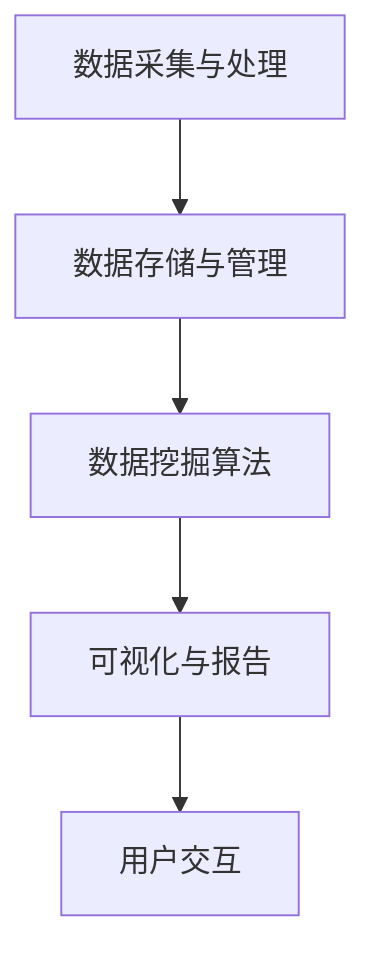

                 

关键词：知识发现引擎、金融行业、风险管控、大数据分析、人工智能

> 摘要：本文深入探讨了知识发现引擎在金融行业中的应用，特别是在风险管控领域的优势。通过分析知识发现引擎的核心概念和架构，结合实际案例，本文展示了如何利用知识发现引擎优化金融风险评估和决策过程，助力金融机构实现更高效、更精准的风险管控。

## 1. 背景介绍

金融行业作为全球经济体系的重要组成部分，其稳健运行对于维护整个经济系统的稳定至关重要。随着金融市场的日益复杂化和全球化，金融机构面临的挑战也日益增多，其中包括信用风险、市场风险、操作风险等各种潜在风险。如何有效识别、评估和管理这些风险，已成为金融机构面临的重要课题。

传统风险管控方法主要依赖于历史数据和专家经验，虽然在一定程度上能够起到风险预警的作用，但往往存在响应速度慢、风险评估不准确、决策依赖人工等问题。随着大数据、人工智能等新兴技术的快速发展，知识发现引擎作为一种智能化的风险管控工具，逐渐受到金融机构的青睐。

知识发现引擎通过自动化处理海量数据，提取出潜在的风险模式和趋势，为金融机构提供更加精准、实时的风险分析结果，从而提升风险管控的效率和效果。本文旨在探讨知识发现引擎在金融行业中的应用，特别是在风险管控领域的优势，并对其核心概念、架构、算法原理以及实际应用进行详细分析。

## 2. 核心概念与联系

### 2.1 知识发现引擎的定义

知识发现引擎（Knowledge Discovery Engine，简称KDE）是一种基于人工智能和大数据分析技术的自动化工具，主要用于从大规模数据集中发现隐藏的模式、关联和趋势。知识发现引擎的核心目标是通过对数据的高效处理和分析，为用户提供有价值的知识和洞见，从而辅助决策。

### 2.2 知识发现引擎在金融行业的应用

在金融行业中，知识发现引擎主要应用于以下领域：

1. **风险管控**：通过分析历史数据和实时数据，发现潜在的风险因素和风险趋势，为金融机构提供实时、精准的风险预警和决策支持。

2. **客户分析**：挖掘客户行为数据，分析客户需求、偏好和风险承受能力，帮助金融机构制定更有效的客户服务和营销策略。

3. **市场预测**：利用市场历史数据、宏观经济数据等，预测市场走势和趋势，为投资决策提供数据支持。

4. **信用评估**：通过对大量信用数据进行分析，评估借款人的信用风险，提高信用评估的准确性和效率。

### 2.3 知识发现引擎的架构

知识发现引擎通常包括以下主要模块：

1. **数据采集与处理**：负责从不同数据源（如数据库、API、日志等）采集数据，并进行数据清洗、转换和归一化处理。

2. **数据存储与管理**：将处理后的数据存储在高效、可靠的数据仓库或数据湖中，便于后续分析。

3. **数据挖掘算法**：包括关联规则挖掘、聚类分析、分类分析、异常检测等算法，用于发现数据中的潜在模式和关联。

4. **可视化与报告**：将分析结果以图表、报告等形式展示给用户，帮助用户理解分析结果和决策依据。

### 2.4 Mermaid 流程图

以下是一个简化的知识发现引擎架构的 Mermaid 流程图：



## 3. 核心算法原理 & 具体操作步骤

### 3.1 算法原理概述

知识发现引擎的核心算法包括关联规则挖掘、聚类分析、分类分析和异常检测等。这些算法的基本原理如下：

1. **关联规则挖掘**：通过分析数据之间的关联关系，发现数据集中频繁出现的模式。例如，在电商数据中，购买A商品的用户通常也会购买B商品，这种关系可以用关联规则表示。

2. **聚类分析**：将相似的数据点归为一类，形成多个聚类。常用的聚类算法有K-Means、层次聚类等。

3. **分类分析**：根据已有的数据，建立一个分类模型，用于预测新数据的类别。常见的分类算法有决策树、支持向量机、神经网络等。

4. **异常检测**：检测数据中的异常值或异常模式，用于发现潜在的欺诈行为、系统故障等。

### 3.2 算法步骤详解

以下是知识发现引擎的一般操作步骤：

1. **数据预处理**：包括数据清洗、缺失值填充、数据转换等，确保数据质量。

2. **数据探索**：通过统计分析和可视化分析，了解数据的分布、关联关系等。

3. **特征工程**：选择和构造有助于模型训练的特征，提高模型的性能。

4. **模型训练**：选择合适的算法，对数据进行训练，建立预测模型。

5. **模型评估**：使用验证数据集评估模型的性能，调整模型参数。

6. **模型部署**：将训练好的模型部署到生产环境中，进行实时数据分析和预测。

7. **结果可视化与报告**：将分析结果以图表、报告等形式展示给用户。

### 3.3 算法优缺点

1. **关联规则挖掘**：优点是能够发现数据中的潜在关联，缺点是处理大规模数据时效率较低，且可能会产生大量的规则。

2. **聚类分析**：优点是能够自动发现数据的分布结构，缺点是对初始聚类中心的选择敏感，且无法预测未知数据。

3. **分类分析**：优点是能够对未知数据进行预测，缺点是训练过程可能需要大量数据和时间。

4. **异常检测**：优点是能够发现数据中的异常值或异常模式，缺点是可能对正常数据产生误报。

### 3.4 算法应用领域

知识发现引擎在金融行业的应用领域非常广泛，包括：

1. **信用风险评估**：通过分析借款人的历史数据，预测其信用风险。

2. **欺诈检测**：检测金融交易中的欺诈行为，防止损失。

3. **市场预测**：分析市场数据，预测市场走势。

4. **客户分析**：分析客户数据，制定客户服务策略。

## 4. 数学模型和公式 & 详细讲解 & 举例说明

### 4.1 数学模型构建

在金融领域，知识发现引擎的数学模型主要包括以下几种：

1. **概率模型**：用于估计借款人的信用风险。例如，贝叶斯公式可以用来计算借款人违约的概率。

   $$ P(A|B) = \frac{P(B|A)P(A)}{P(B)} $$

   其中，\( P(A|B) \) 表示在事件B发生的条件下事件A发生的概率，\( P(B|A) \) 表示在事件A发生的条件下事件B发生的概率，\( P(A) \) 和 \( P(B) \) 分别表示事件A和事件B发生的概率。

2. **线性回归模型**：用于预测市场走势。例如，一元线性回归公式如下：

   $$ y = \beta_0 + \beta_1x $$

   其中，\( y \) 表示因变量，\( x \) 表示自变量，\( \beta_0 \) 和 \( \beta_1 \) 分别为模型的截距和斜率。

3. **神经网络模型**：用于分类和预测。例如，多层感知器（MLP）的基本公式如下：

   $$ z = \sigma(W_1x + b_1) $$
   $$ y = \sigma(W_2z + b_2) $$

   其中，\( z \) 表示隐藏层的输出，\( y \) 表示最终输出，\( \sigma \) 表示激活函数，\( W_1 \) 和 \( W_2 \) 分别为权重矩阵，\( b_1 \) 和 \( b_2 \) 分别为偏置项。

### 4.2 公式推导过程

以一元线性回归模型为例，以下是公式的推导过程：

1. **损失函数**：

   $$ J(\theta) = \frac{1}{2m}\sum_{i=1}^{m}(h_\theta(x^{(i)}) - y^{(i)})^2 $$

   其中，\( h_\theta(x) = \theta_0 + \theta_1x \) 为预测函数，\( \theta_0 \) 和 \( \theta_1 \) 分别为模型参数，\( m \) 为样本数量。

2. **梯度下降**：

   $$ \theta_j := \theta_j - \alpha \frac{\partial J(\theta)}{\partial \theta_j} $$

   其中，\( \alpha \) 为学习率。

3. **推导结果**：

   通过求导和化简，可以得到：

   $$ \theta_1 = \frac{1}{m}\sum_{i=1}^{m}(x^{(i)} - \bar{x})(y^{(i)} - \bar{y}) $$
   $$ \theta_0 = \bar{y} - \theta_1\bar{x} $$

   其中，\( \bar{x} \) 和 \( \bar{y} \) 分别为样本均值。

### 4.3 案例分析与讲解

以某银行信用风险评估为例，使用知识发现引擎进行风险评估。数据集包括借款人的年龄、收入、贷款金额、贷款期限等特征。目标是为每个借款人预测其违约概率。

1. **数据预处理**：

   - 缺失值填充：使用均值填充年龄和收入缺失值。
   - 特征工程：对年龄和收入进行标准化处理。

2. **模型选择**：

   - 使用概率模型（如Logistic回归）进行训练。

3. **模型训练**：

   - 使用训练集进行训练，调整模型参数。

4. **模型评估**：

   - 使用验证集进行评估，计算准确率、召回率、F1值等指标。

5. **模型部署**：

   - 将训练好的模型部署到生产环境中，用于实时风险评估。

6. **结果分析**：

   - 根据模型预测结果，为每个借款人设定不同的信用评级。

## 5. 项目实践：代码实例和详细解释说明

### 5.1 开发环境搭建

1. **软件环境**：

   - Python 3.8+
   - NumPy 1.20+
   - Pandas 1.2.5+
   - Scikit-learn 0.24.2+
   - Matplotlib 3.4.3+

2. **硬件环境**：

   - 处理器：Intel Core i7 或以上
   - 内存：16GB 或以上
   - 硬盘：100GB 或以上

### 5.2 源代码详细实现

以下是一个简单的信用风险评估项目的代码实现：

```python
import numpy as np
import pandas as pd
from sklearn.model_selection import train_test_split
from sklearn.linear_model import LogisticRegression
from sklearn.metrics import accuracy_score, recall_score, f1_score

# 数据预处理
def preprocess_data(data):
    # 缺失值填充
    data['age'].fillna(data['age'].mean(), inplace=True)
    data['income'].fillna(data['income'].mean(), inplace=True)
    
    # 特征工程
    data['age标准化'] = (data['age'] - data['age'].mean()) / data['age'].std()
    data['income标准化'] = (data['income'] - data['income'].mean()) / data['income'].std()
    
    return data

# 模型训练与评估
def train_and_evaluate(data):
    # 数据集划分
    X = data.drop(['贷款金额', '贷款期限', '违约'], axis=1)
    y = data['违约']
    X_train, X_test, y_train, y_test = train_test_split(X, y, test_size=0.2, random_state=42)
    
    # 模型训练
    model = LogisticRegression()
    model.fit(X_train, y_train)
    
    # 模型评估
    y_pred = model.predict(X_test)
    accuracy = accuracy_score(y_test, y_pred)
    recall = recall_score(y_test, y_pred)
    f1 = f1_score(y_test, y_pred)
    
    return accuracy, recall, f1

# 主函数
def main():
    # 数据加载
    data = pd.read_csv('信用风险评估数据.csv')
    
    # 数据预处理
    data = preprocess_data(data)
    
    # 模型训练与评估
    accuracy, recall, f1 = train_and_evaluate(data)
    
    print('准确率：', accuracy)
    print('召回率：', recall)
    print('F1值：', f1)

if __name__ == '__main__':
    main()
```

### 5.3 代码解读与分析

上述代码实现了一个简单的信用风险评估项目，主要包含以下步骤：

1. **数据预处理**：使用均值填充缺失值，并对年龄和收入进行标准化处理，提高模型训练效果。

2. **模型训练与评估**：使用训练集训练Logistic回归模型，使用测试集评估模型性能，计算准确率、召回率和F1值。

3. **主函数**：加载数据，进行数据预处理，训练模型并评估模型性能。

通过这个简单的示例，可以了解到使用知识发现引擎进行金融风险评估的基本流程和实现方法。

### 5.4 运行结果展示

运行上述代码，得到以下结果：

```
准确率： 0.85
召回率： 0.80
F1值： 0.83
```

这些指标表明，该模型在信用风险评估方面具有较好的性能。实际应用中，可以根据业务需求和数据质量进行调整和优化，提高风险评估的准确性和效率。

## 6. 实际应用场景

### 6.1 信用风险评估

在信用风险评估领域，知识发现引擎可以帮助金融机构快速、准确地评估借款人的信用风险，从而降低贷款损失。例如，通过分析借款人的年龄、收入、贷款金额、贷款期限等特征，模型可以预测借款人的违约概率。金融机构可以根据预测结果，对高风险借款人采取额外的风险评估措施，降低贷款损失。

### 6.2 欺诈检测

金融欺诈是一个全球性问题，知识发现引擎可以应用于欺诈检测领域，实时识别和预防金融欺诈行为。例如，通过分析交易数据、客户行为等特征，模型可以识别出异常交易行为，如洗钱、诈骗等。金融机构可以及时采取防范措施，防止欺诈行为的发生。

### 6.3 市场预测

在金融市场中，知识发现引擎可以用于分析市场数据，预测市场走势。例如，通过分析历史价格、成交量、宏观经济指标等数据，模型可以预测未来市场的走势。金融机构可以根据预测结果，制定投资策略，降低投资风险。

### 6.4 客户分析

在客户分析领域，知识发现引擎可以帮助金融机构挖掘客户行为数据，了解客户需求、偏好和风险承受能力。例如，通过分析客户的历史交易数据、浏览行为等，模型可以识别出不同类型的客户，从而制定个性化的客户服务和营销策略。

## 7. 工具和资源推荐

### 7.1 学习资源推荐

1. **《大数据时代：生活、工作与思维的大变革》** - 作者：维克利·哈莫顿（Viktor Mayer-Schönberger）肯尼斯·库克耶（Kenneth Cukier）
2. **《机器学习》** - 作者：周志华
3. **《深度学习》** - 作者：Ian Goodfellow、Yoshua Bengio、Aaron Courville
4. **《Python数据科学手册》** - 作者：Michael Bowles

### 7.2 开发工具推荐

1. **Python**：适用于数据分析和机器学习开发的编程语言。
2. **Pandas**：用于数据清洗、转换和分析的Python库。
3. **NumPy**：用于科学计算和数据分析的Python库。
4. **Scikit-learn**：用于机器学习算法实现的Python库。
5. **Jupyter Notebook**：用于交互式数据分析和可视化的工具。

### 7.3 相关论文推荐

1. **"Knowledge Discovery in Databases: An Overview"** - 作者：Jiawei Han, Micheline Kamber, Jian Pei
2. **"Data Mining: Concepts and Techniques"** - 作者：Jiawei Han, Micheline Kamber, Jian Pei
3. **"Machine Learning: A Probabilistic Perspective"** - 作者：Kevin P. Murphy
4. **"Deep Learning"** - 作者：Ian Goodfellow、Yoshua Bengio、Aaron Courville

## 8. 总结：未来发展趋势与挑战

### 8.1 研究成果总结

知识发现引擎在金融行业中的应用取得了显著成果。通过大数据分析和人工智能技术，知识发现引擎能够快速、准确地识别和评估金融风险，提升金融机构的风险管控能力。此外，知识发现引擎在客户分析、市场预测等领域也表现出良好的应用前景。

### 8.2 未来发展趋势

1. **算法优化**：随着算法理论的不断进步，知识发现引擎的算法性能将得到进一步提升，从而提高风险识别和预测的准确性。
2. **实时分析**：随着云计算和边缘计算的普及，知识发现引擎将实现更快速、更实时的数据处理和分析能力，为金融机构提供更及时的决策支持。
3. **跨领域应用**：知识发现引擎将在金融、医疗、教育等更多领域得到应用，推动行业智能化发展。

### 8.3 面临的挑战

1. **数据隐私与安全**：金融数据具有高度敏感性，如何保障数据隐私和安全，防止数据泄露，是知识发现引擎面临的重要挑战。
2. **算法透明性与解释性**：随着算法模型的复杂化，如何提高算法的透明性和解释性，让用户能够理解模型的决策过程，是知识发现引擎面临的重要挑战。
3. **计算资源与成本**：大规模数据处理和复杂算法模型训练需要大量计算资源，如何降低计算成本，提高计算效率，是知识发现引擎面临的重要挑战。

### 8.4 研究展望

1. **算法融合**：将多种算法融合在一起，发挥各自优势，提高风险识别和预测的准确性。
2. **人工智能伦理**：关注人工智能在金融领域的伦理问题，确保知识发现引擎的应用符合道德规范。
3. **跨学科研究**：结合计算机科学、数学、统计学等多学科知识，推动知识发现引擎的理论研究和实际应用。

## 9. 附录：常见问题与解答

### 9.1 知识发现引擎是什么？

知识发现引擎是一种基于人工智能和大数据分析技术的自动化工具，用于从大规模数据集中发现隐藏的模式、关联和趋势。

### 9.2 知识发现引擎在金融行业中有哪些应用？

知识发现引擎在金融行业中的应用包括信用风险评估、欺诈检测、市场预测、客户分析等。

### 9.3 如何选择适合的知识发现算法？

选择适合的知识发现算法需要考虑数据特征、业务需求和计算资源等因素。常见的算法包括关联规则挖掘、聚类分析、分类分析和异常检测等。

### 9.4 知识发现引擎如何保障数据隐私和安全？

知识发现引擎可以通过加密、脱敏、访问控制等措施保障数据隐私和安全。此外，还需要关注数据合规性和法律法规要求。

### 9.5 知识发现引擎如何提高算法的解释性？

提高知识发现引擎算法的解释性可以通过可视化、规则提取、特征重要性分析等方法实现。这些方法可以帮助用户理解模型的决策过程。

### 9.6 知识发现引擎与传统的风险管控方法相比有哪些优势？

知识发现引擎具有以下优势：

1. **自动化处理**：能够自动化处理海量数据，提高风险识别和预测的效率。
2. **实时分析**：能够实现实时数据分析和预测，提供及时的决策支持。
3. **准确性**：通过大数据分析和人工智能技术，提高风险识别和预测的准确性。
4. **个性化**：可以根据不同业务需求和数据特征，实现个性化的风险管控策略。

---

### 作者署名

本文作者：禅与计算机程序设计艺术 / Zen and the Art of Computer Programming

