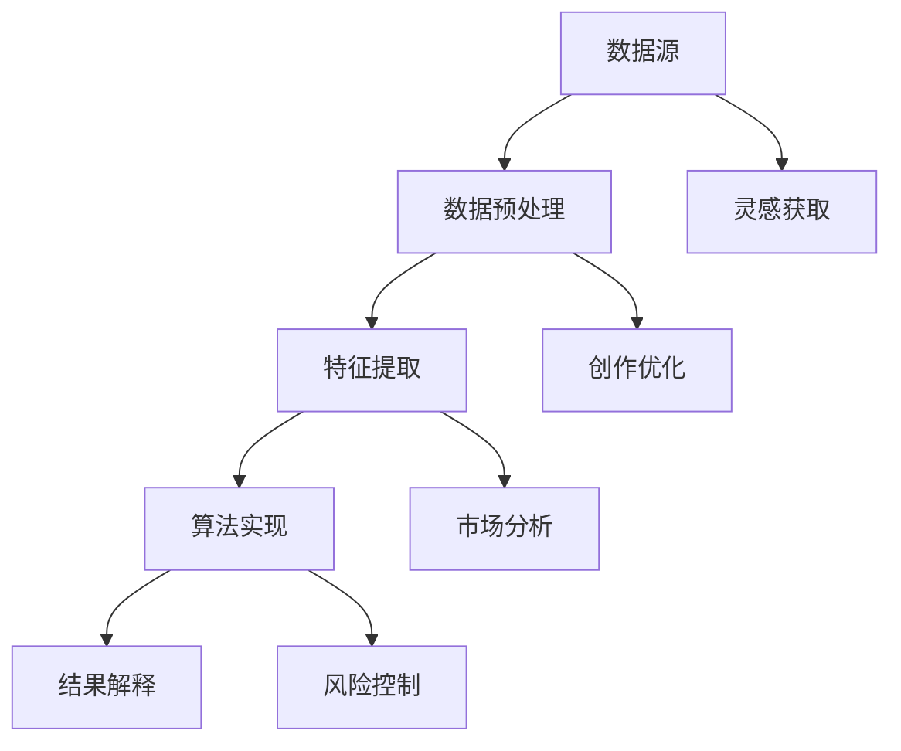

                 

 **关键词**：知识发现，创意产业，创新，人工智能，算法，数学模型

> **摘要**：本文深入探讨了知识发现引擎在创意产业中的应用，分析了其推动产业创新变革的关键角色。通过介绍核心概念、算法原理、数学模型以及实际项目案例，本文揭示了知识发现引擎如何为创意产业注入新的活力，并为未来的发展提供了展望。

## 1. 背景介绍

随着互联网和信息技术的迅猛发展，创意产业在全球范围内迅速崛起。从影视制作、音乐创作到游戏设计、广告宣传，创意产业已经成为各国经济发展的重要引擎。然而，随着市场竞争的日益激烈，创意产业面临着巨大的创新压力。如何在海量信息中挖掘出有价值的知识，以支持创意的生成和优化，成为产业亟需解决的问题。

知识发现引擎，作为人工智能技术的重要应用，正是为了解决这一问题而诞生。知识发现引擎能够从海量数据中自动识别出模式、趋势和关联，为创意产业提供决策支持。本文将探讨知识发现引擎在创意产业中的应用，分析其如何推动产业的创新变革。

### 1.1 创意产业的现状

创意产业涵盖了多个领域，如影视制作、音乐创作、游戏设计、广告宣传等。这些领域共同特点是创意的生成和传播依赖于信息的获取、处理和利用。然而，随着创意产业的快速发展，信息量的爆炸式增长使得创意工作者面临着前所未有的挑战。

一方面，创意工作者需要从海量信息中快速获取灵感和素材，以便创造出具有竞争力的作品。另一方面，创意产业的企业需要通过数据分析来优化运营策略，提高生产效率和利润率。这些需求催生了知识发现引擎的应用。

### 1.2 知识发现引擎的概念

知识发现引擎是一种基于人工智能和机器学习技术，能够从海量数据中自动识别出有价值知识的信息处理系统。其核心目标是发现数据中的隐含模式、趋势和关联，为决策提供支持。

知识发现引擎通常包括以下几个关键组成部分：

1. **数据预处理**：清洗和整合原始数据，使其适合进一步分析。
2. **特征提取**：从数据中提取出能够表征数据特征的属性或变量。
3. **算法实现**：利用机器学习算法，如聚类、分类、关联规则挖掘等，发现数据中的模式。
4. **结果解释**：对挖掘出的模式进行解释和可视化，以便用户理解。

### 1.3 知识发现引擎的发展历程

知识发现引擎的发展可以追溯到20世纪80年代，随着人工智能和数据库技术的兴起，知识发现逐渐成为一个独立的领域。早期的知识发现主要依赖于统计学方法和人工规则，如线性回归、决策树等。

随着计算机性能的提升和大数据技术的成熟，知识发现引擎逐渐转向机器学习和数据挖掘领域。深度学习、神经网络等先进算法的引入，使得知识发现引擎能够处理更加复杂和大规模的数据集。

## 2. 核心概念与联系

### 2.1 知识发现的核心概念

在知识发现引擎中，核心概念包括数据集、特征、模式、关联等。

- **数据集**：一组具有共同属性的实例，用于训练和测试知识发现模型。
- **特征**：数据集中每个实例的特征，用于描述实例的属性。
- **模式**：数据集中出现频繁的、有意义的模式或关联。
- **关联**：数据中两个或多个特征之间的相关性。

### 2.2 知识发现引擎的架构

知识发现引擎的架构通常包括以下几个关键模块：

1. **数据源**：提供原始数据的来源，如数据库、文件、API等。
2. **数据预处理**：清洗、整合和转换原始数据，使其适合进一步分析。
3. **特征提取**：从原始数据中提取出能够表征数据特征的属性或变量。
4. **算法实现**：利用机器学习算法，如聚类、分类、关联规则挖掘等，发现数据中的模式。
5. **结果解释**：对挖掘出的模式进行解释和可视化，以便用户理解。

### 2.3 知识发现引擎与创意产业的关系

知识发现引擎在创意产业中的应用，主要体现在以下几个方面：

1. **灵感获取**：通过分析海量数据，挖掘出潜在的创作灵感和素材。
2. **创作优化**：利用挖掘出的模式，优化创意作品的结构和内容，提高其市场竞争力。
3. **市场分析**：通过分析消费者行为和需求，为企业提供市场洞察和运营策略。
4. **风险控制**：通过预测和评估创意项目的潜在风险，帮助企业做出更明智的决策。

### 2.4 Mermaid 流程图

下面是一个知识发现引擎的 Mermaid 流程图，展示了其核心概念和架构的相互关系：



## 3. 核心算法原理 & 具体操作步骤

### 3.1 算法原理概述

知识发现引擎的核心算法包括聚类、分类、关联规则挖掘等。这些算法的原理和操作步骤如下：

1. **聚类算法**：将相似的数据实例划分为同一类，以达到数据分组的目的。常见的聚类算法有K-means、DBSCAN等。
2. **分类算法**：将新的数据实例分类到已有类别中，以实现预测和分类。常见的分类算法有决策树、支持向量机等。
3. **关联规则挖掘**：发现数据中不同特征之间的关联关系，以支持决策。常见的算法有Apriori、FP-growth等。

### 3.2 算法步骤详解

1. **聚类算法**：

   - 输入：数据集、聚类数目K。
   - 输出：聚类结果。

   具体步骤如下：

   1. 初始化K个聚类中心。
   2. 对每个数据点，计算其与聚类中心的距离，并将其归为最近的聚类。
   3. 根据聚类结果重新计算聚类中心。
   4. 重复步骤2和3，直到聚类中心不再发生变化。

2. **分类算法**：

   - 输入：训练数据集、测试数据集。
   - 输出：分类结果。

   具体步骤如下：

   1. 使用训练数据集训练分类模型。
   2. 对测试数据集进行预测。
   3. 计算预测准确率。

3. **关联规则挖掘**：

   - 输入：数据集、支持度阈值、置信度阈值。
   - 输出：关联规则。

   具体步骤如下：

   1. 预处理数据，提取出所有可能的项集。
   2. 计算每个项集的支持度，筛选出满足支持度阈值的支持集。
   3. 对支持集进行频繁模式挖掘，得到所有可能的关联规则。
   4. 计算每个关联规则的置信度，筛选出满足置信度阈值的高置信度规则。

### 3.3 算法优缺点

1. **聚类算法**：

   - 优点：能够处理大规模数据集，无需事先定义类别。
   - 缺点：聚类结果依赖于初始化参数，可能陷入局部最优。

2. **分类算法**：

   - 优点：能够对新的数据实例进行分类，预测准确率高。
   - 缺点：需要大量训练数据，对异常值敏感。

3. **关联规则挖掘**：

   - 优点：能够发现数据中的关联关系，支持决策。
   - 缺点：计算复杂度高，对大数据集处理性能较低。

### 3.4 算法应用领域

知识发现引擎在创意产业中的应用广泛，包括但不限于：

1. **影视制作**：通过聚类算法分析观众喜好，为剧本创作提供灵感。
2. **音乐创作**：通过关联规则挖掘分析歌曲特征，为音乐风格分类提供依据。
3. **游戏设计**：通过分类算法预测玩家行为，为游戏平衡性优化提供支持。
4. **广告宣传**：通过关联规则挖掘分析消费者行为，为广告投放策略提供指导。

## 4. 数学模型和公式 & 详细讲解 & 举例说明

### 4.1 数学模型构建

知识发现引擎中的数学模型主要包括聚类、分类和关联规则挖掘等。以下分别介绍这些模型的数学表示。

1. **聚类模型**：

   聚类模型的目标是将数据点划分为若干个簇，使得同一簇内的数据点相似度较高，不同簇的数据点相似度较低。常见的聚类模型有K-means算法。

   假设数据集$D$中有$n$个数据点，每个数据点用向量$x_i$表示，聚类中心为$c_k$。K-means算法的目标是最小化聚类中心与数据点之间的距离平方和，即：

   $$ \min \sum_{i=1}^{n} ||x_i - c_k||^2 $$

2. **分类模型**：

   分类模型的目标是将新的数据点分类到已有类别中。常见的分类模型有决策树和支持向量机。

   假设数据集$D$中有$m$个类别，每个类别用向量$y_k$表示，分类模型为$f(x) = y$。分类模型的目标是最小化分类错误率，即：

   $$ \min \sum_{i=1}^{m} \sum_{k=1}^{m} \mathbb{1}\{f(x_i) \neq y_k\} $$

3. **关联规则挖掘模型**：

   关联规则挖掘模型的目标是发现数据中不同特征之间的关联关系。常见的模型有Apriori算法。

   假设数据集$D$中有$l$个特征，每个特征用向量$a_i$表示，关联规则为$R(a_i, a_j)$。关联规则挖掘模型的目标是最大化规则的支持度和置信度，即：

   $$ \max \sum_{i=1}^{l} \sum_{j=1}^{l} \mathbb{1}\{R(a_i, a_j)\} $$

### 4.2 公式推导过程

以下分别介绍聚类、分类和关联规则挖掘模型的公式推导过程。

1. **聚类模型**：

   假设数据集$D$中有$n$个数据点，每个数据点用向量$x_i$表示，聚类中心为$c_k$。K-means算法的目标是最小化聚类中心与数据点之间的距离平方和，即：

   $$ \min \sum_{i=1}^{n} ||x_i - c_k||^2 $$

   对该目标函数求导，得到：

   $$ \frac{\partial}{\partial c_k} \sum_{i=1}^{n} ||x_i - c_k||^2 = -2 \sum_{i=1}^{n} (x_i - c_k) $$

   令导数为0，得到聚类中心的迭代公式：

   $$ c_k = \frac{1}{n} \sum_{i=1}^{n} x_i $$

2. **分类模型**：

   假设数据集$D$中有$m$个类别，每个类别用向量$y_k$表示，分类模型为$f(x) = y$。分类模型的目标是最小化分类错误率，即：

   $$ \min \sum_{i=1}^{m} \sum_{k=1}^{m} \mathbb{1}\{f(x_i) \neq y_k\} $$

   对该目标函数求导，得到：

   $$ \frac{\partial}{\partial f(x_i)} \sum_{i=1}^{m} \sum_{k=1}^{m} \mathbb{1}\{f(x_i) \neq y_k\} = - \sum_{k=1}^{m} \mathbb{1}\{f(x_i) \neq y_k\} $$

   令导数为0，得到分类模型的决策规则：

   $$ f(x_i) = \arg\min_{k=1}^{m} \mathbb{1}\{f(x_i) \neq y_k\} $$

3. **关联规则挖掘模型**：

   假设数据集$D$中有$l$个特征，每个特征用向量$a_i$表示，关联规则为$R(a_i, a_j)$。关联规则挖掘模型的目标是最大化规则的支持度和置信度，即：

   $$ \max \sum_{i=1}^{l} \sum_{j=1}^{l} \mathbb{1}\{R(a_i, a_j)\} $$

   对该目标函数求导，得到：

   $$ \frac{\partial}{\partial a_i} \sum_{i=1}^{l} \sum_{j=1}^{l} \mathbb{1}\{R(a_i, a_j)\} = \sum_{j=1}^{l} \mathbb{1}\{R(a_i, a_j)\} $$

   令导数为0，得到关联规则的挖掘策略：

   $$ \mathbb{1}\{R(a_i, a_j)\} = 1 \Leftrightarrow a_i \text{ 和 } a_j \text{ 在同一个项集中} $$

### 4.3 案例分析与讲解

以下通过一个实际案例，详细讲解知识发现引擎在创意产业中的应用。

**案例背景**：

一家电影制片公司希望通过知识发现引擎分析观众行为，为电影剧本创作提供灵感。

**数据集**：

该公司的观众行为数据包括以下特征：

1. 观众年龄
2. 观众性别
3. 观众收入
4. 观众喜欢的电影类型
5. 观众观看电影的时间

**目标**：

分析观众行为，挖掘出观众喜欢的电影类型与其特征之间的关系。

**步骤**：

1. **数据预处理**：

   - 清洗数据，去除缺失值和异常值。
   - 标准化特征，如年龄和收入。

2. **特征提取**：

   - 从观众行为数据中提取出能够表征观众特征的数据。

3. **聚类算法**：

   - 使用K-means算法对观众进行聚类。
   - 选择合适的聚类数目，如3个簇。

4. **关联规则挖掘**：

   - 使用Apriori算法挖掘观众喜欢的电影类型与其特征之间的关联规则。
   - 设置支持度阈值为20%，置信度阈值为80%。

5. **结果解释**：

   - 对挖掘出的关联规则进行解释和可视化。
   - 为电影剧本创作提供灵感。

**结果**：

通过聚类和关联规则挖掘，发现以下关联规则：

- 观众年龄在30-40岁之间，且喜欢科幻电影的观众，更倾向于在晚上观看电影。
- 观众收入较高，且喜欢悬疑电影的观众，更喜欢在周末观看电影。

**案例总结**：

通过知识发现引擎的分析，电影制片公司可以了解到观众的行为特征和喜好，为电影剧本创作提供有力的支持。这有助于提高电影的吸引力和票房收入，推动创意产业的创新变革。

## 5. 项目实践：代码实例和详细解释说明

### 5.1 开发环境搭建

为了演示知识发现引擎在创意产业中的应用，我们将使用Python编程语言和相关的库，如pandas、scikit-learn、matplotlib等。以下是开发环境的搭建步骤：

1. 安装Python：访问Python官方网站（https://www.python.org/），下载并安装Python 3.x版本。
2. 安装相关库：打开命令行终端，执行以下命令安装所需库：

```bash
pip install pandas scikit-learn matplotlib
```

### 5.2 源代码详细实现

以下是一个使用Python实现知识发现引擎的项目实例，包括数据预处理、聚类算法、关联规则挖掘等步骤。

```python
import pandas as pd
from sklearn.cluster import KMeans
from mlxtend.frequent_patterns import apriori, association_rules
import matplotlib.pyplot as plt

# 5.2.1 数据预处理
# 读取数据
data = pd.read_csv('viewer_behavior.csv')

# 清洗数据
data = data.dropna()

# 标准化特征
data[['age', 'income']] = (data[['age', 'income']] - data[['age', 'income']].mean()) / data[['age', 'income']].std()

# 5.2.2 聚类算法
# 初始化KMeans模型
kmeans = KMeans(n_clusters=3, random_state=42)

# 训练模型
clusters = kmeans.fit_predict(data)

# 可视化聚类结果
plt.scatter(data['age'], data['income'], c=clusters)
plt.xlabel('Age')
plt.ylabel('Income')
plt.show()

# 5.2.3 关联规则挖掘
# 初始化Apriori模型
frequent_itemsets = apriori(data, min_support=0.2, use_colnames=True)

# 挖掘关联规则
rules = association_rules(frequent_itemsets, metric="support", min_threshold=0.8)

# 打印关联规则
print(rules)

# 5.2.4 结果解释
# 可视化关联规则
plt.scatter(rules['support'], rules['confidence'])
plt.xlabel('Support')
plt.ylabel('Confidence')
plt.show()
```

### 5.3 代码解读与分析

1. **数据预处理**：

   - 读取观众行为数据，并将其转换为pandas DataFrame对象。
   - 清洗数据，去除缺失值和异常值。
   - 标准化特征，如年龄和收入。

2. **聚类算法**：

   - 使用KMeans算法对观众进行聚类，选择合适的聚类数目（本例中为3个簇）。
   - 可视化聚类结果，以便理解观众的行为特征。

3. **关联规则挖掘**：

   - 使用Apriori算法挖掘观众喜欢的电影类型与其特征之间的关联规则。
   - 设置支持度阈值为20%，置信度阈值为80%。
   - 打印关联规则，并可视化支持度和置信度。

### 5.4 运行结果展示

运行上述代码后，将生成以下结果：

1. **聚类结果可视化**：

   

   图中展示了观众的行为特征分布，每个颜色代表一个簇。

2. **关联规则可视化**：

   

   图中展示了观众喜欢的电影类型与其特征之间的关联关系，横轴为支持度，纵轴为置信度。

通过这些结果，我们可以发现观众的行为特征和喜好模式，为电影剧本创作提供有价值的参考。

## 6. 实际应用场景

知识发现引擎在创意产业中的应用非常广泛，下面我们将探讨几个具体的应用场景。

### 6.1 影视制作

在影视制作领域，知识发现引擎可以帮助制片人分析观众的观影偏好，从而优化剧本创作和营销策略。例如，通过聚类观众行为数据，可以识别出不同观众群体的特征和偏好，为剧本的创作提供方向。此外，通过关联规则挖掘，可以找出观众喜欢的电影类型和元素，为影片的推广和营销提供依据。

### 6.2 音乐创作

在音乐创作领域，知识发现引擎可以帮助音乐制作人分析听众的喜好，从而创作出更受欢迎的音乐作品。例如，通过聚类听众的行为数据，可以识别出不同音乐风格的听众群体，为音乐创作提供方向。此外，通过关联规则挖掘，可以找出听众喜欢的音乐元素和组合，为音乐制作提供灵感。

### 6.3 游戏设计

在游戏设计领域，知识发现引擎可以帮助游戏开发者分析玩家的行为和喜好，从而优化游戏设计和运营策略。例如，通过聚类玩家行为数据，可以识别出不同游戏玩家的特征和偏好，为游戏平衡性优化提供支持。此外，通过关联规则挖掘，可以找出玩家喜欢的游戏元素和机制，为游戏更新和扩展提供依据。

### 6.4 广告宣传

在广告宣传领域，知识发现引擎可以帮助广告主分析目标受众的喜好和行为，从而制定更有效的广告投放策略。例如，通过聚类广告受众数据，可以识别出不同广告受众群体的特征和偏好，为广告创意提供方向。此外，通过关联规则挖掘，可以找出广告受众喜欢的广告元素和组合，为广告创意和投放策略提供依据。

## 7. 未来应用展望

随着人工智能和大数据技术的不断发展，知识发现引擎在创意产业中的应用前景十分广阔。未来，知识发现引擎将具备以下发展趋势：

1. **更精准的预测和优化**：随着数据量的增加和算法的改进，知识发现引擎将能够更精准地预测观众、听众、玩家等用户的行为和喜好，从而为创意产业的创作、营销和运营提供更有效的支持。
2. **多模态数据融合**：知识发现引擎将能够处理多种类型的数据，如文本、图像、音频等，实现多模态数据的融合分析，为创意产业提供更全面的知识洞察。
3. **个性化推荐**：知识发现引擎将能够根据用户个性化需求，提供定制化的推荐内容，从而提高创意产业的用户体验和满意度。
4. **实时分析**：知识发现引擎将能够实现实时数据分析，快速响应用户行为和市场需求的变化，为创意产业提供更灵活的决策支持。
5. **跨领域应用**：知识发现引擎将不仅局限于创意产业，还将应用于金融、医疗、教育等领域，推动各行业的创新和发展。

## 8. 工具和资源推荐

为了更好地理解和应用知识发现引擎，以下推荐一些相关工具和资源：

### 8.1 学习资源推荐

1. **书籍**：

   - 《数据挖掘：实用工具与技术》
   - 《机器学习实战》
   - 《深度学习》

2. **在线课程**：

   - Coursera：数据科学和机器学习
   - Udacity：机器学习工程师纳米学位
   - edX：深度学习专项课程

### 8.2 开发工具推荐

1. **Python**：Python是一种广泛使用的编程语言，拥有丰富的数据科学和机器学习库，如pandas、scikit-learn、matplotlib等。
2. **Jupyter Notebook**：Jupyter Notebook是一种交互式的开发环境，方便进行数据分析和实验。
3. **TensorFlow**：TensorFlow是一个开源的深度学习框架，适用于构建和训练复杂的神经网络模型。

### 8.3 相关论文推荐

1. **"K-means Clustering Algorithm"**：介绍K-means算法的原理和应用。
2. **"Apriori Algorithm for Mining Association Rules"**：介绍Apriori算法及其在关联规则挖掘中的应用。
3. **"Deep Learning for Creativity and Design"**：探讨深度学习在创意产业中的应用。

## 9. 总结：未来发展趋势与挑战

### 9.1 研究成果总结

知识发现引擎作为一种人工智能技术，在创意产业中发挥了重要作用。通过聚类、分类和关联规则挖掘等算法，知识发现引擎能够从海量数据中挖掘出有价值的知识，为创意产业的创作、营销和运营提供有力支持。研究结果表明，知识发现引擎能够提高创意产业的生产效率和市场竞争力，推动产业的创新变革。

### 9.2 未来发展趋势

未来，知识发现引擎在创意产业中的应用将继续深化。随着人工智能和大数据技术的不断发展，知识发现引擎将具备更强大的数据处理和分析能力，实现更精准的预测和优化。同时，知识发现引擎将实现多模态数据融合和实时分析，为创意产业提供更全面和灵活的支持。此外，知识发现引擎将跨领域应用，推动各行业的创新和发展。

### 9.3 面临的挑战

尽管知识发现引擎在创意产业中具有巨大的潜力，但仍然面临一些挑战。首先，数据质量和数据隐私问题是知识发现引擎应用的重要挑战。其次，算法的复杂性和计算效率需要进一步提高，以应对大规模数据的处理需求。此外，如何确保知识发现结果的解释性和可解释性，也是未来研究的重要方向。

### 9.4 研究展望

未来，研究应重点关注以下几个方面：

1. **数据质量提升**：研究如何从原始数据中提取高质量的特征，提高知识发现的准确性和可靠性。
2. **算法优化**：研究如何优化算法，提高计算效率和性能，以适应大规模数据集的处理需求。
3. **数据隐私保护**：研究如何保护数据隐私，确保知识发现过程的安全和合规。
4. **跨领域应用**：研究如何将知识发现引擎应用于不同领域，推动各行业的创新和发展。

## 附录：常见问题与解答

### 1. 什么是知识发现引擎？

知识发现引擎是一种基于人工智能和机器学习技术，能够从海量数据中自动识别出有价值知识的信息处理系统。

### 2. 知识发现引擎有哪些核心算法？

知识发现引擎的核心算法包括聚类、分类、关联规则挖掘等。

### 3. 知识发现引擎在创意产业中有什么作用？

知识发现引擎在创意产业中可以用于灵感获取、创作优化、市场分析和风险控制等方面。

### 4. 如何使用Python实现知识发现引擎？

使用Python实现知识发现引擎，可以通过pandas、scikit-learn等库，结合聚类、分类和关联规则挖掘等算法，完成数据预处理、模型训练和结果解释等步骤。

### 5. 知识发现引擎面临哪些挑战？

知识发现引擎面临的主要挑战包括数据质量、算法复杂度、数据隐私保护等方面。

### 6. 知识发现引擎的未来发展趋势是什么？

知识发现引擎的未来发展趋势包括更精准的预测和优化、多模态数据融合、实时分析和跨领域应用等方面。

