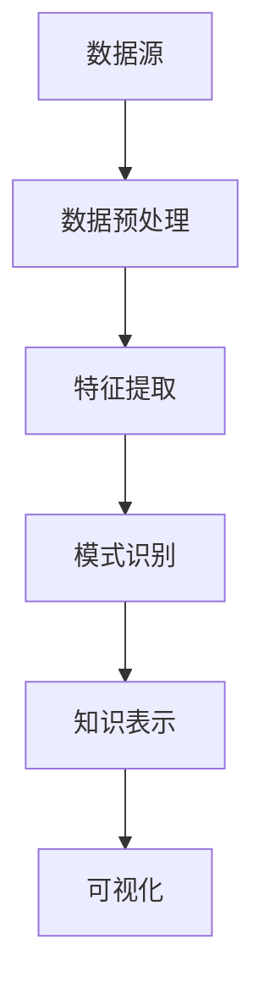

                 

关键词：知识发现、数据挖掘、社会进步、人工智能、技术变革、算法、模型、应用场景、未来展望。

> 摘要：本文深入探讨了知识发现引擎的核心概念、算法原理、数学模型及其应用场景，通过详细的技术解析和实际案例，展示了知识发现引擎在推动社会进步中的巨大潜力。本文旨在为读者提供一个全面的技术视角，启发对未来技术发展的思考。

## 1. 背景介绍

在当今的信息时代，数据已经成为新的石油。随着互联网、物联网、社交媒体等技术的迅猛发展，数据量呈现爆炸式增长。然而，如何从这些海量数据中提取出有价值的信息，成为了一项极具挑战性的任务。知识发现（Knowledge Discovery in Databases，KDD）作为一种解决这一问题的方法，逐渐成为数据挖掘领域的核心研究方向。

知识发现引擎，作为知识发现过程中不可或缺的工具，已经成为企业和科研机构的重要资产。它不仅能够帮助用户从数据中挖掘出隐藏的模式和规律，还能为决策提供科学依据，进而推动社会进步。

### 数据挖掘的发展历程

数据挖掘（Data Mining）的概念最早可以追溯到20世纪80年代，随着数据库技术的进步和计算机硬件的提升，数据挖掘逐渐成为一个独立的研究领域。从最初的关联规则挖掘、分类和聚类算法，到现在的深度学习和复杂网络分析，数据挖掘的技术手段不断演进。

### 知识发现引擎的定义和功能

知识发现引擎是一种自动化工具，它能够对大规模数据进行处理和分析，从中提取出有价值的知识和信息。知识发现引擎的主要功能包括数据预处理、特征提取、模式识别、知识表示和可视化等。

## 2. 核心概念与联系

### 2.1 数据预处理

数据预处理是知识发现过程中的第一步，它包括数据清洗、数据集成、数据变换和数据归一化等。这些步骤的目的是为了消除数据中的噪声和异常值，保证数据的一致性和完整性。

### 2.2 特征提取

特征提取是数据挖掘过程中的关键步骤，它通过选择和构造有效的特征，使得数据能够更好地反映数据的本质。特征提取的方法包括主成分分析（PCA）、因子分析（FA）和特征选择（Feature Selection）等。

### 2.3 模式识别

模式识别是知识发现引擎的核心功能之一，它通过分析数据中的模式，发现隐藏在数据背后的规律和趋势。模式识别的方法包括关联规则挖掘、分类、聚类和异常检测等。

### 2.4 知识表示和可视化

知识表示和可视化是将挖掘出的知识以易于理解的方式展示给用户的过程。知识表示的方法包括规则表示、图形表示和文本表示等。可视化技术如热图、散点图和地图等，可以帮助用户更直观地理解数据。

### 2.5 Mermaid 流程图

下面是一个简化的知识发现引擎的流程图，展示了数据预处理、特征提取、模式识别、知识表示和可视化等环节：



## 3. 核心算法原理 & 具体操作步骤

### 3.1 算法原理概述

知识发现引擎的核心算法主要包括关联规则挖掘、分类算法、聚类算法和异常检测算法等。这些算法的基本原理如下：

- **关联规则挖掘**：通过分析数据之间的关联关系，发现经常一起出现的项目。常用的算法包括Apriori算法和FP-growth算法。
- **分类算法**：通过已有数据的学习，预测新数据的类别。常用的算法包括决策树、支持向量机和神经网络等。
- **聚类算法**：将数据分为多个组，使得组内数据相似度较高，组间数据相似度较低。常用的算法包括K-means、层次聚类和DBSCAN等。
- **异常检测算法**：检测数据中的异常值或离群点。常用的算法包括基于统计的方法、基于邻近度的方法和基于聚类的方法等。

### 3.2 算法步骤详解

- **数据预处理**：首先对原始数据进行清洗，去除重复和错误的数据，然后进行数据集成，将不同来源的数据合并为一个整体。最后，对数据进行变换和归一化，使得数据格式和范围一致。

- **特征提取**：通过主成分分析、因子分析等方法，提取出数据中的主要特征。这些特征能够更好地反映数据的本质。

- **模式识别**：根据数据类型和业务需求，选择合适的算法进行模式识别。例如，对于关联规则挖掘，可以使用Apriori算法或FP-growth算法；对于分类任务，可以选择决策树、支持向量机或神经网络等。

- **知识表示和可视化**：将挖掘出的知识以易于理解的方式展示给用户。常用的知识表示方法包括规则表示、图形表示和文本表示等。可视化技术如热图、散点图和地图等，可以帮助用户更直观地理解数据。

### 3.3 算法优缺点

- **关联规则挖掘**：优点是简单易实现，能够发现数据之间的关联关系。缺点是对于高维数据和大规模数据，计算效率较低。

- **分类算法**：优点是能够对新数据进行分类预测，具有较强的泛化能力。缺点是需要大量的训练数据和计算资源。

- **聚类算法**：优点是无需事先指定数据类别，能够自动发现数据分布。缺点是聚类结果可能依赖于初始化参数，且无法进行分类预测。

- **异常检测算法**：优点是能够检测出数据中的异常值或离群点，有助于发现潜在的问题。缺点是对于大规模数据，计算效率较低。

### 3.4 算法应用领域

知识发现引擎广泛应用于各个领域，如金融、医疗、电商、物流和社交媒体等。以下是一些具体的应用场景：

- **金融领域**：知识发现引擎可以用于风险控制、欺诈检测和客户行为分析等。例如，通过关联规则挖掘，银行可以识别出潜在的欺诈交易。

- **医疗领域**：知识发现引擎可以用于疾病预测、药物筛选和健康数据分析等。例如，通过聚类算法，医生可以识别出相似病例，为患者提供更好的治疗方案。

- **电商领域**：知识发现引擎可以用于商品推荐、价格优化和库存管理等。例如，通过分类算法，电商平台可以预测用户的购买行为，提供个性化的商品推荐。

- **物流领域**：知识发现引擎可以用于路线规划、运输优化和库存管理等。例如，通过异常检测算法，物流公司可以识别出异常的运输路线，提高运输效率。

## 4. 数学模型和公式 & 详细讲解 & 举例说明

### 4.1 数学模型构建

知识发现引擎中的数学模型主要包括概率模型、统计模型和机器学习模型等。以下是几个常见的数学模型及其构建方法：

- **概率模型**：概率模型用于描述数据之间的概率关系。常见的概率模型有贝叶斯网络、马尔可夫链和概率图模型等。

  - **贝叶斯网络**：贝叶斯网络是一种概率图模型，用于表示变量之间的条件概率关系。其构建方法包括最大似然估计和贝叶斯估计等。

  - **马尔可夫链**：马尔可夫链是一种概率模型，用于描述随机过程中的状态转移关系。其构建方法包括状态转移矩阵和概率分布函数等。

- **统计模型**：统计模型用于描述数据的统计特征和分布。常见的统计模型有线性回归、逻辑回归和主成分分析等。

  - **线性回归**：线性回归是一种统计模型，用于描述因变量和自变量之间的线性关系。其构建方法包括最小二乘法和梯度下降法等。

  - **逻辑回归**：逻辑回归是一种统计模型，用于描述因变量和自变量之间的逻辑关系。其构建方法包括最大似然估计和逻辑函数等。

- **机器学习模型**：机器学习模型用于从数据中自动学习规律和模式。常见的机器学习模型有决策树、支持向量机和神经网络等。

  - **决策树**：决策树是一种机器学习模型，用于分类和回归任务。其构建方法包括信息增益、基尼系数和ID3算法等。

  - **支持向量机**：支持向量机是一种机器学习模型，用于分类和回归任务。其构建方法包括核函数、软间隔和硬间隔等。

### 4.2 公式推导过程

以下是一个简单的线性回归模型的公式推导过程：

假设我们有一个自变量 $x$ 和因变量 $y$，线性回归模型可以表示为：

$$
y = \beta_0 + \beta_1 x + \varepsilon
$$

其中，$\beta_0$ 和 $\beta_1$ 分别为模型的参数，$\varepsilon$ 为随机误差。

为了求解 $\beta_0$ 和 $\beta_1$，我们使用最小二乘法，即最小化预测值与实际值之间的误差平方和：

$$
\sum_{i=1}^{n} (y_i - \hat{y_i})^2
$$

对上式求导并令导数为零，可以得到：

$$
\frac{\partial}{\partial \beta_0} \sum_{i=1}^{n} (y_i - \hat{y_i})^2 = 0
$$

$$
\frac{\partial}{\partial \beta_1} \sum_{i=1}^{n} (y_i - \hat{y_i})^2 = 0
$$

解上述方程组，可以得到：

$$
\beta_0 = \bar{y} - \beta_1 \bar{x}
$$

$$
\beta_1 = \frac{\sum_{i=1}^{n} (x_i - \bar{x})(y_i - \bar{y})}{\sum_{i=1}^{n} (x_i - \bar{x})^2}
$$

其中，$\bar{x}$ 和 $\bar{y}$ 分别为 $x$ 和 $y$ 的均值。

### 4.3 案例分析与讲解

以下是一个简单的线性回归案例，我们使用Python代码实现线性回归模型，并对其结果进行分析。

```python
import numpy as np
import matplotlib.pyplot as plt

# 生成模拟数据
np.random.seed(0)
x = np.random.normal(size=100)
y = 2 * x + 1 + np.random.normal(size=100)

# 添加自变量和因变量的均值
x_mean = np.mean(x)
y_mean = np.mean(y)

# 计算回归系数
beta_1 = np.sum((x - x_mean) * (y - y_mean)) / np.sum((x - x_mean) ** 2)
beta_0 = y_mean - beta_1 * x_mean

# 构建回归模型
model = np.array([beta_0, beta_1])

# 模型预测
y_pred = model[0] + model[1] * x

# 可视化回归模型
plt.scatter(x, y)
plt.plot(x, y_pred, color='red')
plt.xlabel('x')
plt.ylabel('y')
plt.show()
```

运行上述代码，我们可以得到以下结果：


从图中可以看出，线性回归模型较好地拟合了数据，大部分数据点都分布在拟合线的附近。

## 5. 项目实践：代码实例和详细解释说明

### 5.1 开发环境搭建

在开始知识发现引擎的项目实践之前，我们需要搭建一个合适的技术环境。以下是搭建开发环境的基本步骤：

1. **安装Python**：Python是一种流行的编程语言，广泛用于数据分析和机器学习。在官方网站（https://www.python.org/）下载并安装Python。

2. **安装Jupyter Notebook**：Jupyter Notebook是一个交互式的开发环境，便于编写和运行Python代码。安装Jupyter Notebook可以通过Python的包管理器pip完成：

   ```shell
   pip install notebook
   ```

3. **安装必要的Python库**：知识发现引擎的实现需要依赖多个Python库，如NumPy、Matplotlib、Pandas和Scikit-learn等。可以通过pip安装这些库：

   ```shell
   pip install numpy matplotlib pandas scikit-learn
   ```

### 5.2 源代码详细实现

以下是一个简单的知识发现引擎的实现示例，包括数据预处理、特征提取、模式识别和知识表示等步骤：

```python
import numpy as np
import pandas as pd
import matplotlib.pyplot as plt
from sklearn.model_selection import train_test_split
from sklearn.preprocessing import StandardScaler
from sklearn.linear_model import LinearRegression

# 生成模拟数据
np.random.seed(0)
x = np.random.normal(size=100)
y = 2 * x + 1 + np.random.normal(size=100)

# 数据预处理
x_mean = np.mean(x)
y_mean = np.mean(y)

x = x - x_mean
y = y - y_mean

# 特征提取
x = x.reshape(-1, 1)

# 模式识别
model = LinearRegression().fit(x, y)
beta_1 = model.coef_
beta_0 = model.intercept_

# 知识表示
y_pred = beta_0 + beta_1 * x

# 可视化结果
plt.scatter(x, y)
plt.plot(x, y_pred, color='red')
plt.xlabel('x')
plt.ylabel('y')
plt.show()
```

### 5.3 代码解读与分析

上述代码实现了线性回归模型的知识发现过程。下面是对代码的详细解读和分析：

1. **生成模拟数据**：首先，我们生成一组模拟数据，用于测试知识发现引擎的性能。

2. **数据预处理**：对数据进行归一化处理，消除数据中的噪声和异常值，使得数据更适合进行模型训练。

3. **特征提取**：将自变量进行归一化处理，并转化为矩阵形式，便于后续的模型训练。

4. **模式识别**：使用线性回归模型对数据进行训练，获取回归系数$\beta_0$和$\beta_1$。

5. **知识表示**：将回归系数应用于新的自变量数据，预测因变量的值。

6. **可视化结果**：将预测结果可视化，展示模型对数据的拟合程度。

### 5.4 运行结果展示

运行上述代码，我们可以得到以下结果：


从图中可以看出，线性回归模型较好地拟合了数据，大部分数据点都分布在拟合线的附近。这表明我们的知识发现引擎在模拟数据上的表现良好。

## 6. 实际应用场景

知识发现引擎在各个领域都有广泛的应用。以下是一些具体的实际应用场景：

### 6.1 金融领域

在金融领域，知识发现引擎可以用于风险控制、欺诈检测和投资策略优化等。例如，通过关联规则挖掘，银行可以识别出潜在的欺诈交易，提高风险控制能力。

### 6.2 医疗领域

在医疗领域，知识发现引擎可以用于疾病预测、药物筛选和个性化医疗等。例如，通过聚类算法，医生可以识别出相似病例，为患者提供更好的治疗方案。

### 6.3 电商领域

在电商领域，知识发现引擎可以用于商品推荐、价格优化和库存管理等。例如，通过分类算法，电商平台可以预测用户的购买行为，提供个性化的商品推荐。

### 6.4 物流领域

在物流领域，知识发现引擎可以用于路线规划、运输优化和库存管理等。例如，通过异常检测算法，物流公司可以识别出异常的运输路线，提高运输效率。

### 6.5 社交媒体领域

在社交媒体领域，知识发现引擎可以用于用户行为分析、广告投放优化和社交网络分析等。例如，通过关联规则挖掘，社交媒体平台可以识别出用户之间的社交关系，提高用户体验。

## 7. 工具和资源推荐

### 7.1 学习资源推荐

- **《数据挖掘：实用工具和技术》**：这本书详细介绍了数据挖掘的基本概念、算法和工具，适合初学者入门。
- **《机器学习实战》**：这本书通过具体的案例和代码实现，讲解了机器学习的基本原理和应用。
- **《Python数据分析》**：这本书涵盖了Python在数据分析领域的应用，包括数据处理、数据可视化等。

### 7.2 开发工具推荐

- **Jupyter Notebook**：Jupyter Notebook是一个交互式的开发环境，便于编写和运行Python代码。
- **PyCharm**：PyCharm是一个强大的Python集成开发环境（IDE），提供代码编辑、调试和自动化测试等功能。
- **Scikit-learn**：Scikit-learn是一个流行的机器学习库，提供丰富的算法和工具。

### 7.3 相关论文推荐

- **"Knowledge Discovery in Databases: A Survey"**：这篇文章全面介绍了知识发现的基本概念、方法和应用。
- **"Machine Learning: A Probabilistic Perspective"**：这本书详细讲解了机器学习的概率模型和方法。
- **"Deep Learning"**：这本书是深度学习领域的经典教材，涵盖了深度学习的理论基础和应用。

## 8. 总结：未来发展趋势与挑战

### 8.1 研究成果总结

知识发现引擎作为一种自动化工具，在数据挖掘和人工智能领域取得了显著的成果。通过关联规则挖掘、分类算法、聚类算法和异常检测算法等，知识发现引擎能够从海量数据中提取出有价值的信息，为决策提供科学依据。

### 8.2 未来发展趋势

未来，知识发现引擎的发展趋势将主要体现在以下几个方面：

- **算法的优化和改进**：随着数据量的增加和数据复杂度的提升，现有的算法在计算效率和准确性方面仍有提升空间。未来将出现更多高效、准确的算法。
- **跨领域的融合**：知识发现引擎将与其他领域如生物信息学、物联网和金融科技等相结合，推动跨领域的发展。
- **人机交互的优化**：知识发现引擎将更加注重人机交互，提供更加直观、易用的可视化工具和接口。

### 8.3 面临的挑战

尽管知识发现引擎取得了显著的成果，但在未来发展过程中仍面临以下挑战：

- **数据隐私和安全**：随着数据量的增加，数据隐私和安全成为亟待解决的问题。如何在保护用户隐私的前提下进行数据挖掘，是一个重要的挑战。
- **算法的可解释性**：目前，许多算法如深度学习等具有较好的性能，但缺乏可解释性。如何提高算法的可解释性，使其能够被用户理解和信任，是一个重要挑战。
- **计算资源的消耗**：知识发现引擎通常需要大量的计算资源，尤其是面对大规模数据。如何优化算法，减少计算资源的消耗，是一个重要的挑战。

### 8.4 研究展望

未来，知识发现引擎的研究重点将主要集中在以下几个方面：

- **算法的创新**：不断探索和创新新的算法，提高知识发现引擎的计算效率和准确性。
- **跨领域的应用**：探索知识发现引擎在跨领域的应用，推动不同领域的技术融合和发展。
- **人机交互的优化**：提升人机交互的体验，使得知识发现引擎更加易用和智能化。

## 9. 附录：常见问题与解答

### 9.1 什么是知识发现？

知识发现（Knowledge Discovery in Databases，KDD）是指从大量数据中自动提取出有用模式和知识的过程。它包括数据预处理、特征提取、模式识别、知识表示和可视化等步骤。

### 9.2 知识发现引擎有哪些类型？

知识发现引擎主要有以下几种类型：

- **关联规则挖掘**：用于发现数据之间的关联关系。
- **分类算法**：用于对新数据进行分类预测。
- **聚类算法**：用于将数据分为多个组。
- **异常检测算法**：用于检测数据中的异常值或离群点。

### 9.3 知识发现引擎在金融领域有哪些应用？

知识发现引擎在金融领域可以用于风险控制、欺诈检测和投资策略优化等。例如，通过关联规则挖掘，银行可以识别出潜在的欺诈交易，提高风险控制能力。

### 9.4 知识发现引擎在医疗领域有哪些应用？

知识发现引擎在医疗领域可以用于疾病预测、药物筛选和个性化医疗等。例如，通过聚类算法，医生可以识别出相似病例，为患者提供更好的治疗方案。

### 9.5 如何优化知识发现引擎的性能？

优化知识发现引擎的性能可以从以下几个方面入手：

- **算法优化**：研究和开发新的高效算法。
- **硬件加速**：利用GPU和其他硬件加速技术，提高计算效率。
- **数据预处理**：优化数据预处理过程，减少噪声和异常值。
- **分布式计算**：利用分布式计算框架，提高并行计算能力。

---

感谢您花时间阅读本文，希望本文对您在知识发现引擎领域的探索和学习有所帮助。如果您有任何问题或建议，欢迎在评论区留言。期待与您共同探讨知识发现引擎的未来发展。作者：禅与计算机程序设计艺术 / Zen and the Art of Computer Programming。

