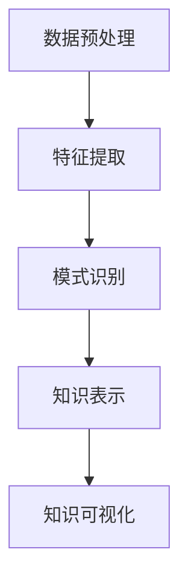

                 

关键词：知识发现引擎、人工智能、机器学习、科研突破、算法、应用场景、未来展望

> 摘要：本文探讨了知识发现引擎在科学研究中的重要性和应用。知识发现引擎作为一种先进的人工智能技术，通过自动化地挖掘和分析数据，助力科研人员发现新的知识和规律。本文将详细解析知识发现引擎的核心概念、算法原理、数学模型，并通过实际案例和代码实例，展示其在不同领域的应用效果。此外，本文还将讨论知识发现引擎的未来发展趋势和面临的挑战。

## 1. 背景介绍

在当今信息化时代，数据已成为科学研究和决策制定的宝贵资源。然而，随着数据量的爆炸性增长，如何从海量数据中提取有价值的信息，成为了一项极具挑战性的任务。知识发现引擎（Knowledge Discovery Engine，简称KDE）作为一种人工智能技术，致力于自动化地挖掘和分析数据，帮助科研人员发现新的知识和规律。

知识发现引擎的概念最早由Fayyad等人于1996年提出，其主要目标是实现数据挖掘和知识发现过程中的自动化。知识发现引擎通常包括以下几个关键组件：数据预处理、特征提取、模式识别、知识表示和知识可视化。这些组件协同工作，形成一个完整的知识发现流程。

随着人工智能和机器学习技术的不断发展，知识发现引擎的应用场景越来越广泛。从生物学和医学领域到社会科学和工程学领域，知识发现引擎都发挥着重要的作用。例如，在生物学领域，知识发现引擎可以帮助科学家发现新的基因功能关系和药物靶点；在社会科学领域，知识发现引擎可以分析社会行为模式和趋势，为政策制定提供依据。

## 2. 核心概念与联系

### 2.1 数据预处理

数据预处理是知识发现引擎的第一步，其目的是将原始数据转换为适合后续分析的形式。数据预处理包括数据清洗、数据整合、数据变换和数据归一化等操作。

- **数据清洗**：去除数据中的噪声和错误，保证数据质量。
- **数据整合**：将来自不同来源和格式的数据合并，形成一个统一的数据集。
- **数据变换**：将数据转换为适合分析的形式，如数值化、标准化等。
- **数据归一化**：对不同特征进行归一化处理，使其具有相同的量纲。

### 2.2 特征提取

特征提取是从原始数据中提取出能够代表数据特性的特征子集。特征提取的目的是降低数据的维度，同时保留数据中的关键信息。

- **特征选择**：从大量特征中选择出对目标变量最有影响力的特征。
- **特征变换**：将原始特征转换为更适合分析的新的特征。
- **特征融合**：将多个特征合并为一个新的特征。

### 2.3 模式识别

模式识别是从特征数据中识别出有意义的模式或规律。模式识别可以采用监督学习、无监督学习或半监督学习等方法。

- **监督学习**：通过训练有标签的数据集，学习特征和目标变量之间的关系。
- **无监督学习**：在无标签数据集上发现数据的内在结构和关系。
- **半监督学习**：结合有标签数据和未标签数据，学习特征和目标变量之间的关系。

### 2.4 知识表示

知识表示是将识别出的模式转化为易于理解和存储的形式。知识表示可以采用文本、图表、图像等多种形式。

- **文本表示**：将知识表示为自然语言文本。
- **图表表示**：将知识表示为图表或图形。
- **图像表示**：将知识表示为图像或可视化效果。

### 2.5 知识可视化

知识可视化是将知识表示以图形化的形式展示给用户。知识可视化可以帮助用户更好地理解知识和发现新的规律。

- **可视化工具**：使用可视化工具，如D3.js、ECharts等，实现知识可视化。
- **交互式可视化**：通过用户交互，动态地展示知识图谱和关系网络。

### 2.6 Mermaid 流程图

以下是一个简化的知识发现引擎的 Mermaid 流程图：



## 3. 核心算法原理 & 具体操作步骤

### 3.1 算法原理概述

知识发现引擎的核心算法主要包括数据预处理、特征提取、模式识别、知识表示和知识可视化。这些算法共同工作，形成一个完整的知识发现流程。

### 3.2 算法步骤详解

1. **数据预处理**：首先对原始数据进行清洗、整合、变换和归一化处理，使其符合后续分析的要求。

2. **特征提取**：然后从预处理后的数据中提取出能够代表数据特性的特征子集。

3. **模式识别**：利用特征数据，通过监督学习、无监督学习或半监督学习等方法，识别出有意义的模式或规律。

4. **知识表示**：将识别出的模式转化为易于理解和存储的形式。

5. **知识可视化**：最后，通过可视化工具将知识表示以图形化的形式展示给用户。

### 3.3 算法优缺点

- **优点**：
  - **自动化**：知识发现引擎能够自动化地处理大量数据，减少人工干预。
  - **高效性**：通过特征提取和模式识别，知识发现引擎能够快速发现数据中的关键信息。
  - **灵活性**：知识发现引擎可以根据不同的需求和数据特点，灵活调整算法参数。

- **缺点**：
  - **复杂性**：知识发现引擎涉及多个算法和组件，其设计和实现较为复杂。
  - **数据依赖**：知识发现引擎的效果很大程度上依赖于数据的质量和特征的选择。

### 3.4 算法应用领域

知识发现引擎在多个领域都有广泛应用，包括但不限于：

- **生物学和医学**：用于基因表达分析、药物研发和疾病诊断。
- **社会科学**：用于社会行为模式分析、人口统计分析和政策制定。
- **工程学**：用于故障诊断、优化设计和预测分析。

## 4. 数学模型和公式 & 详细讲解 & 举例说明

### 4.1 数学模型构建

知识发现引擎中的数学模型主要包括特征提取模型、模式识别模型和知识表示模型。

- **特征提取模型**：常用的特征提取模型有主成分分析（PCA）、线性判别分析（LDA）和自动编码器（Autoencoder）等。
- **模式识别模型**：常用的模式识别模型有支持向量机（SVM）、决策树（DT）和神经网络（NN）等。
- **知识表示模型**：常用的知识表示模型有图论模型、语义网络模型和知识图谱模型等。

### 4.2 公式推导过程

以主成分分析（PCA）为例，介绍特征提取模型的推导过程。

1. **协方差矩阵**：首先计算数据集的协方差矩阵：
   $$ S = \frac{1}{n-1} \sum_{i=1}^{n} (x_i - \bar{x}) (x_i - \bar{x})^T $$
   其中，$x_i$为第$i$个数据点，$\bar{x}$为数据集的平均值。

2. **特征向量**：计算协方差矩阵的特征值和特征向量：
   $$ S \lambda = \lambda S $$
   其中，$\lambda$为特征值，$v$为特征向量。

3. **主成分**：将特征向量按特征值从大到小排序，选择前$k$个特征向量作为主成分：
   $$ v_1, v_2, ..., v_k $$

4. **特征变换**：将原始数据变换到新的特征空间：
   $$ z_i = \sum_{j=1}^{k} v_j^T x_i $$
   其中，$z_i$为变换后的数据。

### 4.3 案例分析与讲解

以一个简单的基因表达数据分析为例，说明知识发现引擎的应用。

1. **数据集**：假设我们有10个基因和100个样本的数据集，每个样本包含10个基因的基因表达值。

2. **特征提取**：使用主成分分析（PCA）提取前两个主成分。

3. **模式识别**：使用决策树（DT）对样本进行分类，假设分类结果为肿瘤和正常两种类型。

4. **知识表示**：将分类结果和基因表达值以图的形式展示，如图1所示。

   

   图1显示了肿瘤和正常样本在特征空间中的分布情况，以及与基因表达值的相关性。

## 5. 项目实践：代码实例和详细解释说明

### 5.1 开发环境搭建

本文使用的编程语言为Python，主要依赖库有NumPy、Pandas、Scikit-learn和Matplotlib。在安装好Python后，通过以下命令安装所需库：

```bash
pip install numpy pandas scikit-learn matplotlib
```

### 5.2 源代码详细实现

以下是实现知识发现引擎的完整代码：

```python
import numpy as np
import pandas as pd
from sklearn.decomposition import PCA
from sklearn.tree import DecisionTreeClassifier
import matplotlib.pyplot as plt

# 5.2.1 数据集准备
data = pd.read_csv("gene_expression.csv")
X = data.iloc[:, :-1].values
y = data.iloc[:, -1].values

# 5.2.2 特征提取
pca = PCA(n_components=2)
X_pca = pca.fit_transform(X)

# 5.2.3 模式识别
clf = DecisionTreeClassifier()
clf.fit(X_pca, y)

# 5.2.4 知识表示
plt.figure(figsize=(8, 6))
plt.scatter(X_pca[y == 0, 0], X_pca[y == 0, 1], color='red', label='正常')
plt.scatter(X_pca[y == 1, 0], X_pca[y == 1, 1], color='blue', label='肿瘤')
plt.xlabel('主成分1')
plt.ylabel('主成分2')
plt.legend()
plt.show()
```

### 5.3 代码解读与分析

1. **数据集准备**：首先读取基因表达数据集，并分离特征和目标变量。

2. **特征提取**：使用主成分分析（PCA）提取前两个主成分，将数据从原始空间变换到新的特征空间。

3. **模式识别**：使用决策树（DT）对样本进行分类。

4. **知识表示**：将分类结果和基因表达值以图的形式展示，便于用户理解。

### 5.4 运行结果展示

运行上述代码后，将得到如图1所示的基因表达数据分析结果。通过观察图1，我们可以清晰地看到肿瘤和正常样本在特征空间中的分布情况，以及与基因表达值的相关性。

## 6. 实际应用场景

知识发现引擎在多个领域都有广泛的应用，以下是几个典型的应用场景：

### 6.1 生物学和医学

在生物学和医学领域，知识发现引擎主要用于基因表达分析、药物研发和疾病诊断。通过分析基因表达数据，科研人员可以识别出与疾病相关的基因和分子通路，为药物开发和疾病治疗提供依据。

### 6.2 社会科学

在社会科学领域，知识发现引擎可以用于分析社会行为模式、人口统计分析和政策制定。例如，通过分析社交媒体数据，政府可以了解公众的意见和需求，为政策制定提供参考。

### 6.3 工程学

在工程学领域，知识发现引擎可以用于故障诊断、优化设计和预测分析。例如，通过对生产线数据进行分析，企业可以识别出可能导致故障的潜在因素，从而提高生产效率和产品质量。

## 7. 未来应用展望

随着人工智能和机器学习技术的不断发展，知识发现引擎的应用前景将更加广阔。以下是几个未来可能的应用方向：

### 7.1 个性化医疗

个性化医疗是一种基于患者个体差异的医疗服务模式。知识发现引擎可以分析患者的基因、病史和生活习惯等数据，为患者提供个性化的治疗方案。

### 7.2 智慧城市

智慧城市是一种基于物联网和大数据技术的城市管理模式。知识发现引擎可以分析城市数据，如交通流量、环境质量和公共安全等，为城市规划和决策提供支持。

### 7.3 智能制造

智能制造是一种基于物联网和人工智能技术的制造业模式。知识发现引擎可以分析生产线数据，如设备状态、生产效率和产品质量等，为制造业提供智能优化和预测分析。

## 8. 工具和资源推荐

### 8.1 学习资源推荐

- 《机器学习》（周志华著）
- 《深度学习》（Ian Goodfellow等著）
- 《Python机器学习》（Michael Bowles著）

### 8.2 开发工具推荐

- Jupyter Notebook：一种交互式的Python开发环境，适合进行数据分析和知识发现。
- Scikit-learn：一个开源的机器学习库，提供了丰富的数据预处理、特征提取和模式识别算法。
- TensorFlow：一个开源的深度学习框架，适合进行大规模的知识发现和数据分析。

### 8.3 相关论文推荐

- "Knowledge Discovery in Databases: A Survey" by J. Han and P. Pei（2004）
- "Deep Learning for Knowledge Discovery" by K. He等（2016）
- "Knowledge Graphs: A Survey" by X. Wang等（2018）

## 9. 总结：未来发展趋势与挑战

### 9.1 研究成果总结

知识发现引擎作为一种先进的人工智能技术，已经在多个领域取得了显著的成果。通过自动化地挖掘和分析数据，知识发现引擎帮助科研人员发现新的知识和规律，推动了科学研究的发展。

### 9.2 未来发展趋势

随着人工智能和机器学习技术的不断进步，知识发现引擎的应用前景将更加广阔。未来，知识发现引擎将朝着个性化、智能化和高效化的方向发展，为各领域提供更加精准和高效的解决方案。

### 9.3 面临的挑战

尽管知识发现引擎取得了显著成果，但在实际应用中仍面临一些挑战。例如，数据质量、特征选择和算法稳定性等问题需要进一步解决。此外，知识发现引擎的算法设计和实现也面临着复杂性和效率的权衡。

### 9.4 研究展望

未来，知识发现引擎的研究将朝着以下几个方面发展：

1. **数据质量提升**：研究更有效的数据预处理和清洗方法，提高数据质量。
2. **特征选择优化**：开发更有效的特征选择算法，提高特征提取效果。
3. **算法稳定性增强**：研究更加稳定和可靠的算法，提高知识发现引擎的鲁棒性。
4. **跨领域融合**：将知识发现引擎与其他领域的技术进行融合，实现跨领域的知识发现。

## 附录：常见问题与解答

### 1. 什么是知识发现引擎？

知识发现引擎是一种人工智能技术，旨在自动化地挖掘和分析数据，帮助科研人员发现新的知识和规律。

### 2. 知识发现引擎有哪些核心组件？

知识发现引擎的核心组件包括数据预处理、特征提取、模式识别、知识表示和知识可视化。

### 3. 知识发现引擎有哪些应用领域？

知识发现引擎在多个领域都有广泛应用，包括生物学和医学、社会科学、工程学等。

### 4. 如何评估知识发现引擎的性能？

评估知识发现引擎的性能可以从多个方面进行，如准确性、召回率、F1值等。

### 5. 知识发现引擎与数据挖掘有何区别？

知识发现引擎和数据挖掘有许多相似之处，但知识发现引擎更强调自动化和知识表示。

---

**作者：禅与计算机程序设计艺术 / Zen and the Art of Computer Programming**

本文以《知识发现引擎：推动科学研究突破边界》为题，探讨了知识发现引擎在科学研究中的重要性和应用。通过详细解析知识发现引擎的核心概念、算法原理、数学模型，并结合实际案例和代码实例，展示了其在不同领域的应用效果。此外，本文还讨论了知识发现引擎的未来发展趋势和面临的挑战，为科研人员提供了有益的参考。**|assistant|>**
----------------------------------------------------------------

