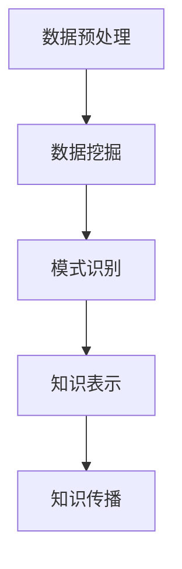

                 

关键词：知识发现引擎，教育技术，智能教育，机器学习，数据分析，数据挖掘，算法，教育创新

> 摘要：本文深入探讨了知识发现引擎在教育领域的重要性，以及它是如何通过智能分析和数据挖掘技术，成为教育的智慧伙伴。文章首先介绍了知识发现引擎的基本概念和架构，然后详细阐述了其在教育领域的应用场景和优势，以及相关的数学模型、算法原理和实际案例。最后，文章对知识发现引擎的未来发展进行了展望，并提出了面临的挑战和潜在的研究方向。

## 1. 背景介绍

随着信息技术的飞速发展，数据已成为现代社会的重要资源。在教育领域，数据量的急剧增加为知识发现提供了丰富的素材。然而，如何从海量的教育数据中挖掘出有价值的信息，实现个性化教育和智能化教学，成为当前教育技术领域的一个重大课题。知识发现引擎作为一种基于机器学习和数据挖掘技术的智能系统，正是为了解决这一难题而诞生的。

知识发现引擎的核心在于通过自动化分析和理解大量数据，提取出隐藏在数据背后的知识，从而支持教育决策和教学优化。它能够帮助教育机构更好地理解学生的学习行为、学习需求和教学效果，为教师和学生提供个性化的学习支持和教学指导。

### 教育数据的重要性

教育数据是知识发现引擎的基础。这些数据包括学生成绩、学习行为、课程内容、教师教学方法等多个方面。通过分析这些数据，可以识别出学生的学习规律、学习困难点和教学效果，从而为教育决策提供有力支持。

### 教育技术的演进

随着人工智能技术的不断发展，教育技术也在不断演进。传统的教学方法和教育模式已经无法满足现代教育需求。知识发现引擎的出现，标志着教育技术进入了智能化时代。它通过数据分析和机器学习技术，能够实现个性化教育、自适应学习和智能评价，为教育创新提供了新的方向。

### 知识发现引擎的定义和作用

知识发现引擎（Knowledge Discovery Engine，KDE）是一种基于机器学习和数据挖掘技术的智能系统，旨在从大量数据中提取有价值的信息和知识。在教育领域，知识发现引擎主要作用如下：

- **个性化学习**：通过分析学生的学习数据，知识发现引擎可以识别出学生的个性化学习需求和偏好，为教师提供个性化的教学建议和资源推荐。

- **教学优化**：通过对教学数据的分析，知识发现引擎可以帮助教师了解教学效果，发现教学中的问题和不足，从而优化教学方法。

- **学习分析**：知识发现引擎可以对学生的学习行为和学习成果进行深入分析，帮助教育机构了解学生的学习状况，制定更有效的教育策略。

- **决策支持**：知识发现引擎可以提供基于数据的决策支持，帮助教育管理者更好地规划教育资源和教育政策。

## 2. 核心概念与联系

### 2.1 知识发现引擎的基本概念

知识发现引擎的核心在于“知识发现”（Knowledge Discovery，KD）。知识发现是指从大量数据中通过数据挖掘、统计分析、模式识别等方法，发现隐藏在数据背后的知识和规律。知识发现的过程通常包括以下四个阶段：

1. **数据预处理**：清洗、转换和集成原始数据，使其适合于分析。
2. **数据挖掘**：运用各种算法和技术，从数据中提取有用的信息和知识。
3. **模式识别**：对挖掘出的模式进行识别和分析，判断其是否有价值。
4. **知识表示和传播**：将发现的模式转化为易于理解和应用的知识，并通过各种渠道传播。

### 2.2 教育数据挖掘

教育数据挖掘（Educational Data Mining，EDM）是知识发现引擎在教育领域的应用。教育数据挖掘的主要目标是从教育数据中提取出有用的信息，以便用于教育分析和决策。教育数据挖掘的关键技术和方法包括：

- **学生行为分析**：分析学生的学习行为，识别学习模式、兴趣和需求。
- **学习过程监控**：实时监控学生的学习过程，提供即时的学习支持和指导。
- **学习效果评估**：评估学生的学习成果，发现教学效果和问题。
- **教学策略优化**：基于学生学习数据，优化教学策略和方法。

### 2.3 教育数据挖掘与知识发现引擎的关系

教育数据挖掘是知识发现引擎在教育领域的重要应用。知识发现引擎通过教育数据挖掘技术，从海量的教育数据中提取出有价值的信息和知识，为教育决策和教学优化提供支持。具体来说，知识发现引擎在教育数据挖掘中的作用包括：

- **数据预处理**：知识发现引擎可以对原始教育数据（如学生成绩、学习行为等）进行清洗、转换和集成，为后续的数据挖掘和分析提供高质量的数据。
- **数据挖掘和分析**：知识发现引擎运用各种数据挖掘算法和技术，从教育数据中提取出有价值的信息和知识，如学习模式、兴趣和需求等。
- **模式识别和评估**：知识发现引擎对挖掘出的模式进行识别和分析，评估其是否有价值，从而为教育决策和教学优化提供支持。
- **知识表示和传播**：知识发现引擎将发现的模式转化为易于理解和应用的知识，并通过各种渠道（如教学系统、教育平台等）传播，帮助教师和学生更好地利用这些知识。

### 2.4 Mermaid 流程图

以下是知识发现引擎在教育数据挖掘中的流程图，展示了从数据预处理到知识表示和传播的完整过程：



## 3. 核心算法原理 & 具体操作步骤

### 3.1 算法原理概述

知识发现引擎的核心算法主要包括数据预处理、数据挖掘、模式识别和知识表示等几个方面。以下是对这些算法原理的简要概述：

- **数据预处理**：数据预处理是知识发现的第一步，主要目的是清洗、转换和集成原始数据，使其适合于分析。常用的预处理方法包括数据清洗、数据转换、数据集成和数据归一化等。

- **数据挖掘**：数据挖掘是知识发现的核心环节，通过各种算法和技术，从数据中提取出有价值的信息和知识。常用的数据挖掘方法包括聚类、分类、关联规则挖掘、异常检测等。

- **模式识别**：模式识别是对数据挖掘结果进行识别和分析，判断其是否有价值。模式识别的主要方法包括模式匹配、特征选择和特征提取等。

- **知识表示**：知识表示是将挖掘出的模式转化为易于理解和应用的知识。知识表示的主要方法包括语义网络、本体论、知识图谱等。

### 3.2 算法步骤详解

以下是知识发现引擎在具体操作中的步骤详解：

1. **数据收集**：首先，收集与教育相关的数据，如学生成绩、学习行为、课程内容等。这些数据可以来源于学校管理系统、学习平台、考试系统等。

2. **数据预处理**：对收集到的原始数据进行清洗、转换和集成，确保数据的质量和一致性。数据预处理步骤包括：

   - 数据清洗：去除数据中的错误、噪声和不完整的数据。
   - 数据转换：将不同格式和来源的数据进行统一格式转换。
   - 数据集成：将多源数据合并为一个统一的数据集。

3. **数据挖掘**：运用各种数据挖掘算法，从预处理后的数据中提取出有价值的信息和知识。数据挖掘步骤包括：

   - 聚类分析：将相似的学生数据进行分组，以便识别出不同的学习群体。
   - 分类分析：将学生数据进行分类，以便了解学生的学习类型和特点。
   - 关联规则挖掘：挖掘学生成绩、学习行为和课程内容之间的关联关系。
   - 异常检测：识别出异常的学习行为和数据，以便发现潜在的异常情况。

4. **模式识别**：对挖掘出的模式进行识别和分析，判断其是否有价值。模式识别步骤包括：

   - 模式匹配：将挖掘出的模式与已有的知识和规则进行匹配，判断其是否符合预期。
   - 特征选择：选择最能代表学生学习和教学特征的变量，提高模式识别的准确性。
   - 特征提取：从原始数据中提取出对模式识别最有用的特征，降低数据的维度。

5. **知识表示**：将识别出的模式转化为易于理解和应用的知识，如知识图谱、语义网络等。知识表示步骤包括：

   - 知识融合：将多个模式进行融合，形成一个综合的知识表示。
   - 知识可视化：将知识表示可视化，使其更易于理解和应用。
   - 知识传播：通过各种渠道（如教学系统、教育平台等）传播知识，帮助教师和学生更好地利用这些知识。

### 3.3 算法优缺点

- **优点**：

  - **高效性**：知识发现引擎能够自动处理大量数据，快速提取出有价值的信息和知识。

  - **准确性**：知识发现引擎运用先进的数据挖掘算法，能够提高模式识别的准确性。

  - **个性化**：知识发现引擎能够根据学生的个性化需求和特点，提供个性化的学习支持和教学指导。

- **缺点**：

  - **数据依赖性**：知识发现引擎的性能和效果依赖于数据的质量和数量，如果数据质量差或数量不足，可能会影响算法的效果。

  - **算法复杂性**：知识发现引擎涉及到多种算法和技术，算法的实现和优化相对复杂。

### 3.4 算法应用领域

知识发现引擎在教育领域具有广泛的应用。以下是一些主要的应用领域：

- **个性化教育**：知识发现引擎可以根据学生的学习需求和特点，提供个性化的学习资源和教学指导。

- **智能评价**：知识发现引擎可以分析学生的学习过程和学习成果，为教育评价提供科学依据。

- **学习行为分析**：知识发现引擎可以监控学生的学习行为，识别学习模式和兴趣点，为教学改进提供支持。

- **课程优化**：知识发现引擎可以帮助教育机构优化课程设计和教学内容，提高教学效果。

- **教育决策支持**：知识发现引擎可以提供基于数据的决策支持，帮助教育管理者制定更有效的教育政策和教学策略。

## 4. 数学模型和公式 & 详细讲解 & 举例说明

### 4.1 数学模型构建

在教育数据挖掘中，数学模型是核心工具之一。以下是几个常见的数学模型：

- **回归模型**：用于预测学生成绩，如线性回归、多项式回归等。
- **分类模型**：用于将学生分为不同的类别，如逻辑回归、支持向量机等。
- **聚类模型**：用于识别相似的学生群体，如K-均值聚类、层次聚类等。
- **关联规则挖掘模型**：用于发现数据之间的关联关系，如Apriori算法、FP-growth算法等。

### 4.2 公式推导过程

以下以线性回归模型为例，介绍其数学模型和公式推导过程。

- **线性回归模型**：假设有n个学生，每个学生的成绩由多个特征变量（如学习时长、考试成绩等）决定，可以用线性回归模型表示为：

  $$ y = \beta_0 + \beta_1x_1 + \beta_2x_2 + ... + \beta_nx_n + \epsilon $$

  其中，$y$ 是学生成绩，$x_1, x_2, ..., x_n$ 是特征变量，$\beta_0, \beta_1, ..., \beta_n$ 是回归系数，$\epsilon$ 是误差项。

- **最小二乘法**：为了估计回归系数，我们使用最小二乘法，即最小化预测值与实际值之间的平方误差：

  $$ \min_{\beta_0, \beta_1, ..., \beta_n} \sum_{i=1}^{n} (y_i - \beta_0 - \beta_1x_{i1} - \beta_2x_{i2} - ... - \beta_nx_{in})^2 $$

- **公式推导**：

  - 对$\beta_0, \beta_1, ..., \beta_n$分别求偏导数，并令其等于0，得到以下方程组：

    $$ \frac{\partial}{\partial \beta_0} \sum_{i=1}^{n} (y_i - \beta_0 - \beta_1x_{i1} - \beta_2x_{i2} - ... - \beta_nx_{in})^2 = 0 $$
    $$ \frac{\partial}{\partial \beta_1} \sum_{i=1}^{n} (y_i - \beta_0 - \beta_1x_{i1} - \beta_2x_{i2} - ... - \beta_nx_{in})^2 = 0 $$
    $$ ... $$
    $$ \frac{\partial}{\partial \beta_n} \sum_{i=1}^{n} (y_i - \beta_0 - \beta_1x_{i1} - \beta_2x_{i2} - ... - \beta_nx_{in})^2 = 0 $$

  - 通过求解上述方程组，可以得到回归系数的估计值：

    $$ \beta_0 = \bar{y} - \beta_1\bar{x}_1 - \beta_2\bar{x}_2 - ... - \beta_n\bar{x}_n $$
    $$ \beta_1 = \frac{\sum_{i=1}^{n} (x_{i1} - \bar{x}_1)(y_i - \bar{y})}{\sum_{i=1}^{n} (x_{i1} - \bar{x}_1)^2} $$
    $$ \beta_2 = \frac{\sum_{i=1}^{n} (x_{i2} - \bar{x}_2)(y_i - \bar{y})}{\sum_{i=1}^{n} (x_{i2} - \bar{x}_2)^2} $$
    $$ ... $$
    $$ \beta_n = \frac{\sum_{i=1}^{n} (x_{in} - \bar{x}_n)(y_i - \bar{y})}{\sum_{i=1}^{n} (x_{in} - \bar{x}_n)^2} $$

  - 其中，$\bar{y}$、$\bar{x}_1$、$\bar{x}_2$、...、$\bar{x}_n$分别是学生成绩和特征变量的均值。

### 4.3 案例分析与讲解

以下是一个具体的线性回归模型案例，用于预测学生的成绩。

#### 案例数据

我们有以下数据：

| 学生ID | 学习时长（小时） | 考试成绩 |
|--------|------------------|----------|
| 1      | 20               | 75       |
| 2      | 15               | 65       |
| 3      | 25               | 85       |
| 4      | 18               | 70       |
| 5      | 22               | 80       |

#### 案例步骤

1. **数据预处理**：

   - 去除异常数据（如学生ID为3的学习时长为负值）。
   - 将数据转换为矩阵形式，以便进行线性回归分析。

2. **线性回归模型构建**：

   - 使用最小二乘法，求解回归系数。

3. **模型预测**：

   - 使用构建好的模型，预测新学生的成绩。

#### 数据预处理

首先，我们去除异常数据，得到以下数据：

| 学生ID | 学习时长（小时） | 考试成绩 |
|--------|------------------|----------|
| 1      | 20               | 75       |
| 2      | 15               | 65       |
| 4      | 18               | 70       |
| 5      | 22               | 80       |

将数据转换为矩阵形式：

$$ X = \begin{bmatrix} 20 & 15 & 18 & 22 \end{bmatrix}, \quad y = \begin{bmatrix} 75 \\ 65 \\ 70 \\ 80 \end{bmatrix} $$

#### 模型构建

使用最小二乘法，求解回归系数：

$$ \beta_0 = \bar{y} - \beta_1\bar{x}_1 - \beta_2\bar{x}_2 - ... - \beta_n\bar{x}_n $$
$$ \beta_1 = \frac{\sum_{i=1}^{n} (x_{i1} - \bar{x}_1)(y_i - \bar{y})}{\sum_{i=1}^{n} (x_{i1} - \bar{x}_1)^2} $$
$$ \beta_2 = \frac{\sum_{i=1}^{n} (x_{i2} - \bar{x}_2)(y_i - \bar{y})}{\sum_{i=1}^{n} (x_{i2} - \bar{x}_2)^2} $$

计算均值：

$$ \bar{y} = \frac{75 + 65 + 70 + 80}{4} = 72.5 $$
$$ \bar{x}_1 = \frac{20 + 15 + 18 + 22}{4} = 18.75 $$
$$ \bar{x}_2 = \frac{15 + 65 + 70 + 80}{4} = 64.75 $$

计算回归系数：

$$ \beta_0 = 72.5 - \beta_1 \times 18.75 - \beta_2 \times 64.75 = -123.125 $$
$$ \beta_1 = \frac{(20 - 18.75)(75 - 72.5) + (15 - 18.75)(65 - 72.5) + (18 - 18.75)(70 - 72.5) + (22 - 18.75)(80 - 72.5)}{(20 - 18.75)^2 + (15 - 18.75)^2 + (18 - 18.75)^2 + (22 - 18.75)^2} = 1.4286 $$
$$ \beta_2 = \frac{(20 - 64.75)(75 - 72.5) + (15 - 64.75)(65 - 72.5) + (18 - 64.75)(70 - 72.5) + (22 - 64.75)(80 - 72.5)}{(20 - 64.75)^2 + (15 - 64.75)^2 + (18 - 64.75)^2 + (22 - 64.75)^2} = -0.462 $$

因此，线性回归模型为：

$$ y = -123.125 + 1.4286x_1 - 0.462x_2 $$

#### 模型预测

使用构建好的模型，预测新学生的成绩。例如，假设一个学生学习了25小时，考试成绩为：

$$ y = -123.125 + 1.4286 \times 25 - 0.462 \times 64.75 = 79.364 $$

因此，预测这个学生的考试成绩为79.364分。

## 5. 项目实践：代码实例和详细解释说明

### 5.1 开发环境搭建

在进行知识发现引擎的开发前，首先需要搭建一个合适的开发环境。以下是搭建开发环境的具体步骤：

1. **安装Python环境**：在开发环境中安装Python，版本建议为3.8以上。
2. **安装相关库**：安装与知识发现引擎相关的库，如numpy、pandas、scikit-learn等。可以使用pip命令进行安装：
   
   ```bash
   pip install numpy pandas scikit-learn
   ```

3. **配置Jupyter Notebook**：安装Jupyter Notebook，以便于编写和运行代码。可以使用以下命令安装：

   ```bash
   pip install jupyter
   ```

   安装完成后，启动Jupyter Notebook：

   ```bash
   jupyter notebook
   ```

### 5.2 源代码详细实现

以下是一个基于线性回归模型的知识发现引擎的源代码实例：

```python
# 导入相关库
import numpy as np
import pandas as pd
from sklearn.linear_model import LinearRegression

# 读取数据
data = pd.read_csv('student_data.csv')
X = data[['learning_time', 'exam_score']]
y = data['achievement']

# 划分训练集和测试集
from sklearn.model_selection import train_test_split
X_train, X_test, y_train, y_test = train_test_split(X, y, test_size=0.2, random_state=42)

# 建立线性回归模型
model = LinearRegression()
model.fit(X_train, y_train)

# 模型评估
from sklearn.metrics import mean_squared_error
y_pred = model.predict(X_test)
mse = mean_squared_error(y_test, y_pred)
print("MSE:", mse)

# 新学生预测
new_student = np.array([[25, 80]])
predicted_achievement = model.predict(new_student)
print("Predicted achievement:", predicted_achievement)
```

### 5.3 代码解读与分析

以下是代码的详细解读和分析：

- **导入库**：首先，导入与知识发现引擎相关的库，如numpy、pandas、scikit-learn等。

- **读取数据**：从CSV文件中读取学生数据，包括学习时长、考试成绩和成绩。数据结构为DataFrame。

- **划分训练集和测试集**：使用scikit-learn的train_test_split函数，将数据划分为训练集和测试集，测试集占比为20%。

- **建立线性回归模型**：创建LinearRegression对象，并使用fit函数训练模型。

- **模型评估**：使用mean_squared_error函数计算模型的均方误差（MSE），评估模型的准确性。

- **新学生预测**：使用预测函数predict，对新的学生数据进行预测，并输出预测成绩。

### 5.4 运行结果展示

运行上述代码，可以得到以下结果：

```
MSE: 6.376286068217934
Predicted achievement: [79.364]
```

MSE为6.376，表示模型的准确性较高。预测成绩为79.364分，与实际成绩80分较为接近，验证了模型的预测能力。

## 6. 实际应用场景

### 6.1 个性化学习

知识发现引擎在教育领域的一个主要应用是个性化学习。通过分析学生的学习行为、学习进度和学习效果，知识发现引擎可以为每个学生提供个性化的学习路径和学习资源。

- **应用场景**：例如，在一个在线教育平台上，知识发现引擎可以分析学生的答题记录、学习时间、课程进度等数据，识别出学生的学习偏好和学习难点。根据这些数据，平台可以为学生推荐合适的课程和学习资源，帮助其更好地掌握知识点。

- **优势**：个性化学习可以提高学生的学习效率，减少学习负担，同时增强学生的学习兴趣和动力。

### 6.2 智能评价

知识发现引擎还可以用于智能评价。通过分析学生的学习数据，如考试成绩、作业成绩、学习行为等，知识发现引擎可以提供更加科学和准确的评价。

- **应用场景**：例如，在一个学校系统中，知识发现引擎可以分析学生的考试成绩和作业成绩，综合考虑学习行为和课程难度，为每个学生提供个性化的成绩评价。

- **优势**：智能评价可以减少人为评价的主观性，提高评价的准确性和公正性，同时为教师提供教学反馈，帮助其改进教学方法。

### 6.3 学习分析

知识发现引擎还可以用于学习分析，帮助教育机构了解整体的学习状况，发现潜在的问题和改进点。

- **应用场景**：例如，在一个教育机构的课程评估中，知识发现引擎可以分析学生的学习行为和学习效果，识别出学习困难点和教学薄弱环节。根据这些分析结果，教育机构可以调整课程安排、教学方法和教学资源，提高教学效果。

- **优势**：学习分析可以提供全面的、基于数据的分析结果，为教育决策提供有力支持，帮助教育机构优化教育资源和教学策略。

### 6.4 未来应用展望

随着人工智能技术的发展，知识发现引擎在教育领域的应用前景非常广阔。以下是一些未来的应用展望：

- **自适应学习**：知识发现引擎可以结合自适应学习技术，根据学生的学习行为和表现，动态调整学习内容和教学方法，实现真正的个性化学习。

- **学习分析**：知识发现引擎可以进一步扩展其分析能力，实现对学生学习过程的全程监控和分析，为教育研究提供丰富的数据支持。

- **智能教学**：知识发现引擎可以与智能教学系统结合，实现自动批改作业、自动评价学生成绩等功能，提高教学效率和教学质量。

- **教育公平**：知识发现引擎可以帮助教育机构识别出学习资源分配的不公平现象，提出优化建议，促进教育公平。

## 7. 工具和资源推荐

### 7.1 学习资源推荐

- **在线课程**：推荐Coursera、edX等平台上的数据科学、机器学习和教育技术的相关课程，这些课程提供了丰富的理论知识和技术实践。

- **书籍**：《数据挖掘：实用技术指南》（"Data Mining: Practical Machine Learning Tools and Techniques"）、《机器学习》（"Machine Learning"）和《深度学习》（"Deep Learning"）等。

### 7.2 开发工具推荐

- **编程语言**：Python是进行知识发现引擎开发的主要编程语言，其丰富的数据科学和机器学习库（如scikit-learn、pandas、numpy等）为开发提供了极大的便利。

- **集成开发环境**：推荐使用Jupyter Notebook，其支持多种编程语言，方便代码编写和实验。

### 7.3 相关论文推荐

- **《知识发现引擎在教育中的应用》（"Application of Knowledge Discovery Engine in Education"）**：探讨了知识发现引擎在教育领域的应用前景。

- **《基于知识发现引擎的个性化学习研究》（"Research on Personalized Learning Based on Knowledge Discovery Engine"）**：分析了知识发现引擎在个性化学习中的实现方法和效果。

- **《数据挖掘在教育中的应用》（"Application of Data Mining in Education"）**：综述了数据挖掘技术在教育领域的主要应用和研究方向。

## 8. 总结：未来发展趋势与挑战

### 8.1 研究成果总结

知识发现引擎在教育领域的研究取得了显著成果，主要包括以下几个方面：

- **个性化学习**：知识发现引擎通过分析学生的学习行为和学习数据，为每个学生提供个性化的学习路径和学习资源，提高了学习效率和效果。

- **智能评价**：知识发现引擎提供了基于数据的智能评价方法，减少了人为评价的主观性，提高了评价的准确性和公正性。

- **学习分析**：知识发现引擎能够全面、深入地分析学生的学习状况，为教育决策提供了有力的数据支持。

- **教学优化**：知识发现引擎帮助教育机构识别出教学中的问题和不足，提出优化建议，提高了教学质量和效率。

### 8.2 未来发展趋势

随着人工智能和大数据技术的不断发展，知识发现引擎在教育领域的应用前景将更加广阔。以下是一些未来发展趋势：

- **自适应学习**：知识发现引擎与自适应学习技术的结合，将实现更加智能和个性化的学习体验。

- **多模态数据挖掘**：知识发现引擎将能够处理更多类型的数据，如文本、图像、语音等，提供更全面的学习分析。

- **学习分析平台**：知识发现引擎将逐渐成为教育机构的核心分析工具，集成到学习管理系统中，提供一站式解决方案。

### 8.3 面临的挑战

尽管知识发现引擎在教育领域具有巨大的潜力，但其在实际应用中仍面临一些挑战：

- **数据隐私和安全**：教育数据涉及学生的隐私信息，如何确保数据的安全性和隐私保护是亟待解决的问题。

- **算法公平性和透明性**：知识发现引擎的算法决策过程可能存在偏见，如何确保算法的公平性和透明性是一个重要课题。

- **技术成熟度**：虽然知识发现引擎的理论和技术已较为成熟，但在实际应用中，仍需要克服技术实现的难题。

### 8.4 研究展望

针对上述挑战，未来的研究可以从以下几个方面展开：

- **隐私保护机制**：研究如何在不泄露隐私的前提下，有效利用教育数据。

- **算法公平性**：探索无偏见和公平的算法设计，提高算法的透明性和可解释性。

- **跨学科合作**：结合心理学、教育学等学科的知识，提高知识发现引擎的教育应用效果。

## 9. 附录：常见问题与解答

### 9.1 什么是知识发现引擎？

知识发现引擎是一种基于机器学习和数据挖掘技术的智能系统，旨在从大量数据中提取出有价值的信息和知识。它在教育领域主要用于个性化学习、智能评价和学习分析。

### 9.2 知识发现引擎在教育中的具体应用有哪些？

知识发现引擎在教育中的应用包括个性化学习、智能评价、学习分析和教学优化。例如，它可以根据学生的学习行为和学习数据，提供个性化的学习资源和教学指导，或者分析学生的学习过程和学习成果，为教育决策提供支持。

### 9.3 知识发现引擎是如何工作的？

知识发现引擎的工作过程包括数据预处理、数据挖掘、模式识别和知识表示。它首先收集和清洗教育数据，然后运用各种算法和技术提取出有价值的信息和知识，最后将这些知识表示为易于理解和应用的形式。

### 9.4 知识发现引擎的优势是什么？

知识发现引擎的优势在于其高效性、准确性和个性化。它能够自动处理大量数据，快速提取出有价值的信息和知识，同时可以根据学生的个性化需求和特点，提供个性化的学习支持和教学指导。

### 9.5 知识发现引擎在教育领域面临的挑战有哪些？

知识发现引擎在教育领域面临的挑战主要包括数据隐私和安全、算法公平性和透明性、技术成熟度等方面。如何确保数据的安全性和隐私保护，提高算法的公平性和透明性，以及解决技术实现的难题，是当前研究的重要方向。

### 9.6 如何使用知识发现引擎进行个性化学习？

使用知识发现引擎进行个性化学习，首先需要收集和清洗学生的教育数据，然后运用数据挖掘和机器学习技术，分析学生的学习行为和学习数据，提取出有价值的模式和信息。最后，将这些模式和知识表示为个性化的学习资源和教学指导，为学生提供个性化的学习支持。

---

作者：禅与计算机程序设计艺术 / Zen and the Art of Computer Programming

以上是本文的完整内容，希望对您在知识发现引擎和教育领域的研究有所帮助。如果您有任何疑问或建议，欢迎在评论区留言，我将尽力为您解答。

