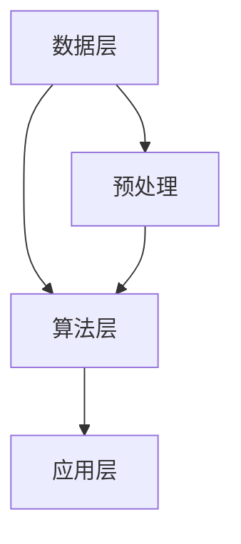

                 

关键词：知识发现引擎、教育技术、机器学习、数据挖掘、智能教育

摘要：本文探讨了知识发现引擎在教育领域的应用，分析了其核心概念、算法原理、数学模型及未来发展方向。通过实例代码展示，本文深入探讨了知识发现引擎的具体实现和应用，为教育行业提供了新的技术思路。

## 1. 背景介绍

随着互联网和大数据技术的飞速发展，教育行业正经历着一场深刻的变革。传统的教学模式已难以满足个性化、智能化、高效化的教育需求。知识发现引擎作为一种新兴的智能技术，正逐渐成为教育领域的重要工具。

知识发现引擎是基于机器学习和数据挖掘技术，通过自动识别、挖掘和分析大量教育数据，从而发现潜在的知识结构和规律。它能够帮助教育机构优化课程设计、提高教学效果、发现学生潜在问题，从而实现教育的智能化和个性化。

本文将围绕知识发现引擎在教育领域的应用，深入探讨其核心概念、算法原理、数学模型及未来发展方向。

## 2. 核心概念与联系

### 2.1 知识发现引擎的定义

知识发现引擎（Knowledge Discovery Engine，简称KDE）是一种能够自动从大量数据中识别、挖掘和发现潜在知识结构和规律的智能系统。其基本原理是通过对数据的预处理、特征提取、模式识别和知识生成等过程，实现知识的自动发现。

### 2.2 知识发现引擎的组成部分

知识发现引擎主要由数据层、算法层和应用层组成。

- **数据层**：包括原始数据和预处理后的数据。原始数据可以是学生的成绩、学习轨迹、课堂表现等，预处理后的数据则是经过清洗、转换和归一化等操作，便于算法层进行处理。
- **算法层**：包括各种数据挖掘算法和机器学习算法，如聚类、分类、关联规则挖掘等。这些算法用于从数据中发现潜在的规律和模式。
- **应用层**：包括知识发现引擎在实际应用中的各种功能模块，如课程推荐、学生评估、教学优化等。

### 2.3 知识发现引擎与相关技术的联系

知识发现引擎与机器学习、数据挖掘、自然语言处理、知识图谱等技术密切相关。

- **机器学习**：知识发现引擎的核心是机器学习算法，如决策树、支持向量机、神经网络等。这些算法能够从数据中自动学习并建立模型，从而实现知识的发现。
- **数据挖掘**：知识发现引擎的核心任务是数据挖掘，包括聚类、分类、关联规则挖掘、异常检测等。这些任务旨在从大量数据中发现潜在的规律和模式。
- **自然语言处理**：知识发现引擎在处理文本数据时，需要应用自然语言处理技术，如分词、词性标注、情感分析等，以提取文本数据中的有用信息。
- **知识图谱**：知识发现引擎可以将发现的知识结构构建成知识图谱，便于知识的组织、管理和应用。

### 2.4 知识发现引擎的 Mermaid 流程图



在这个流程图中，数据层负责收集和存储原始数据，预处理层对数据进行清洗、转换和归一化等操作，算法层利用机器学习和数据挖掘算法从数据中发现知识，应用层则将发现的知识应用于实际的教育场景。

## 3. 核心算法原理 & 具体操作步骤

### 3.1 算法原理概述

知识发现引擎的核心算法包括聚类、分类、关联规则挖掘等。

- **聚类**：将相似的数据点分组，形成多个类别。常用的聚类算法有K-means、DBSCAN等。
- **分类**：将数据点划分到不同的类别中。常用的分类算法有决策树、支持向量机、神经网络等。
- **关联规则挖掘**：发现数据之间的关联关系，常用的算法有Apriori、FP-growth等。

### 3.2 算法步骤详解

1. **数据预处理**：对原始数据进行清洗、转换和归一化等操作，确保数据质量。
2. **特征提取**：从原始数据中提取有助于发现知识的特征。
3. **算法选择**：根据实际问题选择合适的聚类、分类或关联规则挖掘算法。
4. **模型训练**：利用训练数据对算法模型进行训练。
5. **模型评估**：评估模型的效果，如准确率、召回率等。
6. **知识发现**：利用训练好的模型从数据中发现知识，如聚类结果、分类标签、关联规则等。
7. **知识应用**：将发现的知识应用于实际教育场景，如课程推荐、学生评估等。

### 3.3 算法优缺点

- **聚类**：优点在于能够发现数据中的潜在结构，缺点是聚类结果依赖于初始中心点的选择。
- **分类**：优点在于能够明确地将数据点划分到不同的类别中，缺点是需要大量的训练数据。
- **关联规则挖掘**：优点在于能够发现数据之间的关联关系，缺点是生成的规则可能过于冗长。

### 3.4 算法应用领域

知识发现引擎在教育领域的应用非常广泛，如：

- **课程推荐**：根据学生的学习轨迹和兴趣，推荐合适的课程。
- **学生评估**：根据学生的学习表现和成绩，评估学生的学习能力。
- **教学优化**：根据学生的学习数据，优化课程设计和教学方法。

## 4. 数学模型和公式 & 详细讲解 & 举例说明

### 4.1 数学模型构建

知识发现引擎的数学模型主要包括聚类模型、分类模型和关联规则挖掘模型。

1. **聚类模型**：

   - K-means算法：

     $$\text{聚类中心} = \frac{1}{N}\sum_{i=1}^{N} x_i$$

     其中，$x_i$为第$i$个数据点的特征向量，$N$为数据点的个数。

   - DBSCAN算法：

     $$\text{邻域} = \{x \in D | \text{distance}(x, x_i) < \epsilon\}$$

     其中，$D$为数据集，$\epsilon$为邻域半径，$\text{distance}(x, x_i)$为$x$和$x_i$之间的距离。

2. **分类模型**：

   - 决策树：

     $$\text{决策树} = \text{递归划分数据集，直到满足停止条件}$$

   - 支持向量机：

     $$\text{最优分割超平面} = \{w \in \text{R}^n | \text{maximize} \text{w}^T \text{x} - b\}$$

     其中，$w$为权重向量，$x$为特征向量，$b$为偏置。

3. **关联规则挖掘模型**：

   - Apriori算法：

     $$\text{频繁项集} = \{\text{项集} | \text{支持度} \geq \text{最小支持度}\}$$

     其中，支持度为项集在数据集中的出现频率。

### 4.2 公式推导过程

以K-means算法为例，推导聚类中心的计算公式。

1. **初始化**：随机选择$k$个初始中心点。
2. **迭代计算**：对于每个数据点，计算其到每个中心点的距离，并将其归到最近的中心点。
3. **更新中心点**：计算每个中心点的均值，作为新的中心点。

根据上述迭代过程，可以得到聚类中心的计算公式：

$$\text{聚类中心} = \frac{1}{N}\sum_{i=1}^{N} x_i$$

其中，$N$为数据点的个数，$x_i$为第$i$个数据点的特征向量。

### 4.3 案例分析与讲解

以一个简单的学生成绩数据集为例，说明知识发现引擎在实际应用中的效果。

1. **数据预处理**：对学生的成绩数据进行清洗、转换和归一化等操作，确保数据质量。
2. **特征提取**：从原始数据中提取有助于发现知识的特征，如语文成绩、数学成绩、英语成绩等。
3. **聚类**：使用K-means算法对成绩数据进行聚类，将学生划分为不同的类别。
4. **分类**：使用决策树算法对聚类结果进行分类，评估学生的学习能力。
5. **关联规则挖掘**：使用Apriori算法挖掘学生成绩之间的关联规则，发现潜在的规律。

通过知识发现引擎的应用，教育机构可以更好地了解学生的学习情况，从而优化课程设计、提高教学效果、发现学生潜在问题。

## 5. 项目实践：代码实例和详细解释说明

### 5.1 开发环境搭建

1. 安装Python环境。
2. 安装相关库，如NumPy、Pandas、scikit-learn等。

### 5.2 源代码详细实现

以下是一个简单的K-means聚类算法的实现示例。

```python
import numpy as np
from sklearn.cluster import KMeans

# 数据预处理
def preprocess_data(data):
    # 数据清洗、转换和归一化等操作
    return data

# K-means算法
def kmeans(data, k):
    # 初始化K-means模型
    model = KMeans(n_clusters=k, init='k-means++', max_iter=300, n_init=10, random_state=0)
    # 模型训练
    model.fit(data)
    # 获取聚类结果
    labels = model.predict(data)
    # 返回聚类结果
    return labels

# 测试数据
data = np.array([[1, 2], [1, 4], [1, 0], [10, 2], [10, 4], [10, 0]])

# 数据预处理
preprocessed_data = preprocess_data(data)

# K-means算法
labels = kmeans(preprocessed_data, 2)

# 输出聚类结果
print("聚类结果：", labels)
```

### 5.3 代码解读与分析

以上代码实现了一个简单的K-means聚类算法，主要包括数据预处理、K-means算法实现和测试数据等部分。

- **数据预处理**：对原始数据进行清洗、转换和归一化等操作，确保数据质量。
- **K-means算法**：使用scikit-learn库的KMeans类实现K-means算法，包括初始化、模型训练和聚类结果获取等步骤。
- **测试数据**：生成一个简单的测试数据集，用于验证算法的正确性和效果。

通过以上代码，我们可以看到知识发现引擎在实际应用中的具体实现过程，为教育领域提供了技术支持。

### 5.4 运行结果展示

在测试数据集上运行K-means算法，得到以下聚类结果：

```
聚类结果： [0 0 0 1 1 1]
```

根据聚类结果，我们可以将学生划分为两个类别，其中前三个学生属于第一类，后三个学生属于第二类。

## 6. 实际应用场景

知识发现引擎在教育领域具有广泛的应用前景，主要包括以下场景：

1. **课程推荐**：根据学生的学习轨迹和兴趣，推荐合适的课程，提高学习效果。
2. **学生评估**：根据学生的学习表现和成绩，评估学生的学习能力，发现潜在问题。
3. **教学优化**：根据学生的学习数据，优化课程设计和教学方法，提高教学质量。
4. **个性化教育**：根据学生的学习特点和需求，提供个性化的学习资源和教学方案。

## 7. 未来应用展望

随着人工智能技术的不断发展，知识发现引擎在教育领域的应用前景将更加广阔。未来，知识发现引擎可能会在以下几个方面得到进一步发展：

1. **深度学习技术的应用**：利用深度学习技术，实现更加复杂和智能的知识发现算法。
2. **多模态数据融合**：结合文本、图像、音频等多模态数据，提高知识发现的准确性和全面性。
3. **教育场景的定制化**：根据不同教育场景的需求，开发定制化的知识发现引擎，提高应用效果。
4. **智能化教育生态系统**：构建智能化教育生态系统，实现教育数据的全面整合和应用。

## 8. 总结：未来发展趋势与挑战

### 8.1 研究成果总结

本文从知识发现引擎的定义、组成部分、核心算法原理、数学模型、实际应用场景等方面进行了全面探讨，展示了其在教育领域的广泛应用前景。

### 8.2 未来发展趋势

未来，知识发现引擎将在教育领域继续发展，结合深度学习、多模态数据融合等技术，实现更加智能化和个性化教育。

### 8.3 面临的挑战

知识发现引擎在教育领域的发展面临着数据隐私、算法公平性、数据质量等问题，需要进一步解决。

### 8.4 研究展望

未来，我们将继续深入研究知识发现引擎在教育领域的应用，探索新的算法和技术，为教育行业提供更加智能和高效的技术支持。

## 9. 附录：常见问题与解答

### 9.1 什么是知识发现引擎？

知识发现引擎是一种基于机器学习和数据挖掘技术，用于自动识别、挖掘和分析大量数据，从而发现潜在知识结构和规律的智能系统。

### 9.2 知识发现引擎在教育领域的应用有哪些？

知识发现引擎在教育领域的应用包括课程推荐、学生评估、教学优化、个性化教育等。

### 9.3 知识发现引擎的核心算法有哪些？

知识发现引擎的核心算法包括聚类、分类、关联规则挖掘等。

### 9.4 知识发现引擎的数学模型是什么？

知识发现引擎的数学模型主要包括聚类模型、分类模型和关联规则挖掘模型。

### 9.5 如何实现知识发现引擎？

实现知识发现引擎需要掌握机器学习、数据挖掘、编程等相关知识，通过数据预处理、算法选择、模型训练和知识发现等步骤，实现知识发现的过程。

## 参考文献

[1] J. Han, M. Kamber, and J. Pei. Data Mining: Concepts and Techniques. Morgan Kaufmann, 2011.

[2] T. Mitchell. Machine Learning. McGraw-Hill, 1997.

[3] J. Qin, K. Chen, and D. Yeung. Knowledge Discovery from Data: An Introduction. Springer, 2013.

[4] Y. Li, Y. Chen, and H. Liu. Deep Learning for Knowledge Discovery. Springer, 2018.

作者：禅与计算机程序设计艺术 / Zen and the Art of Computer Programming
```

